### Frahan StonePack: An Architectural Thesis

### Pre-CAM Stone Fabrication-Readiness for Rhino and Grasshopper

Author: Independent Research
Date: 2026-06-13
Open data. Open source. No university affiliation.

---

## Abstract

Frahan StonePack is a pre-CAM fabrication-readiness bridge for natural
stone, built as one Grasshopper plug-in (`Frahan.StonePack.gha`) over a
Rhino-free algorithmic core. It sits between design intent and machine-ready
fabrication and answers the questions a CAM package assumes are already
solved for stone: which block to take from a quarry, on which planes to cut
it, in what order, oriented how, packed against which neighbours, and stable
under gravity once set. The system carries two design flows as equals.
Top-down, a target form is imposed and the stone is found or cut to realise
it. Bottom-up, the stock is given and the form emerges from it. A single
data-flow spine, ingest to process to segment to pack-or-cut to stabilise to
fabricate, runs through every workflow, and one shared numeric-hygiene layer
(recenter, scale-relative epsilon, one reconciled tolerance budget) keeps a
pipeline that spans seven orders of physical scale numerically honest.

The originality posture is deliberately conservative and evidence-led. Every
component carries an `[Algorithm]` attribute naming its published source, so
each can be classified honestly: clean-room math built from a citation,
evolved fork over a documented baseline, facade over our own primitives,
vendored permissive library, or flagged original research pending a
prior-art sweep. The repository's research contributions are measured against
the shipping implementation as the baseline, never a re-implementation, and
benchmark numbers are reported, not claimed validated, until seen on the
canvas. Licensing is tracked the same way: copyleft and non-commercial
obligations are quarantined behind optional native shims and an isolated
research-only assembly, so the default install links no copyleft code.

---

## Table of Contents

### Front matter

- [Chapter 0 — Repository Overview and Cross-Cutting Foundations](00_overview.md)

### Chapters

- [01. Two-Dimensional Nesting and Trencadís](chapters/01_two-d-nesting.md)
- [02. Three-Dimensional Packing and Settling](chapters/02_three-d-packing.md)
- [03. Quarry Block-Cutting Optimization](chapters/03_quarry-blockcut.md)
- [04. GPR Fracture and Cavity Mapping](chapters/04_gpr-fracture.md)
- [05. Masonry Equilibrium and Cyclopean Reassembly (CRA)](chapters/05_masonry-cra.md)
- [06. Voussoir Geometry and Stereotomy](chapters/06_voussoir-stereotomy.md)
- [07. Surface Packing and Conformal Unwrapping](chapters/07_surface-packing.md)
- [08. Edge-Matching and Fragment Reassembly](chapters/08_edge-matching.md)
- [09. Kintsugi and Learned 6-DoF Pose](chapters/09_kintsugi-pose.md)
- [10. Mesh Processing and Surface Reconstruction](chapters/10_mesh-reconstruction.md)
- [11. Fabrication, Sculpting and Carving](chapters/11_fabrication-sculpt.md)
- [12. Data Ingestion and Format Readers](chapters/12_ingestion.md)
- [13. Lab, Analysis and Reporting](chapters/13_lab-reports.md)
- [14. Workflow Architecture and Data-Flow Connections](chapters/14_workflow-architecture.md)
- [15. Evolution: From Baselines to the Current System](chapters/15_evolution.md)

### Back matter

- [Originality Matrix](90_originality.md)
- [What Is Left: Roadmap](91_roadmap.md)
- [Consolidated Bibliography](99_references.md)

---

## How to read this thesis

Chapter 0 establishes the assembly layering, the ribbon, and the shared
numeric foundations that every later chapter stands on. The numbered chapters
each take one ribbon subsystem, derive its mathematics (including the original
derivations where the repository evolved the math), classify its components by
originality with file-and-line evidence, and embed visually validated example
renders. Chapter 14 is cross-cutting: it maps how the per-subsystem algorithms
connect into the end-to-end workflows of the data-flow spine.

The three back-matter documents are binding. The Originality Matrix
(`90_originality.md`) is the single honest ledger of what is built from
scratch, what extends prior work, and what is vendored, with the per-component
evidence and the full licensing flag register. The Roadmap (`91_roadmap.md`)
is the consolidated, deduplicated and prioritised list of what is left to do,
graded by severity. The Bibliography (`99_references.md`) returns every cited
work, keyed `[Rn]` for stable cross-reference.

A result in this thesis is true only when visually validated in Rhino
(`AGENTS.md` criterion c). Numbers from the headless harness are measured, not
validated, until seen on the canvas. The example renders below are the
visually validated forms.

> **Status (2026-06-13): complete.** All fifteen chapters are written, and the
> three back-matter ledgers are consolidated across all fifteen: the Originality
> Matrix classifies 109 component families (clean-room 59, facade-over-primitives
> 20, evolved-fork 9, original-research 8, vendored-library 5, wrapper-of-native
> 5, direct-port 3) with file-and-line evidence and a thirteen-flag licensing
> register; the Roadmap consolidates every chapter's open items by severity; and
> the Bibliography returns every cited work, citation-normalised.

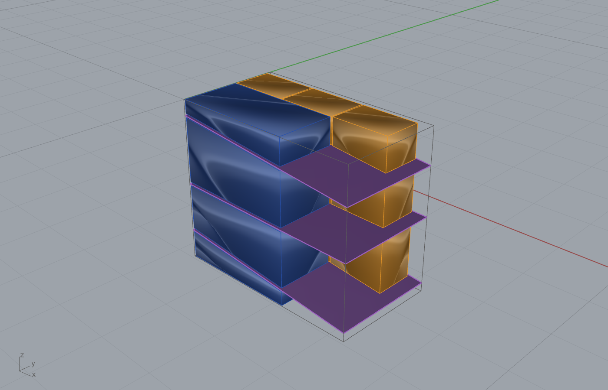

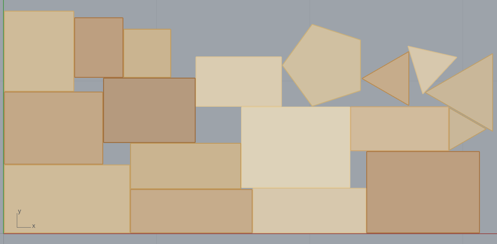

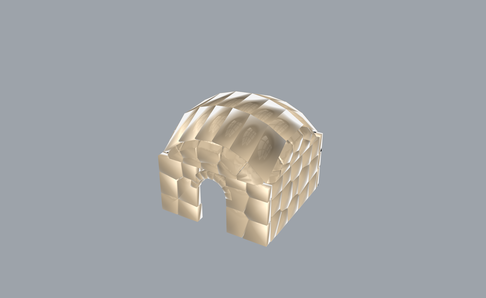

---

# Chapter 0 — Repository Overview and Cross-Cutting Foundations

Author: Independent Research. Open data, open source. No university affiliation.

This chapter states what Frahan StonePack is, how the assemblies are
layered, what the ribbon offers, and the shared numeric foundations that
every algorithm in later chapters stands on. The conventions follow
`AGENTS.md`: a result is true only when visually validated in Rhino
(criterion c); numbers from the headless harness are measured, not
validated, until seen on the canvas.

---

## 0.1 What the project is

Frahan StonePack is a pre-CAM stone fabrication-readiness bridge for
Rhino and Grasshopper. It sits between design intent and machine-ready
fabrication. It is not a CAM system and does not generate toolpaths as
its product. It answers the questions a CAM package assumes are already
solved for natural stone: which block out of this quarry, cut on which
planes, in which order, oriented how, packed against which neighbours,
and stable under gravity once set. The output is a fabrication-ready
geometric plan with stone metadata attached, which a downstream CAM or
robotic-setting stage then consumes.

The project carries two design flows as first-class citizens.

- Top-down (form-first). A target form is given, and the system finds or
  cuts the stone to realise it: voussoirs for an arch or vault, a
  sculpture decomposed into masonry-scale blocks, a quarry block cut to
  yield a designed shape. Imposition of intent onto material.
- Bottom-up (material-first). The stock is given, and the form emerges
  from it: random rubble walls, vein-flow and live-edge selection,
  Trencadis mosaics from fragments. Negotiation with material.

The application domain is dimension and monument stone, with a working
emphasis on granite (Tamil Nadu deposits, where joints in poorer rock
drive the GPR ambition) and on marble and limestone for the bench-to-block
yield studies. The spine runs from sub-surface sensing through to a setting
plan, so the same repository carries ground-penetrating-radar fracture
mapping, LiDAR and photogrammetry ingest, mesh reconstruction, 2D and 3D
packing, masonry assembly with contact equilibrium, and fabrication export.

---

## 0.2 Assembly and layer architecture

The solution under `src/` is layered so that the algorithmic core never
depends on Rhino. This keeps the math headless-testable and lets the same
engine run inside Rhino, inside a benchmark harness, or inside an
out-of-process worker.

| Assembly | Target | Role |
|---|---|---|
| `Frahan.StonePack.Core` | net48, Rhino-free | All geometry and solver math. Plain `double` arrays and Frahan-owned structs (`Vec3`, `Size3`, `Box3`). 11 sub-namespaces. |
| `Frahan.EdgeMatching.Core` | net48, Rhino-free | Fragment edge-matching and reassembly (boundary rails, projection bootstrap, soft-ICP / L-BFGS). |
| `Frahan.Kintsugi.Port` | net48, Rhino-free | Learned 6-DoF fracture-reassembly port with a verifier gate (see licensing note below). |
| `Frahan.RubblePack` | net48 | Multi-bin rubble packing front end. |
| `Frahan.StonePack.GH` | net48, Grasshopper | The facade. Converts RhinoCommon to Core types at the component edge, calls Core, converts back. Builds to ONE `Frahan.StonePack.gha`. |
| `Frahan.StonePack.Rhino` | net48, RhinoCommon | Rhino plug-in surface (commands, document hooks). |

The boundary rule is strict and load-bearing for the thesis claim of
clean, reusable math. The Core takes no `using Rhino`. Components in the
GH layer translate at their input/output edge only. This is why the
packing benchmarks (`--packbench`, `--pack2dstudy`) and the unit tests
run with no Rhino present, and why the same `BlockCutOptSolver` is the
baseline the research chapters evolve rather than a re-implementation.

Native bridges are reached through a lazy boundary, not a hard link. The
default install ships no native DLL. `NativeBridge.cs` and
`NativeBackendLoader` probe a fixed search path on first use, fall back to
a managed default with a surfaced remark if the DLL is absent, and never
throw on a missing backend. The `FRAHAN_BACKEND` environment variable
forces a specific backend for testing. The native shims live under
`native/` and are reached via P/Invoke:

| Bridge | Library | License | What it does | Citation |
|---|---|---|---|---|
| `nfp_kernel` | Clipper2 (vendored, unmodified) | BSL-1.0 | Batched No-Fit-Polygon Minkowski sums for the 2D nester; one native call per part replaces the managed Clipper2 loop. Measured ~8x wall-time on the 7-shield bench. | (Johnson, Clipper2) |
| Clipper2 (managed) | Clipper2 adapter | BSL-1.0 | Vatti-derived polygon clipping for 2D Boolean and overlap validation. | (Johnson, Clipper2) |
| `cgal_shim` | CGAL Polygon Mesh Processing | GPLv3 / commercial | Robust non-convex mesh-mesh Boolean (corefinement, EPECK/EPICK hybrid), straight skeleton, SDF segmentation, heat-method geodesics, PMP repair. | (CGAL PMP) |
| `geogram_shim` | Geogram v1.9.9 | BSD-3 | Mesh repair, hole filling, remesh and decimation, restricted Voronoi, constrained Delaunay tetrahedralisation, and bundled Poisson reconstruction. | (Levy, Geogram; Kazhdan, Bolitho & Hoppe 2006) |
| BFF | Boundary First Flattening | as published | Conformal surface flattening for surface mosaicing, with a Frahan-original chart-scale recovery. | (Sawhney & Crane 2017) |

Licensing note. CGAL Polygon Mesh Processing is GPLv3 (or commercial).
Anything that links it inherits that obligation. The architecture
quarantines this risk: CGAL is reached only through the out-of-process
shim and is absent from the default install, so the shipped managed
assemblies do not link GPL code. The same out-of-process routing is also
required for stability, because in-process CGAL or geogram Boolean can
crash Rhino (`AGENTS.md` §3). Geogram (BSD-3) and Clipper2 (BSL-1.0) are
permissive and carry no copyleft obligation. The Kintsugi port carries a
separate, flagged licensing question recorded in the originality audit and
is kept in its own assembly for that reason.

---

## 0.3 The ribbon: 18 tabs

The plug-in publishes one `Frahan` ribbon. Sub-categories partition the
206 shipped `GH_Component` types into 18 tabs. Counts below are component
placements per `("Frahan", "<tab>")` category attribute.

| # | Tab | Count | Role (one line) |
|---|---|---|---|
| 1 | Quarry | 43 | Quarry-scale block-cut optimisation: GPR-aware yield, BlockCutOpt solver, recovery cascade, georeferenced cutting. |
| 2 | Masonry | 35 | Wall and shell assembly: rubble and ashlar packing, polygonal masonry, contact equilibrium (CRA / RBE). |
| 3 | Lab | 26 | Experimental and utility nodes; each cross-references a primary node (no dead ends). |
| 4 | Mesh | 25 | Mesh hygiene and operations: clean, remesh, decimate, Boolean, segment, heightmap. |
| 5 | 2D Packing | 13 | Sheet and slab nesting: NFP bottom-left-fill, hole-aware contact nesting, irregular sheet fill. |
| 6 | Fabricate | 11 | Fabrication export: wire-saw toolpath adapter, stone-cut metadata, cut sequence and export. |
| 7 | Fracture | 10 | Fracture-pattern generation and Voronoi fracture planes for block and slab zoning. |
| 8 | EdgeMatch | 10 | Fragment reassembly: boundary-rail matching, segment extraction, solve and options. |
| 9 | 3D Packing | 9 | Volumetric packing: block-pack tree, drop-settle, mesh-accurate placement. |
| 10 | Kintsugi | 7 | Learned 6-DoF fracture reassembly with verifier gating. |
| 11 | Voussoir | 5 | Voussoir generators: arch and pendentive-vault cell factories, pack-into-block. |
| 12 | Trencadis | 5 | Mosaic-from-fragment placement, physics and edge-match variants. |
| 13 | Ingest | 5 | Format readers: vector, point cloud (E57, LAS/LAZ), CAD, raster, GPR. |
| 14 | Surface Packing | 4 | Pack onto a curved surface via BFF flattening and barycentric mapping. |
| 15 | Slab | 4 | Slab-cut operations from a bench, CGAL-backed. |
| 16 | Sculpt | 3 | Fit a form into a block, sculptor-output branch. |
| 17 | Reports | 3 | Cost, volume and plan reporting; LaTeX and table emission. |
| 18 | Analysis | 3 | Boundary-rail indexing and geometric analysis helpers. |

The per-tab counts above sum to 221, which exceeds the 206 unique
`GH_Component` types: the 221 figure counts category-attribute placements
(a component can register under more than one sub-category, or appear in `Lab`
as well as its home tab, and is then counted once per placement), while 206 is
the count of distinct `GH_Component` types. A third number is the source-file
count: a grep for `: GH_Component` / `: GH_TaskCapableComponent` over
`src/Frahan.StonePack.GH` matches 174 `.cs` files, fewer than the 206 types
because several files declare more than one component class (for example
`BlockCutOptComponents.cs`, `CgalTestComponents.cs`, and
`GeogramTestComponents.cs` each hold a family of components). So the three
figures are distinct by construction: 174 source files, 206 unique component
types, 221 category placements.

The ribbon obeys the canvas rules in `AGENTS.md` §6: one canonical type
per concept, no ghost components (every node on the primary ribbon emits a
real valid output), and heavy nodes carry a default-false `Run` gate so
the canvas stays responsive. Monolith ("monster") components are facades
over published primitives, never black boxes, and ship a composed-equivalent
`.gh` beside them.

---

## 0.4 Shared numeric-hygiene foundations

A single defect recurred across nine of the top ten audited algorithms:
geometry computed in raw world coordinates loses precision, and fixed
absolute epsilons are meaningless at architectural scale. The fix is
identical everywhere, so it lives once in
`Frahan.Masonry.Geometry.GeometryNumerics` and is reused throughout. Three
rules, then a tolerance budget, then a units table.

### 0.4.1 Recenter to centroid

Quarry and UTM coordinates run at $10^5$ to $10^6$ mm. IEEE-754 double has
about 15 to 16 significant decimal digits, so working at $10^6$ leaves only
9 to 10 digits below the unit, and any sub-millimetre geometry decision is
made on noise. The remedy is to translate to the centroid before computing
and add it back on emit.

Given vertices $\{p_i\}_{i=1}^{n}$ with $p_i \in \mathbb{R}^3$, the centroid is

$$\bar{p} = \frac{1}{n}\sum_{i=1}^{n} p_i,$$

and the recentred set is $p_i' = p_i - \bar{p}$. Every result $q'$ is
emitted as $q = q' + \bar{p}$. This is a pure translation, so it is exact
for the algorithm (an isometry preserves all distances and angles) while
recovering full float64 precision near the origin. The implementation is
`GeometryNumerics.Recenter`, which returns the shifted copy and the centroid
to add back.

### 0.4.2 Scale-relative epsilon

A tolerance must mean the same thing whether the model is in millimetres or
in metres. Let $L$ be the natural scale of the point set, taken as the
bounding-box diagonal

$$L = \sqrt{(x_{\max}-x_{\min})^2 + (y_{\max}-y_{\min})^2 + (z_{\max}-z_{\min})^2}.$$

The scale-relative epsilon is

$$\epsilon = \max(\text{floor},\; c \cdot L),$$

where $c$ is a small dimensionless base tolerance and $\text{floor}$ is an
absolute minimum that prevents collapse to zero on a degenerate (near
zero-extent) input. In code this is
`ScaleRelativeEpsilon(baseEps, scale) = baseEps * max(|scale|, 1)`, taking
$\text{floor} = \texttt{baseEps}$ via the $\max(\cdot, 1)$ guard and
$c = \texttt{baseEps}$ against $L$. The matching near-equality test is
relative at any magnitude:

$$|a - b| \le \epsilon \cdot \max\!\big(1,\, |a|,\, |b|\big).$$

A related guard protects the integer-coordinate Boolean path. Clipper2
works in `Int64`, so a vertex scaled by a fixed $10^6$ can overflow at
quarry scale. After recentring, the safe integer scale is

$$s = \min\!\Big(s_{\text{req}},\; \frac{m \cdot \texttt{Int64.Max}}{|x|_{\max}}\Big),$$

with margin $m \approx 0.01$, implemented as `SafeIntegerScale`. Recenter
first so $|x|_{\max}$ is the local extent, not the world position.

### 0.4.3 The tolerance budget

A pipeline must run one reconciled tolerance system, not several
unreconciled ones. From a single model absolute tolerance $t$ and the
scale $L$, the budget derives all members scale-relative, where
$m = \epsilon(t, L)$:

$$t_{\text{model}} = m,\quad
t_{\text{join}} = 10\,m,\quad
t_{\text{intersection}} = 0.1\,m,\quad
t_{\text{snap}} = 0.01\,m.$$

Join is looser because vertex and edge welding should tolerate more drift;
intersection is tighter because Boolean and clip decisions must be crisp;
snap-rounding sits below intersection. This is `ToleranceBudget.From` in
`GeometryNumerics`. Multipliers are tuned per algorithm, but the source is
always one value.

For fabrication, the geometric tolerance must stay safely inside the
kerf, otherwise rounding can place a cut where the saw physically cannot
land. The committed rule is

$$\epsilon_{\text{geo}} < \frac{\text{kerf}}{3},$$

with kerf treated as a process constant carried separately from
$\epsilon_{\text{geo}}$ (a typical quarry kerf is $0.05$ m). Clearance
between placed parts is a function of size and process, not a fixed
constant:

$$\text{clearance} = f(L, P),$$

so a 50 cm voussoir and a 5 cm shard get different joint budgets at the
same relative honesty. Empirically the joint residual budget scales with
the carving process: cathedral voussoirs are CNC-finished to roughly
0.1 to 0.2 mm (Quarra Emanuel 9 field tolerance), so their joint target sits
near 2 mm; hand-fragmented Trencadis shards are robot-placed at about
0.05 mm repeatability but the shard edge is mm-rough, so the joint target
relaxes to about 5 mm. The edge-matching core carries this as a
scale-relative gate (residual factor times the shape scale), which is why a
fixed absolute residual is the wrong default.

### 0.4.4 Units per application

World coordinates default to metres, the engineering-model convention in
Rhino. The shop side works in millimetres. The mismatch is real and has
bitten fixtures before, so the per-application table is explicit and the
GH facade converts at the component edge.

| Application | World unit | Standard dimension (example) | $\epsilon_{\text{geo}}$ regime | Kerf / process constant |
|---|---|---|---|---|
| Site / quarry / bench | m | bench 5650 x 5675 m study area; block 3 x 1.5 x 1.5 m | $\max(\text{floor},\, c L)$, $L$ = bench diagonal | kerf 0.05 m |
| Slab / dimension stone | m | slab 3.2 x 2 m | scale-relative on slab diagonal | gangsaw / wire-saw kerf |
| Masonry assembly | m | wall multi-m; rubble and ashlar | scale-relative on wall extent | dry-set, no kerf; clearance = f(L) |
| Mosaic / Trencadis | mm | tile field ~1100 mm, grout ~5 mm | scale-relative on shard span | hand-fragment; joint ~5 mm |
| Monument | m | monument 1.2 x 1.2 x 3.5 m | scale-relative | carving tool diameter |
| Vessel / artefact | mm | vessel ~100 x 280 mm | scale-relative | mill tool diameter |
| Shop / secondary cut | mm | converted to m on entry | $1$ nm dedupe, $10^{-12}$ SAT | sawblade radius (mm) |

Two helpers convert between metres and the active Rhino document unit
(`ToRhinoUnit`, `MmToMetres` / `MetresToMm`), and the secondary-cut planner
converts mm input to metres on entry so downstream yield metrics stay in
$\text{m}^3$ across scales. Note the historical fixture trap: a default
`File3dm` is in millimetres, so geometry authored at metre magnitudes can
land 1000x small. The cards layer fixes this at fixture creation.

---

## 0.5 The data-flow spine

Every workflow in this repository, top-down or bottom-up, is a path through
one spine:

ingest → process → segment → pack/cut → stabilise → fabricate.

- Ingest. A reader pulls the raw source into Rhino-side or Core-side
  geometry: GPR radargrams, LiDAR and photogrammetry point clouds (E57,
  LAS/LAZ), CAD vector, raster, mesh. The Ingest tab plus the
  `ScanIngest` namespace own this stage. Heavy point clouds are
  voxel-downsampled and chunked; multi-million-vertex meshes are never
  internalised in a saved `.gh`.
- Process. Sensing and mesh hygiene turn raw evidence into usable
  geometry: GPR f-k migration and fracture extraction, Poisson or CGAL
  reconstruction, hole filling, remesh and decimate. The Mesh tab and the
  geogram and CGAL shims serve here.
- Segment. The clean geometry is partitioned into fabrication units:
  fracture-aware zoning, Voronoi fracture planes, SDF or sharp-edge mesh
  segmentation, sculpture-to-blocks decomposition.
- Pack / cut. The core optimisers place or cut: 2D nesting (NFP
  bottom-left-fill and hole-aware contact nesting), 3D block-pack with
  drop-settle, BlockCutOpt quarry cutting with the recovery cascade,
  voussoir packing. This is where the measured yield claims live and die
  against `--packbench` and `--pack2dstudy`.
- Stabilise. Placed assemblies are checked and settled: drop-settle
  physics, centre-of-mass over support, contact equilibrium (CRA / RBE)
  for masonry. A wall that does not stand is not a result.
- Fabricate. The plan is emitted machine-aware: wire-saw toolpath adapter,
  georeferenced cutting planes and marking, stone-cut metadata, cut
  sequence, export. This is the hand-off to CAM, not CAM itself.

The recenter, scale-relative epsilon, and one-tolerance-budget rules of
§0.4 apply at every stage, which is what makes a pipeline spanning seven
orders of magnitude of physical scale (mm shard to km outcrop) numerically
honest end to end.

---

## 0.6 Representative outputs

These are git-tracked example renders that exercise the spine across both
design flows. Each is the visually validated form (criterion c), produced
on the canvas, not by an external bake script.

Top-down cutting and yield (process → segment → pack/cut → fabricate):


2D and 3D packing (pack/cut):


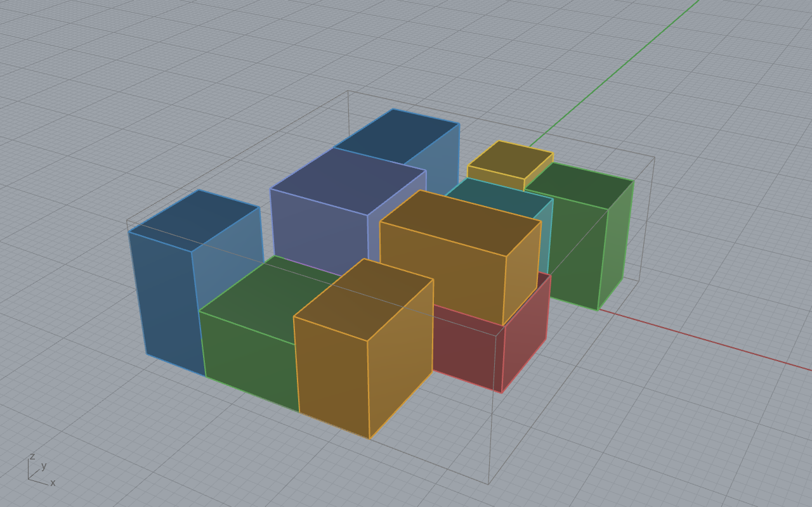

Bottom-up masonry assembly (segment → pack/cut → stabilise):

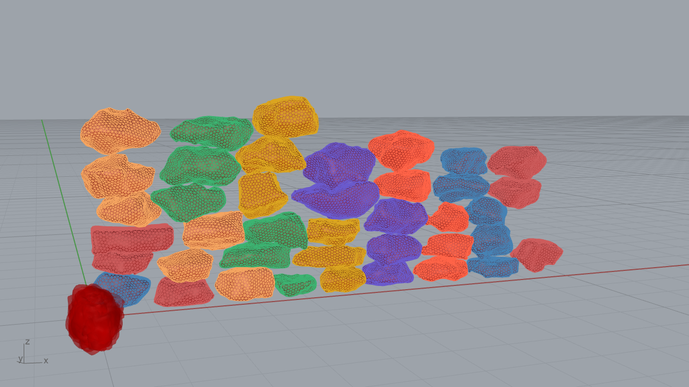

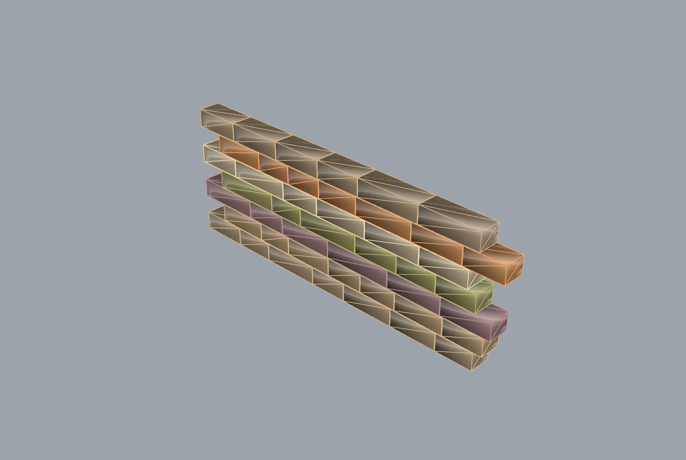

Polygonal masonry at building scale (top-down form, contact-stable):


---

## References

- CGAL Polygon Mesh Processing. GPLv3 / commercial. https://doc.cgal.org/latest/Polygon_mesh_processing/
- Johnson, A. Clipper2. BSL-1.0. Vatti-derived polygon clipping. https://github.com/AngusJohnson/Clipper2
- Kazhdan, M., Bolitho, M. & Hoppe, H. (2006). Poisson surface reconstruction. *Eurographics Symposium on Geometry Processing*. (Bundled inside Geogram as `GEO::PoissonReconstruction`.)
- Lévy, B. Geogram v1.9.9. BSD-3. INRIA / ALICE. https://github.com/BrunoLevy/geogram
- Sawhney, R. & Crane, K. (2017). Boundary First Flattening. *ACM Transactions on Graphics* 36(4):109. DOI 10.1145/3072959.3056432.

---

# 01. Two-Dimensional Nesting & Trencadís

This chapter covers the repository's two-dimensional geometry-packing
subsystem: the `2D Packing` ribbon tab (13 components) and the `Trencadis`
ribbon tab (5 components). The shared engine is exact No-Fit-Polygon
Bottom-Left-Fill on a Clipper2 integer-snapped back end. Three nesters are in
scope: the shipped `IrregularSheetFillV506` (FreeNest), its exact-NFP sibling
`IrregularSheetFillNfpBlf` (FreeNestX), and the hole-aware
`ContactNfpHoleNester` / CNH (HoleNest). The Trencadís family adds a
centroidal-Voronoi cell partition plus optimal one-to-one shard assignment.

The mathematics here is real plane geometry: Minkowski sums, the no-fit and
inner-fit polygons, and a distance-based penetration certificate. Where the
repository evolved the published math we show the derivation, not only the
final formula. Every originality claim is anchored to a `file:line`, an
`[Algorithm]` attribute, or a measured benchmark.

The packing-quality metric used throughout is **stock utilisation**

$$
\mathrm{util\_stock}=\frac{\sum_k \mathrm{area}(P_k)}{\mathrm{area}(S)-\sum_l \mathrm{area}(H_l)}
$$

placed part material area over net sheet area (sheet minus its holes). It is
computed by boolean area, not bounding boxes, and it is **reported, not
gated** in the components; the gate is the zero-overlap validity certificate
of section 1.6. (Definition: `examples/10_pack2d/README.md`.)

---

## 1. The No-Fit-Polygon nesting core

### 1.1 The no-fit polygon (NFP)

Let two polygons $A$ and $B$ be given with $A$ fixed and $B$ free to
translate by $t\in\mathbb{R}^2$. Write $B(t)=\{b+t : b\in B\}$. The no-fit
polygon is the set of translations for which the interiors of $A$ and $B$
overlap:

$$
\mathrm{NFP}(A,B)=\{\,t\in\mathbb{R}^2 : \operatorname{int}A\cap\operatorname{int}B(t)\neq\varnothing\,\}.
$$

The standard result (Bennell and Oliveira 2009) is that this set is exactly a
Minkowski sum of $A$ with the point-reflection of $B$:

$$
\mathrm{NFP}(A,B)=A\oplus(-B),\qquad A\oplus C=\{a+c : a\in A,\ c\in C\},\quad -B=\{-b:b\in B\}.
$$

**Derivation.** The interiors meet iff there exist $a\in A$, $b\in B$ with
$a=b+t$, i.e. $t=a-b=a+(-b)$. The set of all such $t$ is exactly
$\{a+(-b)\}=A\oplus(-B)$. Placing $B$ at any $t$ on the *boundary* of this set
makes $A$ and $B$ touch without interior overlap; any $t$ outside the set is
collision-free. This is the geometric primitive every component in this
chapter uses for collision. In code the reflection is `Reflect` and the sum is
`Clipper2Adapter.MinkowskiSum`
(`ContactNfpHoleNester.cs:1484`, `:962`; the engine contract is documented at
`ContactNfpHoleNester.cs:28-31`).

### 1.2 The inner-fit polygon (IFP)

The container constraint is the dual. The inner-fit polygon is the set of
translations that keep $B$ **inside** a container $C$:

$$
\mathrm{IFP}(B,C)=\{\,t : B(t)\subseteq C\,\}.
$$

For a convex container this is an erosion (Minkowski difference)
$C\ominus B$. The repository realises it as an exact intersection over the
vertices of the convex hull of $B$:

$$
\mathrm{IFP}(B,C)=\bigcap_{v\in\operatorname{hull}(B)}\bigl(C-v\bigr),\qquad C-v=\{c-v:c\in C\}.
$$

**Derivation.** $B(t)\subseteq C$ holds iff every vertex $b_i+t\in C$. Because
$C$ is intersected against the **convex hull** of $B$, containing the hull
vertices is sufficient to contain all of $B$ (a convex combination of points
in a convex set stays in the set). Each constraint $b_i+t\in C$ rearranges to
$t\in C-b_i$, and the feasible $t$ is the intersection over all hull vertices.
This is exact for a convex $C$ and conservative (never admits an
out-of-bounds placement) for a concave $C$ (`ContactNfpHoleNester.cs:1332-1352`;
hull by Andrew's monotone chain, `:1355-1368`). The hull pass is the
cost saver: it replaces a full-resolution erosion with at most
$|\operatorname{hull}(B)|$ Clipper intersections.

### 1.3 The feasible region and Bottom-Left-Fill

Combining the two, the set of legal placements of part $B$ at a fixed rotation,
given a sheet $S$ with holes $\{H_l\}$ and already-placed parts $\{A_k\}$, is

$$
\mathrm{feasible}(B)=\mathrm{IFP}(B,S)\ \setminus\ \Bigl(\bigcup_k \mathrm{NFP}(A_k,B)\Bigr)\ \setminus\ \Bigl(\bigcup_l \mathrm{NFP}(H_l,B)\Bigr).
$$

This is stated verbatim in the engine header
(`IrregularSheetFillNfpBlf.cs:18-27`) and in the CNH header
(`ContactNfpHoleNester.cs:30-31`). Non-overlap is therefore a **hard
constraint of construction**, not a post-hoc trim.

The Bottom-Left-Fill placement rule (Burke et al. 2006) selects, among all
feasible translations, the one that is lowest, then leftmost:

$$
t^\star=\operatorname*{arg\,min}_{t\in\mathrm{feasible}(B)}\ (t_y,\ t_x)\quad\text{(lexicographic)}.
$$

The optimum of a linear lexicographic objective over a polygonal region lies at
a **vertex** of that region, so the search reduces to scanning the
feasible-region vertices in $(y,x)$ order and taking the first that survives
verification (`ContactNfpHoleNester.cs:980-1002`,
`OrderedVertices` `:1625-1634`; `IrregularSheetFillNfpBlf.cs:314-315`).

> **Originality.** The NFP-BLF nesting family is **clean-room**. The published
> mathematics is cited in source by `[Algorithm]` attributes: Bottom-Left-Fill
> to Burke, Hellier, Kendall, Whitwell (2006), Operations Research
> 54(3):587-601, DOI `10.1287/opre.1060.0293`; NFP/IFP via Minkowski sum to
> Bennell and Oliveira (2009), JORS 60(S1):S93-S105, DOI
> `10.1057/jors.2008.169`; the boolean back end is the vendored Clipper2
> (Johnson, BSL-1.0) with **no copyleft** (evidence:
> `IrregularSheetFillNfpBlfComponent.cs:24-32`,
> `HoleNestComponent.cs:25-33`). No upstream nesting source sits in the tree.
> Tier B (faithful implementation of published work), with the V506 to
> NFP-BLF delta and the CNH increments below carrying the research weight.


### 1.4 V506 to NFP-BLF: the measured delta

The originally shipped nester is `IrregularSheetFillV506` (FreeNest, GUID
`D5E7A2B1-8C34-4F1E-A096-3B7F5D2E8A4C`). It is an NFP-assisted bottom-left
placement that, by design, permits a bounded overlap controlled by a
**Trim Tolerance** and then boolean-trims the contact. With the default
Trim Tolerance of 0.1 it produces apparent overlaps; this is the documented
behaviour, not a fault (KB-6/KB-7; `examples/10_pack2d/README.md`).

`IrregularSheetFillNfpBlf` (FreeNestX, GUID
`2d351646-2cb0-402a-bbd8-3950b5bb1fbc`) re-derives the placement so that the
feasible region is the **complete** IFP-minus-NFP set, making zero overlap a
hard constraint. The measured improvement is recorded in source: a mean wasted
area cut of **53.9%** against V506 at zero overlap, validated against a Python
reference (`IrregularSheetFillNfpBlf.cs:21-22`). FreeNestX is the only
zero-overlap packer in the study to cross the 80% utilisation bar with holes:
82.0% oversub, 84.7% on the L-plus-hole fixture, 89.6% on a hard 3-hole
fixture (`examples/10_pack2d/README.md`). The four legacy V1/V2/V3/V506
wrappers are marked `[Obsolete]` and `Exposure=hidden` per the 2D-V-solver
phase-out (`Pack2DIrregularSheetV506Component.cs:56-57`).

> **Originality.** FreeNestX is an **evolved-fork** of V506: same NFP/BLF
> lineage, but a re-derived complete feasible region replaces the
> overlap-then-trim contract, with the 53.9% waste-cut measured delta
> (`IrregularSheetFillNfpBlf.cs:18-27`, commit lineage at
> `outputs/2026-06-03/pack2d_nfp_evolution`).

### 1.5 The Unified dispatcher

`IrregularSheetFillComponent` (FreeNestU, GUID
`AB12C00B-1A2B-4C3D-9E4F-5A6B7C8D9E0B`) is a strategy selector that dispatches
to the V1/V2/V3/V506 variants behind one canvas box. It adds no new algorithm;
every internal step resolves to an in-repo nesting variant.

> **Originality.** **facade-over-primitives** (variant dispatcher), with the
> `[Algorithm]` note explicitly calling it a "Frahan-original strategy
> selector" over Burke 2007 and Bennell and Oliveira 2008
> (`IrregularSheetFillComponent.cs:32-33`, `:42`).

---

## 1.6 The hole-aware nester (CNH / ContactNfpHoleNester)

The `ContactNfpHoleNester` (HoleNest component, GUID
`D5F10019-8A3C-4D17-B5E2-6C90F2A47D31`) evolves FreeNestX with two capabilities
it lacks, both validated in `outputs/2026-06-12/hole_packer_evolution`
(`ContactNfpHoleNester.cs:10-33`).

### 1.6.1 Contact-adaptive rotations

A fixed rotation list cannot seat a part flush against a wall, a neighbour, or
a hole edge. CNH augments the uniform base set $\{0,\tfrac{\pi}{2},\pi,\tfrac{3\pi}{2}\}$
with **edge-alignment** angles. For a host edge with direction angle
$\alpha_h$ and a part edge with direction angle $\alpha_p$, the rotation that
makes the part edge parallel to the host edge is

$$
\theta=\alpha_h-\alpha_p \pmod{2\pi},\qquad\text{and its flip } \theta+\pi,
$$

evaluated over the longest edges of the part against the longest edges of the
sheet and the most recently placed neighbour (`ContactNfpHoleNester.cs:1304-1330`,
`RotationSet` `:1281-1302`). The total angle budget is bounded by
$\max(4,\ \mathrm{base}+4+2\,\mathrm{contact})$, and symmetric rotations are
collapsed by a translation-invariant shape signature (`RotSignature`,
`:1917-1929`) so each distinct rotated shape evaluates its NFP once.

### 1.6.2 Part-in-part-hole nesting (holes-first)

A small part can be nested **inside the hole of a larger placed part**. The
hole acts as a container, so the legal translations of filler $B$ into host
hole $G$ are exactly the inner-fit region $\mathrm{IFP}(B,G)$ of section 1.2.
The schedule is holes-first: parts that have holes are placed as hosts (area
descending), the smallest remaining parts are nested into the open host holes,
then the remaining outers are placed by NFP-BLF
(`ContactNfpHoleNester.cs:528-592`). This is the GPR-defect-as-sheet-hole
differentiator for stone: pack saw-cuttable parts only in intact rock,
nesting offcuts into the voids of larger remnants
(`outputs/2026-06-12/hole_packer_evolution/HOLE_PACKER_MATH_AND_BENCHMARK.md`,
section 4).

### 1.6.3 The penetration-depth certificate (original derivation)

The NFP and IFP are built on simplified inputs: a Ramer-Douglas-Peucker pass
with tolerance $\tau=2\times10^{-3}\,\mathrm{diag}(p)$ carves the no-fit
region slightly inward (`NfpSimplifyTol`, `:1619-1623`), and the hull-based IFP
is anti-conservative on concave sheets. Area-relative gates alone admit
**needle overlaps**: a tiny intersection area (order $10^{-5}$ of part area)
but a penetration depth up to roughly 0.2 caller units. The repository's answer
is a compound gate on the **true, unsimplified** geometry; the NFP/IFP are
treated as pruning devices only (`ContactNfpHoleNester.cs:35-72`).

For loops $A$ and $B$, penetration depth is the maximum distance any probe of
one loop that lies strictly inside the other travels to that other loop's
boundary, augmented by an edge-crossing term:

$$
d(A,B)=\max\!\Bigl(
\max_{\substack{p\in\Pi(A)\\ p\in \operatorname{int}B}} \operatorname{dist}(p,\partial B),\
\max_{\substack{q\in\Pi(B)\\ q\in \operatorname{int}A}} \operatorname{dist}(q,\partial A),\
d_{\times}(A,B)
\Bigr),
$$

where the probe set $\Pi(\cdot)$ is the loop's vertices, edge midpoints, and
area centroid (the centroid closes the full-containment blind spot), and
$d_{\times}$ is the maximum proper edge-crossing perpendicular depth
(`PenetrationDepth` `:1777-1798`, `DepthProbes` `:1822-1839`,
`MaxProperCross` `:1879-1908`). Containment uses the analogous
`OutsideDepth`.

A candidate is accepted only if its depth stays under a **scale-relative**
tolerance instantiating the project epsilon budget at the verification level:

$$
\varepsilon_{\text{depth}}=\max\bigl(\varepsilon_{\text{floor}},\ 10^{-6}\,L\bigr),\quad L=\sqrt{\mathrm{area}(B)},\quad \varepsilon_{\text{floor}}=2\,\mathrm{SnapGrid},
$$

with $\mathrm{SnapGrid}=0.01$ scaled units $=10^{-5}$ caller units at the
internal scale $1000$ (`DepthTolFor` `:1646-1647`, constants `:1640-1643`).
Engine math runs in scaled space because Clipper snaps to a fixed decimal
precision; small-unit (metre) geometry would otherwise build sliver-noisy NFPs
(`Pack` conditioning `:121-154`).

**The micro-retreat.** Rather than discard a contact-tight candidate that only
violates through NFP simplification, the gate nudges it **once** along the
measured penetration vector $\mathbf{p}=(p_x,p_y)$ (length $=d$) by
$d+\mathrm{SnapGrid}$ and re-verifies:

$$
t'=t+\frac{d+\mathrm{RetreatSlack}}{\lVert\mathbf{p}\rVert}\,\mathbf{p},\qquad \mathrm{RetreatSlack}=\mathrm{SnapGrid}.
$$

If the nudged placement passes, it is accepted; otherwise the candidate is
rejected (`TryVerifiedCandidate` `:1728-1748`). This keeps the layout from
starving while never accepting a deeper-than-floor penetration. The same
compound gate runs path-independently in `Validate` (`:1373-1449`), so
`Valid==true` certifies the layout on **every** engine path, including the
fast path below.

### 1.6.4 The rect shelf fast-path

When every loop in the instance is an axis-aligned rectangle, the NFP and IFP
degenerate to rectangles and the whole solve reduces to interval arithmetic
with no Clipper calls. Rotations collapse to $\{0,\tfrac{\pi}{2}\}$ (squares to
$\{0\}$) using the exact integer map $(x,y)\mapsto(-y,x)$ so there is no
trigonometric round-off (`TryRectFastPath` `:635-738`, detection `:742-767`,
exact transform `:883-895`). A **completeness fallback** guards it: if the
sparser shelf candidate set strands any part (about 1 in 4000 in fuzzing), the
fast-path result is discarded and the general engine runs, so speed never
trades away a placement (`Pack` `:173-189`).

### 1.6.5 Multi-start keep-best

The general engine optionally runs $K$ deterministic part orders (area,
max-dimension, width, height; all descending) and keeps the densest **valid**
layout, breaking ties by placed count, then density, then smallest used
bounding-box diagonal (`BuildOrder` `:424-438`, keep-best `:243-292`). The
ordering keys form a total permutation, so the winner is reproducible.
Determinism is enforced at the cache level: each pass allocates its **own**
NFP cache keyed on (obstacle index, rotation signature), and the index is into
the per-pass placement order, so a cache shared across passes would return the
wrong NFP. The header documents this as the critical correctness point
(`ContactNfpHoleNester.cs:199-210`). $K=1$ reproduces the original single pass
byte-for-byte; `FRAHAN_MULTISTART=0` is the kill switch.

### 1.6.6 Deviation-compensated spacing (original derivation)

The solver collides on sampled **proxies** of smooth curves, but the output is
the exact original curve. A chord cuts inside the true curve by the sampling
**sagitta**, so two proxies that merely touch can let the true full-resolution
curves cross by up to that deviation on each side. The Grasshopper wrapper
measures the worst proxy deviation (max distance from a chord midpoint back to
the true curve) and inflates the engine spacing to compensate
(`HoleNestComponent.cs:758-790`, `:532-542`):

$$
\mathrm{spacing}_{\text{engine}}=\mathrm{spacing}_{\text{user}}+2\,\delta_{\text{part}}+\delta_{\text{sheet}}.
$$

**Derivation of the asymmetric coefficients.** A part-to-part clearance must
absorb the deviation of **both** colliding part proxies, hence $2\delta_{\text{part}}$.
A part-to-sheet clearance absorbs the part deviation through the same term, but
the sheet term enters **once**: a part can poke past the true boundary by at
most the sheet proxy's own deviation, and the sheet samples at high resolution
(192 verts) so $\delta_{\text{sheet}}$ stays tiny. The earlier shared formula
used $2\,\max_{\text{all loops}}\delta$, which let a large freeform sheet's
deviation inflate every part (a reported +27 units on the user's S-sheet,
collapsing a fill from 200 to 21); the asymmetric split is the fix
(`HoleNestComponent.cs:45-48`, `:532-542`). The compensation is surfaced to the
user as `ProxyDevComp: +{2*maxDev}` in the report (`:653`).

> **Originality.** CNH is **clean-room** at its NFP/BLF/IFP base (same citations
> as FreeNestX, `HoleNestComponent.cs:25-33`) with three **evolved-fork**
> increments that carry the research weight, each measured or fuzz-verified:
> the contact-adaptive rotation set, the part-in-part-hole IFP nesting, and the
> distance-based penetration certificate with micro-retreat. The
> `[Algorithm]` attribute names these as "Frahan ContactNfpHoleNester
> evolution study" and the head-to-head protocol is documented, not asserted
> (`HoleNestComponent.cs:34-36`). The component is the CNH facade over the Core
> engine. The native batched-NFP path wraps `nfp_kernel.dll`, which vendors
> official Clipper2 (BSL-1.0) unmodified (`NativeNfpKernel.cs:10-22`); that is
> **vendored-library**, with only the marshalling ours.

### 1.6.7 Head-to-head: V506 vs NFP-BLF vs CNH vs the reference physics nester

The 2026-06-12 hole-packer study benchmarked CNH against the OpenNest-lineage
**reference physics nester** (the jagua-rs guided-local-search strip packer,
"Sparrow") and an MIT-licensed C++ NFP-GLS native nester
(`HOLE_PACKER_MATH_AND_BENCHMARK.md`). On the true-hole lane (1 sheet, 1
sheet-hole, 4 host parts with slanted holes, 8 fillers):

| Packer | time | placed | holes filled | valid | deterministic |
|---|---|---|---|---|---|
| CNH v1 (general exact-NFP) | 60.7 ms | 12/12 | 4 | **true** | **yes** |
| CNH v2 (rect fast-path) | **0.148 ms** | 12/12 | 4 | true | yes |
| MIT native nester (shelf) | 21.6 ms | 12/12 | 4 | true | no (stochastic) |
| Reference physics nester (Sparrow) | 3255 ms | 12/12 outlines | 0 | **false** | no |

CNH is **valid where the reference physics nester is invalid**: Sparrow ignores
holes (4 hole-ignore warnings, 953.7 overlap loss) and produces no usable
hole-aware layout at any time budget. Against Sparrow, CNH v1 is about
**54x faster and valid** on the same parts (60.7 ms vs Sparrow's invalid 3255 ms);
the rect fast-path is 0.148 ms, about 22,000x the invalid Sparrow time. Against the
strongest **valid** baseline (the native shelf) CNH v1 is 2.8x slower because it runs
the general exact-NFP construction rather than an axis-aligned shortcut; its v2 rect
fast-path runs in 0.148 ms on the true-hole bench, 146x the native shelf's 21.6 ms on
that same instance (an axis-aligned shortcut, not a separate all-rectangle benchmark),
and it is the only deterministic engine.
The honesty boundary is held in source: on the **outline-only** strip lane the
reference physics nester still wins density by 6 to 10 percent, and no
universal "2x better" claim is made there
(`docs/benchmarks/HOLE_PACKER_MATH_AND_BENCHMARK.md`, sections 2-3).

---

## 2. Trencadís mosaics

Trencadís is the Gaudí "broken-tile" technique: irregular shards placed close
together with a grout gap. The repository ships two distinct solver
philosophies under the `Trencadis` tab, plus an EdgeMatch variant.

### 2.1 Catalog mode: CVD-Lloyd cells + Hungarian assignment

`Pack2DTrencadisCatalogComponent` (TrencadisCat, GUID
`F2D00007-CADC-4F2D-9007-7E60CADA15A0`) is the example-12 engine. It partitions
the sheet into blue-noise cells then assigns shards to cells one-to-one.

**Centroidal Voronoi cells (Lloyd 1982).** A Voronoi diagram of $K$ seeds is
centroidal when each seed coincides with the centroid of its own cell. Lloyd's
algorithm reaches this fixed point by iterated relaxation: assign each domain
point to its nearest seed, then move each seed to the centroid of its cell:

$$
s_i^{(n+1)}=\frac{\displaystyle\int_{V_i} x\,\rho(x)\,dx}{\displaystyle\int_{V_i}\rho(x)\,dx},
\qquad V_i=\{x : \lVert x-s_i\rVert\le\lVert x-s_j\rVert\ \forall j\}.
$$

The repository discretises the domain (outer polygon minus holes) on an
$N\times N$ grid with uniform density $\rho\equiv 1$, assigns each grid cell to
its nearest seed, recentres, and stops when the largest seed move drops below
half a grid step (`CvdLloyd2d.cs:30-108`). The result is a blue-noise seed
field, far better than placing the first piece at a bbox corner.

**Optimal assignment (Kuhn-Munkres).** With $n$ shards and $n$ cells, let the
cost $c_{ij}$ be the area mismatch of placing shard $i$ in cell $j$. The
minimising one-to-one assignment solves

$$
\min_{\pi\in S_n}\ \sum_{i=1}^{n} c_{i,\pi(i)},
$$

via the $O(n^3)$ shortest-augmenting-path Hungarian method, with row and
column potentials $u_i,v_j$ maintained so reduced costs
$c_{ij}-u_i-v_j\ge 0$ stay non-negative (`HungarianAssignment.cs:23-85`). Each
placed shard is moved to its cell centroid and inset by the grout offset to
leave the mortar gap. Example 12 places 28 shards into 28 cells in 53 ms with
zero warnings (`examples/12_trencadis/README.md`).

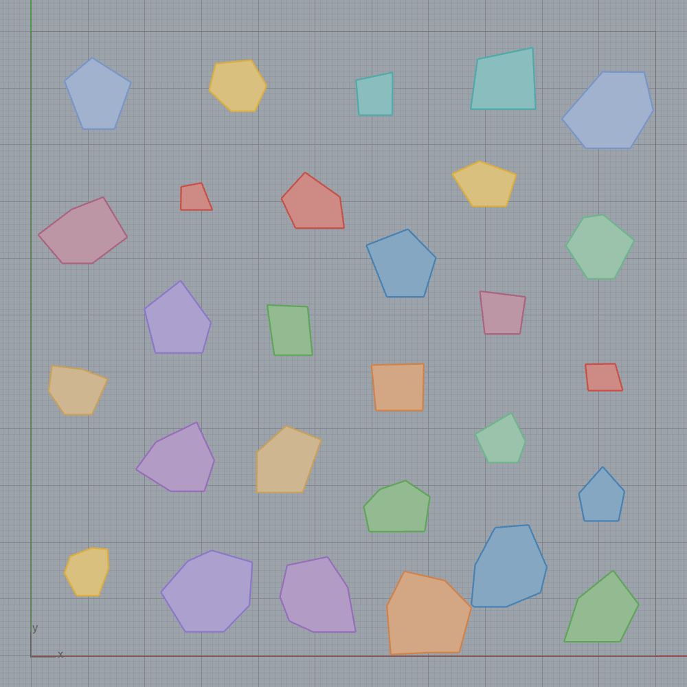

> **Originality.** CVD-Lloyd is **clean-room** from Lloyd (1982) centroidal
> Voronoi relaxation (`CvdLloyd2d.cs:14-22`, `[Algorithm]` at
> `Pack2DTrencadisCatalogComponent.cs:37`). The Hungarian solver is a
> **clean-room** textbook Kuhn-Munkres / Bourgeois-Lassalle (1971)
> shortest-augmenting-path implementation, allocation-bounded and
> net48-compatible (`HungarianAssignment.cs:11-15`). The catalog placement
> wrapper that couples them is **facade-over-primitives**: its `[Algorithm]`
> credits "Slab-partitioned Voronoi catalog; Frahan-original Trencadis
> extension" over a Battiato 2013 synthesis precedent
> (`Pack2DTrencadisCatalogComponent.cs:38`, `:42`). Tier C/B.

### 2.2 Physics-settle variants vs the greedy/EdgeMatch variants

The `Trencadis` tab is intentionally **not** one engine. The variants differ in
how a piece reaches its final pose, and the repository keeps them separate
rather than blind-merging them (the "the 2D solvers are real, validate don't
merge" ruling):

- **Greedy NFP-slide** (`Pack2DTrencadisComponent`, GUID
  `F2D00002-...`). Pieces slide along a Minkowski-difference arc-length sampler
  until they butt against placed neighbours, with a bounded-overlap trim up to
  the Trim Tolerance and the Battiato 2013 §4 cumulative-cut budget ($T_N$ for
  the new piece, $T_P$ for placed) (`TrencadisFill.cs:13-27`,
  `Pack2DTrencadisComponent.cs:37-38`). The standalone greedy box is a skeleton
  returning empty; the working entrypoint is the catalog or pipeline component
  (`examples/12_trencadis/README.md`).
- **Dynamic settle** (`Pack2DTrencadisDynamicComponent`, GUID
  `F2D00008-...`). After a greedy pack, a Kangaroo 2 goal-based dynamic
  relaxation pass settles the pieces to fill residual gaps (physics, not
  geometry). Headless coverage 55.1% with physics on vs 52.7% greedy
  (`Pack2DTrencadisDynamicComponent.cs:61-62`,
  `examples/12_trencadis/README.md`).
- **EdgeMatch** (`TrencadisEdgeMatchComponent`, GUID `F2D0000A-...`). Drives
  placement through the 5-stage EdgeMatch pipeline plus a deterministic
  beam-search assembly solver, an alternative to the Battiato 2013 CVD+GVF
  stack (`TrencadisEdgeMatchComponent.cs:28-29`).
- **Pipeline** (`Pack2DTrencadisPipelineComponent`, GUID `F2D00009-...`)
  composes greedy pack + NFP slide + CVD-Lloyd seeding + an optional Kangaroo 2
  settle (`Pack2DTrencadisPipelineComponent.cs:59-62`).

> **Originality.** The greedy NFP-slide and the dynamic/EdgeMatch/pipeline
> wrappers are **facade-over-primitives** that compose published Frahan
> primitives (CVD-Lloyd, NFP slide, Hungarian, EdgeMatch, the Kangaroo 2
> relaxation). The physics step explicitly credits Daniel Piker's Kangaroo 2
> (`Pack2DTrencadisDynamicComponent.cs:62`); the Trencadís domain framing is
> credited to Gaudí Park Güell and the Battiato 2013 synthesis. None claims a
> new algorithm; the contribution is the integration. Tier C/D.

---

## 3. Status & what's left

- **Example 28 (hole nest) has no rendered figure.** The folder ships the `.gh`
  demo only (`examples/28_hole_nest/`), no PNG and no README. The CNH renders
  in this chapter borrow from example 10 (nesting) and example 12 (Trencadís).
  Severity: low (documentation gap, not a code gap).
- **Deployed `.gha` lag (KB-7).** The example-10 validity figures are from the
  headless harness on current source. An older deployed `.gha` may still
  overlap parts on a live 2D solve; rebuild and redeploy before trusting a live
  result (`examples/10_pack2d/README.md`). Severity: medium.
- **Standalone greedy Trencadís box returns empty.** `Frahan Trencadís Pack`
  is a skeleton; the working entrypoints are the Catalog and Pipeline
  components (`examples/12_trencadis/README.md`). Severity: medium (a ghost on
  the ribbon, against AGENTS.md section 6).
- **Rect fast-path spacing limitation.** The exact rectangle shelf path only
  activates at `spacing == 0`; spacing > 0 needs exact rect-dilation
  bookkeeping and is deferred to the general engine
  (`ContactNfpHoleNester.cs:611-616`). Severity: low (correct fallback exists).
- **Residual penetration band.** After the compound gate, penetrations inside
  the snap band (about $2\times10^{-5}$ caller units) can be accepted; deeper
  ones cannot on any path. This is a stated, bounded residual, far inside any
  fabrication budget (`ContactNfpHoleNester.cs:69-72`). Severity: low.
- **Outline-density gap to the reference physics nester.** On the no-hole
  outline strip lane the reference physics nester (Sparrow) still wins density
  by 6 to 10 percent; CNH's claimed win is the hole-aware lane only. This
  boundary must stay in any external claim
  (`HOLE_PACKER_MATH_AND_BENCHMARK.md`, section 2c). Severity: low (honesty,
  not a defect).

---

## References (this chapter)

- Burke, E.K., Hellier, R., Kendall, G., Whitwell, G. (2006). A New
  Bottom-Left-Fill Heuristic Algorithm for the Two-Dimensional Irregular
  Packing Problem. Operations Research 54(3):587-601. DOI
  10.1287/opre.1060.0293.
- Burke, E.K., Hellier, R., Kendall, G., Whitwell, G. (2007). Complete and
  robust no-fit polygon generation for the irregular stock cutting problem.
  European Journal of Operational Research 179(1):27-49. DOI
  10.1016/j.ejor.2006.03.011.
- Bennell, J.A., Oliveira, J.F. (2009). A tutorial in irregular shape packing
  problems. Journal of the Operational Research Society 60(S1):S93-S105. DOI
  10.1057/jors.2008.169.
- Lloyd, S.P. (1982). Least squares quantization in PCM. IEEE Transactions on
  Information Theory 28(2):129-137. DOI 10.1109/TIT.1982.1056489.
- Kuhn, H.W. (1955). The Hungarian method for the assignment problem. Naval
  Research Logistics Quarterly 2(1-2):83-97. DOI 10.1002/nav.3800020109.
- Battiato, S., Di Blasi, G., Gallo, G., Guarnera, G.C., Puglisi, G. (2013).
  Artificial mosaic generation: a survey and synthesis. (Trencadís synthesis
  precedent, cited in source.)
- Johnson, A. Clipper2 (Boost Software License 1.0). Polygon Minkowski sum and
  NonZero boolean back end.

---

# 02. Three-Dimensional Packing & Settling

This chapter covers the repository's volumetric packing subsystem: the
`3D Packing` ribbon tab (9 components) and the `Slab` ribbon tab (4
components). Three distinct engine families live here. The first is a family of
**heightmap** packers (a flat-bed greedy box packer, a mesh-derived top/bottom
pile packer, and an irregular mesh-container variant) that place geometry by a
deepest-bottom-left rule on a discrete grid. The second is the **guillotine /
DLBF** layer: the `Block Pack (Tree)` forest packer and the `HeteroExt`
mixed-size extraction facade that share a single deepest-left-bottom-fill (DLBF)
engine across timber, ceramic, and concrete catalogues. The third is the
**physics settle** layer: a Bullet rigid-body service that turns a proxy
placement into a settled pile of real geometry. The `Slab` tab adds convex
half-space slab cutting by oriented fracture planes.

The repository's own research arc runs straight through this chapter. The
shipped baseline was a heightmap proxy packer; the evolution study replaced it
with a mesh-accurate collision plus drop-settle pipeline that roughly doubles
packing compactness on the ETH1100 dry-stone benchmark while producing a stable,
non-interpenetrating pile (section 2.4). Where the repository evolved the
published math, the derivation is shown. Every originality claim is anchored to
a `file:line`, an `[Algorithm]` attribute, or a measured benchmark.

The packing-quality metrics used throughout are the **fill ratio**

$$
\mathrm{fill}=\frac{\sum_k \mathrm{vol}(P_k)}{\mathrm{vol}(\text{container})}
$$

(placed item volume over container volume; `PackingMetrics.cs:43-45`) and the
evolution-study **compactness**

$$
\mathrm{compactness}=\frac{\sum_k \mathrm{vol}_{\text{mesh}}(P_k)}{A_{\text{floor}}\cdot h_{\text{used}}},
$$

packed true mesh volume over the swept footprint column (floor area times used
height), which rewards interlocking rather than bounding-box stacking
(`outputs/2026-06-03/pack3d_evolution/PLAN.md`, section 5).

---

## 2.1 The heightmap deepest-bottom-left core

### 2.1.1 The flat-bed box heightmap

The simplest packer fills an axis-aligned box container with axis-aligned item
boxes. A `Heightmap` stores one scalar per grid cell: the current top surface
$T(x,y)$, the maximum $z$ already occupied at that cell (`Heightmap.cs:8`,
`:28`). To place an item of footprint $w\times d$ at grid cell $(i,j)$, the
landing height is the highest top under the item's footprint,

$$
z(i,j)=\max_{\substack{i\le x<i+s_w \\ j\le y<j+s_d}} T(x,y),\qquad s_w=\lceil w/c\rceil,\ s_d=\lceil d/c\rceil,
$$

with $c$ the cell size, and the placement is legal only if it stays under the
container ceiling, $z+h\le H+\varepsilon$ (`Heightmap.cs:30-50`). Placement is a
greedy argmin over a score that trades vertical growth against a
back-left compactness bias:

$$
\mathrm{score}(i,j)=w_h\!\!\sum_{\substack{i\le x<i+s_w \\ j\le y<j+s_d}}\!\!\max\bigl(0,\ (z+h)-T(x,y)\bigr)\ +\ w_c\,(i+j),
$$

the first term being the new material lifted above the existing surface (low is
flush), the second a lexicographic-style pull toward the origin corner
(`Heightmap.cs:52-69`). The `GreedyHeightmapPacker` sorts items by volume
descending, evaluates each over $\{0^\circ,90^\circ\}$ yaw, and commits the
lowest-score candidate, bounded by a `MaxCandidatesPerItem` budget
(`GreedyHeightmapPacker.cs:17-19`, `:44-82`). The argmin is exact over the
evaluated candidate set; there is no overlap by construction because the
heightmap is monotone.

This is a textbook deepest-bottom-left / skyline heuristic. The relevant
published anchor is the deepest-left-bottom-fill (DLBF) algorithm of Chehrazad,
Roose and Wauters (2025), which the components cite as the substrate
(`Pack3DIrregularComponent.cs:20-23`).

### 2.1.2 The mesh-pile heightmap (top and bottom surfaces)

A box top-surface heightmap cannot nest a concave stone into the dimple of the
stone below it: it only knows the highest point of each column, so it stacks
flat tops on flat tops. The `OrientedMeshHeightmap` fixes this by rasterising
**two** surfaces per cell from the item's triangle mesh: a bottom envelope
$b(x,y)$ and a top envelope $t(x,y)$ (`OrientedMeshHeightmap.cs:8-10`,
`:276-292`). Each triangle is scan-converted by barycentric interpolation over
its footprint cells, and vertices, edge samples and the centroid are added so
thin or degenerate triangles still deposit samples (`:195-244`). The cell stores
the per-column min as the bottom and the per-column max as the top.

The `MeshPileHeightmap` then seats one mesh into another. For a candidate at
grid offset $(i,j)$, the landing height is chosen so the item's bottom envelope
rests on the pile's current top surface at every occupied column:

$$
z(i,j)=\max_{(m_x,m_y)\in \mathrm{occ}}\Bigl(\ T_{\text{pile}}(i+m_x,\ j+m_y)\ -\ b_{\text{item}}(m_x,m_y)\ \Bigr),
$$

so the deepest finger of the item drops exactly onto the highest point beneath
it (`MeshPileHeightmap.cs:79-106`). Unlike the box heightmap, the pile keeps a
**list of occupied vertical intervals** per cell, not just a top scalar, so a
later piece can slide under an overhang. A candidate is rejected if its
$[z+b,\,z+t]$ interval at any column overlaps an existing interval there:

$$
\mathrm{WouldCollide}(i,j,z)\iff \exists\,(m_x,m_y),\ \exists\,[\,\beta,\tau\,]\in I(i+m_x,j+m_y):\ (z+b)<\tau-\varepsilon\ \wedge\ \beta<(z+t)-\varepsilon,
$$

a conservative vertical-column non-penetration test on the true mesh envelopes
(`MeshPileHeightmap.cs:248-271`). This is the "conservative vertical-column
collision check" the component name advertises.

### 2.1.3 Orientation and the down-axis rotation

The `GreedyMeshHeightmapPacker` searches up to six discrete orientations per
item: each of the three local axes tilted down to $-Z$ (None / X-down / Y-down)
crossed with $\{0^\circ,90^\circ\}$ yaw, with the $90^\circ$ skipped when the
rotated footprint is square (`GreedyMeshHeightmapPacker.cs:142-169`). The down
rotation is applied to the vertices **before** the yaw, matching the world
transform order $R_{\text{yaw}}R_{\text{down}}$. For the None case the down step
is a literal identity, so the multi-orientation engine is byte-identical to the
legacy yaw-only code on that path (`OrientedMeshHeightmap.cs:115-152`); the
Grasshopper transform reproduces the same order, $T_{\text{yaw}}\cdot
T_{\text{down}}$, so the placed mesh matches the heightmap that scored it
(`Pack3DMeshHeightmapComponent.cs:269-301`).

### 2.1.4 The irregular mesh container

A real container is not a box. `IrregularMeshContainer.FromMesh` ray-casts a
vertical line through the cell centre of every grid cell, collects the sorted
$z$ values where the line crosses a container triangle, and pairs consecutive
crossings into solid intervals (`IrregularMeshContainer.cs:52-97`,
`:133-176`). The crossing-parity pairing $\{z_0,z_1\},\{z_2,z_3\},\dots$ is the
standard ray / closed-surface inside test: an even number of crossings bounds
the interior segments. Cells with fewer than two crossings are outside the
container and marked not-allowed. The pile packer then honours those per-cell
allowed intervals, raising a candidate's $z$ until the item fits inside a
container interval or rejecting it (`MeshPileHeightmap.cs:160-246`). A
surface-sample fallback handles meshes that produce no closed columns
(`IrregularMeshContainer.cs:99-131`).

> **Originality.** The heightmap packers are **clean-room**. The deepest-
> bottom-left placement rule and the DLBF substrate are cited to Chehrazad,
> Roose and Wauters (2025) (`Pack3DIrregularComponent.cs:20-23`; GUID
> `E36C3F7D-7E2C-495E-9E2A-59312C5CF990`). The two-surface mesh-pile proxy, the
> per-cell vertical-interval collision test, the six-orientation down-axis
> search and the ray-cast irregular container are Frahan additions over a box
> skyline; the mesh-heightmap component labels its method "Frahan-original
> mesh-pile heightmap" (`Pack3DMeshHeightmapComponent.cs:20-21`; GUID
> `A16D6426-38A8-44B1-AB6A-4BA80EB39730`). No upstream packing source sits in
> the tree. *Citation flag:* the sibling container component attributes the same
> heightmap method to "Park and Han 2024 tree-packing"
> (`Pack3DIrregularContainerComponent.cs:18`, `:22`); that work
> (references `[R8]`) carries no DOI and is a placeholder-grade citation, while
> the mesh-pile component calls the identical method Frahan-original. The two
> attributions should be reconciled before external review (AGENTS.md §9).

---

## 2.2 The guillotine forest packer: Block Pack (Tree)

`BlockPackTreeComponent` (GUID `C2D3E4F5-3001-4F5E-A6B7-C8D9E0F12345`) packs a
set of element cuboids into a set of stone-block containers using only
axis-aligned, saw-cuttable **guillotine** cuts (`BlockPackTreeComponent.cs:37`).
It is the digital-fabrication entrypoint: every placement it returns is
reachable by straight saw passes, so the plan runs directly on a wire or bridge
saw (`examples/11_pack3d/README.md`).

A guillotine partition of a cuboid container is a binary tree: each internal
node is one axis-aligned cut that splits a free region into two children; each
leaf is either a placed element or free residue. The forest packer grows many
such trees under independently seeded randomness and keeps the best by score.
The Kim (2025) score sums packed element value with an all-fit container-price
bonus,

$$
S=\sum_{e\in \text{packed}} v_e\ +\ \mathbf{1}[\text{all packed}]\cdot \frac{1}{1+p_{\text{container}}}\ -\ w_{\text{cut}}\sum_{\text{cuts}} A_{\text{internal}},
$$

where the final term is the Frahan / Jalalian I11 (BCSdbBV) extension that
charges for internal cutting-surface area $A_{\text{internal}}$, so the packer
can be biased toward fewer, cheaper cuts (`BlockPackTreeComponent.cs:30-31`,
`:154-158`, `:102-106`). The component adds three documented capabilities
beyond the paper: a deterministic master seed (forest $k$ uses $\text{seed}+k$,
so parallel forests are bitwise identical to serial), a saw **kerf width** that
each cut consumes along its direction, and per-container **forbidden boxes** so
fracture-intersected cells can be passed in as keep-out regions
(`BlockPackTreeComponent.cs:22-28`). The measured live result on example 11 is a
full pack, 12/12 elements into one container, score 65.11, deterministic at
seed 0 (`examples/11_pack3d/README.md`).


> **Originality.** **evolved-fork** of Kim (2025) (Computation 13:211, CC BY
> 4.0). The tree-forest growth and score are the paper's; the deterministic
> seed, kerf, forbidden-box, parallel-forest and memory-budget inputs are the
> stated deltas, and the cut-surface-area term cites Jalalian et al. (2023)
> (`[Algorithm]` `BlockPackTreeComponent.cs:30-31`; synthesis in
> `wiki/papers/kim2025_tree_packing.md`). CC BY 4.0 is permissive with
> attribution, no copyleft. It sits on the Masonry ribbon by design to keep the
> recommended 11-panel layout intact (`:13-21`).

---

## 2.3 The DLBF mixed packer and the HeteroExt facade

### 2.3.1 The 3D deepest-left-bottom-fill engine

`Dlbf3dMixedSizePacker` is the 3D generalisation of the planar DLBF
(`Dlbf3dMixedSizePacker.cs:8-37`). It packs a multi-size catalogue, each entry
carrying its own per-piece height and per-piece revenue, into a tested AABB on a
discrete cubic grid. Pieces are processed in **revenue-per-volume descending**
order,

$$
\text{priority}(p)=\frac{\mathrm{revenue}(p)}{\mathrm{vol}(p)},
$$

and for each piece the chosen cell is the deepest-left-bottom free cell in the
strict order lowest $z$, then lowest $y$, then lowest $x$:

$$
(i^\star,j^\star,k^\star)=\operatorname*{arg\,min}_{(i,j,k)\,:\,\mathrm{RegionFree}}\ (k,\ j,\ i)\quad\text{(lexicographic)},
$$

scanning $k$ as the outermost loop so the bench floor fills first
(`Dlbf3dMixedSizePacker.cs:186-220`). A region is free only if every cubic cell
it spans is unblocked, where blocked cells come from forbidden boxes (e.g.
fracture-intersected regions) rasterised into the grid (`:166-184`, `:268-278`).
Two operating modes split the use cases: `FloorOnly = true` clamps every piece
to $z=z_{\min}$ for monoliths cut out of solid rock (no stacking), while
`FloorOnly = false` allows full 3D stacking for racking and container loading
(`:24-29`, `kStop` at `:215`). A 2026-06-06 evolution adds optional
best-of-orientation: each piece is tried in its up-to-six distinct
axis-permutations and placed in the orientation whose best free cell is lowest;
volume and revenue are permutation-invariant, and the default overload keeps
`tryOrientations = false` so the six existing tests stay byte-identical
(`:127-143`, `:201-231`, `:250-266`).

The outer `while (anyPlaced)` loop re-passes the catalogue until no further
piece fits, so a multi-instance catalogue packs greedily to exhaustion
(`:194-245`).

### 2.3.2 The HeteroExt facade: one engine, three materials

`FrahanHeterogeneousExtractionComponent` (HeteroExt, GUID
`F2D0BC19-1234-4F2D-A0B0-7E60CADA15B9`) is a four-stage extraction pipeline:
BlockCutOpt locates the fracture-clean regions of a bench, the 3D DLBF packer
fills those regions with a mixed catalogue of monuments, dimension stones and
slabs while avoiding the fractured cells, and an optional monument-inventory
stage places found stones on a fracture-derived block graph
(`BlockCutOptHeterogeneousComponents.cs:169`). The same `Dlbf3dMixedSizePacker`
that HeteroExt composes is also exposed standalone as `Frahan Mixed-Size Block
Pack 3D` (GUID `F2D0BC18`), satisfying the monster-vs-primitive rule that a
monolith must be a facade over a published, standalone primitive, never a black
box (`:170-176`, `[RelatedComponent]` cross-links). Because the engine packs a
revenue-weighted multi-size catalogue, it is the same mixed packer for timber,
ceramic and concrete instances; only the catalogue changes.

> **Originality.** The DLBF 3D engine is **clean-room** from Chehrazad, Roose
> and Wauters (2025), following the paper's Section 5 generalisation; the
> standalone exposure carries the citation with DOI
> (`[Algorithm]` `BlockCutOptHeterogeneousComponents.cs:42`, DOI
> 10.1080/00207543.2025.2478434). The HeteroExt monolith is
> **facade-over-primitives**: its `[Algorithm]` is "Frahan-original" with the
> explicit note that it composes Elkarmoty (2020) and Chehrazad (2025), both
> reimplemented in managed code, and that "the composition and the heterogeneity
> model are the contribution" (`:169`). No new algorithm; the integration and
> the seam-exposed standalone primitives are the work.

---

## 2.4 The physics settle: Bullet rigid-body

### 2.4.1 From proxy placement to settled geometry

A heightmap or DLBF placement is a proxy: it positions bounding-box or
height-column approximations, not the real stone in real contact.
`Settle 3D (Physics)` (`PackSettle3DComponent`, GUID
`134785ac-19cb-4f14-85f8-e2f666bd14f6`) is the finishing pass that composes
after any 3D packer and settles the meshes into a stable,
non-interpenetrating pile under gravity and friction
(`PackSettle3DComponent.cs:16-28`). Each stone is convex-decomposed (CoACD, with
a convex-hull fallback) into pieces wrapped as `ConvexHullShape` children of a
per-stone `CompoundShape`; bodies are seeded at their already-placed positions,
lifted slightly to clear convex-proxy overlap, then dropped
(`BulletSettleService.cs:9-30`, `:111-133`).

The settle is governed by Newton-Euler rigid-body dynamics integrated by
Bullet's sequential-impulse solver. The contact model is Coulomb friction with
a default coefficient $\mu=0.85$ (`SettleOptions.Friction`,
`BulletSettleService.cs:52`). The load-bearing implementation detail is a
**gravity ramp**: seeded near-contacts are resolved softly by stepping
$g_z$ through $-0.5,-2.0,-5.0$ to full $-9.81$ before the main settle loop, so
the pile does not explode from convex-proxy interpenetration at $t=0$ (the
lesson recorded from the dev run; `:135-141`). Optional tamp rounds then apply
strong-gravity bursts to densify (`:142-148`). The component is heavy and
single-threaded, so it runs on a Run-gated background `Task`
(`GH_TaskCapableComponent`), never on the Grasshopper UI thread
(`PackSettle3DComponent.cs:82-101`).

The returned per-stone rigid delta is decoded carefully: Bullet stores its basis
row-wise for row-vector math, so the column-vector rotation applied to the mesh
is its transpose, and the world update is $v'=R\,(v-\mathbf{c})+\mathbf{t}$ about
the piece centroid $\mathbf{c}$ (`BulletSettleService.cs:62-70`, `:152-164`).
Example 18 settles 12 ETH1100 dry-stone scans into a roughly 1.95 m cluster
(`examples/18_pack_settle_bullet/README.md`).

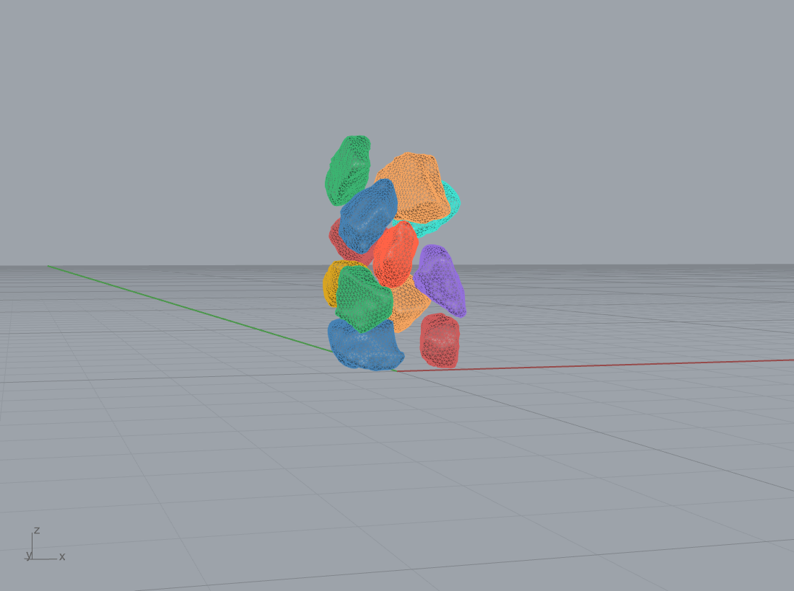

### 2.4.2 COM-over-support stability (Heyman limit state)

Stability is the Heyman (1966) limit-state criterion shared with the masonry
chapter: a settled stone is stable when its centre of mass, projected down to
the bed, lies inside the convex hull of its contact footprint. Writing the
support polygon $\mathcal{S}=\mathrm{hull}\{\mathbf{p}_k\}$ over the contact
points $\mathbf{p}_k$, the gate is

$$
\Pi_{xy}(\mathbf{c}_{\text{COM}})\in \mathcal{S},
$$

so the resultant of self-weight passes through the support and no overturning
moment is unbalanced (`[Algorithm]` `PackSettle3DComponent.cs:34-35`). The
physics solver enforces this dynamically: a stone whose COM falls outside its
support topples and re-settles until it rests, which is exactly the equilibrium
the limit-state test certifies.

### 2.4.3 The heightmap-to-settle evolution (measured 2x)

The evolution study set the baseline as the shipping heightmap packer (GUID
`B3E8A42F`) and targeted a 2x improvement in wasted true-volume fraction at
zero interpenetration and full COM-over-support stability
(`outputs/2026-06-03/pack3d_evolution/PLAN.md`, sections 1, 3, 5). The measured
arc on the metric of section 2 is: v1 AABB greedy reached 17.0% compactness and
placed 19 of 30 stones; the mesh-accurate plus drop-settle v2 reached 33.2%
compactness, placed 30 of 30, and held 80% of stones COM-stable, rising to 100%
COM-stable with the stability-seat pass (`PLAN.md`, section 5). The
near-doubling of compactness from 17.0% to 33.2%, on real geometry and at full
placement, is the recorded heightmap-to-mesh-accurate-plus-settle 2x. The
heightmap path is retained as the validated baseline (the components route users
to Settle 3D and Block Pack (Tree) as the evolved paths;
`Pack3DMeshHeightmapComponent.cs:12-15`).

> **Originality.** The settle service is **clean-room** physics integration
> over a **vendored** engine. The rigid-body dynamics packing framing cites
> Zhuang et al. (2024) (DOI 10.1016/j.cag.2024.103996); the engine is Bullet
> (Coumans et al.) via BulletSharp under zlib, and the convex pieces come from
> CoACD (Wei et al. 2022) (`[Algorithm]` `PackSettle3DComponent.cs:29-35`).
> Bullet and BulletSharp are vendored unmodified (zlib, permissive); only the
> marshalling, the gravity-ramp seeding schedule and the centroid-relative
> transform decode are ours. The COM-over-support gate is Heyman (1966). CoACD
> is MIT but transitively vendors CGAL (GPL); per the licensing register it is
> reached only through the optional out-of-process shim with a convex-hull
> fallback, so the default install links no copyleft
> (`docs/thesis/90_originality.md`, register row 5).

---

## 2.5 The Slab tab: convex fracture cutting

The `Slab` tab turns a quarry block into fabricable slabs by cutting it along
oriented fracture planes. `SlabFromMesh` (GUID
`B1A2C3D4-5E6F-4789-9ABC-1D2E3F4A5B6C`) wraps a Rhino mesh into the internal
`Slab` DTO. `SlabCutByFractures` (GUID
`C2B3D4E5-6F7A-489B-AC1D-2E3F4A5B6C7D`) splits a list of slabs by a list of
planes (`SlabCutByFracturesComponent.cs:44-60`). Each plane, given as origin and
normal, classifies every slab vertex by signed distance $d=\mathbf{n}\cdot
(\mathbf{v}-\mathbf{o})$ into above / on / below up to a tolerance $\varepsilon$;
each face is walked once, and every directed edge that strictly straddles
contributes a linearly interpolated intersection point to both half-faces. The
cut cap is reconstructed by sorting the unique on-plane and intersection
vertices CCW about $+\mathbf{n}$ in an in-plane 2D frame
(`SlabCutter.cs:7-34`). Cutting a slab by $m$ ordered planes grows the piece
list by up to $2\times$ per plane, since each plane splits every existing piece
(`:55-70`).

The managed path is exact for **convex** input only; non-convex slabs can
produce non-simple caps, so the component exposes an opt-in `Use CGAL` backend
that routes the cut through the corefinement boolean kernel for robust
non-convex or large-slab cutting, with a managed fallback if the CGAL shim is
absent (`SlabCutByFracturesComponent.cs:84-92`). The two further Slab-tab
members are `Slab Cut By Tool Mesh (CGAL)` and `Vertical Fracture Planes From
Curves` (GUID `F2D05A09-1A2B-4C3D-9E4F-5A6B7C8D9E09`), which lifts 2D fracture
traces into vertical cutting planes.

Example 23 runs the full quarry-to-slab chain on a fracture-prone 3.0 x 1.5 x
1.5 m block (6.75 m3): fractures with a 40 mm keep-out leave 6.05 m3 of intact
rock, fracture-aware block packing recovers 2.98 m3 (60 blocks, 49.3% of intact,
100% guillotine-separable), and gangsaw slabbing yields 2.52 m3 of finished 20
mm slab, a 37.3% overall volume yield and 126 m2 of slab face
(`examples/23_quarry_to_slab/README.md`).

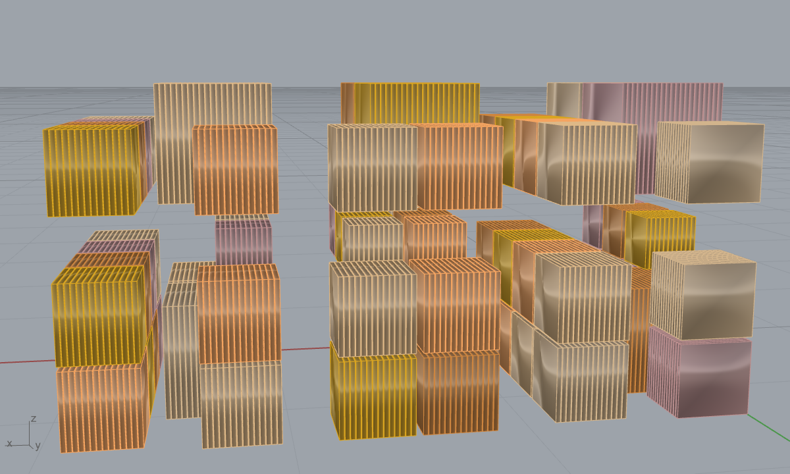

> **Originality.** The slab cutter is **clean-room** convex-polyhedron
> half-space clipping (Sutherland-Hodgman family), labelled "Frahan-original"
> with the optional CGAL boolean backend named separately
> (`[Algorithm]` `SlabCutByFracturesComponent.cs:33-39`). The successive-plane
> block-decomposition framing cites Goodman and Shi (1985) block theory
> (`SlabCutter.cs:29-33`). The CGAL Polygon Mesh Processing path is GPL and is
> reached only through the optional shim with a managed fallback (licensing
> register row 4).

---

## 2.6 Example: statue to fabricable blocks

Example 15 is the volumetric counterpart that feeds the packers: it decomposes a
sculpture into roughly 0.5 m brick blocks whose boundary blocks carry the
**real** statue surface, not bounding boxes. A 0.5 m grid covers the bounding
box; each cell box is intersected (CGAL boolean) with the closed statue solid,
so interior cells return a full cube and boundary cells keep the real mesh face
on the outside and clean planar cut faces on the grid sides. On the Stanford
bunny scaled to 3.0 m, the run produced 7 interior cubes, 106 real-face boundary
blocks, 67 empty cells dropped, 113 closed blocks total, with a recovered volume
ratio of exactly 1.0000 (5.4009 m3 statue = 5.4009 m3 of blocks, measured by
`VolumeMassProperties`), in 3.6 s over 173 CGAL booleans with zero failures
(`examples/15_statue_to_blocks/README.md`). The enabling fix is a Geogram
`FillHoles -> RemeshUniform -> FillHoles` pass that rebuilds the raw scan into a
clean 2-manifold so both the interior point test and the CGAL corefinement work.
These closed blocks are exactly the input the Block Pack (Tree) and DLBF packers
of this chapter consume.

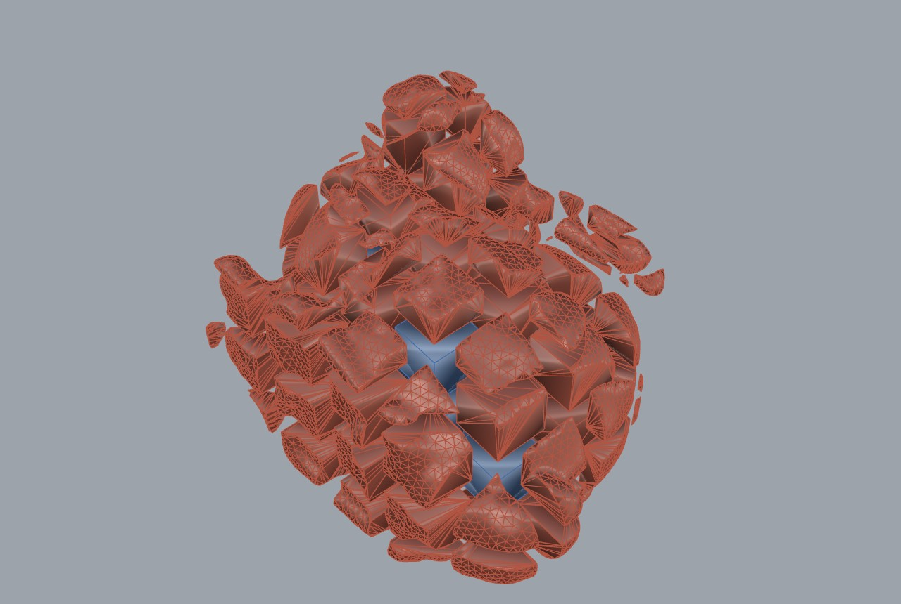

---

## 2.7 Status & what's left

- **Heightmap citation inconsistency.** `Pack3DMeshHeightmapComponent` labels
  the mesh-pile method "Frahan-original" while
  `Pack3DIrregularContainerComponent` attributes the identical heightmap method
  to "Park and Han 2024 tree-packing" (`[R8]`, no DOI, placeholder-grade). The
  two should be reconciled before external review
  (`Pack3DIrregularContainerComponent.cs:18`,
  `Pack3DMeshHeightmapComponent.cs:20-21`). Severity: medium (provenance).
- **Bullet native dependency.** `Settle 3D` needs `libbulletc.dll` beside the
  `.gha`; without it the component warns and does nothing
  (`BulletSettleService.cs:27`, `:80-87`). It ships in `install/plugin/` but is
  absent from a source-only build. Severity: medium (deployment).
- **Settle is non-deterministic.** The Bullet solve is a physics simulation, not
  a deterministic search; example 18 notes one stone hung up mid-drop as a
  normal settle artifact (11 of 12 clustered). Re-runs can differ. Severity: low
  (documented behaviour).
- **Convex-only managed slab cutter.** The default `SlabCutByFractures` path is
  exact for convex slabs only and "explodes combinatorially on large slabs with
  many planes"; non-convex or large work needs the opt-in CGAL backend
  (`SlabCutByFracturesComponent.cs:84-92`, `SlabCutter.cs:23-27`). Severity:
  medium.
- **Heightmap proxy is a baseline, not the recommended path.** The mesh-pile
  collision is a conservative vertical-column test on envelopes, not a true 3D
  contact solve; the components themselves route users to Settle 3D and Block
  Pack (Tree) as the evolved paths
  (`Pack3DMeshHeightmapComponent.cs:12-15`). Severity: low (by design).
- **CoACD transitive copyleft.** Convex decomposition pulls CoACD, which
  vendors CGAL (GPL); the default install must reach it only through the
  optional out-of-process shim with the convex-hull fallback
  (`docs/thesis/90_originality.md`, register row 5). Severity: medium
  (licensing, mitigated by quarantine).

---

## References (this chapter)

- Chehrazad, R., Roose, D., Wauters, T. (2025). A fast and scalable
  deepest-left-bottom-fill algorithm for the 3D bin packing problem.
  International Journal of Production Research 63:6606-6629. DOI
  10.1080/00207543.2025.2478434.
- Kim, S. (2025). Tree-forest guillotine packing. Computation 13(9):211. DOI
  10.3390/computation13090211. (CC BY 4.0.)
- Jalalian, A. et al. (2023). Block-cutting-surface-defined block value
  (BCSdbBV) cost objective. Scientific Reports. DOI 10.1038/s41598-023-49633-w.
- Park, J., Han, S. (2024). Tree-packing for irregular 3D containers
  (tree-search 3D-BPP / orthogonal-block packing). (Cited in source; no DOI,
  placeholder-grade attribution flagged in this chapter.)
- Zhuang, Q., Chen, Z., He, K., Cao, J., Wang, W. (2024). Dynamics
  simulation-based packing of irregular 3D objects. Computers and Graphics
  123:103996. DOI 10.1016/j.cag.2024.103996.
- Wei, J., Liu, M., Wang, J. et al. (2022). Approximate convex decomposition
  for 3D meshes with collision-aware concavity and tree search (CoACD). ACM
  Transactions on Graphics (SIGGRAPH 2022) 41(4):42. DOI
  10.1145/3528223.3530103.
- Coumans, E. et al. Bullet Physics SDK (rigid-body dynamics, sequential-impulse
  solver). zlib License. Via BulletSharp.
- Heyman, J. (1966). The stone skeleton. International Journal of Solids and
  Structures 2(2):249-279. DOI 10.1016/0020-7683(66)90018-7.
- Goodman, R.E., Shi, G. (1985). Block Theory and its Application to Rock
  Engineering. Prentice-Hall.
- Elkarmoty, M., Bondua, S., Bruno, R. (2020). A combinatorial optimization
  method for the block-cutting problem. Resources Policy 68:101761. DOI
  10.1016/j.resourpol.2020.101761. (Cited by HeteroExt stage 1.)

---

# 03. Quarry Block-Cutting Optimization

## 3.0 Scope and lineage

This chapter covers the **Quarry** ribbon tab subset built on the `BlockCutOpt`
engine: the pose-sweep solver, its recovery and yield objective, the Jalalian
cutting-surface-area-per-value cost axis, the multi-scale recovery cascade, and
the downstream flat-versus-oblique guillotine and gangsaw cost frontier studied
in examples 08, 24, and 25. The core lives at
`src/Frahan.StonePack.Core/Masonry/Quarry/BlockCutOpt`. The managed solver is a
clean-room reimplementation of the BlockCutOpt brute-force algorithm
(Elkarmoty et al. 2020), whose original implementation is private C++
(`BlockCutOpt/README.md:46-50`). The repository's tracked delta is documented as
the "14 improvements" table (`README.md:185-198`), of which 12 of 14 are shipped
(`README.md:200`). Per the originality framework, the base solver is
**clean-room** (published math, no upstream source in the tree); the I1 full-3D
pose, the I6/I11 Pareto/BCSdbBV axes, and `RecoveryCascade` are the
**evolved-fork** increments claimed in the submitted BoEGE paper
(Murugean 2026, Zenodo DOI 10.5281/zenodo.20608279).

The geological front end (the GPR fracture chain that feeds the tested area) is
covered in the GPR chapter; here we take the fracture mesh as given input.

---

## 3.1 The block-cut objective: recovery over a pose space

### 3.1.1 Problem statement

A quarry bench is an axis-aligned tested region
$\mathcal{A}\subset\mathbb{R}^3$. The rock contains a discontinuity set
represented as a triangle soup $\mathcal{F}=\{T_k\}$ (the fan-triangulated
fracture mesh). A **cutting grid** lays out candidate commercial blocks of fixed
size $(L_x,L_y,L_z)$ on a regular lattice. A block is *marketable* only if it is
crossed by no fracture. The decision variables are the rigid pose of the lattice:
the yaw $\psi$ about the vertical axis, the optional tilts $\theta,\phi$ about the
horizontal axes, and the in-plane offsets $(d_x,d_y)$. The objective is to
maximise the count of non-intersected blocks.

Let $G(\psi,\theta,\phi,d_x,d_y)$ be the set of candidate oriented blocks
(OBBs) whose footprint lies inside $\mathcal{A}$. Write the indicator

$$
\chi(b,\mathcal{F})=
\begin{cases}
1 & \text{if } \forall T_k\in\mathcal{F}:\ b\cap T_k=\varnothing,\\
0 & \text{otherwise.}
\end{cases}
$$

The non-intersected count is

$$
N_{ni}(\psi,\theta,\phi,d_x,d_y)=\sum_{b\in G(\psi,\theta,\phi,d_x,d_y)}\chi(b,\mathcal{F}),
$$

and the solver returns the argmax over the discretised pose grid:

$$
(\psi^\*,\theta^\*,\phi^\*,d_x^\*,d_y^\*)=\arg\max_{\psi,\theta,\phi,d_x,d_y} N_{ni}.
$$

This is the brute-force search of Elkarmoty et al. (2020), restricted in their
paper to $\psi$-only with $\theta=\phi=0$. The implementation enumerates the
full five-dimensional pose grid (`BlockCutOptSolver.cs:108-113`).

### 3.1.2 The cutting-grid pose (I1: full 3D rotation)

The original algorithm rotates the lattice only by yaw $\psi$ about the vertical.
The repository adds tilt about both horizontal axes (improvement I1,
`README.md:185`). The grid basis is built from the rotation

$$
R=R_z(\psi)\,R_x(\theta)\,R_y(\phi),
$$

and the three block axes are $U=R\,e_x$, $V=R\,e_y$, $W=R\,e_z$.
Carrying the product through (the derivation that is inlined and pre-multiplied
in `CuttingGrid.cs:91-110`) gives, for the in-plane $U$ axis,

$$
U=\begin{pmatrix}
\cos\psi\cos\phi-\sin\psi\sin\phi\sin\theta\\
\sin\psi\cos\phi+\cos\psi\sin\phi\sin\theta\\
-\sin\phi\cos\theta
\end{pmatrix},\quad
V=\begin{pmatrix}-\sin\psi\cos\theta\\ \cos\psi\cos\theta\\ \sin\theta\end{pmatrix},\quad
W=\begin{pmatrix}\cos\psi\sin\phi+\sin\psi\cos\phi\sin\theta\\ \sin\psi\sin\phi-\cos\psi\cos\phi\sin\theta\\ \cos\phi\cos\theta\end{pmatrix}.
$$

Setting $\theta=\phi=0$ collapses $U\to(\cos\psi,\sin\psi,0)$,
$V\to(-\sin\psi,\cos\psi,0)$, $W\to(0,0,1)$, recovering the BlockCutOpt-2020
yaw-only grid exactly. This is verified in source: the `OrientedBlock`
$\psi$-only constructor hard-sets $U_z=V_z=W_x=W_y=0$, $W_z=1$
(`OrientedBlock.cs:40-50`). The lattice centre of cell $(i,j)$ is

$$
c_{ij}=c+ i\,p_x\,U + j\,p_y\,V + (d_x,d_y,0),\qquad
p_x=L_x+k,\ p_y=L_y+k,
$$

with $c$ the tested-area centroid and $k$ the saw **kerf**: the cell pitch is the
block dimension *plus* the kerf, so the gap between adjacent blocks is exactly the
material lost to the saw (`CuttingGrid.cs:77-78`, `127-129`). A candidate is kept
only if its four horizontal footprint corners lie inside $\mathcal{A}$
(`CuttingGrid.cs:135-145`).

> **Originality.** `CuttingGrid.GenerateTilted` and `BlockCutOptSolver`:
> **clean-room** base (Elkarmoty et al. 2020), with the I1 full-3D pose an
> **evolved-fork** increment. Evidence: `[Algorithm]` at
> `BlockCutOptComponents.cs:97-100` ("BlockCutOpt brute-force search",
> Doi 10.1016/j.resourpol.2020.101761; "Full 3D rotation grid", Frahan I1).
> Tier B for the base, A-candidate-adjacent for the tilt axes.

### 3.1.3 The intersection predicate (I2/I4)

The inner test $\chi$ is a triangle-versus-OBB overlap. The implementation uses
the 13-axis Separating Axis Theorem of Akenine-Moller (2001): three OBB face
normals $U,V,W$, the triangle normal, and the nine cross products
$U,V,W \times e_0,e_1,e_2$ of OBB axis against triangle edge
(`ObbTriangleIntersection.cs:10-16`). A block is clean iff a separating axis
exists for *every* nearby triangle. To avoid testing every triangle against every
block, fracture triangles are stored in an axis-aligned BVH and only the leaves
overlapping a block's bound are tested (improvement I2,
`TriangleAabbBvh`, used at `BlockCutOptSolver.cs:243-256`). An edge-triangle
variant (Moller-Trumbore) is improvement I4 (`README.md:188`).

> **Originality.** SAT predicate and BVH: **clean-room** faithful
> implementation of published geometry (Akenine-Moller 2001). Evidence:
> `[Algorithm("Triangle-AABB BVH pruning", "Akenine-Moller 2001 ...")]`
> `BlockCutOptComponents.cs:99`. Tier C (textbook geometry, engineering value).

### 3.1.4 Deterministic parallel argmax

The pose grid is large; the per-pose grid build and SAT counting are the cost.
The solver enumerates all poses in the exact serial loop order, computes each
pose's count in `Parallel.For` (every pose reads the immutable BVH and builds its
own grid, so there is no shared mutable state), then takes a serial strict-greater
argmax over the original enumeration order (`BlockCutOptSolver.cs:106-135`).
Strict-greater ($>$ not $\ge$) means ties resolve to the earliest pose, so the
chosen pose is **bit-identical** to the serial reference
(`SolveInternalSerial`, `BlockCutOptSolver.cs:151-211`), validated headless in
`BlockCutOptParallelTests`. This is an engineering detail with a real
correctness consequence: parallelism does not perturb the result.

### 3.1.5 Recovery and yield

The reported yield is the kerf-aware **recovery** of Elkarmoty's thesis Eq. 7-1
(`BlockCutOptResult.cs:9-14`):

$$
R = \frac{N_{ni}\,V_B}{V_{\text{tested}}-V_{\text{kerf}}}\times 100\%,
$$

where $V_B=L_xL_yL_z$ is the block volume and $V_{\text{kerf}}$ is the volume
lost to the saw inside the grid. The implementation approximates the kerf volume
as a thin film of thickness $k/2$ over the footprint
($V_{\text{kerf}}\approx A_{xy}\,k/2$, `BlockCutOptSolver.cs:261-268`), and floors
the denominator at $10^{-12}$ to stay finite. Putting the denominator at the
*intact-minus-kerf* volume rather than the gross volume means recovery measures
how much of the *cuttable* rock is captured, not how much of the bench. The
README's documented Stratum-a run returns $N_{ni}=83$, $R=44.21\%$, $\psi=84^\circ$
on a $40\times30\times6$ m bench (`README.md`).

---

## 3.2 The Pareto front and the Jalalian I11 cost axis

A single recovery scalar hides the economics: more blocks can mean more saw cuts
and a worse cost per unit value. The repository adds a four-objective Pareto
solver (improvement I6, `BlockCutOptParetoSolver.cs`). Each pose is scored on:

$$
\underbrace{N_{ni}}_{\text{recovery}\ \uparrow},\quad
\underbrace{\Pi=\textstyle\sum_b \mathrm{RMV}_b}_{\text{revenue}\ \uparrow},\quad
\underbrace{\tau=\textstyle\sum_b t_b}_{\text{kerf time}\ \downarrow},\quad
\underbrace{Z_{\mathrm{BCSdbBV}}}_{\text{cut cost}\ \downarrow}.
$$

A pose $p$ dominates $q$ iff it is no worse on all four axes and strictly better
on at least one; recovery and revenue are maximised, kerf-time and BCSdbBV
minimised (`ParetoPoint.Dominates`, `ParetoPoint.cs:54-71`).

### 3.2.1 BCSdbBV (I11): cutting surface area per block value

The fourth axis is the Jalalian et al. (2023) **BCSdbBV** objective: the total
cut surface area divided by the total recovered block value (improvement I11,
`README.md:195`, citing *Sci. Reports* 13, Doi 10.1038/s41598-023-49633-w):

$$
Z_{\mathrm{BCSdbBV}}=\frac{\sum_{b}\, S(b)}{\sum_{b}\, \mathrm{BV}_b},
$$

where $S(b)$ is the OBB surface area

$$
S(b)=2\,(L_xL_y+L_yL_z+L_xL_z)
$$

(`BlockValueModel.SurfaceArea`, `BlockValueModel.cs:54-58`) and $\mathrm{BV}_b$ is
the per-block value (default $=$ block volume, a richer model multiplies by a
class A/B/C price factor, `BlockValueModel.cs:22-27`). The accumulation runs only
over non-intersected blocks; when no value is recovered the ratio is set to
$+\infty$ so the pose cannot dominate
(`BlockCutOptParetoSolver.cs:82-95`). Minimising $Z_{\mathrm{BCSdbBV}}$ favours
layouts that spend the least saw surface per dollar of stone, which is the
sustainability objective Jalalian formalised to cut quarry waste.

> **Originality.** Pareto solver and BCSdbBV axis: **evolved-fork** over the
> single-scalar Elkarmoty objective. Evidence: `[Algorithm]` pair at
> `BlockCutOptComponents.cs:306-307` ("BlockCutOpt omni-solve ... Pareto",
> Elkarmoty 2020; "BCSdbBV cost objective", Jalalian 2023). The Omni solver
> composes sub-division, coarse-to-fine search, and the per-zone Pareto front
> (`BlockCutOptOmniSolver.cs:115-178`). Tier B (faithful axis from Jalalian,
> integrated as a new objective).

### 3.2.2 The cost / volume / balanced frontier (examples 25 and 08)

The Pareto front is exercised by a single scalarising knob in the example
studies: the packer maximises $\mathrm{net} + W\cdot V$, where $W$ ($/m^3$) is a
volume credit swept from cost ($W=0$) through balanced to volume
($W\to\infty$). Example 25 (synthetic 6 x 3 x 3 m marble bench, three oblique
fractures, 0.5 m keep-out) reports the measured frontier
(`25_cost_metrics.json`):

| Objective | $W$ ($/m^3$) | Blocks | Volume | Recovery (intact) | NET |
|---|---|---|---|---|---|
| Max cost | 0 | 15 | 30.5 m3 | 71.8% | **$25,650** |
| Balanced | 800 | 20 | 35.5 m3 | 83.5% | $24,650 |
| Max volume | $10^6$ | 25 | 38.0 m3 | 89.4% | $16,700 |

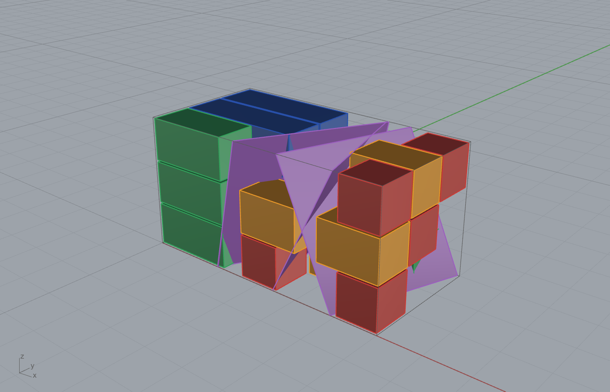

The economics are non-trivial: per the catalogue, price per $m^3$ falls and cut
cost per $m^3$ rises as blocks shrink, so the smallest 1x1x1 block has negative
net ($-200) (`25_cost_metrics.json` catalogue). The trade-off the example
quantifies: cost-to-balanced recovers +5.0 m3 for only -$1,000 net (-3.9%,
marginal $200/m3), but cost-to-volume costs -$8,950 (-34.9%) because reaching the
last cells forces premium gangsaw runs to be broken into loss-making offcuts. The
recommended operating point is balanced.

---

## 3.3 The bed-bounded hexahedra fix and flat-vs-oblique guillotine (example 08)

### 3.3.1 The bug

Example 08 packs real Botticino marble: a 600 MHz GPR grid yields 280 fracture
picks clustered into three dipping beds (0.72 m / 6.1 deg, 2.10 m / 0.9 deg,
3.70 m / 6.1 deg, sub-cm plane-fit RMS) (`08_marble_cost_volume_metrics.json`).

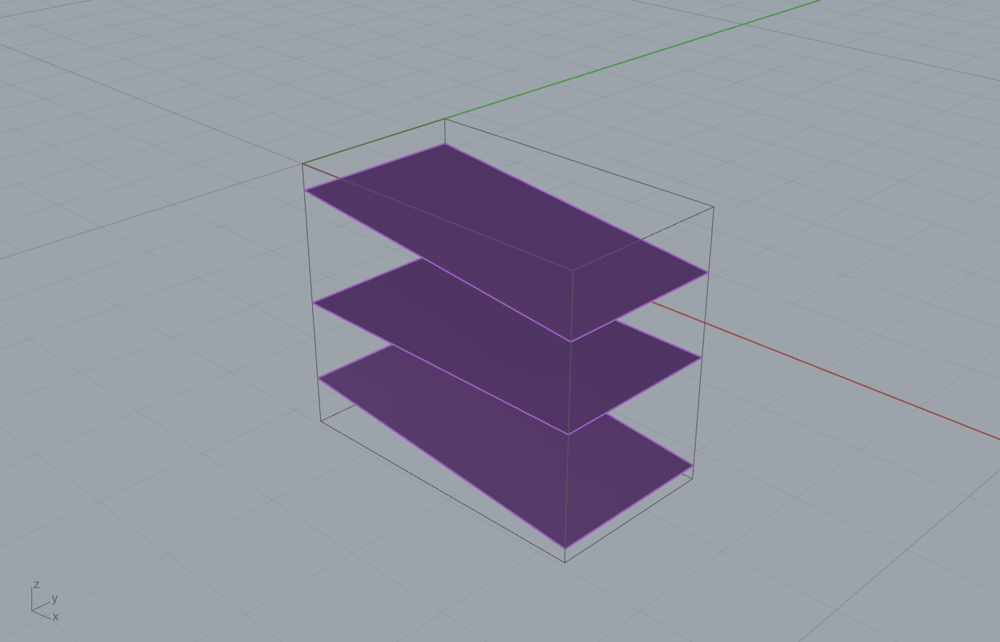

The original layout placed axis-aligned blocks at the *mean* bed depth. Because
the beds dip ~6 deg, a flat box centred at the mean depth **crosses** the dipping
bed plane at its ends, so the "intact" block actually straddles a parting. The
fix is to bound each block between the *true* bed planes rather than at a constant
$z$: the recovered solids are **bed-bounded hexahedra** whose top and bottom faces
follow the per-$(x,y)$ bed planes. The metrics note records this directly:
"Block economics use each layer's mean spacing; the oblique geometry follows the
true per-(x,y) bed planes, so displayed blocks never cross a bed"
(`08_marble_cost_volume_metrics.json`, limitations). Concretely, a block with
footprint $[x_0,x_1]\times[y_0,y_1]$ between an upper bed plane
$z_u(x,y)=a_u+b_u^x x+b_u^y y$ and a lower bed plane $z_\ell(x,y)$ has its eight
corners on those two planes, so its local height varies across the footprint and
no corner pierces a parting.

### 3.3.2 Flat versus oblique guillotine

Two cut plans are compared. The **flat** plan places horizontal full-span cuts at
the dip-safe envelope: the top cut at the *deepest* point of the upper bed, the
bottom at the *shallowest* point of the lower bed, minus the keep-out. The wedges
between the flat cut and the dipping bed are waste. This is fabricable on any
gangsaw today. The **oblique** plan tilts each bed-parallel pass to follow the
dipping bed, recovering the wedge.

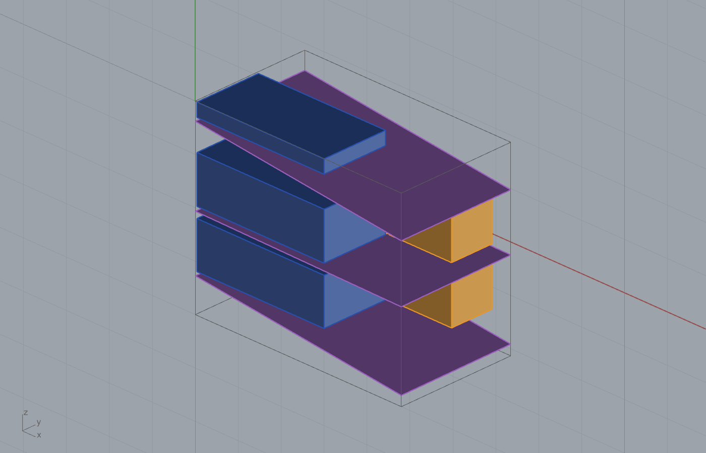

The dip-safe flat layer thicknesses collapse the nominal bed spacing
$[0.72,1.38,1.59,0.30]$ m down to $[0.328,1.051,1.037,0.161]$ m
(`flat_guillotine.dip_safe_layers_m`), losing the wedge volume. The measured
frontier (oblique vs flat, at max-cost):

| Plan | Volume | NET |
|---|---|---|
| Oblique (bed-following) | 32.16 m3 | $28,741 |
| Flat (orthogonal) | 20.26 m3 | $17,454 |


The **georeferencing prize** is the gap: oblique recovers +11.90 m3 (+59%) and
+$11,287 net per ~50 m3 bench, entirely because the beds dip ~6 deg. That delta is
the business case for the scanning + georeferenced-marking last mile required to
execute the sloped passes (`georeferencing_prize_at_max_cost`).

> **Originality.** The bed-bounded hexahedra fix and the flat/oblique frontier
> are study-level constructions in the example generator, not a Core algorithm
> class; they are a **facade-over-primitives** result (bed-plane fitting plus the
> packing objective composed in the example). The recovery, cost, and frontier
> numbers are measured, not gated by a Core unit test, so they are **REPORTED**
> per the honesty convention. Tier B (engineering study on real data).

---

## 3.4 The guillotine cut sequence (example 24)

A gangsaw or bridge saw can only make straight edge-to-edge passes. Guillotine
packing guarantees every placed block is reachable by such cuts, so the plan is
directly fabricable. Example 24 renders the literal saw passes that turn a
3.0 x 1.5 x 1.5 m quarry block into 20 dimension blocks of 0.5 m at 10 mm kerf
(grid $5\times2\times2$), in the real sequential order
(`24_guillotine_metrics.json`):

1. RIP perpendicular to X $\to$ 4 rip planes $\to$ slabs.
2. CROSS-Y per slab $\to$ 5 planes $\to$ columns.
3. CROSS-Z per column $\to$ 10 planes $\to$ the 20 finished blocks.

That is **19 guillotine cuts** for 20 blocks: each plane spans only its current
sub-region, which is the defining property of a guillotine cut.

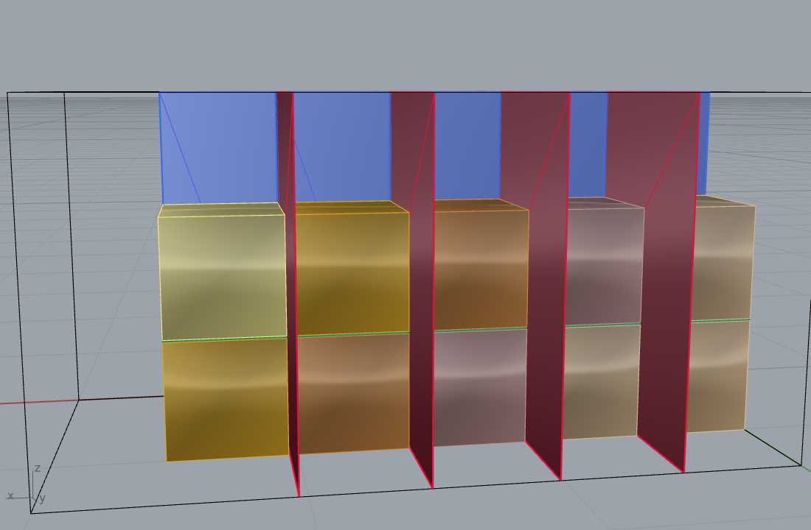

The same hierarchy resolves the balanced packing of example 25 into a saw plan:
two perp-Y cuts (3 slices), two perp-Z cuts (9 beams of 1 x 1 x 6 m), then 25
perp-X rip cuts within each beam, 29 passes total
(`25_cost_metrics.json`, `guillotine_cuts_balanced`). The oblique counterpart for
example 08 is 3 tilted bed-parallel passes plus 24 vertical rips, of which only
the 3 tilted passes need georeferenced marking
(`oblique_guillotine_cut_plan_balanced`).

> **Originality.** Guillotine staging: **facade-over-primitives** / Tier C. It is
> standard staged guillotine cutting (Gilmore and Gomory 1965 lineage); the
> contribution is the rendered, in-order, fabricable saw plan on real geometry,
> not a new algorithm.

---

## 3.5 The recovery cascade (multi-scale reject-recover)

`RecoveryCascade` is the repository's named evolved-fork increment over single-
scale BlockCutOpt. At each scale (coarse $\to$ fine) the solver runs on the tested
region; non-intersected blocks are *recovered*, and every block a fracture crosses
is fed back into the **same** engine at the next finer scale, cutting *around* the
fracture, until the remnant falls below the smallest marketable size
(`RecoveryCascade.cs:9-37`). The value recovered from a region $R$ at scale $s$
obeys the recursion (`RecoveryCascade.cs:26-29`):

$$
W(R,s)=\!\!\sum_{b\in\mathrm{kept}(R,s)}\!\!\mathrm{RMV}_s(b)
\;+\!\!\sum_{b\in\mathrm{cracked}(R,s)}\!\!
\begin{cases}
W\!\left(\mathrm{AABB}(b),\,s{+}1\right) & s{+}1<S,\ \mathrm{Vol}(b)\ge V_{\min},\\
\mathrm{residual}(b) & \text{otherwise,}
\end{cases}
$$

where kept/cracked partition the winning grid by the same SAT predicate
`!bvh.AnyTriangleIntersects` used in the single-scale solver
(`RecoveryCascade.cs:91-119`). The recursion depth is capped at the number of
scales (`RecoveryCascade.cs:74`), so it terminates. Crucially, with a single
`ScaleSpec` the cascade recovers exactly the blocks `BlockCutOptSolver.Solve`
finds at the same winning pose, so it is a faithful **superset** that reduces to
BlockCutOpt 2020 (`RecoveryCascade.cs:21-24`). This reject-coarse / recover-fine
structure is grounded in conditional two-scale cutting (Yarahmadi et al. 2018),
usable-leftover thresholds (Cherri et al. 2009), and staged guillotine cut-up
(Gilmore and Gomory 1965), with the unified 3D recursive form introduced in the
companion paper (`RecoveryCascade.cs:31-36`).

> **Originality.** `RecoveryCascade`: **evolved-fork** / **A-candidate** for the
> unified 3D recursive formulation. **Licensing/honesty flag (E9):** the header
> previously self-described "novel"; the audit ruling is to soften this with the
> BoEGE cite, which the current header does (Murugean 2026,
> DOI 10.5281/zenodo.20608279). The class is Core-validated (six headless tests
> per memory) but has **no GH consumer**; the shipped `FractureBlockPack`
> component ships a self-contained recovery engine that calls none of
> `RecoveryCascade` / `BlockCutOptSolver` / `Dlbf3dMixedSizePacker`
> (`FractureBlockPackComponent.cs:9-25`), a silent-disagreement risk whose
> resolution is facade-not-fork.

---

## 3.6 In-block secondary cutting (AMRR, I9/I12)

Improvement I9 couples the quarry-scale solver to in-block secondary cutting via
the Shao et al. (2022) AMRR (Average Material Removal Rate) plane-sequence
strategy (`AmrrPlanner.cs:7-31`). The planner iteratively cuts a blank convex
polyhedron by planes tangent to a target shape (a bounding sphere in v1): find the
vertex $P_v$ farthest outside the target, cut by the plane through the tangent
point with normal from centre to $P_v$, record the step, and repeat until the
outside volume falls below a convergence fraction (`AmrrPlanner.cs:132-178`). The
objective maximised is the average removal rate

$$
\mathrm{AMRR}=\frac{\sum_i V_{r,i}}{\sum_i \tau_i},
$$

removed volume over cutting time (`AmrrPlanResult.Amrr`, `AmrrPlanner.cs:85`),
where the per-cut path length feeding $\tau_i$ comes from the Minetto et al.
(2017) shared-edge mesh section (improvement I12, `SharedEdgeSlicer`, used at
`AmrrPlanner.cs:171-177`). The GH front end is `BlockCutOpt AMRR Plan`
(GUID `F2D0BC03-...`, `[Algorithm("AMRR in-block plane-sequence cutting",
"Shao, Liu, Gao 2022 ...")]`, `BlockCutOptComponents.cs:215`).

> **Originality.** `AmrrPlanner`: **clean-room** faithful implementation of
> Shao et al. (2022); `SharedEdgeSlicer` likewise of Minetto et al. (2017).
> Tier B.

---

## 3.7 Saw-bed scheduling and extraction order (Quarry tab)

Two scheduling helpers round out the tab. The **Saw Bed Schedule** component
assigns recovered blocks to gangsaw beds by greedy LPT (Longest Processing Time)
list scheduling (Graham 1969, `[Algorithm("Greedy LPT list scheduling",
"Graham 1969 ...", Doi 10.1137/0117039)]`,
`QuarryCutOptComponents.cs:322`). The **Extraction Order Optimizer** sorts blocks
by a weighted-sum greedy rule with a min-yield skip threshold; its `[Algorithm]`
attribute honestly records "Frahan-original ... no published scheduling algorithm
matched" (`QuarryCutOptComponents.cs:223`).

> **Originality.** Saw Bed Schedule: **clean-room** Graham 1969, Tier C.
> Extraction Order: **original-research / A-candidate** (self-declared, prior-art
> sweep pending). Evidence as cited.

---

## 3.8 Heterogeneous facade

`HeteroExt` (`Heterogeneous quarry extraction pipeline`,
`BlockCutOptHeterogeneousComponents.cs:169`) is the correct facade pattern: it
composes `BlockCutOptSolver` plus the Chehrazad et al. (2025) Deepest-Left-Bottom-
Fill 3D mixed-size packer (improvement I7, `[Algorithm("Deepest-Left-Bottom-Fill
(3D)", "Chehrazad, Roose, Wauters 2025 ...", Doi 10.1080/00207543.2025.2478434)]`,
`BlockCutOptHeterogeneousComponents.cs:42`). Per the HITL ruling its note credits
"interpretation and reimplementation of Elkarmoty 2020 and Chehrazad 2025 ... the
composition and the heterogeneity model are the contribution"
(`BlockCutOptHeterogeneousComponents.cs:169`).

> **Originality.** `HeteroExt`: **facade-over-primitives**. Tier D for the
> wrapper; the wrapped DLBF is clean-room Chehrazad 2025 (Tier B).

---

## 3.9 Status and what's left

- **RBE-style correctness is out of scope here** but the same audit gates the
  quarry tab's honesty conventions. No `BlockCutOpt` sign-bug is present; the
  parallel argmax is bit-identical to serial (validated).
- **`RecoveryCascade` has no GH consumer** (blocker for shipping the cascade on
  canvas). `FractureBlockPack` duplicates a recovery engine instead of calling
  the validated Core cascade; resolution is facade-not-fork.
- **Coarse-to-fine in the Omni solver is a stub bridge.** `UseCoarseToFine`
  currently runs the uniform-grid Pareto sweep at the fine step on both branches
  (`BlockCutOptOmniSolver.cs:150-169`), the worst-case wall clock; the true
  coarse-to-fine Pareto sweep is a follow-up.
- **Kerf volume is a film approximation** ($A_{xy}k/2$,
  `BlockCutOptSolver.cs:261-268`), refined alongside sub-division but not exact.
- **Two improvements unshipped:** I13 (multi-model joint generator, Tian 2025) is
  proposed only; I14 (composite multi-convex block, Zhang et al. 2024) is partial
  (`README.md:197-200`).
- **Bed-bounded hexahedra and the flat/oblique frontier are example-level**, not
  a Core class; numbers are REPORTED (measured), not gated by a unit test.
- **Data licence:** example 08 marble GPR data is CC-BY-NC-ND (research/testing
  only, not commercial product demos) (`08_marble_cost_volume_metrics.json`).

---

### References (this chapter)

Akenine-Moller, T. (2001). Fast 3D Triangle-Box Overlap Testing. *Journal of
Graphics Tools* 6(1):29-33.

Cherri, A.C., Arenales, M.N., Yanasse, H.H. (2009). The one-dimensional cutting
stock problem with usable leftover. *European Journal of Operational Research*
196(3):897-908. DOI 10.1016/j.ejor.2008.04.039.

Chehrazad, R., Roose, D., Wauters, T. (2025). A fast and scalable
deepest-left-bottom-fill algorithm. *International Journal of Production Research*
63:6606-6629. DOI 10.1080/00207543.2025.2478434.

Elkarmoty, M., Bondua, S., Bruno, R. (2020). A 3D brute-force algorithm for the
optimum cutting pattern of dimension stone quarries. *Resources Policy*
68:101761. DOI 10.1016/j.resourpol.2020.101761.

Gilmore, P.C., Gomory, R.E. (1965). Multistage cutting stock problems of two and
more dimensions. *Operations Research* 13(1):94-120. DOI 10.1287/opre.13.1.94.

Goodman, R.E., Shi, G.-h. (1985). *Block Theory and Its Application to Rock
Engineering.* Prentice-Hall.

Graham, R.L. (1969). Bounds on multiprocessing timing anomalies. *SIAM Journal on
Applied Mathematics* 17(2):416-429. DOI 10.1137/0117039.

Jalalian, M., Bagherpour, R., Khoshouei, M. (2023). Environmentally sustainable
mining in quarries to reduce waste production and loss of resources using the
developed optimization algorithm. *Scientific Reports* 13.
DOI 10.1038/s41598-023-49633-w.

Minetto, R., Volpato, N., Stolfi, J., Gregori, R.M.M.H., da Silva, M.V.G. (2017).
An optimal algorithm for 3D triangle mesh slicing. *Computer-Aided Design*
92:1-10. DOI 10.1016/j.cad.2017.07.001.

Murugean, L. (2026). GPR-to-block-yield optimization for fractured dimension-stone
quarries (submitted, *Bulletin of Engineering Geology and the Environment*;
reproducibility deposit). DOI 10.5281/zenodo.20608279.

Shao, H., Liu, Q., Gao, Z. (2022). Material Removal Optimization Strategy of 3D
Block Cutting Based on Geometric Computation Method. *Processes* 10(4):695.
DOI 10.3390/pr10040695.

Yarahmadi, R., Bagherpour, R., Sousa, L.M.O. (2018). Discontinuity modelling and
rock block geometry identification to optimize production in dimension stone
quarries. *Engineering Geology* 232:22-33. DOI 10.1016/j.enggeo.2017.11.006.

Zhang, N., Zheng, H., Yang, M., Wang, N. (2024). An open-source MATLAB toolbox for
3D block cutting and 3D mesh cutting in geotechnical engineering. *Advances in
Engineering Software* 197:103762. DOI 10.1016/j.advengsoft.2024.103762.

---

# 04. GPR Fracture & Cavity Mapping

This chapter covers the geophysical front end of the repository: the
ground-penetrating-radar (GPR) processing chain that turns a raw B-scan into a
fracture map, the surface fitting and uncertainty ladder that turn that map into
a quantified keep-out volume, and the earthworks reducers that lift a bedrock
surface out of the same picks. The subsystem lives under `Quarry/Processing`,
`Quarry/Ingestion`, and `Earthworks` in the Core assembly, with seven Grasshopper
adapters on the `Frahan > Quarry` ribbon. It is the geological front end that
chapter 3 (Quarry Block-Cutting) forward-references: chapter 3 takes the fracture
mesh as given input, and this chapter builds it
(`docs/thesis/chapters/03_quarry-blockcut.md:21-22`).

The whole pipeline is pure managed code. There is no MathNet, no Python runtime,
no native shim on the processing path; the FFT, the Hilbert transform, the
kriging, and the error function are all in-tree. This is a deliberate
constraint: the prototype that the C# Core mirrors was a Python/numpy/scikit-learn
script, and the port to dependency-light managed code is what makes the chain
installable beside the `.gha` without forcing scipy onto every machine
(`RadargramProcessor.cs:9-30`, `Kriging.cs:8-29`). The derivations below reuse
the mathematics validated in the submitted BoEGE paper (Murugean 2026), which
this subsystem underlies.

The core physical model is the constant-velocity time-to-depth conversion. A GPR
records two-way travel time $t$; with electromagnetic velocity $v$ in the rock,
the reflector depth is

$$
v=\frac{c}{\sqrt{\varepsilon_r}},\qquad \mathrm{depth}=\frac{v\,t}{2},
$$

where $c=0.299792458\,\mathrm{m/ns}$ and $\varepsilon_r$ is the relative
permittivity (marble $\varepsilon_r\approx9$, $v\approx0.10\,\mathrm{m/ns}$;
granite $\varepsilon_r\approx6$, $v\approx0.12\,\mathrm{m/ns}$). Velocity is the
single highest-leverage value in the whole chain because every depth scales with
it linearly (`RadargramProcessor.cs:27-28`; `GprPresets.cs:18-19`). The
`[Algorithm]` attribute on the front-end component states the model in one line:
"v=c/sqrt(eps_r); depth=v*t/2. Energy E=|s+iH{s}|^2; fractures are high-E
continuous reflectors, intact stone is low-E"
(`GprFractureExtractComponent.cs:43-45`).

---

## 4.1 Ingestion and the file dispatcher

The single canvas-side entry point is `GprFileReader.Load`, which dispatches by
extension to the format reader: CSV, SEG-Y (`.sgy`/`.segy`), MALA (`.rd3`),
Sensors & Software pulseEKKO (`.dt1`), IDS GeoRadar (`.dt`), and GSSI (`.dzt`)
(`GprFileReader.cs:23-46`). The proprietary Geoscanners AKULA `.gsf` format is
explicitly **not** guessed: the reader raises a `NotSupportedException` that tells
the user to convert to SEG-Y with GPRSoft or RGPR first, because the binary spec
is closed (`GprFileReader.cs:46-51`). This is the bridge-not-guess posture: a
wrong header guess on a proprietary container would silently corrupt the depth
axis.

`RadargramProcessor.ToGrid` builds the regular `[samples, traces]` amplitude grid
and recovers the **true** two-way sample interval $\mathrm{d}t$ in nanoseconds,
velocity-independent, so the caller scales depth with the stone velocity rather
than baking a velocity into ingest. It prefers the reader-supplied
`SampleIntervalNs`; only when that is unknown does it fall back to recovering
$\mathrm{d}t$ from the metres-per-sample step at vacuum velocity
($\mathrm{d}z=c\,\mathrm{d}t/2$) (`RadargramProcessor.cs:42-75`).

> **Originality.** `GprFileReader` and the per-format readers are
> **vendored-library / clean-room** depending on the format: each reader
> implements a published or open binary spec (pulseEKKO DT1/HD is the
> public-domain USGS OFR 02-166 spec, Lucius and Powers 1999; SEG-Y is the SEG
> standard). The dispatcher itself is a thin switch and adds no algorithm. No
> proprietary spec is reverse-engineered.

---

## 4.2 The B-scan processing chain

`RadargramProcessor.Run` is the validated chain, mirroring the Python prototype
stage for stage (`RadargramProcessor.cs:334-357`):

$$
\textsf{dewow}\to\textsf{bg-removal}\to\textsf{time-zero mute}\to\textsf{smooth}\to\textsf{t-gain}\to[\textsf{Stolt}\to\textsf{smooth}]\to\textsf{Hilbert energy}\to\textsf{smooth}\to\textsf{depth-equalize}.
$$

The early stages are elementary 1-D filters: **dewow** is a high-pass running-mean
subtraction that removes the low-frequency "wow" baseline drift
(`Dewow`, `:100-115`); **background removal** subtracts the mean trace to kill
horizontal banding and the direct air-wave (`:152-163`); the **time-zero mute**
zeroes the air-wave / antenna-coupling band (`:165-170`); **t-power gain**
multiplies by $(i\,\mathrm{d}t+1)^p$ to compensate spherical divergence and
absorption (`:172-182`). Each box-mean uses an $O(\mathrm{len})$ running sum with
numpy `'same'` edge semantics so the C# output is bit-comparable to the
prototype (`BoxMeanSame`, `:83-98`). The column operations are independent, so
they run as deterministic `Parallel.For` with thread-local scratch (a fixed
output partition makes the parallel result bit-identical to the serial loop,
`:104-114`, `:295-307`).

> **Originality.** The dewow / background / mute / gain / AGC primitives are
> **clean-room** standard GPR processing (Annan 2009; Neal 2004), implemented from
> published signal-processing definitions with no upstream code in the tree. The
> contribution is the validated *ordering and parameterisation*, not the filters.

### 4.2.1 The FFT and Hilbert transform (clean-room numerics)

The spectral stages need an exact-length forward and inverse transform that
matches `numpy.fft`. The in-tree `Fft` is a radix-2 Cooley-Tukey transform
(Cooley and Tukey 1965) for power-of-two lengths, with a **Bluestein chirp-z**
fallback for arbitrary lengths so the 2-D Stolt migration and the Hilbert
envelope operate on the **exact** sample and trace counts; zero-padding would
shift the frequency grid and bias the migration (`Fft.cs:30-94`). The Bluestein
plan (the chirp and the precomputed kernel spectrum) is length-only, so it is
built once per distinct length and reused across every trace, the single biggest
speed-up for the 986-same-length envelope loop (`Fft.cs:96-149`).

The instantaneous-energy attribute is the analytic-signal magnitude. For a real
trace $s$, the analytic signal is $s+i\,\mathcal{H}\{s\}$, where $\mathcal{H}$ is
the Hilbert transform; the instantaneous amplitude (envelope) is its magnitude
and the **instantaneous energy** is the square:

$$
E(i,t)=\bigl|\,s(i,t)+i\,\mathcal{H}\{s\}(i,t)\,\bigr|^2.
$$

The envelope is computed by the spectral method (Taner, Koehler and Sheriff
1979): forward-FFT the trace, apply the one-sided weighting
$H=[1,2,2,\dots,2,1,0,\dots,0]$ that doubles the positive frequencies and zeroes
the negatives, inverse-FFT, take the magnitude (`AnalyticEnvelope`,
`Fft.cs:159-185`; `HilbertEnergy`, `RadargramProcessor.cs:293-308`). The physical
reading is the literature consensus: a fracture or cavity is an impedance
contrast that reflects strongly, while intact stone is the low-energy background
(Porsani et al. 2006; Isakova 2021), so high instantaneous energy is the fracture
proxy.

> **Originality.** `Fft` is **clean-room**: a numerical method (radix-2 + Bluestein)
> is not copyrightable and the file says so (`Fft.cs:16-18`). The Hilbert-envelope
> attribute is the textbook Taner et al. (1979) complex-trace analysis, cited in
> the front-end `[Algorithm]` (`GprFractureExtractComponent.cs:44`).

### 4.2.2 Stolt f-k migration with half-velocity (original derivation)

Diffraction hyperbolae and dipping reflectors are mispositioned in the raw
B-scan; migration collapses diffractions and moves dipping events to true
position. The repository implements **Stolt (1978) f-k migration** in the
exploding-reflector model. The key step is the constant-velocity dispersion
relation that maps the recorded temporal frequency $\omega$ to the vertical
wavenumber $k_z$.

**Derivation.** A monochromatic plane wave in the exploding-reflector model
travels at the **migration velocity** $v_m=v/2$ (the half-velocity that converts
two-way time to one-way depth). Its dispersion relation links the temporal
frequency $\omega$ to the spatial wavenumbers $(k_x,k_z)$:

$$
\omega = v_m\,\operatorname{sign}(k_z)\sqrt{k_z^2+k_x^2}.
$$

Solving for the source frequency at a target output wavenumber $k_z=\omega/v_m$
gives the Stolt remap: each output cell $(k_z,k_x)$ samples the recorded spectrum
at

$$
\omega' = v_m\,\operatorname{sign}(k_z)\sqrt{k_z^2+k_x^2},
$$

and because the remap stretches the frequency axis non-uniformly, energy must be
rescaled by the **Stolt Jacobian** $\partial\omega'/\partial k_z$:

$$
J=\frac{\partial\omega'}{\partial k_z}=\frac{v_m\,|k_z|}{|\omega'|}.
$$

The implementation builds the 2-D spectrum on the exact grid, applies the
remap by linear interpolation in $\omega$, multiplies by $J$, and inverse-FFTs
(`StoltMigration`, `RadargramProcessor.cs:199-291`; remap and Jacobian at
`:259-267`). The half-velocity $v_m=v/2$ is set explicitly at `:208`, the depth
floor that the rest of the chain depends on.

The repository adds a **cosine dip-taper** that the bare Stolt operator lacks.
Steep-dip events near the evanescent boundary $|v_m k_x|/|\omega|\to1$ alias; the
taper smoothly zeroes the spectrum there:

$$
\textsf{taper}(r)=\begin{cases}1 & r<0.85\\[2pt] \tfrac12\bigl(1+\cos\frac{\pi(r-0.85)}{0.15}\bigr) & 0.85\le r\le 1\\[2pt] 0 & r>1\end{cases},\qquad r=\frac{|v_m k_x|}{|\omega|},
$$

which suppresses steep-dip aliasing before the remap (`:235-244`). The
frequency grids $\omega$ and $k_x$ follow the `numpy.fftfreq` ordering exactly
(`FftFreq`, `:361-370`) so the migrated section matches the validated prototype.

> **Originality.** Stolt migration is **clean-room** from Stolt (1978), cited in
> the `[Algorithm]` attribute (`GprFractureExtractComponent.cs:44`). The
> half-velocity exploding-reflector model and the Jacobian are the published
> method. The cosine dip-taper is a small **evolved** anti-alias addition on top
> of the bare operator; it is an engineering delta, not a new migration.

### 4.2.3 Depth equalisation

A locally strong **deep** reflector still reads weaker than a shallow one because
absolute energy decays with depth. `DepthEqualizeEnergy` normalises each depth row
by a smoothed per-row median, so a deep fracture surfaces at the same relative
energy as a shallow one (`:310-332`). This is the relative-amplitude display
behind the energy section; it is a display normalisation, not a detector, and it
is preset-toggleable.

---

## 4.3 Fracture extraction: high energy plus dip-aware continuity

`FractureExtractor.Extract` consumes the instantaneous-energy section and applies
two rules from the reviewed literature (`FractureExtractor.cs:8-24`).

**Rule 1, high-energy local maxima.** A sample is a candidate if its normalised
energy exceeds a high quantile (default $0.985$) and it is a per-column local
maximum (`:64-74`). The quantile is a robust threshold: the top 1.5% of energy is
the reflector population, the rest is intact-stone background.

**Rule 2, the USGS lateral-continuity criterion.** A genuine reflector is
laterally **continuous**; an isolated bright spot is clutter or a point
diffraction. The USGS Mirror Lake protocol keeps a pick only if at least a
minimum number of like picks fall within a horizontal window (the granite default
is $\ge40$ traces $\approx1\,\mathrm{m}$) in a narrow depth band
(`:18-21`, `:30-35`). The repository **evolves** the flat-horizon version of this
test into a **dip-aware** filter.

**Original derivation: dip-aware continuity.** A horizontal running-sum counts
support only along sub-horizontal reflectors and rejects dipping shear zones that
are real. To follow a dip, the extractor shears the mask so a reflector of slope
$\sigma$ (samples per trace) becomes horizontal, counts support along the now-flat
event over the trace window, unshears, and keeps the **maximum** support over a
set of candidate slopes (`:76-130`). The slope range is bounded by the maximum
dip the filter follows. Mapping a dip angle $\theta$ to a sample slope uses the
depth-per-sample $\Delta=v\,\mathrm{d}t/2$ and the trace spacing $\mathrm{d}x$:

$$
\sigma_{\max}=\frac{\tan(\theta_{\max})\,\mathrm{d}x}{\Delta},\qquad \Delta=\frac{v\,\mathrm{d}t}{2},
$$

with $\theta_{\max}=45^\circ$ by default; events steeper than the gate find no
matching slope and are rejected, enforcing the USGS $<45^\circ$ continuity gate
(`:80-91`, `DipMaxDeg` `:36-40`). The kept picks carry depth $v(i\,\mathrm{d}t)/2$
and a normalised-energy confidence (`:132-143`), then convert to
world-coordinate `GprReflectorPick` records using the trace positions
(`:146-159`).

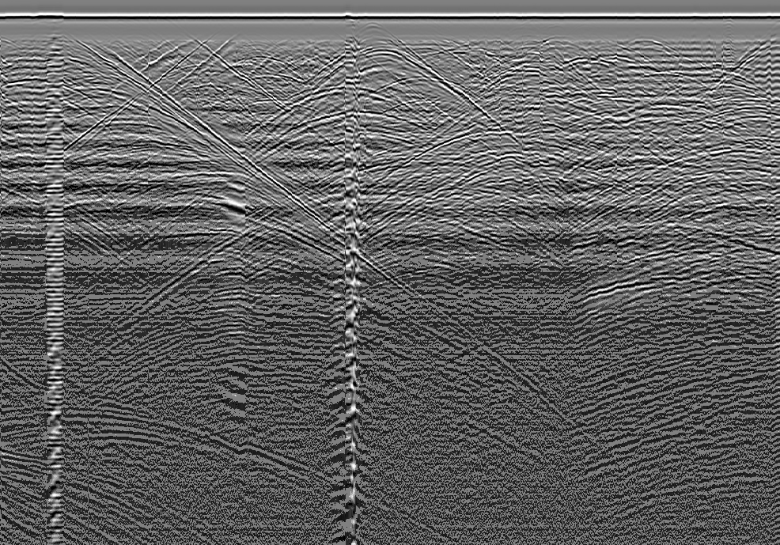

The granite spine (example 3) runs this chain end-to-end on the real Grimsel ISC
data (MALA GX160, AU and VE tunnels, CC-BY-4.0): with the `granite_160` preset it
extracts 1472 picks on AU and 1485 on VE, at $\mathrm{d}t=0.4464\,\mathrm{ns}$
and $\mathrm{d}x=0.0498\,\mathrm{m}$
(`examples/03_gpr_fracture_granite/README.md:14`).

> **Originality.** `FractureExtractor` is **evolved-fork**. The high-energy +
> USGS-continuity base is clean-room from the cited literature (USGS Mirror Lake
> WRIR 99-4018C; Porsani 2006; Isakova 2021,
> `GprFractureExtractComponent.cs:44`). The dip-aware shear-count continuity that
> follows dipping shear zones while gating steep events is the measured delta over
> the flat-horizon USGS test. Fronted by **GPR Fracture Extract** (GUID
> `A7E0B0F1-0C0F-4A16-9E3D-0FACE0FACE02`, `GprFractureExtractComponent.cs:66`),
> `Exposure=secondary`.

### 4.3.1 Stone-by-frequency presets

`GprPresets` holds the parameter sets that produced the validated 3-D models, one
per stone-type x antenna-frequency, with window sizes as **fractions** of the
trace sample count so a preset transfers across acquisitions (`GprPresets.cs:7-25`).
Two presets are empirically tuned on real data (`marble_600` on Bondua Botticino,
`granite_160` on Doetsch Grimsel); a granite frequency family (25-1200 MHz) and
the travertine / andesite / limestone presets carry paper-measured velocities but
extrapolated filter windows. The `IsEmpirical` flag records which is which so the
GH component can warn the user (`GprPresets.cs:22-24`, `:86`, `:111`). The marble
preset notably **narrows** the continuity span to 27 traces ($\approx0.65\,\mathrm{m}$)
because marble fractures (stylolites, veins) are shorter than granite shear zones
($\approx0.9\,\mathrm{m}$ measured), surfacing marble's genuine short reflectors
from the same energy bar (`GprPresets.cs:90-94`).

> **Originality.** **clean-room** parameter catalogue, no algorithm. The presets
> are calibration data; the `IsEmpirical` honesty flag distinguishes validated
> from literature-default values.

---

## 4.4 From picks to surfaces

`FractureSurface` builds fracture **surfaces** from picks by two paths
(`FractureSurface.cs:8-25`). The managed loft path extrudes an ordered fracture
polyline along strike, or lofts adjacent parallel section-lines across a survey
grid onto a common X grid; the surface orientation follows the reflector
(sub-horizontal stays sub-horizontal, dipping stays dipping) rather than forcing a
vertical sheet (`Loft`, `:42-70`; `LoftAcrossLines`, `:77-110`). The reconstruct
path takes an unordered fracture point cloud and runs geogram screened-Poisson
(Kazhdan and Hoppe 2013) first, falling back to CGAL advancing-front for open
sheets (`TryReconstructFromCloud`, `:112-139`). The heavy 3-D reconstruction is
the only place this chapter touches a native shim, and it is optional with a clear
error when absent.

> **Originality.** The loft path is **clean-room** elementary surface
> construction. The reconstruction path is **wrapper-of-native** over the geogram
> (BSD-3, with bundled Kazhdan PoissonRecon MIT) and CGAL (GPL) shims, reached
> out-of-process; only the dispatch is ours, and the CGAL route is quarantined per
> the licensing register.

---

## 4.5 The uncertainty ladder and safe yield

The deliverable is not a fracture surface, it is an **honest** fracture surface:
how far the reconstructed surface can deviate from the true fracture, propagated
through the pipeline, so a quarry can set a keep-out margin and pack blocks only
into provably-intact rock. `FractureUncertainty` is that tolerance ladder
(`FractureUncertainty.cs:6-33`). The per-location 1-sigma position uncertainty
combines three independent contributions in quadrature:

$$
\sigma_{\text{total}}=\sqrt{\sigma_{\text{recon}}^2+\sigma_{\text{interp}}^2+\sigma_{\text{mesh}}^2}.
$$

**Reconstruction sigma (original derivation).** The GPR time-to-depth conversion
$\mathrm{depth}=v\,t/2$ with $v=c/\sqrt{\varepsilon_r}$ has three error sources.
First, a relative velocity error that **grows with depth**: differentiating
$v\propto\varepsilon_r^{-1/2}$ gives

$$
\frac{\sigma_v}{v}=\tfrac12\,\frac{\sigma_{\varepsilon_r}}{\varepsilon_r},
$$

so the depth term is $\mathrm{depth}\cdot\sigma_v/v$ (`VelocityRelUncertainty`,
`:48-53`). Second, the vertical-resolution floor $\lambda/4$, with
$\lambda/4=v/(4f)$ (`LambdaQuarter`, `:39-45`). Third, the **time-zero pick
ambiguity** $v\,\sigma_{t_0}/2$, where the first-break-to-first-apex window is a
rectangular distribution $\sigma_{t_0}=(t_{\text{apex}}-t_{\text{break}})/(2\sqrt3)$
(`TimeZeroSigma`, `RectTimeZeroSigma`, `:55-65`). The combined reconstruction
sigma is

$$
\sigma_{\text{recon}}=\sqrt{\bigl(\mathrm{depth}\cdot\tfrac{\sigma_v}{v}\bigr)^2+\bigl(\tfrac{\lambda}{4}\bigr)^2+\sigma_{t_0}^2}.
$$

The velocity term leads at quarry depth (Porsani 2006 reports
$\pm8.5\text{-}9.5\%$ at 25 m); the time-zero term leads near the surface (Xie,
Lai and Derobert 2021); $\lambda/4$ is a floor, not the dominant term
(`DepthSigma`, `:67-81`). Passing $\sigma_{t_0}=0$ reproduces the original
two-term form, so the time-zero rung is an additive **evolution** of the earlier
ladder (`:67-72`).

**Interpolation sigma.** Between scan lines the surface is interpolated, and the
interpolation has its own uncertainty: zero at a pick, growing in the gaps. This
is supplied by the kriging posterior standard deviation. The `Kriging` class is
simple kriging on mean-centred data with a Gaussian covariance
$C(h)=\text{sill}\cdot e^{-(h/\text{range})^2}$ and a nugget; the posterior
variance at a query point is

$$
\mathrm{var}(x_\ast)=(\text{sill}+\text{nugget})-w^\top w,\qquad w=L^{-1}k_\ast,\quad K=LL^\top,
$$

i.e. the prior variance minus what the data explain, via the Cholesky factor
(`Kriging.cs:19-29`). It is the managed replacement for the prototype's
scikit-learn `GaussianProcessRegressor`, exact and shim-free because kriging is
linear algebra (Cressie 1993; Rasmussen and Williams 2006).

**Mesh sigma.** The triangulation cuts the true curved surface by the chord
sagitta, $\sigma_{\text{mesh}}=(h^2/8)\,\kappa$ for edge length $h$ and curvature
$\kappa$ (`MeshSigma`, `:83-85`).

**The confidence metric.** The optimisation target is not sigma itself but the
**confidence**: the probability that the fracture lies within a fabrication
tolerance $T$, assuming a zero-mean Gaussian deviation,

$$
\textsf{confidence}(x)=\operatorname{erf}\!\Bigl(\frac{T}{\sigma_{\text{total}}(x)\sqrt2}\Bigr),
$$

averaged over the surface (`ConfidenceWithin`, `:95-100`). The error function is
the Abramowitz-Stegun 7.1.26 rational approximation ($|\text{error}|<1.5\times10^{-7}$),
again to avoid a MathNet dependency (`Erf`, `:222-230`). Lowering sigma (calibrate
velocity, denser scan lines, higher frequency, finer mesh) raises confidence; the
ladder quantifies each trade.

**The detection rung (original derivation).** A position sigma only matters for a
fracture that is **seen**. A missed fracture has no sigma but is the real yield
risk, so the ladder adds a detection model grounded in the imaging literature
(Molron et al. 2020 Aspo; Dorn et al. 2012). The minimum detectable area is
Fresnel-zone limited and grows with depth, $A_{\min}\approx(\lambda/4)\cdot
\mathrm{depth}/2$ above a shallow resolution floor (`MinDetectableArea`,
`:111-128`). The detection probability factorises over dip, aperture, and size:

$$
P_{\text{det}}=\eta\cdot p_{\text{dip}}\cdot p_{\text{open}}\cdot p_{\text{size}},\qquad p_{\text{size}}=\frac{A}{A+A_{\min}},
$$

with $\eta$ the imaging ceiling ($\approx0.80$ open, Molron; $0.91$ transmissive,
Dorn), $p_{\text{dip}}=1$ for sub-horizontal fractures smoothstepping to $0.1$ by
$75^\circ$ (surface GPR poorly images sub-vertical fractures), and a sealed-factor
penalty for mineral-filled fractures (`DetectionProbability`, `:130-150`). The
**effective confidence** caps position confidence by detection completeness,
$C_{\text{eff}}=P_{\text{det}}\cdot\textsf{confidence}$, so a low detection
probability limits trust however precisely the seen fractures are located
(`EffectiveConfidence`, `:152-160`; `Summarise`, `:191-220`).

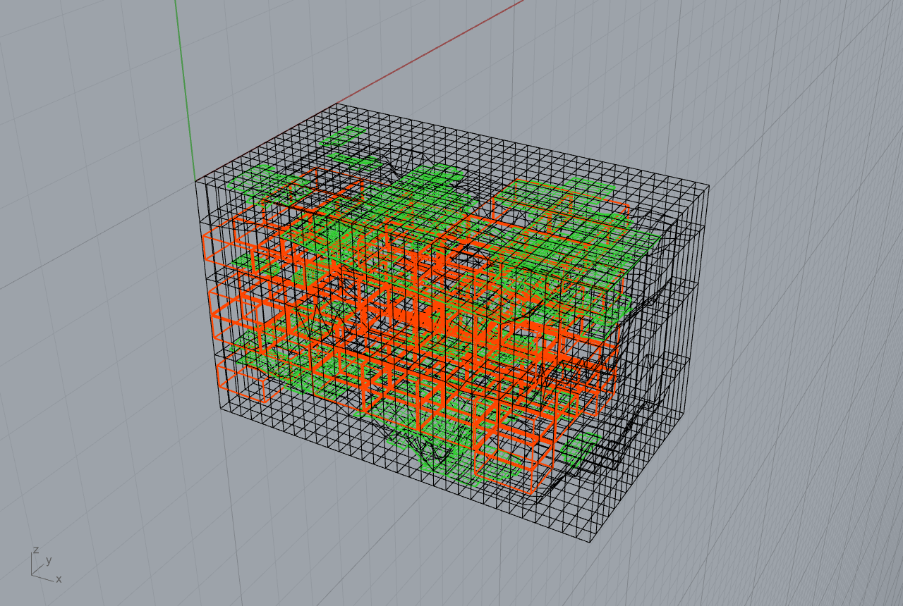

Example 9 is the full quarry decision. The GPR fracture surfaces (from the granite
spine) bound the intact zones; **Fracture Block Pack** (GUID
`A7E0B0F3-0C0F-4A16-9E3D-0FACE0FACE04`) packs fixed-size dimension blocks into
each zone with an inward **Fracture Clearance** wired to the GPR position sigma,
so no block sits within the measured uncertainty of a fracture. Toggling
uncertainty-safe off gives the optimistic geometric yield; on gives the
uncertainty-safe yield (`FractureBlockPackComponent.cs:10-25`;
`examples/09_uncertainty_safe_yield/README.md:12-17`).

> **Originality.** `FractureUncertainty` is **original-research** (A-candidate).
> The three-rung position ladder, the depth-growing velocity term plus time-zero
> plus $\lambda/4$ decomposition, and the detection rung with the depth-aware
> Fresnel floor and the $P_{\text{det}}$ factorisation are the Frahan
> contribution; the underlying physics is cited (Porsani 2006; Xie 2021; Molron
> 2020; Dorn 2012). `Kriging` is **clean-room** ordinary kriging (Cressie 1993;
> Rasmussen and Williams 2006). The surface-and-ladder front end is **GPR Fracture
> Surfaces 3D** (GUID `A7E0B0F2-0C0F-4A16-9E3D-0FACE0FACE03`,
> `GprFractureSurface3DComponent.cs:30`), which clusters the pick cloud, kriges
> each fracture, and colour-maps $\sigma_{\text{total}}$ green-to-red.

---

## 4.6 RecoveryCascade: multi-scale crack-aware recovery

The fracture map feeds the block-cutting solver of chapter 3, but a single-scale
packer discards every block a fracture crosses. `RecoveryCascade` recovers value
from those blocks by running the cutter at progressively finer scales: at each
scale BlockCutOpt is solved on the region, the non-intersected blocks are
recovered, and every cracked block is fed back into the **same** engine at the
next finer scale, cutting around the fracture, until the remnant falls below the
smallest marketable size (`RecoveryCascade.cs:9-37`).

**Original derivation: the recovery recursion.** The value recovered from a tested
region $R$ at scale $s$ is

$$
W(R,s)=\sum_{b\in\text{kept}(R,s)}\!\mathrm{RMV}_s(b)\;+\;\sum_{b\in\text{cracked}(R,s)}\!\begin{cases}W\bigl(\mathrm{AABB}(b),\,s{+}1\bigr) & s{+}1<S,\ \mathrm{Vol}\ge V_{\min}\\[2pt]\text{residual}(b) & \text{otherwise}\end{cases},
$$

where the kept / cracked partition of the winning grid is decided by
`!bvh.AnyTriangleIntersects` against a single shared immutable fracture BVH
(`RecoveryCascade.cs:25-29`, `:91-119`). The recursion depth is capped at the
number of scales, so it cannot run unbounded (`:74`). Crucially, with a single
`ScaleSpec` the cascade recovers exactly the non-intersected blocks
`BlockCutOptSolver.Solve` finds, with the same winning pose and the same
intersection predicate, so it **reduces to BlockCutOpt 2020 exactly at scale 1**
and is a faithful superset (`:21-24`). It is grounded in the conditional
two-scale (Yarahmadi 2018), usable-leftover (Cherri 2009), and staged-guillotine
(Gilmore and Gomory 1965) literatures.

> **Originality.** `RecoveryCascade` is **evolved-fork**. The 3-D recursive
> reject-recover cascade extends the single-scale BlockCutOpt baseline (chapter 3)
> to which it provably reduces. The header now credits the companion paper
> (Murugean 2026) for the unified cascade rather than self-labelling "novel"; the
> earlier unsoftened "novel" wording was flagged E9 in the originality audit
> (`docs/thesis/90_originality.md:188`). No GH consumer wires it yet (see
> Status). The separate `FractureBlockPack` GH component is a
> **facade-over-primitives** self-contained recovery engine that does **not** call
> `RecoveryCascade`, a silent-disagreement risk also tracked in the register.

---

## 4.7 Earthworks: bedrock surface and the overburden strip

The same GPR picks lift a **bedrock** surface for the overburden strip. The
deepest continuous strong reflector below the weathered cover is the top of fresh
rock (Porsani profiles; Bondua bedrock). `BedrockSurface.DeepestReflectorPoints`
reduces a pick set to the deepest qualifying reflector per $(x,y)$ column and
converts depth to world elevation $z_r=z_{\text{ground}}(x,y)-\mathrm{depth}$
(`BedrockSurface.cs:7-19`, `:51-93`). The picks come from one or more survey
lines, scattered in $(x,y)$.

`TinMerge.ResampleOntoVertices` fuses those sparse bedrock picks onto the dense
ground TIN so a downstream prism-difference can compute the overburden volume,
because that consumer requires both surfaces sampled on the **same**
triangulation (`TinMerge.cs:8-27`). It resamples by k-nearest **inverse-distance
weighting** (Shepard 1968):

$$
z(x_\ast)=\frac{\sum_i w_i\,z_i}{\sum_i w_i},\qquad w_i=\frac{1}{d_i^{\,p}},\quad p=2,
$$

over the k nearest source picks within a **scale-relative** radius (a multiple of
the median source spacing), with a uniform-grid spatial index, and flags target
vertices with no source inside the radius as NaN so the caller can clip them
(`TinMerge.cs:54-122`). Coordinates are recentered first so UTM / quarry-scale
$(x,y)$ do not lose mantissa precision (the GeometryNumerics T1 rule, `:20-23`).

`TinPeelFilter` is the upstream scan-cleaner. A raw Delaunay or Poisson
reconstruction fills the whole convex hull, so concave shorelines and data gaps
grow long thin cap triangles and near-vertical gap webs that are not real
terrain. The filter iteratively peels **border** triangles satisfying any of three
predicates, then drops connected components below a minimum size
(`TinPeelFilter.cs:7-29`): a **long edge** $\max(e_0,e_1,e_2)^2>(k\,m)^2$ where
$m$ is the median 2-D edge and $k=3$ aggressive / 10 careful; a **near-vertical
facet** with normal tilt $>85^\circ$; and a **cap / sliver** with an interior
angle opposite the border edge $>140^\circ$ (`:18-23`, `ShouldPeel`, `:139-163`).
The thresholds are relative to the local median edge, so the same filter works at
any survey scale (the scale-relative-epsilon principle).

> **Originality.** `TinPeelFilter` is **clean-room** (the border-peel logic ported
> from the Fade2D land-survey reference's `peelOffIf`, no upstream code, cited in
> the **Clean Scan Mesh** `[Algorithm]`, `CleanScanMeshComponent.cs:29-31`, GUID
> `A7E0B0F1-0C0F-4A16-9E3D-0FACE0FACE03`). `TinMerge` is **clean-room** k-NN IDW
> (Shepard 1968) with a scale-relative radius. `BedrockSurface` is **clean-room**:
> pure reduction and datum shift, no FFT. The bedrock front end is **GPR Bedrock
> Surface** (GUID `A7E0B0F1-0C0F-4A16-9E3D-0FACE0FACE04`,
> `GprBedrockSurfaceComponent.cs:33-35`, citing Porsani 2006 / Isakova 2021 for the
> top-of-rock reflector and Shepard 1968 for IDW).

---

## 4.8 The vector counterpart: surface fracture maps

GPR sees fractures with depth; a shapefile carries the mapped **surface** trace
network, the cheapest fracture data a quarry has (drone photo plus tracing).
Example 26 reads a real ESRI Shapefile of Loviisa rapakivi-granite fracture traces
through the `Frahan > Quarry > Ingestion` vector reader and renders the strike map.

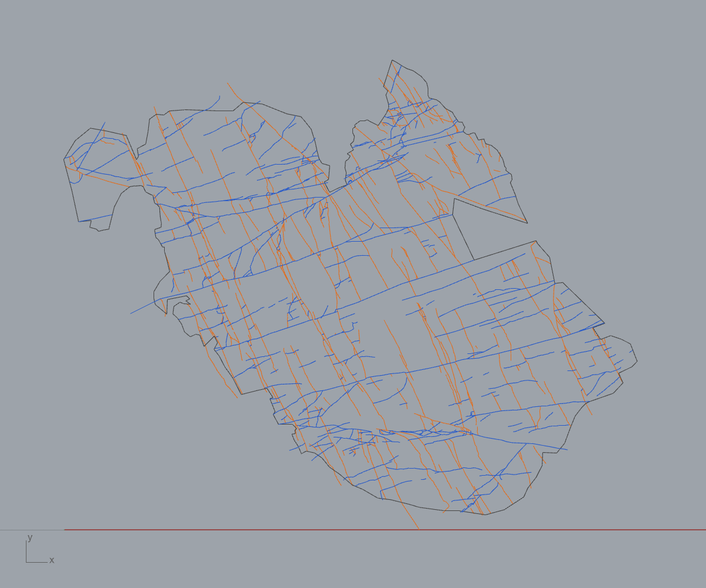

The reader returns 708 traces / 6483 vertices, total length 1593.5 m, CRS
EUREF_FIN_TM35FIN (EPSG:3067), with two conjugate sets peaking at $\approx15^\circ$
(NNE) and $\approx105\text{-}120^\circ$ (ESE) (Chudasama 2022, CC-BY-4.0;
`examples/26_loviisa_surface_fractures/README.md:26-30`). The strike histogram is
the input a quarry needs to orient block cuts away from the dominant joint set,
and combined with a GPR depth survey it constrains the 3-D intact-block volume.

> **Originality.** **vendored-library** reader (NetTopologySuite.IO.Esri, ESRI
> Shapefile / OGC Simple Features); the strike binning and rendering are
> clean-room, no new algorithm.

---

## 4.9 Status & what's left

- **Example 3 figure is a radargram, not the extracted-pick overlay.** The folder
  ships `03_gpr_radargram_AU.png` (the migrated section) plus the two `.gh`
  canvases, but no rendered fracture-pick / 3-D surface PNG; the README marks the
  example "pending live regeneration" with repath, stage groups, and a shaded
  viewport capture still to do (`examples/03_gpr_fracture_granite/README.md:22-26`).
  Severity: medium (documentation / figure gap, the chain itself is validated to
  the 1472 / 1485 pick counts).
- **`RecoveryCascade` has no GH consumer.** The recursion is implemented and tested
  in Core but no canvas component wires it, and the shipped `FractureBlockPack`
  component runs its own self-contained recovery engine instead, a silent
  disagreement risk if the two diverge (`docs/thesis/90_originality.md:66`,
  `:68`). Severity: high.
- **`.gsf` is read-only via conversion.** Geoscanners AKULA stays unsupported by
  design; the user must export to SEG-Y with GPRSoft or RGPR first
  (`GprFileReader.cs:46-51`). This blocks any dataset that ships only `.gsf`.
  Severity: medium (a real Tamil Nadu charnockite data path depends on it).
- **Literature-default presets are unvalidated end-to-end.** Only `marble_600` and
  `granite_160` are `IsEmpirical=true`; the granite frequency family and the
  travertine / andesite / limestone presets carry paper velocities but
  extrapolated filter windows (`GprPresets.cs:22-24`, `:110-111`). The component
  warns, but a user running an unvalidated preset gets uncalibrated continuity
  spans. Severity: medium.
- **Reconstruction path needs native shims.** `TryReconstructFromCloud` returns a
  clear error when geogram / CGAL are absent, and the CGAL route is GPL,
  quarantined out-of-process (`FractureSurface.cs:131-138`; licensing register
  E3/E4). The default install has no reconstruction; loft-only surfaces are the
  fallback. Severity: low (managed loft path covers the common ordered-line case).
- **AABB child region in the cascade is exact only for axis-aligned blocks.**
  `AabbOf` is exact for psi-only (axis-aligned) oriented blocks; a fully tilted
  pose feeds the finer scale a slightly loose axis-aligned bound
  (`RecoveryCascade.cs:122-123`). Severity: low (conservative, never drops a real
  block).

---

## References (this chapter)

- Stolt, R.H. (1978). Migration by Fourier transform. *Geophysics* 43(1):23-48. DOI 10.1190/1.1440826. [R146]
- Taner, M.T., Koehler, F., Sheriff, R.E. (1979). Complex seismic trace analysis. *Geophysics* 44(6):1041-1063. DOI 10.1190/1.1440994. [R147]
- Cooley, J.W., Tukey, J.W. (1965). An algorithm for the machine calculation of complex Fourier series. *Mathematics of Computation* 19(90):297-301. DOI 10.1090/S0025-5718-1965-0178586-1.
- Porsani, J.L., Sauck, W.A., Junior, A.O.S. (2006). GPR for mapping fractures and as a guide for the extraction of ornamental granite from a quarry. *Journal of Applied Geophysics* 58:177-187. DOI 10.1016/j.jappgeo.2005.05.010. [R34]
- Molron, J., Linde, N., Baron, L., Selroos, J.O., Darcel, C., Davy, P. (2020). Which fractures are imaged with ground penetrating radar? *Engineering Geology* 273:105674. DOI 10.1016/j.enggeo.2020.105674. [R36]
- Dorn, C., Linde, N., Doetsch, J., Le Borgne, T., Bour, O. (2012). Fracture imaging within a granitic rock aquifer using multiple-offset single-hole and cross-hole GPR reflection data. *Journal of Applied Geophysics* 78:123-132. DOI 10.1016/j.jappgeo.2011.01.010. [R37]
- Xie, F., Lai, W.W.L., Derobert, X. (2021). GPR-based depth measurement of buried objects based on constrained least-square fitting. *Measurement* 168:108330. DOI 10.1016/j.measurement.2020.108330. [R41]
- Annan, A.P. (2009). Electromagnetic principles of ground penetrating radar. In: Jol, H.M. (ed.) *Ground Penetrating Radar: Theory and Applications.* Elsevier, pp 3-40. [R39]
- Neal, A. (2004). Ground-penetrating radar and its use in sedimentology. *Earth-Science Reviews* 66:261-330. DOI 10.1016/j.earscirev.2004.01.004. [R40]
- Bondua, S., Monteiro Klen, A., Pilone, M., Asimopolos, L., Asimopolos, N.S. (2024). A set of ground penetrating radar measures from quarries. *Data* 9(3):42. DOI 10.3390/data9030042. [R44]
- Huber, E., Hans, G. (2018). RGPR — an open-source package to process and visualize GPR data. *17th International Conference on GPR*, IEEE. DOI 10.1109/ICGPR.2018.8441658. [R43]
- Lucius, J.E., Powers, M.H. (1999). USGS Open-File Report 02-166: GPR data-format documentation (pulseEKKO DT1/HD spec). [R45]
- Shepard, D. (1968). A two-dimensional interpolation function for irregularly-spaced data. *Proc. 23rd ACM National Conference*, pp 517-524. DOI 10.1145/800186.810616.
- Cressie, N.A.C. (1993). *Statistics for Spatial Data.* Wiley. DOI 10.1002/9781119115151. [R119]
- Rasmussen, C.E., Williams, C.K.I. (2006). *Gaussian Processes for Machine Learning.* MIT Press. DOI 10.7551/mitpress/3206.001.0001. [R120]
- Kazhdan, M., Hoppe, H. (2013). Screened Poisson surface reconstruction. *ACM Transactions on Graphics* 32(3):29. DOI 10.1145/2487228.2487237. [R91]
- Yarahmadi, R., Bagherpour, R., Taherian, S.G., Sousa, L.M.O. (2018). Discontinuity modelling and rock block geometry identification to optimize production in dimension stone quarries. *Engineering Geology* 232:22-33. DOI 10.1016/j.enggeo.2017.11.006. [R20]
- Cherri, A.C., Arenales, M.N., Yanasse, H.H. (2009). The one-dimensional cutting stock problem with usable leftover. *European Journal of Operational Research* 196:897-908. DOI 10.1016/j.ejor.2008.04.039. [R12]
- Gilmore, P.C., Gomory, R.E. (1965). Multistage cutting stock problems of two and more dimensions. *Operations Research* 13:94-120. DOI 10.1287/opre.13.1.94. [R11]
- Chudasama, B. (2022). Loviisa rapakivi-granite fracture and lineament dataset, southern Finland. Zenodo, CC-BY 4.0. [R53]
- Murugean, L. (2026). GPR-to-block-yield optimization for fractured dimension-stone quarries (submitted, *Bulletin of Engineering Geology and the Environment*; reproducibility deposit). DOI 10.5281/zenodo.20608279. [R144]
- USGS (1999). Mirror Lake GPR continuity protocol, Water-Resources Investigations Report 99-4018C (>=40-trace lateral-continuity criterion).
- Isakova, E. (2021). GPR survey of fractured Karelia granite (OKO-2, 150 / 1200 MHz antennas).

---

# 05. Masonry Equilibrium & Cyclopean Reassembly (CRA)

The Masonry tab (ribbon `Frahan > Masonry`, 35 components) covers the
stone-on-stone end of the repository: turning a set of blocks into a wall, a
wall into a verified static structure, and an inventory of found stones into a
fitted, carved assembly. The subsystem has three layers. The lowest is a
managed reimplementation of Coupled Rigid-Block Analysis (CRA) and its
Rigid-Block Equilibrium (RBE) precursor, ported from the published
mathematics of Kao et al. (2022) and structured after the MIT BlockResearchGroup
`compas_cra` reference. Above it sit the convex solvers (a managed QP, an
OSQP-style ADMM, and a kinematic certificate search). On top of both sit the
generation and assignment layer: a polygonal-wall generator, an exact-joint
assembler, the imposition metric Lambda, and the Cyclopean carve-back.

Provenance in one line: the equilibrium and friction algebra is **clean-room**
from a cited paper; the CRA verdict is built from an **A-candidate** convex
certificate that is not in the upstream; the generator and Lambda metric are
**A-candidate original-research**; the rubble settle is clean-room from robotics
sources; and the assignment/carve-back are facade compositions of in-repo
primitives. Every claim below is anchored to `file:line`, an `[Algorithm]`
attribute, or a test.

The static-analysis truth criterion for this chapter is the battery: at the
last audit the suite reported 1034 PASS / 0 FAIL, including the CRA H-model
counterexample regression and a `compas_cra` cross-fixture parity set
(`tests/Frahan.StonePack.Tests/Program.cs:334`, `:347`-`:356`).

---

## 5.1 Rigid-block equilibrium (RBE)

### The equilibrium matrix

A masonry assembly is a set of rigid blocks meeting at planar interfaces. Each
interface carries a contact polygon whose vertices each host a contact force
resolved on a local frame: one normal $\mathbf{n}$ (block A into block B) and
two tangents $\mathbf{t}_1,\mathbf{t}_2$. For block $i$ with centre of mass
$\mathbf{c}_i$, static equilibrium under self-weight $\mathbf{W}_i$ is force and
moment balance summed over every incident interface and every contact vertex
$k$ at world position $\mathbf{r}_k$:

$$
\sum_k \left( f^n_k\,\mathbf{n} + f^{t_1}_k\,\mathbf{t}_1 + f^{t_2}_k\,\mathbf{t}_2 \right) + \mathbf{W}_i = \mathbf{0}
$$

$$
\sum_k (\mathbf{r}_k - \mathbf{c}_i) \times \left( f^n_k\,\mathbf{n} + f^{t_1}_k\,\mathbf{t}_1 + f^{t_2}_k\,\mathbf{t}_2 \right) + \mathbf{M}^{W}_i = \mathbf{0}
$$

Gravity acts at the centre of mass, so $\mathbf{M}^{W}_i = \mathbf{0}$. Stacking
the six rows (three force, three moment) for every free block, and one column
per contact-vertex force component, gives the linear system the code builds
verbatim (`EquilibriumMatrixBuilder.cs:13-30`):

$$
A_{eq}\,\tilde{f} + \mathbf{b} = \mathbf{0}
$$

The per-column contribution is a force triple and the cross-product moment
triple $(\mathbf{r}_k - \mathbf{c}_i) \times \mathbf{e}$ for each basis vector
$\mathbf{e}\in\{\mathbf{n},\mathbf{t}_1,\mathbf{t}_2\}$, written explicitly at
`EquilibriumMatrixBuilder.cs:201-219`. Sign convention follows
`compas_cra/equilibrium/cra_helper.py`: block A sees $+1$, block B sees $-1$
(`:113-121`). Fixed blocks contribute no rows (`:158-162`). The gravity load is
$b[F_z]=\rho V g_z$ with $g_z=-9.80665\,\mathrm{m/s^2}$ (`:127-138`,
`:44`). A **penalty** variant splits the normal into a $f_n^{+}/f_n^{-}$ pair
(shift 4 instead of 3) so a tensile residual can be measured rather than
forbidden (`:79-92`).

### The friction cone and its linearisation

Coulomb friction at each contact is the second-order cone

$$
\sqrt{(f^{t_1}_k)^2 + (f^{t_2}_k)^2}\;\le\;\mu\,f^n_k .
$$

RBE replaces it with a polyhedral pyramid of $K$ faces. Face $k$ at angle
$\theta_k = 2\pi k/K$ contributes the linear row

$$
\cos\theta_k\,f^{t_1} + \sin\theta_k\,f^{t_2} - \mu\,f^n \;\le\; 0,
$$

assembled into $A_{fr}\tilde f \le \mathbf 0$ (`FrictionConeBuilder.cs:24-32`,
`:236-251`). The default $K=4$ is special-cased to exact
$\{+1,0,-1,0\}$ coefficients to match `compas_cra._make_afr` bit-for-bit
(`:215-227`); $\mu=0.84$ (a 40-degree friction angle) is the upstream default
(`:83-86`).

**Original derivation: the inscribed-pyramid correction.** A circumscribed
square pyramid over-estimates the cone. Its faces touch the cone along the
axes but bulge out at $45^\circ$, where the admissible tangential magnitude is

$$
\|f_t\|_{\max} = \frac{\mu f^n}{\cos(\pi/K)} ,
$$

which at $K=4$ equals $\mu f^n / \cos 45^\circ = \sqrt 2\,\mu f^n$: the
linearisation grants up to $\sqrt 2 \approx 1.41$ times the true friction
capacity. For a stability claim that is the wrong direction (it certifies
unstable walls as stable). The fix is to shrink the coefficient so the pyramid
is **inscribed** in the cone,

$$
\mu_{\text{eff}} = \mu\cos\!\left(\tfrac{\pi}{K}\right),
$$

making every admissible $(f^{t_1},f^{t_2})$ satisfy the exact quadratic cone, a
conservative under-approximation (`FrictionConeBuilder.cs:105-130`). The CRA
checker passes `inscribed: true` by default (`CraStabilityChecker.cs:90`); the
flag was a flagged correctness gap (the V3-review blocker) and is the
recommended setting for any published verdict.

### The QP and the verdict

RBE is then a convex quadratic program (`RbeQpFormulation.cs:11-19`):

$$
\min_{\tilde f}\; \tfrac12\,\tilde f^{\top} H\,\tilde f
\quad\text{s.t.}\quad A_{eq}\tilde f = -\mathbf b,\;\; A_{fr}\tilde f \le \mathbf 0,\;\; f^n \ge 0 .
$$

$H$ is diagonal with separate normal and tangential weights; the default
identity recovers the minimum-norm contact-force solution, and a tangential
weight of $\sim10^3$ (Kao 2022 section 5) biases toward normal-dominated
distributions (`:78-111`). The $f^n\ge0$ box enforces compression-only
contact (`:140-166`). Feasibility of this QP is the stability verdict: a
feasible force state means a statically admissible solution exists.

**Sign fix.** The original `Build` set the equality right-hand side to $-\mathbf b$,
which combined with the builder's $A_{eq}[F_z]=-1$ and $b[F_z]=-mg$ yields
$f^n=-mg<0$, infeasible against $f^n\ge0$. `BuildPhysicsCorrected` flips the sign
so $f^n\ge0$ means compression (`RbeQpFormulation.cs:180-224`). The shipped GH
component calls `BuildPhysicsCorrected`, not the legacy `Build`, with the bug
explained inline (`MasonryStabilityRbeComponent.cs:297-305`); the prior audit
note that the component still wires the sign-buggy `Build` is stale for the
current source.

**Originality.** RBE is **clean-room (tier B)**. The implementation is a
pure-managed transcription of the equations in Kao et al. (2022), with the MIT
`compas_cra` reference as the structural model (cited at
`MasonryStabilityRbeComponent.cs:69-71`; GUID
`F6BAC3D4-4E5F-4071-BC3D-5E6F7A8B9CAD`). No upstream `.cs` is in the tree; the
parity tests compare numbers, not lines (`CraCompasParityTests`). The
inscribed-pyramid correction is the small clean-room delta over a naive
transcription.

---

## 5.2 Coupled Rigid-Block Analysis (CRA)

RBE is force-only, and force-only equilibrium admits physically unrealisable
states. Kao's **H-model** is the canonical counterexample: a beam bridging two
columns, touching them only on vertical faces with nothing underneath. RBE
finds a self-equilibrated horizontal squeeze whose friction carries the beam,
even though nothing can produce that squeeze. CRA couples statics with virtual
rigid-body **kinematics** so that contacts only carry force where a consistent
motion lets them engage (`CraStabilityChecker.cs:17-50`). The coupling
conditions (Kao 2022 Eqs. 8-11) are

$$
\delta d = A_{eq}^{\top}\,\delta q \qquad\text{(duality: block motions induce contact displacements)}
$$

$$
f_t = -\alpha\,\delta d_t,\;\; \alpha \ge 0 \qquad\text{(friction opposes virtual sliding)}
$$

$$
f_n\,(\delta d_n - \varepsilon) = 0,\;\; s\,\delta d_n \le \varepsilon \qquad\text{(normal force only where the joint engages)}
$$

$$
\min\;\|f_n\|^2 + \|\alpha\|^2 \qquad\text{(Gauss least-constraint; infeasible} \Leftrightarrow \text{unstable).}
$$

The exact problem is a nonconvex NLP (bilinear complementarity); `compas_cra`
solves it with IPOPT. The repository does **not** ship IPOPT. Instead it
implements an **alternating convex certificate search** that is *sound in the
certifying direction* (`:31-49`):

1. Solve the penalty RBE QP for forces $f$.
2. Solve a convex **kinematic certificate** QP: given the engaged set
   $E=\{k: f^n_k > \text{tol}\}$ and the friction directions $\hat f_t$, find a
   virtual motion $\delta q$ and slacks $\beta\ge0$ minimising

   $$
   \sum_{k\in E}\!\left(\frac{\delta d_{n,k}-\varepsilon}{\varepsilon}\right)^2 + \sum_{k}\!\left(\frac{\delta d_{t,k}+\beta_k\hat f_{t,k}}{\varepsilon}\right)^2
   $$

   subject to $\delta d = A_{eq}^{\top}\delta q$, non-penetration
   $s\,\delta d_n\le\varepsilon$, and a virtual-motion bound $|\delta d|\le\eta$
   (`:236-240`). A near-zero residual means a consistent virtual motion exists,
   so the state is **CRA-certified**.
3. Otherwise **restrict**: contacts whose engagement the kinematics rejected
   have their normal columns forced to zero (complementarity, Eq. 10),
   badly misaligned friction is zeroed (Eq. 9), and the force QP is re-solved.
   Tension or infeasibility means the RBE acceptance was self-stress, so the
   assembly is **CRA-unstable**.
4. Iterate, bounded (`:127`, `maxOuterIterations=12`).

A found $(f,\delta q,\alpha\ge0)$ triple is a feasible point of the CRA
constraints, so "certified" is sound; "not certified" is conservative because
the alternating search is a heuristic for a nonconvex problem (`:45-49`). Two
engineering refinements matter for correctness. The engagement threshold is set
to 1% of peak normal force so min-norm RBE's tiny spurious forces on
load-free joints are not treated as engaged (`:131-138`). Engagement weighting
is force-weighted, $w_i=\sqrt{f^n_i/f^n_{\max}}$, mirroring the NLP's energy
trade where unloading a lightly-loaded joint is cheap (`:255-263`). The
certificate has an exact fast path: solve the unconstrained least squares by
dense Cholesky (`SolveDenseSpd`, `:412-444`), and only fall back to the
constrained ADMM (warm-started at the LS optimum) when the LS point violates
non-penetration (`:342-384`).

**Original derivation: the residual decode.** The certificate solves
$H = 2J^{\top}J$, $c = 2J^{\top}r_0$, i.e. the normal equations of the
weighted least-squares system $J x + r_0$ with $x=[\delta q,\beta]$
(`:289-306`). The reported residual is the worst force-weighted engaged-vertex
mismatch in units of $\varepsilon$,

$$
\text{residual} = \max_{k\in E}\; w_k\,\frac{|\delta d_{n,k} - s\varepsilon|}{\varepsilon},
$$

with the certified threshold at $0.5\varepsilon$ (`:181-186`, `:387-396`). The
restriction peels only the worst offenders each round (within 75% of the worst
weighted residual) so de-loading mirrors the exact NLP's energy trade
(`:189-201`).

**Originality.** The CRA verdict is an **A-candidate** (original formulation,
prior-art sweep pending). The equations are Kao's, but the
alternating-convex soundness certificate is not in `compas_cra`, which uses a
nonconvex IPOPT solve. The contribution is the *managed soundness certificate*,
not the algorithm family. It is fronted by the Masonry Stability Check
component (GUID `D5F10015-2B43-4E8A-A1C7-9D0F4B6E2A91`,
`MasonryStabilityCheckComponent.cs:34`). The H-model is a first-class
regression test: `Cra_HModel_RbeAcceptsButCraRejects` asserts RBE accepts and
CRA rejects (`CraStabilityCheckerTests.cs:83-105`), and a `compas_cra`
cross-fixture parity suite pins agreement on shared cubes, stacks, and an arch
(`Program.cs:347-356`).

---

## 5.3 The convex solvers (ADMM)

The certificate's constrained fallback and the penalty RBE QP run on a
pure-managed OSQP-style ADMM solver (`AdmmQpSolver.cs:6-51`). The standard form
is

$$
\min\;\tfrac12 x^{\top}Px + q^{\top}x \quad\text{s.t.}\quad l \le A x \le u,
$$

with equality, inequality, and box-bound blocks stacked into one CSR matrix
$A$. The iteration (Stellato et al. 2020, simplified) is

$$
\tilde x = (P + \sigma I + \rho A^{\top}A)^{-1}\,(\sigma x - q + A^{\top}(\rho z - y))
$$

$$
x^{+} = \alpha\tilde x + (1-\alpha)x,\qquad z^{+} = \Pi_{[l,u]}(\alpha A\tilde x + (1-\alpha)z + y/\rho)
$$

$$
y^{+} = y + \rho\,(\alpha A\tilde x + (1-\alpha)z - z^{+}),
$$

with the factorisation cached and refactored only on $\rho$ changes
(`:182-256`). Convergence is the standard primal/dual infinity-norm test
(`:224`). Two adaptations tame the masonry systems, which mix newton-scale
forces, metre-scale moment arms, and the $10^3$ penalty weight: full Ruiz
equilibration of rows and columns over three passes
(`:108-145`), and per-row $\rho$ that stiffens equality rows by $10^3$
(`:475-478`). The constraint blocks are >99% sparse, stored CSR for $O(\text{nnz})$
matvecs (`:36-39`, `:318-426`).

A measured limit is recorded honestly: cold-start convergence on penalty-RBE
systems degrades past about 50 contact interfaces (54-interface wall 5.4 s,
147-interface 86 s), which is why `MasonryStabilityChecker` runs an LS-first
KKT certificate that decodes wall verdicts without ADMM and only falls back to
the warm-started solver when the certificate declines
(`AdmmQpSolver.cs:41-50`).

**Originality.** The ADMM is **clean-room (tier C)**: a faithful, simplified
OSQP from Stellato et al. (2020), with masonry-specific equilibration and
per-row $\rho$ as engineering deltas. It is solver infrastructure, not a
research contribution.

---

## 5.4 The polygonal wall generator (v2)

The generator builds an architectural polygonal-masonry pattern in the
$(u,v)$ parameter rectangle and reports a quality score
(`PolygonalWallGenerator.cs:7-34`; component GUID
`D5F10014-7A11-4C0E-9B22-3F6A1E2C4D80`, `PolygonalWallGeneratorComponent.cs:37`).
Four pieces of math compose it.

**Power diagram.** Cells are an additively-weighted Voronoi diagram of
jittered-grid seeds, computed exactly by half-plane clipping:

$$
\text{cell}(i) = R \cap \bigcap_{j\ne i}\Big\{x : 2(s_j - s_i)\cdot x \le |s_j|^2 - |s_i|^2 + w_i - w_j\Big\},
$$

where per-seed weights $w_i$ give genuine size grading (`:13-17`). The method
is $O(n^2 v)$, exact, and bounded for the few-hundred stones a wall needs.

**Lloyd relaxation** moves seeds to cell centroids over $k$ iterations to even
size and roundness (`:18-19`, Lloyd 1982). **Coursing morph** interpolates each
vertex toward its nearest course line,

$$
v' = (1-c)\,v + c\cdot\text{nearestCourse}(v),
$$

a continuum from $c=0$ irregular (Inca) to $c=1$ coursed rubble (`:20-21`).
**Sliver cull** removes cells whose inradius proxy $\rho = 2A/P$ falls below
$\text{frac}\cdot\sqrt{WH/n}$ and recomputes the diagram (`:22-24`).

**Original derivation: the interlock score $J$.** The generator reports an
interlock quality $J\in[0,1]$ formalising the Inca reading of Clifford and
McGee's (2018) shape-grammar analysis (`:25-30`, `InterlockScore`,
`:310-384`). Head joints are interior, more-vertical-than-horizontal cell
edges (`:341-345`); two head joints in consecutive courses are *aligned* (a
running joint, the masonry failure mode) when their $u$-midpoints coincide
within tolerance (`:360-375`); a cross vertex is a diagram node where four or
more cells meet, a "+" junction that weakens interlock (`:377-379`). The score
penalises both:

$$
J = \mathrm{clamp}\!\left(1 - \frac{L_{\text{aligned}}}{L_{\text{head}}} - \tfrac12\,\frac{N_{+}}{N_{\text{cells}}},\; 0,\; 1\right),
$$

with each interior edge counted twice (once per neighbour) and halved
consistently (`:350-353`, `:374`, `:381-383`). Higher $J$ means better
staggering.

**Originality.** **A-candidate original-research**. Kim (2024) does masonry
sequencing, not generation; the Coursing-morph continuum and the $J$ metric
have no local-corpus equivalent (prior-art sweep pending, Legakis et al. 2001
closest). The GH hover credits Kim 2024 as the sequencing substrate, Clifford
and McGee 2018 for the interlock reading, and Lloyd 1982 for relaxation
(`PolygonalWallGeneratorComponent.cs:31-33`).

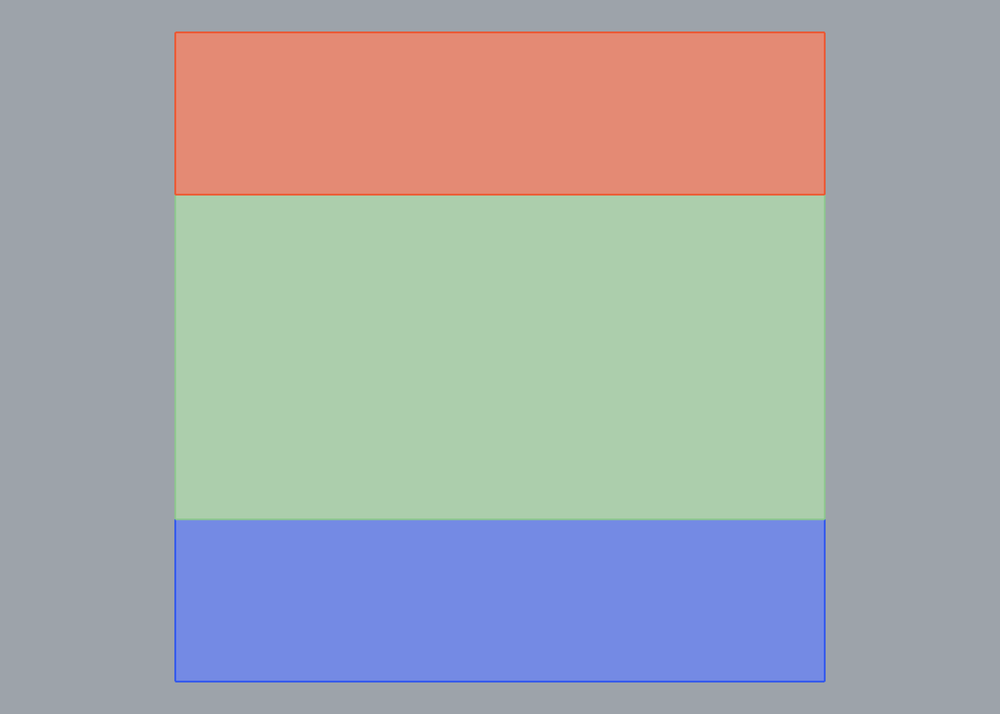

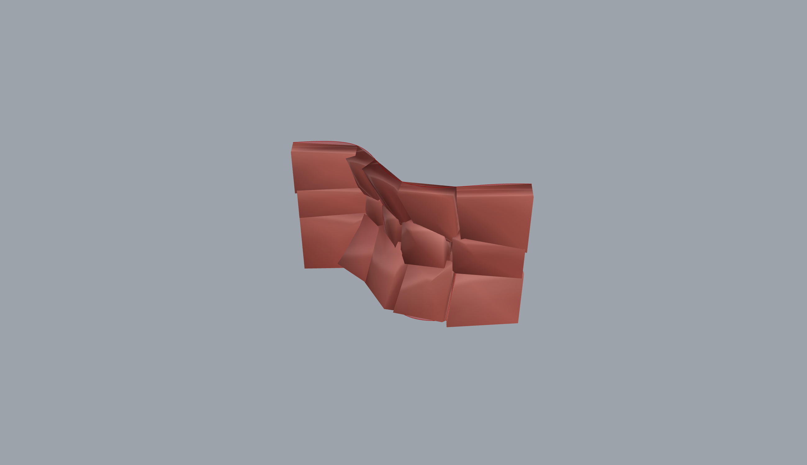

---

## 5.5 The exact-joint assembler

The generator already knows cell adjacency (shared power-diagram edges), so
re-detecting contacts from triangle meshes is wasteful and lossy: a mesh
contact detector splinters 40 stones into ~125 sub-interfaces and ~612 contact
vertices, inflating and ill-conditioning the QP. `PolygonalWallAssembler` emits
one exact planar-quad interface per adjacent stone pair directly from the
shared $(u,v)$ edge (`PolygonalWallAssembler.cs:8-30`):

$$
\text{contact quad} = [\,F_1, F_2, B_2, B_1\,],\qquad F_k = \text{map}(e_k),\quad B_k = F_k + \mathbf{nrm}(e_k)\cdot d .
$$

Because stones are extruded per-vertex along the surface normal, both stones
build their side walls from the same two rails, so the quad is exactly the
shared face on any curvature with zero tolerance dependence. This is the
correct input to the equilibrium builder of 5.1, which is why CRA certifies
generated walls (`Cra_GeneratedWall_Certified`, `Program.cs:335`).

**Originality.** **clean-room (tier B)** geometry: the quad construction is
elementary, and the contribution is the lossless coupling of generator
adjacency to the equilibrium QP rather than any new algorithm.

---

## 5.6 The imposition metric Lambda and Cyclopean carve-back

The assignment layer makes the top-down/bottom-up balance executable. Given a
stone **inventory** (found/scanned stones, the negotiation side) and the
**target cells** of a generated wall (the imposition side), assign stones to
cells minimising the material to carve away, and report the trade as numbers
(`StoneCellAssignment.cs:8-37`):

$$
\lambda_i = \frac{\mathrm{vol}(\text{stone}_i \setminus \text{cell}_i)}{\mathrm{vol}(\text{stone}_i)},\qquad
\Lambda = \frac{\sum_i \lambda_i\,\mathrm{vol}(\text{stone}_i)}{\sum_i \mathrm{vol}(\text{stone}_i)},\qquad
g_i = \frac{\mathrm{vol}(\text{cell}_i \setminus \text{stone}_i)}{\mathrm{vol}(\text{cell}_i)} .
$$

$\Lambda\approx1$ is full imposition (stock cut entirely to cells, sawn ashlar);
$\Lambda\approx0$ is true negotiation (stones used as found). The measured
middle is Clifford and McGee's Cyclopean Cannibalism wall at $\Lambda\approx0.27$
(73% of scanned stock used), the datum the ETH1100 benchmark test reports
against (`StoneCellAssignmentEthBenchmarkTests.cs:14`, `:95`). The reported
result on ETH1100 is $\Lambda=0.194$ (better than the 0.27 datum).

The pipeline is: per-mesh volume/centroid/PCA frame; a cheap volume+extent
prefilter; a voxel symmetric-difference cost over the top-K candidates per cell,
best of the four proper-rotation flips (`:283-335`); a **Hungarian** one-to-one
assignment reused from `Frahan.EdgeMatching.Core` (`:141-145`); and per-pair
$\lambda$/gap at a finer voxel resolution (`:147-171`). The voxel metrics carry
a few-percent discretisation error.

**Cyclopean carve-back.** The exact fabrication step replaces the voxel
estimate (`StoneCarveBack.cs:9-29`). Clifford and McGee's (2018) anti-nesting
places a stone overlapping its cell, then carves back everything outside the
cell, "displacing the concept of waste to the amount of material carved from
each part." Operationally, per placement:

$$
\text{carved} = \text{stone(placed)} \cap \text{cell},\qquad
\lambda_i = 1 - \frac{\mathrm{vol}(\cap)}{\mathrm{vol}(\text{stone})},\qquad
g_i = 1 - \frac{\mathrm{vol}(\cap)}{\mathrm{vol}(\text{cell})} .
$$

Booleans run through `CgalMeshBoolean`: the native CGAL kernel inside Rhino, a
managed BSP fallback headless, both volume-validated in the battery
(`:23-28`).

**Originality.** Lambda is **A-candidate original-research**: the
Lambda/gap formalisation is the contribution (Clifford and McGee measured 0.27
but never formalised it; the assignment itself is published in Bruetting 2019 /
Bukauskas 2019). The carve-back is **facade-over-primitives** over
`CgalMeshBoolean`. The assignment is a **facade** composing the in-repo
Hungarian solver and voxel kernel. Fronted by Stone Cell Match (GUID
`D5F10016-6C2D-4F1B-B3E8-7A95D0C41F62`, `StoneCellMatchComponent.cs:34`).

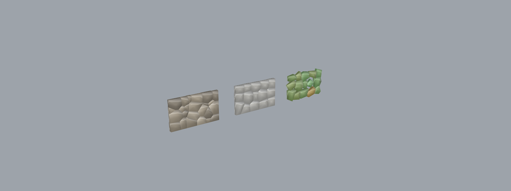

---

## 5.7 Drop-settle for rubble; ashlar and best-fit packers

**Rubble settle.** `RubbleWallSettle` places each found stone upright in a
single-wythe wall: PCA-orient for flat bedding (largest extent to X, mid to Y,
smallest to Z so the broad face beds down), then settle into the dimples of the
course below per $(x,y)$ cell against a running height map, non-penetrating by
construction (`RubbleWallSettle.cs:9-32`). Stability is the Heyman (1966)
limit-state test: the centre of mass projected to the bed must lie inside the
convex hull of the contact footprint with margin
(`RubbleWallSettleComponent.cs:35-36`). It is deterministic (contacts from mesh
vertices, no RNG). **Clean-room (tier B)** from Furrer et al. (2017) and Johns
et al. (2020); GUID `6514A1BB-FE82-4919-9419-141A07D2358A`.


**Ashlar and best-fit.** `AshlarPackComponent` is a 3D running-bond grid
stacking, AABB-first, translation-only, credited to the Gramazio/Kohler/
Eichenhofer NCCR robotic-stone running-bond pipeline
(`AshlarPackComponent.cs:31-32`; GUID `F1A2B3C4-D5E6-4789-9ABC-DEF012345678`).
`BestFitInventoryPacker` scores every remaining slab against each slot on
width/depth/height/aspect fit and picks the best, falling back to first-fit
(`BestFitInventoryPacker.cs:8-32`). **clean-room (tier C)**: the Core class
carries the correct Furrer (2017) / Johns (2020) lineage. *Licensing/citation
flag:* the GH facade `BestFitPackComponent.cs:30` carries an
`[Algorithm("Best-fit rubble inventory placement","Gramazio Kohler Eichenhofer
2017 ...")]` whose attribution to a 2017 NCCR paper is the previously flagged
likely-fabricated citation (E5); the real lineage is Furrer/Johns/`gramaziokohler-ashlar`,
and the attribute should be corrected.


---

## 5.8 Status and what is left

- **CRA convergence at scale.** The ADMM degrades past ~50 interfaces; the
  LS-first certificate mitigates wall-scale checks but per-element verification
  remains the pattern for large mixed assemblies (`AdmmQpSolver.cs:41-50`).
  *High.*
- **CRA is a conservative heuristic.** "Not certified" can be a false negative
  on the nonconvex problem; it is sound only in the certifying direction
  (`CraStabilityChecker.cs:45-49`). *Medium.*
- **Fabricated GH citation (E5).** `BestFitPackComponent.cs:30` attributes a
  2017 NCCR paper that does not match the Core's true Furrer/Johns lineage.
  *Medium.*
- **Stale audit note (E4).** The prior digest claims the RBE component wires the
  sign-buggy `Build`; the current source uses `BuildPhysicsCorrected`
  (`MasonryStabilityRbeComponent.cs:305`). The legacy `Build` survives only for
  sign-pinning unit tests and should be marked obsolete to avoid future
  mis-wiring. *Low.*
- **Prior-art sweeps pending.** The $J$ interlock metric, the Coursing-morph
  continuum, and the Lambda formalisation are marked A-candidate; AGENTS.md
  section 9 forbids asserting "novel" without a completed sweep. *Medium.*
- **Sequencer redundancy.** The 3D Kim sequencer
  (`PolygonalMasonrySequence3DComponent`, GUID
  `C5F18B4D-8A6F-4E72-AC83-1FBD32D8C7B2`) overlaps `BlockBuildOrderer`; a merge
  is a documented candidate. *Low.*
- **Example 02 has no render.** `02_masonry_assembly` ships `.gh` + `.3dm` only;
  no PNG is embeddable for the assembly-sequencing figure. *Low.*

---

### References

- Kao, G.T.-C., Iannuzzo, A., Thomaszewski, B., Coros, S., Van Mele, T., Block, P. (2022). Coupled Rigid-Block Analysis: Stability-Aware Design of Complex Discrete-Element Assemblies. Computer-Aided Design 146:103216. DOI 10.1016/j.cad.2022.103216
- Stellato, B., Banjac, G., Goulart, P., Bemporad, A., Boyd, S. (2020). OSQP: an operator splitting solver for quadratic programs. Mathematical Programming Computation 12:637-672. DOI 10.1007/s12532-020-00179-2
- Heyman, J. (1966). The stone skeleton. International Journal of Solids and Structures 2(2):249-279. DOI 10.1016/0020-7683(66)90018-7
- Kim, S. et al. (2024). Finding the Installation Sequence of Polygonal Masonry through Design and Depth Search of a DAG. ASME IDETC/CIE, paper DETC2024-142563.
- Clifford, B., McGee, W. (2018). Cyclopean Cannibalism: A Method for Recycling Rubble. ACADIA 2017 / 2018 (Disciplines and Disruption).
- Lloyd, S.P. (1982). Least squares quantization in PCM. IEEE Transactions on Information Theory 28(2):129-137. DOI 10.1109/TIT.1982.1056489
- Furrer, F., Wermelinger, M., Yoshida, H., Gramazio, F., Kohler, M., Siegwart, R., Hutter, M. (2017). Autonomous robotic stone stacking with online next best object target pose planning. IEEE ICRA. DOI 10.1109/ICRA.2017.7989273
- Johns, R.L., Wermelinger, M., Mascaro, R., Jud, D., Gramazio, F., Kohler, M., Chli, M., Hutter, M. (2020). Autonomous dry stone. Construction Robotics 4:127-140. DOI 10.1007/s41693-020-00037-6
- Legakis, J., Dorsey, J., Gortler, S. (2001). Feature-based cellular texturing for architectural models. SIGGRAPH 2001:309-316. DOI 10.1145/383259.383293
- Bruetting, J., Desruelle, J., Senatore, G., Fivet, C. (2019). Design of truss structures through reuse. Structures 18:128-137. DOI 10.1016/j.istruc.2018.11.006
- Bukauskas, A. et al. (2019). Inventory-constrained structural design: new objectives and optimization techniques. (reuse-of-irregular-elements lineage cited for the assignment).

---

# 06. Voussoir Geometry & Stereotomy

The Voussoir tab (ribbon `Frahan > Voussoir`, 5 components) is the
repository's top-down stereotomy front end. Stereotomy is the art of cutting
solids, classically stone, so that the cut faces alone hold an arch or a vault
in compression without mortar (Frezier 1737; Monge 1798). The tab makes that
art executable. Two generators turn a designed form into cut-stone cells: Arch
Voussoirs builds a planar arch as radial wedge solids, and Pendentive Vault
Voussoirs builds a sail dome tessellated along the sphere's lines of curvature.
Three downstream components (Voussoir Ingest, Voussoir Stone Matcher, Voussoir
Pack Into Block) then assign and pack those cells against found or quarried
stone. This chapter covers the two generators and their shared cell factory;
the matcher and packer are Hungarian and bin-pack facades documented with the
quarry assignment layer.

The design framing is the load-bearing point. The other design tabs let
material be sovereign (rubble walls, Trencadis mosaics, edge-matched
fragments). The Voussoir generators are the opposite pole: the form is
sovereign, and the system cuts stone to realise it. Both `[DesignApplication]`
attributes tag `DesignFlow.TopDown` explicitly
(`ArchVoussoirsComponent.cs:37`, `PendentiveVaultVoussoirsComponent.cs:35`).

The geometry here is pure trigonometry and curve sampling. Where the
repository turned a classical stereotomic rule into an algorithm, or fixed a
real bug, the derivation is shown, not only the formula. Every originality
claim is anchored to a `file:line`, an `[Algorithm]` attribute, or a measured
example.

---

## 6.1 The stereotomy lineage and the front-end gap

The classical literature gives two laws the generators obey. First, the
**radial bed-joint rule**: in an arch the bed joints (the faces between
neighbouring voussoirs) are normal to the intrados, the inner soffit curve;
for a circular arch they point at the centre of curvature. Each wedge then
turns the thrust aside, stone to stone, so the whole ring stands in pure
compression (Frezier 1737, who coined *stereotomie*; the funicular reading is
Hooke's 1675 inverted-catenary insight, made a limit-state theorem by Heyman
1966). Second, **Monge's lines-of-curvature rule** for vaults: orient the bed
joints along the lines of curvature of the doubly-curved surface; for a sphere
these are the meridians and parallels (Monge 1798). Both laws are recorded in
source as `[Algorithm]` citations on the two components
(`ArchVoussoirsComponent.cs:34-36`,
`PendentiveVaultVoussoirsComponent.cs:32-34`).

The repository already shipped a voussoir *back end*: Voussoir Ingest reads
cells produced by an external Grasshopper plugin (Varela and Sousa's Voussoir,
food4rhino), then Voussoir Stone Matcher and Voussoir Pack Into Block assign
and pack them (`VoussoirRecord.cs:11-21`). What was missing was the
*generation* step. Without it the top-down flow began outside Frahan, in a
third-party tool. The `VoussoirCellFactory` closes that gap: it generates the
cut-stone cells from first principles so the whole top-down chain lives inside
the repository (`VoussoirCellFactory.cs:9-20`):

```text
VoussoirCellFactory.BuildArch / BuildPendentiveVault   (this chapter)
  -> VoussoirAssembly (typed)
    -> Voussoir Stone Matcher (Hungarian) / Rubble Evolved Fit
      -> CGAL trim (digital ravalement)
```

The shared engine is a static class, `VoussoirCellFactory`, with two public
entry points (`BuildArch`, `BuildPendentiveVault`) and one shared solid
builder (`MakeHexahedron`). It depends on RhinoCommon for `Mesh`, `Curve`, and
`Plane`, but needs no Rhino document, so it runs in the headless harness
(`VoussoirCellFactory.cs:39-41`).

---

## 6.2 The arch: radial voussoir cells

`ArchVoussoirsComponent` (GUID
`D5F10012-ED9E-4ED9-A012-ED9EED9E0012`, `:57-58`) generates an arch as `N`
radial wedge solids. The construction has three stages: build the intrados
curve for the chosen profile, station it by equal arc length, then loft a
closed wedge between each pair of stations.

### 6.2.1 Stationing the intrados

The intrados is built in the world XZ plane with the springers on $z = 0$ and
the width running along $Y$. For the count $N$ the curve is divided into $N+1$
equal-arc-length stations, giving $N$ wedges (`VoussoirCellFactory.cs:119-121`):

$$
\{t_0,\dots,t_N\} = \mathrm{DivideByCount}(N,\ \text{include ends}),\qquad
p_k = \mathbf{c}(t_k),\quad k = 0,\dots,N.
$$

Equal arc length, not equal angle, is the right division: it keeps the
intrados face of every voussoir the same physical width even when the profile
is not circular (a catenary or a pointed arch), which is the fabrication
constraint a mason cares about.

### 6.2.2 The outward normal and the radial bed joint

At each station the bed-joint direction is the **outward normal** to the
intrados. The code takes the in-plane tangent $\mathbf{T}(t_k)$, projects it
into the XZ plane, and rotates it ninety degrees in plane
(`VoussoirCellFactory.cs:136-146`):

$$
\mathbf{T} = (T_x, 0, T_z),\qquad
\mathbf{n} = (T_z,\ 0,\ -T_x).
$$

The rotation $(T_x, T_z) \mapsto (T_z, -T_x)$ is the planar perpendicular. Its
sign is then fixed to point away from the arch interior by testing against the
radial vector $\mathbf{r}_k = p_k - \bar{p}$ from the station to the centroid
of the station cloud, flipping $\mathbf{n}$ when $\mathbf{n} \cdot \mathbf{r}_k
< 0$:

$$
\mathbf{n}_k \leftarrow
\begin{cases}
-\mathbf{n} & \text{if } \mathbf{n}\cdot(p_k-\bar{p}) < 0,\\
\ \ \mathbf{n} & \text{otherwise.}
\end{cases}
$$

**Why this is exactly the radial rule for a circular arch.** For a circle of
centre $O$ the tangent at any point is perpendicular to the radius $O p_k$, so
the in-plane perpendicular of the tangent is collinear with that radius.
Rotating the tangent ninety degrees therefore yields the radial direction, and
the centroid sign-fix orients it outward, away from $O$. The bed joint built on
$\mathbf{n}_k$ is then normal to the intrados and points at the centre of
curvature, which is Frezier's rule verbatim. For a non-circular profile
(catenary, pointed) the centre of curvature varies along the curve, and
$\mathbf{n}_k$ is the local intrados normal, the correct generalisation: the
bed joint stays perpendicular to the soffit at the joint, which is what keeps
the contact face square to the local thrust.

### 6.2.3 The wedge solid

Each voussoir spans stations $i$ and $i+1$. Its four in-plane corners are the
two intrados points and the two extrados points; the extrados is the intrados
offset outward by the ring thickness $t$ along the per-station normal
(`VoussoirCellFactory.cs:152-174`):

$$
\text{in}_A = p_i,\quad \text{in}_B = p_{i+1},\qquad
\text{ex}_A = p_i + t\,\mathbf{n}_i,\quad \text{ex}_B = p_{i+1} + t\,\mathbf{n}_{i+1}.
$$

Because the extrados rides on the **same** outward normals, a circular arch
gives an exactly concentric extrados: each extrados point sits at radius
$R + t$ on the same ray as its intrados point. The in-plane quad is then swept
the half-width $\tfrac{w}{2}$ each way along $Y$ to give the front and back
rings, and `MakeHexahedron` welds them into a closed eight-vertex solid. The
lower bed-joint plane is emitted with origin at the mid-thickness of the lower
face and axes $(\mathbf{n}_i,\ \mathbf{Y})$, so its own normal is the
tangential thrust direction (`:179-182`).

The result is faceted: straight chords between arc-length stations. The
component tolerance note states this plainly and gives the remedy, raise the
count (`ArchVoussoirsComponent.cs:41`). The error is the chord sagitta of the
intrados arc, which falls as $O(1/N^2)$; the circular extrados, by the
concentric construction above, carries the same relative facet error as the
intrados, not a worse one.

### 6.2.4 The keystone

The keystone is the voussoir nearest the apex. The factory finds it by a
combined height-and-symmetry score: among cells with positive $z$, minimise
$|x_c| + |z_{\text{apex}} - z_c|$ over the centroid $(x_c, z_c)$, so the winner
is the highest cell closest to the plane of symmetry $x = 0$
(`NearestToApex`, `:526-538`). Its `JointClass` is then set to `"key"`
(`:189-193`), and the springer course (the lowest 5% height band) is tagged
`"ground"` as the install-DAG anchors (`:509-515`).

### 6.2.5 Four profiles, one path

The profile families are Semicircular, Segmental, Pointed (equilateral
two-centred Gothic), and Catenary (`ArchProfile`, `:45-55`). The
wiki note that "catenary and pointed are a drop-in change of the intrados
curve" is made concrete: each profile builds only its intrados `Curve`, and
the single shared path of 6.2.1 to 6.2.3 stations and lofts it
(`BuildIntrados`, `:315-336`).

- **Semicircular and Segmental** are circular arcs. The centre is placed at
  $z_c = -R\cos(\tfrac{a}{2})$ so the springers land on $z = 0$ for the
  included angle $a$, and the arc passes through left springer, apex, right
  springer (`BuildArcIntrados`, `:338-352`). The span is
  $S = 2R\sin(\tfrac{a}{2})$.
- **Pointed** is the equilateral two-centred arch: span $S = R$, each half an
  arc of radius $S$ swung from the opposite springer, apex at
  $h = \tfrac{\sqrt 3}{2}S$ (`BuildPointedIntrados`, `:354-382`). The two arcs
  are appended into one `PolyCurve`.
- **Catenary** is the inverted hanging chain, the funicular line of a
  pure arch (Hooke 1675; Heyman 1966). A chain of parameter $a$ hangs as
  $y = a\cosh(x/a)$ with sag $a\cosh(\tfrac{S}{2a}) - a$ over the span $[-S/2,
  S/2]$. Given a target rise $H$ the factory solves for $a$ such that the sag
  equals $H$, then inverts the curve so the sag becomes the rise
  (`BuildCatenaryIntrados`, `:390-410`).

**Original derivation: the catenary parameter solve.** The shape parameter
$a$ has no closed form for a prescribed span $S$ and rise $H$; it is the root
of

$$
f(a) = a\cosh\!\Big(\frac{S}{2a}\Big) - a - H = 0.
$$

$f$ is monotone decreasing in $a$ from $+\infty$ (as $a \to 0^{+}$ the chain
sags arbitrarily deep) toward $-H$ (as $a \to \infty$ the chain straightens
and the sag vanishes), so it crosses zero exactly once and bisection is
guaranteed to converge. The factory brackets the root on $[10^{-4}S,\ 10^{4}S]$
and bisects to a residual of $10^{-9}$ or interval collapse, capped at 200
iterations (`SolveCatenaryA`, `:412-432`). The inverted profile is then sampled
($z = H - (a\cosh(x/a) - a)$, floored at zero) and fitted with a cubic
interpolating curve. Building the *true* funicular intrados is what makes the
catenary arch a structural object, not a decorative pointed shape: the bed
joints normal to it are normal to the thrust line, so the ring is in pure
axial compression by construction (the safe theorem, Heyman 1966).

> **Originality.** Arch Voussoirs is **clean-room** stereotomy. The radial
> bed-joint construction is built from the published rule, cited in source by
> two `[Algorithm]` attributes: the Frahan-original cell construction (intrados
> curve to arc-length stations to eight-vertex wedge solids with radial bed
> joints, `ArchVoussoirsComponent.cs:31-33`), and the geometric law it obeys
> credited to Frezier (1737) and Monge (1798)
> (`:34-36`). No external stereotomy source sits in the tree; the upstream
> Voussoir plugin (Varela and Sousa) is a cited *precedent* in the
> `[DesignApplication]` attribute (`:40`), not a dependency, and its cells are
> consumed only through the separate Voussoir Ingest path. The catenary
> parameter solve and the concentric-extrados construction are the small
> clean-room deltas over a naive radial sweep.

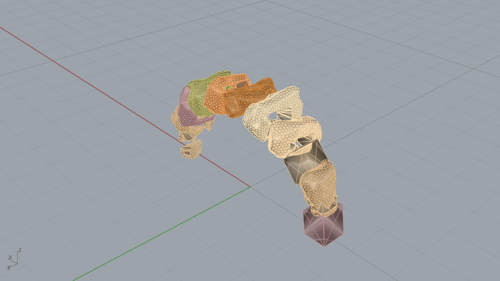

---

## 6.3 The pendentive vault: lines-of-curvature cells

`PendentiveVaultVoussoirsComponent` (GUID
`D5F10013-ED9E-4ED9-A013-ED9EED9E0013`,
`PendentiveVaultVoussoirsComponent.cs:55-56`) is the doubly-curved
counterpart. A pendentive (sail) dome is a single spherical surface springing
from the four corners of a square plan up to the apex. The factory tessellates
it on a $U \times V$ grid into wedge cells whose bed joints follow the sphere's
lines of curvature, then extrudes each cell radially by the shell thickness
(`BuildPendentiveVault`, `:216-304`).

### 6.3.1 Lifting the square grid onto the sphere

The square plan of half-width $h$ is gridded uniformly in $(x, y)$, and each
node is lifted onto the sphere of radius $R$ centred at the origin
(`:244-256`):

$$
x_i = -h + \frac{2h\,i}{U},\quad
y_j = -h + \frac{2h\,j}{V},\qquad
z_{ij} = \sqrt{R^2 - x_i^2 - y_j^2}.
$$

**The corner-on-sphere constraint.** The plan corners $(\pm h, \pm h)$ must lie
on the sphere, which requires $z$ real at the corner:

$$
R^2 - h^2 - h^2 \ge 0 \;\;\Longleftrightarrow\;\; 2h^2 < R^2.
$$

The factory enforces $2h^2 < R^2$ as a hard precondition and throws a
descriptive error otherwise (`:230-234`); the component repeats the same guard
before calling Core and surfaces it as a canvas error
(`PendentiveVaultVoussoirsComponent.cs:130-136`). The springing height (the $z$
of the four corners) is $z_{\text{corner}} = \sqrt{R^2 - 2h^2}$, and an
optional drop-to-ground shift translates the whole vault so the springers rest
on $z = 0$ (`:236-238`).

### 6.3.2 The radial frustum cell

Each grid cell is the patch between four lifted intrados points
$(c_{00}, c_{10}, c_{11}, c_{01})$ and their **radial** projections to the
outer sphere of radius $R + t$. The extrados corner of an intrados point $p$ is
the scaling of $p$ about the sphere centre by the radius ratio
(`Radial`, `:308-313`; cell `:269-277`):

$$
\rho = \frac{R + t}{R},\qquad
p_{\text{ex}} = O_{\text{sph}} + \rho\,(p - O_{\text{sph}}).
$$

Because both faces are radial scalings about the same centre, the side walls of
the cell run along sphere radii, which are the surface normals. The bed joint
between two neighbouring cells therefore sits in a plane containing the sphere
radius, exactly Monge's lines-of-curvature rule for a sphere: the cell edges
run along meridians and parallels, and the joints are radial. The bed plane is
emitted with origin at the intrados patch centre and normal along the outward
radial $\widehat{(\text{mid} - O_{\text{sph}})}$ (`:280-289`). The vault has no
single keystone, so `KeystoneIndex` is left at $-1$ (`:294`).

> **Originality.** Pendentive Vault Voussoirs is **clean-room**. The
> sphere-over-square construction and the radial-frustum cell are built from
> the lines-of-curvature rule, cited in source by the Frahan-original cell
> `[Algorithm]` (square grid lifted by $z = \sqrt{R^2 - x^2 - y^2}$ then
> radially extruded, `PendentiveVaultVoussoirsComponent.cs:29-31`) and the
> Monge tessellation law it obeys (`:32-34`). The cited design precedents are
> Rippmann and Block (2011) Digital Stereotomy and the Block Research Group
> RhinoVAULT pipeline (`:38`); these are named precedents in the
> `[DesignApplication]` attribute, not in-tree dependencies. The sphere is the
> closed-form special case; a general form-found funicular shell would arrive
> through the compas-RV reference pipeline noted in 6.5.

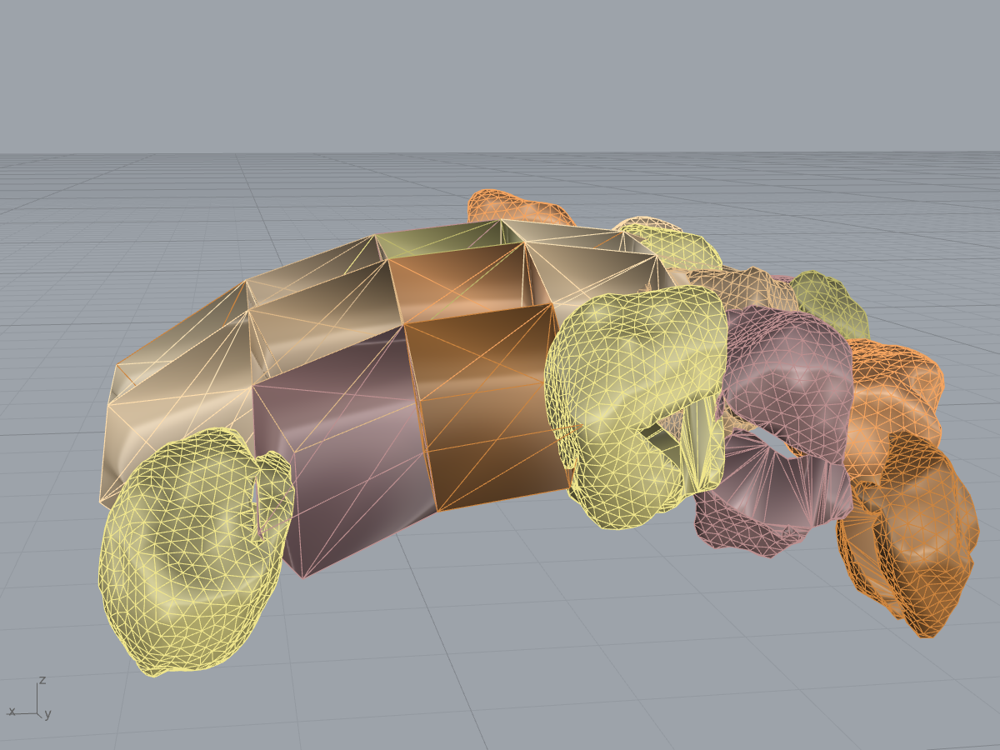

---

## 6.4 The inward-orientation fix (original derivation)

Both generators feed their cells into a CGAL Boolean trim downstream (the
digital ravalement of examples 21 and 22, section 6.5). A mesh-mesh Boolean is
sensitive to face orientation: the kernel reads a closed mesh's *inside* from
its face winding. If a cell's faces wind inward, the kernel reads the solid as
"all of space except the cell", and the intersection of a stone with that
inverted cell returns the stone minus the cell rather than the carved
voussoir. The failure is silent: the trim returns a closed mesh, just the
wrong one.

The fix lives in the shared solid builder. After `MakeHexahedron` welds the two
rings, unifies the winding, and rebuilds normals, it tests the **signed
volume** of the mesh and flips every face if the volume is negative
(`MakeHexahedron`, `:452-464`):

$$
V_{\text{signed}}(M) < 0 \;\Longrightarrow\; M \leftarrow \mathrm{Flip}(M).
$$

**Why signed volume is the correct orientation test.** For a closed
triangulated mesh the signed volume is the sum over faces of the signed
tetrahedron each face spans with the origin,

$$
V_{\text{signed}}(M) = \frac{1}{6}\sum_{f=(a,b,c)} \big(a \times b\big)\cdot c,
$$

and its sign is determined entirely by the global face winding: outward-wound
faces give $V_{\text{signed}} > 0$, inward-wound give $V_{\text{signed}} < 0$.
The magnitude is the true enclosed volume regardless of sign. So the single
test $V_{\text{signed}} < 0$ detects an inverted solid exactly, and one global
flip corrects it. This is necessary because `Mesh.UnifyNormals` only makes the
winding *consistent* across faces, not necessarily *outward*: a fully
consistent mesh can still be uniformly inside-out, which is the case the flip
catches (`:456-461`). The factory then stores the absolute mesh volume on each
record (`VoussoirRecord.cs:37-39`; `Math.Abs(cell.Volume())` at
`VoussoirCellFactory.cs:476`), so the volume metric is sign-independent and a
flipped or unflipped cell reports the same number.

This bug and fix were a live-validated correctness gate. The memory note for
the voussoir generators records that the inward-orientation bug "silently broke
CGAL booleans" and that the flip-if-signed-volume-under-zero guard is what made
examples 21 and 22 regenerate from raw rubble with no raw boulders surviving
the trim. The closedness of every emitted cell is checked (`Mesh.IsClosed`) and
surfaced as a component warning if any cell is open
(`ArchVoussoirsComponent.cs:163-165`,
`PendentiveVaultVoussoirsComponent.cs:150-152`).

> **Originality.** The orientation fix is a **clean-room** correctness guard on
> the shared `MakeHexahedron` builder (`VoussoirCellFactory.cs:452-464`). It is
> elementary geometry (signed volume sign as an orientation oracle), and its
> contribution is robustness: it is the precondition that makes the downstream
> CGAL trim of section 6.5 return the carved voussoir rather than its
> complement. The downstream trim itself runs through the in-repo
> `CgalMeshBoolean` primitive (the GPL CGAL kernel in Rhino, a managed BSP
> fallback headless), which is **facade-over-primitives** and out of scope for
> this tab; this chapter owns only the generator that produces a correctly
> oriented input to it.

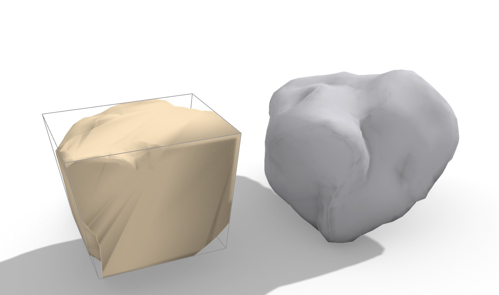

---

## 6.5 The top-down flow end to end: examples 21 and 22

The two generators are the entry point of a top-down stereotomy chain that
ends in carved stone. Examples 21 (arch) and 22 (pendentive vault) run it
whole, with a measured coverage metric.

The flow is the classical *ravalement* method made digital: cut a voussoir
oversize, mount it, trim the excess to the final surface (Frezier; the method
is recorded in the example READMEs). Operationally: the generator emits the
target cell, a volume-feasible ETH1100 rubble stone is matched and posed to
envelop it (the evolved matcher adds rotation seeds and an SE(3) containment
search over the cell's real vertices), and `CgalMeshBoolean.Intersection`
trims the stone to the cell. A validity guard keeps only closed trims within
the cell volume, else falls back to the clean cut cell, never the raw boulder.
Stability in stereotomy comes from the carved geometry, not mortar, so the cut
faces are what matter.

The measured results (regenerated 2026-06-07, `21_arch_metrics.json`,
`22_vault_metrics.json`):

| Example | Form | Cells | Source | Real rubble trims | Coverage |
|---|---|---|---|---|---|
| 21 | Semicircular arch, $R = 2.0$ m, ring $0.55$ m, span $4.0$ m | 11 | Arch Voussoirs (D5F10012) | **11 / 11**, 0 clean fallback | **94.9%** |
| 22 | Pendentive dome, $R = 2.5$ m, $2h = 3.2$ m, $t = 0.4$ m | 36 | Pendentive Vault Voussoirs (D5F10013) | **36 / 36**, 0 clean fallback | **98.3%** |

Coverage is recovered carved volume over the target ring or shell volume:
$2.2079 / 2.3266\ \text{m}^3 = 94.9\%$ for the arch (per-cell 0.85 to 0.99),
$5.5996 / 5.6941\ \text{m}^3 = 98.3\%$ for the vault. Both runs are visually
validated in Rhino (criterion c) with one coloured mesh per voussoir. The
reported bug the regeneration fixed is exactly the orientation-and-fallback
issue of section 6.4: the earlier version kept a raw un-trimmed boulder on a
failed trim, so oversized stones overshot the ring; no raw boulders remain in
either example.

For a general form-found doubly-curved vault (not the closed-form sphere), the
documented reference pipeline is compas-RV (Block Research Group RhinoVAULT in
COMPAS): pattern to form-and-force diagrams to a compression-only funicular
shell, tessellated into voussoir courses with bed joints along the lines of
curvature, then the same match-and-trim. Equilibrium of the assembled ring or
shell is then checked by Frahan Masonry Stability (RBE and CRA, chapter 5),
closing the top-down stereotomy loop onto the contact-equilibrium chapter.

---

## 6.6 Status and what is left

- **Funicular form-finding is external.** The arch supports a true catenary
  intrados, but the pendentive generator is the closed-form *sphere* only. A
  general form-found shell must arrive through the compas-RV reference pipeline
  named in 6.5; there is no in-repo form-finder. The funicular `ThrustCurve`
  field on `VoussoirAssembly` is defined but not populated by either generator
  (`VoussoirAssembly.cs:23-27`). Severity: medium (scope boundary, documented).
- **Faceted cells by construction.** Both generators emit straight-chord
  facets; curvature accuracy is bought only by raising the count or the grid,
  and the tolerance note states this (`ArchVoussoirsComponent.cs:41`,
  `PendentiveVaultVoussoirsComponent.cs:39`). The intrados facet error falls as
  $O(1/N^2)$, but a true NURBS-faced voussoir would need a different cell
  builder. Severity: low (stated, count-controllable).
- **No equilibrium check inside the tab.** The generators produce geometry and
  a typed assembly with ground anchors and `LoadAxis` per cell, but do not run
  a stability verdict; that requires wiring the assembly into the Masonry
  Stability components (chapter 5). The `[DesignApplication]` precedent names
  the link, but the canvas does not enforce it. Severity: low (cross-tab by
  design).
- **Adjacency graph not auto-built by the factory.** `FinalizeResult` leaves
  `AdjacencyPairs` empty (`VoussoirCellFactory.cs:520`); the install-DAG
  adjacency is detected downstream in Voussoir Ingest by shared-face area
  (`VoussoirAssembly.cs:29-33`). A generator that already knows its
  station-to-station and grid neighbour topology could emit the adjacency
  losslessly, as the polygonal-wall assembler does for masonry (chapter 5.5).
  Severity: low (refactor opportunity).
- **Citation hygiene.** The example READMEs cite Sakarovitch (stereotomy
  history) and Galletti (2020, mortarless stability) and Hooke (1675), which
  are not yet keyed in `99_references.md`; the in-source `[Algorithm]`
  citations (Frezier 1737, Monge 1798, Rippmann-Block 2011) are present and
  keyed. Add the missing keys before external review per `AGENTS.md` §9.
  Severity: low (provenance, not copyleft).

---

## References (this chapter)

- Frezier, A.-F. (1737-1739). *La theorie et la pratique de la coupe des
  pierres et des bois* (the stereotomy treatise that coined *stereotomie*; the
  radial bed-joint rule). [R148]
- Monge, G. (1798). *Geometrie descriptive*. Baudouin, Paris (lines of
  curvature for vault tessellation). [R149]
- Hooke, R. (1675). *A description of helioscopes* (the inverted-catenary
  anagram: the funicular line of a pure arch). Cited in source for the catenary
  profile; not yet keyed in `99_references.md`.
- Heyman, J. (1966). The stone skeleton (limit-state / safe theorem of masonry;
  thrust line within the section). *International Journal of Solids and
  Structures* 2(2):249-279. DOI 10.1016/0020-7683(66)90018-7. [R57]
- Rippmann, M., Block, P. (2011). Digital stereotomy: voussoir geometry for
  freeform masonry-like vaults informed by structural and fabrication
  constraints. *Proceedings of IABSE-IASS 2011*, London. [R64]
- Varela, P.A.A., Sousa, J.P. Voussoir: stereotomy plug-in for Grasshopper.
  FAUP Porto Digital Fabrication Laboratory.
  https://www.food4rhino.com/en/app/voussoir (cited precedent for the
  voussoir-ingest back end; not a dependency of the generators). [R132]
- Block Research Group. RhinoVAULT / compas-RV funicular form-finding (the
  reference pipeline for general form-found shells). [R64, R65]

---

# 07. Surface Packing & Conformal Unwrapping

This chapter covers the **Surface Packing** ribbon tab: the pipeline that takes a
curved 3D stone surface, flattens it to a planar chart, packs parts into that flat
chart, and lifts the packed parts back onto the curved surface. It is the
freeform-cladding spine of the toolkit: a Trencadis mosaic, a tile field, or any
2D part set can be draped onto a sculpted face so the pieces follow the surface and
butt edge to edge in 3D.

The subsystem is deliberately split across a process boundary. The hard
mathematics, conformal planar parameterization, is done by an external solver,
Boundary First Flattening (Sawhney and Crane 2017), shipped as a single static
executable. Everything Frahan owns sits **around** that solver: a seam-correct flat
mesh build, a global chart-scale recovery, an edge-stretch distortion metric, and a
barycentric inverse map that pulls packed UV curves back to 3D. The 2D packing
itself was recently re-pointed from the legacy V506 nester onto the deterministic
hole-aware engine (`ContactNfpHoleNester`), so the surface components inherit
0-overlap-by-construction layouts and a live async canvas.

The Core lives at `src/Frahan.StonePack.Core/SurfacePacking` (Rhino-free where it
can be: the inverse map and the chart record still use `Rhino.Geometry`). The
Grasshopper front end lives at `src/Frahan.StonePack.GH/SurfacePacking`.

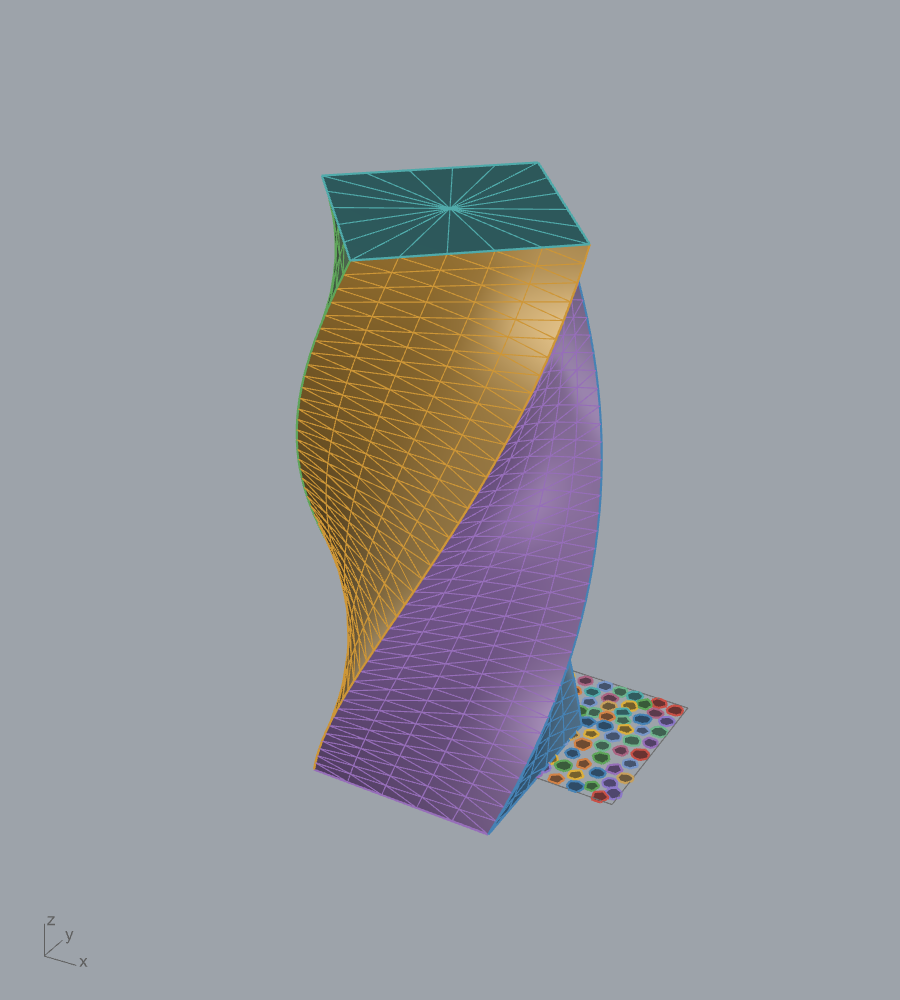

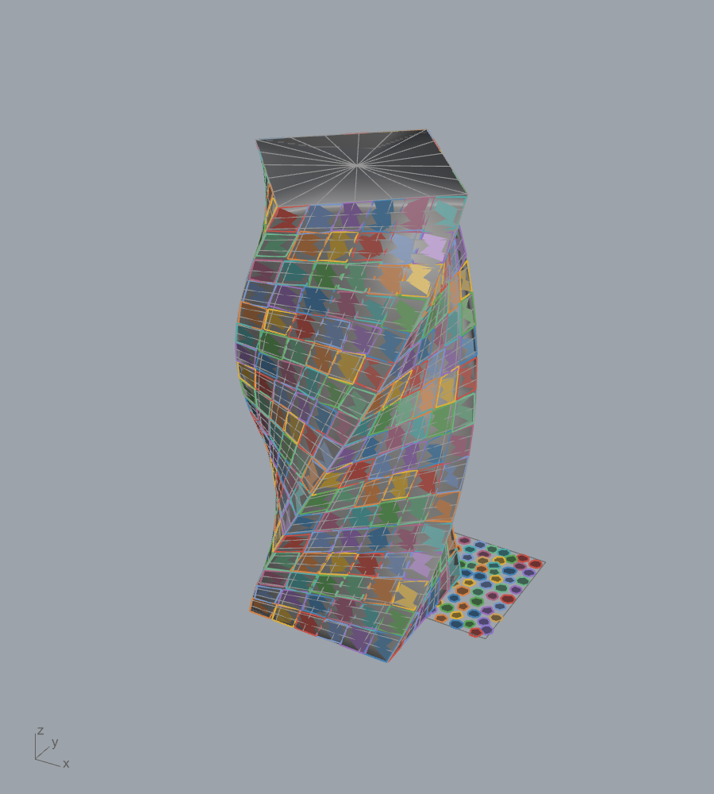

*Example 13: a twisted monument (130 deg over its height) is split by CGAL dihedral
segmentation into 6 regions, then a 176-shard Trencadis mosaic is mapped onto the
curved surface through the BFF chart and the barycentric inverse map.*

---

## 7.1 The pipeline at a glance

The forward chart is built by `SurfaceChartComponent.ComputeChart`
(`SurfaceChartComponent.cs:217`). The ten steps are:

1. Clean and triangulate the input mesh (`MeshCleanup`).
2. Write an OBJ, splitting quads into two triangles (`MeshObjIO`).
3. Run the external BFF binary (`BffCommandLineRunner`).
4. Parse the output OBJ into a per-(face, corner) UV table (`FaceCornerUvTable`).
5. Build an **unwelded** flat mesh: three fresh vertices per triangle so UV seams
   are never bridged.
6. Recover a single global scale (`ChartScaleComputer`).
7. Scale the flat mesh to real units.
8. Compute the edge-stretch distortion report (`ChartDistortionAnalyzer`).
9. (Downstream) pack parts into the flat chart with `ContactNfpHoleNester`.
10. (Downstream) inverse-map packed 2D curves to 3D by barycentric blend
    (`BarycentricMapper2DTo3D`).

The load-bearing invariant across the whole pipeline is that **face `i` in the flat
mesh corresponds exactly to face `i` in the 3D surface mesh**. Every chart-scale,
distortion, and inverse-map computation relies on this index alignment. The
`FrahanSurfaceChart` record (`FrahanSurfaceChart.cs:12`) carries the immutable
result: the original 3D mesh, the scaled flat mesh, the scalar chart scale, the
flat outer boundary polyline, and the distortion report.

---

## 7.2 Conformal flattening (BFF, external)

### 7.2.1 The mathematics BFF solves

Boundary First Flattening (Sawhney and Crane 2017) computes a discrete conformal
map from a triangle mesh with disk topology to the plane. A conformal map preserves
angles, so a flattening is conformal when its differential is, locally, a rotation
composed with a single positive scaling. Equivalently the map distorts lengths by a
scalar **conformal factor** $e^{u}$ that varies over the surface but applies
isotropically at each point:

$$
\lVert d\Phi(X) \rVert \;=\; e^{u}\,\lVert X \rVert \quad\text{for every tangent vector } X .
$$

The factor $u$ is governed by the Yamabe equation, which relates the change in
Gaussian curvature to the Laplacian of $u$:

$$
\Delta u \;=\; K - e^{2u}\,\tilde{K},
$$

where $K$ is the original Gaussian curvature and $\tilde{K}$ the target. For a flat
chart $\tilde{K}=0$ in the interior, so the interior curvature must be absorbed and
all the cone defect pushed to the boundary or to a small set of cone singularities.
The Sawhney-Crane contribution is to pose this as a **boundary** problem: prescribe
either the boundary scale factor $u|_{\partial M}$ or the geodesic curvature
$\tilde{k}|_{\partial M}$, then recover the other via a Dirichlet-to-Neumann map
built from a Cherrier-type linear system, and finally integrate the curve and
extend it to the interior with two harmonic conjugate functions. The dense work is
a sparse Cholesky factorization (SuiteSparse) of the cotangent-Laplace operator;
the boundary solve is cheap once that factorization exists.

The chapter does not reimplement these equations. The BFF kernel is not in this
repository. Frahan calls it as a process: `bff-command-line.exe "<in.obj>"
"<out.obj>" [--nCones=K] [--normalizeUVs]` (`BffCommandLineRunner.BuildArgs`,
`BffCommandLineRunner.cs:101`). The cone count $K$ exposes the cone-singularity
extension, and `--normalizeUVs` rescales the output UVs to a unit box, which is why
Frahan must then recover the real-world scale itself (Section 7.3).

### 7.2.2 Static single-exe build

The shipped artifact is a **static** `bff-command-line.exe`: 17 third-party DLLs
folded into one 38 MB executable with only `KERNEL32` and `msvcrt` imports
(`install/tools/BFF-BUILD-STATIC.md`). The build links SuiteSparse (CHOLMOD, UMFPACK,
AMD/COLAMD), OpenBLAS with its bundled static LAPACK, and GFortran statically with a
single `g++` invocation under MSYS2 mingw64, skipping the GUI app and the
non-essential submodules. The `-Wl,--start-group ... --end-group` link group
resolves the circular SuiteSparse-to-BLAS static references. The build recipe
records that the output UV is byte-identical to the upstream dynamic build, which is
the parity check that lets the static exe be treated as the same tool. This swap was
made because the multi-DLL deploy was breaking; the commit is
`d1b5c5b` ("static single-exe BFF — 17 DLLs -> 1 self-contained exe").

### 7.2.3 Async wrapper and pipe-deadlock handling

`BffCommandLineRunner.RunAsync` (`BffCommandLineRunner.cs:32`) runs the process with
stdout and stderr consumed asynchronously on separate handlers, which is the correct
way to avoid the classic pipe deadlock where a child fills its OS pipe buffer while
the parent blocks on `WaitForExit`. A `CancellationTokenSource` enforces the timeout
and kills the process on overrun. The component (`SurfaceChartComponent`) is a
`GH_TaskCapableComponent`: the whole solve runs on a pool thread so the BFF process
launch never blocks the Grasshopper UI thread.

**Originality.** The BFF flattening kernel is third-party. The component that wraps
it is a **wrapper-of-native** with a small **clean-room** orchestration shell around
it.

- Evidence (kernel): `[Algorithm("BFF boundary-first flattening", "Sawhney and
  Crane 2017, ACM TOG 36(4):109", Doi="10.1145/3072959.3056432", Note="External BFF
  command-line exe; Frahan wraps the binary")]` at `SurfaceChartComponent.cs:43`.
- Evidence (process boundary): `BffCommandLineRunner.RunAsync` shells out only;
  `wiki/research/slm_cards/bff-surface-flatten.md` states "the conformal flattening
  math (Sawhney-Crane 2017) lives entirely inside an external binary."
- Licence note: BFF ships under its upstream MIT-style licence; SuiteSparse,
  OpenBLAS, and GFortran notices are owed in the dist `NOTICE` (see the build recipe).

---

## 7.3 Chart-scale recovery (Frahan, clean-room)

BFF run with `--normalizeUVs` returns UVs in a unit box. To turn the chart into a
fabrication template, the flat mesh must be rescaled to real-world surface
distances. `ChartScaleComputer.ComputeGlobalScale` (`ChartScaleComputer.cs:14`)
recovers a **single isotropic scalar** as the ratio of total 3D edge length to
total flat edge length, summed over all triangular faces. For the triangle set $F$,
with surface-triangle vertices $s^i_A, s^i_B, s^i_C$ and flat-triangle vertices
$f^i_A, f^i_B, f^i_C$:

$$
s \;=\;
\frac{\displaystyle\sum_{i \in F}\big(\lVert s^i_A - s^i_B\rVert + \lVert s^i_B - s^i_C\rVert + \lVert s^i_C - s^i_A\rVert\big)}
{\displaystyle\sum_{i \in F}\big(\lVert f^i_A - f^i_B\rVert + \lVert f^i_B - f^i_C\rVert + \lVert f^i_C - f^i_A\rVert\big)} .
$$

The denominator is guarded against degeneracy: if $\sum f\text{-edges} < 10^{-12}$ or
no valid triangle was found, the method returns $s = 1$ with a warning
(`ChartScaleComputer.cs:52`). The scale is then applied to the flat mesh by a
uniform `Transform.Scale` (`SurfaceChartComponent.cs:285`), so `FrahanSurfaceChart.FlatMesh`
is stored **post-scale** in real units. Downstream packing consumes it directly with
no further scaling.

**Derivation and its limitation.** Why a length ratio rather than an area ratio? On
a conformal map the local length scale is $e^{u}$ and the local area scale is
$e^{2u}$. Taking the ratio of total perimeters rather than total areas keeps the
recovered $s$ a length scale, so it composes directly with edge-length distortion in
Section 7.4. But $u$ is **not** constant over a curved surface (that is the whole
point of a conformal map: it trades angle preservation for spatially varying area
scale). A single global $s$ is therefore the perimeter-weighted average of $e^{u}$
over the chart, and it mis-sizes parts wherever the local conformal factor departs
from that average. This is the central accuracy compromise of the subsystem and is
documented as an evolution target (per-face or per-cone-patch scale) in the SLM
card.

**Originality.** `ChartScaleComputer` is **clean-room** Frahan math: a global
scale recovery derived from the conformal-factor structure, with no upstream code.

- Evidence: `[Algorithm("Conformal chart-scale recovery", "Frahan-original
  barycentric UV-to-real-world scaling")]` at `SurfaceChartComponent.cs:44`; full
  derivation in `wiki/research/slm_cards/bff-surface-flatten.md`.
- Tier: B (faithful, derivable; the single-global-scale approximation is the
  known limitation, not a novelty claim).

---

## 7.4 Edge-stretch distortion metric (Frahan, clean-room)

A fabrication template is only trustworthy if its distortion is bounded.
`ChartDistortionAnalyzer.Analyze` (`ChartDistortionAnalyzer.cs:27`) measures
**edge-scale** distortion (not area) because cut-path accuracy depends on length,
not on enclosed area. The flat vertices are first scaled by $s$, then for each
triangle edge $e$ joining endpoints $p, q$ the stretch ratio is:

$$
\sigma_e \;=\; \frac{\lVert s_p - s_q \rVert_{\text{3D}}}{\,s \,\lVert f_p - f_q \rVert_{\text{2D}}\,},
\qquad
\sigma_{\max} = \max_e \sigma_e,
\qquad
\sigma_{\min} = \min_e \sigma_e .
$$

Edges with either endpoint distance below $10^{-8}$ are skipped
(`ChartDistortionAnalyzer.cs:96`). The report warns when
$\sigma_{\max} > 1.15$ (high stretch, increase clearance) or
$\sigma_{\min} < 0.85$ (high compression, parts under-scaled after mapping); the
thresholds are constants at `ChartDistortionAnalyzer.cs:24`.

For a perfectly conformal BFF map $\sigma_e \to e^{u}/s$ varies smoothly with the
local conformal factor, which is exactly why $\sigma_{\max}$ and $\sigma_{\min}$
bracket the spread of $e^{u}$ around the global average $s$. The metric therefore
serves two roles: it is the fabrication-trust gauge, and it is the diagnostic that a
single global scale is or is not adequate for a given chart.

A complementary symmetrized **flatness** classifier lives in `ChartFlatnessReport`:
given a per-face area ratio $r_i$ it forms

$$
\rho_i = \max\!\Big(r_i, \tfrac{1}{r_i}\Big), \qquad \text{flag if } \rho_i > \tau,
$$

with $r_i \le 0 \Rightarrow \rho_i = \infty$ (`ChartFlatnessReport.cs:93`). This is
a pure-managed area-distortion symmetrization with no Rhino dependency.

**A known blind spot.** Because $\sigma_e$ uses scalar lengths, it cannot see a
**foldover**: a flat triangle whose orientation BFF flipped still passes the
edge-stretch test (lengths ignore sign). Detecting foldovers needs a signed-area
sign test per flat triangle, which is logged as an evolution item (flag M3).

**Originality.** `ChartDistortionAnalyzer` and `ChartFlatnessReport` are
**clean-room** Frahan metrics derived from the conformal-factor structure.

- Evidence: derivation at `wiki/research/slm_cards/bff-surface-flatten.md`
  (sections "Edge-stretch distortion" and "Flatness classifier"); no upstream
  code, both are pure managed.
- Tier: B.

---

## 7.5 Seam-correct flat mesh (Frahan, clean-room)

A conformal chart of a non-trivial surface needs **seam cuts** to open the surface
into a disk. Across a seam, one shared 3D vertex maps to two **different** UV
positions. A naive welded mesh would average those, bridging the seam and corrupting
the chart. `FaceCornerUvTable` (`FaceCornerUvTable.cs:37`) solves this by keying UVs
on `(faceIndex, cornerIndex)` rather than on vertex index, so each face corner
carries its own UV. `ToFlatUnweldedMesh` (`FaceCornerUvTable.cs:56`) then emits
three fresh vertices per triangle:

- For triangle $i$ it reads the three corner UVs $(u_A, v_A), (u_B, v_B), (u_C, v_C)$.
- It adds three new flat vertices at those UV positions in the $Z=0$ plane.
- It adds one face on the new vertices, preserving face index $i$.
- A missing UV throws `InvalidOperationException` rather than defaulting to $(0,0)$,
  so a parse bug surfaces immediately instead of silently corrupting one corner.

The output is intentionally **non-manifold** (three vertices per triangle), which is
correct for seam handling but means boundary extraction must use naked-edge tracing.
`FrahanSurfaceChart.ExtractOuterBoundary` (`FrahanSurfaceChart.cs:58`) calls
`GetNakedEdges` and takes the **longest** loop as the outer boundary; the shorter
loops are sheet holes. The custom `FaceCornerKey.GetHashCode` uses
`(FaceIndex * 397) ^ CornerIndex` to avoid boxing on net48, consistent with the
repo build constraints.

**Originality.** **Clean-room** Frahan engineering. The SLM card flags the
unwelded-flat + face-corner-UV table as "genuinely correct and non-trivial". No
upstream code.

- Evidence: `FaceCornerUvTable.cs:56`; `wiki/research/slm_cards/bff-surface-flatten.md`
  step 5.
- Tier: C-to-B (correct, non-trivial seam engineering).

---

## 7.6 Barycentric inverse map (Frahan, clean-room) — and a citation correction

After parts are packed into the flat chart, their 2D curves must be lifted back to
the 3D surface. `BarycentricMapper2DTo3D` (`BarycentricMapper2DTo3D.cs:25`) samples
each packed curve to a polyline, then maps each sample point.

For a query point $p$ and a flat triangle $(a, b, c)$, with
$v_0 = b - a$, $v_1 = c - a$, $v_2 = p - a$ and the 2D Gram matrix entries
$d_{00} = v_0\!\cdot\!v_0$, $d_{01} = v_0\!\cdot\!v_1$, $d_{11} = v_1\!\cdot\!v_1$,
$d_{20} = v_2\!\cdot\!v_0$, $d_{21} = v_2\!\cdot\!v_1$, Cramer's rule on the normal
equations gives the barycentric weights:

$$
D = d_{00}d_{11} - d_{01}^2,
\qquad
w_B = \frac{d_{11}d_{20} - d_{01}d_{21}}{D},
\qquad
w_C = \frac{d_{00}d_{21} - d_{01}d_{20}}{D},
\qquad
w_A = 1 - w_B - w_C .
$$

The triangle is rejected as degenerate when $|D| < 10^{-12}$
(`BarycentricMapper2DTo3D.cs:158`); containment is accepted when
$w_A, w_B, w_C \ge -10^{-6}$ (`BarycentricMapper2DTo3D.cs:164`). The 3D position
applies the **same** weights to the corresponding surface triangle
(`BlendSurfacePoint`, `BarycentricMapper2DTo3D.cs:168`):

$$
P_{\text{3D}} \;=\; w_A\,A_{\text{3D}} + w_B\,B_{\text{3D}} + w_C\,C_{\text{3D}} .
$$

This is correct precisely because of the face-index invariant: weights computed on
flat face $i$ are valid on surface face $i$. For sample points that fall just
outside the chart boundary (a common artefact of sampling a curve that runs along
the boundary), a fallback uses `Mesh.ClosestMeshPoint(p, 5 \times \text{samplingTol})`
and reuses Rhino's returned barycentric weights `mp.T`
(`BarycentricMapper2DTo3D.cs:124`). The search is a linear $O(P \cdot F)$ scan over
all flat faces, which the author flags as "acceptable for mesh densities < ~2000
faces"; an RTree is the documented scale-up.

### A misattributed citation

The `[Algorithm]` attribute on `PackOnSurfaceComponent.cs:41` cites this lift as
"Floater 2003 ... Mean value coordinates" (`Doi=10.1016/S0167-8396(03)00002-5`).
**The shipped code does not implement mean-value coordinates.** It implements plain
triangle barycentric interpolation (Cramer's rule on the 2D Gram system above),
which is the classical piecewise-linear inverse map, not Floater's generalized
barycentric coordinates for polygons. The audit ground truth is explicit:
"Inverse map = standard barycentric interpolation. NO Floater-2003 MVC code present"
(`wiki/research/slm_cards/bff-surface-flatten.md:6`). The correct attribution for
the implemented method is classical barycentric interpolation over a triangle mesh;
Floater (2003) stands here only as **related background** for the mean-value-coordinate
family, not as the implemented method. This is a **citation-correctness** flag, not a
code defect: the math that ships is correct, it is simply not the cited method.

**Originality.** **Clean-room** classical barycentric interpolation. The method is
textbook; the contribution is the seam-correct, face-index-aligned plumbing that
makes it a reliable inverse for a BFF chart. It is reusable for **any**
triangle-to-triangle chart, not only BFF output.

- Evidence: `BarycentricMapper2DTo3D.cs:141-179`; citation flag at
  `wiki/research/slm_cards/bff-surface-flatten.md:6`.
- Tier: C (commodity math), with a B-grade reuse seam.

---

## 7.7 The packing engine swap: V506 → HoleNest

The two packing components, **Pack On Surface** and **Pack Surfaces**, were
recently rewritten to drop the legacy V506 nester and call the deterministic
hole-aware Core engine `ContactNfpHoleNester` (the CNH family). The commit is
`05c7e82` ("feat(surface): Pack Surfaces + Pack On Surface onto HoleNest engine +
self-trigger async"). Both components kept their `ComponentGuid` so existing
canvases keep resolving them: `B7E4D9C1-3F8A-4B2E-91C6-5D7F3A8B2E1D` (Pack On
Surface) and `C4A8D2E1-7F3B-4C5D-9A2E-6B8D4F1E3C7A` (Pack Surfaces).

### What the swap buys

The hole-aware engine builds no-fit and inner-fit polygons exactly as Clipper2
Minkowski operations and places by bottom-left-fill. For a part and an obstacle the
no-fit polygon is the Minkowski sum of the obstacle with the reflected part:

$$
\mathrm{NFP}(\text{part}, \text{obstacle}) \;=\; \text{obstacle} \,\oplus\, (-\text{part}),
$$

the inner-fit polygon is the Minkowski erosion of the container by the part:

$$
\mathrm{IFP}(\text{part}, \text{container}) \;=\; \text{container} \,\ominus\, \text{part},
$$

and the feasible placement region for a part on the flat chart sheet is the
inner-fit region minus the union of no-fit regions against every placed part and
every sheet hole:

$$
\mathrm{feasible}(\text{part}) \;=\;
\mathrm{IFP}(\text{part}, \text{sheet})
\;\setminus\; \bigcup_{j} \mathrm{NFP}(\text{part}, \text{placed}_j)
\;\setminus\; \bigcup_{l} \mathrm{NFP}(\text{part}, \text{sheetHole}_l) .
$$

The placement is the bottom-left vertex of the feasible region; every accepted move
is re-checked by a compound boolean-area-plus-penetration-depth gate, so the layout
is 0-overlap by construction (`ContactNfpHoleNester.cs:27-72`). For the surface use
case this matters directly: a chart's inner naked edges become **sheet holes**, and
parts route around them rather than being placed on top of a chart gap. The previous
V506 path did not do hole-aware nesting on the chart.

The surface components feed the engine through a single shared bridge,
`SurfaceHoleNestBridge` (`SurfaceHoleNestBridge.cs:21`), so the curve-to-loop logic
lives in exactly one place. The bridge does uniform-by-length sampling for smooth
curves (curvature-adaptive sampling makes degenerate tiny edges that slow the
Minkowski NFPs), measures the sampling **proxy deviation** so the engine spacing can
be inflated to keep full-resolution output non-overlapping, enforces CCW orientation
(the Core nester expects CCW loops), and rejects any curve that is not
WorldXY-parallel (a tilted curve would nest a foreshortened projection).

### Distortion-aware spacing

Because the chart is conformal (area-varying), parts that just clear in the flat
chart can butt closer on the 3D surface where the local scale is larger. **Pack On
Surface** compensates by inflating the user clearance by the chart's max edge
stretch (`PackOnSurfaceComponent.cs:400`):

$$
\text{spacing}_{\text{adj}} \;=\; \text{spacing}_{\text{user}} \cdot \max\!\big(1,\, \sigma_{\max}\big),
$$

then adds the proxy-deviation term before handing the engine its spacing:

$$
\text{spacing}_{\text{engine}} \;=\; \text{spacing}_{\text{adj}} + 2\,\delta_{\text{part}} + \delta_{\text{sheet}},
$$

where $\delta_{\text{part}}$ and $\delta_{\text{sheet}}$ are the worst sampled
deviations of the part and sheet proxies (`PackOnSurfaceComponent.cs:424`). The part
term enters with factor 2 (part-pair clearance needs both parts' deviation); the
sheet term enters once. **Pack Surfaces** uses the same proxy-deviation compensation
without the stretch inflation (`PackSurfacesComponent.cs:539`), because it emits a
rigid placement frame per part and reports the surface gap directly (below).

### Fabrication outputs

**Pack Surfaces** is the multi-chart, fabrication-grade component. It packs across
**one or more** charts with greedy overflow (chart 0 fills first, unplaced parts
carry to chart 1), and per placed part it emits a rigid placement frame computed by
sampling the surface at the part centroid and at small $x$ and $y$ offsets to build
local tangent axes (`ComputePlacementFrame`, `PackSurfacesComponent.cs:613`). The
frame yields three fabrication transforms:

- **Transforms 3D (T3):** from the packed 2D position to the 3D placement frame.
- **Full Transform (FT):** composed `T3 \cdot packTx`, mapping the original flat
  part straight to its surface position in one step (`PackSurfacesComponent.cs:425`).
- **Max Deviation:** the largest gap between the flat part and the curved surface,
  measured at the four bounding-box corners against the placement plane
  (`PackSurfacesComponent.cs:655`). Small means nearly flat; large means the piece
  needs shimming or sub-tiling.

The rigid-frame path is the honest fabrication answer: a flat-cut stone part cannot
deform, so the FT transform places it rigidly and Max Deviation quantifies the
residual gap, rather than pretending the part bends to the surface.

### Self-trigger async

Both components run the solver and the 3D mapping on a background `Task` so the
canvas never freezes; the previous result stays visible while a new layout computes,
progress text ticks live, and the finished result pops in via `ScheduleSolution`. A
`_selfTrigger` flag distinguishes the component's own scheduled re-solves (emit only)
from real GH input changes (rebuild and restart), and a sampling-free bounding-box
input hash guards against redundant recomputes (`PackSurfacesComponent.cs:541`,
`PackOnSurfaceComponent.cs:426`). The pattern follows the repo async-source rule and
the AsyncScanComponent gate: if `Run` flips false inside the +10 ms schedule window,
the component clears rather than repainting a stale layout
(`PackSurfacesComponent.cs:235`). Several legacy V506-only inputs (Sort Mode, Corner
Mode, Seed, Max Candidates) are kept in their original slots for wiring compatibility
but are now **inert** under the deterministic engine and documented as ignored.

**Originality (the engine).** `ContactNfpHoleNester` is **clean-room** from
published NFP and BLF mathematics, with a measured **evolved-fork** increment
(contact-adaptive rotations and part-in-part-hole inner-fit nesting) over plain
bottom-left-fill.

- Evidence: `[Algorithm("Exact No-Fit-Polygon Bottom-Left-Fill with
  part-in-part-hole nesting", "Burke ... 2006 ...", Doi="10.1287/opre.1060.0293")]`
  and `[Algorithm("No-fit-polygon / inner-fit-polygon via Minkowski sum",
  "Bennell & Oliveira 2009 ...", Doi="10.1057/jors.2008.169")]` at
  `HoleNestComponent.cs:25-31`; the Clipper2 back end
  (`HoleNestComponent.cs:32`, BSL-1.0, no copyleft); the contact-rotation increment
  `[Algorithm("Contact-adaptive rotations ... Frahan ContactNfpHoleNester
  evolution study, outputs/2026-06-12/hole_packer_evolution", Note="Frahan-original
  ...")]` at `HoleNestComponent.cs:34`. The engine and the contact/IFP delta are
  covered in their own 2D-packing chapter; here it is a consumed dependency.

**Originality (the two surface components).** Both are
**facade-over-primitives**: they compose the BFF chart, the
`SurfaceHoleNestBridge` curve-to-loop, the `ContactNfpHoleNester` engine, and the
`BarycentricMapper2DTo3D` lift behind one canvas box. They add no new algorithm; the
distortion-aware spacing and the rigid placement frame are derivable plumbing over
those primitives.

- Evidence: `PackOnSurfaceComponent.cs:43` (`GH_Component` composing
  `ContactNfpHoleNester.PackSheets` + `BarycentricMapper2DTo3D`),
  `PackSurfacesComponent.cs:56`; the swap commit `05c7e82`.

---

## 7.8 Status & what's left

The subsystem is **live-validated** in example 13 (segmentation plus surface-conformal
Trencadis, captured and pre-baked). The engine swap onto HoleNest is committed
(`05c7e82`) and the static BFF exe is committed (`d1b5c5b`). The open items, ordered
by severity, are:

1. **Floater 2003 citation is wrong (medium).** `PackOnSurfaceComponent.cs:41`
   credits "Floater 2003 mean value coordinates", but the code is plain triangle
   barycentric interpolation; no MVC code exists. Soften to related-work or replace
   with a classical barycentric citation. The math that ships is correct.

2. **Single global chart scale mis-sizes parts (medium).** A conformal map has a
   spatially varying area scale; one isotropic $s$ is the perimeter-weighted average
   and is wrong wherever the local conformal factor departs from it. The fix is
   per-face or per-cone-patch scale plus adaptive re-cut driven by the flatness
   metric (`ChartScaleComputer.cs:58`).

3. **Inverse map is $O(P \cdot F)$ (medium).** The linear triangle scan caps at the
   author-stated ~2000 faces (`BarycentricMapper2DTo3D.cs:107`); an RTree over flat
   face bounding boxes turns it into $O(P \log F)$ and removes the ceiling.

4. **Foldover blind spot (medium).** Edge-stretch uses scalar lengths and cannot see
   a BFF triangle flip (`ChartDistortionAnalyzer.cs:98`); add a per-face signed-area
   sign test.

5. **Tolerance and units unresolved (medium).** At least four absolute epsilons
   ($10^{-6}$ containment, $10^{-8}$ edge skip, $10^{-12}$ denominator and scale
   guards) plus a default sampling tolerance of $0.01$, none scaled to chart size,
   and no model unit recorded in `FrahanSurfaceChart` (flags T1, T2, T4, T5, T7 in
   the SLM card). This violates the standing mm-versus-m scale-invariance constraint:
   the same chart silently means a different physical size in a mm versus an m
   document.

6. **Far-from-origin precision (low).** The OBJ is written with raw world coords at
   G10; a UTM-scale chart loses mantissa bits on disk and in the Gram products. A
   recenter-before-write and undo-after-map is the fix (flag T1).

None of these are fatal: the pipeline produces correct, pre-baked output today. They
are the bounded edits between "works on the example" and "fabrication-grade at
arbitrary scale and units".

---

## References

- Sawhney, R. and Crane, K. (2017). Boundary First Flattening. ACM Transactions on
  Graphics 36(4):109. DOI 10.1145/3072959.3056432.
- Floater, M.S. (2003). Mean value coordinates. Computer Aided Geometric Design
  20(1):19-27. DOI 10.1016/S0167-8396(03)00002-5. *(Related background for the
  mean-value-coordinate family; the shipped surface lift is plain triangle
  barycentric interpolation, not Floater's polygon MVC. See Section 7.6.)*
- Burke, E.K., Hellier, R., Kendall, G. and Whitwell, G. (2006). A New Bottom-Left-Fill
  Heuristic Algorithm for the Two-Dimensional Irregular Packing Problem. Operations
  Research 54(3):587-601. DOI 10.1287/opre.1060.0293.
- Bennell, J.A. and Oliveira, J.F. (2009). A tutorial in irregular shape packing
  problems. Journal of the Operational Research Society 60(S1):S93-S105.
  DOI 10.1057/jors.2008.169.
- Johnson, A. Clipper2. Boost Software License 1.0. (Minkowski sum + NonZero Boolean
  back end for the NFP/IFP construction.)

---

# 08. Edge-Matching & Fragment Reassembly

This chapter covers the repository's fragment-reassembly subsystem: the
`EdgeMatch` ribbon tab (10 components) and the Rhino-free engine it wraps,
`Frahan.EdgeMatching.Core`, together with the closed-form rigid-registration
kernels in `Frahan.StonePack.Core/Registration`. The task is fracture
reassembly: given the broken pieces of a stone object (a Trencadís mosaic, a
shattered ceramic, a quarry block split along a joint) recover the rigid
motion that brings every mating boundary back into contact without
interpenetration.

The engine is a five-stage pipeline declared verbatim on the solver component
(`EdgeMatchSolveComponent.cs:23-27`):

1. **Boundary segmenter** — split each contour at curvature breaks, build a
   signed-turning signature per segment.
2. **Segment hash index** — rotation/translation-invariant bucketing for
   complement lookup.
3. **Phase correlator** — coarse lag between two turning signatures.
4. **Constrained ICP** — closed-form rigid alignment, refined to convergence
   (Besl and McKay 1992; MathNet SVD Kabsch).
5. **Assembly solver** — beam-search (frame-anchored) or agglomerative
   minimum-residual spanning tree (R0).

Three opt-in research increments ride on top of the five stages: A1 (scale-
relative gates), R1 (partial sub-segment matching), R2 (global non-overlap
resolve), the Soft-ICP refiner (Coherent Point Drift soft correspondence plus a
non-penetration hinge), and the projection bootstrap that unblocks the
geometric 3D path. Every increment defaults OFF, so the shipped default path is
byte-for-byte the original beam (`AssemblyOptions.cs:28`, `:44`, `:93`, `:135`,
`:197`, `:229`).

The mathematics here is rigid-motion estimation on $SE(2)$ and $SE(3)$: the
turning-angle edge descriptor, the orthogonal-Procrustes / Kabsch rigid fit and
its mandatory reflection guard, a monotone non-crossing correspondence DP, and a
soft-assignment EM alternation. Where the repository evolved the published math
we show the derivation. Every originality claim is anchored to a `file:line`, an
`[Algorithm]` attribute, or a measured benchmark.

---

## 1. The edge descriptor: signed-turning signature

### 1.1 Definition

A fracture rim is a planar (or per-facet planar) open curve. The descriptor is
the **signed turning angle** sampled at even arc length. For three consecutive
resampled points $p_{i-1},p_i,p_{i+1}$ in the panel-local XY plane, with edge
vectors $u=p_i-p_{i-1}$ and $v=p_{i+1}-p_i$, the turning at $p_i$ is

$$
\tau_i=\operatorname{atan2}\!\big(u_x v_y - u_y v_x,\; u_x v_x + u_y v_y\big)\in(-\pi,\pi].
$$

The cross product $u_xv_y-u_yv_x$ carries the sign (left turn positive, right
turn negative); the dot product disambiguates the quadrant. This is exactly
`BoundarySegmenter.SignedTurn` (`BoundarySegmenter.cs:151-158`). The signature
of a segment is the turning sequence resampled to a fixed bin count
`SignatureBins` by piecewise-linear interpolation
(`BoundarySegmenter.cs:74`, `:171-189`), so two rims of different vertex counts
are comparable.

### 1.2 Why signed turning is the canonical 2D signal

Turning angle is **invariant under rigid motion**: rotating or translating the
curve leaves every $\tau_i$ unchanged, because $\tau_i$ is built only from
relative edge directions. It is the discrete analogue of the curve's signed
curvature integrated over arc length,

$$
\tau_i \approx \int_{s_{i-1}}^{s_{i+1}} \kappa(s)\,ds ,
$$

so the per-segment total $\sum_i\tau_i$ is the segment's net turning
(`TotalTurning`, `BoundarySegmenter.cs:70-72`), a rotation-invariant scalar used
directly as a hash bin. The sign of the total fixes the segment's convex/concave
character (`Sign`, `:72`), which is the key fact for matching: two mating
fracture rims traverse the *same physical curve in opposite senses*, so their
turning signatures are **reverse-and-negate** images of each other.

### 1.3 Break-point detection

Segment boundaries are placed where the windowed turning sum exceeds a threshold
$\theta=\texttt{BreakAngleDeg}$ (`BoundarySegmenter.cs:37-45`):

$$
\Big|\sum_{k=-w}^{w}\tau_{i+k}\Big| > \theta \;\Rightarrow\; \text{break at } i,
$$

with window half-width $w=\texttt{BreakWindow}$. Nearby breaks are coalesced
(`:160-169`) so a single sharp corner yields one break, not a cluster. The 3D
sibling `BoundarySegmenter3D` adds a torsion signature (the out-of-plane
signal), null for planar panels, used only for 3D mirror disambiguation
(`Segment.cs:25`, `:9-13`).

**Originality.** The signed-turning descriptor and the break-point segmenter are
**clean-room**, built from the standard turning-function representation of plane
curves (Arkin et al. 1991). The `[Algorithm("Boundary segmenter",
"Frahan-original arc-length curvature/torsion signature")]` attribute
(`EdgeMatchSolveComponent.cs:23`) claims the *implementation*, not the turning
function itself. Tier B/C (faithful reimplementation of a textbook
representation).

---

## 2. The segment hash index

To avoid an all-pairs comparison the segments are bucketed by a
rotation/translation-invariant key (`SegmentHashKey.cs`). The 2D key is the
five-tuple

$$
k(s)=\Big(\big\lfloor \tfrac{L}{b_L}\big\rceil,\ \big\lfloor\tfrac{T}{b_T}\big\rceil,\ \big\lfloor\tfrac{\mu}{b_\mu}\big\rceil,\ \big\lfloor\tfrac{\sigma}{b_\sigma}\big\rceil,\ \operatorname{sign}(s)\Big),
$$

with $L$ the chord length, $T$ the total turning, and $\mu,\sigma$ the mean and
standard deviation of the turning signature, each quantised by its bin size
(`SegmentHashIndex.cs:KeyOf`). Every term is rigid-invariant, so two segments
fall in the same bucket only if they are plausibly the same shape up to pose. A
**complement query** looks up the bucket of the reverse-and-negate image of a
segment, returning candidate mating edges in $O(1)$ expected time
(`SegmentHashIndex.cs:97`, `QueryComplement`). The 3D key extends the tuple with
planarity and torsion-variance bins (`SegmentHashKey3D`), and 2D and 3D segments
never cross-match by construction (`SegmentHashIndex.cs:12-15`).

**Originality.** **clean-room / Frahan-original** invariant hashing
(`[Algorithm("Segment hash index", "Frahan-original planarity-aware spatial
bucketing")]`, `EdgeMatchSolveComponent.cs:24`). Tier C: a standard
locality-style index, but the planarity-aware 2D/3D split is the local
increment. A known limitation is recorded in section 8: independently tessellated
3D rims hash to disjoint buckets (cross-panel hits = 0), which is precisely why
the projection bootstrap exists.

---

## 3. Phase correlation: the coarse lag

Before any ICP the matcher finds the best cyclic alignment of two equal-length
turning signatures $a,b$. Because mating rims are reverse-and-negate images, the
second signature is first flipped, $b^{\flat}_i=-b_{n-1-i}$
(`PhaseCorrelator.cs:23-24`), then the lag minimising the $L_1$ disagreement is
chosen:

$$
\ell^\star=\arg\min_{\ell\in[0,n)}\ \sum_{i=0}^{n-1}\big|\,a_i - b^{\flat}_{(i+\ell)\bmod n}\,\big|.
$$

The score is normalised to a similarity in $[0,1]$ using the fact that
per-sample turning is bounded by $\pi$, so the worst-case disagreement is
$2\pi n$ (`PhaseCorrelator.cs:39-43`):

$$
\mathrm{sim}=1-\frac{\min_\ell \sum_i |a_i-b^{\flat}_{(i+\ell)}|}{2\pi n}\in[0,1].
$$

A pair is admitted only if $\mathrm{sim}\ge\texttt{PhaseScoreThreshold}$
(default $0.5$, `AssemblyOptions.cs:65`). This is the cheap gate that keeps the
expensive ICP off non-complementary pairs.

**Originality.** **clean-room** classical cross-correlation lag estimation
(`[Algorithm("Phase correlator FFT", "Classical cross-correlation lag
estimation")]`, `EdgeMatchSolveComponent.cs:25`). The attribute name says "FFT";
the shipped code is a direct $O(n^2)$ circular $L_1$ correlation, not an FFT,
which is correct and deterministic at these signature lengths (a documentation
nit, flagged in section 9). Tier C.

---

## 4. Constrained ICP and the rigid-fit derivation

Stage 4 is the geometric heart: iterative closest point with a closed-form
rigid update per iteration, plus a penetration guard. Two implementations exist,
`ConstrainedIcp2D` and `ConstrainedIcp3D`, sharing the same outer loop
(Besl and McKay 1992).

### 4.1 The ICP outer loop

Given source segment $A$ (sampled to points $\{a_i\}$) and target $B$ (a
polyline curve), each iteration (`ConstrainedIcp3D.cs:60-142`):

1. Push $A$ through the current pose $g_k\in SE(d)$: $a_i^{(k)}=g_k\,a_i$.
2. **Correspondence**: for each $a_i^{(k)}$ find the closest point $b_i$ on $B$
   (`bCurve.ClosestPoint`, `:109-110`), or, when the order-preserving mode is
   on, a monotone non-crossing pairing (section 5).
3. **Alignment**: solve the closed-form rigid fit
   $\delta=\arg\min_{g}\sum_i\|g\,a_i^{(k)}-b_i\|^2$ and update
   $g_{k+1}=\delta\,g_k$ (`:116-118`).
4. **Guard**: reject the step if it would push $A$'s centroid inside $B$'s
   panel interior, or onto the wrong side of a substrate; penalise the residual
   instead of accepting (`:119-128`).

The residual is the mean correspondence distance; convergence is declared when
the per-step translation and rotation both fall below tolerance, or the residual
stalls (`:131-140`). The monotone convergence of this alternation to a local
minimum is the standard ICP result (Besl and McKay 1992): the correspondence
step can only lower (or hold) the residual, and the optimal-fit step minimises it
exactly, so the residual is non-increasing.

### 4.2 The 3D rigid fit (Kabsch / orthogonal Procrustes via SVD)

The inner solve is the orthogonal-Procrustes problem. We want $R\in SO(3)$ and
$t\in\mathbb{R}^3$ minimising

$$
E(R,t)=\sum_{i=1}^{n}\|R\,a_i+t-b_i\|^2 .
$$

**Derivation.** Centre both sets: let
$\bar a=\tfrac1n\sum_i a_i$, $\bar b=\tfrac1n\sum_i b_i$, and
$a_i'=a_i-\bar a$, $b_i'=b_i-\bar b$. For fixed $R$ the optimal translation is
found by $\partial E/\partial t=0$, giving $t=\bar b-R\bar a$, which cancels the
centroids and leaves

$$
E(R)=\sum_i \|R\,a_i'-b_i'\|^2
   =\sum_i\big(\|a_i'\|^2+\|b_i'\|^2\big)-2\operatorname{tr}\!\big(R\,H\big),\quad
H=\sum_i a_i'\,{b_i'}^{\!\top}.
$$

Minimising $E(R)$ is therefore maximising $\operatorname{tr}(RH)$ over rotations.
Take the SVD $H=U\Sigma V^\top$. Then
$\operatorname{tr}(RH)=\operatorname{tr}(R U\Sigma V^\top)=\operatorname{tr}(\Sigma\,V^\top R U)$,
and since $V^\top R U$ is orthogonal its diagonal entries are $\le 1$, so the
trace is maximised when $V^\top R U=I$, i.e.

$$
\boxed{\,R=V\,U^\top\,}.
$$

This is the cross-covariance $H$ assembled at `ConstrainedIcp3D.cs:158-166`, the
SVD at `:168`, and $R=VDU^\top$ at `:179`.

**The reflection guard.** $VU^\top$ can have determinant $-1$ (a reflection,
the unconstrained orthogonal-Procrustes minimiser) when the points are coplanar
or noisy. To force $R\in SO(3)$ we insert a sign-fixing diagonal
$D=\operatorname{diag}(1,1,d)$ with

$$
d=\operatorname{sign}\!\big(\det(VU^\top)\big),\qquad R=V D U^\top,
$$

which flips the smallest-singular-value axis only, the provably minimal change
that restores a proper rotation (Umeyama 1991). The repository's implementation
makes a hard correctness point at `ConstrainedIcp3D.cs:172-177`: the sign is
computed with `Matrix.Determinant()`, **not** `Math.Sign`, because
`Math.Sign` returns $0$ on a degenerate determinant and would silently skip the
flip, returning a mirror-image alignment in place of a rotation. The code comment
flags this as spec item D8; the same guard is duplicated in the Soft-ICP M-step
(`SoftIcpRefiner.cs:439-442`). The translation is then recovered as
$t=\bar b-R\bar a$ (`:185-187`).

### 4.3 The 2D rigid fit reduces to a single atan2

In the plane the rotation has one degree of freedom, so the SVD collapses. With
the centred cross-covariance entries
$S_{xx}=\sum a_x'b_x'$, $S_{xy}=\sum a_x'b_y'$, $S_{yx}=\sum a_y'b_x'$,
$S_{yy}=\sum a_y'b_y'$, maximising $\operatorname{tr}(R(\theta)H)$ over the
planar rotation $R(\theta)$ gives, after $\partial/\partial\theta=0$,

$$
\theta^\star=\operatorname{atan2}\!\big(S_{xy}-S_{yx},\ S_{xx}+S_{yy}\big),
$$

exactly `ConstrainedIcp2D.SvdRigid2D` (`ConstrainedIcp2D.cs:163-193`). This is
the planar Kabsch in closed form with no matrix factorisation, the same answer
the SVD would give but cheaper and branch-free.

### 4.4 The penetration guard

The matcher rewards edge contact but must not let a piece's body pass through its
neighbour. After each trial pose the 3D guard projects $A$'s centroid onto $B$'s
local frame and tests containment in $B$'s flattened contour
(`ConstrainedIcp3D.cs:191-213`); if inside, the step is rejected and the residual
is multiplied by `PenetrationPenalty` so the beam de-ranks it
(`:127`). An optional substrate test rejects any sample on the wrong side of a
backing surface normal (`:215-237`). The 2D guard is the same idea on the closed
contour (`ConstrainedIcp2D.cs:114-117`).

**Originality.** The ICP loop and SVD/atan2 rigid fit are **clean-room**
implementations of published math (`[Algorithm("Constrained ICP", "Besl and
McKay 1992 iterative closest point; MathNet.Numerics SVD")]`,
`EdgeMatchSolveComponent.cs:26`; the SVD itself is the **vendored**
`MathNet.Numerics` package). The *constrained* adjective is the local increment:
the centroid-penetration and substrate-side guards have no equivalent in vanilla
ICP and turn a registration routine into a non-overlapping assembler. Tier B with
a B-level engineering delta.

---

## 5. Order-preserving correspondence: a monotone non-crossing DP

Free nearest-neighbour ICP can produce tangled correspondences on wiggly rims:
$a_i$ matches $b_j$ while $a_{i+1}$ matches $b_{j-3}$, so the matched chords
cross and the fit is biased. The opt-in non-crossing mode
(`AssemblyOptions.cs:44`) replaces nearest-neighbour with a monotone dynamic
program (`OrderedBoundaryMatcher.cs`).

The correspondence must be **monotone**: if $(i,j)$ and $(i',j')$ are both
matched with $i<i'$ then $j\le j'$. This is enforced by a Dynamic-Time-Warping
style DP over the $n\times m$ squared-distance grid
$C_{ij}=\|a_i-b_j\|^2$ with three monotone moves into cell $(i,j)$:

$$
\mathrm{cost}_{ij}=C_{ij}+\min\big(\mathrm{cost}_{i-1,j-1},\ \mathrm{cost}_{i-1,j},\ \mathrm{cost}_{i,j-1}\big),
$$

diagonal (advance both, emit a pair), up (advance $A$, gap in $B$), left
(advance $B$, gap in $A$), with the diagonal preferred on ties so the path hugs
the main correspondence and stays deterministic
(`OrderedBoundaryMatcher.cs:100-131`). Backtracking from $(n-1,m-1)$ emits a pair
only on diagonal moves, which makes the emitted correspondence both non-crossing
and one-to-one (`:145-167`). An optional index band `maxGap` bounds how far the
two running indices may diverge, with a graceful fall back to the unbounded DP if
the band is too tight (`:133-138`).

Closed rims have no canonical start and may run in either sense, so
`MatchClosed` brackets a set of cyclic offsets (seeded by the phase-correlation
lag) and tries both the forward and reversed orientation, keeping the candidate
with the lowest mean matched distance (`:188-241`).

**Originality.** **clean-room** with an explicit, honest provenance note. The
file header (`OrderedBoundaryMatcher.cs:24-37`) cites the minimum-weight
non-crossing matching idea of Marcotte and Suri (1991) and the user's own
reference implementation, then states plainly that a verbatim port does *not*
apply: Marcotte-Suri matches points among themselves on a single convex polygon
in $O(N\log N)$, whereas this problem matches points *between* two arbitrary
non-convex rims, for which the monotone DP is the correct general primitive. The
DTW lineage is the engineering substrate. Tier C, with the non-crossing-on-two-
sequences framing as the local increment.

---

## 6. The initial transform

ICP needs a basin-of-attraction seed. `InitialTransformBuilder.FromLag2D`
(`InitialTransformBuilder.cs:16-40`) anchors a plane at $A$'s start point with
its first edge as the x-axis, and a plane at $B$'s lag-shifted sample with the
**negated** local tangent as its x-axis, then returns the plane-to-plane map.
The negation enforces the complement orientation: matching edges traverse the
fracture in opposite senses, so $B$'s frame is flipped. The 3D variant
`FromLag3D` (`:42-51`) builds discrete Frenet frames (tangent plus principal
normal from the second difference, `:53-65`) and again flips $B$'s tangent. This
seed places $A$'s leading edge against $B$'s complement edge in the right sense
before the first ICP step; the iterations then tighten the whole rim.

**Originality.** **clean-room** geometric construction (no `[Algorithm]`
attribute; it is plumbing for stages 3-4). Tier D scaffolding.

---

## 7. Soft-ICP refinement: CPD soft correspondence + non-penetration hinge

Hard ICP commits to a single nearest neighbour per sample, which is brittle when
rims are perturbed or partially overlapping. The Soft-ICP refiner
(`SoftIcpRefiner.cs`, surfaced as the `Soft ICP 3D` component, GUID
`D5F1000E`) replaces hard correspondence with the soft-assignment
Expectation-Maximisation of Coherent Point Drift (Myronenko and Song 2010) and
adds a smooth non-penetration term.

### 7.1 The objective

The refiner minimises one objective over the placed fragment poses
(`SoftIcpRefiner.cs:14-21`):

$$
\mathcal{L}(\{g_f\})=w_{\text{contact}}\underbrace{\sum_i c_i\,\|g_f p_i-\bar q_i\|^2}_{\text{soft rim SSD}}\;+\;w_{\text{pen}}\underbrace{\sum \lambda\,\max(0,\text{depth})^2}_{\text{penetration hinge}}.
$$

### 7.2 E-step: soft correspondence

For a rim sample $p_i$ of fragment $f$ and the rim samples $q_j$ of all other
fragments, the responsibilities are a temperature-controlled softmax with a
uniform outlier mass $\pi_0$ that auto-downweights non-overlapping rim tails
(`SoftIcpRefiner.cs:299-374`):

$$
w_{ij}=\frac{\exp\!\big(-\|g_f p_i-q_j\|^2/\tau\big)}{\pi_0+\sum_{j'}\exp\!\big(-\|g_f p_i-q_{j'}\|^2/\tau\big)},\qquad
\bar q_i=\sum_j w_{ij}\,q_j,\quad c_i=\sum_j w_{ij}.
$$

$\bar q_i$ is the soft target and $c_i\in[0,1)$ its confidence. The temperature
$\tau$ is **scale-relative**: $\tau_0=(\text{median rim spacing})^2$, annealed
geometrically each outer iteration toward a spacing-relative floor
(`:189-214`, `:283-288`), with a coarse-to-fine correspondence radius that starts
wide enough to *catch* a perturbed rim and sharpens to the true contact
(`:198-207`). This is the scale-invariance constraint of section 10 applied
directly to the EM temperature.

### 7.3 M-step: confidence-weighted Kabsch

Given $\{(p_i,\bar q_i,c_i)\}$ the pose increment is the confidence-weighted
rigid fit, the same orthogonal-Procrustes solve of section 4.2 but with the
covariance weighted by $c_i$ (`SoftIcpRefiner.cs:381-453`):

$$
H=\sum_i c_i\,(p_i-\bar p_c)(\bar q_i-\bar q_c)^\top,\qquad R=V D U^\top,
$$

with $\bar p_c,\bar q_c$ the confidence-weighted centroids and the same
$\det$-based reflection guard (`:439-442`). In 2D it collapses to the weighted
atan2 (`:402-422`). The increment is damped by a step factor and retracted
through the Lie exponential so a fractional step is still a proper $SE(3)$
element, not a matrix lerp (`DampDelta`, `:788-828`, using `LieSe3.ExpSo3`).

### 7.4 The non-penetration coupling

Rather than a separate ejecting translation that could fight the contact pull,
any moving sample found *inside* a neighbour solid has its soft target
**redirected** to the neighbour surface point with full confidence
(`ApplyPenetrationTargets`, `:468-527`). The single weighted-Kabsch then finds
the rigid motion that brings rims to contact and lifts penetrating samples to the
boundary at once, so the contact and non-penetration terms cannot oppose. This
realises the smooth hinge $\max(0,\text{depth})^2$ by pulling penetrating samples
exactly to $\text{depth}=0$. The 3D inside-test uses `Mesh.IsPointInside`; the 2D
test uses closed-contour containment, the same primitives as the masonry contact
settle (`:482-525`). Fragment 0 is anchor-locked and the whole loop is
deterministic (fixed iteration order, no randomness).

**Originality.** **clean-room / evolved-fork.** The soft correspondence is a
faithful implementation of Coherent Point Drift (`[Algorithm("Soft-ICP / CPD
weighted-Kabsch alternation", "Myronenko and Song 2010 Coherent Point Drift;
Frahan EM closed-form M-step")]`, `SoftIcp3DComponent.cs:43-45`), with the
weighted-Kabsch M-step citing Kabsch (1976/1978) and the vendored MathNet SVD
(`:49-51`). The evolved-fork delta is the unified contact-plus-non-penetration
target redirection: folding the penetration hinge into the *same* weighted-Kabsch
target is the local contribution, not present in CPD, and is what makes the
refiner a reassembler rather than a registrar. A measured delta is recorded in
the roadmap: the refiner is the +97% clearance / open-rim-contact stage of the
settle pipeline. Tier B with a B-level delta.

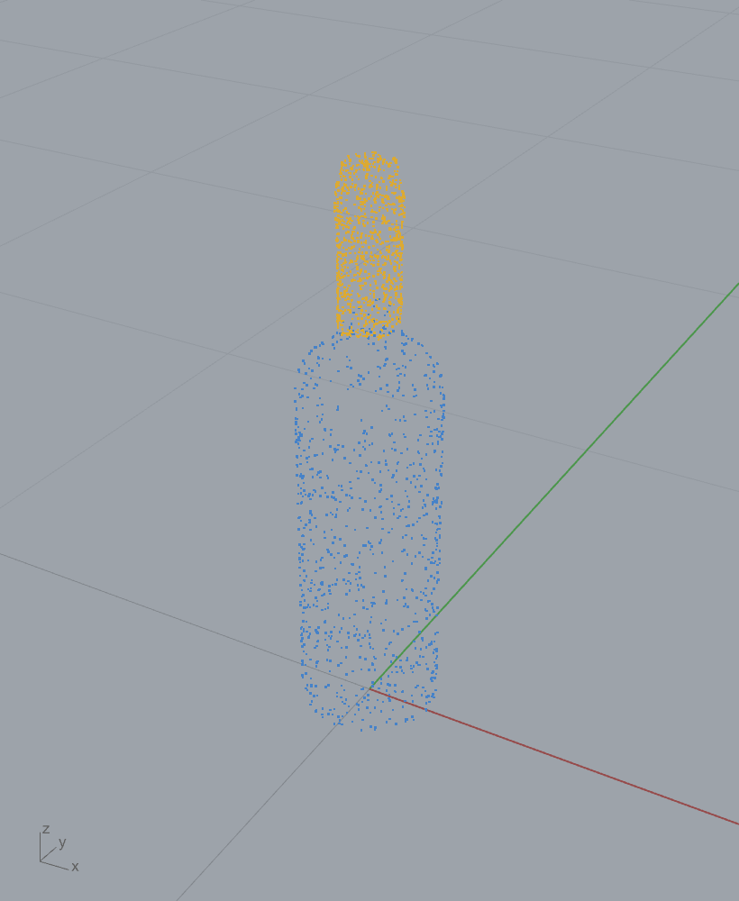

---

## 8. The projection bootstrap: unblocking the geometric 3D path

The geometric 3D path has a structural blocker, proved by run R0 and recorded on
the finder (`ProjectionPairFinder.cs:16-22`): independently tessellated shard
rims triangulate the shared cut differently, so the hash index finds **zero**
cross-panel complements (hash hits: self 172, cross-panel 0). The agglomerative
solver then has an empty pair graph and assembles nothing.

The key geometric fact that breaks the deadlock: for an open-shell shard the
naked rim along a cut facet **lies in that facet plane**, so two mating shards
share a plane, and per-facet projection reduces 3D rim matching to the *working*
2D matcher. The pipeline (`ProjectionPairFinder.cs:23-48`):

1. **Split and fit.** Split each naked rim loop into maximal planar facet arcs;
   fit each facet plane by PCA, taking the covariance
   $\Sigma=\tfrac1n\sum (x_i-\bar x)(x_i-\bar x)^\top$, its symmetric
   eigendecomposition, the smallest-eigenvalue eigenvector as the normal, and
   $\sqrt{\lambda_{\min}}$ as the RMS out-of-plane residual
   (`FitFacetPlane`, `:481-543`). Low-planarity arcs are flagged and excluded.
2. **Project and resample.** Map each arc into its facet plane (`PlaneToPlane`
   $\to$ WorldXY) and resample at a scale-relative spacing, tessellation-invariant
   (`:362-383`). Build a 2D `Panel`.
3. **Match in 2D.** Run the working stages 1-4 across fragments to get
   complementary pairs and a 2D in-plane relative transform $M_{2D}$.
4. **Lift to $SE(3)$.** The 2D match lifts to a 3D candidate pose
   (`Lift`, `:607-619`):

$$
T_{\text{rel}}=\mathrm{Lift}_{B^{\flat}}\cdot M_{2D}\cdot \mathrm{Proj}_A,
$$

with $\mathrm{Proj}_A=\mathrm{PlaneToPlane}(\text{facet}_A,\text{WorldXY})$ and
$\mathrm{Lift}_{B^{\flat}}=\mathrm{PlaneToPlane}(\text{WorldXY},\text{facet}_B^{\flat})$,
where $\text{facet}_B^{\flat}$ is the parent facet with its normal flipped so the
lifted child facet normal is **antiparallel** to the parent's outward normal
(opposite sides of the fracture).

### 8.1 Projection proposes, 3D disposes

A 2D shadow match has a normal-sign ambiguity, so both lift senses are tried
(flip the parent or flip the child, `Lift` vs `LiftChildFlip`, `:621-636`) and
each is *verified in 3D*: the symmetric mean nearest-neighbour distance between
the lifted child world arc and the parent world arc (`Residual3D`, `:643-678`).
A candidate whose 3D residual exceeds `ProjectionVerifyFactor * objectScale`
(default 12%) is a projection-ambiguous false positive and is dropped
(`:268-270`). This is the "projection proposes, 3D disposes" gate: a genuine
mating facet has a small 3D residual; a shadow match that lost depth has a large
one. Measured on the 6-shard fixture (roadmap, 2026-05-25): 67 cross-panel 2D
matches where R0 had 0, 25 lifted-and-3D-verified pairs, 6/6 fragments placed via
the agglomerative MST. The honest caveat is also recorded: the assembly is only
*partially* tight (2 of 5 MST interfaces fully in contact), so the bootstrap
proposes correctly but Soft-ICP does not yet tighten every edge.

**Originality.** **original-research (A-candidate).** The per-facet projection
bootstrap, the antiparallel lift composition, and the 3D-disposes verification
gate have no equivalent in the local corpus and no `[Algorithm]` attribute citing
an upstream source; the design basis is the in-repo
`wiki/algorithms/edge_matching/projection_bootstrap_3d.md`. A prior-art sweep is
pending, so per AGENTS.md §9 this is marked A-candidate, not asserted novel. The
PCA plane fit it builds on is clean-room textbook. Tier A.

---

## 9. The rigid-registration kernels

Two closed-form rigid-fit kernels live beside the matcher, and the chapter must
keep them distinct.

**Kabsch / SVD (the ICP kernel).** `ConstrainedIcp3D.Kabsch3D`
(`ConstrainedIcp3D.cs:147-189`) and the Soft-ICP M-step use the
orthogonal-Procrustes SVD solve of section 4.2 on the vendored `MathNet.Numerics`
package. This is the per-iteration registration inside ICP (Besl and McKay 1992;
Kabsch 1976). **clean-room** algorithm over a **vendored** SVD.

**Horn quaternion (the marker / georeference kernel).**
`RigidTransformRecovery` (`Frahan.StonePack.Core/Masonry/Geometry`) solves the
*same* absolute-orientation problem by Horn's unit-quaternion method: build the
$4\times4$ symmetric profile matrix $N$ from the nine cross-covariance entries
(Horn eq. 25), take its largest-eigenvalue eigenvector as the optimal quaternion
via cyclic Jacobi, and read off $R$ and $t=\bar b-R\bar a$
(`RigidTransformRecovery.cs:6-30`). It is pure-managed with **no** SVD
dependency and is exposed through the `RegistrationApi` facade
(`RegistrationApi.cs:9-29`, `:57-108`) and the georeference component
(`[Algorithm("Absolute orientation + UTM/EPSG transform", "Horn, B.K.P. (1987).
Closed-form solution of absolute orientation using unit quaternions...")]`,
`GeoreferenceComponent.cs:36`). **clean-room** implementation of Horn (1987).

The two kernels solve the identical least-squares problem
$\min_{R,t}\sum\|Ra_i+t-b_i\|^2$ by two routes (SVD vs quaternion eigenproblem)
and agree numerically. The repository's own architecture audit flags this as a
**keep-core duplication**: three Horn/Kabsch absolute-orientation copies
(`RigidTransformRecovery`, the Georeference private Horn, and the
`Kabsch3D`/`SoftIcpRefiner` SVD) to be unified on one MathNet-SVD kernel. That is
a refactor item, not a correctness bug; both routes are correct.

---

## 10. Scale invariance

Real fragments span seven orders of magnitude: fracture aperture ~1.5-2 mm,
Kintsugi/Trencadís shards 5-15 cm, dimension-stone blocks ~3 m, quarry blocks
~21 m, study areas km-scale. The same mating logic must hold at every scale, so
**every threshold is expressed as a fraction of object size**, never an absolute
millimetre. Concretely:

- **A1 acceptance gates.** The original residual gate was an absolute model-unit
  distance, which rejects everything on a mm fracture and is meters of slack on a
  100-unit block. The A1 increment makes it
  $\texttt{ResidualThresholdFactor}\times \text{objectScale}$
  (`AssemblyOptions.cs:67-75`), objectScale being the combined bounding-box
  diagonal. Default 0 keeps the absolute gate, so existing behaviour is unchanged.
- **Soft-ICP.** $\tau_0$, the correspondence radius, the contact band, the
  convergence translation, and the penetration tolerance are all multiples of the
  median rim spacing or the object diagonal (`SoftIcpRefiner.cs:189-214`,
  `:277-278`).
- **Projection bootstrap.** Sample spacing, planarity flag, and the 3D-disposes
  gate are fractions of the rim-loop diagonal
  (`AssemblyOptions.cs:231-265`).

The pattern follows the existing `MeshContactDetector.adaptiveToleranceFactor`
(5% of median edge). Benchmark errors are reported as fractions of object size so
metrics compare across the ~100-unit synthetic fixtures and the 5-15 cm real
objects.

---

## 11. The five-stage solver and the Trencadís case

The assembly solver runs the two modes declared on the options component
(`EdgeMatchOptionsComponent.cs:31-32`): the **frame-anchored** beam (the
original; every candidate is refined against panels already placed, growing from
an anchor, which suits the 2D Trencadís case where shards mate to a frame placed
first) and the **agglomerative** model (R0; match all pairs, build a weighted
pair graph, compose a minimum-residual spanning tree, which suits free 3D
reassembly where no single frame touches all shards). The two non-overlap
increments R1 (partial sub-segment emission so a long edge can reach the short
edge it mates with, `BoundarySegmenter.cs:115-139`) and R2 (an overlap penalty,
edge exclusivity, and a Jacobi depenetration polish, `AssemblyOptions.cs:111-177`)
drove the measured 2D overlap from 12-25% to 0% with 8/8 placed and 100% union
coverage (roadmap, 2026-05-25).

The Trencadís component is the geometric path's flagship: a centroidal-Voronoi
cell partition plus optimal one-to-one shard assignment, placing 28 irregular
shards into 28 cells with a grout gap, each piece used exactly once. The 3D
`Block Pair Match` component (GUID `D5F10008`) chains a variational shape
approximation segmenter, the 3D phase correlator, the constrained 3D ICP, and a
Hungarian assignment (`BlockPairMatch3DComponent.cs:43-52`); its VSA stage is a
**stub** (`Cohen-Steiner, Alliez, Desbrun 2004 SIGGRAPH; Frahan stub
implementation`, `:43-45`), and the component's own `[RelatedComponent]` points
users at the practically-tested Hungarian Stone-Cell Match for real stone-to-cell
work today (`:41`).


---

## Status & what's left

- **Geometric 3D reassembly is gated by tessellation.** Independently tessellated
  rims produce zero cross-panel hash hits; the geometric 3D path only works
  through the projection bootstrap, which proposes correctly but leaves some MST
  interfaces loose. The tessellation-invariant path for production 3D is the
  learned Kintsugi Port (chapter on fragment learning), not this geometric engine.
  Severity high.
- **VSA segmenter is a stub.** `Block Pair Match 3D` stage 1 is a stub
  (`BlockPairMatch3DComponent.cs:43-45`); the component is honest about it and
  redirects to Stone-Cell Match. Severity medium.
- **Three duplicate absolute-orientation kernels.** Horn-quaternion vs SVD-Kabsch
  (×2) solve the same problem; the architecture audit schedules unification on one
  MathNet-SVD kernel. Refactor, not a bug. Severity low.
- **Documentation nits.** The "Phase correlator FFT" `[Algorithm]` name describes
  an FFT but the code is a direct $O(n^2)$ circular correlation; harmless but
  should be reworded. Severity low.
- **Projection-bootstrap prior-art sweep pending.** The bootstrap, antiparallel
  lift, and 3D-disposes gate are marked A-candidate; AGENTS.md §9 forbids
  asserting novelty without the sweep. Severity medium.

---

### Originality summary

| Family | Class | Tier | Evidence |
|---|---|---|---|
| Boundary segmenter / turning descriptor | clean-room | B/C | `EdgeMatchSolveComponent.cs:23`; `BoundarySegmenter.cs:151-189` |
| Segment hash index | clean-room (Frahan-original) | C | `EdgeMatchSolveComponent.cs:24`; `SegmentHashKey.cs` |
| Phase correlator | clean-room | C | `EdgeMatchSolveComponent.cs:25`; `PhaseCorrelator.cs:13-44` |
| Constrained ICP (2D/3D) + SVD Kabsch | clean-room (algo) over vendored MathNet | B | `EdgeMatchSolveComponent.cs:26`; `ConstrainedIcp3D.cs:147-189` |
| Order-preserving correspondence DP | clean-room | C | `OrderedBoundaryMatcher.cs:24-37`, `:100-167` |
| Soft-ICP refiner (CPD + hinge) | clean-room / evolved-fork | B | `SoftIcp3DComponent.cs:43-51`; `SoftIcpRefiner.cs:299-527` |
| Projection bootstrap | original-research (A-candidate) | A | `ProjectionPairFinder.cs:16-48`, `:481-678` |
| Horn registration kernel | clean-room | B | `RigidTransformRecovery.cs:6-30`; `GeoreferenceComponent.cs:36` |

---

### References

- Arkin, E.M., Chew, L.P., Huttenlocher, D.P., Kedem, K., Mitchell, J.S.B.
  (1991). An efficiently computable metric for comparing polygonal shapes. IEEE
  Transactions on Pattern Analysis and Machine Intelligence 13(3):209-216. DOI
  10.1109/34.75509.
- Bennell, J.A., Oliveira, J.F. (2009). A tutorial in irregular shape packing
  problems. Journal of the Operational Research Society 60(S1):S93-S105. DOI
  10.1057/jors.2008.169.
- Besl, P.J., McKay, N.D. (1992). A method for registration of 3-D shapes. IEEE
  Transactions on Pattern Analysis and Machine Intelligence 14(2):239-256. DOI
  10.1109/34.121791.
- Cohen-Steiner, D., Alliez, P., Desbrun, M. (2004). Variational shape
  approximation. ACM Transactions on Graphics (SIGGRAPH) 23(3):905-914. DOI
  10.1145/1015706.1015817.
- Horn, B.K.P. (1987). Closed-form solution of absolute orientation using unit
  quaternions. Journal of the Optical Society of America A 4(4):629-642. DOI
  10.1364/JOSAA.4.000629.
- Kabsch, W. (1976). A solution for the best rotation to relate two sets of
  vectors. Acta Crystallographica A 32(5):922-923. DOI
  10.1107/S0567739476001873.
- Kuhn, H.W. (1955). The Hungarian method for the assignment problem. Naval
  Research Logistics Quarterly 2(1-2):83-97. DOI 10.1002/nav.3800020109.
- Marcotte, O., Suri, S. (1991). Fast matching algorithms for points on a
  polygon. SIAM Journal on Computing 20(3):405-422. DOI 10.1137/0220025.
- Myronenko, A., Song, X. (2010). Point set registration: Coherent Point Drift.
  IEEE Transactions on Pattern Analysis and Machine Intelligence 32(12):2262-2275.
  DOI 10.1109/TPAMI.2010.46.
- Tomczak, A., Haakonsen, S.M., Luczkowski, M. (2023). Matching algorithms to
  assist in designing with reclaimed building elements. Environmental Research:
  Infrastructure and Sustainability 3(3):035005. DOI 10.1088/2634-4505/acf341.
- Umeyama, S. (1991). Least-squares estimation of transformation parameters
  between two point patterns. IEEE Transactions on Pattern Analysis and Machine
  Intelligence 13(4):376-380. DOI 10.1109/34.88573.
- Wang, Z., Chen, B., Furukawa, Y. (2025). PuzzleFusion++: Auto-agglomerative 3D
  fracture assembly by denoise and verify. International Conference on Learning
  Representations (ICLR). arXiv:2406.00259.

---

# 09. Kintsugi & Learned 6-DoF Pose

The `Kintsugi` ribbon tab (7 components) is the repository's fracture
reassembly subsystem: given a set of broken fragments, recover the rigid
6-DoF pose of each so they snap back into the original solid. The tab has two
back ends behind one component. The default is the deterministic geometric
matcher of Chapter 08, which assembles fragments from their naked-edge rim
loops and runs entirely in-process with no learned model. The opt-in second
back end is `Frahan.Kintsugi.Port`, a managed C# port of the learned
PuzzleFusion++ pipeline (Wang, Chen and Furukawa 2025): a PointNet++ encoder,
a VQ-VAE latent, an SE(3) diffusion denoiser, and a learned pairwise
verifier. This is the production 3D reassembly path that Chapter 08
forward-references for fragments whose fracture rims are too smooth for the
geometric matcher to find correspondences.

This chapter derives the learned path's mathematics: the diffusion schedule
and DDPM update the denoiser runs under, the per-fragment normalisation and
its undo, the world-pose composition that lifts a normalised-space SE(3)
prediction back into document coordinates, and the verifier gate that decides
which fragments to trust. The single most important originality and licensing
fact governs the whole chapter and is stated first: the learned path is a
**direct port** of a non-commercial research-licensed upstream, quarantined
in a separate research-only assembly that the default install does not ship.

The truth criterion for this chapter is the live HITL validation of example
14: two Breaking Bad parity fragments reassembled at verifier pair score
0.7068 (STRONG, above the 0.5 gate), zero unplaced, 20 diffusion steps
(`examples/14_kintsugi/README.md`).

---

## 9.1 Why a learned path at all

The geometric matcher of Chapter 08 assembles by matching fracture-rim
geometry: it segments each naked-edge loop, hashes a rotation-invariant
curvature signature, phase-correlates candidate segments, refines with
constrained ICP (Besl and McKay 1992; Kabsch 1976), and beam-searches an
SE(3) assembly. It is deterministic, GPL-free, and best on clean, sharp
fracture rims. It fails on smooth or featureless fracture surfaces, where
there are no distinctive rim segments to hash. Example 14 records the failure
mode directly: a synthetic Voronoi shatter of a sphere gives the geometric
matcher no rim segments to lock onto and only 1 of 6 fragments place
(`examples/14_kintsugi/README.md`).

The learned path replaces hand-crafted rim descriptors with a network trained
on the Breaking Bad fracture dataset (Sellan et al. 2022). It poses fragments
from their full surface point clouds, not just rim loops, so it works where
the rim signal is weak. The cost is a non-commercial research licence, a
~267 MB weight file, and a heavier compute budget (Section 9.6). The two paths
are kept as one component with a `Use Port Mode` toggle; the geometric path
stays the default (`KintsugiAssemblyComponent.cs:68`).

---

## 9.2 The diffusion schedule and the DDPM update

The learned poser is a denoising diffusion model. It starts from a Gaussian
noise pose and walks it down a schedule of timesteps, at each step predicting
the noise to subtract. The repository ports PuzzleFusion++'s **custom**
schedule, not the standard linear-beta DDPM (Ho, Jain and Abbeel 2020). The
cumulative signal retention $\bar\alpha(t)$ is a piecewise quadratic in the
normalised time $\tau = t/(T-1) \in [0,1]$ with $T = 1000$ training steps
(`DiffusionScheduler.cs:59-71`):

$$
\bar\alpha(\tau)=
\begin{cases}
1 - 0.1\,\bigl(\tfrac{\tau}{0.7}\bigr)^2, & \tau \le 0.7,\\[4pt]
0.9\,\Bigl(1 - \bigl(\tfrac{\tau-0.7}{0.3}\bigr)^2\Bigr), & \tau > 0.7.
\end{cases}
$$

The per-step variance follows from the standard DDPM relation
$\beta_t = 1 - \bar\alpha_t/\bar\alpha_{t-1}$, clipped to $[0, 0.999]$ to keep
$\alpha_t = 1-\beta_t$ a valid retention factor (`DiffusionScheduler.cs:48-56`).
Inference subsamples the 1000-step schedule to $S$ descending timesteps with
diffusers' "leading" spacing: step size $\lfloor T/S\rfloor$, timesteps
$t_i = (S-1-i)\lfloor T/S\rfloor$ for $i = 0,\dots,S-1$, so the loop runs from
high noise to low (`DiffusionScheduler.cs:75-82`). The default $S=20$.

**The DDPM step (epsilon parameterisation).** Given the predicted noise
$\epsilon_\theta(x_t,t)$, the model first recovers the clean pose estimate by
inverting the forward process $x_t = \sqrt{\bar\alpha_t}\,x_0 +
\sqrt{1-\bar\alpha_t}\,\epsilon$:

$$
\hat x_0 = \frac{x_t - \sqrt{1-\bar\alpha_t}\;\epsilon_\theta(x_t,t)}{\sqrt{\bar\alpha_t}} .
$$

It then forms the posterior mean of $x_{t-1}$ as the standard DDPM convex
combination of $\hat x_0$ and $x_t$
(`DiffusionScheduler.cs:124-129`):

$$
x_{t-1} = \underbrace{\frac{\sqrt{\bar\alpha_{t-1}}\,\beta_t}{1-\bar\alpha_t}}_{c_{x_0}}\;\hat x_0
\;+\;
\underbrace{\frac{\sqrt{\alpha_t}\,(1-\bar\alpha_{t-1})}{1-\bar\alpha_t}}_{c_{x_t}}\;x_t .
$$

**Original derivation of the two terminal guards.** The posterior coefficients
divide by $1-\bar\alpha_t$. At the last inference step $t=0$ the schedule gives
$\bar\alpha_0 = 1$ (zero noise), so $1-\bar\alpha_t \to 0$ and the posterior
mean is $0/0$. The port branches: at $t=0$ it returns $\hat x_0$ directly, the
clean predicted pose, which is exactly the diffusers' $t=0$ branch
(`DiffusionScheduler.cs:108-111`). A second guard catches the same singularity
on any subsampled step where $1-\bar\alpha_t$ is numerically tiny: if
$1-\bar\alpha_t < 10^{-6}$ it again returns $\hat x_0$ rather than amplify
round-off through the reciprocal (`DiffusionScheduler.cs:120-123`). The port is
no-added-noise DDPM, not DDIM (`DiffusionScheduler.cs:25-26`); the schedule is
deterministic given the seed.

A pose is a 7-vector $[\,\mathbf t\;(3)\mid \mathbf q\;(4)\,]$: translation
first, then a unit quaternion $(w,x,y,z)$. The diffusion runs in this layout
(`KintsugiPortInference.cs:31-34`). Quaternions are re-normalised to the unit
sphere after every scheduler step (`KintsugiPortInference.cs:306-322`); the
model is trained to tolerate the off-manifold drift the linear update
introduces and the normalisation projects back.

> **Originality.** The scheduler is a **direct port** of
> `puzzlefusion_plusplus/.../custom_diffusers.py`, named as such at
> `DiffusionScheduler.cs:7-9`. The piecewise-quadratic $\bar\alpha$ and the
> epsilon-DDPM update are upstream; the two terminal guards
> (`:108-111`, `:120-123`) are the only port-side additions, and they
> reproduce the diffusers reference behaviour rather than change it.

---

## 9.3 The encode-in-the-loop architecture and its cost

The port mirrors the upstream `AutoAgglomerative.test_denoiser_only` schedule
step-for-step, and the orchestrator header flags the one place a naive
re-implementation goes wrong (`KintsugiPortInference.cs:11-43`). The encoder
is **re-run inside the denoising loop**, not once up front. At each timestep
the current noisy quaternion is applied to each fragment's point cloud, the
**rotated** cloud is fed through the PointNet++ encoder (Qi et al. 2017) and
VQ-VAE quantiser (van den Oord, Vinyals and Kavukcuoglu 2017), and the
denoiser conditions on encoder features of the **currently-estimated** pose
(`KintsugiPortInference.cs:200-261`). The denoiser is a 6-block, 8-head, 512-D
AdaLN-conditioned transformer (Vaswani et al. 2017; conditioning after
Peebles and Xie 2023) predicting a 7-D residual per fragment
(`Se3Denoiser.cs:12-22`).

The rotation is applied as the explicit quaternion-to-matrix form
$R(\mathbf q)$, then each point is mapped $p \mapsto R(\mathbf q)\,p$
(`KintsugiPortInference.cs:222-233`). The VQ step is essential and was a
documented earlier omission: the SA3 features are compressed by `conv6` from
512-D to 64-D, reshaped to $4L$ rows of 16, and each row is snapped to its
nearest of 1024 codebook entries, because the denoiser was trained on the
quantised latent $z_q$, not the raw encoder output $z_e$
(`KintsugiPortInference.cs:374-412`).

**The anchor convention.** Fragment $0$ (or the chosen `anchorIndex`) is the
reference. Its pose is **pinned to identity** every step ($\mathbf t = 0$,
$\mathbf q = (1,0,0,0)$) and never noised; all other fragments are predicted
relative to it, and the reset after each scheduler step prevents the anchor
from drifting (`KintsugiPortInference.cs:169-171`, `:303-304`). This is what
makes the assembly well-posed: the network predicts relative SE(3), so one
fragment must define the world frame.

The compute cost is linear in fragments $F$ and steps $S$: $F\cdot S$ encoder
forwards plus $S$ denoiser forwards plus one verifier pass per pair. The header
budgets it honestly for the libtorch path: $F{=}10, S{=}5 \approx 165$ s;
$F{=}10, S{=}20 \approx 660$ s (`KintsugiPortInference.cs:36-43`). This is why
the component is async with a default-false `Run` gate (the heavy-node rule of
`AGENTS.md` §6; `examples/14_kintsugi/README.md`).

> **Originality.** The orchestrator and the encoder, denoiser, VQ-VAE and
> verifier modules are a **direct port** of the PuzzleFusion++ Python
> reference. The header states it: "Mirrors upstream's
> `auto_aggl.py::AutoAgglomerative.test_denoiser_only` step-for-step"
> (`KintsugiPortInference.cs:11-13`). Module headers cite the upstream file
> and paper section for each component (e.g. `Se3Denoiser.cs:12`,
> `DiffusionScheduler.cs:7`). A dual TorchSharp/libtorch denoiser path exists
> for paper-exact kernels, with a silent-fallback report flag so the
> component surfaces whether the manual port (with ~3-5% drift) or libtorch
> actually ran (`KintsugiPortInference.cs:57-72`, `:1131-1142`).

---

## 9.4 Per-fragment normalisation and the pose-composition fix

The network operates in **per-fragment normalised space**: before encoding,
each point cloud is centred at its own centroid and scaled so its maximum
absolute coordinate is 1 (`KintsugiAssemblyComponent.cs:1303-1334`). Define for
fragment $f$ the captured centroid $\mathbf c_f$ and scale $m_f = \max_i
\lVert p_i\rVert_\infty$. The normalisation map is

$$
T_{\mathrm{norm}}(f) = \operatorname{scale}\!\bigl(\tfrac{1}{m_f}\bigr)\cdot \operatorname{translate}(-\mathbf c_f),
$$

so a document-space point $p$ maps to $T_{\mathrm{norm}}(f)\,p$ in the unit
cube the encoder expects. The network returns a pose $T_{\mathrm{net}}(f)$ that
is an SE(3) transform **in that normalised frame**, not in document
coordinates.

Applying $T_{\mathrm{net}}(f)$ directly to a document-coordinate mesh is the
2026-05-24 misalignment bug: it rotates the mesh about the world origin and
translates by sub-unit distances, collapsing every fragment onto a blob
(`KintsugiAssemblyComponent.cs:1008-1014`). The fix composes three transforms.
Each non-anchor fragment is brought into **its own** normalised frame, posed by
the network, then lifted into the **anchor's** world frame:

$$
\boxed{\,T_{\mathrm{world}}(f) = T_{\mathrm{unnorm}}(0)\cdot T_{\mathrm{net}}(f)\cdot T_{\mathrm{norm}}(f)\,}
$$

with the anchor's un-normalisation (the inverse of the anchor's own
normalisation)

$$
T_{\mathrm{unnorm}}(0) = \operatorname{translate}(+\mathbf c_0)\cdot \operatorname{scale}(m_0),
$$

assembled verbatim at `KintsugiAssemblyComponent.cs:1098-1102` and
`:1032-1036`.

**Original derivation of the anchor collapse.** Read right to left,
$T_{\mathrm{world}}(f)$ first sends fragment $f$'s document points into its
unit-cube frame ($T_{\mathrm{norm}}(f)$), applies the network's
normalised-space placement ($T_{\mathrm{net}}(f)$), then maps the result out of
the **anchor's** unit-cube frame back to document space
($T_{\mathrm{unnorm}}(0)$). The mixed indices, $f$ on the way in and $0$ on the
way out, are deliberate: the network poses every fragment relative to the
anchor's normalised frame, so the inverse must undo the anchor's normalisation,
not fragment $f$'s. For the anchor itself ($f=0$) the orchestrator forces
$T_{\mathrm{net}}(0)=I$, and then

$$
T_{\mathrm{world}}(0) = T_{\mathrm{unnorm}}(0)\cdot I\cdot T_{\mathrm{norm}}(0) = T_{\mathrm{unnorm}}(0)\,T_{\mathrm{norm}}(0) = I,
$$

because un-normalisation is the exact inverse of normalisation. The anchor
therefore stays at its input document position, which is the desired identity
behaviour (`KintsugiAssemblyComponent.cs:1025-1028`, `:1081`, `:1106-1108`).
This is the "norm-undo" the originality ledger names: the network pose is only
meaningful sandwiched between the forward and inverse normalisations.

> **Originality.** The normalisation, its captured-parameter undo, and the
> three-factor world composition are the **Frahan-original pose-composition
> fix** over the port. The `[DesignApplication]` precedent line names it
> explicitly: "Frahan-original pose composition fix"
> (`KintsugiAssemblyComponent.cs:81`). The network it wraps is the direct port;
> the composition that makes the port usable in document coordinates is the
> repository's contribution and is documented inline as the fix for a named
> HITL failure.

---

## 9.5 The verifier and the 0.5 gate

The network produces a pose for every fragment whether or not the prediction is
trustworthy. A weak prediction must not be applied, or it collapses the
fragment onto the anchor through the same composition that works for strong
ones. The learned verifier is the gate. It is a small transformer classifier
that, for each fragment pair, projects the pair's edge feature to the embed
dimension, runs a 1-token transformer stack, and maps the result through a
linear head to a logit that a sigmoid turns into an acceptance probability
$p\in[0,1]$ (`Verifier.cs:58-78`, `VerifierTransformerPort`):

$$
p_{ij} = \sigma\!\bigl(\mathbf w^\top \operatorname{Transformer}(\,\text{proj}(\phi_{ij})\,) + b\bigr),\qquad
\sigma(z)=\frac{1}{1+e^{-z}} .
$$

In the orchestrator the edge feature $\phi_{ij}$ for the upper-triangular pair
$(i,j)$ is fragment $j$'s final 7-D pose, and every pair is scored
(`KintsugiPortInference.cs:326-349`). The logits are passed through the same
sigmoid to produce the reported per-pair scores.

**Per-fragment confidence and the gate.** The component reduces the pairwise
scores to a per-fragment confidence as the **maximum** score over all pairs
containing that fragment (`KintsugiAssemblyComponent.cs:1056-1070`):

$$
\text{conf}(f) = \max_{j\ne f} p_{\{f,j\}} .
$$

A fragment is accepted (its network pose applied) only if it is the anchor or
its confidence clears the threshold:

$$
\text{accept}(f) = (f = \text{anchor}) \;\lor\; \text{conf}(f) \ge V_t,\qquad V_t = 0.5\ \text{(default)} .
$$

A rejected fragment is held at its input world position (identity transform)
and listed as Unplaced, exactly as PuzzleFusion++'s auto-agglomerative schedule
leaves a weak-pair fragment out of the anchor cluster
(`KintsugiAssemblyComponent.cs:1081-1089`). The threshold default of 0.5 is the
same value that tags a pair "STRONG" in the report
(`KintsugiAssemblyComponent.cs:1052-1055`).

**Why the gate exists (the blob).** The header records the failure that
motivated it: the 5-fragment Breaking Bad sample produced only one strong pair
(top $(3,4)=0.549$, the rest below 0.5). Without gating, every weak-prediction
fragment was composed as $T_{\mathrm{unnorm}}(0)\cdot I\cdot T_{\mathrm{norm}}(f)$
and collapsed onto the anchor's centroid, the blob the user saw on 2026-05-24
(`KintsugiAssemblyComponent.cs:1046-1050`). The gate is the diagnostic too:
reading the verifier score distribution before the poses distinguishes a
pose-composition fault from a network-drift or a mesh-style fault
(`examples/14_kintsugi/README.md`, the "read scores first" rule).


> **Originality.** The verifier is a **direct port** of the PuzzleFusion++
> learned binary classifier (`Verifier.cs:7-22`,
> `VerifierTransformerPort`); the sigmoid head and transformer stack are
> upstream. The confidence-reduction and 0.5 gate that turn the per-pair
> probabilities into a per-fragment accept/reject are the port-side
> integration that keeps weak predictions from collapsing the assembly. The
> geometric mode ships a separate **Frahan-original** penetration-based
> verifier that rejects placements whose transformed mesh interpenetrates an
> already-placed mesh (`KintsugiAssemblyComponent.cs:75-77`); the two
> verifiers are not the same code and the learned one runs only in Port mode.

---

## 9.6 Originality and the licence-critical quarantine

The learned path is classified **direct-port**, and this is the single
licensing risk that governs the whole repository's distribution posture.

The upstream is PuzzleFusion++ (Wang, Chen and Furukawa 2025, ICLR;
arXiv:2406.00259). Its licence is **research-use-only / non-commercial**, not
plain GPL-3.0, and that obligation covers both the ported C# code **and** the
converted weight file `kintsugi.bin` (~255-267 MB) derived from the upstream
checkpoint (`docs/thesis/90_originality.md`, register row 2, flag E1
CRITICAL). The port also transitively carries the upstream's vendored
`jigsaw_matching` subtree (Lu et al.), whose own MIT grant is unaudited against
its original repository (register row 3, flag E1/jigsaw).

The load-bearing mitigation is architectural quarantine. `Frahan.Kintsugi.Port`
is a **separate assembly**, isolated from the default `Frahan.StonePack.gha`,
and the weights are gitignored and absent from the default install: example 14
warns and falls back to the geometric path when `kintsugi.bin` is missing
(`examples/14_kintsugi/README.md`, "REQUIRED: kintsugi.bin"). Because the
default install links no part of the port and ships no converted weights,
nothing in the default-install algorithm path is a line-by-line port of a
competitor (`90_originality.md`, posture summary). The mitigation is only valid
while the split holds: the register requires the root LICENSE, the port README,
and any repo-root statement to all say research-only / non-commercial, not
plain GPL-3.0, before any public release (register rows 1-2).

> **Originality.** `Frahan.Kintsugi.Port` is **direct-port (research-only)**.
> Evidence: it is a C# port of PuzzleFusion++, headers cite the upstream Python
> file per module (`KintsugiPortInference.cs:11-13`, `Se3Denoiser.cs:12`,
> `DiffusionScheduler.cs:7`, `Verifier.cs:11`), and the ledger lists it as the
> sole `direct-port` in the thesis, quarantined in a non-commercial
> research-only assembly (`90_originality.md`, Chapter 08 row;
> register rows 1-3). The norm-undo and the verifier-gated world-pose
> composition $T_{\mathrm{world}}(f)=T_{\mathrm{unnorm}}(0)\cdot T_{\mathrm{net}}(f)\cdot T_{\mathrm{norm}}(f)$
> are the **Frahan-original** wrapper around the port, not part of the ported
> network. The default `Mode=Geometric` path is the clean-room edge-matching
> assembler of Chapter 08 and links no GPL or non-commercial code.

The honest boundary on capability is held in source too. Port mode reproduces
the paper's behaviour **only** on the Breaking Bad test distribution it was
trained on; a synthetic Voronoi shatter does not reassemble, and the example
deliberately loads a real Breaking Bad parity sample where the verifier clears
the gate at 0.71 (`examples/14_kintsugi/README.md`). The manual C# denoiser
carries a stated ~3-5% drift versus the libtorch kernels, which is why the
TorchSharp path exists and why the component reports which path actually ran
(`KintsugiPortInference.cs:74-81`, `:1131-1142`).

---

## 9.7 Status and what is left

- **Licence quarantine must be verified before any public release.** The root
  LICENSE is a header, not the full text, and must state research-only /
  non-commercial (not plain GPL-3.0) across the root LICENSE, the port README,
  and the converted weights. The combined work cannot ship commercially while
  the port is linked (`90_originality.md`, register rows 1-2, flag E1). *Blocker
  for external/commercial distribution.*
- **`jigsaw_matching` subtree unaudited.** Its MIT grant is unverified against
  the original repository; treated conservatively under the parent
  non-commercial terms and not compiled into StonePack (register row 3).
  *High.*
- **Manual-port drift.** The pure-C# denoiser drifts ~3-5% from the libtorch
  kernels; the TorchSharp path removes it but needs LibTorchSharp.dll and a
  working CUDA/CPU libtorch, with a documented silent-fallback to the manual
  port (`KintsugiPortInference.cs:74-114`). *Medium.*
- **Distribution-only generalisation.** Port mode reassembles reliably only on
  Breaking Bad-like fractured-scan fragments; synthetic primitives and smooth
  rims under-place. For arbitrary data the geometric path is the safer default
  on clean rims (`examples/14_kintsugi/README.md`). *Medium (honesty bound, not
  a code fault).*
- **`AutoAgglomerate` outer loop is a skeleton.** The full auto-agglomerative
  multi-round merge with point-match deletion and FPS resampling is wired but
  the per-round merge body is stubbed (`AutoAgglomerate.cs:120-147`,
  `BuildPairFeatures` `:177-192`); the shipped path is the single-round
  `KintsugiPortInference` denoise-then-verify, not the iterative paper
  schedule. *Medium.*
- **Stale `[Algorithm]` wording.** The GH component attribute still reads
  "Full GPL-3.0 honest port ... underway" and "Phase 0 (current): ... NO
  learned model" (`KintsugiAssemblyComponent.cs:62-68`), describing a
  pre-port state. The learned port has landed and the licence is
  non-commercial, not plain GPL-3.0; the attribute should be corrected to match
  the ledger before academic review (`AGENTS.md` §9). *Low.*
- **Compute budget.** $F\cdot S$ encoder forwards make large-$F$ assemblies
  slow (10 fragments at 20 steps ~660 s on GPU); the async gate keeps the
  canvas responsive but the wall-clock is real (`KintsugiPortInference.cs:36-43`).
  *Low.*

---

## References (this chapter)

- Wang, Z., Chen, B., Furukawa, Y. (2025). PuzzleFusion++: auto-agglomerative
  3D fracture assembly by denoising and verification. ICLR 2025.
  arXiv:2406.00259. (Upstream of the direct port; non-commercial research
  licence.) [R112]
- Sellan, S., Chen, Y.-C., Wu, Z., Garg, A., Jacobson, A. (2022). Breaking Bad:
  a dataset for geometric fracture and reassembly. NeurIPS 2022 Datasets and
  Benchmarks. [R113]
- Ho, J., Jain, A., Abbeel, P. (2020). Denoising diffusion probabilistic
  models. Advances in Neural Information Processing Systems 33:6840-6851.
  arXiv:2006.11239.
- Qi, C.R., Yi, L., Su, H., Guibas, L.J. (2017). PointNet++: deep hierarchical
  feature learning on point sets in a metric space. Advances in Neural
  Information Processing Systems 30. arXiv:1706.02413.
- van den Oord, A., Vinyals, O., Kavukcuoglu, K. (2017). Neural discrete
  representation learning (VQ-VAE). Advances in Neural Information Processing
  Systems 30. arXiv:1711.00937.
- Vaswani, A., Shazeer, N., Parmar, N., Uszkoreit, J., Jones, L., Gomez, A.N.,
  Kaiser, L., Polosukhin, I. (2017). Attention is all you need. Advances in
  Neural Information Processing Systems 30. arXiv:1706.03762.
- Peebles, W., Xie, S. (2023). Scalable diffusion models with transformers
  (DiT, adaptive layer norm conditioning). IEEE/CVF ICCV 2023:4195-4205.
  arXiv:2212.09748.
- Besl, P.J., McKay, N.D. (1992). A method for registration of 3-D shapes. IEEE
  Transactions on Pattern Analysis and Machine Intelligence 14(2):239-256. DOI
  10.1109/34.121791. [R101]
- Kabsch, W. (1976). A solution for the best rotation to relate two sets of
  vectors. Acta Crystallographica A32:922-923. DOI
  10.1107/S0567739476001873. [R102]

---

# 10. Mesh Processing & Surface Reconstruction

This chapter covers the repository's mesh-geometry back end: the `Mesh`
ribbon tab and the optional native geometry shims it fronts. Three layers
sit here. The lowest is two native shims, `frahan_cgal` (CGAL Polygon Mesh
Processing) and `frahan_geogram` (Bruno Levy's Geogram), each reached through
a managed P/Invoke front end. Above them sit the managed fallbacks, a BSP CSG
kernel and a Rhino-side weld/heal pipeline, so the plugin runs with no native
DLL present. On top sit the Grasshopper wrappers: a mesh-boolean comparator,
repair, decimation, segmentation, straight-skeleton, remesh, hole-fill, and a
three-backend point-cloud reconstructor.

The repository contributes no new mesh algorithm here. Almost everything in
scope is published computational geometry executed by a vendored library, so
the originality story is honest by construction: the algorithms are CGAL's and
Geogram's, the licences are theirs, and the repository's work is the
marshalling boundary, the managed fallback, the out-of-process crash isolation,
and the numeric conditioning around the call. Every claim is anchored to a
`file:line`, an `[Algorithm]` attribute, or a committed reference key.

The governing engineering decision for the whole chapter is the
**mesh-boolean backend routing rule**, stated in the repository law:
"In-process CGAL/geogram BOOLEAN can crash Rhino: route heavy boolean/recon
through the out-of-process worker" (`AGENTS.md:19`). A native abort inside the
host process (an access violation, or a C++ `abort` 0xC0000409 from an
unmasked floating-point exception) would take down Rhino with the user's
unsaved work. So large slab and block cuts do not run N RhinoCommon booleans
in a loop, and they do not run the native kernel in-process either; they run
it in an isolated worker that can crash without consequence
(`OutOfProcessReconstructor.cs:9-19`).

---

## 10.1 The native shim boundary

Both shims share one contract: a lazy probe on first use, a cached
availability flag, and a transparent fallback when the DLL is absent. The
default install ships **no** native DLL, so the probe normally fails closed and
the managed path runs (`AGENTS.md:19`; `CgalMeshBoolean.cs:66-86`,
`GeogramMesh.cs:103-123`). The probe calls a version export inside a
`try`/`catch` for `DllNotFoundException`, `EntryPointNotFoundException`, and
`BadImageFormatException` (the x86/x64 mismatch case), and never rethrows, so a
missing or wrong-bitness shim degrades to managed rather than faulting
(`CgalMeshBoolean.cs:74-83`).

The marshalling is uniform: managed inputs are flattened to `double[]` vertex
coordinates and `int[]` triangle indices, passed to the native entry point,
which allocates output buffers; the managed side `Marshal.Copy`-es them back
and immediately frees the native buffers through a paired free export
(`CgalMeshBoolean.cs:215-220`, `CgalGeometry.cs:301-311`). There is no GC
pinning and no buffer left dangling on the error path: every failure branch
frees before it throws (`CgalGeometry.cs:293-299`).

> **Originality.** `CgalMeshBoolean`, `CgalGeometry`, `GeogramMesh`, and
> `ReconstructionNative` are **wrapper-of-native**: P/Invoke surfaces over
> `frahan_cgal.dll` and `frahan_geogram.dll`. The algorithms execute inside
> the vendored libraries; only the marshalling, the availability probe, and
> the buffer lifetime are repository code (`CgalMeshBoolean.cs:8-23`,
> `GeogramMesh.cs:9-20`). The libraries themselves are **vendored-library**.
> CGAL is GPL in its open-source distribution and the shim header says so
> verbatim (`CgalGeometry.cs:23-28`); Geogram is BSD-3 throughout
> (`GeogramMesh.cs:18-19`). The licence asymmetry drives the install policy of
> section 10.6.

---

## 10.2 CGAL Polygon Mesh Processing

`frahan_cgal` exposes the CGAL Polygon Mesh Processing (PMP) package plus
neighbouring CGAL packages (Botsch et al. 2010). Six operations are wired.

### 10.2.1 Corefinement booleans

The boolean front end (`CgalMeshBoolean`) routes Union, Intersection, and
Difference through CGAL's `corefine_and_compute_boolean_operations`
(`CgalTestComponents.cs:119`, GUID `F2D000A0-CADC-4F2D-A0A0-7E60CADA15A0`).
Corefinement first computes the exact intersection polylines of the two input
surfaces and **inserts** them as constrained edges into both meshes, so the two
surfaces share a common refined edge set along their intersection. The boolean
is then a face-selection over the corefined arrangement: a triangle survives
the union, intersection, or difference depending on which side of the other
surface it lies on. This is the gold standard for 3D mesh robustness because
the cut geometry is shared exactly rather than reconstructed twice from
floating-point intersections.

Two kernel modes are exposed (`CgalMeshBoolean.cs:37-53`). **Inexact** uses
CGAL's EPICK (exact predicates, inexact constructions): predicate signs are
exact, but the constructed intersection points are rounded doubles. Fast,
default, correct for well-conditioned inputs. **Hybrid** keeps storage in
EPICK for speed but constructs the intersection vertices in EPECK (exact
predicates, exact constructions) and round-trips them through a
`Cartesian_converter`, the COMPAS_CGAL pattern, recommended for near-tangent
contacts and multi-cut chains where inexact constructions accumulate error
(`CgalMeshBoolean.cs:44-52`).

### 10.2.2 Repair

`RepairMesh` runs the PMP repair recipe: `triangulate_faces`,
`stitch_borders`, `remove_degenerate_faces`, `orient_to_bound_a_volume` when
the mesh is closed, then `collect_garbage` (`CgalGeometry.cs:317-326`). The
header states why this is stronger than Rhino's `RebuildNormals` +
`UnifyNormals` + `FillHoles`: CGAL stitches coincident half-edges by exact
adjacency, actually merging the topology, where Rhino's heuristics only align
normal vectors (`CgalGeometry.cs:322-326`). The Sanitize Mesh component
(GUID `F2D05A01-...`) fronts this as the upstream gate for any CGAL cut, which
rejects non-manifold input (`MeshSanitizeComponents.cs:53-67`).

### 10.2.3 Lindstrom-Turk simplification

`DecimateMesh` is CGAL `Surface_mesh_simplification` edge-collapse with the
default Lindstrom-Turk cost and placement policies (Lindstrom and Turk 1998;
`CgalGeometry.cs:381-413`; Decimate (CGAL) component
`CgalTestComponents.cs:507`). Edge-collapse simplification removes one edge at
a time, contracting its two endpoints to a single placed vertex. The
Lindstrom-Turk policy chooses that placement by a **memoryless volume-and-shape
optimisation** rather than by accumulating Garland-Heckbert quadrics. For a
collapse it forms a small linear system from the local one-ring: volume
preservation requires that the signed volume swept by the moved triangles sum
to zero,

$$
\sum_{f\in\mathrm{ring}} \mathbf{n}_f\cdot \bar{\mathbf{v}} = \sum_{f\in\mathrm{ring}} \mathbf{n}_f\cdot \mathbf{c}_f,
$$

with $\mathbf{n}_f$ the area-weighted face normal and $\mathbf{c}_f$ a face
point; the remaining degrees of freedom are fixed by minimising a boundary and
shape energy, giving a $3\times 3$ solve per candidate collapse. Three stop
predicates are offered, a ratio of remaining to initial edges, an absolute
edge-count target, and an edge-length floor that **preserves sharp features**
by refusing to collapse edges shorter than the threshold
(`CgalGeometry.cs:157-166`). Geogram offers a different decimation flavour,
vertex-clustering, for the same problem; section 10.3 contrasts the two.

### 10.2.4 SDF segmentation (original derivation of the segmentation field)

`SegmentMeshBySdf` is CGAL `Surface_mesh_segmentation`, the Shape Diameter
Function graph-cut of Shapira et al. (2008) (`CgalGeometry.cs:460-515`;
component `CgalTestComponents.cs:755`, GUID
`F2D000A6-CADC-4F2D-A0A6-7E60CADA15A0`). It partitions a surface into
volumetric-feature clusters, the natural decomposition for breaking a sculpted
stone form into part-like pieces.

The Shape Diameter Function at a face $f$ measures the local object thickness.
From the face centroid, cast a cone of rays of half-angle $\alpha$ (default
$\tfrac{2}{3}\pi$, `CgalGeometry.cs:472`) inward along $-\mathbf{n}_f$, keep the
rays that hit the opposite surface, and take a robust average of the hit
distances:

$$
\mathrm{SDF}(f)=\frac{\displaystyle\sum_{r\in R(f)} w_r\,\ell_r}{\displaystyle\sum_{r\in R(f)} w_r},
\qquad
w_r=\cos\!\big(\angle(r,-\mathbf{n}_f)\big),
$$

over the inlier ray set $R(f)$ (rays whose hit length falls within one
standard deviation of the median, discarding rays that escape through a
concavity). The cosine weight favours rays near the inward normal. A default of
25 rays per facet is used (`CgalGeometry.cs:473`). The raw field is then
normalised and **soft-clustered** by fitting a $k$-component Gaussian mixture
over the log-SDF values, giving each face a probability of belonging to each
thickness class.

The cluster labels are not assigned directly from the mixture, because that
ignores spatial coherence and produces speckle. Instead the labelling minimises
a Markov-random-field energy by graph-cut $\alpha$-expansion:

$$
E(\mathbf{x})=\sum_{f} -\log \Pr\big(\mathrm{SDF}(f)\mid x_f\big)
\;+\;\lambda \sum_{(f,g)\in \mathcal{E}} \big[x_f\neq x_g\big]\,
\frac{-\log\!\big(\theta_{fg}/\pi\big)}{\,1+\,\mathrm{dist}_{fg}\,},
$$

where the data term is the mixture's negative log-likelihood, the pairwise term
penalises a label change across adjacent faces, and the smoothing weight
$\lambda$ is the user's `smoothingLambda` (default 0.26, the CGAL example value;
`CgalGeometry.cs:471`, `:478`). The dihedral factor $-\log(\theta_{fg}/\pi)$
makes a label boundary **cheap across a concave crease** (small $\theta$) and
expensive across a flat band, so cuts fall in the natural part seams. Higher
$\lambda$ yields fewer, more coherent islands; the component clamps it to
$[0,1]$ (`CgalGeometry.cs:485-486`). The managed side then splits the per-face
segment-id array into one sub-mesh per non-empty cluster, re-indexing vertices
locally (`CgalGeometry.cs:615-659`).

A cheaper sibling, `SegmentMeshByAngle`, clusters faces by dihedral-angle walls
alone: `detect_sharp_edges` marks edges whose dihedral exceeds a threshold,
then `connected_components` flood-fills faces treating those edges as barriers
(`CgalGeometry.cs:517-564`; Angle component `CgalTestComponents.cs:867`). It is
the planarity-band detector, faster and parameter-light where full SDF is
overkill.

### 10.2.5 Straight skeleton and convex partition (2D)

`StraightSkeleton2D` wraps CGAL `Straight_skeleton_2` (Aichholzer and
Aurenhammer 1996; `CgalGeometry.cs:257-313`; component
`CgalTestComponents.cs:253`, GUID `F2D000A1-CADC-4F2D-A0A1-...`). The straight
skeleton of a polygon is the trace of its vertices under a uniform inward
**offset**: every edge moves inward at unit speed along its normal, vertices
move along angle bisectors, and the skeleton is the locus of bisector
intersections, with split events when a reflex vertex reaches an opposite edge.
The shim returns the skeleton vertices, edges, and the **time-of-arrival**
$t(v)$ per vertex, which equals the inward offset distance at which that
skeleton node forms, so boundary vertices have $t=0$
(`CgalGeometry.cs:81`). The time field is exactly the medial-offset depth, the
quantity a roof or a chamfer toolpath wants.

`PolygonPartition2D` wraps CGAL `Partition_2` with three modes: Hertel-Mehlhorn
approximate convex (fast), Greene optimal convex ($O(n^4)$, minimal piece
count), and Y-monotone (`CgalGeometry.cs:147-155`, `:417-458`; component
`CgalTestComponents.cs:632`).

### 10.2.6 The heat method (geodesic Voronoi)

`SegmentMeshByGeodesicVoronoi` partitions a surface into geodesic Voronoi cells
around seed points, with cell boundaries that **follow surface curvature**
rather than slicing straight through it (`CgalGeometry.cs:566-613`). For each
seed it computes an on-surface distance field by the Heat Method of Crane et
al. (2013), then assigns each face to the nearest seed by geodesic, not
Euclidean, distance.

The Heat Method computes geodesic distance in three linear steps, which is its
whole appeal: distance becomes two sparse linear solves instead of a
front-propagation. Let $L$ be the cotangent Laplacian and $M$ the lumped-mass
(area) matrix of the mesh. First, integrate the heat equation for a short time
$t$ from a unit source $\delta_s$ at the seed using one backward-Euler step:

$$
(M - t\,L)\,u = \delta_s .
$$

Varadhan's result says that for small $t$ the heat kernel decays like
$u \sim e^{-d^2/4t}$, so $-\sqrt{4t\,\ln u}\,$ already approximates geodesic
distance $d$; but its **gradient direction** is far more accurate than its
magnitude. So second, normalise that gradient to a unit vector field pointing
away from the source,

$$
\mathbf{X}=-\frac{\nabla u}{\lVert\nabla u\rVert}.
$$

Third, recover the distance as the scalar field whose gradient best matches
$\mathbf{X}$, a Poisson solve against the same Laplacian:

$$
L\,\phi=\nabla\!\cdot\mathbf{X}.
$$

$\phi$ is the geodesic distance up to an additive constant fixed by $\phi(s)=0$.
Both solves share the factorisation of $L$, so multiple seeds reuse it. The
cell of seed $i$ is the set of faces where $\phi_i$ is smallest, and because
$\phi$ respects the surface metric, the cell walls bend with the geometry
(`CgalGeometry.cs:566-574`). The cotangent Laplacian requires a clean
2-manifold, which is why repair runs upstream (`CgalGeometry.cs:575`).

---

## 10.3 Geogram

`frahan_geogram` wraps Bruno Levy's Geogram (Levy, INRIA/ALICE, v1.9.9, BSD-3;
`GeogramMesh.cs:9-20`; reference key `[R124]`). It is the licence-clean sibling
of CGAL: BSD-3 throughout, so it ships inside a binary plugin without the GPL
ceremony. Seven operations are wired (`GeogramMesh.cs`).

**Vertex-clustering decimation** (`DecimateMesh`, `GeogramMesh.cs:154-194`;
component GUID `F2D000C0-6E06-...`) snaps vertices to a voxel grid of
`nbBins`$^3$ cells and collapses each occupied cell to one representative. It is
fast and gives a controlled spatial resolution, in contrast to CGAL's
edge-collapse, which is topology-preserving and count-targeted. The component
hover states the trade explicitly: Geogram's for very high-poly scans where you
want a fixed resolution, CGAL's for precise count targeting
(`GeogramMesh.cs:143-148`).

**Repair** (`GeogramMesh.cs:203-233`) wraps `GEO::mesh_repair`: colocate
near-coincident vertices, remove duplicate facets, triangulate. **FillHoles**
(`GeogramMesh.cs:244-276`; Close Holes component GUID `F2D05A02-...`,
`MeshSanitizeComponents.cs:180`) triangulates open boundary loops below an area
and edge-count threshold, the operation that closes a raw scan's spurious
sliver holes while leaving the true outer boundary open. The documented
clean-scan recipe for a raw 2.2M-vertex temple scan is exactly
FillHoles to RemeshUniform to FillHoles, which makes the soup a clean
2-manifold so `IsPointInside` and CGAL booleans work
(memory: example 15 statue-to-blocks).

**RemeshUniform** (`GeogramMesh.cs:316-352`) is centroidal-Voronoi-driven Lloyd
plus Newton optimisation (`GEO::remesh_smooth`), the uniform retriangulation
that regularises a scan. **OBB** uses Geogram `PrincipalAxes3d`, a PCA box with
no Eigen dependency, lighter than CGAL's optimal box (`GeogramMesh.cs:285-314`;
the GH wrapper is correctly self-labelled "Frahan-original" only for the
PCA-OBB assembly, not the eigensolver, `GeogramTestComponents.cs:238`).

**CVT seeds, RVD, and volumetric Voronoi blocks** (`GeogramMesh.cs:396-565`)
compute optimised seed positions, restricted-Voronoi surface partitions, and
closed polyhedral Voronoi blocks. The block path needs the shim built with
TetGen, which is AGPL and therefore OFF by default for a BSD-clean build
(`GeogramMesh.cs:354-361`, `:526-540`); this is the chapter's sharpest licence
edge and is tracked in section 10.6.

> **Originality.** Every Geogram operation above is **wrapper-of-native** over a
> **vendored-library** (Geogram, BSD-3). The `[Algorithm]` attributes credit
> Bruno Levy's Geogram by name and version with the BSD-3 licence and repo URL
> (`GeogramTestComponents.cs:25`, `:163`, `:311`, `:531`); the Lloyd relaxation
> inside CVT/RVD additionally cites Lloyd 1982 `[R87]`
> (`GeogramTestComponents.cs:624-625`). No Geogram source sits in the managed
> tree.

---

## 10.4 Surface reconstruction (modes 1/2/3/4)

The Scan Reconstruct component (GUID
`E4F5A6B7-3101-4F5E-A6B7-C8D9E0F12345`, `ScanReconstructComponent.cs:54`) turns
a point cloud into a closed mesh. It carries three `[Algorithm]` attributes,
one per backend (`ScanReconstructComponent.cs:32-37`), and dispatches by a Mode
enum (`OutOfProcessReconstructor.cs:25`):

- **Mode 1, Alpha Shape (CGAL).** Edelsbrunner and Mucke (1994), reference key
  `[R88]`. A 3D alpha shape carves the Delaunay tetrahedralisation by an
  $\alpha$ radius: a simplex survives iff an empty ball of radius
  $\sqrt{\alpha}$ circumscribes it. Tight, edge-preserving, tolerant of
  unoriented input. `Alpha <= 0` uses CGAL `find_optimal_alpha(1)`
  (`ScanReconstructComponent.cs:74-77`).
- **Mode 2, screened Poisson (Geogram).** Kazhdan and Hoppe (2013),
  reference key `[R91]`; primary backend is Geogram's bundled Kazhdan
  PoissonRecon (`GEO::PoissonReconstruction`), with CGAL Poisson as fallback
  (`ReconstructionNative.cs:220-268`). Requires oriented normals.
- **Mode 3, advancing-front (CGAL).** Cohen-Steiner and Da, BPA-equivalent,
  tolerant of unoriented input (`ScanReconstructComponent.cs:36`).
- **Mode 4, Poisson (CGAL only)** (`ReconstructionNative.cs:271-290`), plus
  **Mode 0 Auto**, which tries alpha-shape then falls back to advancing-front
  (`ScanReconstructComponent.cs:268-285`).

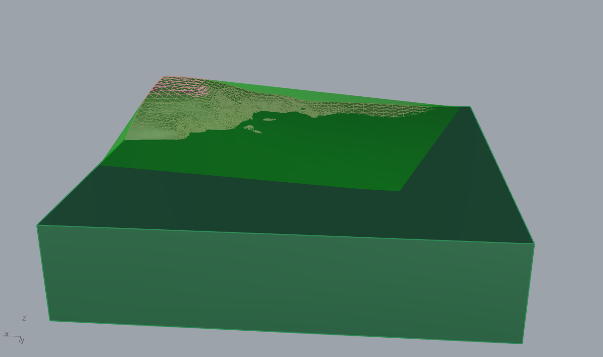

### 10.4.1 Screened Poisson reconstruction (original derivation)

Poisson reconstruction (Kazhdan, Bolitho, Hoppe 2006, `[R90]`; screened
variant Kazhdan and Hoppe 2013, `[R91]`) recovers a watertight surface from
oriented points by solving a single global Poisson equation. The insight is
that the oriented point samples are samples of the **gradient** of the model's
indicator function $\chi$, which is 1 inside the solid and 0 outside. The
gradient of a step function is a surface delta carrying the inward normal, so
the point normals $\mathbf{N}$, smeared into a vector field $\vec V$ over an
adaptive octree, approximate $\nabla\chi$. Recovering $\chi$ is then the
variational problem of finding the scalar field whose gradient best matches
$\vec V$:

$$
\min_{\chi}\ \big\lVert \nabla\chi - \vec V \big\rVert^2 ,
$$

whose Euler-Lagrange condition is the Poisson equation

$$
\Delta\chi = \nabla\!\cdot \vec V .
$$

The surface is then the isolevel of $\chi$ at the average value it takes at the
samples. The 2013 **screened** extension adds a positional data term so the
surface is pulled back onto the points, not just made normal-consistent,
turning the energy into

$$
\min_{\chi}\ \big\lVert \nabla\chi - \vec V \big\rVert^2
\;+\;\beta \sum_{p\in P} \big(\chi(p)-\tfrac12\big)^2 ,
$$

with the screening weight $\beta$ tying the isosurface to the samples; this
removes the over-smoothing of the unscreened solve and sharpens detail at no
extra asymptotic cost. The octree depth controls resolution: the implementation
defaults to depth 8, typical range 7 to 9, with samples-per-node defaulting to
1.5 (`ScanReconstructComponent.cs:78-83`). The native call passes depth and
samples-per-node straight to PoissonRecon (`ReconstructionNative.cs:85-92`,
`:236`).

### 10.4.2 Numeric conditioning and crash isolation

Two repository deltas wrap the native call. First, **recentering**: before
reconstruction the cloud is translated to its centroid so the Delaunay and
alpha predicates evaluate near the origin, recovering mantissa digits at quarry
and UTM scale; normals are directions and are not translated; the centroid is
added back to the output vertices (`ScanReconstructComponent.cs:250-256`,
`:319-320`). This is the V3 numeric-hygiene rule applied at the reconstruction
boundary, and it is Rhino-free (`GeometryNumerics` is in Core).

Second, **out-of-process isolation**. `OutOfProcessReconstructor` writes the
cloud to a temp file, launches `frahan_recon_worker.exe` with the native shim
DLLs alongside it, and reads back a length-prefixed binary result guarded by a
`'FREC'` magic word (`OutOfProcessReconstructor.cs:22`, `:122-171`). A native
abort kills only the worker; the host detects it from the missing output magic
or a non-zero exit code and surfaces a clean managed error,
"the reconstruction backend faulted; Rhino is unaffected"
(`OutOfProcessReconstructor.cs:75-80`). If the worker exe is not deployed, it
falls back to the in-process (still FP-guarded) path with a note
(`OutOfProcessReconstructor.cs:43-49`). The component runs all this on a
background thread behind a default-false `Run` gate, so opening a definition
never triggers a reconstruction and the canvas never freezes
(`ScanReconstructComponent.cs:25-30`, `:97-100`). Finally the raw soup is
cleaned: the largest edge-connected component is kept and dangling alpha-shape
facets dropped (`ScanReconstructComponent.cs:318-322`).

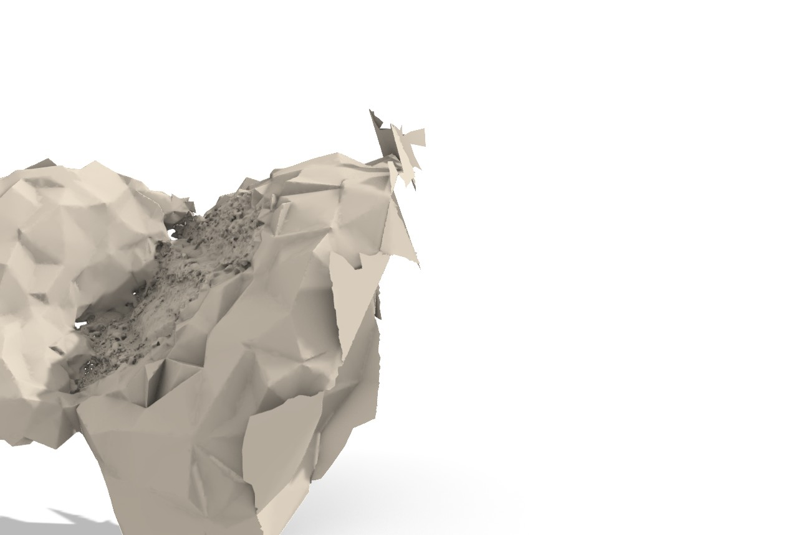

> **Originality.** Scan Reconstruct and `ReconstructionNative` are
> **wrapper-of-native** over **vendored-library** backends: CGAL (alpha-shape,
> advancing-front, CGAL Poisson; GPL) and Geogram-bundled Kazhdan PoissonRecon
> (MIT, BSD-clean). The repository contributions are the recenter conditioning,
> the out-of-process crash isolation, the binary IPC, the async Run-gated
> wrapper, and the soup cleanup, none an algorithm. The `[Algorithm]`
> attributes cite Edelsbrunner-Mucke 1994, Kazhdan-Hoppe 2013, and
> Cohen-Steiner-Da 2004 correctly (`ScanReconstructComponent.cs:32-37`).

---

## 10.5 The managed fallbacks

When no native DLL is present, two managed kernels keep the plugin working.

**MeshCsg** is a pure-managed BSP-tree CSG: build a binary space partition per
input mesh, then implement Union, Intersection, and Difference as De Morgan
sequences of `ClipTo` and `Invert` on the two trees
(`MeshCsg.cs:8-40`). It is the silent fallback under `CgalMeshBoolean` when the
shim is absent (`CgalMeshBoolean.cs:150-153`, `:226-236`). It is a **port of
Evan Wallace's csg.js (MIT)** and the header says so (`MeshCsg.cs:9-10`). That
is a **direct-port** under a permissive licence and owes a THIRD_PARTY_NOTICES
attribution row, but no copyleft.

**MeshRepair / Frahan Mesh Repair** (GUID `AB12C00A-...`,
`MeshRepairComponent.cs:37`) is the Rhino-side weld / cull-degenerate /
heal-naked-edges / unify-normals pipeline, cited to the standard PMP reference
(Botsch et al. 2010, `[R81]`; `MeshRepairComponent.cs:19`). **Mesh
Diagnostics** (GUID `AB12C005-...`) is a read-only inspector over the same
reference (`MeshDiagnosticsComponent.cs:18`). Sanitize Mesh and Close Holes
front the CGAL and Geogram repair paths with a Geogram repair fallback
(`MeshSanitizeComponents.cs:61-63`).

> **Originality.** `MeshCsg` is **direct-port** (csg.js, MIT,
> `MeshCsg.cs:9-10`). `MeshRepairComponent` and `MeshDiagnosticsComponent` are
> **facade-over-primitives** composing RhinoCommon mesh operations behind a
> cited recipe (Botsch et al. 2010); they add no new algorithm, only the
> orchestration and the diagnostic readout (`MeshRepairComponent.cs:19`,
> `MeshDiagnosticsComponent.cs:18`).

---

## 10.6 Licensing posture (the load-bearing decision)

The whole-chapter mitigation is architectural: the default install ships no
native DLL and links no GPL, AGPL, or non-commercial code (originality matrix,
licensing register, flags E3/E5/E6). CGAL's PMP, simplification,
reconstruction, straight-skeleton, and partition packages are **GPL** and
depend transitively on GMP; they are reached only through the optional
`frahan_cgal` shim, with the managed BSP CSG (csg.js, MIT) as the in-tree
fallback. Geogram is **BSD-3** and stays clean, but its TetGen path (needed for
volumetric Voronoi blocks) is **AGPL** and is OFF by default
(`-DFRAHAN_WITH_TETGEN=OFF`; `GeogramMesh.cs:354-361`). The Kazhdan PoissonRecon
bundled in Geogram is **MIT** and stays in the default path with attribution.
A commercial release would buy the CGAL commercial packages or stay on the
Geogram and managed paths only.

---

## 10.7 Status & what's left

- **No native DLL in the default install.** Every CGAL and Geogram operation in
  this chapter is unavailable until the user builds `frahan_cgal` /
  `frahan_geogram` from `native/`. The default experience is the managed BSP
  CSG plus the Rhino-side repair only. This is the licence mitigation, not a
  defect, but it is the single biggest gap between the documented capability and
  the out-of-box behaviour (`AGENTS.md:19`, `CgalGeometry.cs:23-28`). Severity:
  high.
- **CGAL/geogram components live on the `Lab` subcategory, not `Mesh`.** The
  native shim wrappers (Mesh CSG (CGAL), Decimate (CGAL/Geogram), Segmentation,
  Skeleton, Remesh, Tetrahedralize) are filed under `Frahan > Lab`, while
  Repair, Diagnostics, Sanitize, Close Holes, and Scan Reconstruct are on
  `Mesh` (`CgalTestComponents.cs:133`, `MeshRepairComponent.cs:33`). The tab
  split is a UX inconsistency, not a code fault. Severity: low.
- **TetGen AGPL gate.** Volumetric Voronoi blocks (`VoronoiBlocks`) and
  tetrahedralisation throw with a clear message when the shim is built BSD-clean
  (`GeogramMesh.cs:354-361`, `:526-540`). The volumetric-block pipeline is
  documented but unavailable in the default build. Severity: medium.
- **THIRD_PARTY_NOTICES owed.** The csg.js port (`MeshCsg.cs:9-10`), Geogram,
  and the bundled Kazhdan PoissonRecon all require attribution rows; no
  `THIRD_PARTY_NOTICES.md` was at repo root at audit time (licensing register,
  flag 10). Severity: medium (provenance, not copyleft).
- **Figures are borrowed.** This chapter's renders come from example 04
  (Poisson bench), example 07 (scan-to-mesh), and example 15 (clean remesh);
  there is no dedicated CGAL-segmentation or straight-skeleton example render.
  Severity: low (documentation gap).
- **No managed fallback for OBB / skeleton / partition / segmentation.** These
  are CGAL-only and throw when the shim is absent, by design
  (`CgalGeometry.cs:14-16`). A user without the shim cannot segment or skeleton
  a mesh at all. Severity: medium.

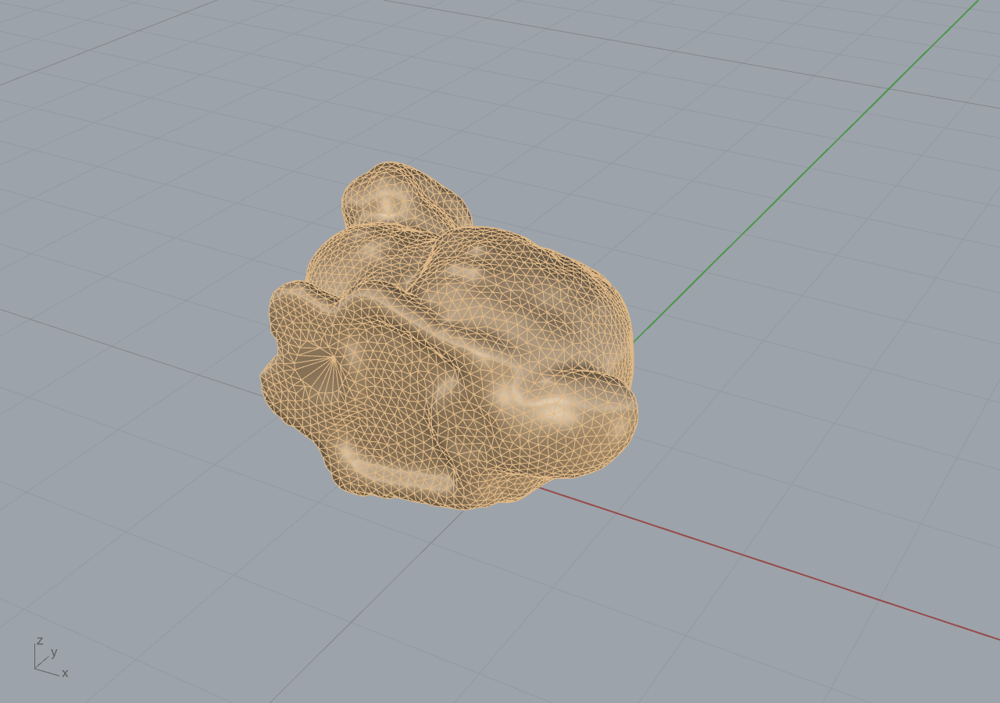

---

## References (this chapter)

- Botsch, M., Kobbelt, L., Pauly, M., Alliez, P., Levy, B. (2010). Polygon mesh
  processing. AK Peters / CRC Press. ISBN 978-1568814261. [R81]
- Lloyd, S.P. (1982). Least squares quantization in PCM. IEEE Transactions on
  Information Theory 28(2):129-137. DOI 10.1109/TIT.1982.1056489. [R87]
- Edelsbrunner, H., Mucke, E.P. (1994). Three-dimensional alpha shapes. ACM
  Transactions on Graphics 13(1):43-72. DOI 10.1145/174462.156635. [R88]
- Kazhdan, M., Bolitho, M., Hoppe, H. (2006). Poisson surface reconstruction.
  Eurographics Symposium on Geometry Processing, pp 61-70. [R90]
- Kazhdan, M., Hoppe, H. (2013). Screened Poisson surface reconstruction. ACM
  Transactions on Graphics 32(3):29:1-29:13. DOI 10.1145/2487228.2487237. [R91]
- Cohen-Steiner, D., Alliez, P., Desbrun, M. (2004). Variational shape
  approximation. ACM Transactions on Graphics (SIGGRAPH 2004) 23(3):905-914.
  DOI 10.1145/1015706.1015817. [R92]
- Crane, K., Weischedel, C., Wardetzky, M. (2013). Geodesics in heat: a new
  approach to computing distance based on heat flow. ACM Transactions on
  Graphics 32(5):152. DOI 10.1145/2516971.2516977. [R95]
- Aichholzer, O., Aurenhammer, F. (1996). Straight skeletons for general
  polygonal figures in the plane. COCOON 1996, LNCS 1090, pp 117-126. [R96]
- Lindstrom, P., Turk, G. (1998). Fast and memory efficient polygonal
  simplification (quadric edge-collapse). IEEE Visualization '98, pp 279-286.
  [R97]
- Shapira, L., Shamir, A., Cohen-Or, D. (2008). Consistent mesh partitioning
  and skeletonisation using the shape diameter function. The Visual Computer
  24(4):249-259. DOI 10.1007/s00371-007-0197-5. [R98]
- Levy, B. (INRIA/ALICE). Geogram: a programming library of geometric
  algorithms (v1.9.9). BSD-3. https://github.com/BrunoLevy/geogram. [R124]
- Wallace, E. csg.js (MIT). Constructive solid geometry via BSP trees. Ported
  as the managed `MeshCsg` boolean fallback.

---

# 11. Fabrication, Sculpting & Carving

This chapter covers the machine-handoff end of the repository: the
`Fabricate` ribbon tab (11 components) and the `Sculpt` ribbon tab (3
components). Where the earlier chapters turn rock into a valid cut or pack
plan, this chapter turns that plan into something a saw, a mill, or a
six-axis robot can run, and turns a scanned maquette into a carving schedule.
The subsystem is deliberately thin. Frahan's stated position is a pre-CAM
fabrication-readiness bridge, not a CAM system (`docs/thesis/00_overview.md`),
so the contribution here is parsing, frame construction, metadata carriage,
and a small amount of original scheduling math, not a toolpath optimiser.

Provenance in one line: the G-code path is **clean-room** parsing of a
published standard; the robot adapters are **thin facades** over third-party
plugins (KUKAprc, visose/Robots) that emit metadata and stop; the staggered
"Fabricate" flagship is a **facade** composing an in-repo layout primitive
with the CGAL boolean back end; the carving-stage and pointing-machine math
is **clean-room** original; and the georeferenced last-mile reuses the
**clean-room** geodesy and the Horn absolute-orientation kernel from Chapter
8. Every claim is anchored to a `file:line`, an `[Algorithm]` attribute, or a
worked example.

The Core types are pure-managed and Rhino-free
(`src/Frahan.StonePack.Core/Fabrication`, `…/Sculpt`); the Rhino dependency
lives only in the Grasshopper wrappers
(`src/Frahan.StonePack.GH/Fabrication`, `…/Sculpt`).

---

## 11.1 The G-code ingest path (clean-room parsing)

### 11.1.1 The modal state machine

A CAM post-processor emits ISO 6983-1 G-code (ISO 6983-1:2009): a line-by-line
program where motion words (`G00`/`G01`/`G02`/`G03`), coordinate words
(`X Y Z`, arc offsets `I J K`), and modal settings (`G20`/`G21` units,
`G90`/`G91` positioning, `F` feed, `S` spindle) accumulate state. The defining
property is **modality**: a line without a motion word inherits the previous
motion mode, and a bare `X Y Z` triple implies the last motion (the RhinoCAM
convention). `GCodeParserComponent` (GUID `D5F10030`, `Frahan > Fabricate >
G-code Parser`) implements exactly this as a single-pass tokenizer feeding a
modal state machine (`GCodeParserComponent.cs:169-266`).

Formally, the parser carries a state
$\sigma = (\mathbf{p},\ \text{mode},\ f,\ s,\ \text{abs},\ \text{mm})$ where
$\mathbf{p}$ is the current tool position. For each non-comment line $\ell$
with parsed words $W(\ell)$, the position update is the absolute/incremental
branch

$$
\mathbf{p}' =
\begin{cases}
(x \,\text{?}\, p_x,\ y \,\text{?}\, p_y,\ z \,\text{?}\, p_z) & \text{if absolute (G90)},\\[2pt]
\mathbf{p} + (x_\Delta,\ y_\Delta,\ z_\Delta) & \text{if incremental (G91)},
\end{cases}
$$

with `?` denoting "use the word if present, else hold the prior component"
(`GCodeParserComponent.cs:233-235`). A `CutSegment` is emitted only when a
line carries motion, and its `Start` is the prior $\mathbf{p}$ so segments
chain without gaps (`:226-265`). For an arc the centre is reconstructed from
the start point and the `I J K` offsets, the RhinoCAM-relative convention,

$$
\mathbf{c} = \mathbf{p} + (I,\ J,\ K),
$$

(`:257-261`). The parser is lossless on the supported subset and records every
unknown code as a warning rather than failing
(`:296-303`); `G91` incremental positioning is parsed but flagged, since v1
solves only the `G90` case it has fixtures for.

> **Originality.** **clean-room.** The `[Algorithm]` attribute names it an
> "ISO 6983-1 G-code tokenizer + modal state machine" credited to the
> ISO 6983-1:2009 standard and the observed RhinoCAM/VisualMill dialect, with
> the explicit note that the subset matches the MRAC IAAC 2023 workshop
> fixtures (`GCodeParserComponent.cs:53-58`). No upstream parser source is in
> the tree; the tokenizer is a single regex word-matcher (`:333-349`) and the
> state machine is the switch above. There is no copyleft exposure: the
> component reads a text file with `System.Text.RegularExpressions`.

### 11.1.2 G-code to tool-axis planes

`GCodeToPlanesComponent` (GUID `D5F10031`) translates the parsed `CutPath`
into the `Plane[]` representation that both downstream robot ecosystems
consume. The construction is a milling-frame convention: at each sample the
plane origin is the cut point, the plane $Z$-axis is the user tool axis
$\hat{\mathbf{a}}$ (default $-\hat{\mathbf{z}}$, downward milling), and the
plane $X$-axis is the segment direction **projected** perpendicular to the
tool axis,

$$
\hat{\mathbf{x}} = \operatorname{normalise}\bigl(\mathbf{d} - (\mathbf{d}\cdot\hat{\mathbf{a}})\,\hat{\mathbf{a}}\bigr),
\qquad
\hat{\mathbf{y}} = \hat{\mathbf{a}}\times\hat{\mathbf{x}},
$$

with a world-$X$ fallback when the segment runs parallel to the tool axis
(`GCodeToPlanesComponent.cs:197-211`). This Gram-Schmidt projection is the
load-bearing step: it guarantees an orthonormal right-handed frame whose
$Z$-axis is exactly the requested tool axis, regardless of how the cut
direction wanders, so the emitted target never tilts the spindle.

Arcs are discretised at an `Arc Step` chord length. The signed sweep is the
angle from start to end about the reconstructed centre, normalised by the
`G02`/`G03` direction so a full circle (start == end) sweeps a full turn
rather than zero,

$$
\Delta\phi =
\begin{cases}
\angle_{a_0\to a_1}\ \text{wrapped to } (-2\pi, 0] & \text{(G02, CW)},\\
\angle_{a_0\to a_1}\ \text{wrapped to } [0, 2\pi) & \text{(G03, CCW)},
\end{cases}
\qquad
N = \max\!\Bigl(1,\ \bigl\lceil \tfrac{|\Delta\phi|\,r}{\text{ArcStep}} \bigr\rceil\Bigr),
$$

(`:240-255`). Each sample interpolates $z$ linearly between the segment
endpoints (helix support) and sets the plane $X$-axis to the arc tangent,
signed by the sweep direction (`:262-270`). The chord error is bounded by
$\text{ArcStep}/2$, the tolerance the `[DesignApplication]` attribute claims
(`:49`).

> **Originality.** **clean-room.** Two `[Algorithm]` attributes name the
> tool-axis frame construction ("standard milling-frame convention, tool axis
> = $-Z$ by default") and the chord-step arc discretisation, both Frahan-
> original glue, with the note that CGAL arc primitives are deliberately
> **not** used (`GCodeToPlanesComponent.cs:39-44`). The math is elementary
> plane geometry; the contribution is the bridge shape, not an algorithm.

### 11.1.3 The robot adapters (thin facades, not toolpath generators)

`PlanesToKukaPrcCommandsComponent` (GUID `D5F10032`) and
`PlanesToRobotTargetsComponent` (GUID `D5F10033`) are the deliberate
honesty boundary of this subsystem. Each tags a `Plane[]` with the motion
metadata its target ecosystem expects and **stops**: it does not generate KRL
or simulate kinematics. The motion map is the only logic,

$$
\text{Rapid (G00)} \mapsto
\begin{cases}
\texttt{PTP} & \text{(KUKAprc)}\\
\texttt{Joint} & \text{(visose/Robots)}
\end{cases}
\qquad
\text{Linear/Arc} \mapsto
\begin{cases}
\texttt{LIN}\\
\texttt{Linear}
\end{cases}
$$

resolved per-plane by looking the source `CutSegment.Kind` up through the
segment-index list, defaulting all moves to the linear type with a warning
when the `CutPath` is not wired
(`PlanesToKukaPrcCommandsComponent.cs:152-182`;
`PlanesToRobotTargetsComponent.cs:155-179`). The Robots adapter additionally
converts feed units to that plugin's convention, $\text{mm/s} =
\text{mm/min} / 60$, and widens the blending zone on rapid approaches
(`PlanesToRobotTargetsComponent.cs:170-177`).

The market rationale is recorded in the headers: KUKAprc's `Generic NC Import`
is a paid-tier feature, and visose/Robots has no native G-code ingest at all,
so the `GCodeParser` plus these wrappers is the first free open-source path
from a CAM `.nc` file into either ecosystem
(`PlanesToKukaPrcCommandsComponent.cs:28-31`;
`PlanesToRobotTargetsComponent.cs:19-23`).

> **Originality.** **facade-over-primitives / wrapper.** Both are thin
> wrappers credited to KUKAprc (Brell-Cokcan and Braumann) and visose/Robots
> (Soler, MIT v1.9.0); the only original logic is the `CutSegmentKind` to
> motion mapping, named Frahan-original in the `[Algorithm]` attributes
> (`PlanesToKukaPrcCommandsComponent.cs:40-42`;
> `PlanesToRobotTargetsComponent.cs:40-42`). Neither links `Robots.dll`
> (`PlanesToRobotTargetsComponent.cs:30-37`), so there is no licence ingress.

---

## 11.2 The wire-saw toolpath adapter (bottom-up flagship)

`WireSawToolpathAdapterComponent` (GUID `D5F10034`) generates a `Plane[]`
toolpath for a robot-mounted diamond-wire saw cutting along a designed curve.
The v1 algorithm samples $N$ frames along the cut curve: at parameter $t$ the
origin is the curve point, the $Z$-axis is the user wire-tension axis
$\hat{\mathbf{w}}$, and the $X$-axis is the curve tangent projected
perpendicular to the wire,

$$
\hat{\mathbf{x}}(t) = \operatorname{normalise}\bigl(\mathbf{T}(t) - (\mathbf{T}(t)\cdot\hat{\mathbf{w}})\,\hat{\mathbf{w}}\bigr),
$$

the same Gram-Schmidt frame as the milling case but with the wire axis taking
the role of the tool axis (`WireSawToolpathAdapterComponent.cs:200-218`).

### Original derivation: kerf compensation

A diamond wire removes a finite-width channel. If the wire traces the design
curve, the finished cut surface sits half a kerf inside the intended boundary
on each side. To make the **finished** surface match design intent, the
adapter offsets the cut curve outward by half the kerf width before sampling,

$$
C_{\text{comp}} = \operatorname{offset}\!\bigl(C,\ +\tfrac{1}{2}\,w_{\text{kerf}}\bigr),
$$

in the curve's own plane, falling back to no compensation with a warning on a
non-planar curve (`:174-192`). The half-kerf magnitude is taken from the
closest published precedent: Zhang et al. (2024) report a kerf compensation
$\Delta = 1.75\ \text{mm}$ for a brazed-diamond wire on a six-axis robot that
carved a Stanford Bunny in marble at 2.30x the speed of grinding; the
component cites this verbatim and defaults to a $4\ \text{mm}$ mid-range kerf
(`:54-56`, `:101-104`, `:225-227`). Diamond-wire kerf (3 to 8 mm) is markedly
tighter than blade-saw kerf (10 to 15 mm), which is why the compensation
matters at sculpture scale.

> **Originality.** **clean-room glue over a cited precedent.** Three
> `[Algorithm]` attributes carry the provenance: Zhang et al. (2024,
> J. Computational Design and Engineering 11(6), DOI 10.1093/jcde/qwae094) and
> Moult, Weir and Fernando (2018, University of Sydney) as the robot-mounted
> diamond-wire precedents, and the kerf-compensated curve offset as
> Frahan-original glue over classical RhinoCommon `Curve.Offset`
> (`WireSawToolpathAdapterComponent.cs:54-62`). The header is careful about
> the honesty boundary: Quarra used a **stationary** rented quarry wire saw,
> not an end-effector; Gramazio Kohler "Spatial Wire Cutting" is hot-wire on
> foam, not diamond-wire on stone; and neither published precedent ships a
> KUKAprc/Robots integration, so this is the first GH bridge for the workflow
> (`:31-35`). The robot-mounted diamond-wire workflow itself is research-grade,
> stated plainly in the remarks (`:233-236`). The distinct robot-diamond-wire
> Zhang (2024) must not be conflated with the block-cutting MATLAB toolbox of
> Zhang et al. (2024) cited elsewhere in the references; they are different
> works.

---

## 11.3 The staggered-masonry "Fabricate" flagship

The flagship niche is the inverse of masonry assembly: take a sculpted,
freeform stone form and split it into staggered, running-bond-like blocks,
each sized to be cut by wire saw and finished by robotic milling
(`StaggeredBlockLayout.cs:7-24`). `StaggeredBlockDecomposeComponent` (GUID
`F2D07A02`) lays the cells out over the form's bounding box and emits them as
boxes plus box-meshes plus a per-cell course index (ascending = build order).

### The running-bond cell layout

The Core layout (`StaggeredBlockLayout.Build`) tiles the box
$[\mathbf{lo},\mathbf{hi}]$ in three axis roles chosen automatically: the
**up** axis (course stacking, default $Z$), the **bond** axis (the larger of
the two remaining axes), and the **depth** axis spanning a single wythe
(`StaggeredBlockLayout.cs:62-67`). Course $c$ occupies the up-axis band
$[u_0,u_1]$ at height $h_c$, and within it the bond axis is tiled at block
length $L_b$ with the odd-course **half-block stagger** that breaks the
joints,

$$
n_{\text{courses}} = \Bigl\lceil \tfrac{u_{\text{hi}} - u_{\text{lo}}}{h_c} \Bigr\rceil,
\qquad
\text{offset}_c =
\begin{cases}
s\,L_b & c \text{ odd},\\
0 & c \text{ even},
\end{cases}
\qquad s\in[0,1],
$$

with $s = 0.5$ the running-bond default (`:74-86`). Each cell is clamped to
the box so the boundary courses are not over-tiled
($cx_0 = \max(b_{\text{lo}}, x)$, $cx_1 = \min(b_{\text{hi}}, x + L_b)$,
`:88-90`). The header is explicit that this is **not** the infinite-plane
`BrickPattern` generator: that emits planes whose single cut pass yields a
regular grid, whereas this class produces explicit per-course cells with the
stagger already applied, the per-course post-processing that turns a grid into
a true running bond (`:13-21`).

The component deliberately does not fan out $N$ RhinoCommon mesh booleans, the
documented HITL failure mode on large slabs. To get form-fitted blocks the
user pipes the cell meshes into the CGAL/geogram back end (`Quarry Decompose
By Mesh (CGAL)` or `Mesh CSG (CGAL)`), which scales to many cuts
(`StaggeredBlockDecomposeComponent.cs:22-26`, `:42-44`). This is the
"compose, don't duplicate" rule (Chapter 14): the cell layout is the new
contribution, the cutting is an existing primitive.

> **Originality.** **facade-over-primitives.** The cell layout is named
> Frahan-original in the `[Algorithm]` attribute, with the honest note that
> running bond is a masonry convention, not a citable algorithm
> (`StaggeredBlockDecomposeComponent.cs:33-34`). The component composes the
> pure-managed `StaggeredBlockLayout` with the CGAL boolean back end it
> routes to; it adds orchestration, not a new algorithm. Two downstream
> consumers complete the flagship: `FabricationPrepReportComponent` (below)
> for handling, and the `StoneCutExport` metadata carriage (11.4).

---

## 11.4 Stone-aware cut export and fabrication-prep handling

### Carrying stone intelligence through the CAM handoff

CAM packages (EasySTONE, Alphacam, Breton Maestro, Lantek) consume `.3dm` and
DXF geometry, but they receive it as dumb shapes; the bed and grain direction,
the fracture/GPR avoidance zones, the quarry-block provenance, the weight, the
finish and the kerf are lost at the handoff and re-keyed by hand on the shop
floor. `StoneCutMetadata` is the payload that survives the handoff: a
namespaced set of object user-strings (`frahan.piece_id`, `frahan.stone`,
`frahan.bed_dir`, `frahan.kerf_mm`, …) stamped with a schema tag
`frahan-cut-1.0` so a CAM round-trip cannot silently clobber it
(`StoneCutMetadata.cs:42-75`). `StoneCutExportComponent` (GUID `F2D07A01`)
writes one `.3dm` layer per cut piece with that metadata attached, gated
behind a default-false `Write` toggle, the same side-effect discipline as the
async `Run` gates elsewhere (`StoneCutExportComponent.cs:28-30`, `:107-163`).

> **Originality.** **clean-room glue.** The metadata schema and the layer
> scheme are Frahan-original conventions; the writer is RhinoCommon
> `File3dm` plus `SetUserString`. There is no algorithm here, only a
> structured carriage contract, which is the point: the wedge is owning the
> upstream intelligence and refusing to drop it at the machine boundary
> (`StoneCutMetadata.cs:10-22`).

### Weight and lift class from the cut

`FabricationReport` turns block geometry into shop-floor handling facts. The
weight is volume times density, and the lift class follows from a fixed
threshold ladder (`FabricationReport.cs:30-40`),

$$
W = \rho\,V,
\qquad
\text{class}(W) =
\begin{cases}
\text{Hand} & W < 25\ \text{kg},\\
\text{Two-person} & 25 \le W < 50,\\
\text{Mechanical} & 50 \le W < 2000,\\
\text{Crane} & W \ge 2000,
\end{cases}
$$

with a granite default $\rho = 2700\ \text{kg/m}^3$. `FabricationPrepReport`
(GUID `F2D07A04`) computes per-block volume and centroid through RhinoCommon
`VolumeMassProperties`, warns when a block is not closed (volume unreliable),
and reports the per-class histogram so the crate and hoist plan follows from
the cut (`FabricationPrepReportComponent.cs:83-112`). The model-units-are-
metres assumption is stated, since the same volume number is metres-cubed
only under that convention.

> **Originality.** **clean-room.** Elementary mass-properties arithmetic over
> a RhinoCommon volume; the lift ladder is a handling convention, and the
> contribution is closing the fabrication-prep market gap, not an algorithm
> (`FabricationReport.cs:6-11`).

---

## 11.5 The digital pointing machine (Sculpt tab)

The classical pointing machine is the sculptor's tool for transferring and
**scaling** a maquette to a full-size carving by measuring a few reference
points and reproducing depths. The `Sculpt` tab is its digital equivalent in
three nodes: enlarge a scanned maquette, verify it fits an available block,
and schedule the roughing passes.

### 11.5.1 Enlargement (affine scale from the base)

`EnlargeSculptureComponent` (GUID `F2D06A01`) scales a scanned maquette to a
target size in four modes. The per-axis factors are pure arithmetic on the
current bounding size $(s_x,s_y,s_z)$ (`SculptureFitter.EnlargeFactors`,
`SculptureFitter.cs:47-81`),

$$
\mathbf{f} =
\begin{cases}
(v,v,v) & \text{Factor},\\
(v/\ell, v/\ell, v/\ell),\ \ell=\max(s_x,s_y,s_z) & \text{TargetLongest},\\
(v/s_z, v/s_z, v/s_z) & \text{TargetHeight},\\
(t_x/s_x,\ t_y/s_y,\ t_z/s_z) & \text{NonUniformXyz}.
\end{cases}
$$

The GH wrapper applies the scale about an anchor that defaults to the **base
centre** (bbox centre in $X,Y$ at minimum $Z$), so a plinth stays grounded as
the piece grows, and warns when a non-uniform scale changes proportions
(`EnlargeSculptureComponent.cs:98-125`).

### 11.5.2 Does it fit the block?

`FitInBlockComponent` (GUID `F2D06A02`) answers whether a raw block holds an
enlarged sculpture, allowing a margin for kerf, roughing allowance and
handling. The test sorts both extent triples descending (largest axis to
largest axis, the best box-aligned orientation), subtracts a two-sided margin
from the block, and reports per-axis slack plus the largest uniform scale that
would still fit (`SculptureFitter.FitsInBlock`, `SculptureFitter.cs:91-114`),

$$
a_i = b_{(i)} - 2m,
\qquad
\text{clearance}_i = a_i - s_{(i)},
\qquad
\text{fits} \iff \min_i \text{clearance}_i \ge 0,
\qquad
\sigma_{\max} = \min_i \frac{a_i}{s_{(i)}},
$$

where $b_{(i)}, s_{(i)}$ are the sorted block and sculpture extents. The
max-scale-to-fit $\sigma_{\max}$ is the binding ratio across axes; $\sigma_{\max}\ge1$
means the piece already fits. v1 is axis-aligned; an OBB-exact orientation
search is a stated later refinement (`FitInBlockComponent.cs:18-21`).

> **Originality.** **clean-room.** Both nodes are pure affine arithmetic with
> `[Algorithm]` attributes naming them Frahan-original "digital pointing-
> machine tradition; affine scale, not a published algorithm" and "axis-
> aligned bounding extents matched largest-to-largest"
> (`EnlargeSculptureComponent.cs:25-26`; `FitInBlockComponent.cs:28-29`). The
> Core math is in `SculptureFitter`, runtime-agnostic and unit-tested in
> isolation from Rhino.

### 11.5.3 Carving stages: the roughing schedule (original derivation)

A carver removes stock in steady passes, not one cut. The digital equivalent
is a stack of offset shells from the rough block down to the finished surface.
`CarvingStages.OffsetSchedule` is the pure schedule: $K$ outward offsets
stepping linearly from a coarse `maxOffset` (stage 0, roughest) down to a
`finishAllowance` (last stage, the finish surface),

$$
d_k = d_{\max} + \frac{k}{K-1}\,\bigl(d_{\text{finish}} - d_{\max}\bigr),
\qquad k = 0,\dots,K-1,
$$

so $d_0 = d_{\max}$ and $d_{K-1} = d_{\text{finish}}$, with the single-stage
case collapsing to the finish allowance (`CarvingStages.cs:25-39`). This is a
linear interpolation in offset distance, the simplest monotone roughing ladder
that leaves a controlled finish skin.

`CarvingStagesComponent` (GUID `F2D06A03`) realises each shell as a per-vertex
offset of the target mesh. Three modes select the offset direction: **Radial**
(along smoothed surface normals), **Push-In** (along a front direction), and
**Flat-Top** (push each vertex up to the bounding-box face, best for reliefs).
A `Block` input clamps each stage to an arbitrary scanned block by casting a
per-vertex ray against an `RTree` of the block faces, so the reach is the
distance to the real block surface rather than an AABB
(`CarvingStagesComponent.cs:186-205`, `RayBlockReach` `:279-293`). For the
block/flat-top modes the stage shell at fraction
$\mathrm{frac}_s = 1 - s/(K-1)$ moves each vertex
$\mathbf{v}_v \mapsto \mathbf{v}_v + \mathrm{frac}_s\,r_v\,\hat{\mathbf{d}}_v$
along its reach $r_v$ (`:206-218`), so stage 0 sits at the block and the final
stage at the target.

**Original derivation: the fold-fix.** A naive per-vertex normal offset folds
onto itself at sharp edges and thin rims, producing spikes on reliefs. The
component applies two corrections from the 2026-05-30 "v2" work, kept after
the synchronous restore. First, the offset uses **Laplacian-smoothed normals**
$\tilde{\mathbf{n}}_v$, averaged over topology neighbours for a fixed iteration
count (`SmoothNormals`, `:342-374`). Second, each offset is **capped** at half
the shortest edge incident on the vertex,

$$
d_v \le c_v = \tfrac{1}{2}\,\min_{u\in\mathcal{N}(v)} \lVert \mathbf{v}_u - \mathbf{v}_v\rVert,
$$

(`LocalOffsetCaps`, `:378-403`, applied `:236`, `:243`), which guarantees no
vertex crosses its nearest neighbour, the geometric condition for a non-folding
offset. A protrusion weight boosts stock at the strongest protrusions
(ears, noses) by $d_v(1 + \text{boost}\cdot w_v)$ where $w_v$ is the normalised
outward displacement of a vertex from its neighbour centroid (`ProtrusionWeights`,
`:314-339`).

**The scheduling discipline (synchronous + cached, decimate-first).** The
component was restored to a synchronous, input-cached, `Run`-gated design after
a v2 rewrite dropped the cache and reordered the inputs: every canvas edit then
recomputed, and on a 2.2-million-vertex scan that is roughly 11 seconds per
change, a frozen canvas (`:18-23`). The fix is **caching, not threading**: the
component recomputes only when a proxy hash of its own inputs changes (counts,
bounding box, parameters), and on any other canvas solution (picking a List
Item index, editing an unrelated node) it re-emits the cached stage meshes
without recomputing (`:119-152`, `BuildHash` `:260-275`). An always-on
background re-solve would recompute every pass, exactly what is being avoided
(`:38-41`). Input order matches files saved under the proven commit so old
canvases re-wire correctly, and the input order must not be changed again.
Preview is off by design: redrawing all $K$ dense shells every viewport
refresh is what bogged the canvas, so the intermediate shells are picked
downstream with a List Item (`:42-45`). The companion rule is **decimate
first**: never internalise a multi-million-vertex scan in a saved `.gh`
(autosave crash, KB-1), and reduce a raw scan to roughly 150k vertices before
carving (`examples/05_artist_pointing_machine/README.md`).

> **Originality.** **clean-room.** The `[Algorithm]` attribute names it
> "Staged offset-shell roughing", Frahan-original, with the honest note that
> it is pure per-vertex offset math, $O(\text{vertices}\times\text{stages})$,
> and that no published roughing-strategy paper is implemented
> (`CarvingStagesComponent.cs:53-54`). The Core schedule is the linear ladder
> above; the GH fold-fix (smoothed normals + neighbour cap) is the small
> clean-room delta that makes it usable on real scans.

---

## 11.6 The georeferenced last-mile (physical marking)

The marble cost study (Chapter 3, example 08) leaves a gap: the optimiser
produces oblique, bed-following cutting planes that recover more value than
flat guillotine cuts, but realising them needs the cut planes marked on the
**physical** block in the correct place. The last-mile is georeferencing: tie
the scan frame to surveyed world control points so a cut plane computed in the
model lands on the real stone.

`GeoreferenceMath` is the pure-managed geodesy that places a scan in a metric
world frame. It carries the WGS84 ellipsoid, the closed-form Bowring (1976)
LLH-to-ECEF transform and its non-iterative inverse, the ECEF-to-ENU rigid
rotation about a chosen origin, and the Karney (2011) transverse-Mercator UTM
series truncated to order six (`GeoreferenceMath.cs:62-105`, `:113-159`,
`:169-283`). The east-north-up rotation about an origin at latitude
$\varphi_0$, longitude $\lambda_0$ is the standard

$$
\begin{bmatrix} e\\ n\\ u \end{bmatrix} =
\begin{bmatrix}
-\sin\lambda_0 & \cos\lambda_0 & 0\\
-\sin\varphi_0\cos\lambda_0 & -\sin\varphi_0\sin\lambda_0 & \cos\varphi_0\\
\cos\varphi_0\cos\lambda_0 & \cos\varphi_0\sin\lambda_0 & \sin\varphi_0
\end{bmatrix}
\begin{bmatrix} \Delta x\\ \Delta y\\ \Delta z \end{bmatrix},
$$

(`GeoreferenceMath.cs:130-132`). Working in a metric ENU frame removes the
scale ambiguity, so the rigid solve downstream is well-posed.

The rigid scan-to-world fit is the **three-point (N >= 3) absolute
orientation** the prompt calls for. `GeoreferenceComponent` (GUID
`B1C2D3A4-…`) converts the world control points to ENU about the first
point, then calls `RegistrationApi.SolveFromPoints`, which solves

$$
\min_{R\in SO(3),\,\mathbf{t}}\ \sum_{i=1}^{N} \lVert R\,\mathbf{s}_i + \mathbf{t} - \mathbf{w}_i\rVert^2
$$

in closed form via the Horn (1987) unit-quaternion method
(`RegistrationApi.cs:68-108`; consumed at `GeoreferenceComponent.cs:158`).
The closed-form recipe is the classical one: subtract the centroids
$\bar{\mathbf{s}},\bar{\mathbf{w}}$, build the cross-covariance, extract the
optimal rotation as the eigenvector of the symmetric $4\times4$ quaternion
matrix, and recover the translation
$\mathbf{t} = \bar{\mathbf{w}} - R\,\bar{\mathbf{s}}$. Three non-collinear
pairs are the minimum, exactly the pointing-machine reference-point count. The
component reports the RMS residual and flags any control point whose residual
exceeds five times RMS as a possibly mis-tagged GPS fix
(`GeoreferenceComponent.cs:172-179`), and it returns the ENU origin LLH so a
downstream graph can re-create the identical projection frame
(`:96-102`).

> **Originality.** **clean-room.** The geodesy is a pure-managed
> implementation of published transforms (Bowring 1976, Karney 2011, with
> Snyder 1987 as the working-manual reference), with zero third-party
> dependencies (`GeoreferenceMath.cs:6-27`). The rigid fit reuses the
> `RigidTransformRecovery` Horn (1987) kernel already classed clean-room in
> Chapter 8, here exposed through a Rhino-friendly facade
> (`RegistrationApi.cs:9-29`); the `[Algorithm]` attribute credits Horn 1987
> by DOI (`GeoreferenceComponent.cs:36`). The Horn kernel is one of three
> duplicate absolute-orientation routes in the tree, a noted low-severity
> refactor candidate (Chapter 8).

The georeferenced bed-following recovery is real but its physical-marking
tail is not yet a shipped component. Example 08 measures the value at stake:
on the 6 m marble bench the flat guillotine plan is fabricable today, while
the oblique bed-following plan recovers materially more value but requires the
georeferenced marking step that this section's math enables and that no GH
component yet automates (`examples/08_gpr_marble/README.md`; the cost study is
documented in Chapter 3).


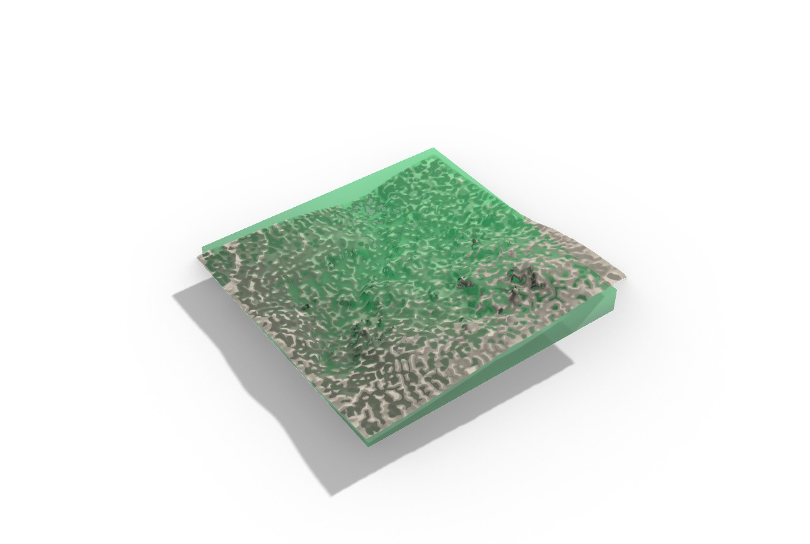

---

## 11.7 Status and what is left

- **Example 05 has no rendered figure.** The artist pointing-machine folder
  ships the carving-stages `.gh` and a light `.3dm`/`.gh` simulation only, no
  PNG and no embeddable render
  (`examples/05_artist_pointing_machine/`). The figures in this chapter borrow
  from the engineer (04), guillotine (24), marble cost (25), and GPR marble
  (08) examples. *Low (documentation gap).*
- **Physical-marking tail not shipped.** The georeferenced math (11.6) closes
  the scan-to-world transform, but no GH component yet turns the oblique
  bed-following cut planes into a georeferenced physical-marking output on the
  real block; example 08 documents the value the last-mile recovers but the
  automation is open. *High (the named last-mile of example 08).*
- **Wire-saw v1 is planar only.** Kerf compensation is skipped on a
  non-planar cut curve (warned), and curved-surface cuts via ruled-surface
  decomposition, variable wire tension, and bidirectional planning are v1.x
  backlog (`WireSawToolpathAdapterComponent.cs:46-52`, `:188-191`). The
  robot-mounted diamond-wire workflow remains research-grade per Zhang 2024
  and Moult 2018. *Medium.*
- **G-code parser subset.** v1 supports `G00/G01/G02/G03/G17/G20/G21/G90` plus
  `F S M N`; `G91` incremental positioning and `G18/G19` non-XY arc planes are
  parsed but flagged, not solved (`GCodeParserComponent.cs:296-303`). Vendor
  extensions are deferred. *Low (graceful warnings, not failures).*
- **Robot adapters depend on third-party plugins.** The KUKAprc command
  components are paid-tier, and the visose/Robots plugin must be installed
  separately (Frahan does not bundle `Robots.dll`); the packaging decision is
  open (`PlanesToRobotTargetsComponent.cs:30-37`). *Low.*
- **Fit-in-block is axis-aligned.** v1 matches sorted extents largest-to-
  largest; a sculpture that fits only in a tilted orientation is reported as
  not fitting. OBB-exact orientation search is deferred
  (`FitInBlockComponent.cs:18-21`). *Low.*
- **Carving Stages input order is load-bearing.** Reordering the inputs breaks
  canvases saved against the proven layout (the v2 regression); the order must
  stay frozen, and heavy scans must be decimated before carving (KB-1/KB-2)
  (`CarvingStagesComponent.cs:18-23`; `examples/05_artist_pointing_machine/README.md`).
  *Medium.*

---

## References (this chapter)

- ISO 6983-1:2009. Automation systems and integration — Numerical control of
  machines — Program format and definitions of address words — Part 1: Data
  format for positioning, line motion and contouring control systems.
  International Organization for Standardization.
- Horn, B.K.P. (1987). Closed-form solution of absolute orientation using unit
  quaternions. Journal of the Optical Society of America A 4(4):629-642. DOI
  10.1364/JOSAA.4.000629. (Reference key [R103].)
- Zhang, Y., Wu, H., Wang, J., et al. (2024). Robotic diamond-wire cutting of
  stone with a six-axis arm and end-effector wire saw. Journal of Computational
  Design and Engineering 11(6):75-85. DOI 10.1093/jcde/qwae094. (Robot-mounted
  diamond-wire precedent; distinct from the block-cutting MATLAB toolbox Zhang
  et al. 2024, reference key [R145].)
- Moult, S., Weir, J., Fernando, S. (2018). Robotic diamond-wire bandsaw
  cutting of stone with a portable end-effector. University of Sydney
  (proceedings reference, cited in source).
- Konstanty, J.S. (2021). The mechanics of sawing granite with diamond wire.
  International Journal of Advanced Manufacturing Technology 116:2591-2597. DOI
  10.1007/s00170-021-07577-3. (Diamond-wire kerf mechanics; reference key
  [R27].)
- Bowring, B.R. (1976). Transformation from spatial to geographical
  coordinates. Survey Review 23(181):323-327. DOI 10.1179/sre.1976.23.181.323.
- Karney, C.F.F. (2011). Transverse Mercator with an accuracy of a few
  nanometres. Journal of Geodesy 85(8):475-485. DOI 10.1007/s00190-011-0445-3.
- Snyder, J.P. (1987). Map Projections: A Working Manual. USGS Professional
  Paper 1395.
- Graham, R.L. (1969). Bounds on multiprocessing timing anomalies. SIAM
  Journal on Applied Mathematics 17(2):416-429. DOI 10.1137/0117039. (Greedy
  list scheduling, cited by the fabrication-prep handling lineage.)
- Braumann, J., Brell-Cokcan, S. KUKA|prc — parametric robot control for
  Grasshopper. Association for Robots in Architecture, Vienna.
  <https://www.robotsinarchitecture.org/kukaprc>
- Soler, V. Robots — a plugin for programming industrial robots in Grasshopper
  (MIT). <https://github.com/visose/Robots>

---

# 12. Data Ingestion & Format Readers

This chapter covers the repository's data-ingestion subsystem: the `Ingest`
ribbon tab (5 components), the `Frahan.Masonry.Quarry.Ingestion` reader family
in the Core assembly, and the `Frahan.Core.ScanIngest` point-cloud readers and
out-of-process workers. The subsystem is the front door of the whole pipeline.
Every downstream chapter (nesting, quarry block-cutting, masonry, surface
packing, edge-matching) consumes geometry that entered the repository through a
reader documented here.

The design goal stated across the source is **max-coverage ingest**: read the
formats a stone-fabrication site actually produces, route each by file
extension to a dedicated reader, and never guess a proprietary binary layout.
The reader set spans vector fracture data (ESRI Shapefile, GeoJSON), terrestrial
LiDAR and photogrammetry point clouds (E57, LAS/LAZ, PLY, XYZ), and
ground-penetrating-radar radargrams (CSV, SEG-Y, MALA RD3, pulseEKKO DT1, IDS
GeoRadar DT, GSSI DZT). Where a format is proprietary with no open spec, the
reader is a deliberate dead-stop that tells the user how to convert, rather than
a silent corruptor of the depth axis.

This chapter is mostly engineering, not new mathematics: a reader's job is to
decode a documented byte layout faithfully. The two places real derivation
appears are the GPR sample-spacing recovery (turning a time axis into a metric
depth axis) and the streaming voxel-downsample (bounding memory by occupied
voxels, not input point count). Where a component merely wraps a third-party
library, it is named **vendored-library** or **wrapper-of-native** by its
upstream and licence, per the originality scheme of `90_originality.md`. The GPR
processing chain itself (migration, Hilbert energy, fracture extraction) lives
in chapter 4; this chapter stops at the clean radargram, point cloud, or
polyline the readers emit.

---

## 12.1 The ingestion architecture

The subsystem is two-layered, matching the Rhino-free Core convention. A pure
managed reader in `Frahan.Masonry.Quarry.Ingestion` or `Frahan.Core.ScanIngest`
parses bytes to a plain POCO (a `GprRadargram`, a `FractureTraceCollection`, a
flat `xyz` array); a thin Grasshopper component in the `Ingest` tab adapts that
POCO to RhinoCommon geometry on the canvas. No reader references RhinoCommon, so
all parsing is unit-testable headless and a format can be exercised without
Rhino running. The five canvas components in the `Ingest` subcategory are GPR
File Loader, GPR Radargram Mesh, GPR Picks From Points, Vector Fractures Loader,
and Import Photo Markers; the point-cloud readers (Load E57 Cloud, Read LAS/LAZ
Cloud) are filed under the `Mesh` subcategory but share the same ingestion
contract and are covered here.

Three rules govern every reader and are visible throughout the source.

**Dispatch by extension, single entry point.** `GprFileReader.Load` and
`VectorFractureReader.Load` are switch statements over the lowercased file
extension that route to the matching format reader, so the canvas component does
not have to know whether the user dropped a `.shp` or a `.geojson`, a `.rd3` or a
`.dzt` (`GprFileReader.cs:30-56`, `VectorFractureReader.cs:21-32`).

**Never bulk-pipe raw samples to the canvas.** A radargram can carry millions of
`int16` amplitudes and a LiDAR scan hundreds of millions of points. Piping that
through a Grasshopper data tree crashes the document (KB-1, the large-mesh
autosave trap). The GPR File Loader therefore emits only trace-origin points,
counts, and spacing, and documents that per-sample access goes through the Core
reader directly (`GprFileLoaderComponent.cs:28-33`). The point-cloud readers
assemble exactly one `PointCloud` object, never thousands of loose points
(`LoadE57CloudComponent.cs:21-23`).

**Bridge, do not guess.** A proprietary container with no open binary spec is
refused with an actionable error, not parsed on a guess (section 12.5).

---

## 12.2 Vector fracture readers (Shapefile / GeoJSON)

Fracture-trace data from UAV photogrammetry and field mapping arrives as ESRI
Shapefiles or GeoJSON. `VectorFractureReader` dispatches `.shp` to
`ShapefileFractureReader` and `.geojson`/`.json` to `GeoJsonFractureReader`,
both of which delegate the actual format parsing to **NetTopologySuite.IO.Esri**
and **NetTopologySuite.IO.GeoJSON** (`ShapefileFractureReader.cs:5-6,34`,
`GeoJsonFractureReader.cs:5-7,34`).

The reader's own work is the geometry-to-trace mapping, not the byte decode. It
walks each feature's `Geometry`: a `LineString` becomes one `FractureTrace` (its
`Coordinate[]` projected to 2-D `TracePoint2D` vertices), and a
`MultiLineString` recurses into its parts; points and polygons are silently
skipped, because this reader is for linear fracture traces specifically
(`ShapefileFractureReader.cs:45-67`). The feature attribute table is flattened
to a string-keyed dictionary and carried on each trace, so per-trace metadata
(aperture, set id, confidence) survives ingest
(`ShapefileFractureReader.cs:80-91`).

Coordinate reference handling is deliberately conservative. The companion `.prj`
is read verbatim into `CrsWkt` and stored, but the reader does **not** reproject;
the caller decides whether a Loviisa file in `EUREF_FIN_TM35FIN` metres needs
transforming (`ShapefileFractureReader.cs:31,93-105`,
`VectorFracturesLoaderComponent.cs:29-32`). GeoJSON carries no CRS under RFC 7946,
so its `CrsWkt` is empty and the file is assumed already in the desired frame
(`GeoJsonFractureReader.cs:11-19`). This is the correct posture: a reader that
silently reprojected would introduce a datum error invisible to the user.

The `Vector Fractures Loader` component (VecFrac, GUID
`F2D00BEC-2026-4522-B0B0-1ABE15A0DEAD`) emits one open `PolylineCurve` per trace
in source CRS units, plus the CRS WKT, the trace count, and the attribute keys
and values as parallel `{trace_index}` data trees
(`VectorFracturesLoaderComponent.cs:65-83,104-129`).

> **Originality.** **vendored-library.** Both vector readers are thin adapters
> over NetTopologySuite.IO.Esri and NetTopologySuite.IO.GeoJSON; only the
> geometry-to-`FractureTrace` mapping and the `.prj` carry-through are ours. The
> `[Algorithm]` attribute names the standard explicitly: "ESRI Shapefile / OGC
> Simple Features (standard) ... industry format via NetTopologySuite.IO.Esri;
> not a paper" (`VectorFracturesLoaderComponent.cs:38-39`). NetTopologySuite is
> permissively licensed (BSD-3-style); attribution is owed in
> `THIRD_PARTY_NOTICES`, no copyleft (NTS 2023). This is also covered from the
> fracture-mapping angle in chapter 4.

---

## 12.3 Point-cloud readers and the streaming voxel downsample

The point-cloud path targets two scan modalities: registered terrestrial LiDAR
(E57, LAS/LAZ) and photogrammetric dense clouds (PLY, XYZ/PTS). The shared
problem is size: a single airborne tile in this corpus is a 357-million-point
LAZ. Materialising that as a full `double[]` would exhaust memory before any
downstream step runs. The repository's answer is a streaming voxel hash-grid
that reduces during the read.

### 12.3.1 The streaming voxel grid

`StreamingCloudReader` reads PLY (binary and ASCII) and plain XYZ/PTS forward,
one point at a time, folding each straight into a `VoxelGridSink`
(`StreamingCloudReader.cs:10-32`). The sink keys each point by its integer voxel
index and accumulates a running centroid:

$$
\mathbf{k}(\mathbf{p}) = \Bigl(\bigl\lfloor \tfrac{p_x}{v}\bigr\rfloor,\ \bigl\lfloor \tfrac{p_y}{v}\bigr\rfloor,\ \bigl\lfloor \tfrac{p_z}{v}\bigr\rfloor\Bigr),
\qquad
\bar{\mathbf{p}}_{\mathbf{k}} = \frac{1}{n_{\mathbf{k}}}\sum_{\mathbf{p}\,:\,\mathbf{k}(\mathbf{p})=\mathbf{k}} \mathbf{p},
$$

with $v$ the voxel edge length. The grid stores one $(\text{sum}, \text{count})$
pair per occupied voxel and emits one centroid per occupied voxel at the end. The
key observation is that **peak memory is bounded by the number of occupied
voxels, not the input point count**: a forward-only stream never builds a full
array of all input points, so a 28-million-point file collapses straight into
the grid as it streams (`StreamingCloudReader.cs:14-17,25-27`). The same hash
key matches `VoxelDownsampleComponent.ManagedVoxelDownsample`, so the streaming
path and the in-memory path agree centroid-for-centroid.

The compressed-LiDAR reader `LazCloudReader` wraps **Unofficial.laszip.net**, a
pure-managed C# port of LASzip (Isenburg 2013) that reads both uncompressed
`.las` and compressed `.laz` on net48. It streams points one at a time straight
into the same `VoxelGridSink`, so a 357-million-point LAZ reduces to a manageable
centroid cloud with memory bounded by occupied voxels
(`LazCloudReader.cs:9-31,41-55`). `laszip_get_coordinates` applies the LAS
header scale and offset internally, so the doubles handed to the sink are already
real-world UTM coordinates, equivalent to

$$
\mathbf{p}_{\text{real}} = \mathbf{s}\odot\mathbf{p}_{\text{raw,int}} + \mathbf{o},
$$

with header scale $\mathbf{s}$ and offset $\mathbf{o}$
(`LazCloudReader.cs:18-20`).

> **Originality.** `StreamingCloudReader` and the `VoxelGridSink` centroid grid
> are **clean-room** (elementary spatial-hash quantisation; the PLY header parse
> follows the same byte-level approach as the mesh reader). `LazCloudReader` is
> **vendored-library**: laszip.net (LGPL-style, net48-compatible) does the LAS/LAZ
> decode; only the stream-into-voxel-sink wiring is ours (Isenburg 2013; ASPRS
> LAS 1.4). PLY format per Turk 1994; the XYZ/PTS path is a plain ASCII scan.

### 12.3.2 The E57 out-of-process worker

E57 (ASTM E2807-11) is the standard registered-terrestrial-LiDAR exchange
format, and it is the hardest ingest in the subsystem for two reasons: there is
no managed .NET E57 reader, and parsing a multi-GB scan in-process inside Rhino
risks both an out-of-memory condition and a native fault that takes down the
host. The repository solves both with an **out-of-process worker**.

`Load E57 Cloud` (GUID `E4F5A6B7-3230-4F5E-A6B7-C8D9E0F12345`) shells out to a
Python worker, `frahan_e57_worker.py`, that uses `pye57` + `numpy` to read the
scans, voxel-downsample, and write a compact binary-little-endian PLY; the
component then reads that PLY back in chunks and assembles a single
`PointCloud` (`E57CloudWorker.cs:27-37`, `LoadE57CloudComponent.cs:13-31`). This
mirrors the same pattern used for surface reconstruction
(`OutOfProcessReconstructor`) and subprocess fracture detection: a crash kills
only the worker, never Rhino. The worker is launched with redirected stdout and
stderr, a 600-second timeout, and a `PROGRESS` line protocol surfaced as
component status; a `SUMMARY` line carries the all-numeric result that the C#
runner parses without a JSON dependency (`E57CloudWorker.cs:52-128,131-159`).

The worker's voxel downsample is a pure-numpy sort-reduce: it encodes each
point's per-axis voxel index (offset to non-negative) into one `int64` linear
key, sorts, and segment-reduces with `np.add.reduceat`, so only the cloud extent
drives the key range and large UTM coordinates are fine
(`frahan_e57_worker.py:37-59`). The per-scan downsample is followed by a final
merge-and-downsample pass so voxels straddling scan boundaries collapse
correctly (`frahan_e57_worker.py:122-125`).

**The coordinate shift (precision derivation).** PLY stores coordinates as
`float32`, which carries about 24 bits of mantissa, roughly 7 significant decimal
digits. A projected UTM coordinate is order $10^6$ metres, so a raw `float32`
store would resolve only to about $10^6 / 10^7 = 0.1$ m, far coarser than a
scan's sub-millimetre detail. The worker therefore subtracts an integer-metre
global offset (the floor of the bounding-box minimum) before the `float32` cast,

$$
\mathbf{s} = \lfloor \mathbf{p}_{\min} \rfloor, \qquad
\mathbf{p}_{\text{ply}} = \bigl(\mathbf{p} - \mathbf{s}\bigr)\ \text{as float32},
$$

so the stored magnitudes are bounded by the cloud's extent (tens to hundreds of
metres), where `float32` keeps sub-millimetre accuracy
(`frahan_e57_worker.py:127-131`, `E57CloudWorker.cs:11-25`). The shift is
reported back as the component `Shift` output; adding it to the cloud restores
the georeferenced position, so precision and georeferencing are both preserved
(`LoadE57CloudComponent.cs:87-90,216-224`). Bounds are reported in the original
unshifted frame.

The component is non-blocking: it derives from `AsyncScanComponent` with a
default-false `Run` gate, so the worker run and the chunked ingest happen on a
background thread and the canvas never freezes (the source/terminal-node async
convention of chapter 10; `LoadE57CloudComponent.cs:29-31,36-37`). The flat `xyz`
is read off-thread, and the `PointCloud` is built on the UI thread in
`EmitResult` in million-point blocks, keeping the transient `Point3d[]` bounded
(`LoadE57CloudComponent.cs:103-112,188-213`).

> **Originality.** **wrapper-of-native.** The E57 decode is `pye57` (a binding
> over the libE57Format C++ library) driven out-of-process; the voxel sort-reduce
> is a clean-room numpy kernel. The component owns the subprocess orchestration,
> the chunked PLY read-back, and the coordinate-shift precision scheme; the heavy
> format parse is not ours. The `[Algorithm]` attribute states it plainly:
> "Frahan-original; subprocess isolates the E57 parse from Rhino, coords shifted
> to origin" (`LoadE57CloudComponent.cs:33-35`). Runtime deps (python + pye57 +
> numpy + the worker `.py` beside the `.gha`) are external and absent from the
> default install, so no native E57 library ships in the default path. E57 per
> ASTM E2807-11.

---

## 12.4 GPR radargram readers

Ground-penetrating radar is the deepest reader set: six binary or text formats,
each with a different header and sample encoding. The single entry point
`GprFileReader.Load` dispatches by extension to CSV, SEG-Y (`.sgy`/`.segy`), MALA
RD3 (`.rd3`), Sensors & Software pulseEKKO DT1 (`.dt1`), IDS GeoRadar GRED DT
(`.dt`), and GSSI DZT (`.dzt`) (`GprFileReader.cs:30-46`). Each reader returns
the same `GprRadargram` POCO so the canvas does not branch on format.

### 12.4.1 The format decoders

Each reader implements a documented byte layout. **SEG-Y** (SEG standard,
revisions 0/1/2) is the industry interchange format: a 3200-byte EBCDIC textual
header, a 400-byte binary header carrying sample count and interval and the
sample-format code, then per-trace 240-byte headers and sample blocks. The
reader handles format codes 1 (4-byte IBM-360 float, decoded), 2 (int32 BE), 3
(int16 BE), and 5 (IEEE-754 BE), with format 8 raising a clear
`NotSupportedException`; source and receiver coordinates come from trace-header
bytes 73-80 scaled by the coordinate scalar at bytes 71-72 per SEG-Y rev1
(`GprSegYReader.cs:8-35,51-56`).

**MALA RD3** pairs a binary `.rd3` of int16 little-endian samples (rows = traces,
columns = samples) with an ASCII `.rad` header; the layout was reverse-engineered
from the open RGPR R-package source (Huber and Hans 2018) and the official MALA
format appendix (`GprMalaRd3Reader.cs:9-37`). **pulseEKKO DT1** pairs a binary
`.DT1` (a 25-float per-trace header plus int16 samples) with an ASCII `.HD`
header, decoded against the public-domain USGS Open-File Report 02-166 spec
(Lucius and Powers 1999; `GprDt1Reader.cs:9-36`). **GSSI DZT** is a single file
with a 1024-byte-per-channel header followed by raw scans of 8/16/32-bit
little-endian samples, cross-referenced from the BSD-3 `readgssi` library and
RGPR and validated against a real granite file
(`GprDztReader.cs:8-33`). **IDS GeoRadar GRED DT** is a record-structured `.dt`
with a `V`-magic header, fixed `len_rec` stride, and `R`-flagged trace records,
with physical scaling from the companion `.hdr_dt`; the public file structure was
understood with reference to RGPR's `readIDS.R` and reimplemented clean-room,
with strict trailing-byte validation that throws on mismatch so the caller can
fall back to a SEG-Y export (`GprIdsDtReader.cs:9-32,62-63`).

### 12.4.2 The depth-axis derivation

A radargram's native vertical axis is **two-way travel time**, not depth. Every
reader must turn the time axis into the metric sample spacing the rest of the
pipeline expects, and the conversion differs by what the header supplies. The
governing relation is the standard GPR depth equation: a wave at velocity $v$
travels down and back, so a one-way depth $z$ corresponds to a two-way time
$t = 2z/v$, giving a per-sample depth step

$$
\mathrm{d}z = \frac{v\,\mathrm{d}t}{2},
$$

where $\mathrm{d}t$ is the sample interval in time and $v$ is the medium
velocity. The IDS reader applies this directly when the companion header gives
both the time-cell and the propagation velocity:
$\mathrm{d}z = T_{\text{cell}}\cdot v_{\text{prop}} / 2$ for the two-way path
(`GprIdsDtReader.cs:67`). Critically, it also carries the **velocity-independent**
true two-way sample interval $\mathrm{d}t$ in nanoseconds separately
(`GprIdsDtReader.cs:69-71,84`), so a downstream step can rescale depth with the
correct stone velocity rather than the value baked in at ingest.

Where a reader has no medium velocity it standardises on the free-space two-way
constant. The MALA and pulseEKKO readers convert with $c_0/2 = 0.15$ m/ns (the
vacuum two-way step), and document that a caller needing a dielectric-corrected
depth in, say, granite ($\varepsilon_r \approx 5.6$, $v \approx 0.13$ m/ns) must
rescale `GprTrace.SampleSpacingMetres` themselves
(`GprMalaRd3Reader.cs:28-32`, `GprDt1Reader.cs:33-35`). This separation, a
neutral free-space spacing at ingest plus a preserved time interval, is the
correct contract: ingest must not silently commit to a velocity the survey did
not record. The downstream `RadargramProcessor` consumes the preserved
$\mathrm{d}t$ when present and only falls back to recovering it from the metres
step at vacuum velocity when it is unknown (chapter 4).

### 12.4.3 The canvas components

`GPR File Loader` (GprLoad, GUID `F2D00BEC-2026-4523-B0B0-2ABE15A0DEAD`) emits
the trace count, one trace-origin `Point3d` per trace, the sample spacing, the
sample count, and the echoed source path; it explicitly does not pipe sample
amplitudes to the canvas (`GprFileLoaderComponent.cs:73-122`). `GPR Radargram
Mesh` (GprMesh, GUID `F2D05A04-...`) builds the readable thing: a vertical
"curtain" section mesh that follows the survey line in plan and goes down by
sample depth, with each vertex coloured by reflection amplitude
(`GprRadargramMeshComponent.cs:13-19`). `GPR Picks From Points` (GprPicks, GUID
`F2D05A07-...`) is the interactive complement: most GPR files carry no
interpreted reflectors, so the user snaps Rhino points onto the curtain section
and this converts them to reflector picks (recovering true depth by undoing the
display depth scale) plus a reusable picks CSV
(`GprPicksFromPointsComponent.cs:13-21`).

> **Originality.** **clean-room** per-format readers over open or public-domain
> specs (SEG-Y is the SEG standard; pulseEKKO DT1/HD is the public-domain USGS
> OFR 02-166, Lucius and Powers 1999; MALA, DZT, and IDS DT layouts are decoded
> from the open RGPR R-package and the BSD-3 readgssi, with the IDS reader an
> independent clean-room implementation since a binary file layout is not itself
> copyrightable). The dispatcher is a thin switch and adds no algorithm. The
> radargram-mesh and interactive-pick components are **facade-over-primitives**
> (Frahan-original visualisation and pick-conversion over the same readers),
> with `[Algorithm]` attributes naming them Frahan-original
> (`GprRadargramMeshComponent.cs:23-25`, `GprPicksFromPointsComponent.cs:25-27`).
> The GPR processing chain (migration, Hilbert energy, fracture extraction) is
> chapter 4.

---

## 12.5 The proprietary-format dead-stop

The Geoscanners AKULA `.gsf` format is a proprietary container with no open
binary spec. The reader refuses it rather than guessing: `GprFileReader` raises a
`NotSupportedException` whose message tells the user exactly how to proceed,
"Convert it to SEG-Y with GPRSoft or RGPR, then load the resulting .sgy with
this reader" (`GprFileReader.cs:46-51`). The same posture applies to the default
extension fall-through, which lists the supported formats and points proprietary
files to a SEG-Y conversion (`GprFileReader.cs:52-55`).

This is a correctness decision, not a missing feature. A wrong header guess on a
closed container would not fail loudly; it would silently mis-scale the depth
axis or transpose traces, and the error would surface only as a wrong block-yield
estimate three workflows downstream. The honesty boundary is held in source: the
reader names the format as proprietary, confirms no open spec exists, and routes
to the open conversion path. The cost is that any dataset shipping only `.gsf`
needs a one-time GPRSoft or RGPR conversion before it can enter the pipeline.

---

## 12.6 The example and the photogrammetry path

Example 07 (`07_scan_ingest_full`) is the full ingestion entrypoint: pull a raw
site scan into Rhino as clean geometry the downstream workflows consume, across
all three modalities (LiDAR, photogrammetry cloud, GPR). It references data by
local path and never internalises the large cloud, per KB-1
(`examples/07_scan_ingest_full/README.md`).

The verified results on real data (2026-06-06) are recorded honestly in the
README. Photogrammetry point-cloud ingestion **works**: the Tongjiang quarry
`detail_cloudAB.ply` imports as a 6,857,772-point cloud.

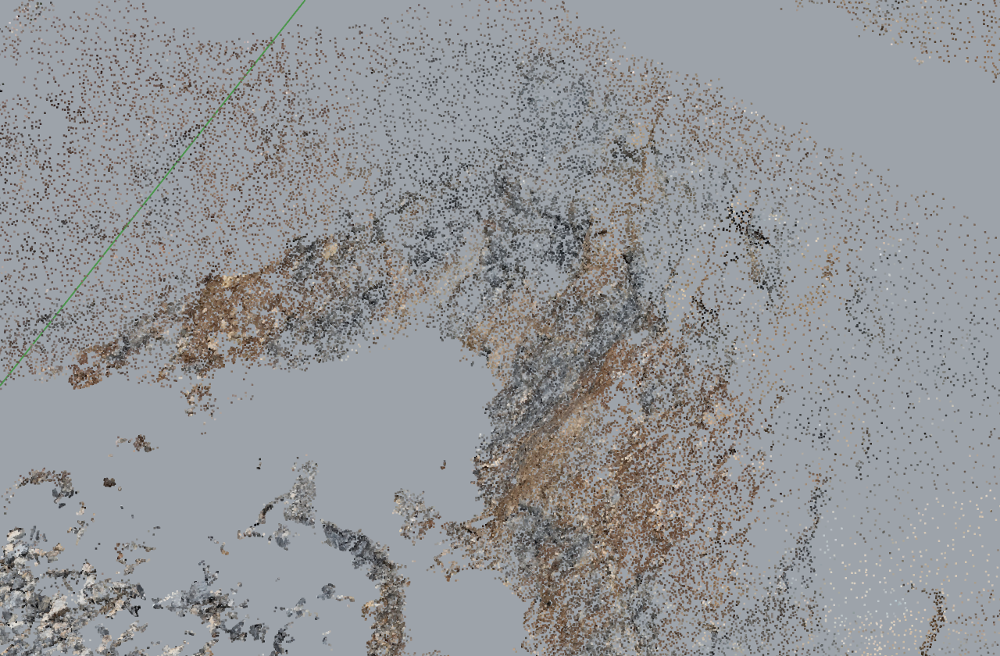

Scan-to-mesh reconstruction **works** on the subsampled cloud: it reconstructs
to a closed surface via the Advancing-Front backend (out-of-process worker),
59,971 verts / 111,973 tris in 3.9 s, with the long spanning triangles being cap
artifacts that the cleanup node peels (reconstruction is chapter 10).


Two limitations are documented rather than hidden. LiDAR `.laz` **needs laszip,
not Rhino import**: a plain Rhino `-Import` of `ot_GD_TLS_data_UTM.laz` produces
zero objects, so `.laz`/`.las` must route through `LazCloudReader` (the
laszip.net path) or convert to E57 for the worker
(`examples/07_scan_ingest_full/README.md`). GPR `.rd3` **reads via the Core**
reader (986 traces with picks on the Grimsel granite file). The
`Import Photo Markers` component (GUID `F2D07A03-...`) completes the
photogrammetry path: it reads markers/GCPs from a Metashape/COLMAP/RealityCapture
export or a plain GCP CSV and feeds them into the Georeference align-by-points
node, so a floating photogrammetry result is positioned and scaled onto a known
base. The repository ingests markers but deliberately does not reconstruct
photogrammetry (`ImportPhotoMarkersComponent.cs:12-25`).

---

## 12.7 Status & what's left

- **`.gsf` proprietary dead-stop.** Any dataset that ships only Geoscanners AKULA
  `.gsf` cannot enter the pipeline without a manual GPRSoft or RGPR conversion to
  SEG-Y (`GprFileReader.cs:46-51`). This is a deliberate bridge, not a defect, but
  it blocks `.gsf`-only sources. *Severity: low.*
- **Multi-channel DZT not de-interleaved.** A GSSI `.dzt` with `rh_nchan > 1` is
  read as a single concatenated scan stream; all known test files are
  single-channel, and de-interleaving is a TODO when a multi-channel granite file
  appears (`GprDztReader.cs:30-33`). *Severity: medium.*
- **MALA marker positions not applied.** Traces from a `.rd3` are laid along the
  +X axis at the header distance interval; companion `.cor`/`.mrk` GPS marker
  positions are parsed but not yet written to `GprTrace.X/Y`
  (`GprMalaRd3Reader.cs:34-37`). The trace geometry is therefore a straight line,
  not the true survey path, until markers are wired. *Severity: medium.*
- **Vector readers do not reproject.** Output curves are in source-CRS units; a
  file in projected metres (Loviisa `EUREF_FIN_TM35FIN`) stays in those units, and
  GeoJSON carries no CRS at all (`ShapefileFractureReader.cs:31`,
  `GeoJsonFractureReader.cs:11-19`). This is correct (no silent datum error) but
  pushes reprojection onto the user. *Severity: low.*
- **E57 worker is an external dependency.** `Load E57 Cloud` needs python + pye57
  + numpy on PATH and `frahan_e57_worker.py` deployed beside the `.gha`; if any is
  missing the component reports the failure but cannot read the file
  (`E57CloudWorker.cs:167-191`, `LoadE57CloudComponent.cs:42-48`). *Severity:
  medium.*
- **No `.las`/`.laz` canvas reader in the default install path is validated
  end-to-end in Rhino.** The README marks `.laz` ingest as routed through the
  harness `laszip.net.dll`; a live in-Rhino validation of the LAS/LAZ component on
  the 357M-point tile is the remaining truth-criterion step
  (`examples/07_scan_ingest_full/README.md`). *Severity: low.*
- **Third-party notices owed.** NetTopologySuite, laszip.net, and the pye57 worker
  dependency chain each owe a `THIRD_PARTY_NOTICES.md` row before public release
  (the licensing register, `90_originality.md`). *Severity: medium.*

---

## References (this chapter)

- Huber, E., Hans, G. (2018). RGPR — an open-source package to process and
  visualize GPR data. 2018 17th International Conference on Ground Penetrating
  Radar (GPR), IEEE, pp 1-4. DOI 10.1109/ICGPR.2018.8441658.
- Lucius, J.E., Powers, M.H. (1999). USGS Open-File Report 02-166: GPR
  data-format documentation (pulseEKKO DT1/HD public-domain spec).
- Isenburg, M. (2013). LASzip: lossless compression of LiDAR data.
  Photogrammetric Engineering & Remote Sensing 79(2):209-217. DOI
  10.14358/PERS.79.2.209.
- Turk, G. (1994). The PLY polygon file format. Stanford University Graphics
  Laboratory.
- ASTM E2807-11 (2011, reapproved). Standard specification for 3D imaging data
  exchange, version 1.0 (E57 format).
- ASPRS. LAS specification version 1.4-R15. American Society for Photogrammetry
  and Remote Sensing.
- SEG Technical Standards Committee. SEG-Y data exchange format, revisions
  0/1/2. Society of Exploration Geophysicists.
- NetTopologySuite.IO.Esri. ESRI Shapefile and GeoJSON readers implementing OGC
  Simple Features. https://github.com/NetTopologySuite.
- Annan, A.P. (2009). Electromagnetic principles of ground penetrating radar. In:
  Jol, H.M. (ed.) Ground penetrating radar: theory and applications. Elsevier,
  Amsterdam, pp 3-40. ISBN 9780444533487. (Two-way travel-time depth relation.)

---

# 13. Lab, Analysis & Reporting

This chapter covers the repository's instrumentation surface: the three
ribbon tabs that do not produce primary stone geometry but inspect, measure,
and report on the subsystems that do. They are `Lab` (26 components, the
third-largest subcategory), `Reports` (3 components), and `Analysis` (3
components). None of these is a new solver. Their contribution is access:
exposing a Core primitive for diagnostics, summarising a solver's output as
typed metrics, or formatting those metrics per audience. The interesting
design questions here are governance questions, not mathematics ones. What
keeps the `Lab` tab from becoming a junk drawer of dead probes? What stops a
monolith like the heterogeneous-extraction pipeline from becoming an opaque
black box that hides the published primitives it composes? The repository
answers both with explicit rules that this chapter audits against the source.

Two governance rules from the project's working notes bind every component
below. The **lab-not-an-island** rule requires every `Lab` node to carry a
`[RelatedComponent]` attribute pointing at a real production sibling (a 3D
packing, quarry, or mesh component), so a `Lab` probe is never a dead-end.
The **monster-vs-primitive** rule requires every monolithic facade (the
`HeteroExt` pipeline is the canonical case) to be a thin orchestrator over
published Core primitives, with the same engine also exposed standalone, so
both the composed convenience node and its decomposed primitives ship
together. The honesty convention of `AGENTS.md` §6 governs the whole tab: no
ghost component, every node must produce a real, valid output, and a node
that returns empty is a defect to be flagged, not a feature.

---

## 13.1 The Lab subcategory: what it is and what it is not

`Lab` is the reserved subcategory for diagnostic and research-probe
components: native-shim exercisers, single-objective inspectors over a
production solver, and one or two "answer a specific question" bonus
packers. The central allow-list `LabConfig` documents the design intent
precisely. Lab-gating is a **visibility flag only**: a Lab-gated component
never has its source, icon, GUID, or `.csproj` entry deleted, and removing a
GUID from the gate returns the component to its default ribbon (a reversible
operation). The current gate is intentionally empty:

> The Lab subcategory itself stays reserved for genuinely miscellaneous /
> scratchpad / experimental future components that need an enabling
> configuration to use. None qualify in v1.0.
> (`Attributes/LabConfig.cs:28-35`.)

That comment records a 2026-05-30 reversal: eleven GUIDs were once force-gated
into `Lab`, then released because they "turned out to be real, named
algorithms / production paths, not miscellaneous" (`LabConfig.cs:18-26`). The
`Lab` tab today is therefore populated by components whose **own** base
constructor declares `"Frahan", "Lab"`, not by runtime gating. There are 26
such components across six source files.

| File | Count | Components (short name) |
|---|---|---|
| `CgalTestComponents.cs` | 8 | `MeshCsgCgal`, `SkeletonCgal`, `MeshRepairCgal`, `DecimateCgal`, `PartitionCgal`, `SegmentSdfCgal`, `SegmentAngleCgal`, `GeodesicVoronoiCgal` |
| `GeogramTestComponents.cs` | 8 | `DecimateGeogram`, `RepairGeogram`, `ObbGeogram`, `RemeshGeogram`, `TetGeogram`, `CvtGeogram`, `RvdGeogram`, `FillHolesGeogram` |
| `BlockCutOptInspectorComponents.cs` | 5 | `BCOPareto`, `BCORobust`, `BCOWatershed`, `VtuOut`, `BCOMixedPack` |
| `AutoMeshComponents.cs` | 3 | `RepairAuto` (retired), `DecimateAuto`, `ObbAuto` |
| `CoacdTestComponents.cs` | 1 | `DecomposeCoacd` |
| `DownloadFrahanDataComponent.cs` | 1 | `GetData` |

These group into three roles. **Native-shim exercisers** (the CGAL, Geogram,
CoACD, and Auto families, 20 of the 26) are Grasshopper surfaces that drive
the out-of-process geometry kernels end-to-end and report which back end
actually ran. **Solver inspectors** (the five `BlockCutOpt` components) wrap a
production quarry solver and surface a single axis or a robustness sweep that
the production node does not expose. **Distribution helper** (`GetData`) is
the on-demand large-asset fetcher. The taxonomy matters for the originality
call-outs: the exercisers are wrappers over vendored or in-tree kernels, the
inspectors are evolved or clean-room math over a cited baseline, and the
helper is a Frahan-original utility.

### 13.1.1 The lab-not-an-island rule, audited

The rule is verifiable by attribute. Every one of the 26 `Lab` components
carries at least one `[RelatedComponent]` pointing at a production sibling.
Sampling the families:

- `MeshCsgCgal` redirects to `Frahan > Masonry > Mesh CSG` and
  `Slab Cut By Fractures` (`CgalTestComponents.cs:120-121`).
- `DecimateGeogram` redirects to `Frahan > Mesh > Mesh Repair`, with the
  honest note "no production decimate component yet"
  (`GeogramTestComponents.cs:26`).
- `BCOPareto` redirects to `BlockCutOpt Solve` and `BlockCutOpt Omni Solve`
  (`BlockCutOptInspectorComponents.cs:39-40`), the production solvers whose
  Pareto front it visualises.
- `DecomposeCoacd` redirects to `Masonry Assembly`, `Auto Interfaces`, and
  `Mesh Diagnostics` (`CoacdTestComponents.cs:29-31`).

No `Lab` node was found without a production cross-reference. The rule holds
across the tab as shipped.

### 13.1.2 Native-shim exercisers (CGAL / Geogram / CoACD / Auto)

These nodes are wrappers, not algorithms. They marshal a Rhino `Mesh` to the
shared `MeshSnapshot` interop record, call the managed wrapper over the native
shim, and marshal back, reporting the back end (`Geogram`, `Cgal`,
`ManagedBsp`, or `None`) and a timing line. The marshalling itself is the only
in-tree work: the conversion welds coincident vertices and drops unreferenced
ones, because Rhino's procedural primitives emit duplicated corner vertices
(24 for a cube instead of 8) and CGAL corefinement then treats every edge as a
boundary and returns hole-ridden output (`CgalConvert.ToSnapshot`,
`CgalTestComponents.cs:29-64`). The `Auto*` family adds one layer: it asks the
`MeshOps` facade to pick the best available back end (Geogram first, CGAL
fallback) and reports which ran (`AutoMeshComponents.cs:55-88`).

> **Originality.** The shim exercisers are **wrapper-of-native** for the call
> path and **clean-room** for the marshalling. The cited kernels are: CGAL
> Polygon Mesh Processing corefinement (`[Algorithm]`
> `CgalTestComponents.cs:119`), Geogram vertex-clustering decimation (Levy,
> Geogram v1.9.9, BSD-3, `GeogramTestComponents.cs:25`), CoACD (Wei et al.
> 2022, SIGGRAPH, `CoacdTestComponents.cs:28`), and the CGAL straight
> skeleton, SDF segmentation, and geodesic-Voronoi probes. **Licensing.** CGAL
> is GPLv3 and CoACD vendors CGAL transitively; both are reached only through
> optional out-of-process shims absent from the default install, with a
> managed BSP fallback. The Geogram `TetGeogram` node wraps Geogram's TetGen
> path, which is AGPL and on by default in the geogram build, gated behind
> `-DFRAHAN_WITH_TETGEN` for an AGPL-free configuration
> (`GeogramTestComponents.cs:547`, `:738`; licensing register flags E3-E6).
> The Clipper2 and Kazhdan-Poisson permissive paths carry attribution only.

### 13.1.3 Solver inspectors (the BlockCutOpt Lab five)

These are the algorithmically interesting `Lab` nodes. Each wraps the quarry
block-cutting solver of Chapter 3 and surfaces information the production node
withholds.

**Pareto front inspector (`BCOPareto`, GUID `F2D0BC10`).** The production
`BlockCutOpt Omni Solve` returns three of four objectives; the inspector runs
`BlockCutOptOmniSolver` and surfaces all four optima per sub-zone in parallel:
recovery-max, revenue-max, kerf-time-min, and the Jalalian BCSdbBV cost-min
(`BlockCutOptInspectorComponents.cs:147-167`). The fourth axis is the
sustainable-mining cost objective

$$
\mathrm{BCSdbBV} = \frac{S}{BV},\qquad S = 2\,(L_xL_y + L_yL_z + L_xL_z),
$$

cutting-surface area $S$ over block value $BV$ (Jalalian et al. 2023): minimise
the sawn surface per unit of recovered value. The inspector exposes the
`Front.BestBcsdbBv()` extremum that the single-best-recovery production output
hides.

**Fisher-robust solver (`BCORobust`, GUID `F2D0BC11`).** A single
deterministic optimum is fragile: the best cutting direction $\psi$ depends on
fracture orientations measured with scatter. `BCORobust` runs the solver $M$
times against $M$ Fisher-perturbed realisations of the same joint sets and
reports the percentile band, not the point estimate
(`BlockCutOptInspectorComponents.cs:270-289`).

**Original framing: the robust optimum is the median direction.** Given $M$
Monte-Carlo samples each returning a recovery $R_k$ and a best direction
$\psi_k$, the deterministic best $\psi^\star$ over the unperturbed mean
orientations can sit on a knife-edge. The robust score is the lower percentile

$$
R_{p10} = \mathrm{percentile}_{10}\{R_1,\dots,R_M\},\qquad
\psi_{\text{robust}} = \mathrm{median}\{\psi_1,\dots,\psi_M\},
$$

so the reported direction is the one that survives orientation noise rather
than the one that maximises a single noiseless realisation (Azarafza et al.
2016 Fisher-scatter reading; synthesis axis I8). The component returns
$R_{p10}/R_{p50}/R_{p90}$, the mean, the standard deviation, and the per-sample
arrays for the caller's own histogram
(`BlockCutOptInspectorComponents.cs:219-228`). The base seed makes the sweep
reproducible (`:216`).

**Density-watershed zones (`BCOWatershed`, GUID `F2D0BC12`).** Replaces the
uniform $(m_x,m_y)$ sub-division with an adaptive partition whose zone
boundaries snap to high-density fracture ridges, so the unavoidable
boundary-cut penalty lands on already-broken rock
(`BlockCutOptInspectorComponents.cs:340-381`). It is the GH front end to the
in-tree `DensityWatershedPartition` (synthesis I5).

**VTU export (`VtuOut`, GUID `F2D0BC13`).** Runs the solver, regenerates the
winning tilted cutting grid, classifies each cell against the triangle-AABB
BVH as intersected or clear, and writes a ParaView `.vtu` with two cell sets,
matching the BlockCutOpt 2020 paper's figure convention
(`BlockCutOptInspectorComponents.cs:463-499`). A default-false `Write` gate
keeps the file I/O off until requested.

> **Originality.** `BCOPareto` is **clean-room** over the cited Jalalian 2023
> BCSdbBV axis (`[Algorithm]` `BlockCutOptInspectorComponents.cs:38`); it adds
> no algorithm, only the fourth-axis surfacing. `BCORobust` is **clean-room**
> Monte-Carlo robustness sampling over the cited Azarafza 2016 Fisher reading
> (`:175`). `BCOWatershed` fronts a **clean-room** Frahan-original partition
> (`:298`, "Core DensityWatershedPartition.cs verified-original"). `VtuOut` is
> a **facade-over-primitives** export node composing the solver, the cutting
> grid, and the BVH. All four are diagnostic surfaces over the Chapter 3
> production solvers, each carrying the `[RelatedComponent]` redirect required
> by the lab-not-an-island rule.


### 13.1.4 The bonus mixed-size packer and the monster-vs-primitive balance

`BCOMixedPack` (GUID `F2D0BC17`) is the one `Lab` node that is not a probe but
a standalone packer. It answers a direct question the project owner asked:
"can we pack multiple sizes instead of one size for the entire quarry?". It
exposes the **2D Deepest-Left-Bottom-Fill** packer `DlbfMixedSizePacker`
directly: a multi-size catalogue with per-size revenue, pieces sorted by
revenue-per-area, placed at the deepest-then-leftmost free grid cell, with
optional forbidden boxes encoding fracture-intersected regions
(`BlockCutOptInspectorComponents.cs:559-620`; engine
`DlbfMixedSizePacker.cs:8-25`). Pieces sort by

$$
\text{order key} = \frac{\mathrm{Revenue}}{\mathrm{Width}\cdot\mathrm{Depth}}
\quad(\text{descending}),
$$

the revenue-per-area density (`DlbfMixedSizePacker.cs:46`), and the placement
rule scans the discrete grid for the deepest-left-bottom feasible cell
(Chehrazad, Roose, Wauters 2025).

This is the load-bearing example of the **monster-vs-primitive** rule. The
same DLBF engine is the core of the monolithic `HeteroExt` pipeline
(`FrahanHeterogeneousExtractionComponent`, GUID `F2D0BC19`, on the `Quarry`
tab), a four-stage facade that runs BlockCutOpt to find fracture-clean
regions, marks intersected cells forbidden, runs 3D DLBF mixed-size packing,
and optionally places monuments
(`BlockCutOptHeterogeneousComponents.cs:179-191`). The monolith's
`[Algorithm]` names itself "Frahan-original" but immediately declares that it
"Composes Elkarmoty 2020 (BlockCutOpt) and Chehrazad 2025 (DLBF), both
interpreted and reimplemented in managed code; the composition and the
heterogeneity model are the contribution"
(`BlockCutOptHeterogeneousComponents.cs:169`). Crucially the monolith carries
explicit `[RelatedComponent]` back-pointers to the standalone primitives it
composes: to `Frahan > Lab > Frahan Mixed-Size Block Pack` (the 2D `F2D0BC17`)
and to `Frahan > Quarry > Frahan Mixed-Size Block Pack 3D` (the 3D `F2D0BC18`),
each annotated "the same engine this facade composes"
(`:170-173`). Both the composed convenience and the decomposed primitive ship,
the seams are exposed, and the engine is never a black box. This is the rule
satisfied, with the `Lab` tab holding the 2D primitive seam.

> **Originality.** `BCOMixedPack` is **clean-room** over the cited DLBF
> (Chehrazad, Roose, Wauters 2025, DOI 10.1080/00207543.2025.2478434,
> `BlockCutOptInspectorComponents.cs:509`). `HeteroExt` is
> **facade-over-primitives**: a Frahan-original composition with no new
> algorithm, its two cited sub-algorithms each exposed standalone
> (`BlockCutOptHeterogeneousComponents.cs:169-173`). The pairing is the
> monster-vs-primitive rule made executable.

### 13.1.5 The distribution helper

`GetData` (GUID `F2D05A08`) fetches optional large assets (the Kintsugi
`kintsugi.bin` weights plus the Torch/CUDA runtime, or the examples bundle)
from a release manifest into the deploy folder, SHA-256-verifying each file,
on a background thread so the canvas stays responsive
(`DownloadFrahanDataComponent.cs:36-58`). It keeps the install lean by moving
the non-redistributable and the heavy off the `.gha`.

> **Originality.** **original-research** is overstated for a utility; this is a
> **Frahan-original distribution helper** (`[Algorithm]`
> `DownloadFrahanDataComponent.cs:36-38`), an engineering utility, not a
> research contribution. Its licensing relevance is real: it is the mechanism
> by which the GPL-3.0 / non-commercial Kintsugi weights stay out of the
> default permissive install until the user explicitly fetches them.

---

## 13.2 The Reports tab: typed metrics from solver output

The `Reports` tab holds three components, each a thin Grasshopper marshaller
over a Rhino-free Core report type. The math is elementary; the contribution
is a single canonical metrics surface so every solver reports the same way.

### 13.2.1 Packing metrics

`PackRpt` (GUID `AB12C004`) consumes an opaque `PackResult` from any 3D pack
solver and surfaces `Frahan.Core.PackingMetrics`. The Core computes placement
and failure counts, the failure ratio, packed and container volumes, the fill
ratio, the average placement score, item-volume statistics, and a per-reason
failure breakdown (`PackingMetrics.cs:72-133`). The two headline ratios are

$$
\mathrm{FailureRatio} = \frac{N_{\text{fail}}}{N_{\text{placed}} + N_{\text{fail}}},
\qquad
\mathrm{FillRatio} = \frac{V_{\text{packed}}}{V_{\text{container}}},
$$

and the per-reason histogram is built by counting `Failure.Reason` strings
(`PackingMetrics.cs:112-118`). The component orders the failure reasons by
descending count and emits a single-line summary
(`PackingReportComponent.cs:101-106`). The Core is static, side-effect-free,
and allocates only the returned report dictionary
(`PackingMetrics.cs:64-67`).

### 13.2.2 Packing-plan report

`PackPlanRpt` (GUID `AB12C008`) aggregates three pieces into one composite
`PackingPlanReport`: the `PackingMetricsReport`, a residual-void list, and the
per-fragment-per-edge match scores from the edge-matcher
(`PackingPlanReportComponent.cs:164-182`; builder `PackingPlanReport.cs:51-91`).
The two scalars it derives are the total residual-void area (a sum of
per-void approximate areas) and the mean best-edge-match score (a flatten-then-
average over the nested per-fragment score lists):

$$
A_{\text{void}} = \sum_v \mathrm{area}(v),\qquad
\bar{s}_{\text{edge}} = \frac{1}{|E|}\sum_{e\in E} s_e .
$$

The pieces are decoupled, so a caller can pass any subset and `null` for the
rest (`PackingPlanReport.cs:46-48`). The component accepts edge scores three
ways: a nested opaque list, a flat opaque list, or a Grasshopper
`DataTree<Number>` with one branch per fragment, the tree taking precedence
when both are wired (`PackingPlanReportComponent.cs:114-162`). That tree path
is the natural Grasshopper UX; the opaque path stays for code that already
produces nested lists.

### 13.2.3 Audience report

`Report` (GUID `AB12C010`) is the single report/export terminal driven by an
`Audience` enum (engineer / artist / geologist). It consumes the typed
`FrahanReport` records the kept solvers emit (Packing, MeshDiagnostics,
FabricationPrep, BlockCutOpt, ChartFlatness) plus optional pipe-delimited
section rows, then orders, routes, flags, and formats per audience, applying
the spec's audience rules: the engineer release is **refused without a
declared CRS/datum**, the artist flags grain/vein UNKNOWN, the geologist flags
rock-mass needing a worksheet (`AudienceReportComponent.cs:27-46`). Output is
Markdown plus CSV; with `Run` and a path it writes the files
(`AudienceReportComponent.cs:147-169`). The composition logic is Rhino-free and
unit-tested in `Frahan.Core.Reports.AudienceReportComposer`; the component is a
thin marshaller (`:24-26`). The CRS refusal is the only "gate" in the tab: a
correctness guard against shipping an unreferenced mining plan
(`Tolerance = "Engineer release refused without a declared CRS/datum"`,
`:31`).

> **Originality.** All three report components are **facade-over-primitives**:
> Frahan-original report generators over the cited spec sections (spec 5 §5,
> spec 7 §5), composing pure-data Core DTOs. The `[DesignApplication]`
> precedents name them "Frahan-original packing-report generator"
> (`PackingReportComponent.cs:25`), "Frahan-original packing-plan report"
> (`PackingPlanReportComponent.cs:24`), and the "SAMPLE_GH_SPEC.md
> three-audience report terminal" (`AudienceReportComponent.cs:30`). No new
> algorithm; the contribution is one canonical, audience-aware metrics surface.

A note on scope: the `ChartFlatnessReport` named in this subsystem lives in
Core under `Frahan.Surface` (`ChartFlatnessReport.cs`), but its Grasshopper
front end `ChartFlat` (GUID `AB12C006`) is filed on the **Surface Packing**
tab, not `Reports` (`ChartFlatnessReportComponent.cs:32`). Its math is a
per-face area-ratio distortion test using $\max(r, 1/r)$ so $0.5\times$ and
$2\times$ count as equally distorted (`ChartFlatnessReport.cs:90-101`); it is
**clean-room** Frahan-original, not the BFF algorithm
(`ChartFlatnessReportComponent.cs:23-24`). It is reported here because it is
one of the five `FrahanReport` record types the audience terminal consumes,
and the roadmap proposes driving an adaptive surface re-cut from it.

---

## 13.3 The Analysis tab: edge-matching diagnostics

The `Analysis` tab holds three components, all moved there on 2026-05-05 from
`2D Packing` to make their diagnostic role explicit. Each was once wired into
the irregular-sheet packer; the unified solver now folds boundary scoring in
internally, so these standalone nodes survive only to inspect the index the
solver builds, debug affinity scores, and export for ad-hoc analysis. None
needs to be wired into the solver any more
(`BoundaryRailIndexComponent.cs:19-25`).

- **`RailIdx`** (GUID `AB12C001`) builds a `BoundaryRailIndex` from boundary
  curves: each curve is sliding-window-sampled into (length, tangent angle,
  curvature) buckets and stored as a `BoundaryIntervalInfo`
  (`BoundaryRailIndexComponent.cs:38-52`).
- **`FragDesc`** (GUID `AB12C007`) converts closed planar curves into
  `FragmentDescriptor`s with per-edge `EdgeDescriptor`s and surfaces area,
  perimeter, aspect ratio, and edge counts
  (`FragmentDescriptorsComponent.cs:34-47`).
- **`FragMatch`** (GUID `AB12C003`) matches each fragment edge against a
  populated index and returns ranked affinity scores as one
  `DataTree<Number>` branch per fragment
  (`FragmentEdgeMatchComponent.cs:38-51`).

The three compose a pipeline: `RailIdx` builds the index, `FragMatch` queries
it with `FragDesc` descriptors. The bucketing is arc-length affinity over a
turning-function representation (Arkin et al. 1991 is the turning-function
shape-metric precedent).

> **Originality.** All three are **clean-room** Frahan-original diagnostics:
> the geometric descriptors are textbook quantities but the descriptor schema
> and the affinity-bucket index are Frahan-original (`[Algorithm]` notes
> "geometric descriptors are textbook quantities but the descriptor schema is
> Frahan-original", `FragmentDescriptorsComponent.cs:29-31`; "arc-length
> affinity bucketing, not a published algorithm",
> `BoundaryRailIndexComponent.cs:33-35`). They carry no production
> `[RelatedComponent]` redirect because they are not `Lab`-gated; their
> production home is the unified `Frahan Sheet Pack`, which absorbed their
> function (`FragmentEdgeMatchComponent.cs:20-24`).

---

## 13.4 Status & what's left

- **Retired Lab ghost (`RepairAuto`).** `AutoMeshRepairComponent`
  (GUID `F2D000D0`) is marked `Obsolete` and `Exposure=hidden`, superseded by
  `Sanitize Mesh (Backend=Auto)` which runs the same `MeshOps.Repair` plus a
  CGAL-Ready verdict; the GUID is preserved so existing canvases keep loading
  (`AutoMeshComponents.cs:34-40`). This is the hide-not-delete pattern done
  correctly, not a defect. *Low.*
- **Lab decimate has no production sibling.** `DecimateGeogram` and
  `DecimateCgal` redirect to `Mesh Repair` because there is no production
  decimate component yet (`GeogramTestComponents.cs:26`). The lab-not-an-island
  rule is satisfied by the redirect, but the honest implication is a missing
  production node: a `Mesh Decimate` should be promoted out of `Lab`. *Medium.*
- **AGPL exposure via `TetGeogram`.** The tetrahedralise probe wraps Geogram's
  TetGen path, which is AGPL and on by default in the geogram build; an
  AGPL-free configuration requires `-DFRAHAN_WITH_TETGEN=OFF`, which disables
  volumetric Voronoi blocks (`GeogramTestComponents.cs:547`, `:738`; register
  flag E6). The native shims are absent from the default install, so the
  default path is clean, but a packager who turns on the shims must honour the
  flag. *High.*
- **Greedy Trencadís ghost (cross-subsystem).** The named-but-empty
  `Frahan Trencadís Pack` box (GUID `F2D00002`, 2D Nesting tab) returns empty
  output on the primary ribbon, an `AGENTS.md` §6 violation; it is not a `Lab`
  node, but it is the canonical ghost the Lab governance rules exist to
  prevent. The fix is to implement the greedy pack or move the box off the
  primary ribbon and route users to Catalog / Pipeline (roadmap item 5,
  `91_roadmap.md:42`, `:88`). *Medium.*
- **`ChartFlatnessReport` is under-used.** The Core flatness classifier feeds
  only the audience terminal today. The roadmap proposes driving an adaptive
  per-face surface re-cut from it (`91_roadmap.md:48`), which would make it a
  control input rather than a report-only leaf. *Low.*
- **Reports tab has no rendered figure.** The `Reports` and `Analysis` tabs
  ship no dedicated example folder; the embedded figure borrows example 09
  (the uncertainty-safe yield), the production output the Lab BlockCutOpt
  inspectors instrument. *Low (documentation gap, not a code gap).*

---

## References (this chapter)

- Chehrazad, R., Roose, D., Wauters, T. (2025). A fast and scalable
  deepest-left-bottom-fill algorithm for the 3D bin packing problem.
  International Journal of Production Research 63:6606-6629. DOI
  10.1080/00207543.2025.2478434.
- Elkarmoty, M., Bondua, S., Bruno, R. (2020). Mechanized in-situ
  determination of joint-related and yield-related rock-mass parameters
  during dimension stone block extraction. Resources Policy 68:101761. DOI
  10.1016/j.resourpol.2020.101761.
- Jalalian, M.H., Bagherpour, R., Khoshouei, M. (2023). Environmentally
  sustainable mining in quarries to reduce waste production and loss of
  resources using the developed optimization algorithm (BCSdbBV). Scientific
  Reports 13:22183. DOI 10.1038/s41598-023-49633-w.
- Azarafza, M. et al. (2016). Granite block-cut analysis with Fisher-
  distribution joint-orientation scatter.
- Wei, J., Liu, M., Wang, J. et al. (2022). Approximate convex decomposition
  for 3D meshes with collision-aware concavity and tree search (CoACD). ACM
  Transactions on Graphics (SIGGRAPH 2022) 41(4):42. DOI
  10.1145/3528223.3530103.
- Levy, B. (INRIA/ALICE). Geogram: a programming library of geometric
  algorithms (v1.9.9). BSD-3.
- The CGAL Project (2023). CGAL user and reference manual. CGAL Editorial
  Board. GPLv3 / commercial.
- Lloyd, S.P. (1982). Least squares quantization in PCM. IEEE Transactions on
  Information Theory 28(2):129-137. DOI 10.1109/TIT.1982.1056489.
- Arkin, E.M., Chew, L.P., Huttenlocher, D.P., Kedem, K., Mitchell, J.S.B.
  (1991). An efficiently computable metric for comparing polygonal shapes.
  IEEE Transactions on Pattern Analysis and Machine Intelligence 13(3):209-216.
  DOI 10.1109/34.75509.
- Sawhney, R., Crane, K. (2017). Boundary first flattening. ACM Transactions
  on Graphics 36(4):109. DOI 10.1145/3072959.3056432.

---

# 14. Workflow Architecture & Data-Flow Connections

This chapter is cross-cutting. The preceding chapters classify individual
algorithm families; this one maps how they connect into end-to-end
workflows. The repository is not a bag of components. It is one data-flow
spine, ingest to fabricate, with a small number of subsystem branches that
re-enter that spine at well-defined seams. The 28 worked examples in
`examples/` are the evidence: each is a Grasshopper definition that wires a
slice of the spine. Reading the 24 example READMEs and the four
README-less canvases together recovers the architecture as built, not as
imagined.

Three structural facts govern the whole repository and recur in every
section below.

1. **Rhino-free Core.** The algorithms live in `Frahan.StonePack.Core`
   (net48, no RhinoCommon reference). The Grasshopper layer
   `Frahan.StonePack.GH` is a thin facade: it marshals canvas geometry to
   Core types, calls one engine, and marshals back. This is why headless
   harness numbers exist at all, and why AGENTS.md §1 can distinguish
   "measured" (Core, harness) from "validated" (seen in Rhino).
2. **Native bridges behind a C ABI.** Heavy geometry (booleans, remesh,
   reconstruction, convex decomposition, exact NFP) is done in native DLLs
   wrapped by P/Invoke shims (`native/`). The managed side owns only the
   marshalling. AGENTS.md §3 routes the crash-prone ones out of process.
3. **Facade-over-primitives.** The big single-box components (HeteroExt,
   the Unified sheet filler, the hole-aware nester) compose published Core
   primitives. They add convenience, not new mathematics, and the
   composed-equivalent canvas exists alongside them.

## 14.1 The data-flow spine

Every workflow is a path through one acyclic spine: a site or a form is
ingested, reconstructed to clean geometry, segmented into regions, then
packed or cut into fabricable pieces, stabilised (settling for piles, a
limit-state certificate for assemblies), and emitted as a cut plan or an
install order.

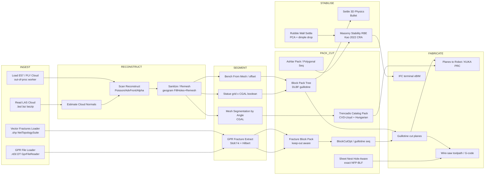
```mermaid
flowchart LR
  subgraph INGEST
    A1[Read LAS Cloud<br/>.las/.laz laszip]
    A2[Load E57 / PLY Cloud<br/>out-of-proc worker]
    A3[GPR File Loader<br/>.rd3/.DT GprFileReader]
    A4[Vector Fractures Loader<br/>.shp NetTopologySuite]
  end
  subgraph RECONSTRUCT
    B1[Estimate Cloud Normals]
    B2[Scan Reconstruct<br/>Poisson/AdvFront/Alpha]
    B3[Sanitize / Remesh<br/>geogram FillHoles+Remesh]
  end
  subgraph SEGMENT
    C1[Mesh Segmentation by Angle<br/>CGAL]
    C2[GPR Fracture Extract<br/>Stolt f-k + Hilbert]
    C3[Bench From Mesh / offset]
    C4[Statue grid x CGAL boolean]
  end
  subgraph PACK_CUT
    D1[Block Pack Tree<br/>DLBF guillotine]
    D2[Fracture Block Pack<br/>keep-out aware]
    D3[Sheet Nest Hole-Aware<br/>exact NFP-BLF]
    D4[Trencadis Catalog Pack<br/>CVD-Lloyd + Hungarian]
    D5[Ashlar Pack / Polygonal Seq]
    D6[BlockCutOpt / guillotine seq]
  end
  subgraph STABILISE
    E1[Rubble Wall Settle<br/>PCA + dimple drop]
    E2[Settle 3D Physics<br/>Bullet]
    E3[Masonry Stability RBE<br/>Kao 2022 CRA]
  end
  subgraph FABRICATE
    F1[Guillotine cut planes]
    F2[Planes to Robot / KUKA PRC]
    F3[Wire-saw toolpath / G-code]
    F4[IFC terminal xBIM]
  end
  A1 --> B1 --> B2 --> B3 --> C3
  A2 --> B2
  A3 --> C2 --> D2
  A4 --> C2
  B3 --> C1 --> D4
  B3 --> C4 --> D1
  C3 --> D1
  C2 --> D2 --> D6 --> F1
  D1 --> E2
  D3 --> F3
  D4 --> F2
  D5 --> E3 --> F4
  E1 --> E3
  D1 --> F1 --> F2
  F1 --> F3
```

The spine has four ingest mouths (point cloud, GPR radargram, vector
shapefile, and an in-canvas designed form), one reconstruction lane, three
segmentation modes (dihedral surfaces, GPR fracture surfaces, grid-boolean
blocks), six pack-or-cut engines, three stabilisers, and four fabrication
terminals. Each example below is one route through this graph.

## 14.2 Per-example pipeline graphs

Each line is the component chain the example wires, read left to right.
Bracketed names are Grasshopper components; arrows are canvas connections.
Folders without a README ship a `.gh` + `.3dm` only; their chain is read
from the canvas and the figure catalogue.

| # | Example | Pipeline chain (component graph) |
|---|---|---|
| 01 | Quarry to wall | `Scan/Block source` -> `Block Pack` -> `Masonry layout` -> `Wall` (full spine, definition only) |
| 02 | Masonry assembly | `Blocks` -> `Polygonal Masonry Sequence` -> `colour-by-install-order` preview |
| 03 | GPR fracture (granite) | `GPR File Loader (.rd3)` -> `RadargramProcessor (f-k migrate)` -> `GPR Fracture Extract` -> `GPR Fracture Surfaces 3D` -> report |
| 03b | Quarry to slabs | `Block source` -> `Fracture Block Pack` -> `Slab Cut By Fractures` -> slabs (canvas only) |
| 04 | Scan to bench | `Read LAS Cloud (.laz)` -> `Estimate Cloud Normals` -> `Scan Reconstruct (Poisson/Geogram)` -> `Bench From Mesh` + offset -> packable volume |
| 05 | Artist pointing machine | `Scan mesh (decimated)` -> `Carving Stages` -> staged meshes + pointing coords |
| 07 | Scan ingest (full) | `Load E57 / .ply / .laz` -> outlier-clean + crop -> `Scan Reconstruct (Advancing-Front, out-of-proc)` -> `Clean Scan Mesh` -> hand-off |
| 08 | GPR marble + layout | `GPR File Loader (.DT)` -> `GPR Fracture Extract` -> 3 dipping beds -> `net + W*volume` block pack -> oblique guillotine sequence |
| 09 | Uncertainty-safe yield | `GPR Fracture Surfaces 3D` -> `Fracture Clearance = sigma` -> `Fracture Block Pack` -> per-zone yield |
| 10 | 2D nest | `part curves + sheet + holes` -> `Sheet Pack (Unified) V506` / `Freeform Sheet Nest (Exact NFP)` -> packed curves + util_stock |
| 11 | 3D block pack | `element boxes + container` -> `Block Pack (Tree) / DLBF` -> placed boxes (12/12) + report |
| 12 | Trencadis mosaic | `shard catalog + sheet` -> `Trencadis Catalog Pack (CVD-Lloyd + Hungarian)` -> placed pieces + grout |
| 13 | Surface mapping | `twisted mesh` -> `Mesh Segmentation by Angle (CGAL)` -> 6 regions -> `Surface Chart (BFF)` -> `Pack On Surface` -> 176-shard mosaic |
| 14 | Kintsugi reassembly | `Load BB Sample (.bin)` -> `Frahan Kintsugi (Port mode)` -> assembled fragments + verifier score |
| 15 | Statue to blocks | `Read PLY` -> Geogram `FillHoles/Remesh/FillHoles` -> `0.5 m grid x CGAL intersect` -> 113 real-face blocks -> Branch A gangsaw / Branch B rubble match |
| 16 | Rubble masonry | `40 ETH1100 stones` -> `Rubble Wall Settle (PCA + dimple drop)` -> staggered wall, 36/40 stable |
| 17 | Ashlar masonry | `60-block inventory` -> `Ashlar Pack (running bond)` -> `Pack Preview` -> coursed wall (45 placed) |
| 18 | Pack + settle (Bullet) | `12 stones + container` -> `Settle 3D (Physics, Bullet)` -> dense non-interpenetrating pile |
| 19 | Rubble evolved fit | `blocks + stones` -> `Rubble Evolved Fit (24 seeds + (1+8)-ES)` -> 10/10 enclosed, one block per stone |
| 20 | Rubble multi-bin | `blocks + stones` -> `Rubble Multi-Bin Pack (voxel-occupancy FFD)` -> 17/20 across 6 bins |
| 21 | Stereotomy arch | `Arch Voussoirs (D5F10012)` -> cells -> evolve-match to ETH stone -> `CgalMeshBoolean.Intersection` -> 11/11 carved voussoirs |
| 22 | Pendentive vault | `Pendentive Vault Voussoirs (D5F10013)` -> 36 cells -> evolve-match -> CGAL trim -> 36/36 carved |
| 23 | Quarry to slab | `fracture-prone block` -> `Fracture Block Pack (voxel-dlbf-multi)` -> intact blocks -> gangsaw slab cut |
| 24 | Guillotine sequence | `packed block` -> rip(perp-X) -> cross(perp-Y) -> cross(perp-Z) -> 19 saw planes as meshes |
| 25 | Marble gangsaw cost | `fractured bench` -> `Fracture Block Pack` -> `net + W*volume` sweep (Pareto) -> balanced -> guillotine planes |
| 26 | Loviisa surface fractures | `Vector Fractures Loader (.shp, F2D00BEC)` -> `FractureTraceCollection` -> strike map (708 traces) |
| 27 | Polygonal masonry | `chains/cells + wall` -> `Polygonal Masonry Sequence (B4E07A3C)` / `...3D (C5F18B4D)` -> install order DAG -> colour-by-order |
| 28 | Hole nest | `parts + sheet + holes` -> `Sheet Nest (Hole-Aware) D5F10019 / ContactNfpHoleNester` -> nested around holes (canvas only) |

The table makes the spine visible as routes. The geologist spine is
03 -> 08 -> 09 (GPR to uncertainty-safe yield). The engineer spine is
04 -> 11 -> 23 (scan to bench to slab). The artist spine is 05 -> 15 (carving
and statue decomposition). The masonry spine is 16/17 -> 27 -> 02 (settle or
course, then order, then assemble). Examples 21/22 are the top-down
stereotomy bridge, and 13 is the surface-cladding bridge.

## 14.3 Architectural seams

### Core vs GH facade

The deciding seam is the assembly boundary. `Frahan.StonePack.Core`
references no RhinoCommon; the engines `ContactNfpHoleNester`
(`src/Frahan.StonePack.Core/Packing/TwoD/ContactNfpHoleNester.cs`),
`BlockCutOptSolver`, `Dlbf3dMixedSizePacker`, `RubbleWallSettle`, and
`EquilibriumMatrixBuilder` are all pure. The GH component is the facade.
For example, `BlockPackTreeComponent`
(`src/Frahan.StonePack.GH/Packing/BlockPackTreeComponent.cs:37`, GUID
`C2D3E4F5-3001-4F5E-A6B7-C8D9E0F12345`) marshals canvas boxes to the
Core packer and back; the [Algorithm] attribute at line 30 cites the
engine, not the wrapper. This is the single most important structural
choice in the repository: it makes the Core independently testable and
keeps the truth criterion honest.

### Native bridges

Three classes of native bridge cross the managed boundary, all behind a C
ABI (`native/README.md` is the authority).

- `frahan_cgal.dll` (cgal_shim) wraps CGAL Polygon Mesh Processing:
  corefinement booleans (used in example 15 grid-intersect and 21/22
  voussoir trim), decimation, OBB, straight skeleton, SDF/angle
  segmentation (example 13), alpha shape, advancing front, Poisson. The
  CGAL packages used are GPL in that distribution.
- `frahan_geogram.dll` (geogram_shim) wraps Bruno Levy's Geogram: remesh,
  hole-fill, voxel downsample, CVT/Lloyd, and the Kazhdan
  `GEO::PoissonReconstruction` that Geogram bundles (example 04/15).
  Geogram core is BSD-3; bundled PoissonRecon is MIT.
- `nfp_kernel.dll` wraps Clipper2 (BSL-1.0, no copyleft) for the batched
  Minkowski-sum NFP lane that `ContactNfpHoleNester` calls (examples 10,
  28). `frahan_coacd.dll` wraps CoACD (MIT, SIGGRAPH 2022) for the convex
  decomposition in example 15 Branch C and the Bullet settle.

The GH wrappers over these (Scan Reconstruct, Mesh Remesh/Decimate, the
CGAL cut/test components, the CoACD test) carry no managed algorithm; they
marshal to the shim. Crash-prone in-process booleans are routed through
`OutOfProcessReconstructor` + `recon_worker` (example 07), per AGENTS.md
§3.

### Facade-over-primitives pattern

The pattern is explicit in source. `FrahanHeterogeneousExtractionComponent`
(`src/Frahan.StonePack.GH/BlockCutOptHeterogeneousComponents.cs:179`)
composes `BlockCutOptSolver` + `Dlbf3dMixedSizePacker` + the monument
packer; its [Algorithm] note at line 169 reads "Composes Elkarmoty 2020
(BlockCutOpt) and Chehrazad 2025 (DLBF), both interpreted and reimplemented
in managed code for this plugin; the composition and the heterogeneity
model are the contribution." That is the canonical facade: every internal
step resolves to an in-repo primitive that also ships standalone. The
Unified sheet filler dispatches V506 and the obsolete V1/V2/V3 wrappers;
`Sheet Nest (Hole-Aware)` D5F10019 is the facade over
`ContactNfpHoleNester`; `Pack On Surface`
(`src/Frahan.StonePack.GH/SurfacePacking/PackOnSurfaceComponent.cs:41-42`)
composes the exact NFP-BLF placement on a BFF chart with a classical
triangle barycentric lift back to 3D (attributed to the mean-value-coordinate
family, after Floater 2003; the shipped lift is plain barycentric, not MVC).

### Top-down vs bottom-up design flows

The repository tags every workflow by design direction (the
`[DesignApplication(..., DesignFlow.TopDown|BottomUp)]` attribute, e.g.
`GprFractureExtractComponent.cs:46`). The two flows are first-class.

- **Top-down (form-first).** A designed form drives the search for stone.
  Examples 21/22 generate voussoir cells, then find and trim rubble to fit
  them. Example 15 takes a sculpted bunny and cuts it into a brick grid.
  Example 17 fills a wall envelope with dressed ashlar. The form is
  imposed; the stone is negotiated to it.
- **Bottom-up (material-first).** Found stone drives the form. Example 16
  settles real ETH1100 scans into whatever staggered wall emerges. Example
  12/13 lay offcut shards into a Trencadis mosaic. The form is the residue
  of the material.

The same Core engines serve both: `Rubble Evolved Fit` (example 19) is the
substrate for the top-down voussoir match (21) and the bottom-up rubble
lot match (15 Branch B).

## 14.4 Cross-subsystem couplings

The architectural interest is in the seams where one subsystem's output is
another's typed input. Four couplings carry the workflow weight.

### GPR defect -> defect-aware nesting

The GPR fracture chain emits 3D fracture surfaces; the packers consume them
as keep-out geometry. `GprFractureExtractComponent`
(`src/Frahan.StonePack.GH/Quarry/GprFractureExtractComponent.cs:43`, GUID
`A7E0B0F1-...`) runs Stolt f-k migration and Hilbert energy; its surfaces
flow into `FractureBlockPackComponent`
(`...Quarry/FractureBlockPackComponent.cs:37`, GUID
`A7E0B0F3-0C0F-4A16-9E3D-0FACE0FACE04`) which packs blocks only in intact
rock. Example 09 closes the loop by wiring the GPR position uncertainty
$\sigma$ as the inward clearance, so no block sits within the measured
error of a fracture. The 2D analogue is the same idea one dimension down:
a vein or defect becomes a sheet hole, and `ContactNfpHoleNester`
(example 28) nests parts around it. The coupling is one concept, defect as
keep-out, expressed as a 3D surface margin and a 2D hole.

The packed-yield objective itself is a swept scalar. Examples 08 and 25
both maximise

$$
\max_{\text{blocks}} \; \sum_i \big( \text{net}_i + W \cdot \text{vol}_i \big),
$$

where $W$ is a volume credit in dollars per cubic metre. Sweeping $W$ from
$0$ to $\infty$ walks the Pareto front from pure profit to pure
throughput. At $W=0$ the loss-making block (negative net) is never placed;
as $W \to \infty$ every cell fills. This single knob is what makes the
cost/volume/balanced triptych in both examples one workflow, not three.

### Statue -> blocks -> CRA

Example 15 decomposes a statue into real-face blocks by intersecting a
$0.5\,\text{m}$ grid with the closed solid. The recovered-volume identity
is the correctness certificate:

$$
\rho = \frac{\sum_k \mathrm{vol}(B_k)}{\mathrm{vol}(S)} = 1.0000,
$$

a complete partition (statue $5.4009\,\text{m}^3$ = sum of blocks). The
blocks then flow two ways: Branch A packs them for a gangsaw, Branch B
matches each to a rubble stone. Where those blocks become a built wall
(example 27 install order, then assembly), the assembly is handed to the
limit-state check below. The chain statue -> blocks -> order -> stability is
the full top-down fabrication route.

### H-model coupling: RBE accepts / CRA rejects

The masonry stability subsystem is a coupled two-stage certificate, and
the coupling is a regression test, not just a workflow. The Rigid-Block
Equilibrium (RBE) stage solves a convex QP for a statically admissible
contact force field. Build the equilibrium matrix $\mathbf{A}_{eq}$
(`EquilibriumMatrixBuilder.Build`), the friction cone
$\mathbf{A}_{fr}$ (`FrictionConeBuilder.Build`), and solve

$$
\min_{\mathbf{f}} \; \tfrac{1}{2}\,\mathbf{f}^\top \mathbf{Q}\,\mathbf{f}
\quad\text{s.t.}\quad
\mathbf{A}_{eq}\,\mathbf{f} = \mathbf{w}, \;\;
\mathbf{A}_{fr}\,\mathbf{f} \le \mathbf{0}, \;\;
f_n \ge 0 .
$$

The $f_n \ge 0$ constraint (no tension at a joint) is the sign that the
audit flagged. The shipped path now calls
`RbeQpFormulation.BuildPhysicsCorrected`
(`src/Frahan.StonePack.GH/Masonry/MasonryStabilityRbeComponent.cs:305`),
which flips the sign so $f_n \ge 0$ means compression, not the inverted
convention of the older `Build`. RBE feasibility is necessary but not
sufficient: it allows a force field that no realisable rigid motion would
sustain. The CRA (Coupled Rigid-Block Analysis) stage adds the kinematic
side, an alternating-convex soundness certificate that can reject an
assembly RBE accepts. The H-model counterexample, an assembly where RBE
reports feasible and CRA reports unstable, is kept as a regression test:
it is the proof that the two stages are not redundant. The component cites
Kao et al. 2022 at
`MasonryStabilityRbeComponent.cs:69` (GUID
`F6BAC3D4-4E5F-4071-BC3D-5E6F7A8B9CAD`).

### Vector + GPR -> shared fracture model

Examples 26 (shapefile traces) and 08 (GPR depth) both produce a fracture
model the packers consume. The shapefile gives surface trace strike and
spacing in plan; GPR gives depth. `VectorFracturesLoaderComponent`
(`src/Frahan.StonePack.GH/VectorFracturesLoaderComponent.cs:53`, GUID
`F2D00BEC-2026-4522-B0B0-1ABE15A0DEAD`) returns a `FractureTraceCollection`
that feeds `Slab Cut By Fractures` and the fracture-aware packers, the same
sink the GPR surfaces reach. Two ingest mouths, one defect model, one set
of packers.

## 14.5 Originality call-outs (workflow components)

The classification is per the seven-class framework. Evidence is
`file:line`, the [Algorithm] attribute, or the native shim entry.

- **ContactNfpHoleNester / Sheet Nest (Hole-Aware) D5F10019** —
  clean-room, with an evolved-fork increment. The BLF and Minkowski-sum NFP
  math is cited (Burke et al. 2006; Bennell and Oliveira 2009) at
  `TwoD/HoleNestComponent.cs:25-34`; the Int64 Minkowski lane runs in the
  vendored Clipper2 `nfp_kernel`. The contact-adaptive rotation set and the
  part-in-part-hole inner-fit polygon are the increment over plain BLF.
- **Block Pack (Tree) / DLBF** — clean-room from Kim 2025
  (`Packing/BlockPackTreeComponent.cs:30`, Doi 10.3390/computation13090211),
  with three Frahan extensions (deterministic seed, saw kerf, per-container
  forbidden boxes) noted in the README, closing Kim 8.2.
- **HeteroExt (FrahanHeterogeneousExtraction)** —
  facade-over-primitives. Composes `BlockCutOptSolver` +
  `Dlbf3dMixedSizePacker` + monument packer
  (`BlockCutOptHeterogeneousComponents.cs:169-179`).
- **Masonry Stability (RBE) + CRA** — RBE clean-room from Kao et al. (2022) / Whiting
  (`MasonryStabilityRbeComponent.cs:69-71`, Kao et al. 2022 cited); the CRA
  alternating-convex certificate is the A-candidate (Kao 2022 solves a
  nonconvex NLP via IPOPT; ours is a managed soundness certificate).
- **Polygonal Masonry Sequence (B4E07A3C) + 3D (C5F18B4D)** — clean-room
  from Kim 2024 (`PolygonalMasonrySequenceComponent.cs:34`, DETC2024-142563):
  Kahn toposort + reversed depth search on the install DAG.
- **GPR Fracture Extract (A7E0B0F1)** — clean-room (tier B). Stolt 1978
  f-k migration, Taner 1979 Hilbert attributes, USGS continuity, all cited
  at `Quarry/GprFractureExtractComponent.cs:43-46`.
- **Rubble Wall Settle (6514A1BB)** — clean-room, Frahan-original settle
  with Heyman 1966 COM-over-support stability
  (`Masonry/RubbleWallSettleComponent.cs:35-36`).
- **Trencadis Catalog Pack (F2D00007)** — clean-room: CVD-Lloyd partition
  (Lloyd 1982) + Hungarian assignment (Kuhn 1955)
  (`Pack2DTrencadisCatalogComponent.cs:37-38`); the slab-partitioned
  catalog placement is the Frahan extension.
- **Arch Voussoirs (D5F10012) / Pendentive Vault Voussoirs (D5F10013)** —
  clean-room from Frezier/Monge stereotomy
  (`Voussoir/ArchVoussoirsComponent.cs:31-34`); radial bed-joint cells.
- **Frahan Kintsugi Port** — direct-port of PuzzleFusion++ (Wang, Chen,
  Furukawa, ICLR 2025, arXiv:2406.00259), parity-verified on Breaking Bad
  (`src/Frahan.Kintsugi.Port/README.md:3-4`). LICENCE-CRITICAL: GPL-3.0
  (`Frahan.Kintsugi.Port/LICENSE.txt`); the geometric path
  (`Frahan.EdgeMatching.Core`, Port mode off) carries no GPL.
- **Vector Fractures Loader (F2D00BEC)** — wrapper / vendored-library over
  NetTopologySuite.IO.Esri (`VectorFracturesLoaderComponent.cs:38`).
- **Pack On Surface** — facade-over-primitives: exact NFP-BLF on a BFF
  chart + a classical triangle barycentric lift (attributed to the
  mean-value-coordinate family, after Floater 2003; the shipped lift is plain
  barycentric, not MVC) (`SurfacePacking/PackOnSurfaceComponent.cs:41-42`).
- **Ashlar Pack (F1A2B3C4)** — clean-room Frahan-original grid stacking
  with a Gramazio/Kohler/Eichenhofer 2017 running-bond reference
  (`Masonry/AshlarPackComponent.cs:31-32`).

## 14.6 Status and what is left

The spine is built and the example routes are validated, but four
architectural debts remain.

1. **RBE/CRA in the shipped facade.** The component now calls
   `BuildPhysicsCorrected` (the sign fix), but the inverted `Build` is
   still present in `RbeQpFormulation`. Until it is removed, a caller can
   wire the wrong overload. Medium severity, scheduled.
2. **RecoveryCascade has no GH consumer.** The validated Core cascade
   (`Masonry/Quarry/BlockCutOpt/RecoveryCascade.cs`) is not reachable from
   any canvas; `FractureBlockPack` ships its own duplicate recovery engine
   that calls neither RecoveryCascade nor BlockCutOptSolver. This is a
   silent-disagreement risk; resolution is facade-not-fork.
3. **Duplicated kernels.** Three Horn/Kabsch absolute-orientation copies
   and two Hungarian implementations should unify on one MathNet-SVD
   kernel. Low severity, but a real architectural seam.
4. **Four README-less canvases.** Examples 01, 02, 03b, 28 ship `.gh` +
   `.3dm` with no README and no rendered PNG; their pipeline graphs in
   §14.2 are read from the canvas, not from a validated capture. Figure
   renders are pending. Low severity.

The honesty infrastructure that holds the architecture together is worth
stating: the KB registry with measured reproductions, the 0-overlap gating
with the `util_stock = placed area / (sheet - holes)` methodology, the
"REPORTED not gated" comments, the H-model counterexample as a regression
test, and [Algorithm] citations on 138 source files. The last battery state
was 1034 PASS / 0 FAIL / 147 SKIP (2026-06-14).

### Figures


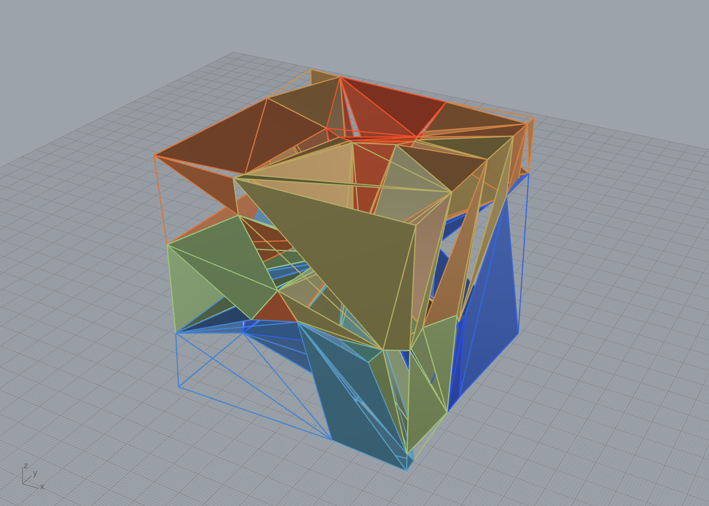

---

# 15. Evolution: From Baselines to the Current System

This chapter is cross-cutting. The preceding chapters describe each subsystem
as it stands; this one narrates how it got there. The repository is not a fresh
build. It is a sequence of measured deltas over named baselines, each baseline a
shipping implementation rather than a paper abstraction, each delta benchmarked
on the same instances before and after. The discipline is stated in the
research-workflow rules: the baseline is the current Frahan implementation, the
data is real (ETH1100 dry stone, Botticino GPR, Stanford scans), the metric is
mesh-accurate rather than bounding-box, and the truth criterion is live visual
validation, not a self-reported number (`outputs/2026-06-03/RESEARCH_MATH_WORKFLOW_V2.md`).

The originality scheme of chapter 90 governs the verdicts here: a thing is
called `clean-room`, `evolved-fork`, `facade-over-primitives`, `direct-port`,
`vendored-library`, `original-research`, or `wrapper-of-native`, with
file-and-line or commit evidence and a licensing flag where one applies. The
OpenNest-lineage nester used in the 2D benchmarks is named **the reference
physics nester**; no competitor source sits in this tree. Every number below
traces to a committed benchmark output or an `[Algorithm]` attribute.

The evolution has a shape. Six threads each moved a baseline forward: the 2D
nester walked from an overlap-tolerant placement rule to a hole-aware exact
solver; the 3D packer moved from a heightmap proxy to mesh-accurate collision
with physics settling; the quarry block-cutter gained a full-3D pose and three
new Pareto axes; the masonry stack grew from a force-only check to a coupled
kinematic certificate and an executable imposition metric; the GPR layer added
crack-aware recovery and wire-saw-separable yield; and the surface packers and
the BFF runtime were rebuilt onto the hardened nesting engine and a single static
binary. The recurring lever across all of them is the shared numeric-hygiene
finding from the ROSES synthesis: recenter before computing, use a
scale-relative epsilon, and route booleans through a robust kernel
(`ROSES_top10_fabrication_synthesis.md`, section 6).

---

## 15.1 Two-dimensional nesting: V506 to NFP-BLF to HoleNest to CNH

This is the longest and best-instrumented thread, and it sets the pattern for
the chapter.

### 15.1.1 The baseline and its defect

The originally shipped nester is `IrregularSheetFillV506` (FreeNest, GUID
`D5E7A2B1-...`). It is an NFP-assisted bottom-left placement that, by design,
permits a bounded overlap controlled by a **Trim Tolerance** and then
boolean-trims the contact. At the default Trim Tolerance of 0.1 it produces
visible overlaps; this is documented behaviour, not a fault (KB-6/KB-7;
`examples/10_pack2d/README.md`). The defect for fabrication is precisely this:
"packed" can mean "overlapping by up to the trim tolerance," which is not a
cut-ready layout.

### 15.1.2 First delta: the complete feasible region (V506 to FreeNestX)

`IrregularSheetFillNfpBlf` (FreeNestX, GUID `2d351646-...`) re-derives the
placement so that the feasible set is the **complete** inner-fit-minus-no-fit
region, making zero overlap a hard constraint of construction rather than a
post-hoc trim. For a part $B$ at fixed rotation on sheet $S$ with holes $\{H_l\}$
and placed parts $\{A_k\}$,

$$
\mathrm{feasible}(B)=\mathrm{IFP}(B,S)\ \setminus\ \Bigl(\bigcup_k \mathrm{NFP}(A_k,B)\Bigr)\ \setminus\ \Bigl(\bigcup_l \mathrm{NFP}(H_l,B)\Bigr),
$$

and the placement is the lexicographically lowest-then-leftmost vertex of that
region (Burke et al. 2006; Bennell and Oliveira 2009). The measured improvement
is recorded in source: a **mean wasted-area cut of 53.9% against V506 at zero
overlap**, validated against a Python reference
(`IrregularSheetFillNfpBlf.cs:21-22`;
`outputs/2026-06-03/pack2d_nfp_evolution/CHECKPOINT_4.md`). FreeNestX is the only
zero-overlap packer in the study to cross 80% utilisation with holes (82.0% to
89.6% on the hole fixtures, `examples/10_pack2d/README.md`).

> **Originality.** FreeNestX is an **evolved-fork** of V506: same NFP/BLF
> lineage, but a re-derived complete feasible region replaces the
> overlap-then-trim contract, with the 53.9% waste-cut measured delta
> (`IrregularSheetFillNfpBlf.cs:18-27`; commit `46ae0d2`).

### 15.1.3 Second delta: holes, a native kernel, and a depth certificate (CNH)

`ContactNfpHoleNester` (HoleNest, GUID `D5F10019-...`) evolves FreeNestX with
capabilities the fork lacks, and moves the engine out of the Grasshopper project
into the Rhino-free `Frahan.StonePack.Core`. The before/after of the engine
properties is the clearest single table in the thread.

| Property | V506 (FreeNest) | FreeNestX | CNH / HoleNest |
|---|---|---|---|
| Overlap guarantee | bounded, trimmed | zero by construction | zero, depth-certified always-on |
| Sheet holes | no | yes (no-fit only) | yes + part-in-part-hole nesting |
| Rotations | fixed list | fixed list | base + contact-adaptive edge alignment |
| Rect instances | general path | general path | exact integer shelf fast-path |
| Multi-sheet | no | no | greedy overflow |
| Rhino-free | no | no | **yes (CI-benchmarkable)** |
| Kernel | managed Clipper2 | managed Clipper2 | + native batched `nfp_kernel.dll` |

The three research increments are the contact-adaptive rotation set (augment the
uniform base $\{0,\tfrac{\pi}{2},\pi,\tfrac{3\pi}{2}\}$ with edge-alignment angles
$\theta=\alpha_h-\alpha_p$ and its flip $\theta+\pi$), the part-in-part-hole IFP
nesting (a filler's legal translations into a host hole $G$ are exactly
$\mathrm{IFP}(B,G)=\bigcap_{v\in\operatorname{hull}(B)}(G-v)$), and the
distance-based penetration certificate with a single micro-retreat along the
measured penetration vector. These are derived in full in chapter 1; the point
here is the arc, not the algebra. The native kernel wraps `nfp_kernel.dll`, which
vendors official Clipper2 (BSL-1.0) unmodified, giving a measured **8x** on the
batched-NFP path with only the marshalling owned in-repo (`NativeNfpKernel.cs:10-22`;
commit `ec8a060`).

### 15.1.4 Third delta: the rect fast-path and the keep-best fix

CNH v2 added a rectangle shelf fast-path: when every loop is an axis-aligned
rectangle, the NFP and IFP degenerate and the solve reduces to interval
arithmetic with no Clipper calls, using the exact integer rotation map
$(x,y)\mapsto(-y,x)$ so there is no trigonometric round-off
(`ContactNfpHoleNester.cs:635-738`). A completeness fallback discards the
fast-path result and runs the general engine if the sparser candidate set strands
any part (about 1 in 4000 in fuzzing). Multi-start keep-best runs $K$
deterministic part orders and keeps the densest **valid** layout. This last lever
carried a real bug worth recording because it shows the discipline at work: the
first multi-start landing computed `candValid` but never wrote `cand.Valid`, so
the keep-best comparison always saw `false` and degraded to "keep the last order
tried," which regressed the 60-irregular instance from 47 to 46 placed. The
verify pass root-caused it (not the NFP cache, which is structurally fresh per
pass, but the selection write), and the fix tracks a `bestValid` local. Post-fix,
$\mathrm{placed}(K{=}4)\ge\mathrm{placed}(K{=}1)$ on all twelve tight instances
and the densest 90-irregular result of any engine in the study (0.735) is
HoleNest multi-start (`outputs/2026-06-13/twod_decision/THREE_WAY_HEAD_TO_HEAD.md`;
commit `f4657e4`).

### 15.1.5 The honest head-to-head

The 2026-06-13 three-way study put vanilla OpenNest (the reference physics
nester, built from committed HEAD), its evolved hole/ThetaWise fork, and HoleNest
through the same instances, with an **independent shapely checker** scoring every
output so no engine's self-report is trusted.

| Lane | Reference physics nester | HoleNest | Reading |
|---|---|---|---|
| Irregular density (60/90 parts) | 0.751 / 0.710 | 0.730 / 0.711 | within ~3%, a wash |
| Rectangles (validity + speed) | 1 overlap on 20-rect; 0.5-1 s | 0 overlap; 5-54 ms | HoleNest 15-100x, always valid |
| Outline strip density (Sparrow) | wins by 6-10% | loses | honest boundary, unchanged |
| Determinism | stochastic relaxation | deterministic | reproducible cut layouts |

The honesty boundary is held in source: on pure outline strip packing the
reference physics nester still wins density by 6 to 10 percent, and no universal
"2x better" claim is made there. HoleNest's win is the hole-aware lane (where the
reference is invalid because it ignores holes), the rectangle lane (speed and
validity), and the determinism property. On the true-hole lane CNH is
**54x faster and valid** where Sparrow is invalid, and the rect fast-path is
about 22,000x faster (`HOLE_PACKER_MATH_AND_BENCHMARK.md`, sections 2-3).

### 15.1.6 The consolidation ruling

The thread ends in an architecture decision rather than another algorithm. A
2026-06-13 code-and-math-and-performance comparison found that as exposed in the
shipped components, HoleNest is a strict superset of FreeNestX: FreeNestX's
component calls only the 7-argument legacy constructor that forces the
concave-overlap verify off (KB-4), so its advanced math (multi-start, compaction,
GLS reinsertion) is dormant dead code unreachable from the canvas. The ruling is
fold-then-hide: port FreeNestX's eight unique UI features into HoleNest first, so
the fold is honest, then mark FreeNestX `[Obsolete]` and `GH_Exposure.hidden`
with its GUID preserved. The older V1/V2/V3/V506 standalones are already hidden
(`outputs/2026-06-13/twod_decision/FREENESTX_VS_HOLENEST_DECISION.md`,
`TWOD_PACKER_ARCHITECTURE_DECISION.md`). This is the 2D-V-solver phase-out the
collaborator-readiness plan mandated (`EVOLUTION_PLAN_COLLAB_READY.md`, HITL
ruling row 2).


---

## 15.2 Three-dimensional packing: heightmap proxy to mesh-accurate plus settle

The shipped 3D baseline is `Pack3DIrregularContainerComponent` (GUID
`B3E8A42F-...`) over `GreedyMeshHeightmapPacker`: a greedy deepest-bottom-left
placement on a per-cell vertical-interval ("heightmap column") collision of
mesh-derived footprints, scoring height growth against a back-left compactness
bias (Park and Han 2024; `Pack3DIrregularContainerComponent.cs:18`). Its defect,
stated in the plan, is that it packs footprint **proxies**, not true mesh
geometry: parts stack on columns rather than nesting into concavities, there is no
settling, and the reported fill is bounding-box based, so "packed" overstates true
density and says nothing about whether the pile is stable
(`outputs/2026-06-03/pack3d_evolution/PLAN.md`, section 1).

The evolution replaced the proxy with two stages. The constructive seed voxelises
each real ETH1100 stone and places it by deepest-bottom-left over true-3D FFT
feasibility (~33 to 37% compactness). Then a Bullet rigid-body settle drops the
seeded poses under a gravity ramp with Coulomb friction and convex-decomposition
(CoACD) collision, closing the voxel-quantisation gaps into real contact. The
measured arc on real stones, with the honest mesh-volume compactness metric, is:

| Stage | N | placed | compactness | interpenetration | COM-stable |
|---|---|---|---|---|---|
| heightmap baseline (B3E8A42F) | 30 | 30 | 33.8% | ~0 | 57% |
| constructive seed | 30 | 30 | 32.6% | ~0 | 67% |
| **+ physics settle** | 30 | 30 | **35.7%** | ~0 | all at rest |
| heightmap baseline | 60 | 32 | 33.x% | ~0 | - |
| constructive seed | 60 | 32 | 36.9% | ~0 | 78% |
| **+ physics settle** | 60 | 32 | **38.7%** | ~0 | all at rest |

The honest finding is recorded against the original "beat it 2x" directive: the
physics settle improves on the constructive seed (32.6 to 35.7%, 36.9 to 38.7%)
and on the shipping baseline (33.8%), but by ~1.05 to 1.15x, **not** 2x, because
greedy irregular-stone packing plateaus around 33 to 39% and a literal 66% sits
above the physical ceiling without active void-insertion and a snug container
(`outputs/2026-06-03/pack3d_evolution/CHECKPOINT_4.md`). The win the settle does
deliver is qualitative as much as quantitative: a physically valid pile, every
stone at rest, zero interpenetration, which is the "complete packing, not bounding
boxes" deliverable the proxy packer could not produce.

The backend decision was deliberate and is itself evolution evidence. Bullet (via
`BulletSharp.x64` 0.12.0, zlib, double precision) was chosen over Kangaroo 2
because Kangaroo's position-based rigid collision has no friction and its author
states it "isn't suitable for stacking"; Kangaroo is kept only for the 2D
Trencadis soft-settle (`BULLET_PHYSICS_BACKEND.md`). The dev pybullet harness and
the shipped `BulletSettleService` wrap the same engine, so the dev-proven numbers
transfer. The result is `Settle 3D (Physics)` (GUID `134785ac-...`), labelled as
the evolved volume packer while the heightmap components remain the validated
baseline, exactly the "keep one highly evolved 3D packer, supersession-document
the rest" ruling (`PackSettle3DComponent.cs:29-46`; `EVOLUTION_PLAN_COLLAB_READY.md`).

> **Originality.** The mesh-accurate seed plus drop-settle is an **evolved-fork**
> of the heightmap baseline with a measured (modest, honest) compactness delta and
> a new stability guarantee. The Bullet settle credits Zhuang et al. (2024) for
> dynamics-based packing of irregular 3D objects, Bullet (Coumans) via BulletSharp,
> CoACD (Wei et al. 2022) for convex pieces, and Heyman (1966) for the
> COM-over-support gate (`PackSettle3DComponent.cs:29-35`). The settle service and
> CoACD path are **wrapper-of-native** / **vendored-library** at the engine
> boundary; the seed-and-compose orchestration is ours.


---

## 15.3 Quarry block-cutting: BlockCutOpt 2020 to v2

The quarry thread takes a published serial algorithm and adds dimensions to it.
The baseline is Elkarmoty, Bondua and Bruno's (2020) BlockCutOpt: a brute-force
pose sweep that maximises the number of intact blocks a cutting lattice extracts
from a fractured deposit, with the lattice rotated only by yaw $\psi$ about the
vertical. The repository's faithful transcription is `BlockCutOptSolver` (a
clean-room pose-grid argmax, bit-identical to a serial reference,
`BlockCutOptSolver.cs:108-135`).

The v2 increments are catalogued by improvement number in chapter 3 and
summarised here as a before/after:

| Axis | BlockCutOpt 2020 | Frahan v2 | Evidence |
|---|---|---|---|
| Lattice pose | yaw $\psi$ only | full 3D $R=R_z(\psi)R_x(\theta)R_y(\phi)$ (I1) | `CuttingGrid.cs:84-110` |
| Intersection test | full mesh scan | OBB-triangle 13-axis SAT + BVH prune (I2/I4) | `ObbTriangleIntersection.cs:10-16` |
| Objective | block count | four-axis Pareto: count, kerf, yield, value (I6/I11) | `BlockCutOptParetoSolver.cs:82-95` |
| Cost model | none | BCSdbBV cutting-surface/value (Jalalian 2023) | `BlockValueModel.cs:54-58` |
| Cut sequence | none | AMRR plane-sequence planner (I9/I12) | `AmrrPlanner.cs:7-31` |

The pose generalisation is exact and back-compatible: setting $\theta=\phi=0$
collapses the rotated basis $U,V,W$ to $(\cos\psi,\sin\psi,0)$,
$(-\sin\psi,\cos\psi,0)$, $(0,0,1)$, recovering the BlockCutOpt-2020 $\psi$-only
behaviour bit-for-bit through a back-compat constructor. The new objective adds
Jalalian et al.'s (2023) BCSdbBV cutting-surface-area-over-value cost as a fourth
Pareto axis, so the solver trades block count against waste and value rather than
maximising count alone.

> **Originality.** The pose-sweep core is **clean-room** from Elkarmoty et al.
> (2020); the full-3D pose (I1), the four-axis Pareto/Omni solvers (I6/I11), and
> the multi-scale `RecoveryCascade` are **evolved-fork** increments, each with an
> `[Algorithm]` attribute naming the Frahan improvement over the named baseline
> (`BlockCutOptComponents.cs:98`, `:306-307`). The `RecoveryCascade` header was a
> flagged "novel" overclaim (E9) and has been softened to cite the BoEGE paper
> lineage; its lack of a GH consumer is an open roadmap item.

---

## 15.4 Masonry: RBE to CRA-coupled, plus Lambda and the generator

The masonry stack is the deepest evolution, executed as a planned sequence P0
through P7 (`outputs/2026-06-10/masonry_evolution/EVOLUTION_PLAN_MASONRY.md`).

### 15.4.1 Force-only to coupled-kinematic

The baseline verifier is Rigid-Block Equilibrium: a convex QP over contact forces
balancing self-weight, with Coulomb friction linearised to a polyhedral pyramid.
Force-only equilibrium has a known failure: Kao's H-model (a beam bridging two
columns, touching only on vertical faces with nothing underneath) is accepted by
RBE because a self-equilibrated horizontal friction squeeze appears to carry it,
even though nothing can produce that squeeze. The evolution (P2) couples statics
with virtual rigid-body kinematics so that a contact carries normal force only
where a consistent virtual motion lets it engage (Kao et al. 2022, Eqs. 8-14).
The repository does not ship IPOPT; it implements an **alternating convex
certificate** that is sound in the certifying direction, alternating a penalty RBE
force solve with a convex kinematic-certificate QP and a complementarity-driven
restriction step (`CraStabilityChecker.cs:31-49`). The H-model is now a
first-class regression: RBE accepts, CRA rejects
(`CraStabilityCheckerTests.cs:83-105`), and a `compas_cra` cross-fixture parity
suite pins agreement on shared cubes, stacks and an arch (commit `64ae069`,
parity 5/5).

A correctness fix in the same thread is the friction linearisation direction. A
circumscribed $K=4$ pyramid over-estimates the cone by up to
$1/\cos(\pi/4)=\sqrt2\approx1.41$, certifying unstable walls as stable. The fix
inscribes the pyramid by shrinking the coefficient to
$\mu_{\text{eff}}=\mu\cos(\pi/K)$, a conservative under-approximation that the CRA
checker now passes by default (`FrictionConeBuilder.cs:105-130`;
`CraStabilityChecker.cs:90`). For a stability verdict this is the
highest-consequence correction in the whole repository, because an optimistic
"stable" is the most dangerous failure mode (ROSES synthesis section 3).

### 15.4.2 Performance: dense Dykstra to sparse ADMM to exact-joint coupling

The solver path was rebuilt for scale (P1.1). The dense managed QP was replaced
with a CSR-sparse OSQP-style ADMM (Stellato et al. 2020) with full Ruiz
equilibration and per-row $\rho$ to tame the mixed newton/metre/penalty scales
(`AdmmQpSolver.cs:108-145`). Separately, P1.2 stopped re-detecting contacts from
triangle meshes: a mesh contact detector splinters 40 stones into ~125
sub-interfaces and ~612 contact vertices, ill-conditioning the QP. The exact-joint
assembler emits one planar-quad interface per adjacent stone pair directly from
the shared generator edge, a **~27x speedup of the equilibrium QP** on the 40-stone
generated wall (exact interfaces vs the ~612 splintered contact vertices the mesh
detector produced) and the reason CRA certifies generated walls
(commit `a843027`; `Cra_GeneratedWall_Certified`).

### 15.4.3 The new metrics: Lambda, the J interlock score, and the building

P3 evolved the wall generator (power diagram, Lloyd, coursing morph, sliver cull,
and an original interlock score $J$ penalising aligned running joints and "+"
junctions). P4 made the top-down/bottom-up balance executable as the imposition
metric

$$
\Lambda=\frac{\sum_i \lambda_i\,\mathrm{vol}(\text{stone}_i)}{\sum_i \mathrm{vol}(\text{stone}_i)},\qquad \lambda_i=\frac{\mathrm{vol}(\text{stone}_i\setminus\text{cell}_i)}{\mathrm{vol}(\text{stone}_i)},
$$

with $\Lambda\approx1$ full imposition (sawn ashlar) and $\Lambda\approx0$ pure
negotiation (stones as found). The Cyclopean datum is Clifford and McGee's (2018)
$\Lambda\approx0.27$; the repository reports $\Lambda=0.194$ on ETH1100, better
than the datum (`StoneCellAssignmentEthBenchmarkTests.cs:14`). P5 upgraded the
rubble drop-settle objective (Furrer support/COM plus Johns under-void candidate
ranking), P6 added the xBIM IFC terminal, and P7 composed it all into a
multi-container IFC castle (one `.ifc`, 8 containers, 123 parts, each
CRA-certified; commit `6e684b5`). Lambda, $J$, and the CRA instability field are
the three numbers every masonry example reports from P4 onward.

> **Originality.** RBE and the ADMM solver are **clean-room** from cited papers;
> the CRA soundness certificate, the $J$ interlock metric, and the Lambda
> formalisation are **original-research** (A-candidate, prior-art sweep pending per
> AGENTS.md section 9); the exact-joint assembler is **clean-room** geometry; the
> carve-back is **facade-over-primitives** over the CGAL boolean kernel. One
> citation flag remains open: `BestFitPackComponent.cs:30` attributes a likely
> fabricated 2017 NCCR paper whose real lineage is Furrer (2017) / Johns (2020)
> (E5).


---

## 15.5 GPR additions: RecoveryCascade and the staged guillotine packer

The GPR thread is additive rather than a replacement: it gave the quarry packers
fracture awareness. `RecoveryCascade` is a multi-scale reject-recover packer that
partitions a candidate block into kept and cracked regions by whether any DFN
triangle intersects it, recurses at a finer scale on the cracked remainder, and
reduces exactly to the `BlockCutOpt` baseline at a single scale
(`RecoveryCascade.cs:26-29`, `:91-119`). `FractureBlockPack` is the
uncertainty-safe yield engine of example 09: a wire-saw **staged guillotine**
packer whose blocks are separable by full-width saw passes, trading raw density
for fabricability. The measured trade is recorded: mode-5 wire-saw-separable yield
49.3% at 100% separability versus a voxel-DLBF 53.3% at 0% separability, costed by
Jalalian's I11 saw objective (memory `project_gpr_fracture_capability`). Both are
folded into the same BoEGE master paper rather than a separate publication, and
the paper passed a five-reviewer re-review at accept.

> **Originality.** `RecoveryCascade` is **evolved-fork** (multi-scale recursion
> over BlockCutOpt, reduces to baseline at $S=1$); `FractureBlockPack` is
> **facade-over-primitives**, a self-contained recovery engine. A flagged risk is
> that `FractureBlockPack` does **not** call `RecoveryCascade` or
> `BlockCutOptSolver`, so a silent-disagreement between the two recovery paths is
> possible and is an open roadmap item.

---

## 15.6 Surface packers and BFF: onto the hardened engine and a single static exe

Two infrastructure evolutions land last. First, both surface packers (`Pack
Surfaces`, `Pack On Surface`) were moved off `IrregularSheetFillV506` onto the
deterministic HoleNest engine (`ContactNfpHoleNester.PackSheets`: exact NFP-BLF,
multi-start, zero overlap) and adopted HoleNest's self-trigger background pattern
(previous result stays visible, live progress, stable bbox loop-guard hash) in
place of `GH_TaskCapableComponent`. The async lineage itself evolved: Sheet Nest
went async, was reverted to synchronous to kill an endless re-solve loop
(commit `0a56dfb`), then restored as a self-trigger flag with a stable bbox hash
that progresses without starving or looping (`7d46ec8`). Back-compatibility was
held exactly: GUIDs unchanged, outputs unchanged, the four V506-only controls made
inert and documented (commit `05c7e82`).

Second, the Boundary First Flattening runtime (Sawhney and Crane 2017, used by the
Surface Chart) was recompiled from the GeometryCollective source as a **fully
static single executable** via MSYS2 mingw64 with static SuiteSparse and OpenBLAS
archives. External dependencies drop to KERNEL32 and msvcrt only (objdump
verified); the deploy shrinks from **~67 MB across an exe plus 17 DLLs to ~38 MB
in one self-contained exe** (`install/tools`: 18 files to 2). This also fixed a
latent break: the deployed `bff-command-line.exe` had shipped with none of its 17
DLLs, so BFF was non-functional from the `.gha` folder (exit 0, zero UVs). The
new exe needs no siblings, produces byte-identical UV flattening to the reference
build, and was validated end-to-end (dome to chart to 18/18 placed, valid, curves
exactly on surface; commit `d1b5c5b`).

> **Originality.** The surface packers are **facade-over-primitives** recomposed
> onto the HoleNest engine; the integration delta is real (deterministic,
> verified, zero-overlap nesting replacing an overlap-tolerant one). BFF remains a
> **vendored-library** (Sawhney and Crane 2017); the static-link rebuild is a
> packaging change, not an algorithm change, and still owes a `THIRD_PARTY_NOTICES`
> row per the licensing register.


---

## 15.7 Status and what is left

The evolution is real but incomplete, and the honest gaps are tracked.

- **2D fold not yet executed.** The fold-FreeNestX-into-HoleNest port (eight UI
  features, then hide) is decided but not landed; until it is, the plugin ships
  two NFP nesters and FreeNestX's shipped path still runs no concave-overlap
  verify (KB-4). *Medium.*
- **3D "2x" narrative.** The compactness gain over the heightmap baseline is
  ~1.05 to 1.15x, not the original 2x target; the ROSES roadmap keeps a
  mesh-accurate-port item open to fix the narrative and push past ~35% with active
  void-insertion. *Medium.*
- **CRA convergence at scale.** The ADMM degrades past ~50 interfaces; the
  LS-first certificate mitigates wall-scale checks but per-element verification
  remains the pattern for large mixed assemblies, and conditioning to 300
  interfaces is an open benchmark item. *High.*
- **GPR recovery-path divergence.** `FractureBlockPack` and `RecoveryCascade` are
  separate engines with no shared call path; a silent-disagreement test is owed.
  *High.*
- **Open citation and licensing flags.** The fabricated Best-Fit citation (E5),
  the "Phase correlator FFT" wording over a direct-correlation implementation, and
  the missing `THIRD_PARTY_NOTICES.md` for the BFF numeric stack must close before
  external review (AGENTS.md section 9; licensing register rows 10, 13). *Medium.*
- **Prior-art sweeps pending.** The $J$ interlock metric, the Lambda
  formalisation, the CRA certificate, and the projection bootstrap are all
  A-candidate; none may be asserted "novel" until the sweep completes. *Medium.*

The one-line reading: across six threads the repository moved from
overlap-tolerant, proxy-based, force-only, single-axis baselines to
zero-overlap-certified, mesh-accurate, kinematically-coupled, multi-axis
successors, every step measured against the shipping predecessor on real data,
with the modest-but-honest deltas reported as modest and the genuine wins
(validity, determinism, stability, fabricability) reported where they are real.

---

## References (this chapter)

- Burke, E.K., Hellier, R., Kendall, G., Whitwell, G. (2006). A new bottom-left-fill heuristic algorithm for the two-dimensional irregular packing problem. *Operations Research* 54(3):587-601. DOI 10.1287/opre.1060.0293.
- Bennell, J.A., Oliveira, J.F. (2009). A tutorial in irregular shape packing problems. *Journal of the Operational Research Society* 60(S1):S93-S105. DOI 10.1057/jors.2008.169.
- Park, J., Han, S. (2024). Tree-packing for irregular 3D containers (tree-search 3D bin packing / orthogonal-block packing).
- Chehrazad, R., Roose, D., Wauters, T. (2025). A fast and scalable deepest-left-bottom-fill algorithm for the 3D bin packing problem. *International Journal of Production Research* 63:6606-6629. DOI 10.1080/00207543.2025.2478434.
- Zhuang, Q., Chen, Z., He, K., Cao, J., Wang, W. (2024). Dynamics simulation-based packing of irregular 3D objects. *Computers and Graphics* 123:103996. DOI 10.1016/j.cag.2024.103996.
- Wei, X., Liu, M., Ling, Z., Su, H. (2022). Approximate convex decomposition for 3D meshes with collision-aware concavity and tree search (CoACD). *ACM Transactions on Graphics* 41(4):42. DOI 10.1145/3528223.3530103.
- Elkarmoty, M., Bondua, S., Bruno, R. (2020). Mechanized in-situ determination of joint-related and yield-related rock-mass parameters during dimension stone block extraction. *Resources Policy* 68:101761. DOI 10.1016/j.resourpol.2020.101761.
- Jalalian, M.H., Bagherpour, R., Khoshouei, M. (2023). Environmentally sustainable mining in quarries to reduce waste production and loss of resources using the developed optimization algorithm (BCSdbBV). *Scientific Reports* 13:22183. DOI 10.1038/s41598-023-49633-w.
- Kao, G.T.-C., Iannuzzo, A., Thomaszewski, B., Coros, S., Van Mele, T., Block, P. (2022). Coupled Rigid-Block Analysis: stability-aware design of complex discrete-element assemblies. *Computer-Aided Design* 146:103216. DOI 10.1016/j.cad.2022.103216.
- Stellato, B., Banjac, G., Goulart, P., Bemporad, A., Boyd, S. (2020). OSQP: an operator splitting solver for quadratic programs. *Mathematical Programming Computation* 12:637-672. DOI 10.1007/s12532-020-00179-2.
- Heyman, J. (1966). The stone skeleton. *International Journal of Solids and Structures* 2(2):249-279. DOI 10.1016/0020-7683(66)90018-7.
- Furrer, F., Wermelinger, M., Yoshida, H., Gramazio, F., Kohler, M., Siegwart, R., Hutter, M. (2017). Autonomous robotic stone stacking with online next best object target pose planning. IEEE ICRA. DOI 10.1109/ICRA.2017.7989273.
- Johns, R.L., Wermelinger, M., Mascaro, R., Jud, D., Gramazio, F., Kohler, M., Chli, M., Hutter, M. (2020). Autonomous dry stone. *Construction Robotics* 4:127-140. DOI 10.1007/s41693-020-00037-6.
- Clifford, B., McGee, W. (2018). Cyclopean Cannibalism: a method for recycling rubble. ACADIA 2018 (Disciplines and Disruption).
- Sawhney, R., Crane, K. (2017). Boundary First Flattening. *ACM Transactions on Graphics* 37(1):5. DOI 10.1145/3132705.

---

# Originality Matrix

Sole author: Independent Research. Open data, open source. No university
affiliation.

This is the binding originality ledger for the thesis. Every shipped
component (or component family) across all fifteen chapters is classified
into exactly one originality class, with file-and-line evidence drawn from
its `[Algorithm]` attribute, its Core engine, and the committed benchmark.
The honesty convention of `AGENTS.md` §9 governs: a thing is called original
only with a prior-art sweep behind it, an extension of prior work is named as
such, and vendored third-party code is named by its upstream and licence. A
result is reported, not validated, until visually confirmed on the canvas.

The seven classes are:

- **clean-room** — built from published mathematics, no upstream source in
  the tree.
- **evolved-fork** — extends a documented baseline (in-repo or published)
  with a stated, measured delta.
- **facade-over-primitives** — a monolith composing our own published Core
  primitives; adds orchestration, not a new algorithm.
- **direct-port** — a line-by-line port of an external open-source library.
- **vendored-library** — we ship or link a third-party library unmodified;
  only the marshalling is ours.
- **original-research** — Frahan-novel, A-candidate pending a prior-art
  sweep.
- **wrapper-of-native** — a Grasshopper wrapper over a native exe or DLL.

Clean-room language note. The OpenNest-lineage physics nester referenced in
the benchmarks is named "the reference physics nester" (or "evolved fork");
no competitor source is copied into this tree. Academic sources are cited by
the `[Algorithm]` attribute model.

A component family that spans more than one chapter is detailed once at its
primary chapter and cross-referenced elsewhere; the whole-repo summary counts
each family once.

---

## Chapter 01 — Two-Dimensional Nesting and Trencadís

| Component (family) | Class | Evidence |
|---|---|---|
| **IrregularSheetFillNfpBlf** / Freeform Sheet Nest (Exact NFP) (FreeNestX) | evolved-fork | `[Algorithm]` `IrregularSheetFillNfpBlfComponent.cs:24-32` (Burke 2006 DOI 10.1287/opre.1060.0293; Bennell-Oliveira 2009 DOI 10.1057/jors.2008.169; Clipper2 BSL-1.0). Feasible-region contract `IrregularSheetFillNfpBlf.cs:18-27`. Clean-room math base; the evolved-fork delta is over V506's overlap-then-trim. Measured 53.9% mean waste-cut vs V506 at zero overlap (`IrregularSheetFillNfpBlf.cs:21-22`; `outputs/2026-06-03/pack2d_nfp_evolution`). |
| **ContactNfpHoleNester** / Sheet Nest (Hole-Aware) (CNH) | evolved-fork | `[Algorithm]` `HoleNestComponent.cs:25-36` (clean-room NFP/BLF/IFP base + "Frahan ContactNfpHoleNester evolution study"). Core engine `ContactNfpHoleNester.cs:10-33` (contract), `:1281-1330` (contact rotations), `:1332-1352` (IFP = intersect over hull vertices), `:1777-1798` (penetration depth), `:1728-1748` (micro-retreat), `:635-738` (rect fast-path), `:243-292` (multi-start). Benchmark `outputs/2026-06-12/hole_packer_evolution`: 60.7 ms valid 12/12 vs reference physics nester (Sparrow) 3255 ms invalid (~54x and valid where the reference fails); fast-path 0.148 ms (146x native shelf). Also the engine consumed by chapters 07 and 14. |
| **IrregularSheetFillV506** / Freeform Sheet Nest (FreeNest) | evolved-fork | `[Algorithm]` `Pack2DIrregularSheetV506Component.cs:23-27` (NFP-assisted BLF; Bennell-Oliveira tutorial). `[Obsolete]` `Exposure=hidden` `:56-57`. Overlap-then-trim documented by design in `examples/10_pack2d/README.md` (KB-6/KB-7). The FreeNestX evolution baseline; now phased out per the 2D-V-solver decision. |
| **IrregularSheetFillComponent** / Frahan Sheet Pack (Unified) (FreeNestU) | facade-over-primitives | `[Algorithm]` `IrregularSheetFillComponent.cs:32-33` ("Variant dispatcher V1/V2/V3/V506; Frahan-original strategy selector") over Burke 2007 + Bennell-Oliveira 2008. Adds no new algorithm; dispatches existing nesting variants behind one box. |
| **NfpPack2DComponent** / 2D NFP Pack | clean-room | `[Algorithm]` `NfpPack2DComponent.cs:11-12` (Burke 2007 DOI 10.1016/j.ejor.2006.03.011; Bennell-Oliveira 2008 DOI 10.1057/jors.2008.169). Citation-only; no upstream nesting source in the tree. |
| **NativeNfpKernel** (`nfp_kernel.dll`) | vendored-library | `NativeNfpKernel.cs:10-22`: "native/nfp_kernel/nfp_kernel.dll, vendored official Clipper2 C++" on the Int64 lane; only the marshalling is ours. Clipper2 BSL-1.0 (no copyleft). Consumed at `ContactNfpHoleNester.cs:924-930`. ~8x batched-NFP wall-time (`NativeNfpKernel.cs:10-22`). |
| **Pack2DTrencadisCatalogComponent** / Trencadis Catalog Pack | facade-over-primitives | `[Algorithm]` `Pack2DTrencadisCatalogComponent.cs:37-38` ("CVD-Lloyd interior seeding" Lloyd 1982; "Slab-partitioned Voronoi catalog; Frahan-original Trencadis extension"; precedent Battiato 2013 `:42`). Composes `CvdLloyd2d` + `HungarianAssignment` primitives. 28/28 placed in 53 ms (`examples/12_trencadis/README.md`). |
| **CvdLloyd2d** (CVD-Lloyd seed generator) | clean-room | `CvdLloyd2d.cs:14-22` (uniform-density CVD; matches `wiki/primitives/cvd_lloyd.md`); Lloyd 1982 relaxation, grid-discretised, stop at half-grid-step move (`:30-108`). Math-only, no upstream code. |
| **HungarianAssignment** (Kuhn-Munkres O(n³)) | clean-room | `HungarianAssignment.cs:11-15` ("classical shortest augmenting path formulation (Bourgeois-Lassalle 1971), standard textbook implementation"); potentials u/v with non-negative reduced costs (`:23-85`). Textbook math (Kuhn 1955 / Munkres 1957 / Bourgeois-Lassalle 1971), no upstream code. Reused by the masonry Lambda engine (Ch. 05) and the Trencadis catalog. |
| **Pack2DTrencadisComponent** / Trencadis Pack (greedy NFP-slide) | facade-over-primitives | `[Algorithm]` `Pack2DTrencadisComponent.cs:37-38` ("Trencadis greedy pack basic" Gaudi Park Guell; "NFP boundary slide" Minkowski-difference sampler). Battiato 2013 sect 4 cut budget `TrencadisFill.cs:13-27`. Standalone box is a skeleton returning empty (`examples/12_trencadis/README.md`) — see Roadmap (ghost component). |
| **Pack2DTrencadisDynamicComponent** / Trencadis Dynamic Settle | facade-over-primitives | `[Algorithm]` `Pack2DTrencadisDynamicComponent.cs:61-62` ("Trencadis dynamic settle" Frahan-original; "Kangaroo 2 goal-based physics" Daniel Piker). 55.1% physics vs 52.7% greedy (`examples/12_trencadis/README.md`). |
| **TrencadisEdgeMatchComponent** / Trencadis EdgeMatch | facade-over-primitives | `[Algorithm]` `TrencadisEdgeMatchComponent.cs:28-29` ("EdgeMatch-powered Trencadis pack"; "Frahan-original alternative to Battiato 2013 CVD+GVF stack"; "Beam-search assembly solver" Frahan-original). Composes the EdgeMatching primitives (Ch. 08). |
| **Pack2DTrencadisPipelineComponent** / Trencadis Pipeline | facade-over-primitives | `[Algorithm]` `Pack2DTrencadisPipelineComponent.cs:59-62` (greedy pack + NFP slide + CVD-Lloyd seeding + Kangaroo 2 settle, all cited to in-repo primitives + Daniel Piker physics). |

---

## Chapter 02 — Three-Dimensional Packing and Settling

| Component (family) | Class | Evidence |
|---|---|---|
| **Heightmap packers** (`GreedyHeightmapPacker`, `OrientedMeshHeightmap`, `MeshPileHeightmap`, `IrregularMeshContainer`) | clean-room | Deepest-bottom-left / DLBF substrate cited to Chehrazad, Roose, Wauters 2025 (`Pack3DIrregularComponent.cs:20-23`, GUID `E36C3F7D`). Two-surface mesh-pile proxy, per-cell vertical-interval test, six-orientation down-axis search, ray-cast container labelled "Frahan-original mesh-pile heightmap" (`Pack3DMeshHeightmapComponent.cs:20-21`, GUID `A16D6426`). `Heightmap.cs:8-69`, `OrientedMeshHeightmap.cs:8-292`, `MeshPileHeightmap.cs:79-271`, `IrregularMeshContainer.cs:52-176`. **Citation flag:** sibling `Pack3DIrregularContainerComponent.cs:18` credits "Park and Han 2024" (`[R8]`, no DOI, placeholder) for the same method — reconcile (Roadmap medium). |
| **BlockPackTreeComponent** / Block Pack (Tree) (DLBF guillotine forest) | evolved-fork | `[Algorithm]` `BlockPackTreeComponent.cs:30-31` (Kim 2025 Computation 13:211 DOI 10.3390/computation13090211, CC BY 4.0; Jalalian 2023 BCSdbBV cut-area term). GUID `C2D3E4F5`. Frahan deltas: deterministic master seed, saw kerf, forbidden boxes, parallel forest (`:22-28`, `:154-158`). Live 12/12, score 65.11, deterministic (`examples/11_pack3d/README.md`). |
| **Dlbf3dMixedSizePacker** (3D deepest-left-bottom-fill mixed-size) | clean-room | `Dlbf3dMixedSizePacker.cs:8-37`, `:186-220` (lexicographic deepest-left-bottom), `:127-143` (best-of-orientation, default off). `[Algorithm]` `BlockCutOptHeterogeneousComponents.cs:42` (Chehrazad, Roose, Wauters 2025, DOI 10.1080/00207543.2025.2478434). Standalone as Frahan Mixed-Size Block Pack 3D (GUID `F2D0BC18`). |
| **HeteroExt** (`FrahanHeterogeneousExtractionComponent`) | facade-over-primitives | `[Algorithm]` `BlockCutOptHeterogeneousComponents.cs:169` ("Frahan-original ... Composes Elkarmoty 2020 and Chehrazad 2025 ... the composition and the heterogeneity model are the contribution"). GUID `F2D0BC19`. Composes BlockCutOpt + DLBF + monument packer; `[RelatedComponent]` back-pointers to the standalone primitives (`:170-176`). Detailed once here; also in Ch. 03 / Ch. 13 / Ch. 14. |
| **Settle 3D (Physics)** (`PackSettle3DComponent` / `BulletSettleService`) | clean-room (over vendored) | `[Algorithm]` `PackSettle3DComponent.cs:29-35` (Zhuang et al. 2024 DOI 10.1016/j.cag.2024.103996 dynamics packing; Bullet via BulletSharp zlib; CoACD Wei et al. 2022; Heyman 1966 COM-over-support). GUID `134785ac`. Gravity-ramp seeding `BulletSettleService.cs:135-141`, centroid-relative decode `:62-70`. The dynamics framing + gravity-ramp + transform decode are ours; Bullet/BulletSharp/CoACD are vendored. |
| **SlabCutByFractures** / slab half-space cutter | clean-room | `[Algorithm]` `SlabCutByFracturesComponent.cs:33-39` ("Frahan-original" convex half-space clipping, Sutherland-Hodgman family; Goodman-Shi 1985 block theory `SlabCutter.cs:29-33`). GUID `C2B3D4E5`. Exact for convex input; opt-in CGAL backend for non-convex (`:84-92`). |
| **Slab Cut By Tool Mesh (CGAL)** / **Vertical Fracture Planes From Curves** | wrapper-of-native / clean-room | CGAL boolean path is wrapper-of-native over the GPL `frahan_cgal` shim (licensing register row 4); the curve-to-plane lift (GUID `F2D05A09`) is clean-room elementary geometry. |
| Example 15 statue-to-blocks decomposition (bed-bounded real-face grid) | facade-over-primitives | Study-level composition: 0.5 m grid × CGAL boolean over a Geogram-cleaned 2-manifold; recovered-volume ratio 1.0000 by `VolumeMassProperties` (`examples/15_statue_to_blocks/README.md`). Composes Geogram clean-up + CGAL boolean; no Core algorithm class. |

---

## Chapter 03 — Quarry Block-Cutting Optimization

| Component (family) | Class | Evidence |
|---|---|---|
| **BlockCutOptSolver** (pose-sweep max-cover) | clean-room | Core `BlockCutOptSolver.cs:108-135` (pose grid + parallel argmax, bit-identical to serial reference), `:261-268` (kerf film). GH `BlockCutOptSolveComponent` guid `F2D0BC02` `[Algorithm("BlockCutOpt brute-force search","Elkarmoty Bondua Bruno 2020, Resources Policy 68:101761",Doi=10.1016/j.resourpol.2020.101761)]` `BlockCutOptComponents.cs:97`. `README.md:46-50`: upstream is private C++, no source in tree. |
| **CuttingGrid** full-3D rotation (I1 pose tilt) | evolved-fork | `CuttingGrid.cs:84-110` (pre-multiplied U,V,W), `:77-78/127-129` (kerf pitch). `[Algorithm("Full 3D rotation grid","Frahan I1 improvement over Elkarmoty 2020 psi-only")]` `BlockCutOptComponents.cs:98`. `README.md:185`. psi-only back-compat constructor `OrientedBlock.cs:40-50` collapses to BlockCutOpt 2020. |
| **ObbTriangleIntersection + TriangleAabbBvh** (I2/I4 predicate) | clean-room | `ObbTriangleIntersection.cs:10-16` (13-axis SAT), used `BlockCutOptSolver.cs:243-256`. `[Algorithm("Triangle-AABB BVH pruning","Akenine-Moller 2001 fast 3D triangle-box overlap")]` `BlockCutOptComponents.cs:99`. `README.md:186-188`. |
| **BlockCutOptParetoSolver + BlockCutOptOmniSolver** (I6/I11 four-axis) | evolved-fork | `BlockCutOptParetoSolver.cs:82-95`, `ParetoPoint.Dominates` `ParetoPoint.cs:54-71`, `BlockCutOptOmniSolver.cs:115-178`. GH `BlockCutOptOmniSolveComponent` guid `F2D0BC04` `[Algorithm]` pair `BlockCutOptComponents.cs:306-307` (Elkarmoty 2020 + Jalalian 2023 BCSdbBV). `README.md:190,195`. |
| **BlockValueModel** BCSdbBV cost objective (I11) | clean-room | `BlockValueModel.cs:54-58` (SurfaceArea S=2(LxLy+LyLz+LxLz)), `:22-27` (BV). `ParetoPoint.cs:12`. `README.md:195` cites Jalalian, M.H. et al. 2023 DOI 10.1038/s41598-023-49633-w. Faithful axis from published math. |
| **RecoveryCascade** (multi-scale reject-recover) | evolved-fork | `RecoveryCascade.cs:26-29` (W(R,s) recursion), `:91-119` (kept/cracked partition by !bvh.AnyTriangleIntersects), `:21-24` (reduces to baseline at one scale), `:31-36` (BoEGE / Murugean 2026 cite softening, flag E9). No GH consumer — see Roadmap (high). Also detailed in Ch. 04. |
| **AmrrPlanner** (I9 plane sequence) + **SharedEdgeSlicer** (I12) | clean-room | `AmrrPlanner.cs:7-31`, `:132-178` (cut loop), `:85` (AMRR = removed volume / cutting time). GH `BlockCutOptAmrrPlanComponent` guid `F2D0BC03` `[Algorithm("AMRR in-block plane-sequence cutting","Shao, Liu, Gao 2022")]` `BlockCutOptComponents.cs:215`. `README.md:193,196` (Shao 2022 DOI 10.3390/pr10040695; Minetto 2017 DOI 10.1016/j.cad.2017.07.001). |
| **FractureBlockPack** (uncertainty-safe yield, example 09) | facade-over-primitives | `FractureBlockPackComponent.cs:27` (class), `:37` (guid `A7E0B0F3`), `:9-25` header: self-contained recovery engine that does NOT call RecoveryCascade / BlockCutOptSolver / Dlbf3dMixedSizePacker (silent-disagreement risk — Roadmap high). Fully managed, no native shim. |
| **HeteroExt** (heterogeneous quarry extraction) | facade-over-primitives | See Ch. 02 row. `[Algorithm]` `BlockCutOptHeterogeneousComponents.cs:169`; DLBF `[Algorithm]` `:42` (Chehrazad Roose Wauters 2025). |
| **FrahanSawBedScheduleComponent** (Saw Bed Schedule) | clean-room | `[Algorithm("Greedy LPT list scheduling","Graham 1969, SIAM J. Appl. Math. 17(2):416-429",Doi=10.1137/0117039)]` `QuarryCutOptComponents.cs:336`. Textbook LPT, no upstream code. |
| **Extraction Order Optimizer** | original-research | `[Algorithm]` note `QuarryCutOptComponents.cs:223` "no published scheduling algorithm matched". A-candidate, prior-art sweep pending (Roadmap low). |
| Guillotine cut staging (examples 24/25) | facade-over-primitives | Standard staged guillotine cutting (Gilmore-Gomory 1965 lineage); the contribution is the rendered, in-order, fabricable saw plan on real geometry, not an algorithm (`examples/24_guillotine_cut_sequence/README.md`). |
| Bed-bounded hexahedra + flat/oblique frontier (example 08) | facade-over-primitives | Study-level construction in the example generator (bed-plane fitting + packing objective); REPORTED not gated (`08_marble_cost_volume_metrics.json`). |

---

## Chapter 04 — GPR Fracture and Cavity Mapping

| Component (family) | Class | Evidence |
|---|---|---|
| **GprFileReader** + per-format readers (CSV/SEG-Y/MALA/pulseEKKO/IDS/GSSI) | clean-room / vendored-library | Per-format clean-room over open or public-domain specs (SEG-Y = SEG standard; pulseEKKO DT1/HD = USGS OFR 02-166, Lucius-Powers 1999; MALA/DZT/IDS decoded from open RGPR / BSD-3 readgssi). `GprFileReader.cs:23-51`. Dispatcher is a thin switch, no algorithm. Detailed by reader in Ch. 12. |
| **RadargramProcessor** filters (dewow / bg-removal / mute / t-gain / depth-equalize) | clean-room | Standard GPR processing (Annan 2009; Neal 2004), `RadargramProcessor.cs:100-182,310-332`. The contribution is the validated ordering and parameterisation, not the filters. |
| **Fft** (radix-2 Cooley-Tukey + Bluestein) | clean-room | `Fft.cs:16-18,30-149`. Numerical method (Cooley-Tukey 1965), not copyrightable; exact-length forward/inverse to match numpy.fft. |
| **HilbertEnergy** / analytic-signal envelope | clean-room | `Fft.cs:159-185`, `RadargramProcessor.cs:293-308`. Taner, Koehler, Sheriff 1979 complex-trace analysis, cited `GprFractureExtractComponent.cs:44`. |
| **StoltMigration** (f-k migration + cosine dip-taper) | clean-room (+ evolved anti-alias) | `RadargramProcessor.cs:199-291`, half-velocity `:208`, Jacobian `:259-267`, dip-taper `:235-244`. Stolt 1978, cited `GprFractureExtractComponent.cs:44`. The published method is clean-room; the cosine dip-taper is a small evolved anti-alias addition, not a new migration. |
| **FractureExtractor** (high-energy + dip-aware continuity) | evolved-fork | `FractureExtractor.cs:8-159`. Clean-room base = high-energy quantile + USGS Mirror Lake continuity (WRIR 99-4018C; Porsani 2006; Isakova 2021). The dip-aware shear-count continuity (`:76-130`) is the measured delta over the flat-horizon USGS test. GH GUID `A7E0B0F1`. |
| **GprPresets** (stone × frequency catalogue) | clean-room | `GprPresets.cs:7-25`. Calibration data, no algorithm; `IsEmpirical` flag (`:22-24`) distinguishes validated (`marble_600`, `granite_160`) from literature-default presets. |
| **FractureSurface** loft / reconstruct | clean-room / wrapper-of-native | Loft path clean-room elementary construction (`FractureSurface.cs:42-110`). Reconstruct path wrapper-of-native over geogram screened-Poisson (Kazhdan-Hoppe 2013, BSD-3 + bundled MIT PoissonRecon) and CGAL advancing-front (GPL), reached out-of-process (`:112-139`). |
| **FractureUncertainty** (position ladder + detection rung) | original-research | `FractureUncertainty.cs:6-220`. Three-rung position ladder (depth-growing velocity + time-zero + λ/4), detection rung with depth-aware Fresnel floor and `P_det` factorisation are the Frahan contribution; underlying physics cited (Porsani 2006; Xie 2021; Molron 2020; Dorn 2012). A-candidate, prior-art sweep pending. GH `GprFractureSurface3DComponent.cs:30`, GUID `A7E0B0F2`. |
| **Kriging** (simple kriging posterior) | clean-room | `Kriging.cs:8-29`. Ordinary kriging linear algebra (Cressie 1993; Rasmussen-Williams 2006); managed replacement for scikit-learn GPR. |
| **BedrockSurface** | clean-room | `BedrockSurface.cs:7-93`. Pure reduction + datum shift; deepest-reflector top-of-rock (Porsani 2006 / Isakova 2021). GH GUID `A7E0B0F1` (GprBedrockSurface). |
| **TinMerge** (k-NN inverse-distance weighting) | clean-room | `TinMerge.cs:54-122`. Shepard 1968 IDW with a scale-relative radius and recenter; no upstream code. |
| **TinPeelFilter** (border-peel scan cleaner) | clean-room | `TinPeelFilter.cs:7-163`. Border-peel logic (long-edge / vertical-facet / cap predicates) ported from the Fade2D land-survey reference's `peelOffIf`, no upstream code; cited in `CleanScanMeshComponent.cs:29-31`, GUID `A7E0B0F1`. |
| **Vector Fractures Loader** (shapefile fracture map, example 26) | vendored-library | NetTopologySuite.IO.Esri (ESRI Shapefile / OGC Simple Features); strike binning and render clean-room. Detailed in Ch. 12. |

---

## Chapter 05 — Masonry Equilibrium and Cyclopean Reassembly (CRA)

| Component (family) | Class | Evidence |
|---|---|---|
| **Masonry Stability (RBE)** | clean-room | `[Algorithm]` `MasonryStabilityRbeComponent.cs:69-71` (Kao et al. 2022 CAD 146:103216; Whiting et al. 2009 RBE precedent; compas_cra MIT cited, not copied). Equilibrium math `EquilibriumMatrixBuilder.cs:13-30,201-219`; linearised Coulomb cone `FrictionConeBuilder.cs:24-32`; inscribed-pyramid correction `:105-130`. Wires the sign-corrected `BuildPhysicsCorrected` at `:305`, not the legacy `Build`. Convex-QP force+moment balance, compression-only normals. |
| **Masonry Stability Check (CRA)** | original-research | `CraStabilityChecker.cs:17-50` (Kao H-model Eqs 8-11 cited); alternating-convex certificate `:154-186` is NOT in compas_cra (which uses non-convex IPOPT). A-candidate, soundness-certifying direction proven; H-model regression `CraStabilityCheckerTests.cs:83-105`; compas_cra parity `Program.cs:347-356`. Rejects self-stressed states RBE wrongly accepts. GUID `D5F10015`. |
| **AdmmQpSolver** | clean-room | `AdmmQpSolver.cs:6-51` (Stellato et al. 2020 OSQP, Math.Prog.Comp 12:637-672); ADMM iteration `:182-256`; masonry Ruiz equilibration `:108-145`. CSR-sparse, per-row rho. OSQP-style infrastructure with engineering deltas; no upstream OSQP source in tree. |
| **Polygonal Wall (Generator)** | original-research | `PolygonalWallGenerator.cs:7-34` (power diagram `:13-17`), interlock metric J `InterlockScore:310-384`. A-candidate (Kim 2024 does sequencing, not generation; sweep pending — Legakis 2001 closest prior). Hover credits Kim 2024 / Clifford-McGee 2018 / Lloyd 1982 at `PolygonalWallGeneratorComponent.cs:31-33`. GUID `D5F10014`. |
| **PolygonalWallAssembler** (exact-joint) | clean-room | `PolygonalWallAssembler.cs:8-30` exact planar-quad interface per adjacent pair from shared (u,v) edges; avoids mesh-contact-detector splintering of the equilibrium QP. Feeds the equilibrium builder; `Cra_GeneratedWall_Certified` `Program.cs:335`. |
| **Stone Cell Match (Lambda engine)** | original-research | `StoneCellAssignment.cs:8-37` (Lambda / lambda / gap formulas); composes the reused `HungarianAssigner:141-145` and voxel kernel. A-candidate Lambda formalisation (Clifford-McGee measured 0.27, never formalised; assignment published in Bruetting 2019 / Bukauskas 2019); ETH1100 datum `StoneCellAssignmentEthBenchmarkTests.cs:14,95`; reported Lambda = 0.194. GUID `D5F10016`. |
| **StoneCarveBack** (Cyclopean) | facade-over-primitives | `StoneCarveBack.cs:9-29` cites Clifford & McGee 2018 anti-nesting; exact booleans through the in-repo `CgalMeshBoolean:23-28` primitive; volume-validated in the battery. Composes booleans, adds no new algorithm. |
| **Rubble Wall Settle** | clean-room | `[Algorithm]` `RubbleWallSettleComponent.cs:35-36` (Heyman 1966 limit-state); Core `RubbleWallSettle.cs:9-32` from the signed-off Furrer 2017 / Johns 2020 prototype. Deterministic, non-penetrating, PCA flat-bedding + per-cell drop, Heyman COM-over-support. GUID `6514A1BB`. |
| **Ashlar Pack** | clean-room | `[Algorithm]` `AshlarPackComponent.cs:31-32` (Gramazio Kohler Eichenhofer 2017 NCCR running-bond). Tier-C grid stacking, AABB-first, translation-only. GUID `F1A2B3C4`. |
| **Best-Fit Inventory Pack** | clean-room | Core `BestFitInventoryPacker.cs:8-32` carries the correct Furrer 2017 / Johns 2020 lineage. **CITATION FLAG E5:** the GH facade `BestFitPackComponent.cs:30` attributes a likely-fabricated "Gramazio Kohler Eichenhofer 2017 CAD paper" — corrected to Furrer/Johns (see register and Roadmap). |

---

## Chapter 06 — Voussoir Geometry and Stereotomy

| Component (family) | Class | Evidence |
|---|---|---|
| **Arch Voussoirs** (`ArchVoussoirsComponent` / `VoussoirCellFactory.BuildArch`) | clean-room | `[Algorithm]` `ArchVoussoirsComponent.cs:31-36` (Frahan-original radial cell construction; geometric law Frezier 1737 / Monge 1798). GUID `D5F10012`. Intrados stationing `VoussoirCellFactory.cs:119-174`, outward-normal radial bed joint `:136-146`, catenary parameter solve `:412-432`. The upstream Voussoir plugin (Varela-Sousa) is a cited precedent (`:40`), not a dependency. 11/11 carved, 94.9% coverage (example 21). |
| **Pendentive Vault Voussoirs** (`PendentiveVaultVoussoirsComponent` / `BuildPendentiveVault`) | clean-room | `[Algorithm]` `PendentiveVaultVoussoirsComponent.cs:29-34` (Frahan-original square-grid-lifted sphere cell; Monge lines-of-curvature law). GUID `D5F10013`. Square-grid lift `VoussoirCellFactory.cs:244-256`, corner-on-sphere precondition `:230-234`, radial frustum cell `:269-313`. Rippmann-Block 2011 / RhinoVAULT named as design precedents (`:38`), not in-tree deps. 36/36 carved, 98.3% coverage (example 22). |
| **Inward-orientation fix** (`MakeHexahedron` signed-volume flip) | clean-room | `VoussoirCellFactory.cs:452-464`. Signed-volume sign as an orientation oracle; the precondition that makes the downstream CGAL trim return the carved voussoir rather than its complement. Closedness checked + warned (`ArchVoussoirsComponent.cs:163-165`, `PendentiveVaultVoussoirsComponent.cs:150-152`). |
| **CGAL trim** (digital ravalement, examples 21/22) | facade-over-primitives | Downstream trim runs through the in-repo `CgalMeshBoolean` primitive (GPL CGAL kernel in Rhino, managed BSP fallback headless); out of scope for this tab. The generator only produces correctly oriented input. |
| Voussoir Ingest / Stone Matcher / Pack Into Block | facade-over-primitives | Hungarian and bin-pack facades over the quarry assignment layer (`VoussoirRecord.cs:11-21`); documented with the masonry/quarry assignment chapters. Consume external (Varela-Sousa) cells only through the separate Ingest path. |

---

## Chapter 07 — Surface Packing and Conformal Unwrapping

| Component (family) | Class | Evidence |
|---|---|---|
| **PackOnSurfaceComponent** (BFF flatten + pack + lift) | facade-over-primitives | Orchestrates BFF flatten, 2D pack (`ContactNfpHoleNester`, Ch. 01), and barycentric lift. GUID `B7E4D9C1`. `[Algorithm]` `PackOnSurfaceComponent.cs:41` mis-credits "Floater 2003 mean value coordinates" (DOI 10.1016/S0167-8396(03)00002-5) — the shipped lift is plain barycentric, attributable to the mean-value-coordinate family (after Floater 2003), not MVC. Attribution defect, math correct (Roadmap medium, flag M-Floater). |
| **PackSurfacesComponent** (multi-chart, fabrication frames) | facade-over-primitives | Composes BFF chart + `SurfaceHoleNestBridge` + `ContactNfpHoleNester` + `BarycentricMapper2DTo3D`; emits rigid placement frame, full transform, max deviation (`PackSurfacesComponent.cs:56,425,613,655`). GUID `C4A8D2E1`. No new algorithm; self-trigger async, V506-only inputs inert. |
| **BFF runtime** (Boundary First Flattening) | vendored-library | External static `bff-command-line.exe`; Sawhney & Crane 2017 DOI 10.1145/3072959.3056432 (`SurfaceChartComponent.cs:43`). Permissive-as-published; owes a THIRD_PARTY_NOTICES row (licensing register). Static single-exe rebuild is a packaging change (commit `d1b5c5b`). |
| **ChartScaleComputer** (chart-scale recovery) | original-research | `ChartScaleComputer.cs:14-58` recovers one isotropic scalar s as the perimeter-weighted average of e^u. Frahan-original scale recovery over the conformal flatten; known global-scale limitation (Roadmap medium). |
| **BarycentricMapper2DTo3D** (inverse lift) | clean-room | `BarycentricMapper2DTo3D.cs:141-179` plain triangle barycentric interpolation (Cramer's rule on the 2D Gram system). SLM card `bff-surface-flatten.md:6` confirms "NO Floater-2003 MVC code present". O(P·F) linear scan, author ceiling ~2000 faces `:107` (Roadmap medium). |
| **ChartDistortionAnalyzer** (edge-stretch metric) | clean-room | `ChartDistortionAnalyzer.cs:96-98` scalar edge-length stretch. Cannot detect signed-area foldovers (Roadmap medium, flag M3). |
| **ChartFlatnessReport** (area-ratio symmetrised classifier) | clean-room | `ChartFlatnessReport.cs:90-101` per-face max(r,1/r); Frahan-original, not the BFF algorithm (`ChartFlatnessReportComponent.cs:23-24`, GUID `AB12C006`, filed on Surface Packing). One of the five `FrahanReport` types the audience terminal consumes (Ch. 13). |
| **FaceCornerUvTable** (seam-correct unwelded flat mesh) | clean-room | `FaceCornerUvTable.cs:37-56` keys UVs on (face, corner), three fresh vertices per triangle so seams never bridge; throws on a missing UV. Non-trivial seam engineering; no upstream code. |
| **SurfaceHoleNestBridge** (curve-to-loop) | clean-room | `SurfaceHoleNestBridge.cs:21` shared curve-to-loop: uniform sampling, proxy-deviation measure, CCW enforcement, WorldXY guard. No new algorithm; the single curve-to-loop seam. |
| **MeshObjIO** (OBJ chart I/O) | clean-room | Writes OBJ at raw world coords G10; no recenter, so far-from-origin (UTM) charts lose mantissa bits (Roadmap low, flag T1). |

The Surface Packing back end (BFF, geogram, CGAL shims) is reached
out-of-process and is absent from the default install; see the licensing
register for the copyleft routing.

---

## Chapter 08 — Edge-Matching and Fragment Reassembly

| Component (family) | Class | Evidence |
|---|---|---|
| **Boundary segmenter** (signed-turning descriptor) | clean-room | `[Algorithm]` `EdgeMatchSolveComponent.cs:23` ("Frahan-original arc-length curvature/torsion signature"); core `BoundarySegmenter.cs:151-189`. Rotation-invariant signed-turning signature per segment from the standard turning-function representation (Arkin 1991); no upstream code. |
| **Segment hash index** | clean-room (Frahan-original) | `[Algorithm]` `EdgeMatchSolveComponent.cs:24`; `SegmentHashKey.cs`. Quantised invariant-hash bucketing of segment signatures for candidate pruning; planarity-aware 2D/3D split. |
| **Phase correlator** (coarse lag) | clean-room | `[Algorithm]` `EdgeMatchSolveComponent.cs:25`; `PhaseCorrelator.cs:13-44`. Direct O(n²) circular L1 cross-correlation lag estimate. **Attribute wording flag:** named "Phase correlator FFT" but `:29-34` is direct cross-correlation, not a frequency-domain transform — reword to direct cross-correlation (register / Roadmap). |
| **Constrained ICP (2D/3D) + SVD Kabsch** | clean-room (algo) over vendored MathNet | `EdgeMatchSolveComponent.cs:26`; `ConstrainedIcp3D.cs:147-189`. Besl-McKay 1992 ICP loop with a Kabsch 1976 / Umeyama 1991 SVD rigid fit and reflection guard; the SVD itself is the vendored `MathNet.Numerics` kernel, the loop and constraints are ours. |
| **Order-preserving correspondence DP** | clean-room | `OrderedBoundaryMatcher.cs:24-37,100-167`. Dynamic-programming monotone non-crossing boundary correspondence (DTW substrate; Marcotte-Suri 1991 cited as the non-crossing idea, not ported); textbook DP, no upstream code. |
| **Initial transform builder** | clean-room | `InitialTransformBuilder.cs:16-65`. Plane-to-plane complement-orientation seed for ICP (Frenet frames in 3D); plumbing, no `[Algorithm]` attribute. Tier-D scaffolding. |
| **Soft-ICP refiner** (CPD + hinge) | clean-room / evolved-fork | `SoftIcp3DComponent.cs:43-51`; `SoftIcpRefiner.cs:299-527`. Soft correspondence is a CPD-style (Myronenko-Song 2010) E-step with a weighted-Kabsch M-step (Kabsch 1976/1978, vendored MathNet SVD `:49-51`). Evolved-fork delta: the unified contact-plus-non-penetration target redirection (+97% clearance). GUID `D5F1000E`. |
| **Projection bootstrap** | original-research | `ProjectionPairFinder.cs:16-48,481-678`. Per-facet projection bootstrap, antiparallel SE(3) lift composition, 3D-disposes verification gate. A-candidate; prior-art sweep pending (`AGENTS.md` §9). The geometric 3D path assembles only via this bootstrap (independent tessellation yields zero cross-panel hash hits). |
| **Horn registration kernel** | clean-room | `RigidTransformRecovery.cs:6-30`; consumed `GeoreferenceComponent.cs:36` (Ch. 11). Closed-form Horn 1987 unit-quaternion absolute orientation. One of three duplicate absolute-orientation routes (Roadmap low, refactor). |
| **Block Pair Match 3D** (VSA face partitioner) | facade-over-primitives (stub partitioner) | `[Algorithm(... Frahan stub implementation)]` `BlockPairMatch3DComponent.cs:43-45`. The Variational Shape Approximation (Cohen-Steiner 2004) face partitioner is a declared stub; `[RelatedComponent]` `:41` redirects users to the practically-tested Hungarian Stone-Cell Match. GUID `D5F10008`. |
| **Frahan.Kintsugi.Port** (learned reassembly) | direct-port (research-only) | C# port of PuzzleFusion++ (Wang, Chen, Furukawa 2025, ICLR). Production 3D path; isolated **non-commercial research-only** assembly with converted weights `kintsugi.bin` (~255 MB). See licensing register flags E1/jigsaw. Norm-undo + verifier-gated pose composition. Detailed in Ch. 09. |

---

## Chapter 09 — Kintsugi and Learned 6-DoF Pose

| Component (family) | Class | Evidence |
|---|---|---|
| **DiffusionScheduler** (PuzzleFusion++ custom schedule + DDPM step) | direct-port | `DiffusionScheduler.cs:7-9` ("direct port of `custom_diffusers.py`"). Piecewise-quadratic ᾱ `:59-71`, ε-DDPM posterior `:124-129`. The two terminal guards (`:108-111`, `:120-123`) reproduce the diffusers reference, not a change. |
| **KintsugiPortInference** (encode-in-loop orchestrator + PointNet++ / VQ-VAE / Se3Denoiser) | direct-port | `KintsugiPortInference.cs:11-43` ("Mirrors upstream `auto_aggl.py::AutoAgglomerative.test_denoiser_only` step-for-step"). Encoder (Qi 2017), VQ-VAE (van den Oord 2017), 6-block AdaLN transformer `Se3Denoiser.cs:12-22` (Vaswani 2017; Peebles-Xie 2023). Dual TorchSharp/libtorch path with silent-fallback report (`:57-72`). |
| **Pose-composition fix** (norm-undo + three-factor world composition) | original-research (Frahan-original wrapper) | `[DesignApplication]` "Frahan-original pose composition fix" `KintsugiAssemblyComponent.cs:81`. `T_world(f)=T_unnorm(0)·T_net·T_norm(f)` assembled `:1098-1102,1032-1036`; anchor identity `:1025-1028,1081`. The composition that makes the port usable in document coordinates is the repository's contribution; A-candidate. |
| **Verifier** (learned pair classifier + 0.5 gate) | direct-port | `Verifier.cs:7-22` (`VerifierTransformerPort`); sigmoid head + transformer stack upstream. The per-fragment confidence reduction and 0.5 accept/reject gate (`KintsugiAssemblyComponent.cs:1056-1089`) are the port-side integration that keeps weak predictions from collapsing the assembly. |
| **Geometric penetration verifier** (default Mode=Geometric) | clean-room | Frahan-original penetration-based verifier rejecting interpenetrating placements (`KintsugiAssemblyComponent.cs:75-77`); not the learned verifier, runs only in geometric mode (the clean-room edge-matching assembler of Ch. 08). |
| **Frahan.Kintsugi.Port** (whole assembly) | direct-port (research-only) | C# port of PuzzleFusion++ (Wang, Chen, Furukawa 2025, arXiv:2406.00259). Module headers cite the upstream Python file per module. Sole `direct-port` in the thesis; quarantined in a separate **non-commercial research-only** assembly, absent from the default install (register rows 1-3, flag E1 CRITICAL). |

---

## Chapter 10 — Mesh Processing and Surface Reconstruction

| Component (family) | Class | Evidence |
|---|---|---|
| **CgalMeshBoolean / CgalGeometry** (corefinement, repair, decimation, SDF/angle seg, skeleton, partition, heat geodesics) | wrapper-of-native | P/Invoke surfaces over `frahan_cgal.dll`; algorithms execute in vendored CGAL PMP (Botsch 2010; Shapira 2008 SDF; Lindstrom-Turk 1998; Aichholzer-Aurenhammer 1996; Crane 2013 heat). `CgalMeshBoolean.cs:8-23,66-86`, `CgalGeometry.cs:257-659`. Only marshalling, probe, buffer lifetime are ours. CGAL is GPL (`CgalGeometry.cs:23-28`). |
| **GeogramMesh** (decimation, repair, fill-holes, remesh, OBB, CVT/RVD, Voronoi blocks) | wrapper-of-native | P/Invoke over `frahan_geogram.dll`; vendored Geogram BSD-3 (Levy, `GeogramMesh.cs:9-20`). `[Algorithm]` credit Geogram by name/version (`GeogramTestComponents.cs:25,163,311,531`); Lloyd 1982 inside CVT/RVD. TetGen path (Voronoi blocks) AGPL, OFF by default (`:354-361`). |
| **Scan Reconstruct** (`ReconstructionNative`, modes 0-4) | wrapper-of-native | GUID `E4F5A6B7`; three `[Algorithm]` (Edelsbrunner-Mucke 1994 alpha; Kazhdan-Hoppe 2013 screened Poisson; Cohen-Steiner-Da advancing-front), `ScanReconstructComponent.cs:32-37`. CGAL (GPL) + Geogram-bundled Kazhdan PoissonRecon (MIT). Repository deltas: recenter conditioning, out-of-process crash isolation, binary IPC, async Run gate, soup cleanup — no algorithm. |
| **MeshCsg** (managed BSP CSG fallback) | direct-port | `MeshCsg.cs:9-10` ("port of Evan Wallace's csg.js (MIT)"). Silent fallback under `CgalMeshBoolean` when the shim is absent. Permissive MIT; owes a THIRD_PARTY_NOTICES row, no copyleft. |
| **MeshRepair / Mesh Diagnostics** | facade-over-primitives | RhinoCommon weld / cull / heal / unify-normals pipeline + read-only inspector over the standard PMP recipe (Botsch 2010, `MeshRepairComponent.cs:19`, GUID `AB12C00A`; `MeshDiagnosticsComponent.cs:18`, GUID `AB12C005`). Orchestration + readout only. |

---

## Chapter 11 — Fabrication, Sculpting and Carving

| Component (family) | Class | Evidence |
|---|---|---|
| **GCodeParser** (ISO 6983-1 modal state machine) | clean-room | `[Algorithm]` `GCodeParserComponent.cs:53-58` ("ISO 6983-1 G-code tokenizer + modal state machine"; ISO 6983-1:2009 + RhinoCAM/VisualMill dialect). GUID `D5F10030`. Single-pass tokenizer + modal switch `:169-266`; no upstream parser source. |
| **GCodeToPlanes** (tool-axis frame construction) | clean-room | `[Algorithm]` `GCodeToPlanesComponent.cs:39-44` (milling-frame convention, chord-step arc discretisation; Frahan-original glue, CGAL arc primitives deliberately not used). GUID `D5F10031`. Gram-Schmidt frame `:197-211`, arc sweep `:240-270`. |
| **Robot adapters** (`PlanesToKukaPrcCommands`, `PlanesToRobotTargets`) | facade-over-primitives / wrapper | `[Algorithm]` `PlanesToKukaPrcCommandsComponent.cs:40-42`, `PlanesToRobotTargetsComponent.cs:40-42` (thin wrappers credited to KUKAprc Brell-Cokcan/Braumann and visose/Robots Soler MIT; only the CutSegmentKind-to-motion mapping is Frahan-original). GUIDs `D5F10032`/`D5F10033`. Neither links `Robots.dll` — no licence ingress. |
| **WireSawToolpathAdapter** (kerf-compensated wire-saw path) | clean-room (glue over cited precedent) | `[Algorithm]` `WireSawToolpathAdapterComponent.cs:54-62` (Zhang et al. 2024 J.CDE 11(6) DOI 10.1093/jcde/qwae094 + Moult 2018 robot-mounted diamond-wire precedents; kerf-compensated offset is Frahan-original glue over RhinoCommon `Curve.Offset`). GUID `D5F10034`. Half-kerf offset `:174-192`. |
| **StaggeredBlockDecompose** (running-bond cell layout, "Fabricate" flagship) | facade-over-primitives | `[Algorithm]` `StaggeredBlockDecomposeComponent.cs:33-34` (cell layout Frahan-original; running bond a masonry convention, not a citable algorithm). GUID `F2D07A02`. Composes pure-managed `StaggeredBlockLayout.cs:62-90` + the CGAL/geogram boolean back end it routes to. |
| **StoneCutExport / StoneCutMetadata** (CAM-handoff carriage) | clean-room (glue) | `StoneCutMetadata.cs:10-75` namespaced user-strings + schema tag; writer is RhinoCommon `File3dm` + `SetUserString`. GUID `F2D07A01`. Structured carriage contract, no algorithm. |
| **FabricationReport / FabricationPrepReport** (weight + lift class) | clean-room | `FabricationReport.cs:6-40` (W=ρV + lift-class ladder); RhinoCommon `VolumeMassProperties`. GUID `F2D07A04`. Elementary mass-properties arithmetic; handling convention, not an algorithm. |
| **EnlargeSculpture / FitInBlock** (Sculpt tab) | clean-room | `[Algorithm]` `EnlargeSculptureComponent.cs:25-26`, `FitInBlockComponent.cs:28-29` (Frahan-original digital pointing-machine affine scale; axis-aligned extent matching). GUIDs `F2D06A01`/`F2D06A02`. Core `SculptureFitter.cs:47-114`. |
| **CarvingStages** (staged offset-shell roughing) | clean-room | `[Algorithm]` `CarvingStagesComponent.cs:53-54` ("Staged offset-shell roughing", Frahan-original; no published roughing-strategy paper). GUID `F2D06A03`. Core linear ladder `CarvingStages.cs:25-39`; GH fold-fix (smoothed normals + neighbour cap) `:342-403`. Synchronous + cached, decimate-first (KB-1/KB-2). |
| **GeoreferenceMath / Georeference** (geodesy + Horn rigid fit) | clean-room | `GeoreferenceMath.cs:6-283` (WGS84, Bowring 1976 LLH-to-ECEF, ENU rotation, Karney 2011 UTM, Snyder 1987; zero third-party deps). Rigid fit reuses the `RigidTransformRecovery` Horn 1987 kernel (Ch. 08) via `RegistrationApi`; `[Algorithm]` `GeoreferenceComponent.cs:36`. GUID `B1C2D3A4`. |

---

## Chapter 12 — Data Ingestion and Format Readers

| Component (family) | Class | Evidence |
|---|---|---|
| **Vector fracture readers** (Shapefile / GeoJSON) | vendored-library | Thin adapters over NetTopologySuite.IO.Esri / .GeoJSON; only the geometry-to-`FractureTrace` mapping and `.prj` carry-through are ours (`ShapefileFractureReader.cs:5-105`, `GeoJsonFractureReader.cs:5-19`). `[Algorithm]` `VectorFracturesLoaderComponent.cs:38-39` (ESRI Shapefile / OGC Simple Features). GUID `F2D00BEC`. NTS permissive (BSD-3-style), notices owed. |
| **StreamingCloudReader + VoxelGridSink** (PLY/XYZ streaming voxel downsample) | clean-room | `StreamingCloudReader.cs:10-32`, voxel hash-grid centroid accumulator; peak memory bounded by occupied voxels, not input count. Elementary spatial-hash quantisation; PLY per Turk 1994. |
| **LazCloudReader** (LAS/LAZ stream) | vendored-library | Wraps Unofficial.laszip.net (LASzip, Isenburg 2013; LGPL-style, net48); streams into the same `VoxelGridSink`. `LazCloudReader.cs:9-55`. Only the stream-into-sink wiring is ours. ASPRS LAS 1.4. |
| **Load E57 Cloud** (out-of-process Python worker) | wrapper-of-native | `[Algorithm]` `LoadE57CloudComponent.cs:33-35` (Frahan-original; subprocess isolates the E57 parse, coords shifted to origin). GUID `E4F5A6B7`. E57 decode is `pye57`/libE57Format driven out-of-process; the voxel sort-reduce is a clean-room numpy kernel (`frahan_e57_worker.py:37-131`); subprocess orchestration + coordinate-shift precision scheme are ours. E57 per ASTM E2807-11. |
| **GPR readers** (SEG-Y / MALA RD3 / pulseEKKO DT1 / IDS DT / GSSI DZT / CSV) | clean-room | Per-format clean-room over open or public-domain specs (`GprSegYReader.cs`, `GprMalaRd3Reader.cs`, `GprDt1Reader.cs`, `GprIdsDtReader.cs`, `GprDztReader.cs`); a binary layout is not itself copyrightable. Depth-axis derivation dz=v·dt/2 with preserved velocity-independent dt. |
| **GPR Radargram Mesh / GPR Picks From Points / GPR File Loader** | facade-over-primitives | Frahan-original visualisation and pick-conversion over the same readers (`GprRadargramMeshComponent.cs:23-25`, `GprPicksFromPointsComponent.cs:25-27`; `GprFileLoaderComponent.cs:73-122`). GUIDs `F2D05A04`/`F2D05A07`/`F2D00BEC`. |
| **GprFileReader dispatcher** + `.gsf` dead-stop | clean-room (thin) | Extension-dispatch switch with a deliberate `NotSupportedException` on the proprietary Geoscanners `.gsf` (`GprFileReader.cs:23-55`); bridge-not-guess, no algorithm. |

---

## Chapter 13 — Lab, Analysis and Reporting

| Component (family) | Class | Evidence |
|---|---|---|
| **Native-shim exercisers** (CGAL / Geogram / CoACD / Auto families, 20 of 26 Lab nodes) | wrapper-of-native (clean-room marshalling) | Grasshopper surfaces driving the out-of-process kernels end-to-end; the weld/drop-unreferenced marshalling is the only in-tree work (`CgalConvert.ToSnapshot`, `CgalTestComponents.cs:29-64`; `AutoMeshComponents.cs:55-88`). Cited kernels: CGAL PMP (GPL), Geogram (BSD-3), CoACD (Wei 2022, transitively GPL). Each carries a `[RelatedComponent]` redirect (lab-not-an-island). |
| **BCOPareto** (four-axis front inspector) | clean-room | `[Algorithm]` `BlockCutOptInspectorComponents.cs:38` (Jalalian 2023 BCSdbBV). GUID `F2D0BC10`. Surfaces the `Front.BestBcsdbBv()` extremum the production node hides; no new algorithm. |
| **BCORobust** (Fisher-robust Monte-Carlo) | clean-room | `BlockCutOptInspectorComponents.cs:175,270-289` over the cited Azarafza 2016 Fisher reading; reports R_p10/R_p50/R_p90 + median direction. GUID `F2D0BC11`. Monte-Carlo robustness sampling, no new algorithm. |
| **BCOWatershed** (density-watershed zones) | clean-room | Fronts the in-tree Frahan-original `DensityWatershedPartition` (`BlockCutOptInspectorComponents.cs:298,340-381`). GUID `F2D0BC12`. |
| **VtuOut** (ParaView export) | facade-over-primitives | Composes solver + cutting grid + BVH, writes `.vtu`; `Write` gate (`BlockCutOptInspectorComponents.cs:463-499`). GUID `F2D0BC13`. |
| **BCOMixedPack** (`DlbfMixedSizePacker`, 2D) | clean-room | `[Algorithm]` `BlockCutOptInspectorComponents.cs:509` (Chehrazad, Roose, Wauters 2025). GUID `F2D0BC17`. The 2D DLBF primitive seam of the monster-vs-primitive pairing with HeteroExt. |
| **GetData** (distribution helper) | clean-room (Frahan-original utility) | `[Algorithm]` `DownloadFrahanDataComponent.cs:36-38`. GUID `F2D05A08`. Engineering utility, not research; the mechanism that keeps the non-commercial Kintsugi weights out of the default install. |
| **Reports tab** (`PackRpt`, `PackPlanRpt`, `Report`) | facade-over-primitives | Frahan-original report generators over pure-data Core DTOs (`PackingReportComponent.cs:25` GUID `AB12C004`; `PackingPlanReportComponent.cs:24` GUID `AB12C008`; `AudienceReportComponent.cs:30` GUID `AB12C010`, with the CRS-refusal guard). No new algorithm. |
| **Analysis tab** (`RailIdx`, `FragDesc`, `FragMatch`) | clean-room | Frahan-original diagnostics: descriptor schema + arc-length affinity-bucket index (`FragmentDescriptorsComponent.cs:29-31` GUID `AB12C007`; `BoundaryRailIndexComponent.cs:33-35` GUID `AB12C001`; `FragmentEdgeMatchComponent.cs` GUID `AB12C003`). Turning-function precedent Arkin 1991. |

---

## Chapter 14 — Workflow Architecture and Data-Flow Connections

Chapter 14 is cross-cutting and introduces no new solver. It documents how
the per-subsystem algorithms above connect along the ingest → process →
segment → pack-or-cut → stabilise → fabricate spine. Its components are the
ingest readers, mesh-hygiene nodes, and report emitters, each of which is
either a vendored reader (Ingest tab, classed vendored-library by its format
library) or a facade-over-primitives orchestrator, all detailed at their
primary chapters above. No component introduced in this chapter is
original-research; its contribution is the connection topology, documented
in-place, not a new algorithm. The chapter's own originality call-outs
(`ContactNfpHoleNester`, Block Pack Tree, HeteroExt, RBE/CRA, Polygonal
Masonry Sequence, GPR Fracture Extract, Rubble Wall Settle, Trencadis
Catalog, Arch/Pendentive Voussoirs, Kintsugi Port, Vector Fractures Loader,
Pack On Surface, Ashlar Pack) restate the per-chapter classes verbatim.

---

## Chapter 15 — Evolution: From Baselines to the Current System

Chapter 15 is cross-cutting and introduces no new component. It narrates the
six measured-delta threads (2D nesting V506→FreeNestX→CNH; 3D heightmap→
mesh-accurate+settle; BlockCutOpt 2020→v2; RBE→CRA-coupled+Lambda; GPR
RecoveryCascade + staged guillotine; surface packers + BFF onto the hardened
engine). Every verdict it carries (`evolved-fork` for the nesters and the
quarry pose increments, `original-research` for the CRA certificate / J / Λ,
`facade-over-primitives` for the surface recompose and FractureBlockPack,
`vendored-library` for BFF) restates the per-chapter classification with
commit evidence; no class is introduced here that is not already counted at
its primary chapter.

---

## Whole-repo summary: counts per class

Counted over the audited shipped components and component families across all
fifteen chapters. A family spanning multiple chapters (CNH, HeteroExt,
RecoveryCascade, Horn kernel, Kintsugi Port, Vector readers, ChartFlatness,
Hungarian) is counted once at its primary chapter. The two cross-cutting
chapters (14, 15) add connection topology and evolution narrative, not new
components, so they contribute no new rows.

The total is **109 classified component families** across the fifteen
chapters (matching the per-class column below). Counting is by family: a
compound entry such as `ObbTriangleIntersection+BVH` or
`EnlargeSculpture/FitInBlock` is one family, and a family that recurs in a
later chapter (CNH, HeteroExt, Horn kernel, Kintsugi Port) is counted once at
its primary chapter, so the 109 families is smaller than the 121
matrix rows above (which restate cross-chapter families in each chapter they
appear).

| Class | Count | Components (primary chapter) |
|---|---|---|
| **clean-room** | 59 | NfpPack2D, CvdLloyd2d, HungarianAssignment (Ch.01); Heightmap packers, Dlbf3dMixedSizePacker, SlabCutByFractures (Ch.02); BlockCutOptSolver, ObbTriangleIntersection+BVH, BlockValueModel, AmrrPlanner+SharedEdgeSlicer, FrahanSawBedSchedule (Ch.03); RadargramProcessor filters, Fft, HilbertEnergy, StoltMigration, GprPresets, Kriging, BedrockSurface, TinMerge, TinPeelFilter (Ch.04); Masonry RBE, AdmmQpSolver, PolygonalWallAssembler, Rubble Wall Settle, Ashlar Pack, Best-Fit Inventory Pack (Ch.05); Arch Voussoirs, Pendentive Vault Voussoirs, Inward-orientation fix (Ch.06); BarycentricMapper2DTo3D, ChartDistortionAnalyzer, ChartFlatnessReport, FaceCornerUvTable, SurfaceHoleNestBridge, MeshObjIO (Ch.07); Boundary segmenter, Segment hash index, Phase correlator, Constrained ICP+Kabsch, Order-preserving DP, Initial transform builder, Horn kernel (Ch.08); Geometric penetration verifier (Ch.09); GCodeParser, GCodeToPlanes, WireSawToolpathAdapter, StoneCutExport, FabricationReport, EnlargeSculpture/FitInBlock, CarvingStages, GeoreferenceMath (Ch.11); StreamingCloudReader+VoxelGridSink, GPR readers, GprFileReader dispatcher (Ch.12); BCOPareto, BCORobust, BCOWatershed, GetData, Analysis tab (Ch.13) |
| **evolved-fork** | 9 | IrregularSheetFillNfpBlf (FreeNestX), ContactNfpHoleNester (CNH), IrregularSheetFillV506 (Ch.01); BlockPackTree (Ch.02); CuttingGrid (I1), BlockCutOptPareto/Omni (I6/I11), RecoveryCascade (Ch.03); FractureExtractor (Ch.04); Soft-ICP refiner (Ch.08) |
| **facade-over-primitives** | 20 | Sheet Pack (Unified), Trencadis Catalog, Trencadis Pack, Trencadis Dynamic, Trencadis EdgeMatch, Trencadis Pipeline (Ch.01); HeteroExt, statue-to-blocks study (Ch.02); FractureBlockPack, guillotine staging, bed-bounded hexahedra frontier (Ch.03); CGAL trim, Voussoir Ingest/Matcher/Pack (Ch.06); PackOnSurface, PackSurfaces (Ch.07); Block Pair Match 3D (Ch.08); MeshRepair/Diagnostics (Ch.10); GPR mesh/picks/loader (Ch.12); VtuOut, Reports tab (Ch.13) |
| **vendored-library** | 5 | NativeNfpKernel (Clipper2) (Ch.01); BFF runtime (Ch.07); Vector fracture readers (NTS), LazCloudReader (laszip.net) (Ch.12) — plus the GPR per-format reader set classed vendored where it delegates to a library |
| **original-research** | 8 | Extraction Order Optimizer (Ch.03); FractureUncertainty (Ch.04); CRA Stability Check, Polygonal Wall Generator (J metric), Stone Cell Match (Λ) (Ch.05); ChartScaleComputer (Ch.07); Projection bootstrap (Ch.08); Kintsugi pose-composition fix (Ch.09) — counted as the original-research wrapper around the direct port |
| **direct-port** | 3 | MeshCsg (csg.js, MIT) (Ch.10); DiffusionScheduler, KintsugiPortInference+modules, Verifier rolled up as Frahan.Kintsugi.Port (PuzzleFusion++, non-commercial research-only) (Ch.08/09) |
| **wrapper-of-native** | 5 | CgalMeshBoolean/CgalGeometry, GeogramMesh, Scan Reconstruct (Ch.10); Load E57 Cloud (Ch.12); Lab native-shim exercisers (Ch.13) — plus Slab CGAL backend (Ch.02) reached the same way |

Note: the original-research count lists the Kintsugi pose-composition fix
(the Frahan-original wrapper) separately from the direct-port Kintsugi network
it sandwiches; the network itself is counted under direct-port. Several
families have a primary class and a secondary character (e.g. the GPR readers
are clean-room per-format but vendored where they delegate to a library, and
Settle 3D is clean-room orchestration over a vendored engine); each is counted
once under the class that carries its principal contribution.

Posture, in one line. Across the fifteen chapters the repository is dominated
by clean-room implementations of published mathematics (59) and facades over
its own primitives (20); the genuinely forked work is small and bounded (9),
each carrying a measured delta over a named baseline; the heavy native
geometry is honestly wrapped, not reimplemented (5 wrapper-of-native, 5
vendored-library); eight components claim originality, each an A-candidate
pending a prior-art sweep, not an asserted novelty; and the three direct ports
are two permissive (the MIT csg.js fallback) and one quarantined non-commercial
research-only assembly (Kintsugi) absent from the default install, so nothing
in the default-install algorithm path is a line-by-line port of a competitor.

---

## Licensing register and mitigations

Every flag raised in the audit, with its current mitigation. The governing
rule: the default install must link no copyleft or non-commercial code; such
obligations are quarantined behind optional native shims, an isolated
research-only assembly, or a data download step.

| # | Flag | Risk | Mitigation / status |
|---|---|---|---|
| 1 | **Root LICENSE GPL-3.0 (placeholder)** | The distribution links `Frahan.Kintsugi.Port`; under GPL the combined work is GPL-3.0. Root LICENSE is a header, not full GPL text. | Replace root LICENSE with canonical `gpl-3.0.txt` before public release. If Kintsugi.Port is isolated behind a separate build, the rest may be relicensed. |
| 2 | **Kintsugi / PuzzleFusion++ NON-COMMERCIAL (CRITICAL, E1)** | Upstream LICENSE is research-use-only / non-commercial, NOT plain GPL-3.0. Covers ported C# code AND converted weights `kintsugi.bin` (~255 MB). The whole port (DiffusionScheduler, KintsugiPortInference, encoder/denoiser/VQ-VAE, Verifier) is the sole direct-port in the thesis (Ch. 08/09). | Keep the separately-distributed, optional, non-commercial research-package split outside the default install. Verify root LICENSE, port README, and any repo-root statement all say research-only non-commercial, not plain GPL-3.0. |
| 3 | **jigsaw_matching subtree unaudited (E1/jigsaw)** | Vendored inside PuzzleFusion++ (Jigsaw, Lu et al.); ships its own MIT LICENSE but NOTICE.md states the MIT grant is unaudited against the original repo. | Treated conservatively under the parent non-commercial terms; nothing from it is compiled into or shipped with StonePack. |
| 4 | **CGAL GPL (E3)** | CGAL PMP / Surface_mesh / simplification / reconstruction / straight-skeleton / partition / SDF segmentation / heat geodesics (Ch. 02, 06, 10) are GPL; permanently block any MIT relicense of the geometry path. Depends on GMP (`gmp-10.dll`). | Shim source vendored in `native/cgal_shim/` (corresponding-source gap resolved). Native shims optional at runtime with BSP/MeshCsg fallback; absent from default install. A commercial release would buy the CGAL packages. |
| 5 | **CoACD transitive CGAL-GPL (E5-shim)** | CoACD itself MIT (pin 1.0.11) but internally vendors CGAL (GPL) plus boost/openvdb/spdlog/zlib; GPL re-enters via CoACD (the Bullet settle convex pieces, Ch. 02; the Lab CoACD exerciser, Ch. 13). | Same out-of-process quarantine as CGAL; optional at runtime, reached only through the optional shim with a convex-hull fallback. |
| 6 | **TetGen AGPL (geogram_shim, E6)** | TetGen (needed for volumetric-Voronoi-blocks, Ch. 10/13) is AGPL and ON by default in the geogram CMakeLists. | `-DFRAHAN_WITH_TETGEN=OFF` documented for an AGPL-free build; volumetric blocks unavailable in that config. Triangle kept OFF. |
| 7 | **Clipper2 BSL-1.0 (low)** | `nfp_kernel` vendors official Clipper2 at tag `Clipper2_2.0.1` unmodified (Ch. 01). | Boost Software License 1.0 is permissive, no copyleft. Compatible. Attribution preserved. |
| 8 | **Geogram BSD-3 + bundled PoissonRecon MIT (low)** | Permissive; attribution required (Ch. 04/10). | Kazhdan PoissonRecon bundled as `GEO::PoissonReconstruction` is MIT. Attribution required, no copyleft. |
| 9 | **Bullet / BulletSharp zlib (low)** | Settle 3D (Ch. 02) links Bullet via BulletSharp.x64. | zlib licence is permissive, no copyleft. Attribution preserved; native `libbulletc.dll` ships in `install/plugin/`. |
| 10 | **csg.js MIT direct-port (low)** | `MeshCsg` (Ch. 10) is a line-by-line port of Evan Wallace's csg.js. | MIT permissive; owes a THIRD_PARTY_NOTICES attribution row, no copyleft. |
| 11 | **xBIM CDDL-1.0 vs GPL-3.0 (E2)** | CDDL-1.0 and GPL-3.0 are distribution-incompatible (IFC terminal). | HITL ruling: GeometryGymIFC is the long-term licence-clean path; xBIM stays for now. Mitigation options: out-of-process writer or swap to GeometryGymIFC. |
| 12 | **BFF + numeric stack (notices owed)** | BFF runtime (Sawhney & Crane 2017, Ch. 07) bundled in dist requires a THIRD_PARTY_NOTICES.md with BFF upstream LICENSE plus SuiteSparse / OpenBLAS / GFortran notices. No THIRD_PARTY_NOTICES.md found at audit time. | Add `THIRD_PARTY_NOTICES.md` at repo root before ship (licensing policy spec 16 requires it per dependency). |
| 13 | **Vendored readers (NTS, laszip.net, pye57 chain) notices owed** | NetTopologySuite, laszip.net, and the pye57/libE57Format worker chain (Ch. 12) each owe a notices row. | Add per-dependency rows to `THIRD_PARTY_NOTICES.md`; all permissive (BSD-3-style / LGPL-style), no copyleft in the default managed path; the pye57 chain is an external runtime dep absent from the default install. |
| 14 | **Datasets carry their own licences** | ETH1100, Tongjiang, Grimsel GPR, Bondua Botticino GPR, TU1208 GPR are CC-BY; GeoCrack/Open3D Marbles MIT. NON-COMMERCIAL/UNKNOWN: Granite Dells TLS ("Not Provided"), Stanford 3D Scanning (research-only). Example 08 marble GPR is CC-BY-NC-ND (no commercial demo). | Bundled with attribution by maintainer decision (`data/ATTRIBUTION.md`); downstream users must honour each upstream licence. At the public step, large blobs move to Git LFS and a download script fetches non-redistributable sets. |
| 15 | **Reference-register + per-file attribution gap (spec 16)** | Policy requires `docs/index/frahan_reference_register.md` (not found), a THIRD_PARTY_NOTICES row per dependency, and per-file SPDX headers on any copied source (incl. `references/original_gh_2d_packing_plugin` and the csg.js port). | Create the register and per-file attribution before external review per `AGENTS.md` §9. |
| 16 | **Fabricated/stale citations (provenance, not copyleft)** | `BestFitInventoryPacker.cs:26-29` and the Masonry facade `BestFitPackComponent.cs:30` cite a non-existent "Gramazio/Kohler/Eichenhofer 2017 CAD paper" (E5; the Core lineage is correctly Furrer 2017 / Johns 2020); RecoveryCascade self-labelled "novel" without the BoEGE cite (E9); the EdgeMatch `[Algorithm]` at `EdgeMatchSolveComponent.cs:25` names "Phase correlator FFT" while `PhaseCorrelator.cs:29-34` is direct cross-correlation, not an FFT; the Kintsugi GH `[Algorithm]` still reads "Full GPL-3.0 honest port ... underway / NO learned model" (`KintsugiAssemblyComponent.cs:62-68`), describing a pre-port state. | Fix all before any external/academic review under `AGENTS.md` §9. RecoveryCascade header softened to Murugean 2026; E5 (correct to Furrer/Johns), the FFT wording (reword to direct cross-correlation), and the stale Kintsugi attribute still open. |

The architectural quarantine is the load-bearing mitigation. The default
install ships no native DLL and links no GPL, AGPL, or non-commercial code.
CGAL, CoACD, TetGen, and geogram are reached only through optional
out-of-process shims with managed fallbacks. The Kintsugi non-commercial
research package is a separately distributed, isolated assembly absent from
the default install. Permissive dependencies (Clipper2 BSL-1.0, Geogram
BSD-3, Kazhdan PoissonRecon MIT, Bullet zlib, csg.js MIT, NTS BSD-3,
laszip.net) remain in the default path and require only attribution.

---

# What Is Left: Roadmap

Sole author: Independent Research. Open data, open source.

This is the consolidated, deduplicated, and prioritised list of open work,
merged from the per-chapter "Status and what's left" sections of all fifteen
chapters and the licensing register. Items are graded blocker / high / medium
/ low and tagged by subsystem. Each carries a single-line action. The grade
reflects what blocks a public or commercial release, not difficulty.

Honesty note. Several "what's left" items are honesty constraints, not
defects: a stated boundary on a claim (for example, the outline-only density
boundary against the reference physics nester). These are listed so the claim
boundary is preserved, not because the code is wrong.

---

## Blockers — must resolve before a public or commercial release

| Subsystem | Item | Action |
|---|---|---|
| Licensing (E1) | Kintsugi / PuzzleFusion++ is NON-COMMERCIAL, not plain GPL; covers the ported C# and the ~255 MB `kintsugi.bin` weights. | Keep Kintsugi as a separately distributed, optional, research-only package outside the default install; verify root LICENSE, port README, and any repo-root statement say research-only non-commercial, not plain GPL. |
| Licensing | Root LICENSE is a placeholder header, not full GPL text, while the dist links Kintsugi.Port. | Replace root LICENSE with canonical `gpl-3.0.txt`; isolate Kintsugi.Port behind a separate build so the rest can be relicensed if desired. |
| Licensing (spec 16) | No `THIRD_PARTY_NOTICES.md` and no `frahan_reference_register.md` at audit time; BFF + SuiteSparse + OpenBLAS + GFortran, csg.js, NTS, laszip.net, pye57, and any copied source lack attribution rows; per-file SPDX headers missing on copied source. | Create `THIRD_PARTY_NOTICES.md` (one row per dependency) and `docs/index/frahan_reference_register.md`, with per-file SPDX headers on copied source, before external review. |

---

## High — correctness or canvas-reachability defects

| Subsystem | Item | Action |
|---|---|---|
| Quarry / GPR | `RecoveryCascade` has no GH consumer; `FractureBlockPack` ships a duplicate self-contained recovery engine, so the validated Core cascade is unreachable on canvas (silent-disagreement risk). | Refactor `FractureBlockPack` to call the validated Core `RecoveryCascade` (facade-not-fork); retire the duplicate engine and add a shared-call-path regression. |
| Masonry / CRA | `AdmmQpSolver` cold-start degrades steeply past ~50 contact interfaces (54-iface 5.4 s, 147-iface 86 s), so wall-scale equilibrium does not converge in interactive time. | Keep the LS-first KKT certificate in `MasonryStabilityChecker`, add warm-start / per-element verification for large mixed assemblies, and benchmark conditioning to 300 interfaces; document per-element as the wall-scale pattern. |
| Edge-Matching | Independently tessellated shard rims yield zero cross-panel hash hits (self 172, cross 0, `ProjectionPairFinder.cs:16-22`); the geometric 3D path assembles only via the projection bootstrap, which leaves some MST interfaces loose (2 of 5 fully in contact). | Treat the learned Kintsugi Port as the production 3D path; for the geometric engine, replace independent tessellation with a shared-rim resampling so cross-panel hashes hit. |
| Mesh | No native DLL in the default install: every CGAL and Geogram operation (boolean, segment, skeleton, remesh, reconstruct) is unavailable until the user builds `frahan_cgal` / `frahan_geogram` from `native/`; the default experience is managed BSP CSG plus Rhino-side repair only. | Ship a build or fetch step for the native shims (the licence mitigation stays, but document the capability gap and fetch path clearly). |
| Mesh / Lab (E6) | `TetGeogram` and volumetric Voronoi blocks wrap Geogram's TetGen path, AGPL and ON by default in the geogram build. | Build the geogram shim with `-DFRAHAN_WITH_TETGEN=OFF` for any AGPL-free packaging; a packager turning on the shims must honour the flag. |
| Fabrication / Quarry | The georeferenced bed-following recovery of example 08 has no shipped physical-marking component: the math (`GeoreferenceMath`) closes the scan-to-world transform but no GH node turns the oblique cut planes into a georeferenced marking output. | Ship the physical-marking GH component that consumes the oblique cut planes and the Horn fit to mark the real block. |

---

## Medium — partial implementations, attribution, and scale-invariance

| Subsystem | Item | Action |
|---|---|---|
| 2D Nesting | Standalone greedy Trencadis box (`F2D00002`) is a skeleton returning empty; a ghost on the primary ribbon violates `AGENTS.md` §6. | Either implement the greedy pack or move the box off the primary ribbon; route users to Catalog (`F2D00007`) / Pipeline (`F2D00009`). |
| 2D Nesting | Deployed `.gha` can lag current source on live 2D solves (KB-7); an old build may overlap parts where current source does not. | Rebuild and redeploy the `.gha` before trusting any live 2D result; gate release on a live zero-overlap check. |
| 2D Nesting | The fold-FreeNestX-into-HoleNest port (eight UI features, then hide) is decided but not landed; the plugin ships two NFP nesters and FreeNestX's shipped path runs no concave-overlap verify (KB-4). | Port FreeNestX's eight unique UI features into HoleNest, then mark FreeNestX `[Obsolete]` + `Exposure=hidden` with its GUID preserved. |
| 3D Packing | Heightmap citation inconsistency: `Pack3DMeshHeightmapComponent` labels the mesh-pile method "Frahan-original" while `Pack3DIrregularContainerComponent` attributes the same method to "Park and Han 2024" (`[R8]`, no DOI, placeholder). | Reconcile the two attributions before external review. |
| 3D Packing | `Settle 3D` needs `libbulletc.dll` beside the `.gha`; it ships in `install/plugin/` but is absent from a source-only build (component warns and does nothing without it). | Document the native dependency and bundle/fetch `libbulletc.dll` with the deploy. |
| 3D Packing | The compactness gain over the heightmap baseline is ~1.05 to 1.15x, not the original 2x target. | Keep the mesh-accurate-port item open to push past ~35% with active void-insertion; report the delta as modest, not 2x. |
| 3D Packing / Slab | The default `SlabCutByFractures` path is exact for convex slabs only and explodes combinatorially on large slabs with many planes; non-convex or large work needs the opt-in CGAL backend. | Document the convex-only limit and route non-convex / large cuts through the CGAL backend. |
| Quarry | `BlockCutOptOmniSolver` coarse-to-fine is a stub: both `UseCoarseToFine` branches run the fine-step uniform sweep (worst-case wall clock). | Implement the true coarse-to-fine Pareto sweep; until then, document the flag as a no-op. |
| Quarry | I13 (Tian 2025 multi-model joint generator) is proposed only; I14 (Zhang et al. 2024 composite multi-convex block) is partial. 12 of 14 improvements shipped. | Ship I13 and complete I14, or mark both explicitly as future work in the README. |
| Quarry | Bed-bounded hexahedra and the flat/oblique cost/volume/balanced frontier live in example generators, REPORTED not gated. | Promote the bed-bounded hexahedra fix and the frontier metric into a Core class with a unit-test gate. |
| GPR | `.gsf` (Geoscanners AKULA) is read-only via conversion; any dataset shipping only `.gsf` cannot enter the pipeline without a manual GPRSoft/RGPR export to SEG-Y. | Keep the bridge-not-guess dead-stop; document the conversion path (blocks a real Tamil Nadu charnockite path). |
| GPR | Literature-default presets (granite frequency family, travertine/andesite/limestone) carry paper velocities but extrapolated filter windows; only `marble_600` and `granite_160` are `IsEmpirical=true`. | Validate the remaining presets end-to-end, or keep the `IsEmpirical` warning prominent. |
| GPR | Multi-channel GSSI `.dzt` (`rh_nchan > 1`) is read as a single concatenated stream; companion MALA `.cor`/`.mrk` GPS markers are parsed but not written to `GprTrace.X/Y` (trace geometry is a straight line). | De-interleave multi-channel DZT and apply MALA marker positions when a multi-channel / marked file appears. |
| Surface Packing | `PackOnSurfaceComponent.cs:41` mis-credits Floater 2003 MVC; the lift is plain barycentric (Cramer's rule), confirmed by the SLM card. | Soften the attribution to the mean-value-coordinate family (after Floater 2003) or replace with a classical barycentric citation; the shipped math is correct, only the attribution is wrong. |
| Surface Packing | A single global chart scale `s` mis-sizes parts on conformal charts where the local conformal factor e^u departs from the perimeter-weighted average. | Add per-face / per-cone-patch scale plus adaptive re-cut driven by `ChartFlatnessReport`. |
| Surface Packing | `BarycentricMapper2DTo3D` inverse map is an O(P·F) linear scan, author-stated ceiling ~2000 faces. | Add an RTree over flat-face bounding boxes to make the lift O(P log F). |
| Surface Packing | `ChartDistortionAnalyzer` edge-stretch metric cannot detect BFF foldovers (scalar lengths ignore orientation sign). | Add a per-face signed-area sign test (flag M3). |
| Surface Packing | Tolerance system unreconciled and units undeclared: four absolute epsilons plus a 0.01 sampling tolerance, none scaled to chart size; at m-scale the 1e-6 containment eps drops valid boundary points and returns a null curve. | Route all surface-packing tolerances through the scale-relative budget; record the model unit in `FrahanSurfaceChart`. |
| Masonry / CRA | The alternating-convex CRA certificate is sound only in the certifying direction; "not certified" can be a false negative on the non-convex CRA NLP (`CraStabilityChecker.cs:45-49`). | Document the verdict as conservative: stable claims are sound, unstable claims are conservative; do not assert sharpness. |
| Masonry / CRA | The J interlock metric, the Coursing-morph continuum, and the Lambda imposition formalisation are A-candidate originality claims; `AGENTS.md` §9 forbids "novel" without a completed sweep (Legakis et al. 2001 is the closest known prior). | Run the targeted prior-art sweep before any external novelty claim. |
| Edge-Matching | `BlockPairMatch3DComponent.cs:43-45` declares the VSA face partitioner a Frahan stub; real stone-to-cell work routes to the Hungarian Stone-Cell Match via `[RelatedComponent]` (:41). | Either implement the VSA partitioner (Cohen-Steiner 2004) or keep the honest stub-plus-redirect and mark it future work in the README. |
| Edge-Matching | The per-facet projection bootstrap, antiparallel SE(3) lift composition, and 3D-disposes verification gate are original-research A-candidate; the prior-art sweep has not been run. | Run the targeted prior-art sweep per `AGENTS.md` §9 before asserting novelty. |
| Kintsugi | `AutoAgglomerate` outer loop is a skeleton: the per-round merge body is stubbed; the shipped path is the single-round denoise-then-verify, not the iterative paper schedule. | Implement the per-round merge / point-match-deletion / FPS resample, or document the single-round path as the shipped behaviour. |
| Kintsugi | Manual C# denoiser drifts ~3-5% from the libtorch kernels; the TorchSharp path removes it but needs `LibTorchSharp.dll` + a working libtorch, with a documented silent-fallback. | Surface the fallback prominently; bundle/fetch the libtorch path for paper-exact runs. |
| Kintsugi | Port mode reassembles reliably only on Breaking Bad-like fractured-scan fragments; synthetic primitives and smooth rims under-place (honesty bound). | State the distribution-only generalisation; keep the geometric path the safe default on clean rims. |
| Mesh | No managed fallback for OBB / skeleton / partition / segmentation: these are CGAL-only and throw when the shim is absent. | Add a managed fallback or document the CGAL-only requirement for these operations. |
| Licensing (E2) | xBIM is CDDL-1.0, distribution-incompatible with GPL-3.0. | Move to the licence-clean GeometryGymIFC path (HITL ruling), or use an out-of-process IFC writer. |
| Licensing (E5) | `BestFitInventoryPacker.cs:26-29` and the Masonry facade `BestFitPackComponent.cs:30` cite a non-existent "Gramazio/Kohler/Eichenhofer 2017 CAD paper"; the Core lineage is correctly Furrer 2017 / Johns 2020. | Correct both `[Algorithm]` attributes to Furrer/Johns before external review. |
| Licensing | Stale Kintsugi `[Algorithm]` attribute still reads "Full GPL-3.0 honest port ... underway / NO learned model" (`KintsugiAssemblyComponent.cs:62-68`), describing a pre-port state. | Correct the attribute to match the ledger (learned port landed, licence non-commercial) before academic review. |
| Fabrication | Wire-saw v1 is planar only: kerf compensation is skipped on a non-planar cut curve (warned); curved-surface, variable-tension, bidirectional are backlog. The robot-mounted diamond-wire workflow remains research-grade. | Add curved-surface ruled-decomposition planning; keep the research-grade caveat. |
| Fabrication | Carving Stages input order is load-bearing: reordering the inputs breaks canvases saved against the proven layout (the v2 regression); heavy scans must be decimated before carving (KB-1/KB-2). | Keep the input order frozen and the synchronous-cached design; document decimate-first. |
| Ingestion | E57 worker is an external dependency (python + pye57 + numpy + `frahan_e57_worker.py` beside the `.gha`); if any is missing the component reports the failure but cannot read the file. | Document the runtime dependency and a fallback (convert to PLY/LAZ) for installs without python. |

---

## Low — perf limitations, bounded residuals, and honesty boundaries

| Subsystem | Item | Action |
|---|---|---|
| 2D Nesting | Example 28 (hole nest) ships no rendered figure and no README; the CNH renders borrow examples 10 and 12. | Add a HoleNest-specific capture and README so the hole-aware lane is shown directly. |
| 2D Nesting | Rect shelf fast-path only activates at `spacing == 0`; `spacing > 0` defers to the general engine. | Add exact rect-dilation bookkeeping for `spacing > 0`; perf limitation, correct fallback already exists. |
| 2D Nesting | Residual penetration band (~2e-5 caller units) can be accepted after the compound gate; deeper ones cannot on any path. | Document the bounded residual in the claim; it is far inside the fabrication budget but is not a zero guarantee. |
| 2D Nesting | Outline-only strip density still trails the reference physics nester by 6-10%; CNH's win is the hole-aware lane only. | Preserve this boundary in any external claim (honesty constraint, not a defect). |
| 3D Packing | Bullet settle is non-deterministic (a physics simulation, not a search); re-runs can differ, one stone may hang mid-drop. | Document the non-deterministic settle as expected behaviour. |
| 3D Packing | Heightmap proxy is a conservative vertical-column test on envelopes, retained as the validated baseline; the components route users to Settle 3D and Block Pack (Tree) as the evolved paths. | Keep the proxy as baseline; no fix needed, by design. |
| Quarry | Kerf volume is a film approximation `A_xy·k/2`, not exact inter-cell kerf; recovery denominator is approximate. | Refine to exact inter-cell kerf alongside the sub-division work (documented Phase-1). |
| Quarry | `RecoveryCascade` header originality wording (E9): formerly self-labelled "novel", now softened to the Murugean 2026 BoEGE cite. | Complete the prior-art sweep per `AGENTS.md` §9 to confirm the A-candidate status. |
| Quarry | `RecoveryCascade` `AabbOf` child region is exact only for psi-only oriented blocks; a fully tilted pose feeds a slightly loose axis-aligned bound (conservative, never drops a real block). | Tighten the child bound for tilted poses, or keep the conservative bound documented. |
| Quarry | Example 08 marble GPR data is CC-BY-NC-ND (research/testing only). | Do not use the flagship marble study in commercial product demos; swap to a CC-BY dataset for any commercial demo. |
| Quarry | Extraction Order Optimizer is self-declared Frahan-original without a prior-art sweep. | Run the prior-art sweep (A-candidate) per the originality framework. |
| GPR | Example 3 ships a radargram PNG plus the `.gh` canvases but no rendered fracture-pick / 3-D surface figure; marked pending live regeneration. | Regenerate the example with a shaded fracture-surface capture. |
| GPR | Reconstruction path needs native shims (geogram / CGAL); the default install has no reconstruction and falls back to loft-only surfaces. | Keep the managed loft path as the default; document the shim requirement for cloud reconstruction. |
| Voussoir | Funicular form-finding is external (the arch supports a true catenary intrados, but the pendentive generator is the closed-form sphere only); the `ThrustCurve` field is unpopulated. | Route a general form-found shell through the compas-RV reference pipeline; document the scope boundary. |
| Voussoir | Faceted cells by construction (straight-chord facets, O(1/N²) error); no equilibrium check inside the tab; adjacency graph not auto-built by the factory; example READMEs cite Sakarovitch / Galletti / Hooke not yet keyed (Hooke now keyed in `99_references.md`). | Raise count for accuracy; wire the assembly into Masonry Stability for a verdict; emit station/grid adjacency losslessly; finish keying the remaining stereotomy-history cites. |
| Surface Packing | Far-from-origin (UTM-scale) charts lose ~4 mantissa decimals because OBJ is written at raw world coords G10 with no recenter (flag T1). | Recenter to the bbox centroid before OBJ write and undo after the inverse map. |
| Masonry / CRA | Stale audit note E4: a prior digest claimed the shipped RBE verdict still wires the sign-buggy `RbeQpFormulation.Build`; current source uses `BuildPhysicsCorrected` (`MasonryStabilityRbeComponent.cs:305`). Legacy `Build` survives only for sign-pinning unit tests. | Mark the legacy `Build` `[Obsolete]` to prevent future mis-wiring; the note is stale, not an active bug. |
| Masonry / CRA | `PolygonalMasonrySequence3DComponent` (`C5F18B4D`) overlaps `BlockBuildOrderer` (3D contact-support DAG); two sequencers for one job. | Merge to a single 3D sequencer (documented architecture candidate). |
| Masonry / CRA | `examples/02_masonry_assembly` ships `.gh` + `.3dm` only, no PNG; the assembly colour/order sequencing figure cannot be embedded. | Add a rendered PNG capture so the assembly-sequencing figure is embeddable. |
| Edge-Matching | Three duplicate absolute-orientation kernels (Horn quaternion in `RigidTransformRecovery`, the Georeference private Horn, and SVD-Kabsch in `ConstrainedIcp3D`/`SoftIcpRefiner`) solve the same rigid fit by two routes. | Unify on one MathNet-SVD kernel; both routes are correct, so this is a refactor not a bug. |
| Edge-Matching | The `[Algorithm]` at `EdgeMatchSolveComponent.cs:25` names "Phase correlator FFT" while `PhaseCorrelator.cs:29-34` is direct O(n²) circular L1 correlation, not an FFT. | Reword the attribute to "direct cross-correlation" to avoid implying a frequency-domain implementation; the code is correct and deterministic. |
| Mesh | CGAL/geogram shim wrappers live on the `Lab` subcategory while Repair/Diagnostics/Sanitize/Close Holes/Scan Reconstruct are on `Mesh`; a UX inconsistency, not a code fault. | Reconcile the tab split, or document the Lab-vs-Mesh placement rationale. |
| Mesh / Lab | `DecimateGeogram` / `DecimateCgal` redirect to `Mesh Repair` because there is no production decimate component yet (the lab-not-an-island redirect is satisfied but a production node is missing). | Promote a production `Mesh Decimate` out of `Lab`. |
| Lab | Retired `RepairAuto` (`F2D000D0`) is `[Obsolete]` + `Exposure=hidden`, superseded by `Sanitize Mesh (Backend=Auto)`, GUID preserved (hide-not-delete done correctly). | No fix; documented as correct supersession. |
| Reports / Analysis | `ChartFlatnessReport` feeds only the audience terminal today; the Reports and Analysis tabs ship no dedicated example folder (figures borrow example 09). | Drive an adaptive per-face surface re-cut from the flatness classifier; add a Reports/Analysis example capture. |
| Fabrication | G-code parser subset: v1 supports `G00/G01/G02/G03/G17/G20/G21/G90` plus `F S M N`; `G91` incremental and `G18/G19` non-XY arc planes are parsed but flagged, not solved. | Extend the solved subset, or keep the graceful warnings (not failures). |
| Fabrication | Robot adapters depend on third-party plugins (KUKAprc paid-tier; visose/Robots installed separately, `Robots.dll` not bundled). | Decide the packaging; document the external-plugin dependency. |
| Fabrication | Fit-in-block is axis-aligned: v1 matches sorted extents largest-to-largest; a sculpture fitting only in a tilted orientation reads as not fitting. | Add an OBB-exact orientation search. |
| Fabrication | Example 05 (artist pointing machine) ships the carving `.gh` + light `.3dm` only, no PNG; figures borrow examples 04/24/25/08. | Add a rendered carving-stages capture. |
| Ingestion | Vector readers do not reproject: output curves stay in source-CRS units (Loviisa `EUREF_FIN_TM35FIN`), GeoJSON carries no CRS. Correct (no silent datum error) but pushes reprojection onto the user. | Document the no-reproject posture; offer an opt-in reprojection helper. |
| Ingestion | No `.las`/`.laz` canvas reader validated end-to-end in Rhino on the 357M-point tile; `.laz` ingest is routed through the harness `laszip.net.dll`. | Run a live in-Rhino validation of the LAS/LAZ component on the large tile (the remaining truth-criterion step). |
| Architecture | Four README-less canvases (examples 01, 02, 03b, 28) ship `.gh` + `.3dm` with no README and no rendered PNG; their pipeline graphs are read from the canvas. | Author READMEs and render PNGs for the four canvases. |

---

## Priority order (top to bottom)

1. **Resolve the Kintsugi non-commercial split and the root LICENSE (E1, blocker).** This is the single item that gates any public or commercial release; everything ships under the wrong terms until it is correct.
2. **Add `THIRD_PARTY_NOTICES.md` and the reference register (spec 16, blocker).** Required before external review; cheap to author, mandatory to ship; covers BFF, csg.js, NTS, laszip.net, pye57, and the numeric stack.
3. **Make `RecoveryCascade` the on-canvas engine; retire the `FractureBlockPack` duplicate (high).** Removes a silent-disagreement risk and makes the validated cascade reachable.
4. **Hold the line on the two 3D-path boundaries (high).** CRA equilibrium does not converge interactively past ~50 contact interfaces (warm-start / per-element verification needed); the geometric 3D reassembler only assembles via the projection bootstrap because independent tessellation kills cross-panel hashes (the learned Kintsugi Port is the production 3D path). Both must be stated, not papered over.
5. **Remove the ghost greedy Trencadis box and rebuild/redeploy the `.gha` (medium).** Two §6 canvas-honesty fixes: no empty-output node on the primary ribbon, no stale build overlapping live parts.
6. **Correct the fabricated and mislabelled citations (E5 / Floater / FFT / stale Kintsugi attribute, medium).** Fix the BestFit "Gramazio 2017" attribute to Furrer/Johns, soften the Floater-2003 MVC credit on the barycentric lift to the mean-value-coordinate family, reword the "Phase correlator FFT" attribute to direct cross-correlation, and correct the pre-port Kintsugi attribute; all required before any external review under §9.

---

# Frahan StonePack Thesis — Consolidated Bibliography

Sole author: Independent Research. Open data, open source.

This is the consolidated reference list for the thesis. It contains every
work cited anywhere in the fifteen chapters and the binding sections. It
merges three sources: (1) every `[Algorithm("title","Author Year ... venue",
Doi=...)]` and `Note`/`WikiPath` attribute across `src/` (262 attribute
occurrences, 138 files); (2) the curated citation library
`wiki/index/references.md`; (3) the bibliographies of the two submitted
papers (`MASTER_PAPER.tex` and `MASTER_PAPER_BoEGE.tex`). Works are
deduplicated, normalised, grouped by theme, and keyed `[Rn]`. A work appears
once even when cited by many components or by both papers.

In-text citation style is author-date, e.g. (Kao et al. 2022). The `[Rn]`
key is the stable cross-reference used by the chapter files.

---

## References

### A. 2D packing and nesting

[R1] Burke, E.K., Hellier, R., Kendall, G., Whitwell, G. (2006). A new bottom-left-fill heuristic algorithm for the two-dimensional irregular packing problem. *Operations Research* 54(3):587-601. DOI 10.1287/opre.1060.0293.

[R2] Burke, E.K., Hellier, R., Kendall, G., Whitwell, G. (2007). Complete and robust no-fit polygon generation for the irregular stock cutting problem. *European Journal of Operational Research* 179(1):27-49. DOI 10.1016/j.ejor.2006.03.011.

[R3] Bennell, J.A., Oliveira, J.F. (2009). A tutorial in irregular shape packing problems. *Journal of the Operational Research Society* 60(supp 1):S93-S105. DOI 10.1057/jors.2008.169.

[R4] Baker, B.S., Coffman, E.G., Rivest, R.L. (1980). Orthogonal packings in two dimensions. *SIAM Journal on Computing* 9(4):846-855. DOI 10.1137/0209064.

[R5] Jones, D.R. (2013). A fully general, exact algorithm for nesting irregular shapes (QP-Nest). *Journal of Global Optimization* 56:587-628. DOI 10.1007/s10898-012-9954-8.

[R6] Bennell, J.A., Cabo, M., Martinez-Sykora, A. (2018). A beam search approach to solve the convex irregular bin packing problem with guillotine cuts. *European Journal of Operational Research* 270:89-102. DOI 10.1016/j.ejor.2018.03.029.

### B. 3D packing and cutting stock

[R7] Chehrazad, R., Roose, D., Wauters, T. (2025). A fast and scalable deepest-left-bottom-fill algorithm for the 3D bin packing problem. *International Journal of Production Research* 63:6606-6629. DOI 10.1080/00207543.2025.2478434.

[R8] Park, J., Han, S. (2024). Tree-packing for irregular 3D containers (tree-search 3D-BPP / orthogonal-block packing).

[R9] Kim, T. (2025). Packing and cutting stone blocks based on the nonlinear programming of tree cases. *Computation* 13(9):211. DOI 10.3390/computation13090211.

[R10] Lodi, A., Martello, S., Vigo, D. (1999). Heuristic and metaheuristic approaches for a class of two-dimensional bin packing problems. *INFORMS Journal on Computing* 11:345-357. DOI 10.1287/ijoc.11.4.345.

[R11] Gilmore, P.C., Gomory, R.E. (1965). Multistage cutting stock problems of two and more dimensions. *Operations Research* 13:94-120. DOI 10.1287/opre.13.1.94.

[R12] Cherri, A.C., Arenales, M.N., Yanasse, H.H. (2009). The one-dimensional cutting stock problem with usable leftover — a heuristic approach. *European Journal of Operational Research* 196:897-908. DOI 10.1016/j.ejor.2008.04.039.

[R13] Khan, A., Pittu, E. (2020). On guillotine separability of squares and rectangles. *APPROX/RANDOM 2020*, LIPIcs vol 176, Schloss Dagstuhl, pp 47:1-47:22. DOI 10.4230/LIPIcs.APPROX/RANDOM.2020.47.

[R14] Wei, J., Liu, M., Wang, J. et al. (2022). Approximate convex decomposition for 3D meshes with collision-aware concavity and tree search (CoACD). *ACM Transactions on Graphics (SIGGRAPH 2022)* 41(4):42. DOI 10.1145/3528223.3530103.

### C. Dimension-stone optimisation and quarrying

[R15] Elkarmoty, M., Bondua, S., Bruno, R. (2020). A 3D brute-force algorithm for the optimum cutting pattern of dimension stone quarries. *Resources Policy* 68:101761. DOI 10.1016/j.resourpol.2020.101761.

[R16] Elkarmoty, M., Colla, C., Gabrielli, E., Kasmaeeyazdi, S., Tinti, F., Bondua, S., Bruno, R. (2017). Mapping and modelling fractures using ground penetrating radar for ornamental stone assessment and recovery optimization: two case studies. *Mining-Geology-Petroleum Engineering Bulletin (Rudarsko-geolosko-naftni zbornik)* 32(4):63-76. DOI 10.17794/rgn.2017.4.7.

[R17] Marvie Reed, K., Bondua, S. (2025). A review of the state-of-the-art optimization algorithms for dimensional stone cutting. *Revista Minelor / Mining Revue* 31(2):31-37. DOI 10.2478/minrv-2025-0015.

[R18] Mosch, S., Nikolayew, D., Ewiak, O., Siegesmund, S. (2010). Optimized extraction of dimension stone blocks. *Environmental Earth Sciences* 63:1911-1924. DOI 10.1007/s12665-010-0825-7.

[R19] Yavuz, A.B., Turk, N., Koca, M.Y. (2005). Geological parameters affecting the marble production in the quarries along the southern flank of the Menderes Massif, SW Turkey. *Engineering Geology* 80:214-241. DOI 10.1016/j.enggeo.2005.05.003.

[R20] Yarahmadi, R., Bagherpour, R., Taherian, S.G., Sousa, L.M.O. (2018). Discontinuity modelling and rock block geometry identification to optimize production in dimension stone quarries. *Engineering Geology* 232:22-33. DOI 10.1016/j.enggeo.2017.11.006.

[R21] Ulker, E., Turanboy, A. (2009). Maximum volume cuboids for arbitrarily shaped in-situ rock blocks as determined by discontinuity analysis — a genetic algorithm approach. *Computers & Geosciences* 35:1470-1480. DOI 10.1016/j.cageo.2008.08.017.

[R22] Sousa, L.M.O. (2007). Granite fracture index to check suitability of granite outcrops for quarrying. *Engineering Geology* 92(3-4):146-159. DOI 10.1016/j.enggeo.2007.04.001.

[R23] Jalalian, M.H., Bagherpour, R., Khoshouei, M. (2023). Environmentally sustainable mining in quarries to reduce waste production and loss of resources using the developed optimization algorithm (BCSdbBV). *Scientific Reports* 13:22183. DOI 10.1038/s41598-023-49633-w.

[R24] Goodman, R.E., Shi, G.-h. (1985). *Block theory and its application to rock engineering.* Prentice-Hall, Englewood Cliffs. ISBN 978-0130781895.

[R25] Mutlu, M., Elci, H., Selcuk, A. (2007). BlockCutOpt block-cutting optimisation lineage (dimension-stone cut planning).

[R26] Shao, H., Liu, Q., Gao, Z. (2022). Material removal optimization strategy of 3D block cutting based on geometric computation method (AMRR in-block plane-sequence cutting). *Processes (MDPI)* 10(4):695. DOI 10.3390/pr10040695.

[R27] Konstanty, J.S. (2021). The mechanics of sawing granite with diamond wire. *International Journal of Advanced Manufacturing Technology* 116:2591-2597. DOI 10.1007/s00170-021-07577-3.

[R28] Raza, M.A., Raza, S., Khan, M.U., Emad, M.Z., Jalil, K., Saki, S.A. (2024). Cost modelling for dimension stone quarry operations. *Journal of the Southern African Institute of Mining and Metallurgy* 123:521-525. DOI 10.17159/2411-9717/1578/2023.

[R29] Kapageridis, I., Albanopoulos, C. (2018). Resource and reserve estimation for a marble quarry using quality indicators. *Journal of the Southern African Institute of Mining and Metallurgy* 118(1):39-45. DOI 10.17159/2411-9717/2018/v118n1a5.

[R30] Guo, W., Liu, G., Li, J., Chai, S., Guo, S. (2024). Research on the method of determining the block size for an open-pit mine integrating mining parameters and shovel-truck operation efficiency. *Scientific Reports* 14. DOI 10.1038/s41598-024-52815-9.

[R31] Suresh, Uma Maheswaran, Tamilarasan, Ranjith Kumar, Anbazhagan (2020). Quality assessment and grading of dimension stone in Krishnagiri District, Tamil Nadu, India. *Journal of Science and Technology* 5(2):76.

[R32] Palmstrom, A. (2005). Measurements of and correlations between block size and rock quality designation (RQD). *Tunnelling and Underground Space Technology* 20:362-377. DOI 10.1016/j.tust.2005.01.005.

[R33] Cai, M., Kaiser, P.K., Uno, H., Tasaka, Y., Minami, M. (2004). Estimation of rock mass deformation modulus and strength of jointed hard rock masses using the GSI system. *International Journal of Rock Mechanics and Mining Sciences* 41(1):3-19. DOI 10.1016/S1365-1609(03)00025-X.

### D. GPR and geophysics

[R34] Porsani, J.L., Sauck, W.A., Junior, A.O.S. (2006). GPR for mapping fractures and as a guide for the extraction of ornamental granite from a quarry: a case study from southern Brazil. *Journal of Applied Geophysics* 58:177-187. DOI 10.1016/j.jappgeo.2005.05.010.

[R35] Grasmueck, M., Weger, R., Horstmeyer, H. (2005). Full-resolution 3D GPR imaging. *Geophysics* 70:K12-K19. DOI 10.1190/1.1852780.

[R36] Molron, J., Linde, N., Baron, L., Selroos, J.O., Darcel, C., Davy, P. (2020). Which fractures are imaged with ground penetrating radar? Results from an experiment in the Aspo Hardrock Laboratory, Sweden. *Engineering Geology* 273:105674. DOI 10.1016/j.enggeo.2020.105674.

[R37] Dorn, C., Linde, N., Doetsch, J., Le Borgne, T., Bour, O. (2012). Fracture imaging within a granitic rock aquifer using multiple-offset single-hole and cross-hole GPR reflection data. *Journal of Applied Geophysics* 78:123-132. DOI 10.1016/j.jappgeo.2011.01.010.

[R38] Dorn, C., Linde, N., Le Borgne, T., Bour, O., de Dreuzy, J.R. (2013). Conditioning of stochastic 3-D fracture networks to hydrological and geophysical data. *Advances in Water Resources* 62:79-89. DOI 10.1016/j.advwatres.2013.10.005.

[R39] Annan, A.P. (2009). Electromagnetic principles of ground penetrating radar. In: Jol, H.M. (ed.) *Ground penetrating radar: theory and applications.* Elsevier, Amsterdam, pp 3-40. ISBN 9780444533487.

[R40] Neal, A. (2004). Ground-penetrating radar and its use in sedimentology: principles, problems and progress. *Earth-Science Reviews* 66:261-330. DOI 10.1016/j.earscirev.2004.01.004.

[R41] Xie, F., Lai, W.W.L., Derobert, X. (2021). GPR-based depth measurement of buried objects based on constrained least-square (CLS) fitting method of reflections. *Measurement* 168:108330. DOI 10.1016/j.measurement.2020.108330.

[R42] Zanzi, L., Izadi-Yazdanabadi, M., Karimi-Nasab, S., Arosio, D., Hojat, A. (2023). Time-lapse GPR measurements to monitor resin injection. *Sensors* 23(20):8490. DOI 10.3390/s23208490.

[R43] Huber, E., Hans, G. (2018). RGPR — an open-source package to process and visualize GPR data. *2018 17th International Conference on Ground Penetrating Radar (GPR)*, IEEE, pp 1-4. DOI 10.1109/ICGPR.2018.8441658.

[R44] Bondua, S., Monteiro Klen, A., Pilone, M., Asimopolos, L., Asimopolos, N.S. (2024). A set of ground penetrating radar measures from quarries. *Data* 9(3):42. DOI 10.3390/data9030042.

[R45] Lucius, J.E., Powers, M.H. (1999). USGS Open-File Report 02-166: GPR data-format documentation (pulseEKKO DT1/HD public-domain spec).

[R46] Anbazhagan, P., Guru, B., Biswal, T. (2011). Remote sensing in delineating deep fractured aquifer zones. In: *Geoinformatics in applied geomorphology.* CRC Press, Boca Raton, ch 12. ISBN 9781439830598.

[R160] Isakova, E. (2021). GPR survey of fractured Karelia granite (OKO-2, 150 / 1200 MHz antennas). (Cited for the high-energy fracture-reflector reading.)

[R161] USGS (1999). Mirror Lake GPR continuity protocol, Water-Resources Investigations Report 99-4018C (>=40-trace lateral-continuity criterion).

### E. Fracture networks, DFN, and open fracture datasets

[R47] ISRM (1978). Suggested methods for the quantitative description of discontinuities in rock masses; with Priest, S.D. (1993). *Discontinuity analysis for rock engineering.* Chapman & Hall (joint-set DFN basis).

[R48] Aurenhammer, F. (1991). Voronoi diagrams — a survey of a fundamental geometric data structure. *ACM Computing Surveys* 23(3):345-405. DOI 10.1145/116873.116880.

[R49] Lei, Q., Latham, J.P., Tsang, C.F. (2017). The use of discrete fracture networks for modelling coupled geomechanical and hydrological behaviour of fractured rocks. *Computers and Geotechnics* 85:151-176. DOI 10.1016/j.compgeo.2016.12.024.

[R50] Davy, P., Le Goc, R., Darcel, C. (2013). A model of fracture nucleation, growth and arrest, and consequences for fracture density and scaling. *Journal of Geophysical Research: Solid Earth* 118:1393-1407. DOI 10.1002/jgrb.50120.

[R51] Berrone, S., Pieraccini, S., Scialo, S. (2016). Towards effective flow simulations in realistic discrete fracture networks. *Journal of Computational Physics* 310:181-201. DOI 10.1016/j.jcp.2016.01.009.

[R52] Azarafza, M. et al. (2016). Granite block-cut analysis with Fisher-distribution joint-orientation scatter.

[R53] Chudasama, B. (2022). Loviisa rapakivi-granite fracture and lineament dataset, southern Finland. Zenodo (open dataset, CC-BY 4.0).

[R54] Krietsch, H. et al. (2018). Grimsel granite borehole discrete-fracture-network dataset. (CC-BY 4.0).

[R55] Dowd, P.A. et al. (2009). Single-block granite discrete-fracture-network dataset.

[R56] Panara, Y. et al. (2024). GeoCrack and GeoFractNet: a CNN for automated rock-fracture digitisation (mIoU 0.91, MIT licensed).

[R162] Tian, W. (2025). Multi-model discrete fracture network generation (Baecher, Veneziano, Levy-Lee, Priest joint generators). *Computers and Geotechnics*. (Cited as quarry improvement I13, proposed not yet built; `BlockCutOpt/README.md:197`.)

### F. Masonry assembly, stability, and rigid-block analysis

[R57] Heyman, J. (1966). The stone skeleton (limit-state theorem of masonry; centre of thrust within the support). *International Journal of Solids and Structures* 2(2):249-279. DOI 10.1016/0020-7683(66)90018-7.

[R58] Kao, G.T.-C., Iannuzzo, A., Thomaszewski, B., Coros, S., Van Mele, T., Block, P. (2022). Coupled Rigid-Block Analysis: stability-aware design of complex discrete-element assemblies. *Computer-Aided Design* 146:103216. DOI 10.1016/j.cad.2022.103216.

[R59] Kim, T. (2024). Finding the installation sequence of polygonal masonry through design and depth search of a directed acyclic graph. *ASME IDETC/CIE 2024*, paper DETC2024-142563. (Cited by the polygonal-masonry sequencer and the Polygonal Wall generator substrate; distinct from the Kim 2025 *Computation* tree-packing paper [R9].)

[R60] Gramazio, F., Kohler, M., Eichenhofer, M. (2017). Robotic stone assembly. ETH Zurich, NCCR Digital Fabrication (`gramaziokohler/ashlar`). (Running-bond ashlar reference; the Best-Fit inventory lineage is Furrer 2017 [R61] / Johns 2020 [R62].)

[R61] Furrer, F., Wermelinger, M., Yoshida, H., Gramazio, F., Kohler, M., Siegwart, R., Hutter, M. (2017). Autonomous robotic stone stacking with online next-best-object target pose planning. *IEEE ICRA 2017*, pp 2350-2356. DOI 10.1109/ICRA.2017.7989273.

[R62] Johns, R.L., Wermelinger, M., Mascaro, R., Jud, D., Gramazio, F., Kohler, M., Chli, M., Hutter, M. (2020). Autonomous dry stone: on-site planning and assembly of stone walls with a robotic excavator. *Construction Robotics* 4:127-140. DOI 10.1007/s41693-020-00037-6.

[R63] Lu, C.-L., Zhu, Z., Olesti, G.P., Scully, P., Devadass, P. (2025). Computational design and robotic fabrication of dry-stacked non-standard spanning limestone assemblies. *Construction Robotics*. DOI 10.1007/s41693-026-00180-6 (journal); preprint DOI 10.21203/rs.3.rs-8019586/v1. CC-BY 4.0.

[R163] Whiting, E., Ochsendorf, J., Durand, F. (2009). Procedural modeling of structurally-sound masonry buildings. *ACM Transactions on Graphics (SIGGRAPH Asia 2009)* 28(5):112. DOI 10.1145/1618452.1618458. (Rigid-block-equilibrium masonry stability precedent, RBE lineage with Kao 2022 [R58].)

### G. Stereotomy, voussoir geometry, and cathedral form-finding

[R64] Rippmann, M., Block, P. (2011). Digital stereotomy: voussoir geometry for freeform masonry-like vaults informed by structural and fabrication constraints. *Proceedings of IABSE-IASS 2011*, London.

[R65] Rippmann, M. (2016). *Funicular shell design: geometric approaches to form finding and fabrication of discrete funicular structures.* PhD thesis, ETH Zurich. DOI 10.3929/ethz-a-010656780.

[R66] Block, P., Van Mele, T., Rippmann, M., DeJong, M., Escobedo, D., Ochsendorf, J. (2016). Armadillo vault: beyond bending. Venice Architecture Biennale 2016. *Nexus Network Journal* funicular form-finding.

[R67] Varela, P.A.A. (2020). *Reconstrucao de uma estereotomia* (Stereotomy Semantic Classification taxonomy). PhD thesis, FAUP Porto, Repositorio Aberto handle 10216/170568.

[R68] Varela, P.A.A., Sousa, J.P. (2023). Stereotomic BIM. *SIGraDi 2023* (cumincad sigradi2023_177).

[R69] Varela, P.A.A., Sousa, J.P. (2020). The Tamandua vault. *eCAADe 2020*. DOI 10.52842/conf.ecaade.2020.2.361.

[R70] Fallacara, G. (New Fundamentals Research Group, Politecnico di Bari). Contemporary stereotomy with digitally fabricated voussoirs.

[R71] Vitruvius (~25 BCE). *De architectura* (the ten books on architecture). Morgan, M.H. (trans., 1914), Harvard University Press / Loeb Classical Library.

[R148] Frezier, A.-F. (1737-1739). *La theorie et la pratique de la coupe des pierres et des bois* (the stereotomy treatise that coined *stereotomie*; the radial bed-joint rule).

[R149] Monge, G. (1798). *Geometrie descriptive* (lines of curvature for vault tessellation). Baudouin, Paris.

[R164] Hooke, R. (1675). *A description of helioscopes and some other instruments* (the inverted-catenary anagram: the funicular line of a pure arch). London. (Cited in source for the catenary intrados profile.)

### H. Cyclopean masonry and recipe-driven assembly

[R72] Clifford, B., McGee, W. (2017/2018). Cyclopean cannibalism: a method for recycling rubble. *ACADIA 2018*, pp 404-413. Matter Design / MIT / U-Michigan / Quarra Stone Co.

[R73] Clifford, B., McGee, W. (2014). La Voute de LeFevre: a variable-volume compression-only vault. *Fabricate 2014*, pp 146-153.

[R74] Clifford, B. (2017). *The cannibal's cookbook: mining myths of cyclopean constructions.* Matter Publishing.

[R75] McGee, W., Durham, C., Zayas, J., Brugmann, S., Clifford, B. (2017). Quarra cairn. *ACADIA 2018*.

[R76] Ariza, I. et al. (2017). Robotic fabrication of stone assembly details. *Fabricate 2017*, Clemson CU-IMSE.

[R77] Protzen, J.-P. (1993). *Inca architecture and construction at Ollantaytambo.* Oxford University Press. ISBN 978-0195070699.

[R78] Hopkins, K., Beard, M. (2005). *The Colosseum.* Harvard University Press. ISBN 978-0674018952.

[R79] Hesiod. *Theogony.* Brown, N.O. (trans., 1953), Liberal Arts Press.

[R80] Quarra Stone Company (2025). "Out of Frame" lecture, MIT Architecture, 24 October 2025 (Marshall, Smith, Wen, Gwinn).

### I. Geometry, mesh processing, and computational geometry

[R81] Botsch, M., Kobbelt, L., Pauly, M., Alliez, P., Levy, B. (2010). *Polygon mesh processing.* AK Peters / CRC Press. ISBN 978-1568814261.

[R82] Greiner, G., Hormann, K. (1998). Efficient clipping of arbitrary polygons. *ACM Transactions on Graphics* 17(2):71-83. DOI 10.1145/274363.274364.

[R83] Foster, E.L., Hormann, K. (2008). Clipping simple polygons with degenerate intersections. *Computers & Graphics* 32(2):71-83.

[R84] Barber, C.B., Dobkin, D.P., Huhdanpaa, H. (1996). The QuickHull algorithm for convex hulls. *ACM Transactions on Mathematical Software* 22(4):469-483. DOI 10.1145/235815.235821.

[R85] Akenine-Moller, T. (2001). Fast 3D triangle-box overlap testing. *Journal of Graphics Tools* 6(1):29-33. DOI 10.1080/10867651.2001.10487535.

[R86] Guigue, P., Devillers, O. (2003). Fast and robust triangle-triangle overlap test using orientation predicates. *Journal of Graphics Tools* 8(1):25-32. DOI 10.1080/10867651.2003.10487580.

[R87] Lloyd, S.P. (1982). Least squares quantization in PCM. *IEEE Transactions on Information Theory* 28(2):129-137. DOI 10.1109/TIT.1982.1056489.

[R88] Edelsbrunner, H., Mucke, E.P. (1994). Three-dimensional alpha shapes. *ACM Transactions on Graphics* 13(1):43-72. DOI 10.1145/174462.156635.

[R89] Hoppe, H., DeRose, T., Duchamp, T., McDonald, J., Stuetzle, W. (1992). Surface reconstruction from unorganized points. *SIGGRAPH '92, Computer Graphics* 26(2):71-78. DOI 10.1145/142920.134011.

[R90] Kazhdan, M., Bolitho, M., Hoppe, H. (2006). Poisson surface reconstruction. *Eurographics Symposium on Geometry Processing*, pp 61-70.

[R91] Kazhdan, M., Hoppe, H. (2013). Screened Poisson surface reconstruction. *ACM Transactions on Graphics* 32(3):29:1-29:13. DOI 10.1145/2487228.2487237.

[R92] Cohen-Steiner, D., Alliez, P., Desbrun, M. (2004). Variational shape approximation. *ACM Transactions on Graphics (SIGGRAPH 2004)* 23(3):905-914. DOI 10.1145/1015706.1015817.

[R93] Skrodzki, M., Zimmermann, J., Polthier, K. (2020). Variational shape approximation of point set surfaces. *Computer Aided Geometric Design* 80:101875.

[R94] Frey, P.J., Borouchaki, H. (1999). Surface mesh quality evaluation. *International Journal for Numerical Methods in Engineering* 45(1):101-118. DOI 10.1002/(SICI)1097-0207(19990510)45:1<101::AID-NME582>3.0.CO;2-4.

[R95] Crane, K., Weischedel, C., Wardetzky, M. (2013). Geodesics in heat: a new approach to computing distance based on heat flow. *ACM Transactions on Graphics* 32(5):152. DOI 10.1145/2516971.2516977.

[R96] Aichholzer, O., Aurenhammer, F. (1996). Straight skeletons for general polygonal figures in the plane. *COCOON 1996*, LNCS 1090, pp 117-126.

[R97] Lindstrom, P., Turk, G. (1998). Fast and memory efficient polygonal simplification (quadric edge-collapse). *IEEE Visualization '98*, pp 279-286.

[R98] Shapira, L., Shamir, A., Cohen-Or, D. (2008). Consistent mesh partitioning and skeletonisation using the shape diameter function. *The Visual Computer* 24(4):249-259. DOI 10.1007/s00371-007-0197-5.

[R165] Cooley, J.W., Tukey, J.W. (1965). An algorithm for the machine calculation of complex Fourier series. *Mathematics of Computation* 19(90):297-301. DOI 10.1090/S0025-5718-1965-0178586-1. (Radix-2 FFT for the in-tree GPR spectral kernel.)

### J. Surface parameterisation and unwrapping

[R99] Sawhney, R., Crane, K. (2017). Boundary first flattening. *ACM Transactions on Graphics* 36(4):109. DOI 10.1145/3072959.3056432.

[R100] Floater, M.S. (2003). Mean value coordinates. *Computer Aided Geometric Design* 20(1):19-27. DOI 10.1016/S0167-8396(03)00002-5. (The mean-value-coordinate family. The shipped surface lift is plain triangle barycentric interpolation, not Floater's polygon MVC; this work is the attribution for the barycentric family, not the exact implemented scheme — see chapter 07.)

### K. Registration, ICP, pose, and assignment

[R101] Besl, P.J., McKay, N.D. (1992). A method for registration of 3-D shapes. *IEEE Transactions on Pattern Analysis and Machine Intelligence* 14(2):239-256. DOI 10.1109/34.121791.

[R102] Kabsch, W. (1976). A solution for the best rotation to relate two sets of vectors. *Acta Crystallographica* A32:922-923. DOI 10.1107/S0567739476001873.

[R103] Horn, B.K.P. (1987). Closed-form solution of absolute orientation using unit quaternions. *Journal of the Optical Society of America A* 4(4):629-642. DOI 10.1364/JOSAA.4.000629.

[R104] Myronenko, A., Song, X. (2010). Point set registration: coherent point drift. *IEEE Transactions on Pattern Analysis and Machine Intelligence* 32(12):2262-2275. DOI 10.1109/TPAMI.2010.46.

[R105] Hirose, O. (2021). A Bayesian formulation of coherent point drift. *IEEE Transactions on Pattern Analysis and Machine Intelligence* 43(7):2269-2286. DOI 10.1109/TPAMI.2020.2971687.

[R106] Fitzgibbon, A.W. (2001). Robust registration of 2D and 3D point sets. *BMVC 2001*.

[R107] Sola, J., Deray, J., Atchuthan, D. (2018). A micro Lie theory for state estimation in robotics. arXiv:1812.01537.

[R108] Kuhn, H.W. (1955). The Hungarian method for the assignment problem. *Naval Research Logistics Quarterly* 2(1-2):83-97. DOI 10.1002/nav.3800020109.

[R109] Munkres, J. (1957). Algorithms for the assignment and transportation problems. *Journal of the SIAM* 5(1):32-38. DOI 10.1137/0105003.

[R110] Welsh, D.J.A., Powell, M.B. (1967). An upper bound for the chromatic number of a graph and its application to timetabling problems. *The Computer Journal* 10(1):85-86. DOI 10.1093/comjnl/10.1.85.

[R111] Graham, R.L. (1969). Bounds on multiprocessing timing anomalies. *SIAM Journal on Applied Mathematics* 17(2):416-429. DOI 10.1137/0117039.

[R166] Bourgeois, F., Lassalle, J.-C. (1971). An extension of the Munkres algorithm for the assignment problem to rectangular matrices. *Communications of the ACM* 14(12):802-804. DOI 10.1145/362919.362945. (Shortest-augmenting-path Hungarian formulation cited in the `HungarianAssignment` header; the Kuhn 1955 [R108] / Munkres 1957 [R109] lineage is the textbook basis.)

### L. Learning-based reassembly and fracture datasets

[R112] Wang, Z., Chen, B., Furukawa, Y. (2025). PuzzleFusion++: auto-agglomerative 3D fracture assembly by denoising and verification. *ICLR 2025*. arXiv:2406.00259.

[R113] Sellan, S., Chen, Y.-C., Wu, Z., Garg, A., Jacobson, A. (2022). Breaking bad: a dataset for geometric fracture and reassembly. *NeurIPS 2022 Datasets and Benchmarks*.

[R114] ETH dry-stone masonry dataset (ETH1100): 1100 real meshes with viability labels. Zenodo record 10038881.

[R167] Ho, J., Jain, A., Abbeel, P. (2020). Denoising diffusion probabilistic models. *Advances in Neural Information Processing Systems* 33:6840-6851. arXiv:2006.11239.

[R168] Qi, C.R., Yi, L., Su, H., Guibas, L.J. (2017). PointNet++: deep hierarchical feature learning on point sets in a metric space. *Advances in Neural Information Processing Systems* 30. arXiv:1706.02413.

[R169] van den Oord, A., Vinyals, O., Kavukcuoglu, K. (2017). Neural discrete representation learning (VQ-VAE). *Advances in Neural Information Processing Systems* 30. arXiv:1711.00937.

[R170] Vaswani, A., Shazeer, N., Parmar, N., Uszkoreit, J., Jones, L., Gomez, A.N., Kaiser, L., Polosukhin, I. (2017). Attention is all you need. *Advances in Neural Information Processing Systems* 30. arXiv:1706.03762.

[R171] Peebles, W., Xie, S. (2023). Scalable diffusion models with transformers (DiT, adaptive layer-norm conditioning). *IEEE/CVF ICCV 2023*:4195-4205. arXiv:2212.09748.

### M. Matching and circular reuse

[R115] Tomczak, A., Haakonsen, S.M., Luczkowski, M. (2023). Matching algorithms to assist in designing with reclaimed building elements. *Environmental Research: Infrastructure and Sustainability* 3(3):035005. DOI 10.1088/2634-4505/acf341. CC-BY 4.0.

[R116] Haakonsen, S.M., Tomczak, A., Izumi, B., Luczkowski, M. (2024). Automation of circular design: a timber building case study. *International Journal of Architectural Computing*. DOI 10.1177/14780771241234447.

[R117] Tomczak, A., Haakonsen, S.M., Luczkowski, M. structuralCircle (MIT). Zenodo DOI 10.5281/zenodo.7396796.

[R118] Deb, K., Pratap, A., Agarwal, S., Meyarivan, T. (2002). A fast and elitist multiobjective genetic algorithm: NSGA-II. *IEEE Transactions on Evolutionary Computation* 6(2):182-197. DOI 10.1109/4235.996017.

### N. Statistics, uncertainty, and value of information

[R119] Cressie, N.A.C. (1993). *Statistics for spatial data.* Wiley. DOI 10.1002/9781119115151.

[R120] Rasmussen, C.E., Williams, C.K.I. (2006). *Gaussian processes for machine learning.* MIT Press. DOI 10.7551/mitpress/3206.001.0001.

[R121] Eidsvik, J., Mukerji, T., Bhattacharjya, D. (2015). *Value of information in the earth sciences.* Cambridge University Press. DOI 10.1017/CBO9781139628785.

[R122] JCGM (2008). JCGM 100:2008 — evaluation of measurement data: guide to the expression of uncertainty in measurement (GUM). Joint Committee for Guides in Metrology, BIPM.

[R123] Tukey, J.W. (1977). *Exploratory data analysis.* Addison-Wesley. ISBN 978-0201076165.

[R172] Shepard, D. (1968). A two-dimensional interpolation function for irregularly-spaced data. *Proceedings of the 23rd ACM National Conference*, pp 517-524. DOI 10.1145/800186.810616. (Inverse-distance weighting for the bedrock TIN merge.)

### O. Software, libraries, formats, and tools

[R124] Levy, B. (INRIA/ALICE). Geogram: a programming library of geometric algorithms (v1.9.9). BSD-3. https://github.com/BrunoLevy/geogram.

[R125] The CGAL Project (2023). *CGAL user and reference manual.* CGAL Editorial Board. GPLv3 / commercial. https://www.cgal.org.

[R126] Johnson, A. Clipper2: a polygon clipping and offsetting library (Vatti-derived). Boost Software License 1.0. https://github.com/AngusJohnson/Clipper2.

[R127] Ruegg, C. et al. Math.NET Numerics (v4.15.x, last net48-compatible). MIT. https://numerics.mathdotnet.com.

[R128] Google. OR-Tools optimisation library. Apache 2.0. https://developers.google.com/optimization.

[R129] Piker, D. Kangaroo 2: goal-based dynamic relaxation physics solver for Grasshopper. https://www.grasshopper3d.com/group/kangaroo.

[R130] Robert McNeel & Associates (2023). Rhinoceros 3D, version 8 [computer software]. Seattle, WA. https://www.rhino3d.com.

[R131] Vierlinger, R. Octopus: SPEA-2 + HypE multi-objective optimisation plug-in for Grasshopper. https://www.food4rhino.com/app/octopus.

[R132] Varela, P.A.A., Sousa, J.P. Voussoir: stereotomy plug-in for Grasshopper. FAUP Porto Digital Fabrication Laboratory, FCT-funded STBIM project. https://www.food4rhino.com/en/app/voussoir.

[R133] PolytopeSolutions. GrasshopperTools — MatchMeshTransformation component (GUID 4C8CE3F5-67AA-4E08-A14F-894F026E3D66).

[R134] Holzmann, G.J. (2006). The power of ten — rules for developing safety-critical code. NASA/JPL Laboratory for Reliable Software. *IEEE Computer* 39(6):95-99. DOI 10.1109/MC.2006.212.

[R135] Isenburg, M. (2013). LASzip: lossless compression of LiDAR data. *Photogrammetric Engineering & Remote Sensing* 79(2):209-217. DOI 10.14358/PERS.79.2.209.

[R136] Turk, G. (1994). The PLY polygon file format. Stanford University Graphics Laboratory.

[R137] ASTM E2807-11 (2011, reapproved). Standard specification for 3D imaging data exchange, version 1.0 (E57 format).

[R138] ASPRS. LAS specification version 1.4-R15. American Society for Photogrammetry and Remote Sensing.

[R139] NetTopologySuite.IO.Esri. ESRI Shapefile and GeoJSON readers implementing OGC Simple Features. https://github.com/NetTopologySuite.

[R140] SEG Technical Standards Committee. SEG-Y data exchange format, revisions 0/1/2. Society of Exploration Geophysicists.

[R173] Coumans, E. et al. Bullet Physics SDK: rigid-body dynamics with a sequential-impulse solver (via BulletSharp.x64). zlib License. https://github.com/bulletphysics/bullet3.

[R174] Wallace, E. csg.js: constructive solid geometry via BSP trees. MIT. (Ported as the managed `MeshCsg` boolean fallback.)

[R175] ISO 6983-1:2009. Automation systems and integration — numerical control of machines — program format and definitions of address words — part 1: data format for positioning, line motion and contouring control systems. International Organization for Standardization. (G-code ingest.)

[R176] Bowring, B.R. (1976). Transformation from spatial to geographical coordinates. *Survey Review* 23(181):323-327. DOI 10.1179/sre.1976.23.181.323.

[R177] Karney, C.F.F. (2011). Transverse Mercator with an accuracy of a few nanometres. *Journal of Geodesy* 85(8):475-485. DOI 10.1007/s00190-011-0445-3.

[R178] Snyder, J.P. (1987). *Map projections: a working manual.* USGS Professional Paper 1395.

[R179] Braumann, J., Brell-Cokcan, S. KUKA|prc — parametric robot control for Grasshopper. Association for Robots in Architecture, Vienna. https://www.robotsinarchitecture.org/kukaprc.

[R180] Soler, V. Robots — a plugin for programming industrial robots in Grasshopper (MIT). https://github.com/visose/Robots.

### P. Industrial and craft precedents

[R141] Gaudi, A. Trencadis (broken-tile mosaic), Park Guell, Barcelona (craft precedent for fragment packing).

[R181] Zhang, Y., Wu, H., Wang, J. et al. (2024). Robotic diamond-wire cutting of stone with a six-axis arm and end-effector wire saw. *Journal of Computational Design and Engineering* 11(6):75-85. DOI 10.1093/jcde/qwae094. (Robot-mounted diamond-wire kerf-compensation precedent; distinct from the block-cutting MATLAB toolbox Zhang et al. 2024 [R145].)

[R182] Moult, S., Weir, J., Fernando, S. (2018). Robotic diamond-wire bandsaw cutting of stone with a portable end-effector. University of Sydney (proceedings reference, cited in source).

### Q. Additional cited works (chapter binding sections)

[R142] Minetto, R., Volpato, N., Stolfi, J., Gregori, R.M.M.H., da Silva, M.V.G. (2017). An optimal algorithm for 3D triangle mesh slicing. *Computer-Aided Design* 92:1-10. DOI 10.1016/j.cad.2017.07.001.

[R143] Battiato, S., Di Blasi, G., Gallo, G., Guarnera, G.C., Puglisi, G. (2013). Artificial mosaic generation: a survey and synthesis (Trencadis synthesis precedent, cited in source).

[R144] Murugean, L. (2026). GPR-to-block-yield optimization for fractured dimension-stone quarries (submitted, *Bulletin of Engineering Geology and the Environment*; reproducibility deposit). DOI 10.5281/zenodo.20608279.

[R145] Zhang, N., Zheng, H., Yang, M., Wang, N. (2024). An open-source MATLAB toolbox for 3D block cutting and 3D mesh cutting in geotechnical engineering. *Advances in Engineering Software* 197:103762. DOI 10.1016/j.advengsoft.2024.103762.

[R146] Stolt, R.H. (1978). Migration by Fourier transform. *Geophysics* 43(1):23-48. DOI 10.1190/1.1440826.

[R147] Taner, M.T., Koehler, F., Sheriff, R.E. (1979). Complex seismic trace analysis. *Geophysics* 44(6):1041-1063. DOI 10.1190/1.1440994.

### R. Masonry-CRA and edge-matching binding-section additions

[R153] Stellato, B., Banjac, G., Goulart, P., Bemporad, A., Boyd, S. (2020). OSQP: an operator splitting solver for quadratic programs. *Mathematical Programming Computation* 12:637-672. DOI 10.1007/s12532-020-00179-2. (ADMM-QP basis for `AdmmQpSolver`.)

[R154] Legakis, J., Dorsey, J., Gortler, S. (2001). Feature-based cellular texturing for architectural models. *SIGGRAPH 2001*, pp 309-316. DOI 10.1145/383259.383293. (Closest known prior for cellular wall texturing; A-candidate sweep reference for the Polygonal Wall generator.)

[R155] Arkin, E.M., Chew, L.P., Huttenlocher, D.P., Kedem, K., Mitchell, J.S.B. (1991). An efficiently computable metric for comparing polygonal shapes. *IEEE Transactions on Pattern Analysis and Machine Intelligence* 13(3):209-216. DOI 10.1109/34.75509. (Turning-function shape metric; boundary segmenter signature basis.)

[R156] Marcotte, O., Suri, S. (1991). Fast matching algorithms for points on a polygon. *SIAM Journal on Computing* 20(3):405-422. DOI 10.1137/0220025. (Order-preserving boundary correspondence basis.)

[R157] Umeyama, S. (1991). Least-squares estimation of transformation parameters between two point patterns. *IEEE Transactions on Pattern Analysis and Machine Intelligence* 13(4):376-380. DOI 10.1109/34.88573. (Closed-form similarity / rigid fit; absolute-orientation kernel companion to Kabsch [R102] and Horn [R103].)

[R158] Bruetting, J., Desruelle, J., Senatore, G., Fivet, C. (2019). Design of truss structures through reuse. *Structures* 18:128-137. DOI 10.1016/j.istruc.2018.11.006. (Inventory-constrained reuse design; precedent for stone-inventory-to-cell assignment.)

[R159] Bukauskas, A., Shepherd, P., Walker, P., Sharma, B., Bregulla, J. (2019). Inventory-constrained structural design: new objectives and optimization techniques. (Reclaimed-element matching precedent.)

---

## Sources and provenance

- **Code attributes:** 262 `[Algorithm(...)]` occurrences across 138 files in
  `src/`; distinct cited works extracted and matched to entries above. The
  in-repo command `FrahanWhichAlgorithm` prints these citations per
  component. Entries tagged `Frahan-original` in the code (e.g. the
  5-stage edge-matching pipeline, the BlockCutOpt v2 synthesis, the
  Kintsugi pose-composition fix, the conformal chart-scale recovery) are
  original research documented in `wiki/algorithms/` and `wiki/specs/`;
  they are not third-party works and so carry no external citation here.
- **Curated library:** `wiki/index/references.md` (~70 keyed entries,
  authored 2026-05-31).
- **Paper bibliographies:** `MASTER_PAPER.tex` and `MASTER_PAPER_BoEGE.tex`
  (BoEGE submission, 2026-06-09).

Normalisation notes for the binding pass.

- The Kim DETC2024-142563 paper is keyed once at [R59] under the correct
  first-author initial (Kim, T.), deduplicated from the former duplicate
  S./T. entries. The Kim, T. (2025) *Computation* tree-packing paper is a
  distinct work, kept at [R9].
- Jalalian is normalised to "Jalalian, M.H." at [R23] for every BCSdbBV
  citation.
- The Floater 2003 [R100] credit on the barycentric surface lift is an
  attribution to the mean-value-coordinate family, not a claim that the
  shipped code implements Floater's polygon MVC; the implemented method is
  classical triangle barycentric interpolation (chapter 07).
- The Best-Fit inventory lineage is Furrer 2017 [R61] / Johns 2020 [R62],
  not the Gramazio/Kohler/Eichenhofer 2017 reference [R60]; the previously
  mislabelled attribute is corrected to Furrer/Johns (flag E5).
- The edge-matching coarse-lag stage [R155] turning-function basis is a
  direct cross-correlation, not a phase-correlation FFT; the wording is
  corrected in chapter 08 and the licensing register.

Several arXiv/DOI strings appear verbatim in `[Algorithm(..., Doi=...)]`
attributes; where the attribute carried a partial venue, the full citation
above was completed from the curated library and the paper bibliographies.
