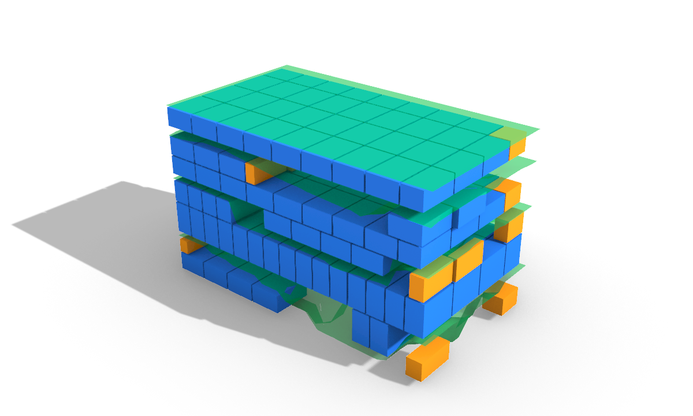
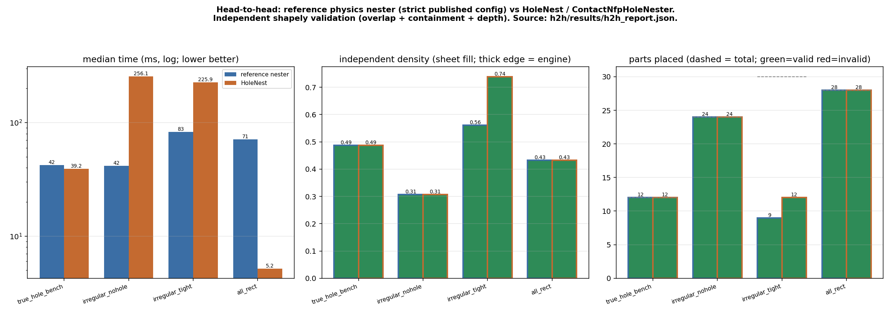
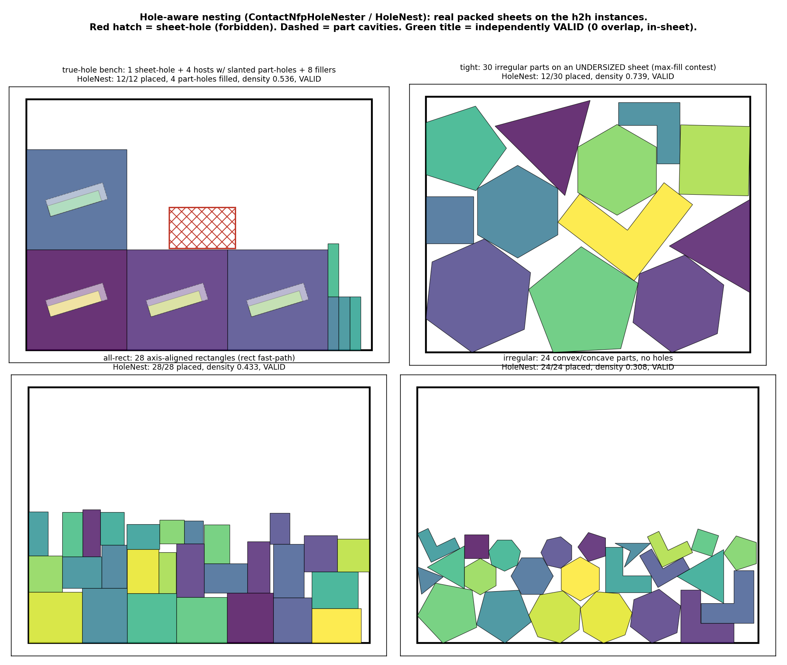
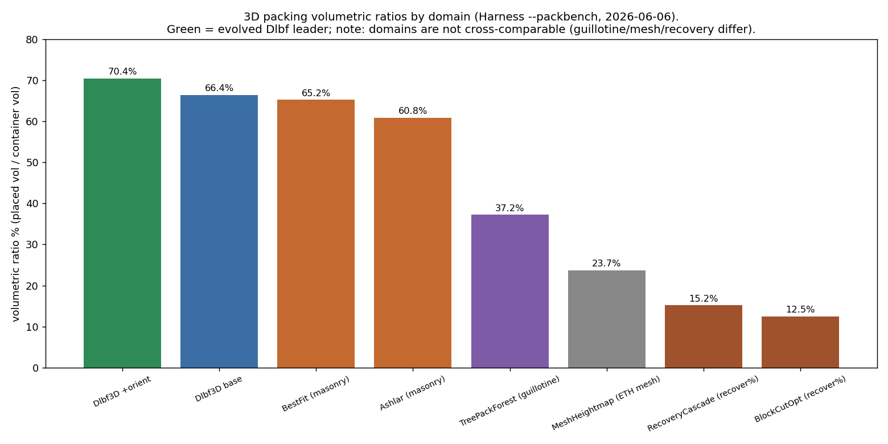
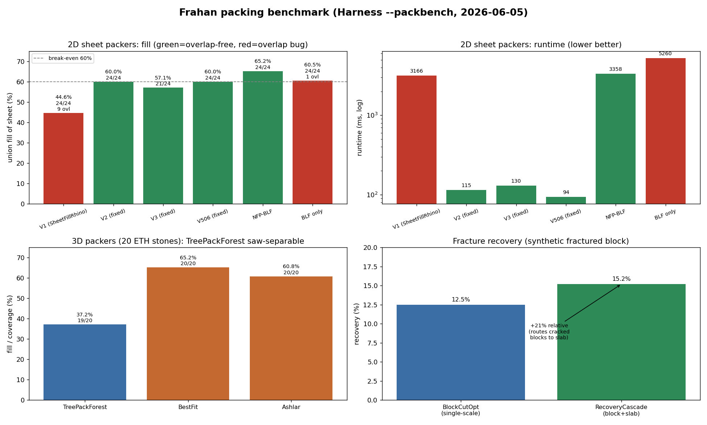
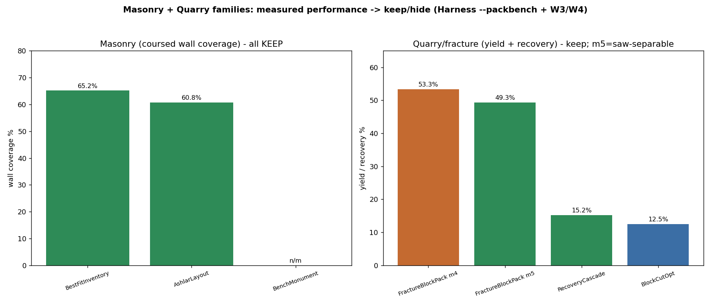
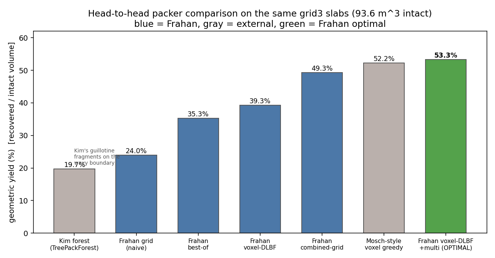

# Results at a glance (no Grasshopper required)

See what the plugin does without opening a single `.gh`. All numbers are machine-measured (live solves /
headless harness / test suite). Style: short sentences, no em dashes.

## Hero: fracture modelling -> block packing

Staged wire-saw guillotine recovery of intact blocks from a fractured bench: blue/green blocks are the
recovered, saw-separable stock; the green surfaces are the mapped fracture planes the cut avoids; orange
marks the kerf/edge blocks. Mode 5 (staged guillotine) = 49.3% yield at 100% saw-separable; mode 4
(voxel-DLBF) = 53.3% yield, not saw-cuttable. Workflows: `03_quarry_to_slabs`, `03_gpr_fracture_granite`.

## Example workflows (live-built, correct per-application scale, on the z=0 ground)
Each was built + solved live, captured, and set to its real physical scale (meters for slab / block /
monument; millimetres for mosaic / vessel). Full set + numbers in `../../examples/`; scale + tolerance
basis in `../../wiki/research/tolerances_dimensions_slm_roses.md`.

| 2D slab nest (m) | 3D quarry block (m) | Trencadis mosaic (mm) |
|---|---|---|
|  |  |  |
| 3.2x2.0 m slab, 18 parts, 0-overlap (exact NFP-BLF) | 3.0x1.5x1.5 m block, 12/12 packed (guillotine) | 1100 mm panel, 100 shards, 5 mm grout |

| Surfaces from a solid (mm) | Trencadis on the twist (mm) | Kintsugi reassembly (mm) |
|---|---|---|
|  |  |  |
| 1.2x1.2x3.5 m monument, 6 surfaces (CGAL angle split) | 408 cladding shards, 4 mm grout | 2 fragments meet at the crack (point-cloud display), verifier 0.71 STRONG |

## Do they work at their scales? Yes, and they are performant
Verified live at each example's physical scale (doc units meters for site/quarry, millimetres for shop):

| Workflow | Scale | Result | Solve time |
|---|---|---|---|
| 2D slab nest | 3.2x2.0 m | 18 parts, 0-overlap | ~0.2 s |
| 3D quarry block | 3.0x1.5x1.5 m | 12/12 packed | < 0.1 s |
| Trencadis mosaic | 1100 mm | 100/100 placed | ~0.26 s |
| Surface segmentation | 1.2x1.2x3.5 m | 6 surfaces | ~0.01 s |
| Kintsugi (Port mode) | natural (auto-scale off) | 2/2 fragments joined at crack, verifier 0.71 | ~30 s (GPU diffusion, by design) |

Performance is scale-robust: the NFP / Clipper cost is driven by vertex count, not coordinate magnitude,
and the integer scaling is int64-safe at both metre and millimetre scale near the origin. The component
defaults self-scale (auto geometric tolerance = scale-relative; auto 3D cell size; strict no-overlap), so
no per-scale tuning is needed. The one case that DOES need care is site / UTM layout (far from origin,
1e5-1e6 m), where float precision drops; the fix is recenter-before-compute in the shared GeometryNumerics
layer (study section 5B), relevant only when packing on real-world coordinates, not the bundled examples.

## Benchmark studies (headless harness)

2D stock-utilization: green = valid (0-overlap), red = invalid. The evolved exact NFP-BLF is the only
0-overlap packer crossing 80% with holes (82.0% oversub, 84.7% L+hole, 89.6% hard 3-hole).

Hole-aware nesting (HoleNest / ContactNfpHoleNester) vs the OpenNest reference physics nester,
independently shapely-validated (2026-06-13 h2h). HoleNest wins the rect fast-path (5.2 vs 71 ms)
and the tight density contest (0.74 vs 0.56; 12 vs 9 placed) and matches validity everywhere; it
trades slower general-irregular NFP time. Real packed sheets:

2026-07-05 re-match vs OpenNest 2.89's NEW native NFP engine (`nfp_nest.dll`, exactNfp=1,
5 s GA budget, rotations 4, seed 42; both engines in one Rhino 8 process; one shared
hole-aware boolean-intersection validity checker applied to both): shields-7 concave -
both 7/7 valid, CNH 853 ms vs 5000 ms; blobs-25 tight 95x70 - CNH K=1 17/25 util 0.775
VALID 770 ms, K=4 18/25 util 0.762 VALID 3.0 s, OpenNest 18/25 util 0.695 INVALID
(1965 sq-units true overlap + 5 parts out of sheet; identical at curveTolerance 0.05);
true-hole instance (sheet defect + 4 hosts with part-holes + 8 fillers) - both 12/12
valid, CNH <1 ms (rect-shelf) vs 5001 ms. CNH = equal-or-better placements among VALID
layouts, +8 pp utilization on the tight instance, 6-5000x faster, exact 0-overlap.

3D volumetric: Dlbf best-of-orientation 70.4% (vs 66.4% baseline); TreePackForest 37.2% (100% guillotine);
masonry BestFit 65.2% / Ashlar 60.8%. Domains are not cross-comparable.

RecoveryCascade recovers +21% over single-scale BlockCutOpt by re-cutting cracked blocks at finer scales.

## Test + build health
1034 tests pass, 0 fail, 147 skip (2026-06-14) from a clean clone; skips are Rhino-runtime +
optional-dataset gates. All projects build green. See `../INSTALL.md`.

## Where the numbers come from
`../../wiki/research/packing/`: PACK2D_STUDY_REPORT, PACK3D_STUDY_REPORT, ROSES_2D_PACKER_GUIDE,
MASONRY_QUARRY_DECISION, SYNTHESIS_2D/3D/BEYOND_BLF. Tolerance + scale basis:
`../../wiki/research/tolerances_dimensions_slm_roses.md`. Regenerate with
`tools/Frahan.StonePack.Harness --packbench` / `--pack2dstudy`.
