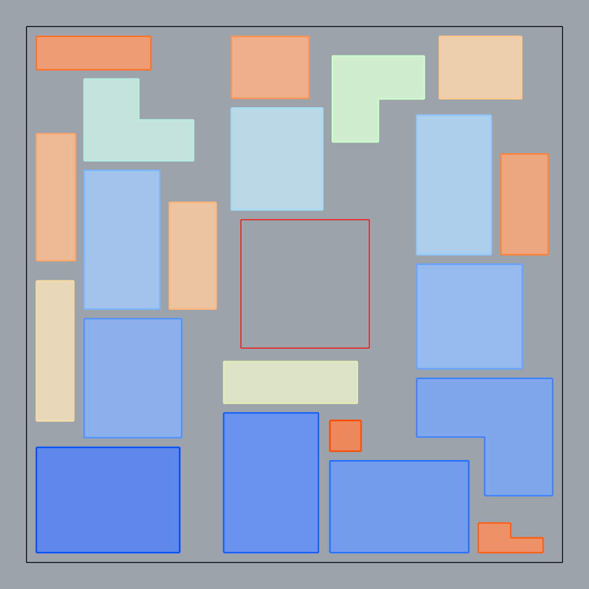
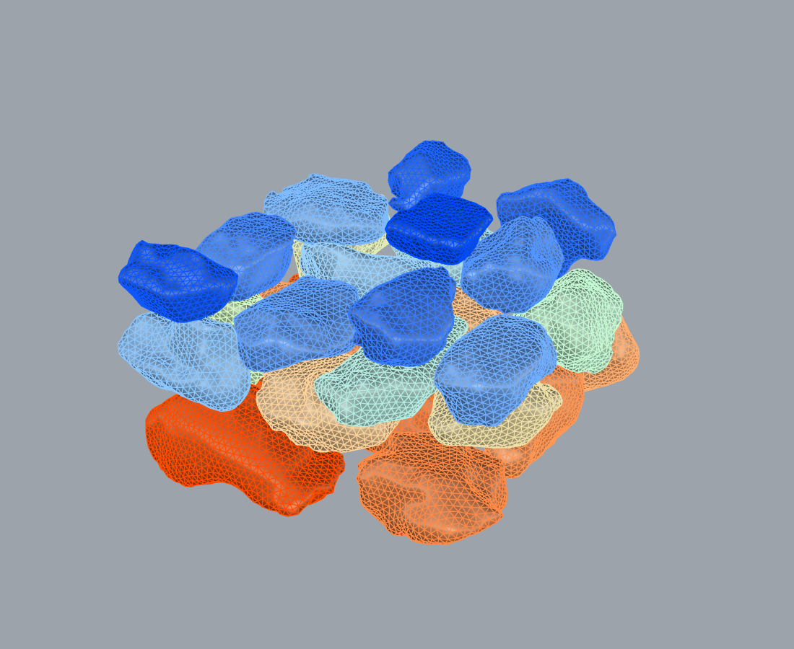

# Results at a glance (no Grasshopper required)

Measured benchmark + process results so you can see what the plugin does without opening a single `.gh`.
All numbers are machine-measured (headless harness / test suite); figures regenerate from the studies in
`../../wiki/research/packing/`. Style: short sentences, no em dashes.

## Hero: fracture modelling -> block packing

Staged wire-saw guillotine recovery of intact blocks from a fractured bench: blue/green blocks are the
recovered, saw-separable stock; the green surfaces are the mapped fracture planes the cut avoids; orange
marks the kerf/edge blocks. Mode 5 (staged guillotine) = 49.3% yield at 100% saw-separable; mode 4
(voxel-DLBF) = 53.3% yield, not saw-cuttable. See `03_quarry_to_slabs` + `03_gpr_fracture_granite`.

## 2D packing (stock utilization, 80% bar)

Green = valid (0-overlap), red = invalid (overlaps). The evolved exact NFP-BLF is the only 0-overlap packer
crossing 80% stock-utilization with holes: 82.0% oversub, 84.7% L+hole, 89.6% on a hard 3-hole fixture.

Live Rhino shaded captures of the `.3dm` nesting outputs:

## 3D packing (volumetric ratio)

Dlbf best-of-orientation 70.4% vol-fill (vs 66.4% baseline); TreePackForest 37.2% (100% guillotine);
masonry BestFit 65.2% / Ashlar 60.8%. Domains are not cross-comparable.

## Packing benchmark overview + masonry/quarry decision

## Fracture recovery + GPR

RecoveryCascade recovers +21% over single-scale BlockCutOpt by re-cutting cracked blocks at finer scales.

## Test + build health
983 tests pass (0 fail) from a clean clone; all projects build green. See `../INSTALL.md`.

## Where the numbers come from
`../../wiki/research/packing/`: PACK2D_STUDY_REPORT, PACK3D_STUDY_REPORT, ROSES_2D_PACKER_GUIDE,
MASONRY_QUARRY_DECISION, SYNTHESIS_2D/3D/BEYOND_BLF, pack2d_study_metrics.csv. Regenerate with
`tools/Frahan.StonePack.Harness --packbench` / `--pack2dstudy` + `plot_pack2d_study.py`.
