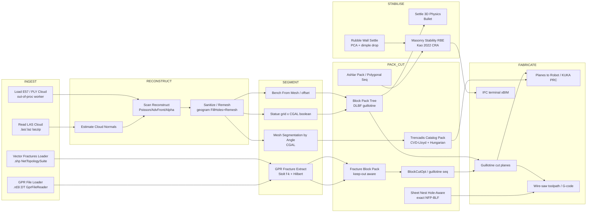

# 14. Workflow Architecture & Data-Flow Connections

This chapter is cross-cutting. The preceding chapters classify individual
algorithm families; this one maps how they connect into end-to-end
workflows. The repository is not a bag of components. It is one data-flow
spine, ingest to fabricate, with a small number of subsystem branches that
re-enter that spine at well-defined seams. The 28 worked examples in
`examples/` are the evidence: each is a Grasshopper definition that wires a
slice of the spine. Reading the 24 example READMEs and the four
README-less canvases together recovers the architecture as built, not as
imagined.

Three structural facts govern the whole repository and recur in every
section below.

1. **Rhino-free Core.** The algorithms live in `Frahan.StonePack.Core`
   (net48, no RhinoCommon reference). The Grasshopper layer
   `Frahan.StonePack.GH` is a thin facade: it marshals canvas geometry to
   Core types, calls one engine, and marshals back. This is why headless
   harness numbers exist at all, and why AGENTS.md §1 can distinguish
   "measured" (Core, harness) from "validated" (seen in Rhino).
2. **Native bridges behind a C ABI.** Heavy geometry (booleans, remesh,
   reconstruction, convex decomposition, exact NFP) is done in native DLLs
   wrapped by P/Invoke shims (`native/`). The managed side owns only the
   marshalling. AGENTS.md §3 routes the crash-prone ones out of process.
3. **Facade-over-primitives.** The big single-box components (HeteroExt,
   the Unified sheet filler, the hole-aware nester) compose published Core
   primitives. They add convenience, not new mathematics, and the
   composed-equivalent canvas exists alongside them.

## 14.1 The data-flow spine

Every workflow is a path through one acyclic spine: a site or a form is
ingested, reconstructed to clean geometry, segmented into regions, then
packed or cut into fabricable pieces, stabilised (settling for piles, a
limit-state certificate for assemblies), and emitted as a cut plan or an
install order.

The spine has four ingest mouths (point cloud, GPR radargram, vector
shapefile, and an in-canvas designed form), one reconstruction lane, three
segmentation modes (dihedral surfaces, GPR fracture surfaces, grid-boolean
blocks), six pack-or-cut engines, three stabilisers, and four fabrication
terminals. Each example below is one route through this graph.

## 14.2 Per-example pipeline graphs

Each line is the component chain the example wires, read left to right.
Bracketed names are Grasshopper components; arrows are canvas connections.
Folders without a README ship a `.gh` + `.3dm` only; their chain is read
from the canvas and the figure catalogue.

| # | Example | Pipeline chain (component graph) |
|---|---|---|
| 01 | Quarry to wall | `Scan/Block source` -> `Block Pack` -> `Masonry layout` -> `Wall` (full spine, definition only) |
| 02 | Masonry assembly | `Blocks` -> `Polygonal Masonry Sequence` -> `colour-by-install-order` preview |
| 03 | GPR fracture (granite) | `GPR File Loader (.rd3)` -> `RadargramProcessor (f-k migrate)` -> `GPR Fracture Extract` -> `GPR Fracture Surfaces 3D` -> report |
| 03b | Quarry to slabs | `Block source` -> `Fracture Block Pack` -> `Slab Cut By Fractures` -> slabs (canvas only) |
| 04 | Scan to bench | `Read LAS Cloud (.laz)` -> `Estimate Cloud Normals` -> `Scan Reconstruct (Poisson/Geogram)` -> `Bench From Mesh` + offset -> packable volume |
| 05 | Artist pointing machine | `Scan mesh (decimated)` -> `Carving Stages` -> staged meshes + pointing coords |
| 07 | Scan ingest (full) | `Load E57 / .ply / .laz` -> outlier-clean + crop -> `Scan Reconstruct (Advancing-Front, out-of-proc)` -> `Clean Scan Mesh` -> hand-off |
| 08 | GPR marble + layout | `GPR File Loader (.DT)` -> `GPR Fracture Extract` -> 3 dipping beds -> `net + W*volume` block pack -> oblique guillotine sequence |
| 09 | Uncertainty-safe yield | `GPR Fracture Surfaces 3D` -> `Fracture Clearance = sigma` -> `Fracture Block Pack` -> per-zone yield |
| 10 | 2D nest | `part curves + sheet + holes` -> `Sheet Pack (Unified) V506` / `Freeform Sheet Nest (Exact NFP)` -> packed curves + util_stock |
| 11 | 3D block pack | `element boxes + container` -> `Block Pack (Tree) / DLBF` -> placed boxes (12/12) + report |
| 12 | Trencadis mosaic | `shard catalog + sheet` -> `Trencadis Catalog Pack (CVD-Lloyd + Hungarian)` -> placed pieces + grout |
| 13 | Surface mapping | `twisted mesh` -> `Mesh Segmentation by Angle (CGAL)` -> 6 regions -> `Surface Chart (BFF)` -> `Pack On Surface` -> 176-shard mosaic |
| 14 | Kintsugi reassembly | `Load BB Sample (.bin)` -> `Frahan Kintsugi (Port mode)` -> assembled fragments + verifier score |
| 15 | Statue to blocks | `Read PLY` -> Geogram `FillHoles/Remesh/FillHoles` -> `0.5 m grid x CGAL intersect` -> 113 real-face blocks -> Branch A gangsaw / Branch B rubble match |
| 16 | Rubble masonry | `40 ETH1100 stones` -> `Rubble Wall Settle (PCA + dimple drop)` -> staggered wall, 36/40 stable |
| 17 | Ashlar masonry | `60-block inventory` -> `Ashlar Pack (running bond)` -> `Pack Preview` -> coursed wall (45 placed) |
| 18 | Pack + settle (Bullet) | `12 stones + container` -> `Settle 3D (Physics, Bullet)` -> dense non-interpenetrating pile |
| 19 | Rubble evolved fit | `blocks + stones` -> `Rubble Evolved Fit (24 seeds + (1+8)-ES)` -> 10/10 enclosed, one block per stone |
| 20 | Rubble multi-bin | `blocks + stones` -> `Rubble Multi-Bin Pack (voxel-occupancy FFD)` -> 17/20 across 6 bins |
| 21 | Stereotomy arch | `Arch Voussoirs (D5F10012)` -> cells -> evolve-match to ETH stone -> `CgalMeshBoolean.Intersection` -> 11/11 carved voussoirs |
| 22 | Pendentive vault | `Pendentive Vault Voussoirs (D5F10013)` -> 36 cells -> evolve-match -> CGAL trim -> 36/36 carved |
| 23 | Quarry to slab | `fracture-prone block` -> `Fracture Block Pack (voxel-dlbf-multi)` -> intact blocks -> gangsaw slab cut |
| 24 | Guillotine sequence | `packed block` -> rip(perp-X) -> cross(perp-Y) -> cross(perp-Z) -> 19 saw planes as meshes |
| 25 | Marble gangsaw cost | `fractured bench` -> `Fracture Block Pack` -> `net + W*volume` sweep (Pareto) -> balanced -> guillotine planes |
| 26 | Loviisa surface fractures | `Vector Fractures Loader (.shp, F2D00BEC)` -> `FractureTraceCollection` -> strike map (708 traces) |
| 27 | Polygonal masonry | `chains/cells + wall` -> `Polygonal Masonry Sequence (B4E07A3C)` / `...3D (C5F18B4D)` -> install order DAG -> colour-by-order |
| 28 | Hole nest | `parts + sheet + holes` -> `Sheet Nest (Hole-Aware) D5F10019 / ContactNfpHoleNester` -> nested around holes (canvas only) |

The table makes the spine visible as routes. The geologist spine is
03 -> 08 -> 09 (GPR to uncertainty-safe yield). The engineer spine is
04 -> 11 -> 23 (scan to bench to slab). The artist spine is 05 -> 15 (carving
and statue decomposition). The masonry spine is 16/17 -> 27 -> 02 (settle or
course, then order, then assemble). Examples 21/22 are the top-down
stereotomy bridge, and 13 is the surface-cladding bridge.

## 14.3 Architectural seams

### Core vs GH facade

The deciding seam is the assembly boundary. `Frahan.StonePack.Core`
references no RhinoCommon; the engines `ContactNfpHoleNester`
(`src/Frahan.StonePack.Core/Packing/TwoD/ContactNfpHoleNester.cs`),
`BlockCutOptSolver`, `Dlbf3dMixedSizePacker`, `RubbleWallSettle`, and
`EquilibriumMatrixBuilder` are all pure. The GH component is the facade.
For example, `BlockPackTreeComponent`
(`src/Frahan.StonePack.GH/Packing/BlockPackTreeComponent.cs:37`, GUID
`C2D3E4F5-3001-4F5E-A6B7-C8D9E0F12345`) marshals canvas boxes to the
Core packer and back; the [Algorithm] attribute at line 30 cites the
engine, not the wrapper. This is the single most important structural
choice in the repository: it makes the Core independently testable and
keeps the truth criterion honest.

### Native bridges

Three classes of native bridge cross the managed boundary, all behind a C
ABI (`native/README.md` is the authority).

- `frahan_cgal.dll` (cgal_shim) wraps CGAL Polygon Mesh Processing:
  corefinement booleans (used in example 15 grid-intersect and 21/22
  voussoir trim), decimation, OBB, straight skeleton, SDF/angle
  segmentation (example 13), alpha shape, advancing front, Poisson. The
  CGAL packages used are GPL in that distribution.
- `frahan_geogram.dll` (geogram_shim) wraps Bruno Levy's Geogram: remesh,
  hole-fill, voxel downsample, CVT/Lloyd, and the Kazhdan
  `GEO::PoissonReconstruction` that Geogram bundles (example 04/15).
  Geogram core is BSD-3; bundled PoissonRecon is MIT.
- `nfp_kernel.dll` wraps Clipper2 (BSL-1.0, no copyleft) for the batched
  Minkowski-sum NFP lane that `ContactNfpHoleNester` calls (examples 10,
  28). `frahan_coacd.dll` wraps CoACD (MIT, SIGGRAPH 2022) for the convex
  decomposition in example 15 Branch C and the Bullet settle.

The GH wrappers over these (Scan Reconstruct, Mesh Remesh/Decimate, the
CGAL cut/test components, the CoACD test) carry no managed algorithm; they
marshal to the shim. Crash-prone in-process booleans are routed through
`OutOfProcessReconstructor` + `recon_worker` (example 07), per AGENTS.md
§3.

### Facade-over-primitives pattern

The pattern is explicit in source. `FrahanHeterogeneousExtractionComponent`
(`src/Frahan.StonePack.GH/BlockCutOptHeterogeneousComponents.cs:179`)
composes `BlockCutOptSolver` + `Dlbf3dMixedSizePacker` + the monument
packer; its [Algorithm] note at line 169 reads "Composes Elkarmoty 2020
(BlockCutOpt) and Chehrazad 2025 (DLBF), both interpreted and reimplemented
in managed code for this plugin; the composition and the heterogeneity
model are the contribution." That is the canonical facade: every internal
step resolves to an in-repo primitive that also ships standalone. The
Unified sheet filler dispatches V506 and the obsolete V1/V2/V3 wrappers;
`Sheet Nest (Hole-Aware)` D5F10019 is the facade over
`ContactNfpHoleNester`; `Pack On Surface`
(`src/Frahan.StonePack.GH/SurfacePacking/PackOnSurfaceComponent.cs:41-42`)
composes the exact NFP-BLF placement on a BFF chart with a classical
triangle barycentric lift back to 3D (attributed to the mean-value-coordinate
family, after Floater 2003; the shipped lift is plain barycentric, not MVC).

### Top-down vs bottom-up design flows

The repository tags every workflow by design direction (the
`[DesignApplication(..., DesignFlow.TopDown|BottomUp)]` attribute, e.g.
`GprFractureExtractComponent.cs:46`). The two flows are first-class.

- **Top-down (form-first).** A designed form drives the search for stone.
  Examples 21/22 generate voussoir cells, then find and trim rubble to fit
  them. Example 15 takes a sculpted bunny and cuts it into a brick grid.
  Example 17 fills a wall envelope with dressed ashlar. The form is
  imposed; the stone is negotiated to it.
- **Bottom-up (material-first).** Found stone drives the form. Example 16
  settles real ETH1100 scans into whatever staggered wall emerges. Example
  12/13 lay offcut shards into a Trencadis mosaic. The form is the residue
  of the material.

The same Core engines serve both: `Rubble Evolved Fit` (example 19) is the
substrate for the top-down voussoir match (21) and the bottom-up rubble
lot match (15 Branch B).

## 14.4 Cross-subsystem couplings

The architectural interest is in the seams where one subsystem's output is
another's typed input. Four couplings carry the workflow weight.

### GPR defect -> defect-aware nesting

The GPR fracture chain emits 3D fracture surfaces; the packers consume them
as keep-out geometry. `GprFractureExtractComponent`
(`src/Frahan.StonePack.GH/Quarry/GprFractureExtractComponent.cs:43`, GUID
`A7E0B0F1-...`) runs Stolt f-k migration and Hilbert energy; its surfaces
flow into `FractureBlockPackComponent`
(`...Quarry/FractureBlockPackComponent.cs:37`, GUID
`A7E0B0F3-0C0F-4A16-9E3D-0FACE0FACE04`) which packs blocks only in intact
rock. Example 09 closes the loop by wiring the GPR position uncertainty
$\sigma$ as the inward clearance, so no block sits within the measured
error of a fracture. The 2D analogue is the same idea one dimension down:
a vein or defect becomes a sheet hole, and `ContactNfpHoleNester`
(example 28) nests parts around it. The coupling is one concept, defect as
keep-out, expressed as a 3D surface margin and a 2D hole.

The packed-yield objective itself is a swept scalar. Examples 08 and 25
both maximise

$$
\max_{\text{blocks}} \; \sum_i \big( \text{net}_i + W \cdot \text{vol}_i \big),
$$

where $W$ is a volume credit in dollars per cubic metre. Sweeping $W$ from
$0$ to $\infty$ walks the Pareto front from pure profit to pure
throughput. At $W=0$ the loss-making block (negative net) is never placed;
as $W \to \infty$ every cell fills. This single knob is what makes the
cost/volume/balanced triptych in both examples one workflow, not three.

### Statue -> blocks -> CRA

Example 15 decomposes a statue into real-face blocks by intersecting a
$0.5\,\text{m}$ grid with the closed solid. The recovered-volume identity
is the correctness certificate:

$$
\rho = \frac{\sum_k \mathrm{vol}(B_k)}{\mathrm{vol}(S)} = 1.0000,
$$

a complete partition (statue $5.4009\,\text{m}^3$ = sum of blocks). The
blocks then flow two ways: Branch A packs them for a gangsaw, Branch B
matches each to a rubble stone. Where those blocks become a built wall
(example 27 install order, then assembly), the assembly is handed to the
limit-state check below. The chain statue -> blocks -> order -> stability is
the full top-down fabrication route.

### H-model coupling: RBE accepts / CRA rejects

The masonry stability subsystem is a coupled two-stage certificate, and
the coupling is a regression test, not just a workflow. The Rigid-Block
Equilibrium (RBE) stage solves a convex QP for a statically admissible
contact force field. Build the equilibrium matrix $\mathbf{A}_{eq}$
(`EquilibriumMatrixBuilder.Build`), the friction cone
$\mathbf{A}_{fr}$ (`FrictionConeBuilder.Build`), and solve

$$
\min_{\mathbf{f}} \; \tfrac{1}{2}\,\mathbf{f}^\top \mathbf{Q}\,\mathbf{f}
\quad\text{s.t.}\quad
\mathbf{A}_{eq}\,\mathbf{f} = \mathbf{w}, \;\;
\mathbf{A}_{fr}\,\mathbf{f} \le \mathbf{0}, \;\;
f_n \ge 0 .
$$

The $f_n \ge 0$ constraint (no tension at a joint) is the sign that the
audit flagged. The shipped path now calls
`RbeQpFormulation.BuildPhysicsCorrected`
(`src/Frahan.StonePack.GH/Masonry/MasonryStabilityRbeComponent.cs:305`),
which flips the sign so $f_n \ge 0$ means compression, not the inverted
convention of the older `Build`. RBE feasibility is necessary but not
sufficient: it allows a force field that no realisable rigid motion would
sustain. The CRA (Coupled Rigid-Block Analysis) stage adds the kinematic
side, an alternating-convex soundness certificate that can reject an
assembly RBE accepts. The H-model counterexample, an assembly where RBE
reports feasible and CRA reports unstable, is kept as a regression test:
it is the proof that the two stages are not redundant. The component cites
Kao et al. 2022 at
`MasonryStabilityRbeComponent.cs:69` (GUID
`F6BAC3D4-4E5F-4071-BC3D-5E6F7A8B9CAD`).

### Vector + GPR -> shared fracture model

Examples 26 (shapefile traces) and 08 (GPR depth) both produce a fracture
model the packers consume. The shapefile gives surface trace strike and
spacing in plan; GPR gives depth. `VectorFracturesLoaderComponent`
(`src/Frahan.StonePack.GH/VectorFracturesLoaderComponent.cs:53`, GUID
`F2D00BEC-2026-4522-B0B0-1ABE15A0DEAD`) returns a `FractureTraceCollection`
that feeds `Slab Cut By Fractures` and the fracture-aware packers, the same
sink the GPR surfaces reach. Two ingest mouths, one defect model, one set
of packers.

## 14.5 Originality call-outs (workflow components)

The classification is per the seven-class framework. Evidence is
`file:line`, the [Algorithm] attribute, or the native shim entry.

- **ContactNfpHoleNester / Sheet Nest (Hole-Aware) D5F10019** —
  clean-room, with an evolved-fork increment. The BLF and Minkowski-sum NFP
  math is cited (Burke et al. 2006; Bennell and Oliveira 2009) at
  `TwoD/HoleNestComponent.cs:25-34`; the Int64 Minkowski lane runs in the
  vendored Clipper2 `nfp_kernel`. The contact-adaptive rotation set and the
  part-in-part-hole inner-fit polygon are the increment over plain BLF.
- **Block Pack (Tree) / DLBF** — clean-room from Kim 2025
  (`Packing/BlockPackTreeComponent.cs:30`, Doi 10.3390/computation13090211),
  with three Frahan extensions (deterministic seed, saw kerf, per-container
  forbidden boxes) noted in the README, closing Kim 8.2.
- **HeteroExt (FrahanHeterogeneousExtraction)** —
  facade-over-primitives. Composes `BlockCutOptSolver` +
  `Dlbf3dMixedSizePacker` + monument packer
  (`BlockCutOptHeterogeneousComponents.cs:169-179`).
- **Masonry Stability (RBE) + CRA** — RBE clean-room from Kao et al. (2022) / Whiting
  (`MasonryStabilityRbeComponent.cs:69-71`, Kao et al. 2022 cited); the CRA
  alternating-convex certificate is the A-candidate (Kao 2022 solves a
  nonconvex NLP via IPOPT; ours is a managed soundness certificate).
- **Polygonal Masonry Sequence (B4E07A3C) + 3D (C5F18B4D)** — clean-room
  from Kim 2024 (`PolygonalMasonrySequenceComponent.cs:34`, DETC2024-142563):
  Kahn toposort + reversed depth search on the install DAG.
- **GPR Fracture Extract (A7E0B0F1)** — clean-room (tier B). Stolt 1978
  f-k migration, Taner 1979 Hilbert attributes, USGS continuity, all cited
  at `Quarry/GprFractureExtractComponent.cs:43-46`.
- **Rubble Wall Settle (6514A1BB)** — clean-room, Frahan-original settle
  with Heyman 1966 COM-over-support stability
  (`Masonry/RubbleWallSettleComponent.cs:35-36`).
- **Trencadis Catalog Pack (F2D00007)** — clean-room: CVD-Lloyd partition
  (Lloyd 1982) + Hungarian assignment (Kuhn 1955)
  (`Pack2DTrencadisCatalogComponent.cs:37-38`); the slab-partitioned
  catalog placement is the Frahan extension.
- **Arch Voussoirs (D5F10012) / Pendentive Vault Voussoirs (D5F10013)** —
  clean-room from Frezier/Monge stereotomy
  (`Voussoir/ArchVoussoirsComponent.cs:31-34`); radial bed-joint cells.
- **Frahan Kintsugi Port** — direct-port of PuzzleFusion++ (Wang, Chen,
  Furukawa, ICLR 2025, arXiv:2406.00259), parity-verified on Breaking Bad
  (`src/Frahan.Kintsugi.Port/README.md:3-4`). LICENCE-CRITICAL: GPL-3.0
  (`Frahan.Kintsugi.Port/LICENSE.txt`); the geometric path
  (`Frahan.EdgeMatching.Core`, Port mode off) carries no GPL.
- **Vector Fractures Loader (F2D00BEC)** — wrapper / vendored-library over
  NetTopologySuite.IO.Esri (`VectorFracturesLoaderComponent.cs:38`).
- **Pack On Surface** — facade-over-primitives: exact NFP-BLF on a BFF
  chart + a classical triangle barycentric lift (attributed to the
  mean-value-coordinate family, after Floater 2003; the shipped lift is plain
  barycentric, not MVC) (`SurfacePacking/PackOnSurfaceComponent.cs:41-42`).
- **Ashlar Pack (F1A2B3C4)** — clean-room Frahan-original grid stacking
  with a Gramazio/Kohler/Eichenhofer 2017 running-bond reference
  (`Masonry/AshlarPackComponent.cs:31-32`).

## 14.6 Status and what is left

The spine is built and the example routes are validated, but four
architectural debts remain.

1. **RBE/CRA in the shipped facade.** The component now calls
   `BuildPhysicsCorrected` (the sign fix), but the inverted `Build` is
   still present in `RbeQpFormulation`. Until it is removed, a caller can
   wire the wrong overload. Medium severity, scheduled.
2. **RecoveryCascade has no GH consumer.** The validated Core cascade
   (`Masonry/Quarry/BlockCutOpt/RecoveryCascade.cs`) is not reachable from
   any canvas; `FractureBlockPack` ships its own duplicate recovery engine
   that calls neither RecoveryCascade nor BlockCutOptSolver. This is a
   silent-disagreement risk; resolution is facade-not-fork.
3. **Duplicated kernels.** Three Horn/Kabsch absolute-orientation copies
   and two Hungarian implementations should unify on one MathNet-SVD
   kernel. Low severity, but a real architectural seam.
4. **Four README-less canvases.** Examples 01, 02, 03b, 28 ship `.gh` +
   `.3dm` with no README and no rendered PNG; their pipeline graphs in
   §14.2 are read from the canvas, not from a validated capture. Figure
   renders are pending. Low severity.

The honesty infrastructure that holds the architecture together is worth
stating: the KB registry with measured reproductions, the 0-overlap gating
with the `util_stock = placed area / (sheet - holes)` methodology, the
"REPORTED not gated" comments, the H-model counterexample as a regression
test, and [Algorithm] citations on 138 source files. The last battery state
was 1034 PASS / 0 FAIL / 147 SKIP (2026-06-14).

### Figures

