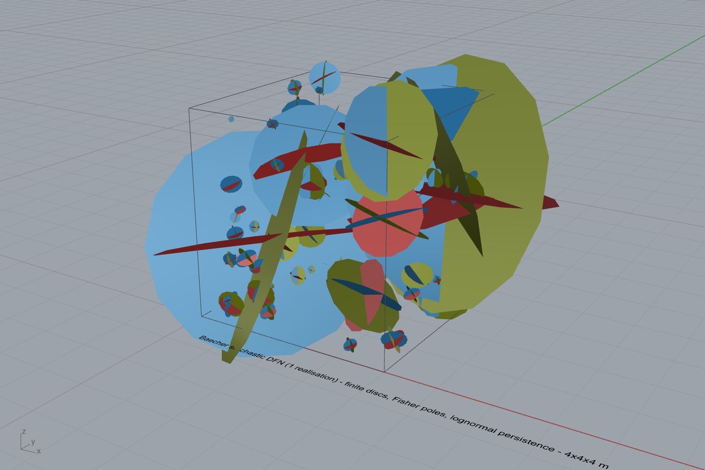
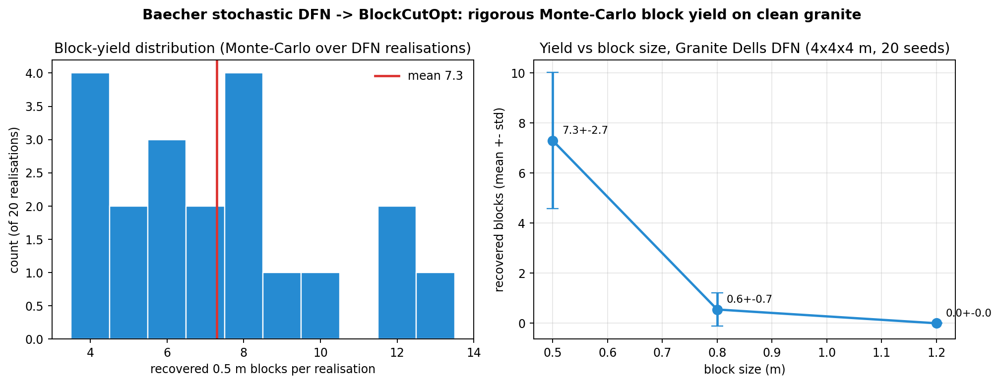

# Stochastic Baecher DFN + Monte-Carlo block yield (clean granite)

Date: 2026-06-14. The rigorous, finite-persistence, stochastic DFN — the volume
extrapolation + uncertainty the observed-only analysis (`CLEAN_GRANITE_DELLS.md`,
`RIGOROUS_DFN.md`) was missing — run on the **clean in-situ Granite Dells** data.

## The model (reproducible on the canvas)

`BaecherDfnGenerator` (Core, `Frahan.Masonry.Quarry.BlockCutOpt`) + GH component
**Stochastic DFN (Baecher) D5F1004C** (Frahan > Quarry). Each fracture is a finite
circular disc — the Baecher et al. (1977) model:

- **centre** ~ uniform Poisson point process in the bench,
- **pole** ~ Fisher (1953) distribution about the set mean (dispersion κ),
- **radius** ~ lognormal (mean persistence + CV) — the trace-length distribution,
- **intensity** N = P10·V/(π·E[r²]), P10 = 1/spacing.

Finite persistence falls out naturally: a block in a sparsely-fractured pocket
survives because no disc reaches it — unlike the infinite-plane DFN (D5F1004B) which
always fully partitions the bench. Deterministic by **seed**; vary the seed for a
Monte-Carlo ensemble.

One realisation in a 4×4×4 m granite block: finite discs of varying size (lognormal),
Fisher-scattered poles, coloured by set — red sheeting (S1), blue/olive vertical
(S2/S3). The large discs are the lognormal tail (through-going fractures).

## Granite Dells parameters (estimated from the scan)

| set | Fisher κ | spacing | block-bounding spacing | persistence (p50) |
|-----|----------|---------|------------------------|-------------------|
| S1 sheeting | 8.6 | 0.28 m | 1.93 m | 0.53 m |
| S2 vertical | 6.8 | 0.34 m | 1.53 m | 0.57 m |
| S3 vertical | 6.6 | 0.40 m | 1.32 m | 0.62 m |

(κ from the facet-normal resultant; persistence from the exposed block-bounding trace
lengths; block-bounding spacing = full spacing / fraction persistent.)

## Monte-Carlo block yield

20 realisations, 4×4×4 m block, ~237 fracture discs each, fed to BlockCutOpt:

| block size | recovered blocks (mean ± std) | range |
|------------|-------------------------------|-------|
| 0.5 m | **7.3 ± 2.7** | 4 – 13 |
| 0.8 m | 0.6 ± 0.7 | 0 – 2 |
| 1.2 m | 0.0 | 0 |

**Yield is a distribution, not a point estimate.** At 0.5 m the realisation-to-realisation
spread is real (4 to 13 blocks); above ~0.8 m the block-bounding fractures (1.3-1.9 m
spacing, finite ~0.55 m persistence) shut extraction down. A single DFN seed cannot show
this spread — that is the whole point of the Monte-Carlo.

## Honest caveats
- BlockCutOpt's single-pose count is a **lower bound**; the evolved Omni solver
  (sub-division + Pareto) shifts the mean up.
- **Persistence is the dominant uncertainty** — it is censored on a surface scan and
  the lognormal CV is assumed; the yield scales strongly with it.
- The intensity / Fisher / lognormal model is standard (Baecher 1977, Fisher 1953,
  Priest 1993, Dershowitz & Herda 1992) but still an extrapolation into unseen rock;
  GPR / boreholes remain the authoritative subsurface input.

Reproduce: component D5F1004C with the parameters above + seed;
`outputs/2026-06-14/discontinuity_ingest_card_validation/baecher_montecarlo.json` +
`dells_baecher_params.json`.
