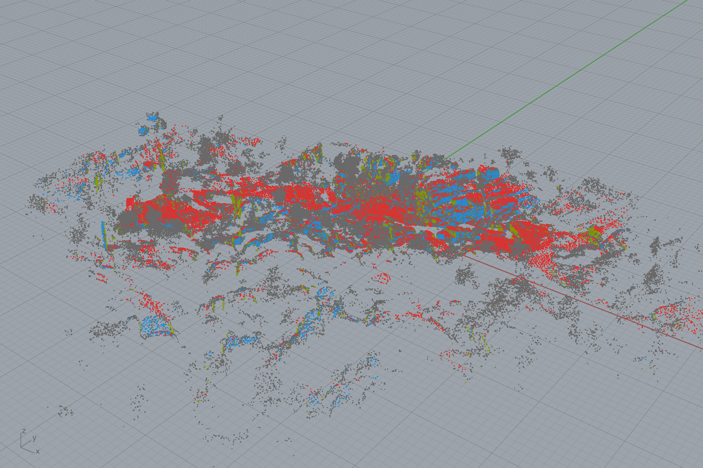
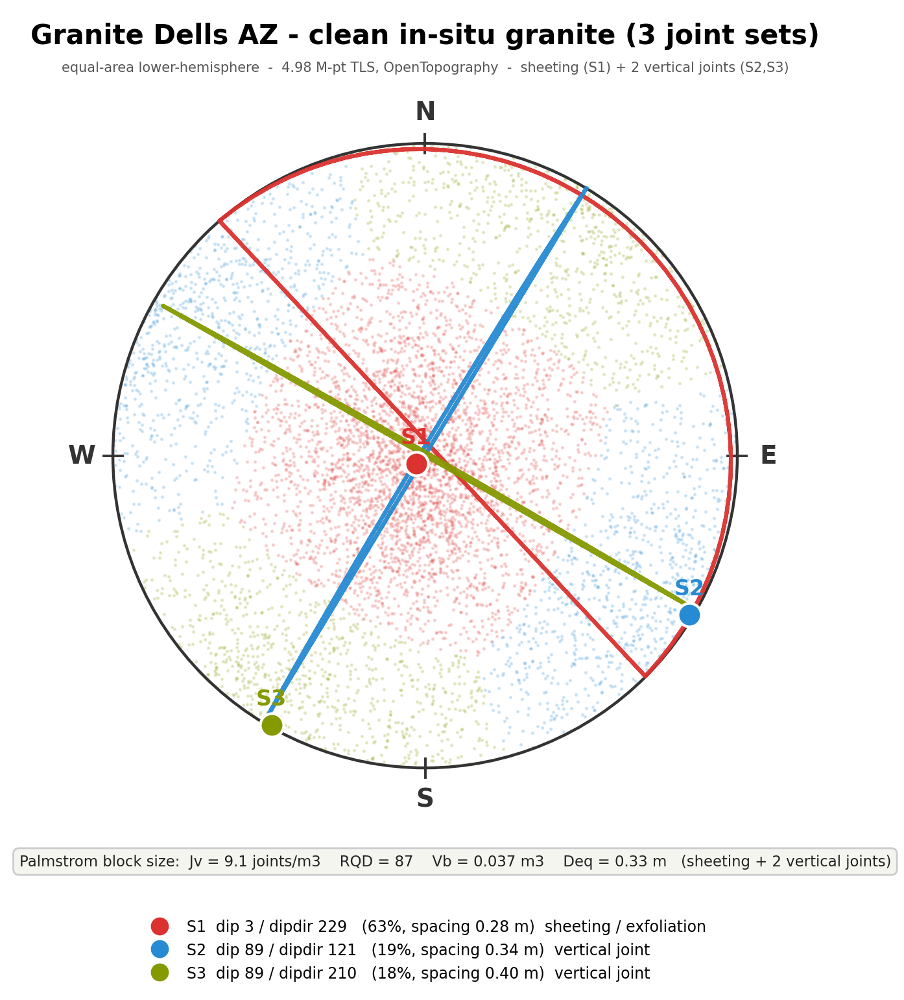
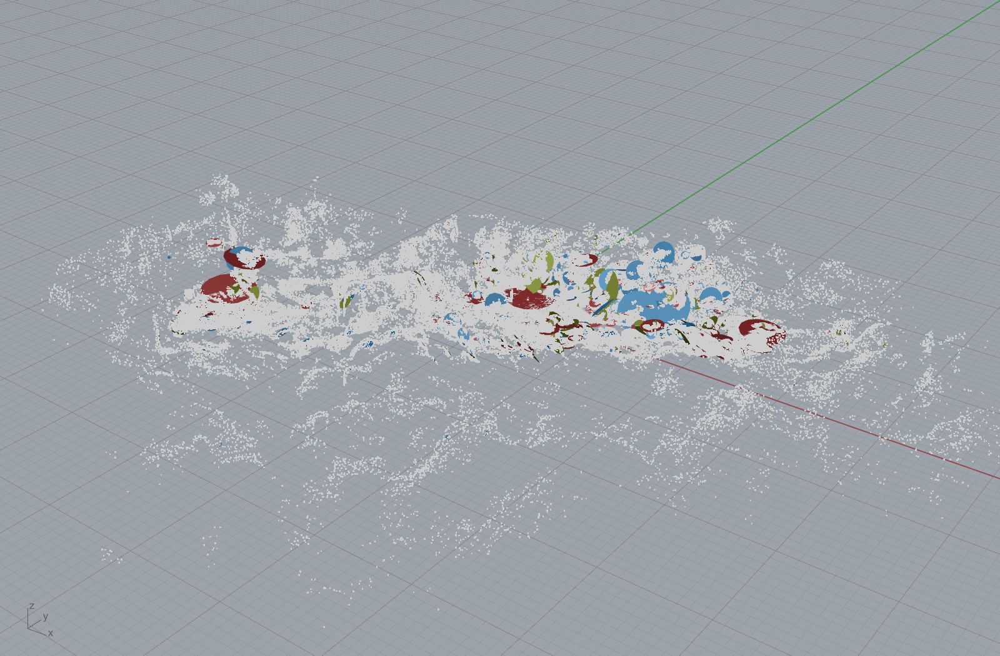

# Discontinuity analysis on clean in-situ granite (Granite Dells, AZ)

Date: 2026-06-14. The valid counterpart to `RIGOROUS_DFN.md`: the same pipeline on a
**clean in-situ granite** dataset with **no loose rubble** — Granite Dells AZ TLS
(OpenTopography, 4.98 M points), converted LAZ → float32 PLY (CloudCompare,
centroid-shifted).

## Why switch datasets

The Tongjiang `detail_cloudXB` scan turned out to be a **vegetated loose-rock slope /
muck pile** (trees, a sloped mound, only 26 % of points on coherent surfaces). On that
data the "joint sets" are loose-block face orientations, not an in-situ fracture
network — so the DFN / block-yield is meaningless for dimension stone (caveat added to
`RIGOROUS_DFN.md`). **Lesson: validate the input is a clean in-situ exposure before
interpreting joint sets.** Granite Dells is the clean control: 48 % of points segment
to a set, and the result is geologically textbook.

## Result — a textbook granite joint pattern

3 well-separated joint sets (worker, bw 14, full 4.98 M points, honest ISRM spacing):

| set | orientation | spacing | share | interpretation |
|-----|-------------|---------|-------|----------------|
| S1  | dip **3°** / dipdir 229 | 0.28 m | 63 % | **sheeting / exfoliation** (sub-horizontal, granite-dome) |
| S2  | dip **89°** / dipdir 121 | 0.34 m | 19 % | vertical joint |
| S3  | dip **89°** / dipdir 210 | 0.40 m | 18 % | vertical joint (~orthogonal to S2) |

This is the classic granite blocky pattern: **one sub-horizontal sheeting set + two
near-orthogonal vertical sets** → near-cubic blocks. The stereonet shows it cleanly —
S1's pole at the centre (sub-horizontal), S2/S3's poles on the primitive circle ~90°
apart.

## Block size (honest, no fudge)

Palmström from the 3 ~orthogonal sets: **Jv = 9.1 joints/m³, RQD = 87, Vb = 0.037 m³,
Deq = 0.33 m** (all-facet spacing — near-surface sheeting is closely spaced; the
persistence-thresholded block-bounding spacing gives larger blocks, as on the
persistence-sensitivity analysis). RQD 87 = good-quality rock.

## DFN on the clean granite

926 observed block-bounding fracture discs (persistence ≥ 0.3 m) overlaid on the
granite cloud: red sheeting discs lying flat on the dome tops, blue/olive vertical
joints standing up — the real 3D fracture geometry, balanced across the 3 sets
(410 / 256 / 260). This is the valid "DFN in the rock" the muck-pile scan could not
provide.

## Reproduce
`outputs/2026-06-14/discontinuity_ingest_card_validation/` — `granite_dells_f32.ply`
(centered float32 cloud), `dells/discontinuity.json` + `facets.csv` + `segmented.ply`
(worker output), `dells_stereonet.json`, `dells_dfn_discs.json`. Worker: bw 14,
minshare 0.04, maxpts 8 M.
