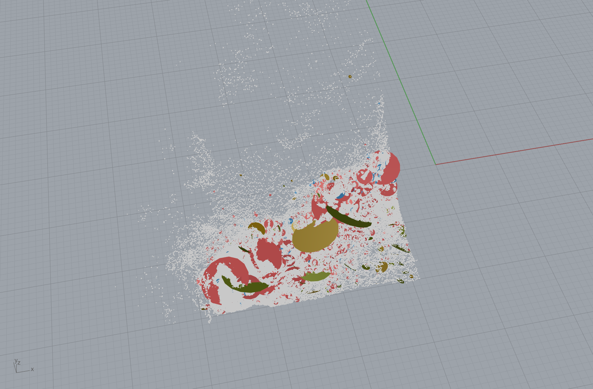

# Rigorous DFN of the Tongjiang quarry face

Date: 2026-06-14. A defensible discrete fracture network (DFN) for the real Tongjiang
quarry scan (`detail_cloudXB.ply`, 7.86 M pts), with every parameter **estimated from
the scan**, finite persistence, and an honest uncertainty treatment — not the crude
infinite-plane model.

The picture is the **observed** block-bounding fracture network: 760 real fracture
discs (facet clusters, persistence ≥ 0.3 m) at their true positions and orientations,
coloured by joint set, over the grey quarry-face cloud. These are measured, not
synthetic.

## Parameters estimated from the scan

Domain (scan AABB): **39.6 × 39.6 × 27.1 m** (~42,000 m³).

| set | share | Fisher κ | spacing (ISRM) | P10 | exposed trace p50 / max |
|-----|-------|----------|----------------|-----|-------------------------|
| S1  | 64 %  | 7.7      | 0.25 m         | 4.0/m | 0.15 m / 13.7 m |
| S2  | 18 %  | 6.2      | 0.23 m         | 4.3/m | 0.14 m / 1.8 m  |
| S3  | 12 %  | 6.0      | 0.67 m         | 1.5/m | 0.40 m / 27.4 m |
| S4  | 6 %   | 7.8      | 1.11 m         | 0.9/m | 0.67 m / 40.6 m |

- **Orientation** — Fisher (1953) dispersion κ from the facet-normal resultant per set.
  κ ≈ 6-8 (~20° scatter): moderate, consistent with joint roughness + estimation noise.
- **Spacing** — ISRM distinct-joint count (see `SPACING_FIX.md`).
- **Persistence** — exposed trace length from connected-facet clustering. These are
  **censored** (a fracture running beyond the exposure or into the rock is truncated),
  so true persistence ≥ these. Trace-length distributions are heavy-tailed (power-law):
  many small patches, a few through-going fractures (max 13-40 m).
- **Intensity** — P10 = 1/spacing (frequency along the set normal).

## The key result: block size depends on the persistence threshold

The rock has **dense micro-jointing** (~0.25 m) but the **block-bounding fractures**
(those persistent enough to actually separate a block) are far sparser. Filtering the
DFN by a persistence threshold and recomputing Palmström `Vb` from the dominant 3 sets:

| persistence threshold | dominant spacing | Jv | **Vb** | Deq | read |
|-----------------------|------------------|----|--------|-----|------|
| 0 (every facet a joint) | 0.25 / 0.23 / 0.67 m | 10.7 | **0.04 m³** | 0.35 m | over-pessimistic |
| **0.2 m** | 0.84 / 1.05 / 1.70 m | 3.1 | **1.6 m³** | 1.17 m | **dimension stone** |
| **0.3 m** | 1.23 / 1.88 / 1.92 m | 2.2 | **4.8 m³** | 1.69 m | **dimension stone** |
| 0.5 m | 2.1 / 4.1 / 2.3 m | 1.4 | 21.8 m³ | 2.79 m | over-optimistic (censored tail) |

**This is the honest block-size answer: ~1.6-4.8 m³** (≈ 1.2-1.7 m equivalent blocks)
for the defensible persistence band (0.2-0.3 m) — realistic granite dimension-stone
blocks. The naive "all facet patches are joints" value (0.04 m³) is **over-pessimistic**:
it counts surface roughness / facet decomposition as block boundaries. The earlier
example-32 number (0.11 m³, blocks capped at 0.15 m) sat near that pessimistic end; the
persistence-aware analysis corrects it upward to real dimension-stone sizes.

## What this is, and what it is not

- The **visual** is the real observed fracture network on the exposed face (no synthetic
  guessing). The dominant red S1 (sub-horizontal sheeting, 64 % share) plus the larger
  through-going discs are what bound blocks.
- The **yield** is a **sensitivity**, not a point estimate, because (a) trace lengths are
  censored, (b) the scan is 2.5 D so the volumetric DFN is extrapolated into unseen rock,
  and (c) connectivity/block formation from finite fractures is realisation-dependent.
- The **authoritative** subsurface fracture geometry still comes from **GPR / boreholes**,
  not surface extrapolation. This DFN is the surface-derived scoping bound.

## Method / references
Fisher (1953) orientation dispersion; Priest & Hudson (1981), Priest (1993) DFN +
spacing; Baecher et al. (1977) disc model; Dershowitz & Herda (1992) P10/P32 intensity;
trace-length censoring Pahl (1981), Zhang & Einstein (1998); Palmström (1995, 2005) Vb;
Goodman & Shi (1985) block theory (removable blocks need persistent bounding fractures).

Reproduce: `outputs/2026-06-14/discontinuity_ingest_card_validation/` —
`dfn_params.json` (estimated parameters), `observed_dfn_discs.json` (the 760 discs),
generated by the clustering + Fisher-κ + ISRM-spacing scripts in that folder.
