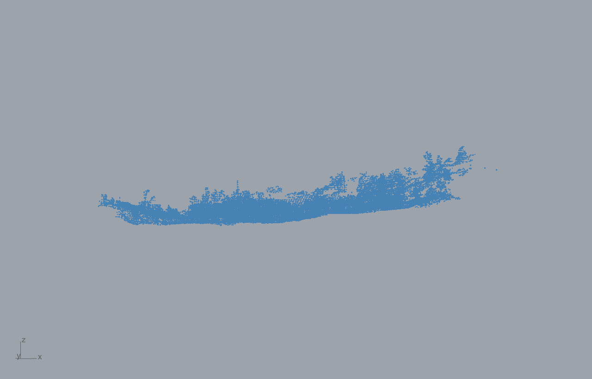

# Example 04 - Granite scan to quarry bench (LiDAR .laz -> mesh -> bench)

The engineer end-to-end: a real granite LiDAR/TLS point cloud read straight from `.laz`, reconstructed
to a mesh, and turned into a quarry bench. Units: meters. Style: short sentences, no em dashes.

## DATA (colocated, works out of the box)
- `las_data/ot_GD_TLS_data_UTM.laz` - Granite Dells TLS, real granite rock-face LiDAR. Bundled next to
  the card so the workflow runs without an external download. Full provenance: `las_data/_SOURCE.md`
  and the Drive master folder in `../../data/DATA_ACCESS.md`.

## Why Read LAS Cloud, not Rhino import
Rhino's `-Import` does NOT read `.laz` (it produces zero objects). The Frahan `Read LAS Cloud`
component reads `.las` / `.laz` directly via laszip and voxel-downsamples on the fly (memory bounded by
occupied voxels, so 100M+ clouds load). Use it as the LiDAR/TLS entry point.

## Tested (real data)
`Read LAS Cloud` on `ot_GD_TLS_data_UTM.laz`: **4,977,725 points read -> 33,608 voxel centroids**
(voxel 0.5 m), real-world coords, extent 95 x 96 x 21 m. PNG above. The downstream
reconstruct -> bench tail uses the same `Scan Reconstruct` path verified in example 07 (Advancing-Front
on the photogrammetry cloud).

## Pipeline (the card 11_granite_scan_to_bench.gh)
`Read LAS Cloud` `.Cloud` -> `Estimate Cloud Normals` -> `Scan Reconstruct` (Poisson, Geogram) ->
`Bench From Mesh`. All native Cloud ports (no million-point list crosses the canvas). Each heavy stage
is background-threaded with a default-false Run gate (open the file -> nothing runs; flip Run
left-to-right).

## Packable volume (Poisson Geogram -> remesh -> mesh bench -> offset)
From the same `.laz` cloud, processed through the reconstruction chain (verified via the Core engines
the GH components call):

- `Scan Reconstruct` **Poisson (Geogram)** on the 33,608-voxel cloud -> rock surface (33,765 tris, 1.7 s).
- `Mesh Remesh (Geogram)` -> clean uniform surface (15,651 tris).
- `Bench From Mesh` + inward **offset** (2 m) -> a closed axis-aligned **packable volume** inside the
  scanned rock envelope: a 101 x 101 x 10 m bench box, **~97,885 m3**. Wire it as the container into
  `Block Pack (Tree)` / `Rubble Multi-Bin Pack` / `Fracture Block Pack` for extraction packing.
- Files: `04_packable_volume.3dm` (scan surface + packable box), `04_packable_volume.png`,
  `04_packable_volume_metrics.json`.

## Files
- `11_granite_scan_to_bench.gh` - the LiDAR scan-to-bench card.
- `04_scan_to_bench.gh` / `.3dm` - the earlier scan-to-bench canvas + result.
- `04_lidar_las_cloud.png` - the ingested LiDAR cloud.
- `las_data/` - the colocated `.laz`.
