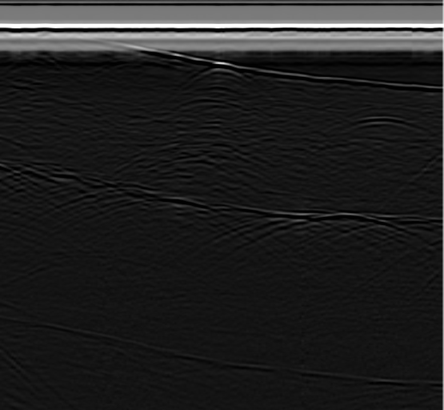
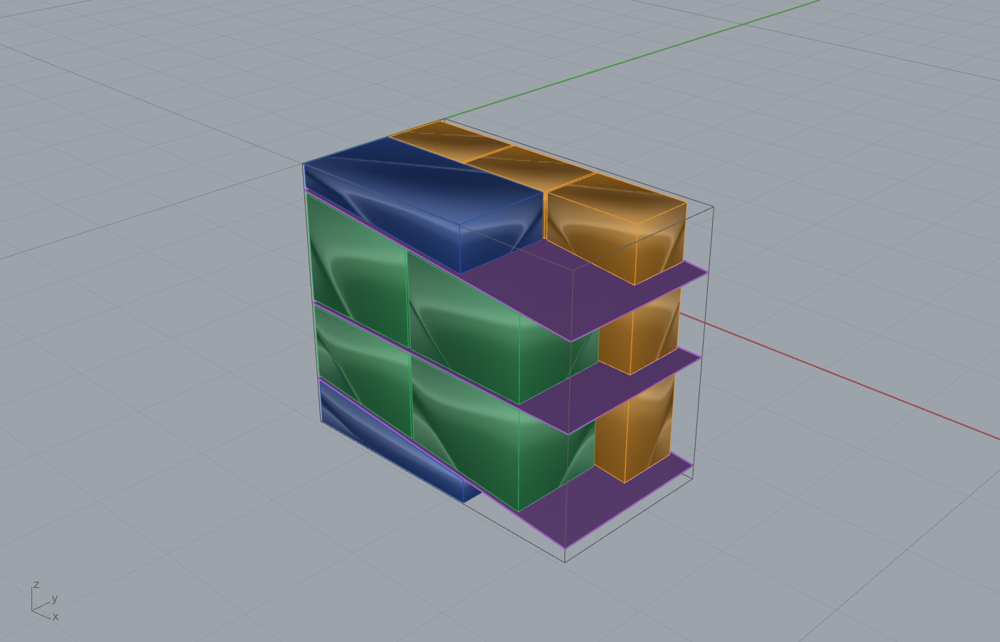
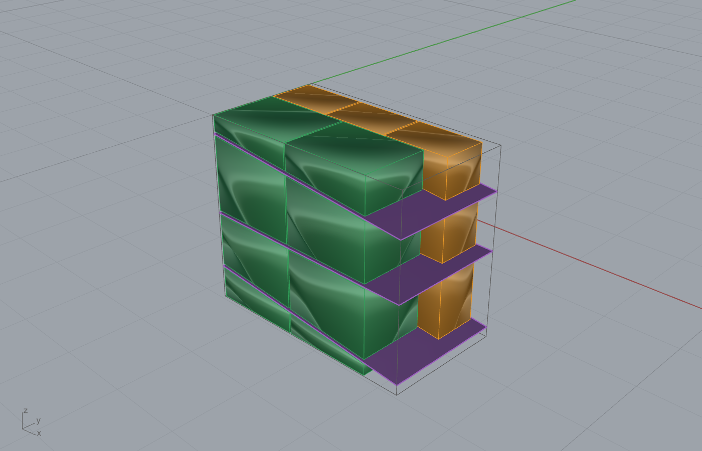
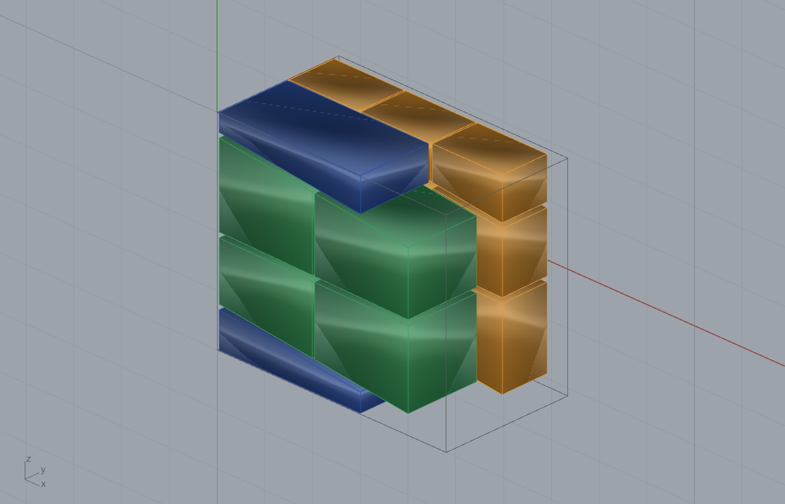
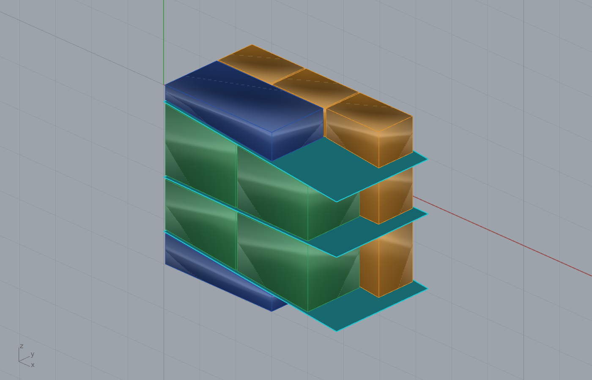
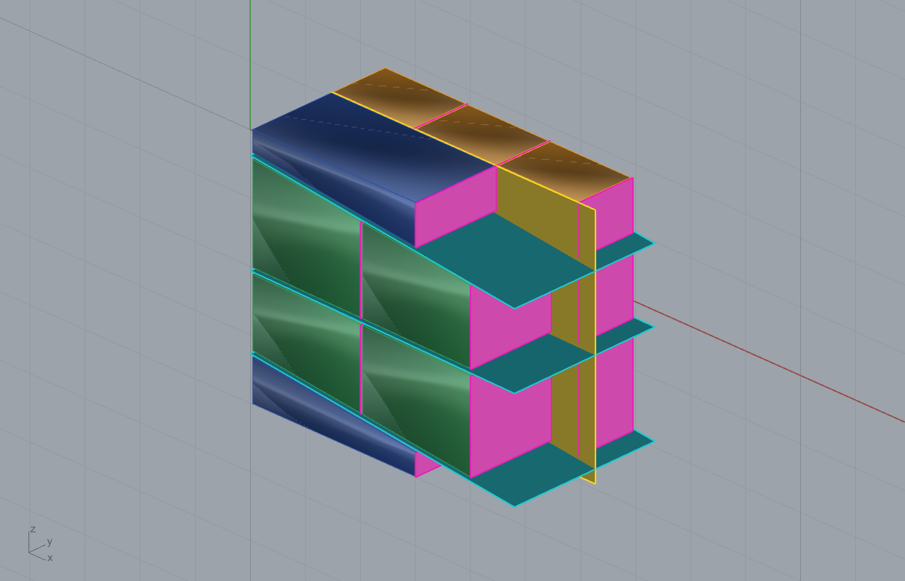

# Example 08 - GPR fracture survey (Botticino marble, 600 MHz grid)

Read a 600 MHz GPR grid survey of Botticino marble, migrate, and extract fracture reflectors for the
marble-quarry block-layout decision. Companion to the granite GPR spine (example 03). Units: meters.
Style: short sentences, no em dashes.

## Data (colocated, works out of the box)
The GPR files are bundled next to the cards in `gpr_data/` so the workflow runs without external
downloads:

- `gpr_data/LA010001.DT` + `.HDR_DT` (185 traces x 512 samples), `LA010002.DT` + `.HDR_DT` - IDS/GSSI
  `.DT` radargrams of Botticino marble. Verified readable via `GprFileReader.Load`.

Full provenance: `gpr_data/_SOURCE.md` and `../../data/DATA_ACCESS.md` (Drive master folder
https://drive.google.com/drive/folders/1mDj1Z20BB70SrkjQKnU6O3kDbfuA-mcS).

## Cards
- `marble_600_grid1.gh`, `marble_600_grid2.gh`, `marble_600_grid3.gh` - the three grid-line workflows
  (ingest -> migrate -> extract -> 3D fracture surface). Set the GPR file input to a `gpr_data/*.DT`.

## Run
1. Open Rhino 8 + Grasshopper with the Frahan `.gha` deployed.
2. Open a `marble_600_grid*.gh`. Point the GPR file input at `gpr_data/LA010001.DT`.
3. Flip the per-stage Run toggles (INGEST -> MIGRATE -> EXTRACT). The radargram + picks appear.

## Tested
`GprFileReader.Load` reads `LA010001.DT` (185 x 512). The AGC-gained radargram above is rendered
directly from that file. Component: `GPR Fracture Extract` / `GPR Fracture Surfaces 3D` (Frahan > Quarry).

## Block-layout study (cost vs volume vs balanced, on the REAL fracture grid)
The extracted beds drive a full dimension-block layout and cost/volume optimisation. The two profiles
yield 280 picks clustered into **3 real dipping beds** (0.72 m / 6.1 deg, 2.10 m / 0.9 deg, 3.70 m /
6.1 deg; sub-cm plane-fit RMS). The bed spacing (0.72, 1.38, 1.59, 0.30 m) caps block height. Blocks
are packed under `net + W*volume` swept from cost to volume.

Oblique (bed-following) guillotine, the higher-yield plan:

| Objective | Blocks | Volume | NET value |
|---|---|---|---|
| Max cost | 13 | 32.16 m3 | $28,741 |
| Balanced | 15 | 36.32 m3 | $27,263 |
| Max volume | 20 | 38.85 m3 | $25,010 |

  

Flat (orthogonal) guillotine is fabricable on any gangsaw today but the dip wedges are waste, so it
recovers far less (max cost 20.26 m3 / $17,454). The **georeferencing prize** is the gap: oblique cuts
recover +11.9 m3 (+59%) and +$11,287 per bench, the business case for the scanning + georeferenced
marking last mile.

## Oblique guillotine cut sequence (the saw passes that free the blocks)
The oblique guillotine is a full-span cut plan where the bed-parallel passes are TILTED to follow each
dipping bed (that is what recovers the wedge a flat cut wastes). Staged over the balanced packing
(bench hidden):

1. The balanced oblique blocks, placed.
   
2. + 3 OBLIQUE bed-parallel cut planes (cyan), each tilted to its bed (~6 deg, ~0.9 deg, ~6 deg) -> frees
   the 4 layers along the natural parting.
   
3. + the vertical rip cuts that separate the blocks within each layer: one perp-Y cut (yellow, the
   1.5 m / 1.0 m beam split) and 23 perp-X rips (magenta) at the block boundaries.
   

3 oblique bed passes + 24 vertical rips. Every block is freed by a straight full-span pass; the only
difference from the flat plan is that the 3 horizontal passes are tilted, which is what needs the
georeferenced marking to execute. (The flat-guillotine equivalent uses horizontal passes at the dip-safe
envelope and leaves the wedges.) Cut planes are in the `obl_bedcut` / `obl_perpY` / `obl_perpX` layers of
the .3dm.

Full method, statistics, and limitations: `STATISTICAL_REPORT.md`. Numbers: `08_marble_cost_volume_metrics.json`.
Geometry: `08_marble_block_layout.3dm`. Companion synthetic study: `../25_marble_gangsaw_cost/`.
