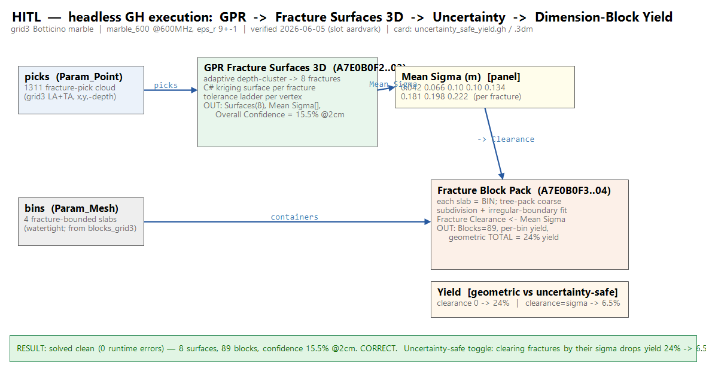

# Example 09 - Uncertainty-safe quarry yield (GPR fractures to block packing)

The full quarry decision: take the GPR-extracted fracture surfaces, treat the GPR position uncertainty
as a keep-out margin, and pack saw-cuttable dimension blocks only into the intact rock between the
fractures. The geologist + quarry-engineer master spine: GPR scans to block packing. Units: meters.
Style: short sentences, no em dashes.

## What it shows
GPR fracture surfaces (from the granite spine, example 03) bound intact zones. `Fracture Block Pack`
packs fixed-size blocks into each zone with an inward `Fracture Clearance` set to the GPR position
sigma, so no block sits within the measured uncertainty of a fracture. Toggling Uncertainty Safe off
gives the optimistic geometric yield; on gives the uncertainty-safe yield. The two PNGs are the
rendered 3D result and its wireframe; `uncertainty_safe_yield_result.3dm` is the baked blocks.

## Files
- `uncertainty_safe_yield.gh` - the canvas (GPR fractures -> clearance -> Fracture Block Pack).
- `uncertainty_safe_yield_result.3dm` - baked uncertainty-safe block layout.
- `uncertainty_safe_yield_3d.png` / `_wire.png` - rendered result + wireframe.

## Data
Uses the granite GPR fracture picks from example 03 (`../03_gpr_fracture_granite/gpr_data/`). GPR data
provenance + Drive link in `../../data/DATA_ACCESS.md`.

## Component
`Fracture Block Pack` (Frahan > Quarry): tree-pack coarse subdivision + irregular-boundary fit per
intact zone, with a Fracture Clearance margin wired to the GPR sigma. Reports per-zone yield.
