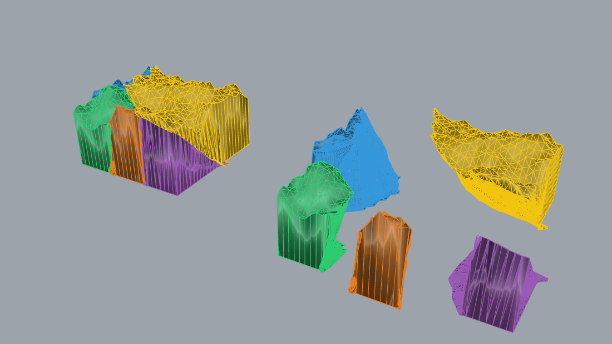

# Example 14 - Kintsugi fracture reassembly (Breaking Bad parity data, Port mode)

> **Scale, units, display (corrected 2026-06-06):** AUTO-SCALE OFF. The Port-mode network works in
> normalized space, so the reassembly is shown at the network's NATURAL scale (~0.24 x 0.24 x 1.0 units),
> base on z=0, centred in XY. No per-fragment rescale (rescaling made the two fragments read as stacked
> instead of meeting at the crack). DISPLAY = the two fragment POINT CLOUDS (1000 pts each) at the assembled
> poses, coloured per fragment (gold neck + blue body): the Breaking Bad data is point clouds, so a mesh
> display either interpenetrates (convex hull / Mesh Style 1) or is noisy (bbox-pulled / Mesh Style 3); the
> point clouds are the honest display and clearly show the two fragments MEETING at the fracture interface.
> Geometric tolerance 0.1 mm-class (scan-noise floor); no kerf (restoration, not cutting). See
> `../../wiki/research/tolerances_dimensions_slm_roses.md`.

Reassemble fractured fragments into the original solid by matching fracture surfaces. This is the
restoration / repair entrypoint (broken artefact -> joined). Style: short sentences, no em dashes.

*Built and solved live: 2 Breaking Bad fragments reassembled via the PuzzleFusion++ port (Port mode),
verifier pair score 0.71 (STRONG, > 0.5), 0 unplaced, 20 diffusion steps, GPU CUDA.*

## Synthetic data now works (fixed 2026-07-11)
The old warning ("synthetic Fragment Shatter does NOT reassemble") is retired. The generators were
re-aligned to the Breaking Bad training distribution: impact-biased fragment volumes, watertight pieces
(fan-capped cuts), refined + roughened mating fracture surfaces, outer skin preserved. Measured on the
learned verifier (same pipeline, 20 steps): synthetic chain max 0.603 with 3 STRONG pairs; real Breaking
Bad baseline 0.533 with 1; the OLD generator scored 0.062 with 0. Targets and method:
`D:\code_ws\outputs\2026-07-11\kintsugi_fracture_generator\REPORT.md`.

*`14_kintsugi_synthetic.gh`: Synthetic Block > Fragment Shatter (Impact Bias 0.9) > Fracture Roughen
(Amplitude 0.05) > Frahan Kintsugi (Port mode). Left: assembled block, crack lines irregular, skin intact.
Right: exploded fragments, one dominant piece + impact-local shards, rough watertight fracture surfaces.
Fully parametric, no external data needed.*

The parity sample below stays as the reference baseline (real Breaking Bad data).

## What it shows
`Load BB Sample` reads a FRKINTSU `.bin` (per-fragment point clouds + coarse hull meshes). `Frahan Kintsugi`
in Port mode runs the C# port of the PuzzleFusion++ diffusion denoiser + a geometric verifier; pairs scoring
above the threshold are placed at the network pose. Result: the fragments snap back into the original
vessel form. Measured: `2 placed, 0 unplaced; pair (0,1) score 0.7068 STRONG; total residual 0`.

## Files
- `14_kintsugi_synthetic.gh` - SYNTHETIC data canvas (no external data): Synthetic Block ->
  Fragment Shatter -> Fracture Roughen -> Frahan Kintsugi (Port). Sliders: Fragment Count / Seed /
  Impact Bias / Amplitude. Run toggles ship FALSE; Kintsugi Port run is async (minutes).
- `14_kintsugi_synthetic.png` / `14_kintsugi_synthetic_result.3dm` - baked generator result
  (assembled + exploded).
- `14_kintsugi_bb_parity.gh` - the parity canvas (built + solved live). Load BB Sample -> Frahan Kintsugi
  (Use Port Mode = True) -> Assembled Fragments + Report. MCP bridge stripped, grouped.
- `14_kintsugi_result.3dm` - the 2 reassembled fragment meshes (`14_Kintsugi_assembled`).
- `14_kintsugi_result.png` - shaded perspective capture.
- `data/bb_sample_00697.bin`, `data/bb_sample_5frag.bin` - Breaking Bad parity samples.

Knob guide (measured): Impact Bias 0.9 + Amplitude 0.05 = Breaking Bad statistics (learned-model
friendly). Amplitude 0.006 = real-granite facet roughness (measured on scanned shards). Impact Bias 0 =
legacy equal-volume shatter. Keep Fragment Count <= 20 (benchmark cap).

## Components
`Load BB Sample` / BBLoad and `Frahan Kintsugi` / Kintsugi (Frahan > Kintsugi). The geometric path
(Use Port Mode = False, via `Frahan.EdgeMatching.Core`, no GPL linked) is deterministic and best on
clean, sharp fracture rims. The Port path (Use Port Mode = True, GPL-3.0 `Frahan.Kintsugi.Port`) is the
learned assembler and needs the weight file.

## REQUIRED: kintsugi.bin (Port mode)
Port mode needs `kintsugi.bin` (~267 MB) in the Grasshopper Libraries deploy folder next to the `.gha`
(`%APPDATA%/Grasshopper/Libraries/kintsugi.bin`). It is gitignored (too large for the repo); fetch it from
the release artifacts or convert from the upstream checkpoint (`Weights/convert_pytorch_checkpoint.py`).
Without it, Port mode warns; fall back to the geometric path on clean-rim data. See `handoffs/KNOWN_BUGS.md`.

## Run
1. Deploy the `.gha` + `kintsugi.bin` (Rhino closed). Open the `.gh`.
2. Point `Sample File` at a `data/bb_sample_*.bin`. Toggle `Run` true.
3. Port mode is ASYNC: watch the component Message (`step k/20 ...`); results pop in when done. Read the
   `Report` verifier score distribution (memory rule: read scores first to diagnose pose vs network issues).

## Best practices
Per `../GRASSHOPPER_BEST_PRACTICES.md`: coloured Group, default-false Run gate. Port mode is the async
load-once pattern. Results pre-baked so reviewers see the reassembly without Grasshopper.
