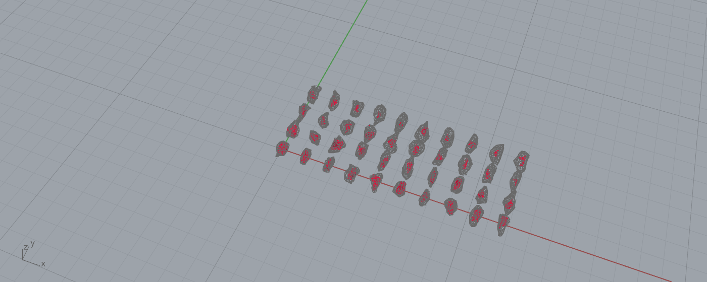
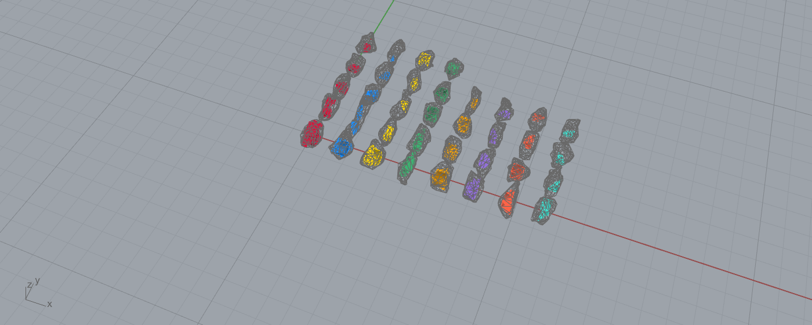
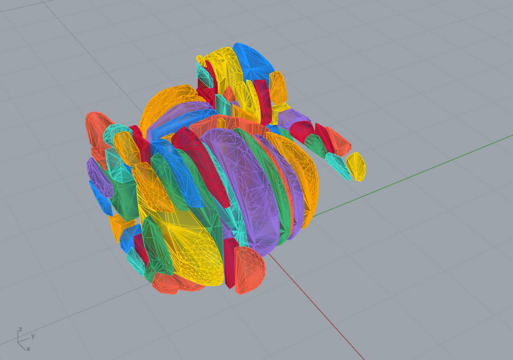
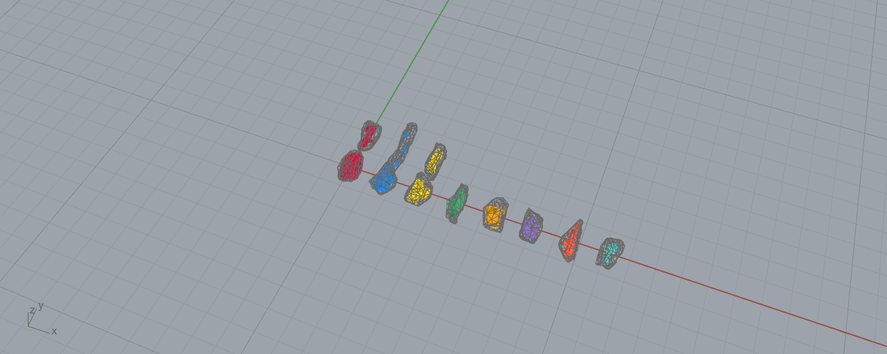

# Example 15 - Statue / monument to brick blocks (factory workflow)

> **Scale, units, position:** METERS. Stanford bunny scaled to a 3.0 m max extent (envelope
> 3.0 x 2.957 x 2.32 m), base on the z=0 bed plane, centred in XY. Brick grid 0.5 m. Geometric
> tolerance 1 mm (scale-relative). Saw kerf 5-10 mm at the cut stage (Branch A). See
> `../../wiki/research/tolerances_dimensions_slm_roses.md`.

Decompose a sculpture into ~0.5 m brick-like blocks where the boundary blocks carry the REAL statue
surface, not bounding boxes. The output is a set of clean closed block meshes ready for 3D packing into
a quarry block / gangsaw and for matching against a rubble lot. This is the factory-level entrypoint:
form-first (top-down) sculpture goes in, fabricable stone blocks come out. Style: short sentences, no
em dashes.

## The real-face guarantee (the core idea)
A 0.5 m brick grid covers the statue bounding box. Each cell box is INTERSECTED (CGAL boolean) with the
closed statue solid. Interior cells return a full 0.5 m cube. Boundary cells return the cell clipped by
the statue surface, so they keep the REAL mesh faces on the outside and clean planar cut faces on the
grid sides. Empty cells (outside the statue) are dropped. The single-block detail below shows it: the
curved densely-triangulated face is the real bunny surface; the flat faces are the grid cuts.

## Measured live result (this run, verified)
- Source: `data/stanford_scans/.../bun_zipper_res2.ply` (8171 v / 16301 f, ASCII).
- Sanitize: Geogram `FillHoles` -> `RemeshUniform(5000)` -> `FillHoles`. Result is a clean watertight
  solid: **closed = true, manifold = true, 9996 faces**. The remesh both rebuilds valid topology (so
  `IsPointInside` works for interior-skip) and caps face count for speed.
- Grid 6 x 6 x 5 = 180 cells, block 0.5 m. Classification: **7 interior cubes, 106 real-face boundary
  blocks, 67 empty cells dropped**. 173 CGAL booleans, 0 failures, **3.6 s** in-process.
- **113 blocks total, all closed (113/113), boundary blocks all closed (106/106).**
- **Recovered volume ratio = 1.0000** (5.4009 m3 statue = 5.4009 m3 of blocks; a complete partition,
  measured with RhinoCommon `VolumeMassProperties`, which is orientation-robust). Block volumes range
  0 to 0.125 m3 (a full cube), median 0.036 m3.

## Why the remesh matters (the fix)
The raw scan has open base holes and non-manifold edges. After `FillHoles` + `Weld` alone the mesh was
closed but still non-manifold, and `Mesh.IsPointInside` returned false everywhere, so interior-skip
classification failed and CGAL corefinement rejected the inputs (rc -12, "inputs not closed / manifold
/ consistently oriented"). Geogram `RemeshUniform` rebuilds a fresh 2-manifold surface from a uniform
point sampling. That is what makes both the interior test and the CGAL boolean work. A welded 8-vertex
box (not Rhino's 24-vertex `CreateFromBox`, which is unwelded and non-manifold) is required on the cutter
side too.

## Pipeline
1. SOURCE: real Stanford bunny scan (`.ply`, ASCII), parsed directly (fast, no UI importer hang).
2. SCALE + PLACE: uniform scale so max extent = 3.0 m; base to z=0; centre XY.
3. SANITIZE: Geogram FillHoles -> RemeshUniform -> FillHoles -> closed 2-manifold solid.
4. DECOMPOSE: 0.5 m grid; per cell, interior-skip (cube, no boolean) or CGAL `Intersection` (real-face
   block). Drop empties. Tag interior vs boundary; per-block VolumeMassProperties + AABB.
5. METRICS: block count, interior/boundary split, recovered-volume ratio, block-size distribution.
6. BRANCH A: pack the blocks into a quarry block / gangsaw (saw-cuttable). See below.
7. BRANCH B: match each block to a rubble stone from an ETH1100 lot. See below.

## Files
- `PLAN.md` - the full connection plan and out-of-process spec.
- `15_blocks.3dm` - the result: clean bunny (`15_bunny_remesh`), interior cubes
  (`15_blocks_interior`), real-face boundary blocks (`15_blocks_boundary`).
- `15_blocks_metrics.json` - per-block tag, volume, AABB + the aggregate metrics above.
- `15_step1_clean_bunny_remesh.png` - sanitized 3 m bunny on the bed.
- `15_step2_blocks_exploded.png` - exploded brick decomposition, interior (blue) vs boundary (red).
- `15_step2_block_detail.png` - one boundary block: real face vs flat grid cuts.

## Components / engine
- `Quarry Decompose By Mesh (CGAL)` (Frahan > Quarry) is the canvas component for this; here it was
  driven directly through the Core API (`CgalMeshBoolean.Intersection`, `GeogramMesh.RemeshUniform`,
  `GeogramMesh.FillHoles`) for headless control and per-cell timing.
- Interior-skip optimization: cells with no surface vertex and all 8 corners + centre inside emit a
  cube with no boolean. This cuts the boolean count to the boundary shell.

## Tolerances (METERS doc)
- Geometric eps scale-relative; CGAL recenters internally. Absolute tol ~1 mm for a 3 m / 0.5 m model.
- Remesh target ~ block / 20 (~25 mm edge); 5000 points gives ~25 mm spacing on this envelope.
- Saw kerf 5-10 mm (diamond wire) applied at the pack/cut stage, not the decompose.

## Branch A - gangsaw cut-from yield (verified)

The carved blocks sit inside their quarry-block envelope: the 6 x 6 x 5 grid = 3.0 x 3.0 x 2.5 m =
**22.5 m3** of raw stone. The statue is 5.40 m3, so the **gangsaw yield is 24.0 %** (76 % becomes
offcut). That is the honest factory cost of carving a freeform form from a rectangular block. Because
the grid is ALIGNED, every cut plane is axis-aligned and the plan is guillotine-separable by
construction: a gangsaw makes the planar 0.5 m cuts, then the boundary blocks are carved to the real
surface. Metrics in `15A_pack_metrics.json`.

Re-packing the loose pieces (logistics framing) is a separate question. `Block Pack (Tree)` (Kim 2025
guillotine, the same engine as example 11) re-nests the 100 fabricable pieces (>= 1 L) but places
83/100 into a 12 m3 block. The tree packer is tuned for small instances (Kim 2025 tested 45 elements),
so at 100+ pieces the practical paths are: batch by region, or keep the as-carved plan above. This is a
known packer-scaling limit, reported honestly rather than hidden.

## Branch B - carve blocks from a rubble lot (TRUE enclosure)

The goal: match each carved block to a real ETH1100 rubble stone it can be carved FROM, meaning the
block must sit FULLY INSIDE the stone (every block vertex inside the stone mesh).

**The flawed first attempt (AABB-containment proxy).** A sorted-AABB-dims fit with greedy one-to-one
assignment reported 30-58 % "yield", but it never tested real enclosure. Measured after the fact, the
matched blocks were only **30-47 % enclosed**: the rest poked through the irregular stone surface
(an AABB is bigger than the wavy stone inside it). Scaling the lot tighter made the piercing worse.
That proxy is superseded by the three true-enclosure methods below. Runner kept for reference:
`match_rubble.py`; the poke-out is visible in `15B_rubble_match_scaled.png`.

**The fix: true all-vertex enclosure.** All three methods below accept a placement only when every
block vertex returns `Mesh.IsPointInside == true` on the (closed, repaired) stone. Engine ported from
the verified containment test in `Fracture Block Pack` (`BlockInside` + voxel occupancy), driven
headless via `run_csharp` (native `IsPointInside` at ~1 us each). Lot: 150 closed ETH1100 stones,
natural scale; blocks: the 100 fabricable (>= 1 L) grid blocks, or the CoACD convex blocks.

### Three methods, head to head (same rubble lot, 100 % enclosure enforced)

| Method | Decomposition | Blocks placed | Stones used | Blocks / stone | Rubble used | Enclosure |
|---|---|---|---|---|---|---|
| A - evolved single fit | grid (real-face) | 54 / 100 | 54 | 1.0 | 11.9 m3 | 100 % |
| B - multi-bin pack | grid (real-face) | 74 / 100 | 36 | 2.1 | 19.8 m3 | 100 % |
| C - multi-bin pack | CoACD convex | 60 / 79 | 11 | 5.5 | 7.0 m3 | 100 % |

**A - evolved single-block fit** (`15A_evolvedfit.png`, `.3dm`, `15A_evolvedfit_metrics.json`). One block
per stone, carved from the tightest stone that can fully enclose it. The pose is *evolved*: 24
axis-rotation seeds, then a (1+8)-ES that perturbs rotation + translation to drive the outside-vertex
count to zero (21 of 54 needed the ES). Honest result: only **54 % of rectangular grid blocks can be
fully enclosed at all** in irregular rubble; a 0.5 m cube's corners hit the stone's concavities. Best
per-block fit, but one block per stone wastes the rest of each stone.

*A: each red grid block evolved into the tightest stone that fully encloses it (gray cage). One per stone.*

**B - multi-bin pack** (`15B_multibin_pack.png`, `15B_multibin.3dm`, `15B_multibin_metrics.json`). Each
stone is a bin; a voxel-occupancy FFD packer places multiple blocks per stone (real-vertex enclosure +
non-overlap), spilling to the next stone. Places more blocks (74) sharing 36 stones (2.1 / bin).

*B: grid blocks packed multiple-per-stone, coloured by bin.*

**C - CoACD convex blocks + multi-bin** (`15C_multibin_pack.png`, `15C_multibin.3dm`,
`15C_coacd_*.json/.3dm`, decomposition in `15C_coacd_decompose.png`). Decomposing the bunny with CoACD
(SarahWeiii 2022, threshold 0.06 m, 81 convex parts, recovery 1.02) instead of the grid gives convex
pieces that enclose far better in irregular rubble. Same multi-bin packer now reaches **5.5 blocks per
stone and just 11 stones** for 60 blocks - roughly 3x fewer stones than the grid blocks.

*CoACD convex decomposition of the 3 m bunny (81 parts).*

*C: convex blocks packed multiple-per-stone; far denser than grid blocks.*

### Read-out
- All three enforce TRUE enclosure (100 %), fixing the 30-47 % poke-out of the AABB proxy.
- Evolving the pose (A) gives the best single-block fit but cannot enclose ~46 % of rectangular blocks
  and wastes one stone per block.
- Multi-bin (B) shares stones and places more blocks.
- The real lever is the DECOMPOSITION: CoACD convex blocks (C) enclose and pack dramatically better
  than rectangular grid blocks (11 vs 36 stones). For a rubble-carving factory, decompose convex.
- Honest limits: greedy FFD is not optimal bin-minimisation; axis-aligned-only placement (6 orientations
  in the packer, 24 seeds in the evolved fit) under-fills wavy stones; corner/voxel sampling is backed
  by a final all-vertex enclosure check. `Adaptive Block Match 3D` (trim oversize stones) and the
  face-mating `Block Pair Match 3D` (when built) are the next refinements.

## Performance note (in-process vs out-of-process)
In-process (live Rhino via MCP) is fast and stable on the res2 + remesh path: 3.6 s for 173 booleans,
no lag, no crash. The earlier lag was the full 70k-face `bun_zipper.ply` + in-process FillHoles
exceeding the MCP timeout. For very large statues (multi-100k faces) the out-of-process harness mode
(`--statueblocks`, Rhino.Inside) is the production path; the algorithm is identical.
