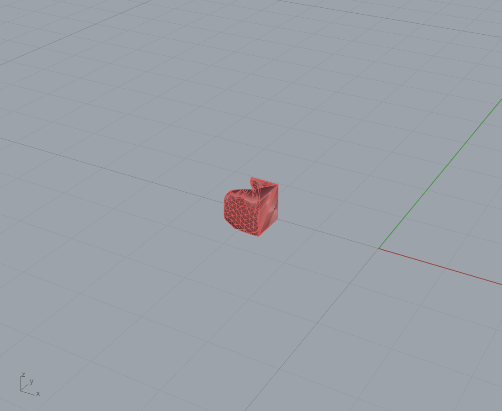
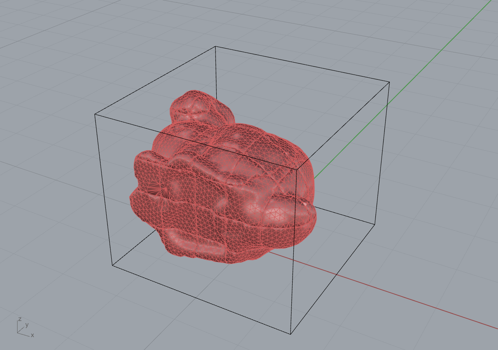
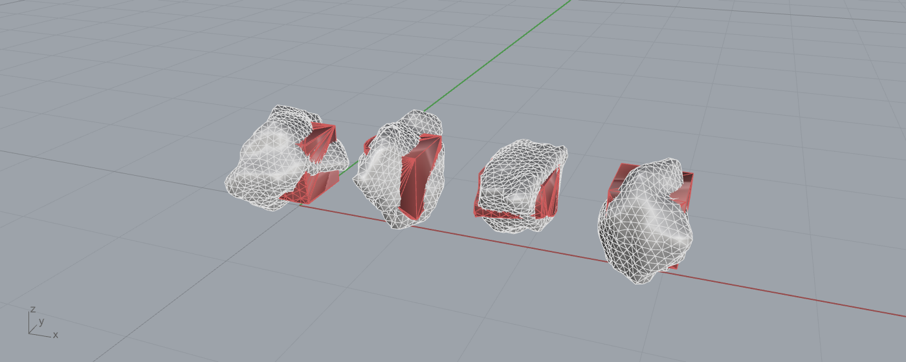
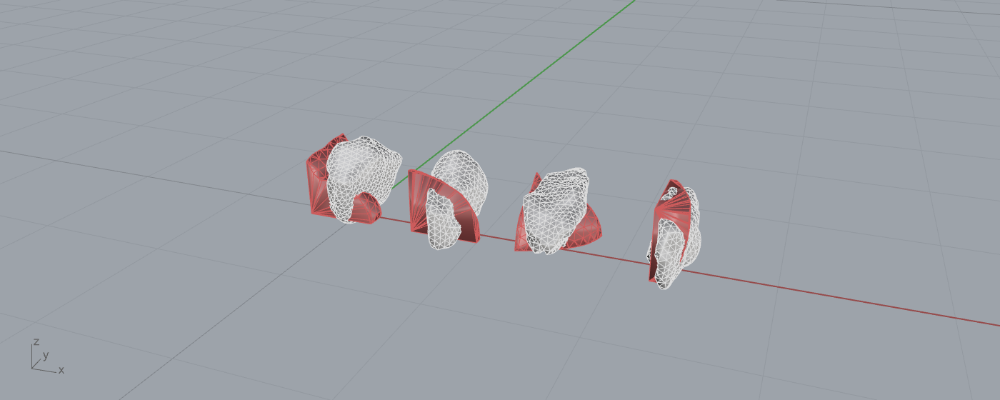

# Example 15 - Statue / monument to brick blocks (factory workflow)

> **Scale, units, position:** METERS. Stanford bunny scaled to a 3.0 m max extent (envelope
> 3.0 x 2.957 x 2.32 m), base on the z=0 bed plane, centred in XY. Brick grid 0.5 m. Geometric
> tolerance 1 mm (scale-relative). Saw kerf 5-10 mm at the cut stage (Branch A). See
> `../../wiki/research/tolerances_dimensions_slm_roses.md`.

Decompose a sculpture into ~0.5 m brick-like blocks where the boundary blocks carry the REAL statue
surface, not bounding boxes. The output is a set of clean closed block meshes ready for 3D packing into
a quarry block / gangsaw and for matching against a rubble lot. This is the factory-level entrypoint:
form-first (top-down) sculpture goes in, fabricable stone blocks come out. Style: short sentences, no
em dashes.

## The real-face guarantee (the core idea)
A 0.5 m brick grid covers the statue bounding box. Each cell box is INTERSECTED (CGAL boolean) with the
closed statue solid. Interior cells return a full 0.5 m cube. Boundary cells return the cell clipped by
the statue surface, so they keep the REAL mesh faces on the outside and clean planar cut faces on the
grid sides. Empty cells (outside the statue) are dropped. The single-block detail below shows it: the
curved densely-triangulated face is the real bunny surface; the flat faces are the grid cuts.

## Measured live result (this run, verified)
- Source: `data/stanford_scans/.../bun_zipper_res2.ply` (8171 v / 16301 f, ASCII).
- Sanitize: Geogram `FillHoles` -> `RemeshUniform(5000)` -> `FillHoles`. Result is a clean watertight
  solid: **closed = true, manifold = true, 9996 faces**. The remesh both rebuilds valid topology (so
  `IsPointInside` works for interior-skip) and caps face count for speed.
- Grid 6 x 6 x 5 = 180 cells, block 0.5 m. Classification: **7 interior cubes, 106 real-face boundary
  blocks, 67 empty cells dropped**. 173 CGAL booleans, 0 failures, **3.6 s** in-process.
- **113 blocks total, all closed (113/113), boundary blocks all closed (106/106).**
- **Recovered volume ratio = 1.0000** (5.4009 m3 statue = 5.4009 m3 of blocks; a complete partition,
  measured with RhinoCommon `VolumeMassProperties`, which is orientation-robust). Block volumes range
  0 to 0.125 m3 (a full cube), median 0.036 m3.

## Why the remesh matters (the fix)
The raw scan has open base holes and non-manifold edges. After `FillHoles` + `Weld` alone the mesh was
closed but still non-manifold, and `Mesh.IsPointInside` returned false everywhere, so interior-skip
classification failed and CGAL corefinement rejected the inputs (rc -12, "inputs not closed / manifold
/ consistently oriented"). Geogram `RemeshUniform` rebuilds a fresh 2-manifold surface from a uniform
point sampling. That is what makes both the interior test and the CGAL boolean work. A welded 8-vertex
box (not Rhino's 24-vertex `CreateFromBox`, which is unwelded and non-manifold) is required on the cutter
side too.

## Pipeline
1. SOURCE: real Stanford bunny scan (`.ply`, ASCII), parsed directly (fast, no UI importer hang).
2. SCALE + PLACE: uniform scale so max extent = 3.0 m; base to z=0; centre XY.
3. SANITIZE: Geogram FillHoles -> RemeshUniform -> FillHoles -> closed 2-manifold solid.
4. DECOMPOSE: 0.5 m grid; per cell, interior-skip (cube, no boolean) or CGAL `Intersection` (real-face
   block). Drop empties. Tag interior vs boundary; per-block VolumeMassProperties + AABB.
5. METRICS: block count, interior/boundary split, recovered-volume ratio, block-size distribution.
6. BRANCH A: pack the blocks into a quarry block / gangsaw (saw-cuttable). See below.
7. BRANCH B: match each block to a rubble stone from an ETH1100 lot. See below.

## Files
- `PLAN.md` - the full connection plan and out-of-process spec.
- `15_blocks.3dm` - the result: clean bunny (`15_bunny_remesh`), interior cubes
  (`15_blocks_interior`), real-face boundary blocks (`15_blocks_boundary`).
- `15_blocks_metrics.json` - per-block tag, volume, AABB + the aggregate metrics above.
- `15_step1_clean_bunny_remesh.png` - sanitized 3 m bunny on the bed.
- `15_step2_blocks_exploded.png` - exploded brick decomposition, interior (blue) vs boundary (red).
- `15_step2_block_detail.png` - one boundary block: real face vs flat grid cuts.

## Components / engine
- `Quarry Decompose By Mesh (CGAL)` (Frahan > Quarry) is the canvas component for this; here it was
  driven directly through the Core API (`CgalMeshBoolean.Intersection`, `GeogramMesh.RemeshUniform`,
  `GeogramMesh.FillHoles`) for headless control and per-cell timing.
- Interior-skip optimization: cells with no surface vertex and all 8 corners + centre inside emit a
  cube with no boolean. This cuts the boolean count to the boundary shell.

## Tolerances (METERS doc)
- Geometric eps scale-relative; CGAL recenters internally. Absolute tol ~1 mm for a 3 m / 0.5 m model.
- Remesh target ~ block / 20 (~25 mm edge); 5000 points gives ~25 mm spacing on this envelope.
- Saw kerf 5-10 mm (diamond wire) applied at the pack/cut stage, not the decompose.

## Branch A - gangsaw cut-from yield (verified)

The carved blocks sit inside their quarry-block envelope: the 6 x 6 x 5 grid = 3.0 x 3.0 x 2.5 m =
**22.5 m3** of raw stone. The statue is 5.40 m3, so the **gangsaw yield is 24.0 %** (76 % becomes
offcut). That is the honest factory cost of carving a freeform form from a rectangular block. Because
the grid is ALIGNED, every cut plane is axis-aligned and the plan is guillotine-separable by
construction: a gangsaw makes the planar 0.5 m cuts, then the boundary blocks are carved to the real
surface. Metrics in `15A_pack_metrics.json`.

Re-packing the loose pieces (logistics framing) is a separate question. `Block Pack (Tree)` (Kim 2025
guillotine, the same engine as example 11) re-nests the 100 fabricable pieces (>= 1 L) but places
83/100 into a 12 m3 block. The tree packer is tuned for small instances (Kim 2025 tested 45 elements),
so at 100+ pieces the practical paths are: batch by region, or keep the as-carved plan above. This is a
known packer-scaling limit, reported honestly rather than hidden.

## Branch B - match to a rubble lot (verified)
Each carved block is matched one-to-one to a stone from an ETH1100 rubble lot (the block is carved from
that stone). `Block Pair Match 3D` (planar-face mating) is still a skeleton, so this uses an honest
AABB-containment proxy: a block fits a stone iff its sorted AABB dims are all <= the stone's sorted AABB
dims (axis-permutable). Greedy one-to-one assignment, largest block first, picks the smallest-volume
stone that still contains the block (max carve yield). Carve yield = block true volume / stone true
volume. `Soft ICP 3D` refines the pose post-match. Runner: `match_rubble.py` (parses the OBJ lot
directly). Units: meters.

Two framings, both verified on 400 ETH1100 stones, 100 fabricable blocks (>= 1 L):

| Framing | Mean carve yield | Rubble used | Matched |
|---|---|---|---|
| Natural rubble (0.5-1.4 m, as scanned) | 30.3 % | 21.5 m3 | 100/100 |
| Rubble scaled to the avg block (x0.74, mean stone 0.53 m) | 58.8 % | 8.9 m3 | 100/100 |

Natural ETH stones are much larger than the <= 0.5 m blocks, so small blocks sit in oversized stone
(low yield, lots of waste). Scaling the lot to the average block being cut (uniform x0.7355 so the mean
stone is 1.4x the average block linearly, natural size variation preserved) more than doubles the mean
yield and halves the rubble consumed. Both are kept for comparison.

*Natural ETH1100 rubble (oversized): each carved block (red) nested in its matched stone (ghosted).*

*Rubble scaled to the average block: snug carve fit, ~50-60 % yield.*

Honest limit: AABB-containment over-promises on the highest-yield matches (block AABB approx stone
AABB), because the irregular stone is smaller than its AABB, so a full block can pierce the real
surface. True surface-containment (or the face-mating `Block Pair Match 3D` once built, plus
`Adaptive Block Match 3D` to trim oversize stones) replaces the proxy. Convert mm-default matchers to
meters at the boundary.

## Performance note (in-process vs out-of-process)
In-process (live Rhino via MCP) is fast and stable on the res2 + remesh path: 3.6 s for 173 booleans,
no lag, no crash. The earlier lag was the full 70k-face `bun_zipper.ply` + in-process FillHoles
exceeding the MCP timeout. For very large statues (multi-100k faces) the out-of-process harness mode
(`--statueblocks`, Rhino.Inside) is the production path; the algorithm is identical.
