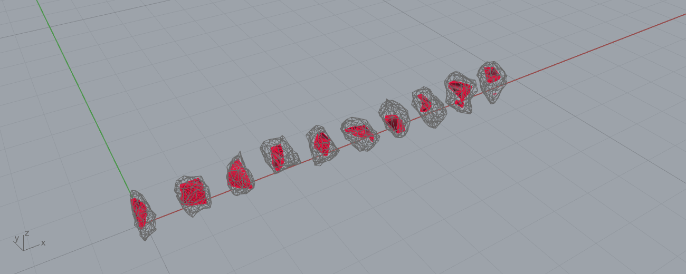

# Example 19 - Rubble Evolved Fit (component demonstrator)

Demonstrator for the new `Rubble Evolved Fit` component (Frahan > Quarry, in `Frahan.RubblePack.gha`).
Match each carved block to the tightest rough rubble stone that can FULLY ENCLOSE it, evolving the
placement pose until every block vertex is inside the stone. One block per stone. Units: meters.

## What it shows
10 carved boundary blocks (from example 15) each carved from one ETH1100 rubble stone. The pose is
evolved: 24 axis-rotation seeds, then a (1+8) evolution strategy that perturbs rotation + translation
until the outside-vertex count reaches zero. Tested live through the GH component.

Measured (this run): **10/10 placed, 100% enclosure (every vertex inside), 7 needed the ES, mean carve
yield 12.1%.** Each red block sits fully inside its gray stone cage. Metrics in `19_evolved_fit_metrics.json`.

## Files
- `19_rubble_evolved_fit.gh` - the canvas: Blocks + Stones (internalized) -> Rubble Evolved Fit -> placed.
- `19_rubble_evolved_fit.3dm` - baked placed blocks (red) + matched stone cages (wireframe).
- `19_evolved_fit.png` - shaded capture.
- `19_evolved_fit_metrics.json` - placed, enclosure, ES count, yield.

## Component
`Rubble Evolved Fit` (Frahan > Quarry). Inputs: Blocks, Stones, Candidates, Seed, Run. Outputs: Placed,
Stone Index, Yield, Report. Compare with `Rubble Multi-Bin Pack` (example 20). See example 15 Branch B
for the head-to-head (evolved fit vs multi-bin vs CoACD). Needs `Frahan.RubblePack.gha` deployed.
