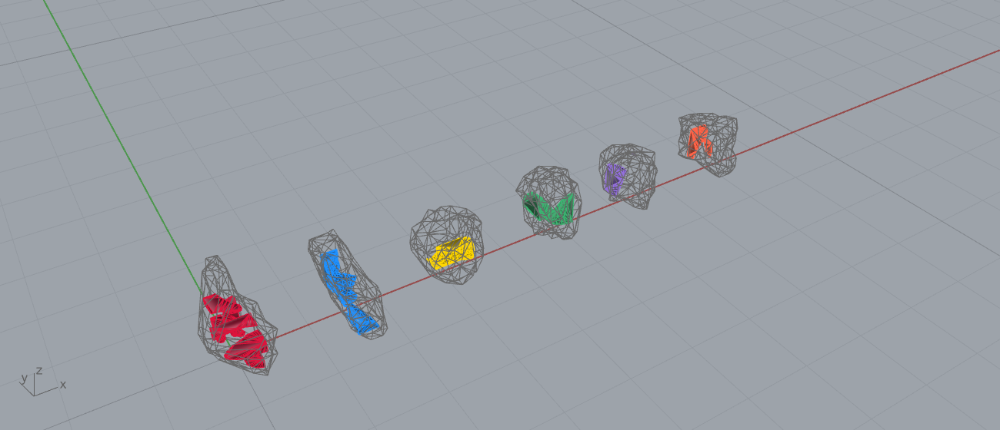

# Example 20 - Rubble Multi-Bin Pack (component demonstrator)

Demonstrator for the new `Rubble Multi-Bin Pack` component (Frahan > Quarry, in
`Frahan.RubblePack.gha`). Pack many carved blocks into each rough rubble stone (one stone = one bin),
spilling to the next stone when full, with TRUE per-vertex enclosure. Units: meters.

## What it shows
20 small carved boundary blocks (from example 15) packed into the 6 largest of 30 ETH1100 stones. A
per-stone voxel-occupancy grid (built from `Mesh.IsPointInside`) drives a first-fit-decreasing
placement; a block is accepted only when every vertex is inside the stone and the kerf-padded voxel
footprint is free. Tested live through the GH component.

Measured (this run): **17/20 placed across 6 bins, 2.8 blocks per stone, 100% enclosure**, voxel 0.04 m,
kerf 0.005 m. Each gray stone cage holds several blocks of one bin-colour. Metrics in
`20_multibin_metrics.json`.

## Files
- `20_rubble_multibin.gh` - the canvas: Blocks + Stones (internalized) -> Rubble Multi-Bin Pack.
- `20_rubble_multibin.3dm` - baked placed blocks (coloured by bin) + stone cages (wireframe).
- `20_multibin.png` - shaded capture (bins offset on a row).
- `20_multibin_metrics.json` - placed, bins, blocks/bin, enclosure.

## Component
`Rubble Multi-Bin Pack` (Frahan > Quarry). Inputs: Blocks, Stones, Voxel Size, Kerf, Run. Outputs:
Placed, Bin Index, Bin Fill, Report. The multi-block-per-stone counterpart to `Rubble Evolved Fit`
(example 19). Needs `Frahan.RubblePack.gha` deployed. Convex blocks (CoACD, example 15 Branch C) pack
far denser than rectangular blocks.
