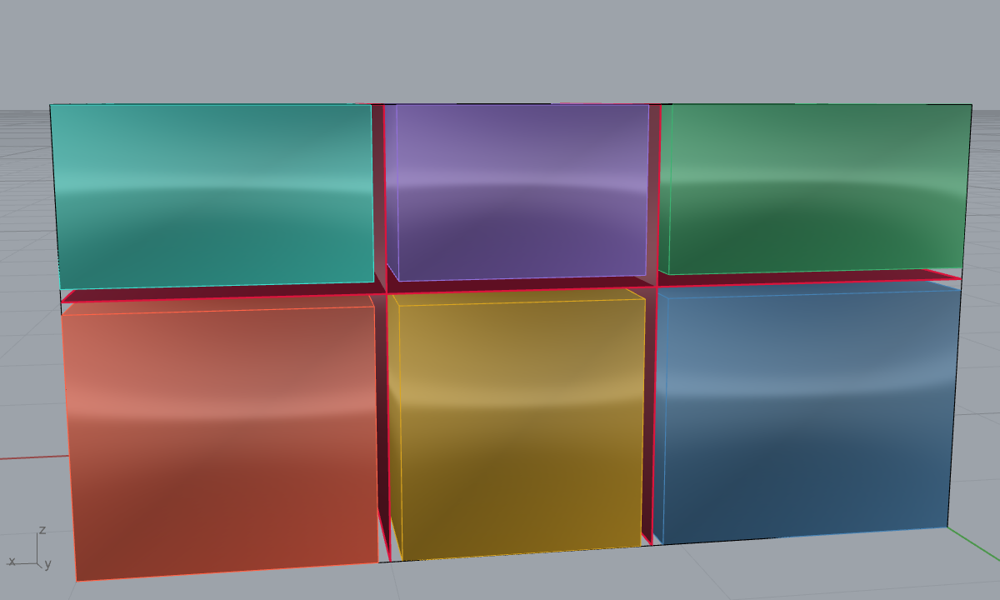
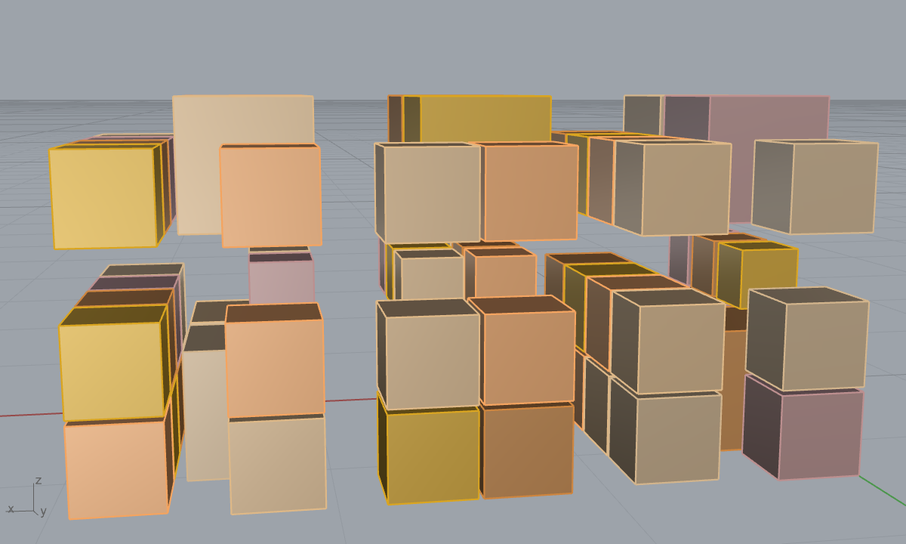

# Example 23 - Quarry to slab (fracture-aware blocks then gangsaw slabs)

The full quarry-to-slab production chain with a complete material-flow analysis: a fracture-prone
quarry block is packed into standard dimension blocks that avoid the fractures, then each block is
gangsaw-cut into slabs. Units: meters. Style: short sentences, no em dashes.

## Pipeline (the right components)
1. FRACTURE-PRONE QUARRY BLOCK: a 3.0 x 1.5 x 1.5 m block (6.75 m3) crossed by 3 fractures, split into
   6 intact zones with a 40 mm keep-out around each fracture.
   
2. STANDARD BLOCK PACK (fracture-aware): `Fracture Block Pack` (Frahan > Quarry, voxel-dlbf-multi,
   8 mm kerf) packs standard 0.5 m dimension blocks into each intact zone, never crossing a fracture.
   100% guillotine-separable (saw-cuttable).
   
3. GANGSAW SLABBING: each recovered block is cut along its longest axis into 20 mm slabs with a 3 mm
   saw kerf.
   

## Complete material-flow analysis (this run)
| Stage | Volume | Loss | Note |
|---|---|---|---|
| Quarry block | 6.75 m3 | - | 3.0 x 1.5 x 1.5 m |
| Intact rock (after fractures) | 6.05 m3 | -10.4% | 6 zones, 40 mm fracture keep-out |
| Standard blocks recovered | 2.98 m3 | -50.7% | 60 blocks, 49.3% of intact (Fracture Block Pack) |
| Finished slabs | 2.52 m3 | -15.5% | 888 slabs (20 mm), 3 mm saw kerf |

End to end: **6.75 m3 of quarry rock yields 2.52 m3 of finished 20 mm slab = 126 m2 of slab face**
(18.7 m2 of slab per m3 of quarry; 37.3% overall volume yield). The two big losses are the
fracture-aware block packing (irregular intact zones cannot be fully tiled with rectangular blocks) and
the gangsaw kerf. Metrics in `23_quarry_to_slab_metrics.json`.

## Why this order (block then slab)
Slabs are cut FROM standard dimension blocks, not directly from the quarry: the block stage squares the
rough fracture-bounded rock into saw-ready rectangular stock, and the gangsaw then ranks parallel slabs
off each block. Packing standard blocks first also maximises the saw-separable (guillotine) yield and
keeps the fractures as keep-out so no slab crosses a flaw.

## Components
`Fracture Block Pack` (a7e0b0f3, Frahan > Quarry) for the fracture-aware standard-block pack;
gangsaw slabbing by parallel cutting (20 mm + 3 mm kerf). The fracture-prone block + intact zones are
built directly; for real GPR-derived fractures wire `GPR Fracture Surfaces 3D` -> `Slab Cut By
Fractures` -> these intact zones (see example 09).

## Files
- `23a_fractureprone_block_zones.png`, `23b_packed_blocks.png`, `23c_slabs.png` - the three stages.
- `23_quarry_to_slab_metrics.json` - the full material-flow cascade.
