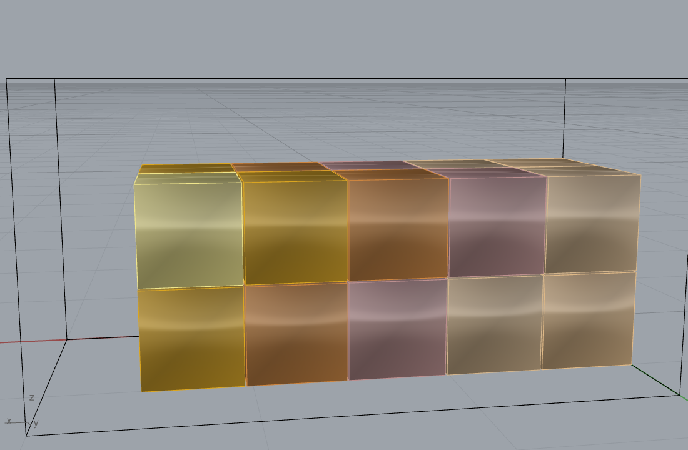
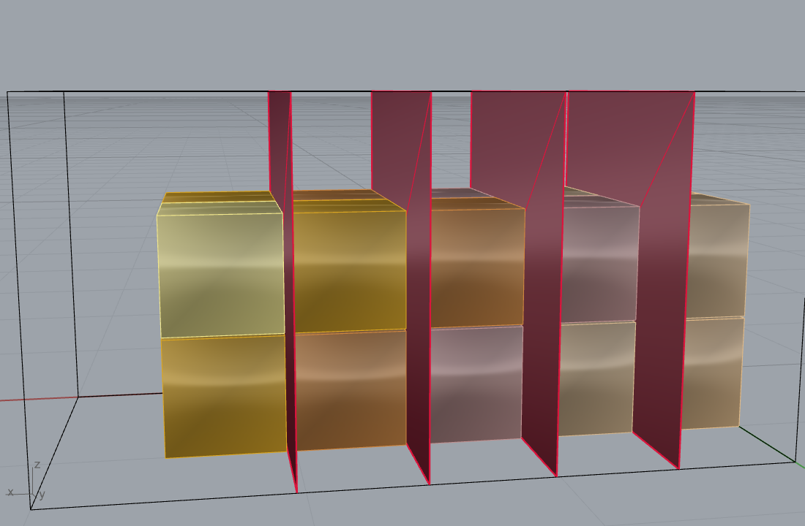
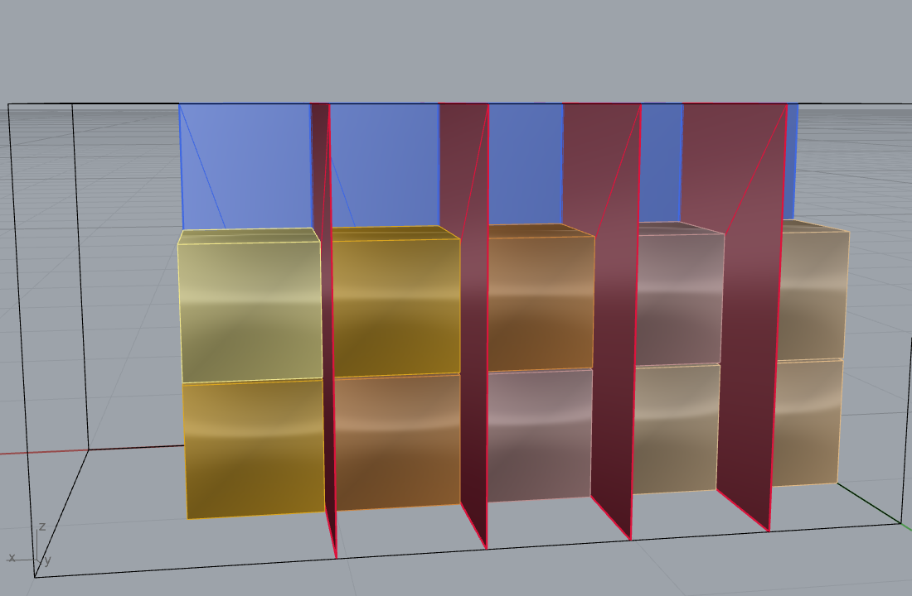

# Example 24 - Guillotine cut sequence (quarry block to dimension blocks)

Show the guillotine saw cuts that turn a quarry block into dimension blocks, as mesh cutting planes, in
the real sequential order: rip into slabs, then cross-cut into columns, then cross-cut into blocks.
Every cut is edge-to-edge (full-span within its sub-region) - the definition of a guillotine cut.
Units: meters. Style: short sentences, no em dashes.

## Sequence (staged captures)
The captures accumulate the cut planes stage by stage; earlier stages stay, each new plane set is added
and stays visible.

1. The quarry block (3.0 x 1.5 x 1.5 m) packed with 0.5 m dimension blocks (5 x 2 x 2 = 20), 10 mm saw
   kerf.
   
2. RIP cuts perpendicular to X (red, full-span) -> slabs.
   
3. + CROSS-Y cuts (blue, per slab) -> columns.
   
4. + CROSS-Z cuts (green, per column) -> the 20 finished blocks.
   

## Counts (this run)
20 blocks, **19 guillotine cuts**: 4 rip (perp X), 5 cross-Y, 10 cross-Z. Each cut plane is rendered as
a mesh rectangle spanning its current sub-region (a real saw pass). Metrics in `24_guillotine_metrics.json`.

## Why guillotine
A gangsaw / bridge saw can only make straight edge-to-edge cuts. Guillotine packing guarantees every
placed block is reachable by such cuts, so the plan is directly fabricable. The cut planes here are the
literal saw passes, in order; each voussoir or dimension block in examples 21-23 is then carved from one
of these blocks. The cost-vs-volume optimised version is in example 25 (marble gangsaw bench).
