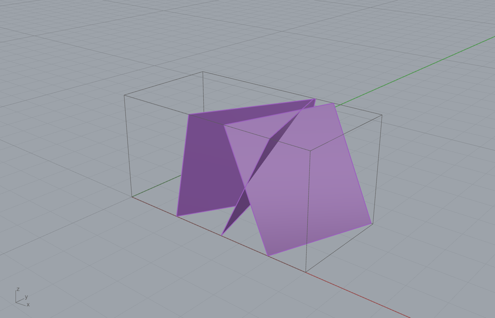
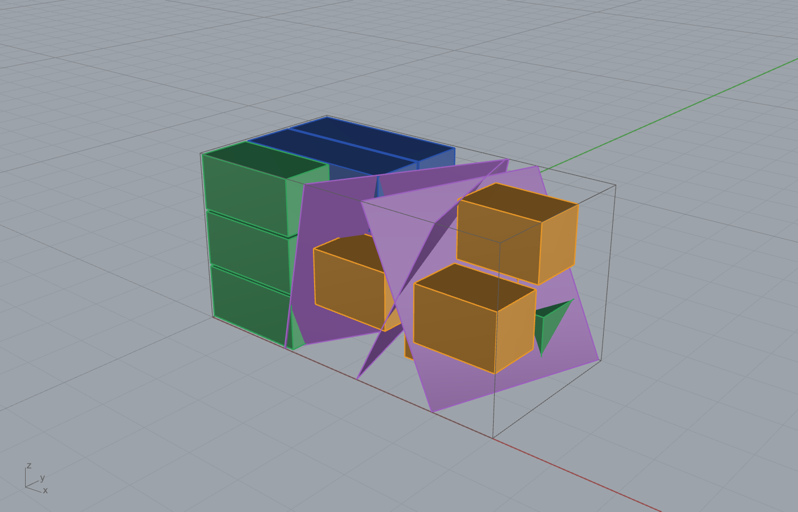
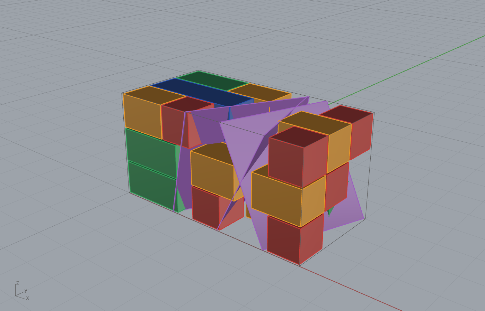
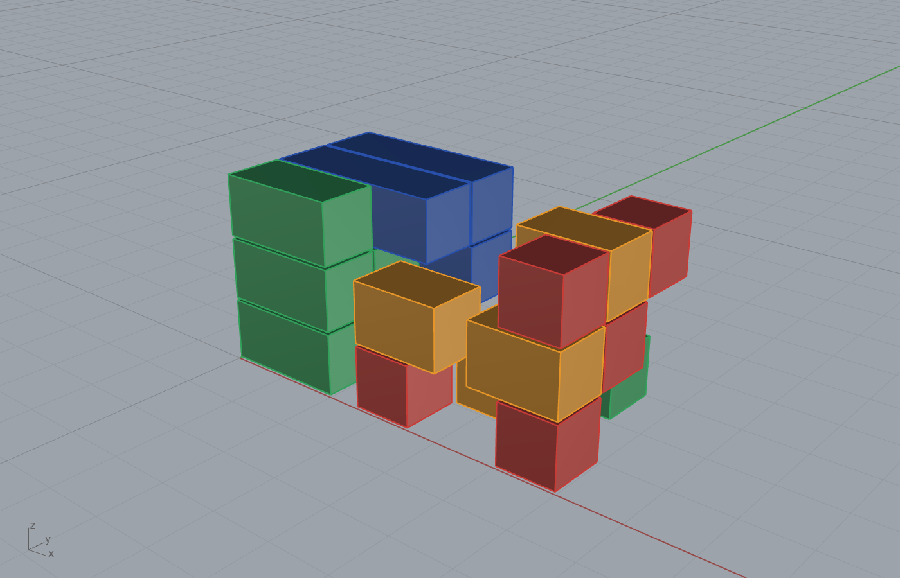
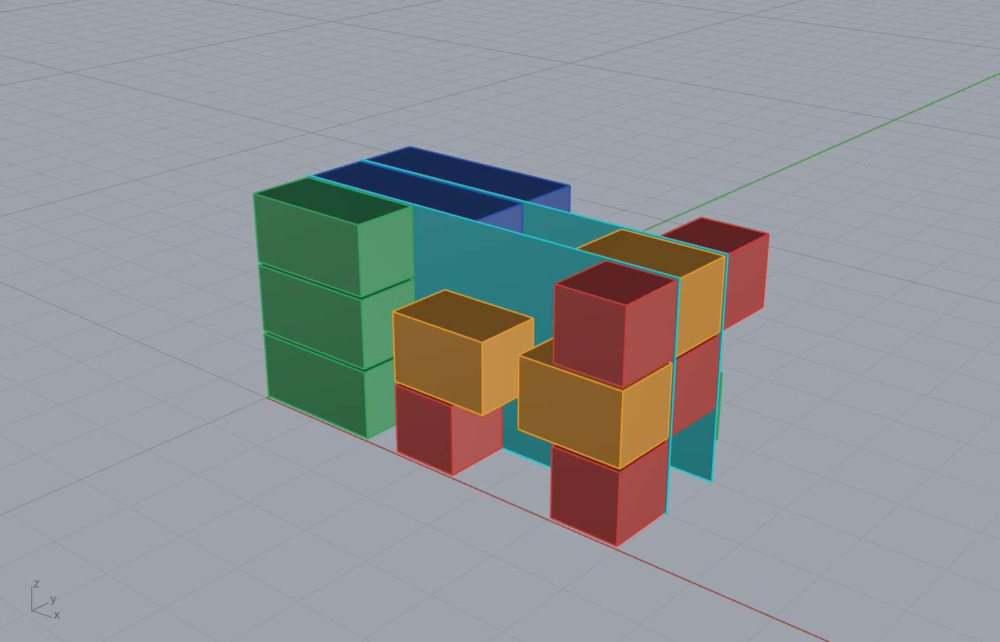
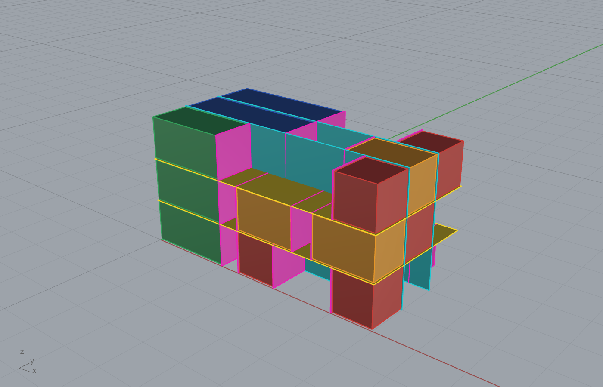

# Example 25 - Marble gangsaw bench: cost-wise vs volume-wise yield (plus guillotine cut sequence)

A fracture-prone marble bench cut into gangsaw blocks under three different objectives, with cost the
governing figure: maximise NET dollar value, a balanced compromise, and maximise extracted volume. The
balanced packing is then resolved into a sequential guillotine cut plan rendered as mesh saw planes.
Units: meters and USD. Style: short sentences, no em dashes.

## The bench
A 6.0 x 3.0 x 3.0 m marble bench (54 m3) crossed by 3 oblique fractures. Each fracture is a tilted
plane; a 0.5 m keep-out at every crossing removes the flawed rock. Intact stone after the fractures is
42.5 m3 (21% lost to the flaws). The bench is gridded at 0.5 m; every gangsaw block is 1 x 1 m in cross
section and runs along the bench length, so the fractures break each 1 x 1 m beam into intact runs of
different lengths. Those awkward run lengths are what make the three objectives diverge.

*The marble bench (wireframe cage) and the three oblique fracture planes (violet).*

## Block catalogue and economics
Price falls and cut cost per m3 rises as blocks get smaller, so the smallest block is loss making.

| Block | Volume | Revenue | Cut cost ($200/m2) | NET | NET per m3 |
|---|---|---|---|---|---|
| 3x1x1 gangsaw | 3.0 m3 | $7500 | $2800 | **+$4700** | $1567 |
| 2x1x1 | 2.0 m3 | $3400 | $2000 | +$1400 | $700 |
| 1.5x1x1 | 1.5 m3 | $1950 | $1600 | +$350 | $233 |
| 1x1x1 | 1.0 m3 | $1000 | $1200 | **-$200** | -$200 |

Colours in the captures: blue = 3x1x1, green = 2x1x1, orange = 1.5x1x1, red = 1x1x1 (the loss block).

## Three objectives (one knob)
The packer maximises `net + W * volume`, where `W` is a volume credit in $/m3. Sweeping `W` walks the
Pareto front from pure profit to pure throughput.

| Objective | W ($/m3) | Blocks | Volume | Recovery of intact | NET value |
|---|---|---|---|---|---|
| **Max cost** (profit) | 0 | 15 | 30.5 m3 | 71.8% | **$25,650** |
| **Balanced** | 800 | 20 | 35.5 m3 | 83.5% | $24,650 |
| **Max volume** (throughput) | 1e6 | 25 | 38.0 m3 | 89.4% | $16,700 |

*Max cost: 15 premium blocks. Every loss-making 1.0 m pocket is left empty, so there are no red blocks.*

*Balanced: the same premium blocks plus 5 red 1x1x1 fillers in the break-even pockets.*

*Max volume: 25 blocks. Premium gangsaw runs are restructured into many small 1.5 and 1.0 m blocks to
fill every cell, so the bench fills with red and orange.*

## The trade-off (cost is the more important figure)
- **Cost to balanced**: +5.0 m3 of stone for only -$1000 net (-3.9%). The marginal cost of that volume
  is $200/m3, because balanced just fills the break-even 1.0 m pockets the profit cut skips.
- **Cost to max volume**: +7.5 m3 for -$8950 net (-34.9%). Marginal cost $1193/m3. Most of this loss is
  not the fillers; it is breaking up premium 3x1x1 gangsaw runs into small blocks to reach the last cells.
- **Balanced to max volume**: the last +2.5 m3 costs $7950 of profit ($3180/m3). Expensive volume.

Recommendation: **balanced** is the operating point. It captures two thirds of the recoverable volume
gain for under 4% of the profit, while max volume burns a third of the profit chasing the final 2.5 m3.

## Guillotine cut sequence (balanced packing)
A gangsaw makes only straight edge-to-edge passes, so the placed blocks are resolved into a guillotine
hierarchy. The cut planes are rendered as mesh saw passes, accumulated stage by stage over the final
placed blocks (bench hidden).

1. The balanced blocks, placed.
   
2. + two full-span cuts perpendicular to Y (cyan) -> 3 slices.
   
3. + two full-span cuts perpendicular to Z (yellow) -> 9 beams of 1 x 1 x 6 m.
   
4. + 25 rip cuts perpendicular to X (magenta), edge-to-edge within each beam, at the block boundaries.
   

29 saw passes total (2 perp-Y, 2 perp-Z, 25 rip perp-X). Every block is reachable by a straight pass,
so the plan is directly fabricable on a gangsaw or bridge saw. This is the same fracture-prone quarry
bench guillotine resolution requested for example 23/24, applied to the marble cost study.

## Components and method
The fracture-aware run extraction and the cut-plan are the original contribution; the packing is the
1 x 1 m beam decomposition (`Fracture Block Pack` family, Frahan > Quarry) plus the `net + W*volume`
sweep for the cost-vs-volume frontier. Cut planes follow the example 24 grid-guillotine logic
(rip -> cross -> cross). For real GPR-derived fractures wire `GPR Fracture Surfaces 3D` ->
`Slab Cut By Fractures` -> these intact zones (see example 09).

## Files
- `25_marble_gangsaw_cost.3dm` - bench, fractures, all three packings, and the balanced cut planes (layered).
- `25_0_bench_fractures.png` - the fractured bench.
- `25a_maxvolume.png`, `25b_maxcost.png`, `25c_balanced.png` - the three objectives.
- `25d_seq0_blocks.png` ... `25g_seq3_allcuts.png` - the guillotine cut sequence on the balanced packing.
- `25_cost_metrics.json` - full economics, the three results, and the trade-off table.
