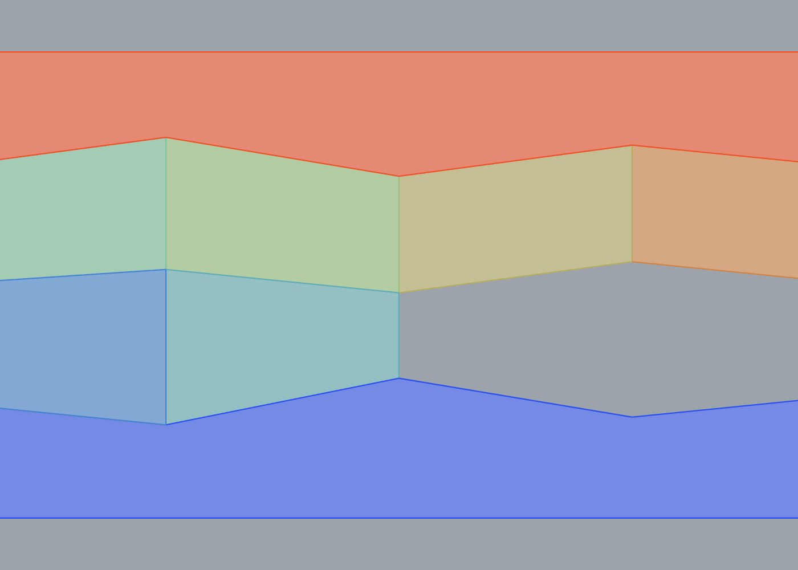

# Card 04 — Wall with holes (paper sec. 5.4)

## Component

`Frahan > Masonry > Polygonal Masonry Sequence (2D)`

## Fixture

**Easiest**: open `04_wall_with_holes.gh`. Geometry is already
internalised and the component is pre-wired. Hit recompute.

**From scratch**: open `04_wall_with_holes.3dm`. Layers:
- **Wall_Boundary** (black): one rectangle, wire to `Wall` input.
- **Chains** (red): 9 polyline(s), wire all to `Chains` input.
- **Hole Probes** layer: (8.0, 2.0), (10.5, 2.0)


bbox = (0.0, 0.0, 12.0, 6.0)

## Expected

- `Region Count` output ≈ **6** finite stones (the
  two infinite top/bottom bands are included in the `Stones` output
  but do not count as finite stones).
- `Install Order` output: integers 1..n, with 1 at the bottom of
  the wall and n at the top.
- `DAG Edges` output: line segments that point from lower-Z to
  higher-Z stone centroids (in 2D, Y plays the role of Z).
- No runtime errors on the component.

## Reference (Python pipeline)




## Pass / fail

```
Date: ____________
Verdict: PASS / FAIL
Notes:
```

## Notes

Same chains as card 03 but with two hole probes. The probes should land inside two of the eight stones; those stones disappear from the install plan and the order shifts.
