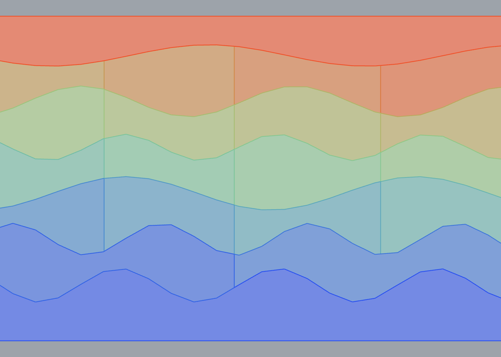

# Card 05 — Wavy chain wall (paper Fig. 13 style)

## Component

`Frahan > Masonry > Polygonal Masonry Sequence (2D)`

## Fixture

**Easiest**: open `05_wavy_perlin.gh`. Geometry is already
internalised and the component is pre-wired. Hit recompute.

**From scratch**: open `05_wavy_perlin.3dm`. Layers:
- **Wall_Boundary** (black): one rectangle, wire to `Wall` input.
- **Chains** (red): 21 polyline(s), wire all to `Chains` input.

bbox = (0.0, 0.0, 16.0, 10.0)

## Expected

- `Region Count` output ≈ **20** finite stones (the
  two infinite top/bottom bands are included in the `Stones` output
  but do not count as finite stones).
- `Install Order` output: integers 1..n, with 1 at the bottom of
  the wall and n at the top.
- `DAG Edges` output: line segments that point from lower-Z to
  higher-Z stone centroids (in 2D, Y plays the role of Z).
- No runtime errors on the component.

## Reference (Python pipeline)




## Pass / fail

```
Date: ____________
Verdict: PASS / FAIL
Notes:
```

## Notes

Six wavy chains crossed by three vertical connector stacks. ~20 stones. Tests the pipeline under denser arrangement than the previous cards.
