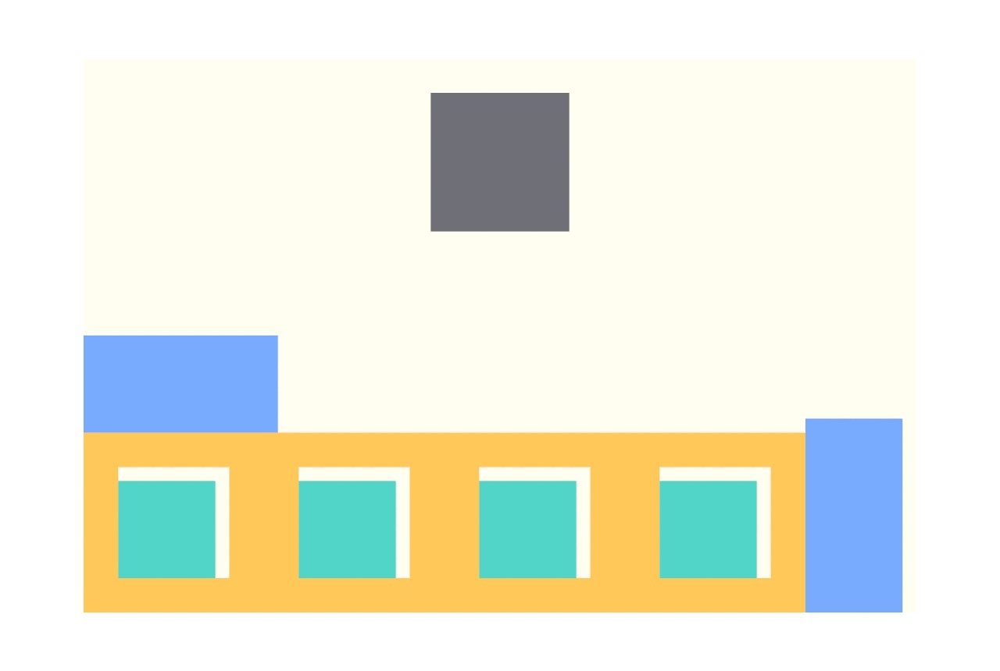

# 28 - Sheet Nest (Hole-Aware) demo

Nest parts onto a sheet where the PARTS THEMSELVES have holes, and smaller
parts seat INTO those holes - material that every conventional nester
throws away.

*The internalized demo: a 120x80 sheet with one 20x20 defect (grey), four
26x26 host parts each carrying a 16x16 hole (amber), and eight 14x14
fillers. Four fillers nest inside the host holes (teal), four go to open
sheet (blue). Report: `Placed: 12/12, PartHolesFilled: 4, Valid: True`,
rect-shelf engine, ~120 ms.*

## What this shows

`Sheet Nest (Hole-Aware)` (**Frahan > 2D Packing**, the
`ContactNfpHoleNester` engine, GUID D5F10019 family):

- **Hole-aware two-phase nesting** - parts with holes are placed first as
  hosts, then smaller parts seat into their holes via the inner-fit
  region; remaining parts fill the open sheet.
- **Exact rect fast-path** - when the sheet, defects, parts and part-holes
  are all axis-aligned rectangles and spacing is 0, an exact interval
  shelf engine runs instead of the general NFP engine (`Note: rect-shelf`).
- **Path-independent validation** - every layout is re-certified by a
  boolean `Validate()` gate (containment, defect clearance, pairwise
  overlap, nested-in-hole depth checks); `Valid` in the report is that
  verdict, never the placer's own claim.

## Try it live

Open [`28_hole_nest_demo.gh`](28_hole_nest_demo.gh) - the fixture is
internalized (no external data). The component solves on load; the
NestReport panel shows the one-line verdict. Wire your own Sheets / Parts
/ Part Holes curves to replace the demo, and raise `Spacing` for kerf.

Part holes route to their part GEOMETRICALLY: a hole belongs to the
smallest part outline that FULLY contains it (centroid + 8 curve samples),
with ties spread across identical stacked parts - so flat lists work even
when several part copies sit at the same coordinates (fixed 2026-07-18;
see `HoleNestShared.cs`).

## Related

- Example 10 (`10_pack2d`) - the general NFP-BLF nester on irregular
  outlines.
- Example 39 (`39_concave_nest`) - concave outline nesting.
- `wiki/research/` hole-packer evolution notes - the CNH benchmark line
  (fastest VALID hole-aware nester in the battery).
