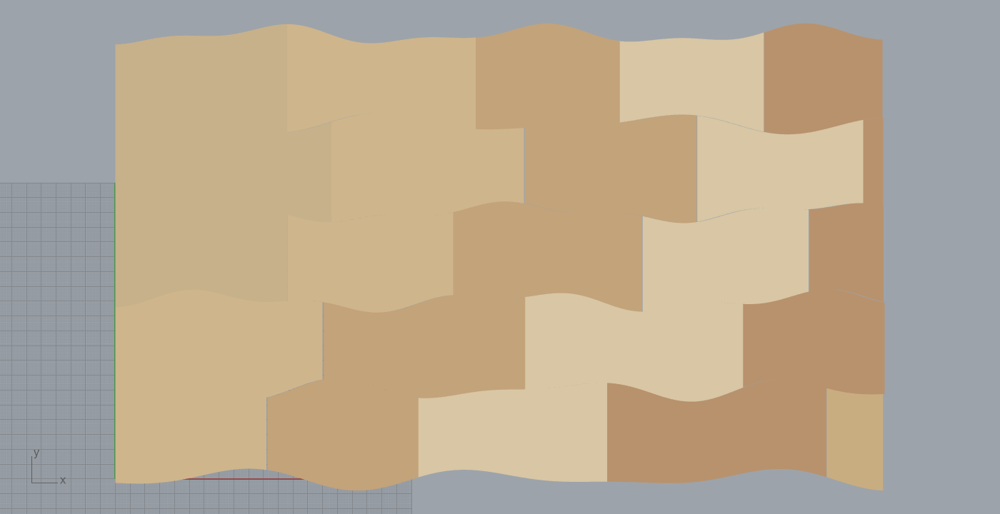

# Example 29 - Live-edge plain-sawn flooring (2D edge matching)

> **Scale, units, position:** MILLIMETRES. A ~520 x 300 mm sample panel on the XY plane at z=0, lower-left
> near the origin. Boards are ~95-155 mm long x ~54-66 mm tall offcuts. Scribe tolerance is scale-relative:
> gap <= W/100, deviation <= W/40, trim depth <= Hc/30 (here Hc = 60 mm course height, so ~2.0 mm). Style:
> short sentences, no em dashes.

Match wood-offcut **curvy live edges** to each other within a tolerance, with an allowance for slight
trimming along the curvature, and lay them up in a **staggered** (brick-bond) live-edge floor. This is the
"2D edge matching" workflow: approximate curve-to-curve scribing, NOT exact jigsaw reassembly.

*Self-presenting output of the `.gh`: 24 irregular offcuts classified, matched, scribed and laid into five
brick-bond courses. Live edges run along the course as continuous wavy horizontal seams (the "rivers"); the
short sawn ends are staggered so no joint lines up across courses. Captured cold from the reopened `.gh`.*

## What it shows
The full live-edge pipeline, on **irregular outlines** (skewed quads, noisy live edges, varied dimensions):

1. **Classify** each offcut outline into live vs sawn edges. The detector finds the two genuinely straight
   runs (the saw cuts) and takes their four endpoints as the corners; the two arcs between them are the live
   edges. Robust to live-edge wiggles and noise: validated 12/12 on irregular boards (see
   `29_classify_irregular.png`, green = live, orange = sawn, blue = corners).
2. **Orient** each board so its sawn ends are vertical and its live edges run along x.
3. **Match + scribe.** Lay up Case A (live edges along the course). Predefine smooth river seams between
   courses, then for each slot select from the offcut pool the board whose live edges best fit (minimum
   trim), and scribe its top and bottom live edges to the two bounding rivers. The river is the matched
   seam; the trimmed-away strip is the scribe-and-fill allowance.
4. **Stagger.** Each course tiles the full width; varying board widths plus a joint-offset penalty stagger
   the short sawn butt joints brick-bond fashion.

Measured on this panel: **scribe/trim mean ~2 mm per edge, max deviation ~13 mm** (worst single point),
inside the close-range tolerance. The faint grey lines in `29_scribe_trim.png` are each board's natural live
edge before trimming; the gap to the river is the material scribed or filled.

## How to open
Open `29_liveedge_floor.gh`. The **Run** toggle is true, so it solves on open and previews the
vertex-coloured floor in any shaded viewport. No plug-in components are required: the whole workflow lives in
one **C# Script** component, so the file is fully self-contained and self-presenting (reopening it cold
reproduces the capture). Flip Run off to clear.

## Files
- `29_liveedge_floor.gh` - the canvas: a Boolean Toggle (Run) -> one C# Script component -> vertex-coloured
  Meshes (M). Self-contained, no `.gha` dependency.
- `29_liveedge_floor.cs` - the C# Script component source (the classify / orient / match / scribe / stagger
  algorithm), for reading and reuse.
- `29_liveedge_floor.3dm` - the baked floor (Brep version with the rivers and butt joints drawn).
- `29_liveedge_floor.png` - the self-presenting `.gh` output, captured from the reopened file.
- `29_classify_irregular.png` - the live/sawn classifier on a grid of irregular offcuts (12/12).
- `29_scribe_trim.png` - the floor with each board's natural pre-trim live edge (grey) shown against the
  scribed river, i.e. the trim allowance plotted.

## Using your own offcuts
The demo synthesises a deterministic pool of irregular offcuts (`MakeBoard`, seed 313131) so the result is
reproducible. To run on real offcuts, replace `MakeBoard` with your closed outline curves (one dense closed
polyline each) and feed them through `Classify` -> `Extract` -> the layup unchanged. The classifier only
assumes each board has two straight sawn ends and two curvy live edges.

## Originality
Clean-room. The live/sawn classifier (straight-run detection), the whole-edge scribe-and-fill matcher, and
the brick-bond stagger sequencer are original 2D logic built for this workflow. It deliberately does NOT use
the exact fragment reassembler (`Frahan.EdgeMatching.AssemblySolver`): that targets exact jigsaw
reassembly with a tight residual gate and a penetration rejection, which is the wrong objective for
approximate live-edge matching with a trim allowance. Material practice references: scribe-and-fill / river
gap-fill and brick-bond staggered layup (standard live-edge and plank-flooring methods). See the full study
at `../../../code_ws/outputs/2026-06-13/liveedge_research/LIVE_EDGE_FLOORING_RESEARCH.md` and the debug
handoff at `../../../code_ws/outputs/2026-06-13/edgematch_debug/HANDOFF_EDGE_MATCHING.md`.
