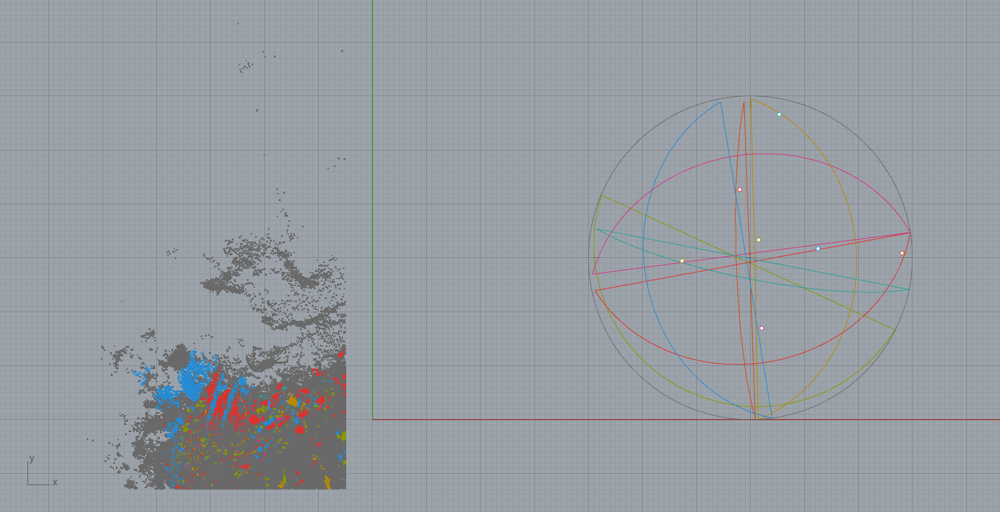
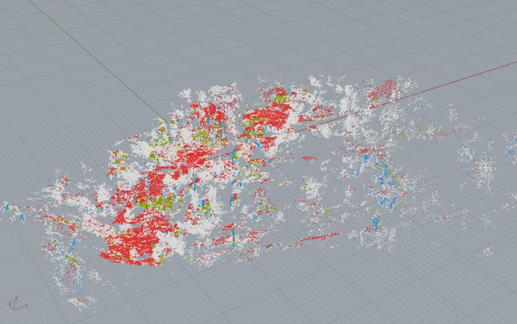
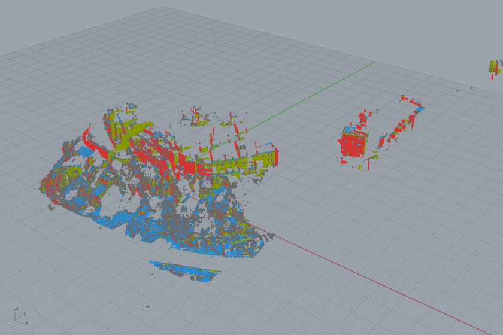
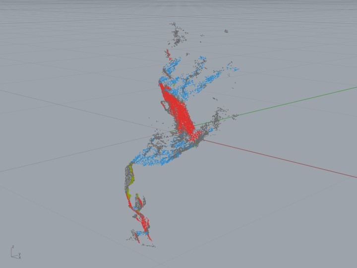
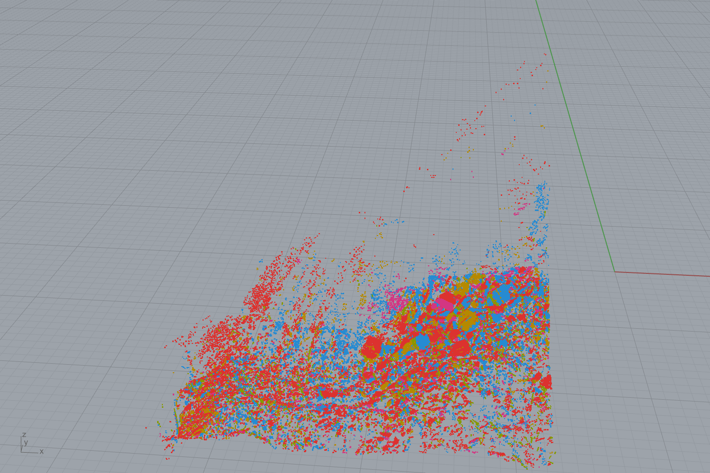
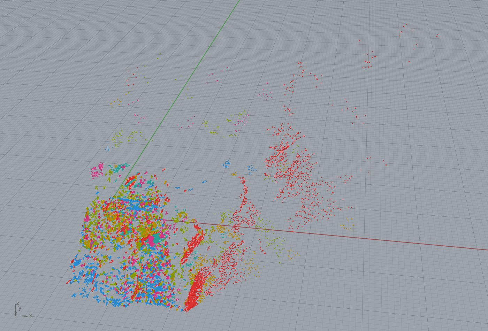
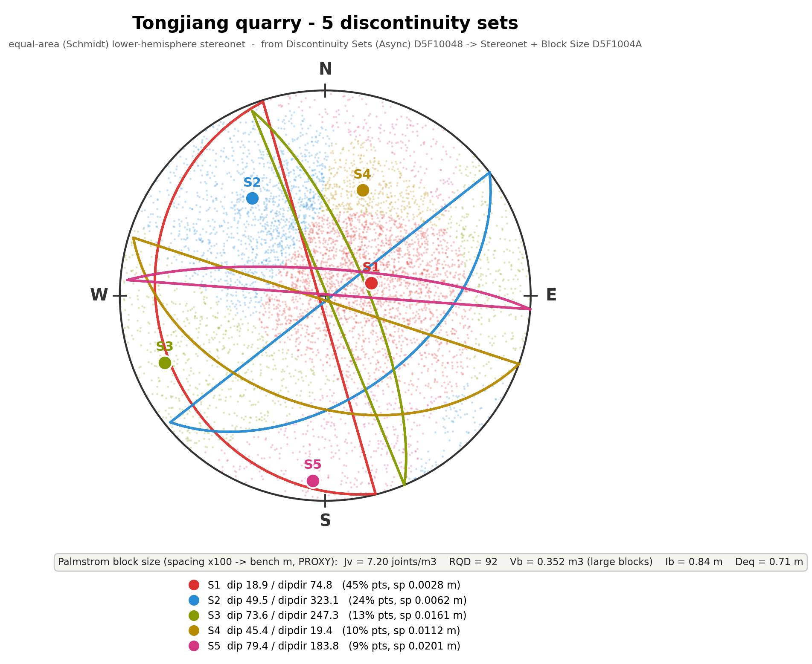

# Example 30 — Discontinuity sets from a scan → stereonet + block size

Discover the joint sets in a scanned rock face, colour the cloud by set, and read
the in-situ block size. Uses the clean-room CSR worker (off-process) behind two
Grasshopper components.

## The workflow (left → right on the canvas)

1. **INGEST** — a `File` path to a point cloud (`.ply`).
2. **Discontinuity Sets (Async)** `D5F10048` — segments the cloud into facets
   (PCA normals + region grow) and clusters facet poles into joint sets (Watson
   axial mean-shift). Runs **off-process** so the canvas never blocks. Press the
   `Run` toggle. Outputs: **Segmented** (cloud coloured by joint set, grey =
   unassigned), **Set poles**, per-set **Dip / Dip dir / Spacing / Share**, and
   (with `Keep facets`) a **Facets path** to `facets.csv`.
3. **Stereonet + Block Size** `D5F1004A` — equal-area (Schmidt) lower-hemisphere
   stereonet of the sets (great circles + poles + facet-pole density) plus the
   Palmström block-size readout (`Jv`, `Vb`, `RQD`, `Deq`). Self-presenting: it
   draws in the viewport, so re-opening the `.gh` reproduces the figure.

## Colour-by-segmentation

The **Segmented** output is the scanned rock coloured by which joint set each point
belongs to. This is the headline view for a quarry geologist: the wall, colour-coded.

### Bundled segmentation results (open in Rhino, no run needed)

The pre-computed colour-by-set clouds are bundled so you can see the segmentation without running
the worker. `File > Import` any of these into Rhino (they carry per-point colours, one colour per
joint set, grey = unassigned).

**Clean in-situ rock faces (the showcases):**

| Granite Dells AZ — granite, 3 sets | Finestrat — gypsum slope, 3 sets | RockCloud-Align — rock-face crop |
|---|---|---|
|  |  |  |
| `30_segmented_granite_dells_decim.ply` | `30_segmented_finestrat_decim.ply` | `30_segmented_rockalign.ply` |

Granite Dells is the textbook in-situ granite case: one sub-horizontal sheeting set (red) plus two
near-vertical sets (blue / olive). Finestrat is a gypsum rock slope (Riquelme / DSE, Zenodo 7576524,
CC-BY 4.0), the cleanest **complete-face** case here, a full exposed slope rather than a crop
(3 sets: red dip 85, olive dip 38, blue dip 87). RockCloud-Align is a real exposed-rock-face scan
crop. These are the valid in-situ exposures, the headline view for a quarry geologist: the wall,
colour-coded by joint set.

**Cautionary sample (the bundled input):** the Tongjiang detail scan
(`30_segmented_tongjiang_decim.ply`) is a loose-rock muck pile, not an in-situ face, so it
exercises the worker end to end but is not a valid dimension-stone deposit. Its per-set segmentation:

| Tongjiang detail_cloudXB — 4 sets | Tongjiang detail_cloudAB — 5 sets |
|---|---|
|  |  |

Stereonet of the full-resolution result (honest ISRM decimeter spacings):

## Run it on real datasets

The bundled `tongjiang_detail_decim.ply` (≈393 k pts, decimated) is a fast,
self-contained **sample** — press `Run` and it segments in under a second.

To run the study on the **real, full-resolution scans**, point the `File` panel at
any of these (in `Data/tongjiang/`, see `Data/tongjiang/_SOURCE.md`; the worker
reads the file off-process and stride-downsamples to the `Max points` budget):

| dataset | points | result (bw 14, ISRM spacing) |
|---|---|---|
| `Data/tongjiang/detail_cloudXB.ply` | 7,858,334 | **4 joint sets**, spacings **0.25 / 0.23 / 0.67 / 1.11 m** (dominant dip 19°, 64 % share) |
| `Data/tongjiang/detail_cloudAB.ply` | 6,857,772 | **5 joint sets**, spacings **0.39 / 0.21 / 0.28 / 0.23 / 0.41 m** |
| `Data/tongjiang/panorama_*cloud.ply` | ~1–3 M | site-scale exposures |
| `Data/misc_ply/granite_shards.ply` | 209,923 | loose granite (different geometry) |
| `Data/granite_dells_tls/…UTM.laz` | TLS | Granite Dells AZ — convert LAZ→PLY first |

Each real scan yields its own site-specific joint sets with **honest decimeter-scale
spacings** (ISRM distinct-joint count, see `docs/validation/.../SPACING_FIX.md`) — the
worker is data-driven, not preset. Set count depends on bandwidth (documented).

## Parameters
- **Bandwidth** (mean-shift, deg) is the main knob: lower → more sets. 15 (default)
  is conservative; 10–12 recovers more, marginal sets (documented sensitivity).
- **Max points** caps the work budget (6 M ≈ 10 s, full 8 M ≈ 15 s).
- **Unit scale** on the card is now **1** — the worker reports honest metres after the
  ISRM spacing fix (the old ×100 was a band-aid over a spacing bug; see
  `docs/validation/.../SPACING_FIX.md`). Honest XB block size: Jv ≈ 10.7, RQD ≈ 83,
  Vb ≈ 0.042 m³, Deq ≈ 0.35 m.

## Validation
Built and run live in Rhino 8; the `.gh` reloads, runs on `Run=true`, and
reproduces the capture (truth criterion (c)). Numbers cross-checked against the
worker CLI (`frahan_discontinuity_worker.exe`).
