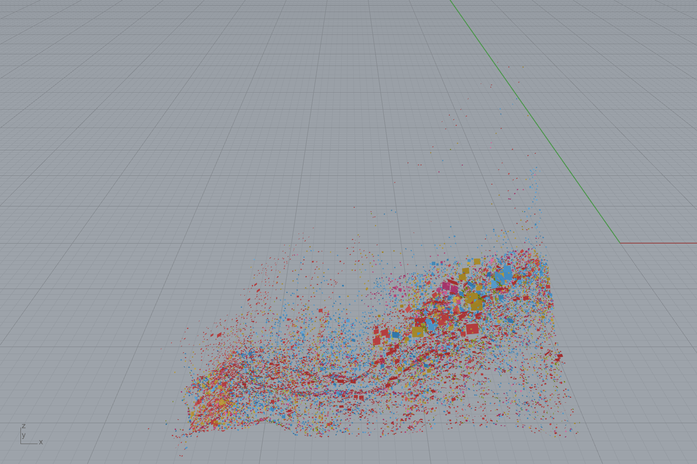

# Example 30 — Discontinuity sets from a scan → stereonet + block size

Discover the joint sets in a scanned rock face, colour the cloud by set, and read
the in-situ block size. Uses the clean-room CSR worker (off-process) behind two
Grasshopper components.

## The workflow (left → right on the canvas)

1. **INGEST** — a `File` path to a point cloud (`.ply`).
2. **Discontinuity Sets (Async)** `D5F10048` — segments the cloud into facets
   (PCA normals + region grow) and clusters facet poles into joint sets (Watson
   axial mean-shift). Runs **off-process** so the canvas never blocks. Press the
   `Run` toggle. Outputs: **Segmented** (cloud coloured by joint set, grey =
   unassigned), **Set poles**, per-set **Dip / Dip dir / Spacing / Share**, and
   (with `Keep facets`) a **Facets path** to `facets.csv`.
3. **Stereonet + Block Size** `D5F1004A` — equal-area (Schmidt) lower-hemisphere
   stereonet of the sets (great circles + poles + facet-pole density) plus the
   Palmström block-size readout (`Jv`, `Vb`, `RQD`, `Deq`). Self-presenting: it
   draws in the viewport, so re-opening the `.gh` reproduces the figure.

## Colour-by-segmentation

The **Segmented** output is the scanned rock coloured by which joint set each point
belongs to. This is the headline view for a quarry geologist: the wall, colour-coded.

| Tongjiang detail_cloudXB — 5 sets | Tongjiang detail_cloudAB — 6 sets |
|---|---|
|  |  |

Facet tiles (each facet a quad oriented by its normal, coloured by set):

Stereonet of the full-resolution 5-set result:

## Run it on real datasets

The bundled `tongjiang_detail_decim.ply` (≈393 k pts, decimated) is a fast,
self-contained **sample** — press `Run` and it segments in under a second.

To run the study on the **real, full-resolution scans**, point the `File` panel at
any of these (in `Data/tongjiang/`, see `Data/tongjiang/_SOURCE.md`; the worker
reads the file off-process and stride-downsamples to the `Max points` budget):

| dataset | points | result (default bandwidth) |
|---|---|---|
| `Data/tongjiang/detail_cloudXB.ply` | 7,858,334 | **5 joint sets** (dip 18.9 / 49.6 / 73.6 / 45.4 / 79.4) |
| `Data/tongjiang/detail_cloudAB.ply` | 6,857,772 | **6 joint sets** (dip 50.8 / 8.2 / 37.6 / 52.5 / 69.2 / 84.8) |
| `Data/tongjiang/panorama_*cloud.ply` | ~1–3 M | site-scale exposures |
| `Data/misc_ply/granite_shards.ply` | 209,923 | loose granite (different geometry) |
| `Data/granite_dells_tls/…UTM.laz` | TLS | Granite Dells AZ — convert LAZ→PLY first |

Each real scan yields its own site-specific joint sets — the worker is data-driven,
not preset.

## Parameters
- **Bandwidth** (mean-shift, deg) is the main knob: lower → more sets. 15 (default)
  is conservative; 10–12 recovers more, marginal sets (documented sensitivity).
- **Max points** caps the work budget (6 M ≈ 10 s, full 8 M ≈ 15 s).
- **Unit scale** on the card converts spacing to metres for the block-size proxy.
  The Tongjiang detail scans are cm-scale; the example uses ×100 to read a bench
  proxy. **Treat the block numbers as a proxy and set the scale for your data.**

## Validation
Built and run live in Rhino 8; the `.gh` reloads, runs on `Run=true`, and
reproduces the capture (truth criterion (c)). Numbers cross-checked against the
worker CLI (`frahan_discontinuity_worker.exe`).
