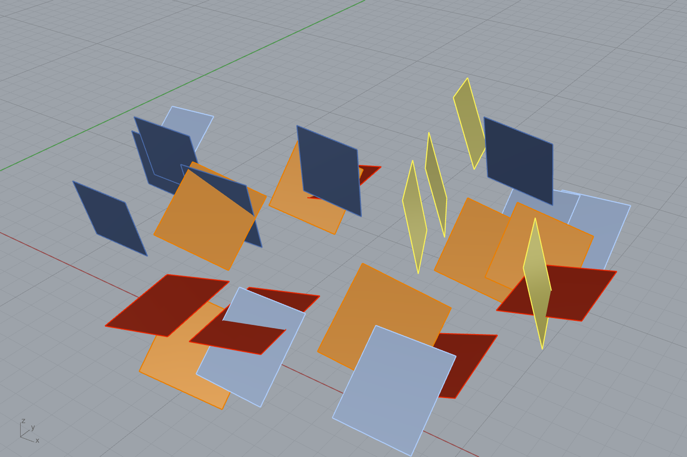

# Example 31 — Ingest mapped discontinuities → planes coloured by joint set

The inverse of Example 30: instead of *discovering* joint sets from a scan, *read*
discontinuities a geologist or photogrammetry/Compass survey already measured, and
turn them into oriented Rhino planes coloured by set.

## The workflow

1. **File** — a path to a discontinuity vector file.
2. **Discontinuity Ingest** `D5F10049` — reads the file into oriented planes +
   trace polylines + per-feature `Dip / Dip dir / Set id`. Bad rows are skipped
   with a warning, never thrown. Supported formats:
   - **CSV** — `dip,dipdir[,set,x,y,z]`, or `nx,ny,nz[,x,y,z]`, or plane coeffs `a,b,c,d`.
   - **GeoJSON** — points with `dip`/`dipdir` properties; LineStrings as traces.
   - **DXF** (ASCII) — `LINE` / `LWPOLYLINE` / `POLYLINE` / `3DFACE`.
   - **Shapefile** (`.shp` + `.prj`) — points/lines, CRS carried through.
3. **Rectangle → Boundary Surfaces → Custom Preview** — each plane is drawn as a
   tile, coloured by **Set id** through a **Gradient** (self-presenting).

## Datasets in this folder

| file | what | rows |
|---|---|---|
| `survey_discontinuities.csv` | synthetic field-compass survey (5 sets, jittered) | 26 measured planes |
| `tongjiang_real_sets.csv` | the **real** joint sets discovered from the Tongjiang scan (Example 30 output, honest ISRM spacings) | 4 sets |

Swap the `File` panel to `tongjiang_real_sets.csv` to ingest the real discovered
orientations, or point it at your own export:

- CloudCompare **Compass** plugin → export measured planes as CSV/DXF.
- A geological mapping shapefile/GeoJSON of joint traces.
- A `dip,dipdir` table from field compass / borehole televiewer.

## Why both directions

Example 30 (discover) and Example 31 (ingest) are the two halves of the
discontinuity bridge: scans where you have a cloud, ingest where someone has
already mapped the structures. Feed either into the **Stereonet + Block Size**
card (`D5F1004A`) for the same downstream analysis.

## Validation
Built and run live in Rhino 8 on both the synthetic survey (26 planes) and the
real Tongjiang sets; the `.gh` reloads and reproduces the coloured-plane capture.
