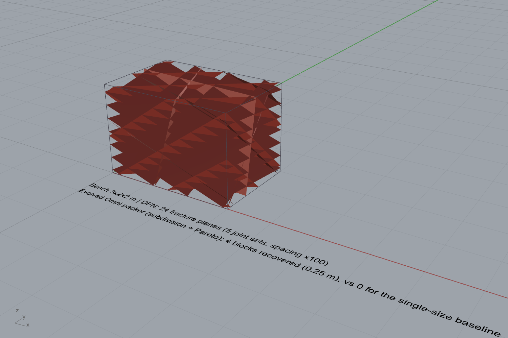

# Example 32 — Scan → joint sets → DFN → block-cut yield (the full quarry loop)

Close the loop: a scanned rock face becomes joint sets, the sets become a discrete
fracture network (DFN), and the DFN drives an **evolved** block-cut packer that
reports how many dimension blocks the jointing permits. This is the front-to-back
GPR/scan → block-yield pipeline on one canvas.



## The chain (and the new bridge)

```
File (scan .ply)
   ↓  Discontinuity Sets (Async)  D5F10048      → dip / dipdir / spacing per set
   ↓  Joint Sets to DFN           D5F1004B  ←── THE BRIDGE (new)
   ↓  BlockCutOpt Omni Solve      F2D0BC04      → recovery per zone (Pareto)
```

`Joint Sets to DFN` (**D5F1004B**, Frahan > Quarry) turns the discovered
`Dip / Dip dir / Spacing` into a fracture-network mesh clipped to a bench Box,
deterministic by seed, with a **Spacing scale** to take a cm-scale detail scan to
bench metres. Its `DFN` mesh + `Tested area` box wire straight into any BlockCutOpt
packer. The same bridge also accepts measured sets from `Discontinuity Ingest`
(D5F10049), so a mapped survey feeds the identical yield analysis.

## Two questions this example answers

**1. Do you need a reconstructed / cleaned mesh (CGAL / Geogram / Poisson / remesh)
for block packing?  → No.** The DFN emitter fan-triangulates the joint planes into a
clean fracture mesh **by construction** (planar polygons clipped to the box, no holes,
no manifold requirement — the solver's BVH just tests block edges against fracture
triangles). The packing uses only the joint-set *statistics*, never the scan mesh
geometry, so a patchy / holey / noisy scan is fine. (Reconstruction is only needed for
the *other* workflow — carving the actual scanned solid into blocks, example 15 — which
does need a watertight 2-manifold for CGAL booleans.)

**2. Why not use the evolved packers from the paper?  → This uses them.** The bridge
feeds the **evolved Omni solver** (sub-division into zones + coarse-to-fine search +
4-axis Pareto: recovery / revenue / BCSdbBV cost), not the 2020 single-pose baseline.
It also feeds `RecoveryCascade` (multi-scale crack-aware, Core) and the wire-saw
`Fracture Block Pack`.

## Benchmark — evolved vs baseline on the real Tongjiang XB DFN

DFN = 24 fracture planes from the 5 real joint sets (spacing ×100), bench 3×2×2 m,
Omni sub-divided 3×2:

| block (m) | baseline (single pose) | Omni (evolved) |
|---|---|---|
| 0.20 | 10 | **13** |
| 0.25 | **0** | **4** |
| 0.30+ | 0 | 0 |

The evolved packer recovers more across the range, and **recovers where the baseline
gets zero** (0.25 m): its sub-division + multi-pose search finds blocks in zones the
single global pose misses.

**Geological read:** recovery collapses above ~0.28 m because the dominant set (S1,
45 % share, 0.28 m spacing) **caps the achievable block size** — densely jointed rock
yields only small blocks. The pipeline surfaces that cap directly from the scan.

## Running on real datasets

The canvas points at the full real `Data/tongjiang/detail_cloudXB.ply` (capped to
1 M points for a fast preview; press `Run`). The second real exposure
`detail_cloudAB.ply` (6 sets) runs the same way. **Tuning note (important):** the
spacing estimate scales with point density and the detail scans are cm-scale, so set
**Spacing scale** and the **Bench** box to your data — the bench must be larger than
the joint spacing for the DFN to constrain the blocks. The numbers above are the
bench-scale proxy (×100); use your real bench dimensions for a real quarry.

## Validation
Built, saved, reloaded and run live in Rhino 8: scan → 5 sets → 24-plane DFN → Omni
recovers 4 blocks (0.25 m) where the baseline recovers 0. Self-presenting; the DFN +
bench capture reproduces on reopen.
