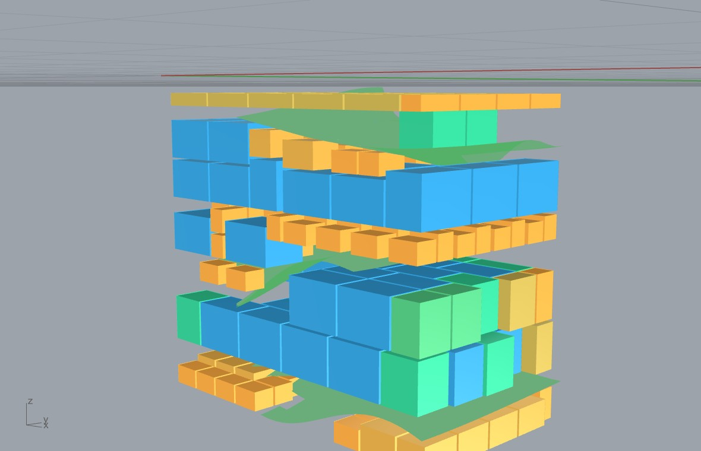

# Example 33 - GPR marble to wire-saw guillotine blocks (the manufacturable hero)

The full quarry decision, end to end and entirely on the Grasshopper canvas: read a GPR survey grid of
Botticino marble, krige the fracture beds, cut the bench into the fracture-bounded slabs, and pack each
slab with the **staged three-stage guillotine** so every block is freed by full-span wire-saw cuts.
This is the manufacturable layout from the companion paper (the staged guillotine, 100% saw-separable),
reproduced as one self-presenting canvas. Units: meters. Style: short sentences, no em dashes.

## What it shows
The diamond wire saw can only make full-span (guillotine) cuts. So a block layout is manufacturable iff
it is guillotine-separable. This workflow:

1. **GPR Survey Grid** ingests the two marble scan lines (one component, a list of `.DT` files + a line
   spacing) into a single 3D fracture-pick cloud.
2. **GPR Fracture Surfaces 3D** kriges the picks into the dipping bed surfaces (ordinary kriging, the
   posterior std is the interpolation uncertainty; surfaces are coloured green within tolerance).
3. **Fracture Bounded Slabs** cuts the bench into the closed inter-bed slabs that FOLLOW the curved
   beds (the beds are single-valued depth surfaces, so it stitches the bed height-fields into slabs; no
   CGAL boolean needed).
4. **Fracture Block Pack** (Packer 5) packs each slab with the staged three-stage guillotine (bed cuts
   -> strips -> cross cuts, best-of-six orientations). Every block is separable by full-span cuts, so
   the guillotine-separable fraction phi = 1.0 (fully wire-saw cuttable). It reports the cutting-surface
   area `A_cut` and the Jalalian I11 saw cost.

The blocks are axis-aligned but packed INSIDE the curved fracture-bounded slabs, so no block crosses a
bed. They are coloured blue / green / orange by marketable size; the green surfaces are the kriged beds.

## Result (this grid, geometric yield)
**216 blocks, ~50% yield per slab, guillotine-separable phi = 100%.** Toggle **Uncertainty Safe** on to
enforce a keep-out equal to the GPR position sigma (the honest, lower yield); off gives the geometric
headline. Matches the paper's staged-guillotine figure (221 blocks / 49.8% on the grid3 bench).

## Files
- `marble_guillotine_hero.gh` - the self-presenting canvas (GPR Survey Grid -> kriging -> Fracture
  Bounded Slabs -> Fracture Block Pack mode 5 -> size-coloured Custom Preview + green beds).
- `marble_guillotine_result.3dm` - the baked 216-block layout + the 3 kriged beds.
- `marble_guillotine_hero.jpg` - the rendered hero.
- `gpr_data/LA010001.DT` + `LA010002.DT` (+ `.HDR_DT`) - the two Botticino marble profiles.

## Run
1. Open Rhino 8 + Grasshopper with the Frahan `.gha` deployed.
2. Open `marble_guillotine_hero.gh`. The two file-path panels point at `gpr_data/*.DT`; set them to this
   folder's `gpr_data` if your paths differ.
3. Solve. Drive the sliders: LineSpacing, NumFractures, GridRes (kriging), SlabGridRes (slab fidelity),
   BlockLx/Ly/Lz, Kerf, Fracture Clearance, Packer (5 = staged guillotine), and the Run / Uncertainty
   Safe toggles. The block stack + green beds update live.

## Faithful to the paper
The pipeline reproduces the companion manuscript (Bulletin of Engineering Geology and the Environment):
ordinary kriging of the beds + the staged three-stage guillotine into the fracture-bounded slabs, phi =
1.0 wire-saw manufacturable. Oblique (dip-following) cuts are named future work there and are NOT used
here. Companion: `../08_gpr_marble/` (the cost/volume frontier study on the same data).

## Data provenance
Bondua, Tinti et al. 2024, "GPR measures from quarries", MDPI Data 9(3):42; Mendeley
10.17632/w26n6nftxs.3, site Italy-Botticino (marble). License **CC-BY-NC-ND 4.0 (research/testing
only, not for commercial product demos)**. Same data as example 08.
