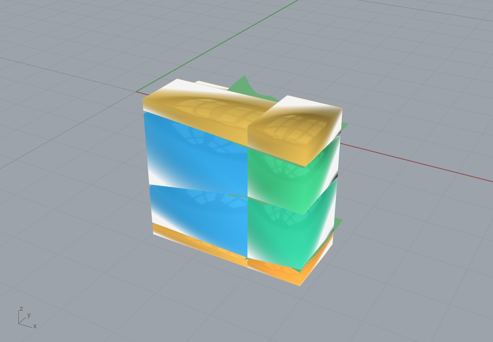

# Example 34 - Oblique (dip-following) quarry cuts on the marble beds

The bed-following frontier: instead of axis-aligned blocks packed inside the fracture-bounded slabs
(example 33, the wire-saw manufacturable hero), here every block is a **bed-bounded HEXAHEDRON whose
top and bottom faces are sheared to ride the dipping kriged beds**. The blocks TILT with the bed dip
and never cross a fracture, recovering the dip wedge a flat cut wastes. This is the paper's named
future-work dip-following cut, realizable by tilting the wire saw. Units: meters. Style: short sentences.

## What it shows
1. **GPR Survey Grid** + **GPR Fracture Surfaces 3D**: the marble scan grid kriged into the dipping bed
   surfaces (same front end as example 33).
2. **Bed Block Layout** (Oblique on): each inter-bed layer is tiled with a marketable block CATALOGUE
   (A 3.0x1.5 / B 2.0x1.5 / C 1.5x1.0 / D 1.0x1.0 m, priced per m3) under a cost-to-volume objective,
   then **each block is sheared into a hexahedron**: its 4 top corners ride the upper bed surface and
   its 4 bottom corners ride the lower bed surface (sampled at the block footprint corners). So the
   blocks follow the real bed dip and are bounded by the beds.
3. The blocks are coloured blue / green / orange by marketable size; the green surfaces are the kriged
   beds the block faces ride on.

## Cost-to-volume (the Volume Weight slider W)
W = 0 -> max COST (fewer big high-value A blocks); W ~ 500 -> balanced; large W -> max VOLUME (fill).
Default W = 0: **12 blocks, 36.3 m3, NET $37k, mix A4/B4/C4.** Reproduces the example-08 oblique
frontier ballpark (13-20 blocks / 32-39 m3). The oblique recovery beats the flat dip-safe layout by
recovering the wedge between a flat cut and the dipping bed (the paper's "georeferencing prize").

## Oblique vs the manufacturable hero (example 33)
- **Example 33** (`../33_gpr_marble_guillotine/`): axis-aligned blocks packed into the fracture-bounded
  slabs by the staged three-stage guillotine; 100% wire-saw separable TODAY. The shippable hero.
- **Example 34** (this): blocks SHEARED to the bed dip; higher recovery, but the tilted bed-parallel
  passes need a tilting wire saw + georeferenced marking to execute. The frontier / future-work path.

## Files
- `marble_oblique_hero.gh` - the self-presenting canvas (GPR Survey Grid -> kriging -> Bed Block Layout
  Oblique -> size-coloured Custom Preview + green beds). Sliders: LineSpacing, NumFractures, GridRes,
  Volume Weight W, Keep-out, and the Oblique toggle.
- `marble_oblique_result.3dm` - the baked 12 sheared hexahedra + the 3 kriged beds.
- `marble_oblique_hero.jpg` - the render.
- `gpr_data/LA010001.DT` + `LA010002.DT` (+ `.HDR_DT`) - the two Botticino marble profiles.

## Run
1. Open Rhino 8 + Grasshopper with the Frahan `.gha` deployed.
2. Open `marble_oblique_hero.gh`; point the two file-path panels at this folder's `gpr_data`.
3. Solve. Drive Volume Weight W (cost <-> volume), Keep-out, and the Oblique toggle (off = flat boxes).

## Data provenance
Bondua, Tinti et al. 2024, "GPR measures from quarries", MDPI Data 9(3):42; Mendeley
10.17632/w26n6nftxs.3, site Italy-Botticino (marble). License **CC-BY-NC-ND 4.0 (research/testing
only)**. Same data as examples 08 and 33.
