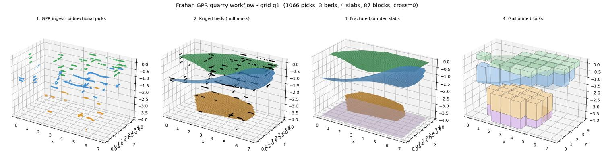

# Example 35 - GPR quarry full workflow (ingest -> beds -> slabs -> blocks)

The complete quarry decision on one Grasshopper canvas: ingest a bidirectional GPR survey grid, krige the
fracture beds, cut the bench into fracture-bounded slabs, and pack each slab with the staged wire-saw
guillotine - from raw `.DT` slices to dimension blocks. Units: meters.

## The pipeline (left to right on the canvas)

1. **Construct GPR Preset** - defines the GPR ingest physics for the stone (velocity, frequency, eps_r,
   energy + continuity gates) and feeds **GPR Survey Grid > Custom Preset**. The library ships only two
   empirically tuned presets (`marble_600`, `granite_160`); this component covers any other stone/antenna.
   Here it is set to **limestone, 600 MHz, v = 0.10 m/ns** (Botticino is petrologically a compact
   limestone sold as marble; the velocity/frequency is what matters, not the trade name - and 0.10 m/ns
   matches the empirical `marble_600` tuned on this exact survey).
2. **GPR Survey Grid** - ingests the list of `.DT` slices (longitudinal LA + transverse TA, auto-detected)
   into one bidirectional 3D pick cloud + per-pick energy.
3. **GPR Fracture Surfaces 3D** - kriges the picks into the dipping bed surfaces. The kriging separates
   beds by their dip plane (k-planes, no layer mixing), regression-kriges each bed (plane + smoothed
   residual), drops outlier picks (2-sigma), and **draws each bed only inside the convex hull of its own
   picks** so a steep deep bed is never extrapolated into the bed above it.
4. **Fracture Bounded Slabs** - stitches the bed height-fields into the closed inter-bed slabs that follow
   the curved beds, inside the Bench box.
5. **Fracture Block Pack** (Packer 5 = staged three-stage guillotine) - packs each slab with full-span
   wire-saw cuts; every block is bounded by the beds and never crosses a fracture.

## Result

Validated live on the canvas (grid g1): **1066 picks -> 3 beds -> 4 slabs -> 511 blocks, 0 errors, ~3.3 s.**
Drive the sliders: NumFractures, GridRes, Packer (5 = staged guillotine), and the Through Picks / Peak
Dedup toggles. Edit the Construct GPR Preset for a different stone, or the `GPR .DT files` parameter for a
different survey.

## Validated headless on 3 grids

The same pipeline was run headless (no Rhino) on three Bondua survey grids. `workflow_g2.jpg`,
`workflow_g3.jpg` show the 4-stage result; all three pass the geometric checks:

| grid | footprint | picks | beds | slabs | blocks | blocks crossing a bed | bed order |
|------|-----------|-------|------|-------|--------|-----------------------|-----------|
| g1   | 6.9 x 3.8 m | 1066 | 3 | 4 | 87* | 0 | ok |
| g2   | 3.6 x 4.6 m | 976  | 3 | 4 | 58* | 0 | ok |
| g3   | 5.2 x 3.3 m | 990  | 3 | 4 | 60* | 0 | ok |

*Headless block counts use a coarse 0.9 m guillotine grid for the preview; the canvas Fracture Block Pack
(finer kerf/clearance) yields more (511 on g1). The invariant that matters - **0 blocks cross a fracture** -
holds in both.

## Files

- `quarry_full_workflow.gh` - the self-presenting canvas (Construct GPR Preset -> GPR Survey Grid ->
  GPR Fracture Surfaces 3D -> Fracture Bounded Slabs -> Fracture Block Pack + Custom Preview).
- `quarry_full_workflow_hero.jpg`, `workflow_g2.jpg`, `workflow_g3.jpg` - the 4-stage renders (g1/g2/g3).
- `headless_pipeline.py` - reproduces the whole workflow headless (numpy + matplotlib, no Rhino) from a
  pick CSV; the offline twin used to verify the kriging + slab/block discipline at the 300 s MCP cap.
- `gpr_data/` - the 8 g1 `.DT` slices (4 LA + 4 TA).

## Run

1. Open Rhino 8 + Grasshopper with the Frahan `.gha` deployed.
2. Open `quarry_full_workflow.gh`; point `GPR .DT files` at this folder's `gpr_data` (or any LA + TA mix).
3. Solve. The Bench box covers a 7 x 4 x 4.4 m volume; adjust it for a larger survey.

## Data provenance

Bondua, Tinti et al. 2024, "GPR measures from quarries", MDPI Data 9(3):42; Mendeley
10.17632/w26n6nftxs.3, site Italy-Botticino (compact limestone sold as marble), grids g1/g2/g3
(longitudinal `LA` + transverse `TA` lines). License **CC-BY-NC-ND 4.0 (research/testing only, not for
commercial product demos)**.
