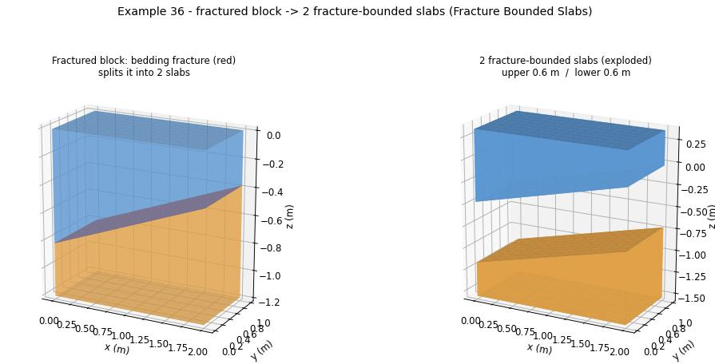

# Example 36 - Fractured block -> two fracture-bounded slabs

The slabbing primitive: a single stone block with one bedding fracture, cut into the two slabs the
fracture bounds. This is the minimal case of `Fracture Bounded Slabs` (the same component that cuts a
GPR-kriged bench in example 35) - a block instead of a quarry bench, one fracture instead of three beds.
Units: meters.

## What it shows

1. A **block** (the Bench input): a 2.0 x 1.0 x 1.2 m box.
2. A **bedding fracture** (the Bed Surfaces input): a single mesh surface dipping ~12 deg through the
   block at mid-height. Edit it for a steeper bed or a curved/undulating fracture - any single-valued
   height-field surface works.
3. **Fracture Bounded Slabs** stitches the block top, the fracture, and the block bottom into two closed,
   watertight slabs that FOLLOW the fracture (a height-field stitch - no CGAL boolean). Validated on the
   canvas: **2 slabs, 0.6 m mean thickness each, 0 errors.**

The two slabs are coloured by the Custom Preview on the canvas; the fracture is shown in red. The right
panel of the hero explodes the two recovered slabs apart.

## Why it matters

This is the unit operation behind the quarry workflow: every fracture-bounded slab in example 35
(GPR -> beds -> slabs -> blocks) is one of these. Here it is isolated so the slab cut is legible on its
own, and so it can feed the cladding/facade flow (a slab is the stock a panel-nesting + surface-tiling
step cuts cladding panels from - see example 37).

## Files

- `fractured_block_to_slabs.gh` - the self-presenting canvas (Block box + Fracture mesh -> Fracture
  Bounded Slabs -> Custom Preview of the two slabs + the fracture). Slider: Slab Grid Res.
- `fractured_block_to_slabs_hero.jpg` - the render (assembled + exploded).

## Run

1. Open Rhino 8 + Grasshopper with the Frahan `.gha` deployed.
2. Open `fractured_block_to_slabs.gh`. The Block (a Box param) and the Fracture (a Mesh param) carry
   default geometry; edit either to re-cut. Drive Slab Grid Res for slab fidelity.
3. Solve. Two coloured slabs appear, split along the fracture.

## Related

- `../35_gpr_quarry_full_workflow/` - the full pipeline this slab cut sits inside (GPR -> beds -> slabs
  -> blocks).
- `../37_block_to_cladding_facade/` - the slab as stock for cladding-panel nesting + facade tiling.
