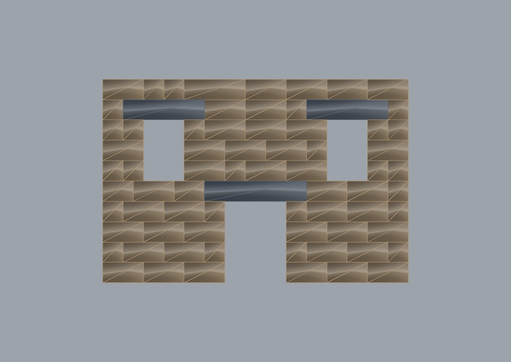

# 37 — Architectural elevation (door + windows, structural stone)

A building face rather than a test panel: a **central doorway running to the
ground** and two first-floor windows, in self-supporting single-skin structural
stone. Every opening is spanned by a lintel bearing onto the jambs either side,
and the whole thing is driven parametrically by the
**`Structural Wall (Generator)`** component.



| | |
| --- | --- |
| wall | 9.0 × 6.0 m, 0.6 m deep single skin, 10 courses × 0.6 m |
| door | 1.8 × 2.4 m, central, **to ground** |
| windows | 2 × (1.2 × 1.8 m) at first floor, symmetric about 4.5 (± 2.7) |
| blocks | **72**, of which 3 are lintels; largest unit 3.00 m |
| stone | 27.22 m³ ≈ **72.1 t** (granite, 2650 kg/m³) |

## Files

- `37_architectural_elevation.3dm` — the 72 baked blocks, coloured by build
  order (dark = laid first), lintels on their own layer. Open this first.
- `37_architectural_elevation.gh` — the definition. Sliders → `Structural Wall
  (Generator)` → its exact-joint `Assembly` → Masonry Stability Check (CRA) and
  Block Build Order. Openings are three `Rectangle 2Pt` on the world XZ plane,
  so each jamb, sill and head is a slider you can drag.
- `37_architectural_elevation_3d.jpg` — a three-quarter view showing the 0.6 m
  depth of the single skin.

## What it reports

```text
structural stone wall (self-supporting single skin) | 9 x 6 x 0.6 m
courses 10 @ 0.6 | blocks 72 | lintels 3 | running joints 13
                 | joints under a jamb / over a bearing 0
stone 27.22 m3 (72.1 t at 2650 kg/m3) | largest unit 3.00 m
openings 3 (doors 1) | nominal 1.2 | min 0.6 | max 2.4 | lintel bearing 0.6
assembly: 72 blocks, 151 interfaces, 6 fixed (lowest course)
```

```text
Stable : True
Report : STABLE | CRA-CERTIFIED (residual 0.30e, 1 iter)
         | exact joints (generator adjacency)
         | blocks free 66, interfaces 151, contact vertices 727
         | max compression 24,098 N | weakest: s067 <-> s068
```

Build order sequences all 72 blocks in 10 layers.

## The door is the interesting case

A window sits on a **sill course** that carries its jambs. A door does not — it
runs to the ground, so there is no masonry beneath it at all and its jambs bear
directly on the foundation.

The generator detects this (`Z0 <= 0` ⇒ door) and **skips the below-sill jamb
protection explicitly**, rather than trying to protect a course that does not
exist. The lintel over the door is generated exactly as for a window, and the
door reveals are excluded from the bond-fault count exactly as window reveals
are.

## The layout was chosen by the tool, not by taste

The first attempt at this elevation put the door at 3.6–4.8 m and the windows at
1.2–3.0 and 6.0–7.8. The generator rejected it, and said why: with a 0.6 m
bearing the door's lintel ends at **x = 3.0**, which is exactly the right jamb of
the window above — so that jamb would bear on a joint rather than on stone.

That joint is **forced**: it is fixed by where the openings sit, and no choice of
stone lengths can move it. The generator names it as such (the bond-controlled
joints it clears silently; the ones it cannot, it reports). Moving the windows
0.6 m clears it, which is how the layout above was arrived at.

That is the behaviour worth showing a designer: the structural consequence of an
opening position, stated before anything is cut.

## Reading the numbers honestly

- **13 running joints.** A running joint is the same head joint repeating in two
  vertically adjacent courses. Around three openings, many joint positions are
  forced by the reveals, and where the generator must choose it protects the
  *bearing* and accepts the running joint — a jamb on a joint loses support
  outright, a running joint only weakens interlock. **0** joints sit under a jamb
  or over a lintel bearing, which is the fault that matters.
- **"Worst friction utilisation 0.92" is not a safety margin.** The safe theorem
  asserts that *some* admissible force state exists; the solver returns one such
  state, not the least-shear one. It reads about the same on a solid wall.
- **No collapse-tilt figure for this wall.** The bisection is 15 full QP solves
  and is expensive at 72 blocks. Example 36's smaller 7.2 × 5.4 facade has it
  (6.40°, matching the hand rule `tan θ = t/h` to 1 %).
- **A flat lintel cannot fail in this model.** Rigid-block limit analysis has no
  tensile strength, so the real failure mode of a 3.0 m granite lintel — tensile
  rupture at the soffit — is outside what is being checked. The verdict is honest
  about equilibrium and silent about the material. See example 27 for the same
  brief solved with voussoir arches, which carry the head load in pure
  compression and *are* fully covered by this analysis.

## The verified part

- **Stability** is `thm:cra` (`admissibleSet_convex` + `cra_farkas`), machine
  checked in Lean: the wall stands iff an admissible compression-only,
  friction-bounded force state exists, and infeasibility is itself the
  certificate of collapse.
- **Build order** is `thm:kahn` (`dag_has_source` + `kahn_linear_extension`).
- The generator's own layout invariants are pinned by 46 property facts in
  `verification/Frahan.Verification.Tests/StructuralWallTests.cs`, including this
  elevation's exact geometry.

## Reproduce

Open the `.3dm`, then the `.gh`. Drag any slider and the chain re-solves. For the
headless version plus the baseline suite:

```sh
dotnet run --project demos/StructuralStoneFacade -c Release   # case A1
```

Related: **36** is the same construction as a 7.2 × 5.4 validation panel;
**27_10** solves an arched portal in polygonal masonry;
`demos/PolygonalArchElevation` solves *this* brief polygonally, with voussoir
arches instead of lintels.
