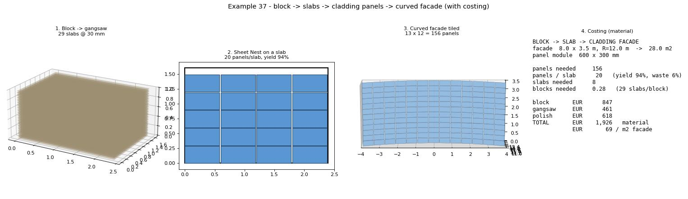

# Example 37 - Block -> slabs -> cladding panels -> curved facade (with costing)

The commercial value chain stone fabricators and facade designers ask for, end to end: take a raw stone
**block**, gangsaw it into **slabs**, nest **cladding panels** out of each slab, and tile them onto a
**curved facade** - with a material cost roll-up. Answers the question directly: *yes, a slab sliced from
a block feeds a panel-tiling system* - the slab is the stock sheet, the cladding panels are the nested
parts. Units: meters / EUR.

## The chain (and the components)

1. **Block** (a `Box`): 2.4 x 1.6 x 1.0 m sawn marble block (priced EUR/m3).
2. **Gangsaw -> slabs** (`Fracture Bounded Slabs` with parallel saw planes): 30 mm slabs + 4 mm kerf ->
   ~29 slabs per block, each a 2.4 x 1.6 m face.
3. **Nest cladding panels on a slab** (`Sheet Nest (Hole-Aware)`): the slab outline is the *sheet*, the
   600 x 300 mm cladding panels are the *parts*. The nester reports how many panels fit and the packing
   density: **20 panels / slab at 94% yield (6% offcut)**. This is the slab -> panel-tiling step on canvas.
4. **Tile the facade**: a single-curved wall (8.0 x 3.5 m, R = 12 m -> 28 m2) tiled with the 600 x 300 mm
   module -> **13 x 12 = 156 panels**. (Rectangular panels on a curved surface = a UV grid on the facade
   surface; the irregular-mosaic path is `Trencadis` from example 13.)

## Costing (this configuration)

| | |
|---|---|
| facade area | 28.0 m2 (8.0 x 3.5, R=12) |
| panels needed | 156 (13 x 12, 600 x 300 mm) |
| panels / slab | 20 (yield 94%, waste 6%) |
| slabs needed | 8 |
| blocks needed | **0.28** (29 slabs/block) |
| block | EUR 847 |
| gangsaw | EUR 461 |
| polish | EUR 618 |
| **TOTAL (material)** | **EUR 1,926  =  EUR 69 / m2 facade** |

Numbers are illustrative but internally consistent; drive the block size, slab thickness, panel module,
facade size/curvature, and the EUR rates to re-cost any job. (Material only - install/labour is separate.)

## Files

- `cladding_facade_hero.jpg` - the 4-stage value chain (block/gangsaw -> nested slab -> tiled facade ->
  cost), rendered headless.
- `headless_pipeline.py` - reproduces the whole chain + cost offline (numpy + matplotlib, no Rhino);
  edit the inputs at the top to re-cost.
- `block_to_cladding_panels.gh` - the on-canvas slab -> panel nesting step (Sheet Nest (Hole-Aware) nesting
  the 600 x 300 cladding panels onto a slab outline; Custom Preview of the placed panels + the density).

## Run (the canvas step)

1. Open Rhino 8 + Grasshopper with the Frahan `.gha` deployed.
2. Open `block_to_cladding_panels.gh`. A slab rectangle (2.4 x 1.6 m) is the sheet; 600 x 300 panels are
   the parts. Solve - the nester places the panels and reports the count + density.
3. For the full chain (gangsaw + facade + cost), run `headless_pipeline.py` or read the hero above.

## Related

- `../36_fractured_block_to_slabs/` - the block -> slab cut this starts from.
- `../35_gpr_quarry_full_workflow/` - where the blocks come from (GPR -> beds -> slabs -> blocks).
- `../13_surface_mapping/` - the Trencadis surface-cladding (irregular-mosaic) path.
