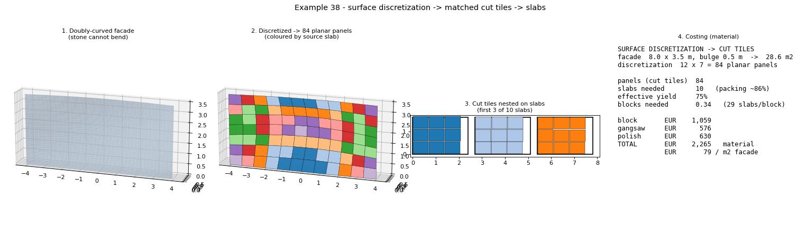

# Example 38 - Surface discretization -> matched cut tiles -> slabs (Panel Tile Surface)

The faithful curved-cladding workflow, and the home of the new **Panel Tile Surface** component. Stone
cannot bend, so a curved facade is **faceted**: the surface is discretized into PLANAR panels, each panel
is flattened to its cut outline, and those flat cut tiles are nested back onto slabs (Sheet Nest). Where
example 37 laid a uniform grid on a gently single-curved wall, this one handles a **doubly-curved** surface
where the panels genuinely vary and the facet planarity must be checked. Units: meters / EUR.

## The new component: Panel Tile Surface

**Frahan > Surface Packing > Panel Tile Surface** discretizes a surface into planar stone-cladding panels:

- **Inputs:** Surface, U Count, V Count, Joint (grout inset), Planarize.
- It divides the surface U x V, fits a best-fit plane to each quad, and projects the corners onto it
  (planarize) so every panel is a flat, cuttable tile.
- **Outputs:** `Panels` (the 3D panels on the surface), `Cut Tiles` (each panel mapped flat to World XY,
  ready to nest), `Planarity` (max corner deviation from the panel plane, per panel), `Area`, `Report`.

**Planarity is the point.** On a doubly-curved surface a flat panel cannot follow the curvature, so each
facet deviates from the surface by some amount. The component reports that deviation - raise U / V where it
exceeds what the stone thickness / joint can absorb. Validated live on the default facade: **84 panels
(12 x 7), 40.8 m2, worst planarity 37 mm**, 0 errors; the 84 cut tiles feed Sheet Nest (Hole-Aware).

## The chain (on the canvas)

1. **Facade** (a Surface param) - any single surface; the default is a gentle doubly-curved patch. Drop
   your own internalized surface here.
2. **Panel Tile Surface** -> the planar panels + their flat cut tiles + per-panel planarity.
3. **Sheet Nest (Hole-Aware)** nests the cut tiles onto slab sheets (the stock).
4. Cost roll-up (see the hero / `headless_pipeline.py`): ~84 panels -> ~10 slabs -> 0.34 block, ~75%
   effective yield, ~EUR 79 / m2 facade (material). Drive U/V, the panel/slab sizes, and the rates to
   re-cost.

## Files

- `panel_tile_surface.gh` - the self-presenting canvas (Facade -> Panel Tile Surface -> Sheet Nest +
  Custom Preview of the panels). Sliders: U Count, V Count.
- `discretize_tiles_hero.jpg` - the 4-stage render (facade -> discretized panels -> nested cut tiles ->
  cost).
- `headless_pipeline.py` - the offline twin (numpy + matplotlib) of the discretize -> tile -> nest -> cost
  chain; edit the inputs at the top.

## Run

1. Open Rhino 8 + Grasshopper with the Frahan `.gha` deployed.
2. Open `panel_tile_surface.gh`. Replace the `Facade` surface with yours (internalize any single surface).
   Drive U Count / V Count and watch the Planarity output - raise them until the worst facet is within
   tolerance for your stone.
3. The cut tiles flow into Sheet Nest, which packs them onto slabs.

## Related

- `../37_block_to_cladding_facade/` - the simpler uniform-grid cladding chain (single-curved wall).
- `../36_fractured_block_to_slabs/` - the slabs the cut tiles are nested onto.
- `../13_surface_mapping/` - the Trencadis (irregular-mosaic) surface-cladding path.
