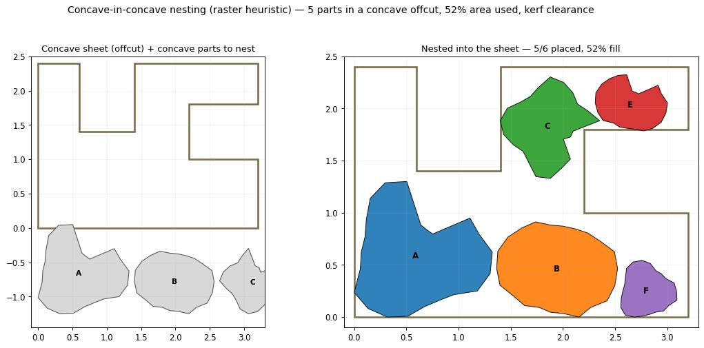

# Example 39 - Concave-in-concave nesting (the honest high-yield trim)

Nest irregular **concave** stone parts into an irregular **concave** sheet / offcut. This is the honest,
high-yield counterpart to convex trimming: instead of throwing away the concave material to get a clean
convex blank, you keep the irregular shapes and fit them - parts and stock both concave. The canvas does
it with the existing **Sheet Nest (Hole-Aware)** (exact NFP, multi-start); the headless twin uses a raster
/ pixel heuristic (which handles arbitrary concavity of both sheet and parts - the "stone -> voxels ->
heuristic" path, cf. ReWeave at MRAC IAAC). Units: meters.

## What it shows

1. A **concave offcut sheet** (a slab remnant with a deep bay + a step) - the stock.
2. Six **irregular concave parts** (some with notches) to recover from it.
3. **Sheet Nest (Hole-Aware)** nests them into the sheet, honoring the concave boundary and a kerf
   clearance. Validated live on the canvas: **6/6 placed, density 0.523, Valid, ~2.3 s** (general NFP,
   multi-start K=4). The bays stay empty where no part fits - truthful, not forced.

## Why it matters (vs convex trim)

The companion Slab Trim research (`research/slab_trim_greedy_convex_hull.md`) has **two trim target modes**:

- **convex blank** - greedy convex-hull trim, fewest cuts, but LOSSY (discards concave material): ~5 cuts,
  ~90% yield.
- **concave kerf-follow** - Imai-Iri min-# straight kerfs that follow the concave boundary: ~11 cuts,
  ~97% yield (keeps the shape).

This example is the third, highest-yield path: don't trim to a single blank at all - **nest the irregular
parts into the irregular stock** and recover everything that fits. That is the hole-aware NFP problem
Frahan already solves on the canvas.

## Files

- `concave_nest.gh` - the canvas (Sheet [concave offcut] + Parts [concave] -> Sheet Nest (Hole-Aware) ->
  Custom Preview of the placed parts).
- `concave_nest_hero.jpg` - the headless render (concave sheet + 6 parts -> nested, 52% fill, kerf gap).
- `headless_pipeline.py` - the offline raster-heuristic twin (numpy + matplotlib).

## Run

1. Open Rhino 8 + Grasshopper with the Frahan `.gha` deployed.
2. Open `concave_nest.gh`. The Sheet and Parts params hold default concave geometry; replace with your own
   offcut outline + part outlines. Sheet Nest runs asynchronously (the result pops in when ready).

## Related

- `../37_block_to_cladding_facade/` and `../38_surface_discretize_tiles/` - the cut-tile -> Sheet Nest
  cladding chain.
- `research/slab_trim_greedy_convex_hull.md` - the convex-vs-kerf-follow trim research this completes.
