# Example 40 — Cross-lithology cut-yield (marble · travertine · andesite)

Ground-penetrating radar → fracture-bounded slabs → **stationary diamond-wire-saw** block plan, run across
**three lithologies** — Botticino **marble** (Italy) and the Carpinis **travertine** + Pietroasa **andesite**
(Romania, both read from native Geoscanners `.gsf`) — head to head. This closes the cross-lithology gap: the
method is not marble-specific, and the recovered yield tracks the rock fabric (dense-bedded marble lowest,
homogeneous andesite highest). `andesite_pipeline.gh` and `travertine_pipeline.gh` are the wired chains;
`travertine_pack.gh` is the slabs-only short form.

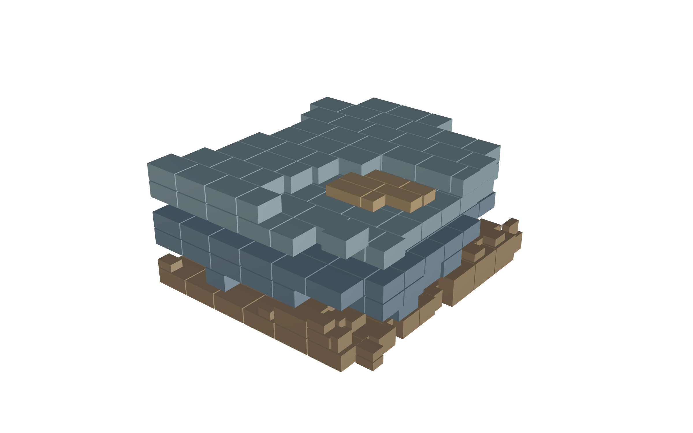

*Live solve of `travertine_pack.gh`: 353 wire-saw-separable blocks (51.7% yield, φ=1) packed into the four
fracture-bounded travertine slabs, coloured by bin (paper-ready render).*

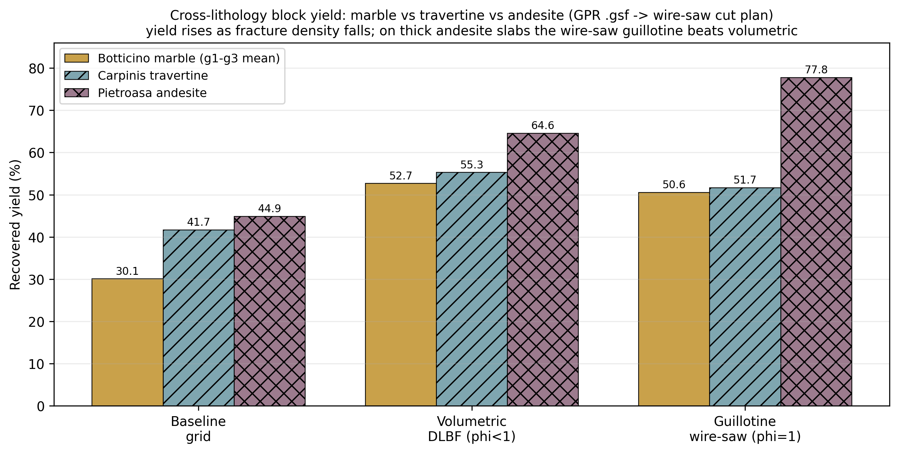

## What it shows

`travertine_pack.gh` (open in Rhino 8 + Grasshopper with the Frahan `.gha` deployed):

- **Travertine Slabs** — a Mesh parameter with the 4 fracture-bounded travertine slabs **internalized**
  (131 m³ intact), reconstructed from the GPR survey. No external input needed.
- **Fracture Block Pack** — set to **Packer = 5 (guillotine / wire-saw)**. Change it to 0 (baseline grid) or
  4 (volumetric DLBF) to reproduce the three rows of the comparison. Block size 0.9 × 0.7 × 0.4 m, kerf 0.03 m.
- **Report** panel — per-bin and total yield + the cutting-surface (saw-cost) metrics.

## The cross-lithology result (live Frahan packers, 2026-06-20)

Three lithologies, all read from native `.gsf` and run through the same packers:

| packer | Botticino marble (g1–g3 mean) | Carpinis travertine | Pietroasa andesite | φ |
|---|---|---|---|---|
| baseline grid | 30.1 % | 41.7 % | **44.9 %** | 1.0 |
| volumetric DLBF | 52.7 % | 55.3 % | **64.6 %** | <1 |
| guillotine (wire-saw) | 50.6 % | 51.7 % | **77.8 %** | 1.0 |

**Yield rises as fracture density falls** — dense-bedded marble (stylolites, close bedding) < travertine
(*gravitational cracks > 2 m apart*) < homogeneous volcanic andesite (widely-spaced joints → thick intact
slabs). The **guillotine plan stays at full wire-saw separability (φ = 1)** throughout, and on the thick
andesite slabs it even **beats the volumetric packer** (77.8 vs 64.6 %) — the staged guillotine tiles a thick
box-like slab better than the voxel greedy. The target machine is a **fixed diamond-wire block-squaring saw,
not a robot**. (Andesite ε is the rig acquisition default 13.03, not a measured value, so its absolute depths
are nominal; the yields are geometry-driven and robust.)

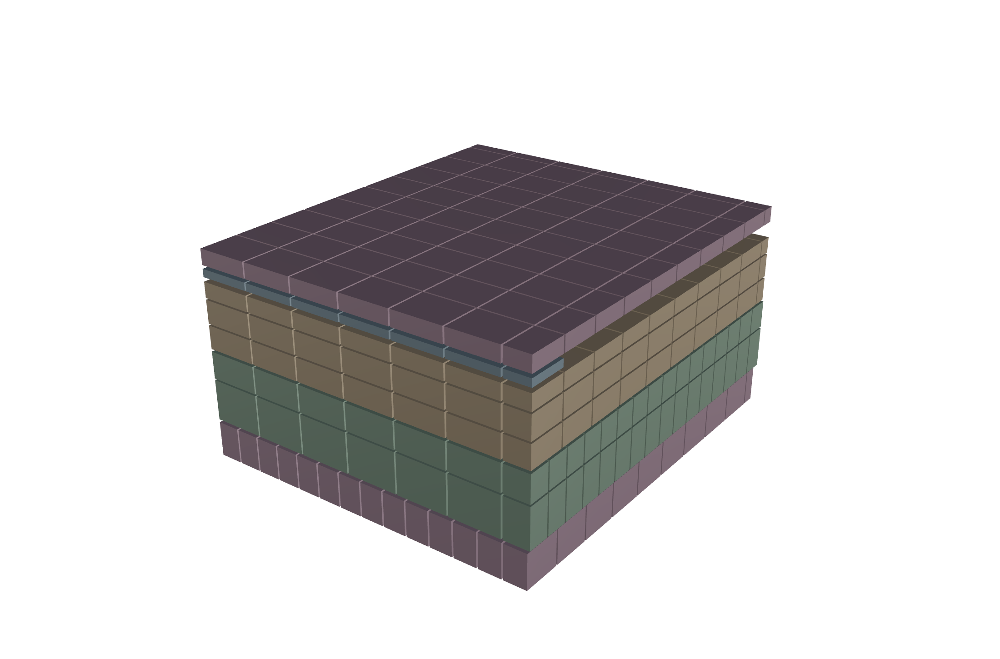

*`andesite_pipeline.gh` solved live: 41 native `.gsf` profiles (10 longitudinal / 31 transversal) → 3308
fracture picks → 4 joint surfaces → 5 benches (**151.5 m³ intact**) → **661 wire-saw blocks, 77.8 % yield**
(117.9 m³ recovered). The thick, box-like
benches are the signature of a homogeneous volcanic rock; the thin blue sliver is the one low-yield bench
(18 %). Unlike the bedded marble/travertine, andesite joints are not horizontal bedding — the "benches" here
are joint-bounded volumes, so there is no dip to follow and the plumb full-span cut is already optimal.*

### The andesite workflow on the canvas (ingestion → report)

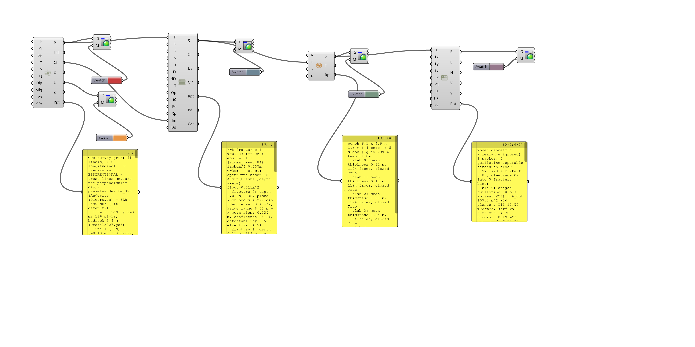

*The complete `andesite_pipeline.gh`, self-presenting: **GPR Survey Grid** (41 `.gsf` profiles read natively,
`andesite_390` preset, bidirectional dip) → **Fracture Surfaces 3D** (picks → kriged joint surfaces) →
**Fracture Bounded Slabs** (4 joints → 5 benches) → **Fracture Block Pack** (packer 5, guillotine, per-bin
report). Every stage drives a **Custom Preview + Colour Swatch** and a **Panel** carrying the live numbers
(profiles + bedrock depth, fracture/pick counts + krige range, bench thicknesses, per-bin block yields).
Reopening the file cold reproduces this — no SEG-Y export, no external inputs. `travertine_pipeline.gh` is the
identical chain on the travertine survey.*

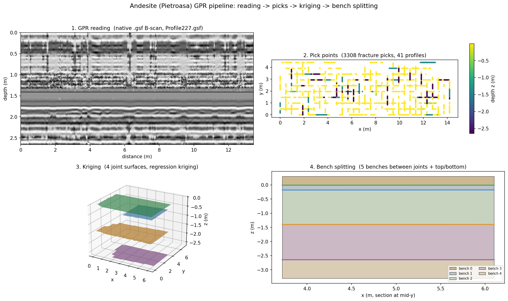

*The same four stages as a data figure: **(1)** a native `.gsf` B-scan read straight off the Akula file,
**(2)** the 3308 fracture picks in plan coloured by depth, **(3)** the four kriged joint surfaces — note they
are near-horizontal, so andesite's joints are not dipping bedding, **(4)** the 5 benches split between the
joints. This mirrors `figure_pipeline_stages.png` (travertine).*

## How the travertine data was unlocked (the hard part)

The Carpinis profiles are **Geoscanners GSF** (Akula 9000C), a proprietary format with no open reader. The
format was reverse-engineered from the OEM **GPRSoftViewer.exe** (decompiled with `ildasm`): data starts at
byte 1500, each trace is 650 `int16` samples + a 40-byte trailer (1340-byte period) + a 777-byte file footer;
acquisition constants (samples 650, Time_Range 64 ns, dielectric εr 13.03) sit in the header. From those:
**dt = 0.0985 ns/sample, v = 0.0831 m/ns**, max depth 2.66 m. Full spec: `outputs/2026-06-20/GSF_FORMAT_SPEC.md`.

Validation (left = our parse, coherence 0.863; right = the OEM viewer rendering the same file):

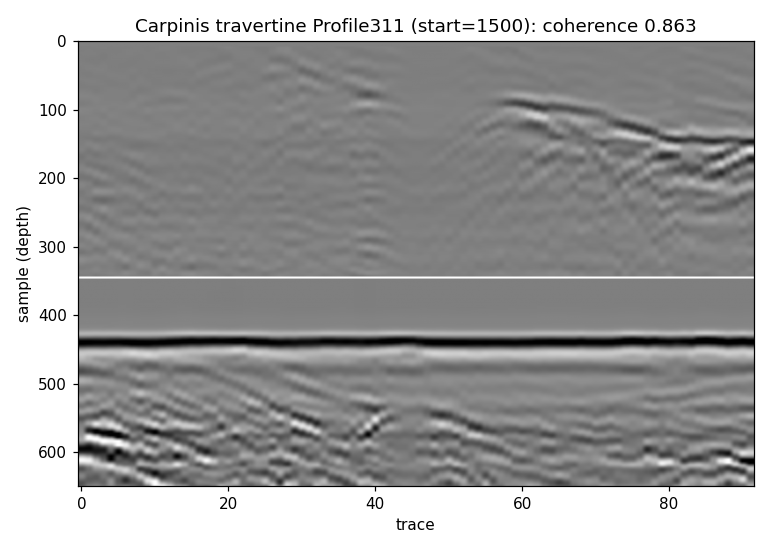
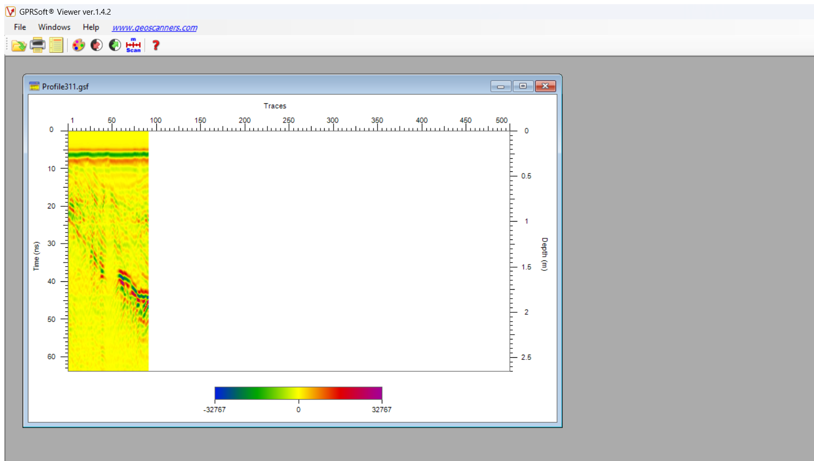

The full chain: GSF parse → `RadargramProcessor.Run` → `FractureExtractor.Extract` (energy quantile 0.95,
continuity window 21, support 6 — scaled to the ~90-trace profiles) → 27 profiles × ~150 picks = **4138
georeferenced picks** on the 50 cm grid → kriged beds → watertight slabs → the three packers.

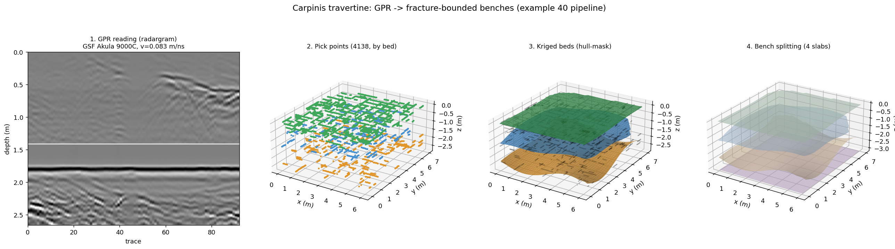

*The four pipeline stages on the real travertine data: (1) GPR reading — a migrated radargram with a depth
axis from v = 0.083 m/ns; (2) fracture pick points, coloured by bed; (3) the kriged bed surfaces
(hull-masked); (4) the four fracture-bounded benches (slabs) that go to the packer.*

## The same pipeline wired in Grasshopper — `travertine_pipeline.gh`

The four stages are also a fully wired Grasshopper definition using the real Frahan components, exactly like
the earlier GPR examples:

**GPR Survey Grid → GPR Fracture Surfaces 3D → Fracture Bounded Slabs → Fracture Block Pack**

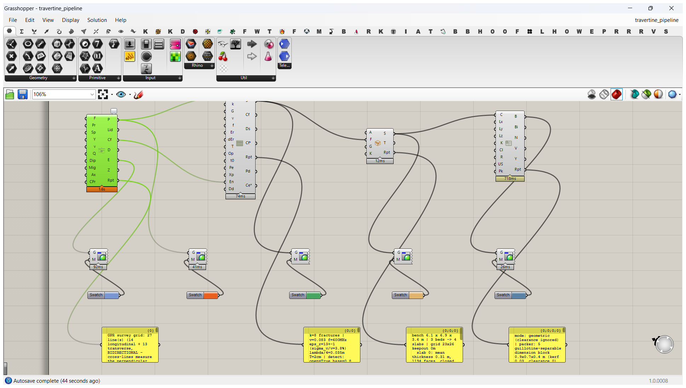

**GSF is now read natively** — `GprFileReader` dispatches `.gsf` to a new `GsfReader` (the Akula binary
layout reverse-engineered from GPRSoft Viewer; runtime-verified: `Profile311.gsf` → 92 traces × 650 samples,
dt 0.0985 ns, amplitudes matching the reference parse). So the GPR Survey Grid `Files` input can point
straight at the 27 `.gsf` profiles in `d:/code_ws/Data/gpr/carpinis_travertine/`. The bundled `gpr_csv/`
(GSF → Frahan traces-CSV) is kept as a portable, reader-independent copy. Either way, with
`Preset = travertine_390`, `Velocity = 0.083`, `Eps_r = 13.03`, `Packer = 5` (guillotine), one live solve
(~2.2 s) produces: **898 fracture picks + 27 energy sections (the GPR reading) → 3 kriged beds → 4 benches →
535 wire-saw blocks** — the whole chain, end to end, on the canvas.
`GPR Survey Grid`'s *Energy Sections* output is the GPR-reading stage; *Fracture Picks* the picks; *Fracture
Surfaces 3D* the kriging; *Fracture Bounded Slabs* the benches.

(`travertine_pack.gh` is the shorter variant that starts from the baked slabs; `travertine_pipeline.gh` is the
full GPR-to-blocks chain.)

### Grain-aligned blocks (visualization)

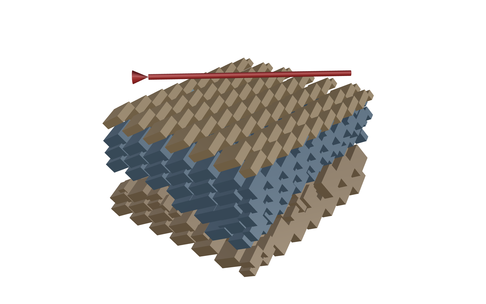

*The already-computed blocks **yawed about Z** to follow the bedding azimuth (read from the kriged beds;
red arrow = dip azimuth). Blocks stay **plumb** — horizontal top/bottom, vertical sides — because that is how
a wire saw cuts; the dip is taken up by the plan rotation and (at cut time) by the inclination of the
bed-separating cut, not by tilting the block. Visualization only; the packing is unchanged.*

### How to cut the dip — flat vs bed-following (cross-section)

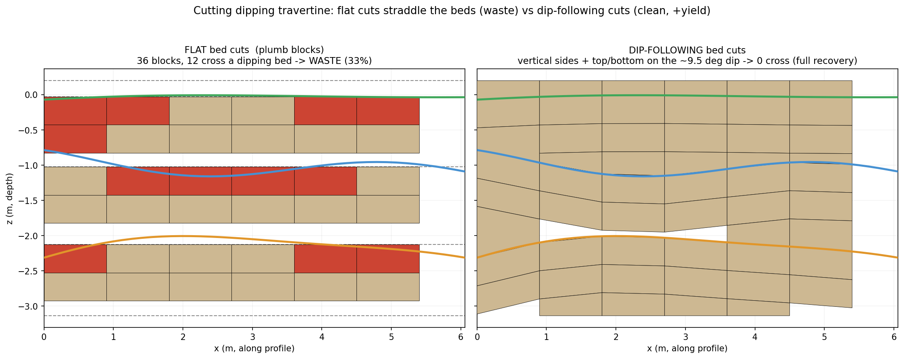

*Vertical section across the dipping beds. **Left, flat bed cuts:** plumb blocks are simple, but the wavy beds
slice through them — 12 of 36 blocks (33%) straddle a bed and carry a fracture (red = waste). **Right,
dip-following bed cuts:** the bed-separating cuts are inclined to the ~9.5° dip, so each block has **vertical
sides and a top/bottom sheared to the bedding** — it sits inside one bed (0 cross, 54 clean blocks). The
dip-following block is neither a fully-tilted parallelepiped nor a perfectly-flat box; it is vertical-sided
with a slanted top/bottom, which is what a stationary diamond-wire saw makes when the bed cut is inclined.
This is the +47–59% "georeferencing prize" — the yield flat cutting leaves in the ground.*

## Files

- `travertine_pack.gh` — the canvas (internalized slabs → Fracture Block Pack → Report).
- `travertine_slabs.3dm` — the 4 fracture-bounded travertine slabs (also internalized in the .gh).
- `hero_crosslithology.png`, `travertine_radargram.png`, `gprsoft_validation.png` — figures.
- Pipeline scripts: `outputs/2026-06-20/travertine/` (extraction, kriging, comparison).

## Data provenance + license

Carpinis travertine, Pietroasa andesite + Botticino marble GPR: **Bonduà et al. 2024, *Data* 9(3):42**
(DOI 10.3390/data9030042). **License CC-BY-NC-ND** — research / academic analysis only, not commercial use.
Andesite acquisition ε is the rig default (13.03), so its absolute depths are nominal.
