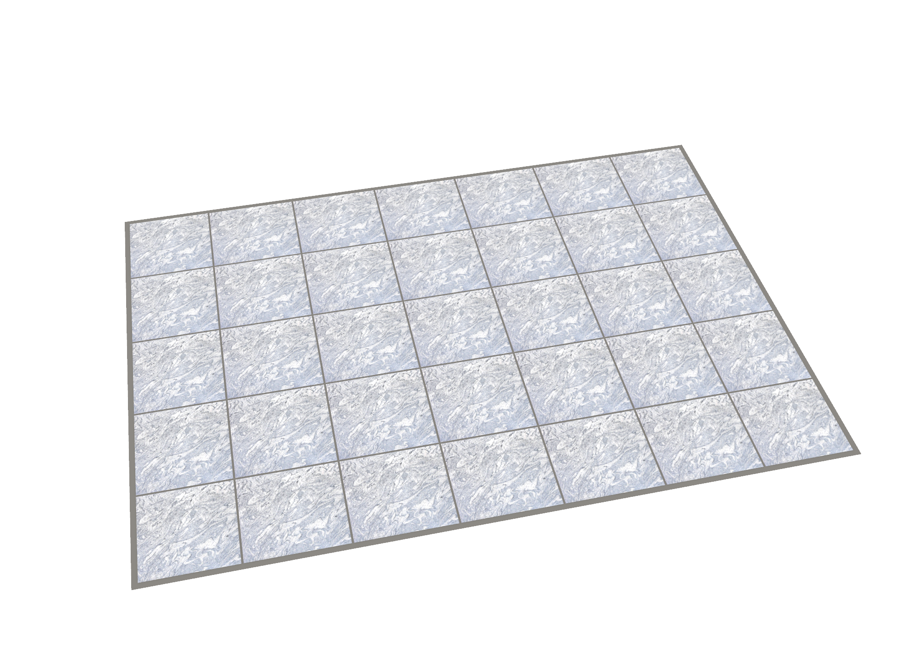
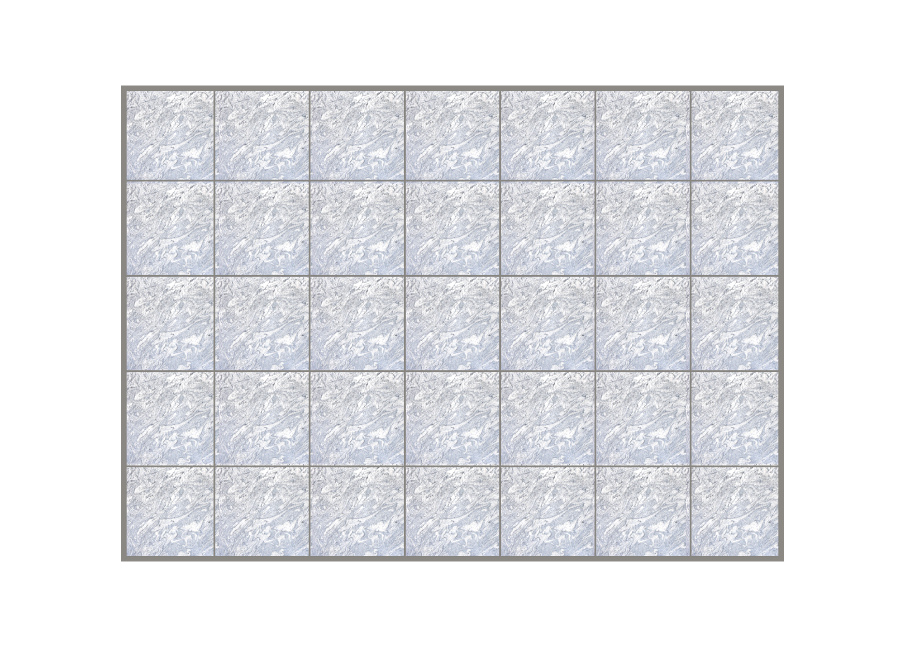
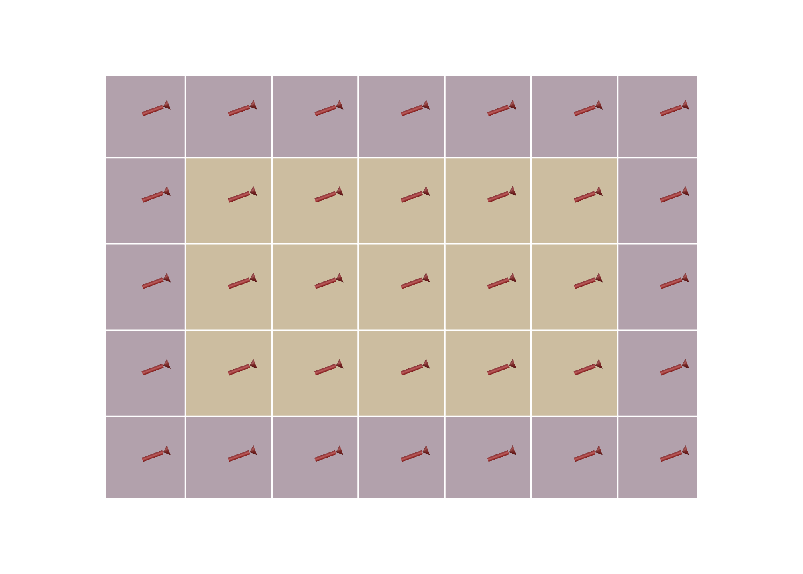
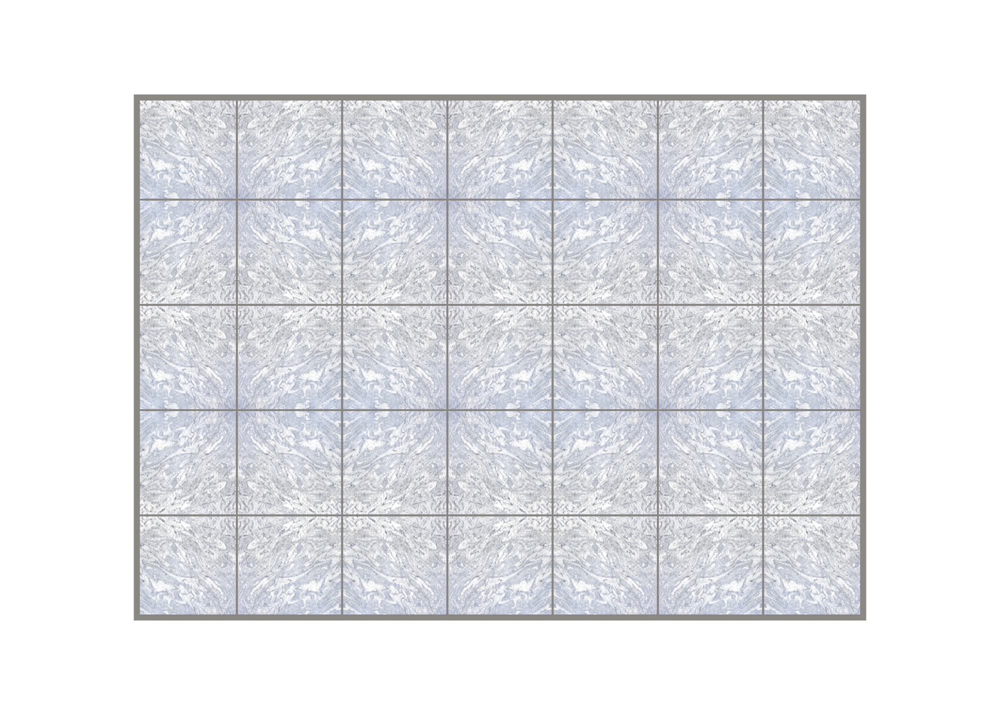

# Example 41 — Floor Tile (Boundary-Trimmed), with grain direction + texture mapping

Divide a floor boundary into standard stone tiles on a module grid (tile face + grout joint) by straight
full-span (guillotine) lines, trim the perimeter tiles to the boundary, and carry a per-tile **grain
direction** that is both a first-class feature (direction arrows) and the source of the **Rhino-native texture
mapping** for a scanned-stone image material.

*The `Floor Tile (Boundary-Trimmed)` component on a 4.2 x 3.0 m room: 600 mm tiles, 12 mm grout, centred
layout. The "Gray Wave" granite image (the `Image` input) is mapped onto every tile (per-tile, monolithic
grain); border tiles are trimmed to the room and the joints read as grey grout. The texture maps through
standard Rhino texture coordinates driven by the grain — no bespoke direction system.*

*Slip-match (`Match = 1`): the granite flows continuously across the joints so the whole floor reads as one
slab cut into tiles.*

*The same layout as a setting-out diagram: full tiles (tan, 15) vs cut perimeter tiles (purple, 20), each with
its red grain arrow (the `Direction` output). The centred start balances the border cuts equally on opposite
walls and the smallest cut clears the ANSI half-tile no-sliver threshold.*

## The component (Frahan > 2D Packing)

`Floor Tile (Boundary-Trimmed)` (`FloorTile`, GUID `D5F1001A-7C3B-4E29-B1A6-0F2D9E4C8B57`) wraps the Rhino-free
Core `Frahan.Packing.TwoD.FloorTileGridLayout`.

**Inputs:** `Boundary` (room outline), `Holes` (optional obstacles), `TileX`/`TileY`, `Joint` (grout),
`Start` (0 corner / 1 picked point / 2 centred-symmetric), `Anchor` (for start 1), `Grain` (degrees),
`GrainField` (0 monolithic / 1 quarter-turn / 2 random), `Sliver` (no-sliver fraction, 0.5 ANSI),
`Match` (0 per-tile / 1 slip-match / 2 book-match), `Stagger` (0 stack / 1 third / 2 half running bond),
`Image` (stone-texture file path — drawn on screen).

**Outputs:** `Tiles` (trimmed boundaries), `Direction` (per-tile grain line — the arrows), `Full?` (full vs
cut), `TexMesh` (grain-aligned texture coordinates), `MapFrame` (per-tile planar texture-mapping plane),
`Report`, `Material` (the image material, for Custom Preview / baking).

*Book-match (`Match = 2`): adjacent tiles mirror so the granite pattern meets symmetrically across the joints
(the butterfly feature-floor pattern). Mapped from the `Image` input.*

## How the grain + texture works (reuse Rhino, do not invent)

The grain direction is the source of truth: it is output as the `Direction` lines (the feature) **and** baked
into each `TexMesh`'s texture coordinates (the UV frame is rotated by the grain). Set `Image` to a scanned
stone texture and the component **draws the floor on screen** mapped to the grain — no extra wiring. The same
material is emitted on `Material` for Custom Preview / baking, and `MapFrame` gives the equivalent per-tile
planar mapping plane for Rhino's object-level `TextureMapping.CreatePlanarMapping` + `SetTextureMapping`.

`Match` modes:
- **Per-tile** (0): each tile shows the whole image, rotated to its grain.
- **Slip-match** (1): UVs flow across the floor so the image reads as one continuous slab.
- **Book-match** (2): adjacent tiles mirror so the veins meet symmetrically at the joints.

`GrainField`: monolithic (all one way), quarter-turn (checkerboard 0/90 — basket look), random.
`Stagger`: stack bond (0), 1/3 (1) or 1/2 (2) running-bond row offset — auto-capped at 1/3 for large-format
tiles (a side > 380) to control lippage (TCNA/ANSI 1/3 rule).

## Layout rules

- Module pitch = tile + joint; tiles sit on the pitch, grout is the gap (and the wall reveal).
- **Start modes:** corner / picked-point start put full tiles at the anchor and accumulate the cuts at the far
  edges; centred/symmetric balances the border cuts equally on opposite walls.
- **No-sliver rule (ANSI A108.02 4.3.2):** perimeter cuts should be >= half a tile; the layout auto-centres
  (shifts the lattice by half a module) to split a thin sliver into two larger border cuts. The `Report` flags
  whether the smallest cut clears the threshold.
- Perimeter tiles are trimmed to the boundary (and around holes) by Clipper2 boolean — the regular,
  guillotine-grid sibling of the live-edge flooring example (29), which scribes irregular boards.

## Files

`41_floor_tiling.gh` (self-presenting: FloorTile with the granite `Image` drawn on screen + Custom Preview of
the grain arrows), `41_floor_tiling.3dm` (the baked granite floor), `granite_gray_wave.jpg` (the "Gray Wave"
granite texture — swap in your own scanned stone), `figure_floor_textured.png` (per-tile),
`figure_floor_slipmatch.png` (slip-match), `figure_floor_bookmatch.png` (book-match), `figure_floor_grain.png`
(the grain + cut/full diagram).

Research + design: `d:/code_ws/outputs/2026-06-20/floor_tiling/FLOOR_TILING_DOSSIER.md`.
