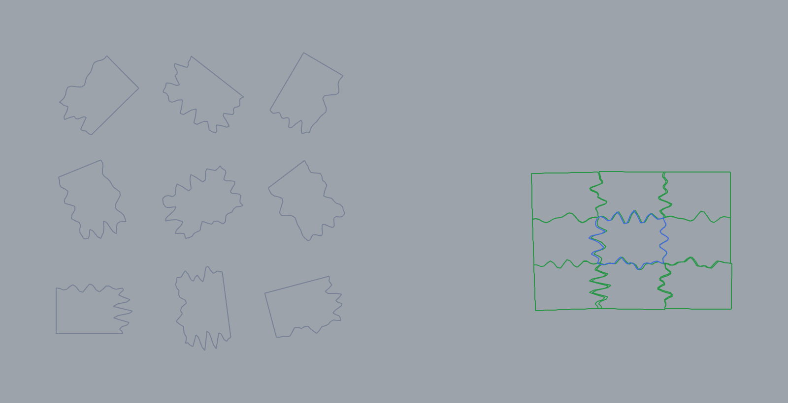

# 42 — Whole-Side Reassembly (`Whole-Side Assemble`)

Reassemble scattered, rotated 2D parts back into their original configuration by
matching **whole contour sides** (corner-to-corner) — not curvature-broken fragments.



*Left: 9 scattered + rotated parts. Right: the reassembled assembly (blue = anchor,
green = mated parts). 9/9 placed, max placement error ≈ 5 mm on ~107 × 73 mm parts.*

## What this shows

The `Whole-Side Assemble` component (**Frahan ▸ EdgeMatch**) takes one **anchor** part
and a pool of scattered **parts**, and grows the assembly outward from the anchor by a
deterministic **best-first seam mate**. It is the companion to `EdgeMatch Solve`: where
that component matches short, curvature-broken boundary *segments* (which hash
promiscuously on hard pieces and plateau around 7/9 on this puzzle), `Whole-Side
Assemble` compares the **whole seam shape** between two corners, which cleanly separates
a true neighbour from a look-alike and reaches **9/9**.

## The `wholeside_reassembly.3dm`

Two layers:
- **`input (scattered parts)`** — the 9 parts as the solver receives them (translated +
  rotated out of place).
- **`assembled (whole-side best-first)`** — the solved placement.

All parts are closed polylines, coplanar in **world XY** (the solver is 2D).

## Try it live

Two ways to reproduce the assembly:

1. **Shipped component (recommended).** Open
   [`wholeside_reassembly.gh`](wholeside_reassembly.gh) — it wires the **`Whole-Side
   Assemble`** component (Frahan ▸ EdgeMatch) with the anchor + the 8 scattered parts
   internalized and `Run` already on, so it reassembles on load. Wiring is below.
2. **No-plugin GhPython demo.** Paste [`wholeside_reassembly_demo.py`](wholeside_reassembly_demo.py)
   into a GhPython / Python 3 Script component. It regenerates this jigsaw, calls the
   Core `BestFirstAssembler`, and outputs `a` = reassembled, `b` = scattered input. Set
   `CORE_DIR` at the top to your `Frahan.EdgeMatching.Core` build folder.

## How the component is wired

```
            ┌──────────────────────────┐
 Anchor (1 closed crv) ─► A │                          │
 Parts  (N closed crvs) ─► P │   Whole-Side Assemble    │─► Pl  Placed contours
 Fit Gate (num, 2.5)    ─► G │   (Frahan ▸ EdgeMatch)   │─► X   Transforms
 Run (bool)             ─► R │                          │─► Id  Ids
            └──────────────────────────┘─► Tr  Total Residual
                                                        └─► Rp  Report
```

- **Anchor (A)** — the part placed first, at its current position; the assembly grows
  from it. (In the `.3dm`, the anchor is the centre part placed at its true slot.)
- **Parts (P)** — the scattered/rotated parts to reassemble.
- **Fit Gate (G)** — max length-normalized side-fit cost admitted to the search.
  Default **2.5**. It must exceed the highest *true* seam cost; too low and a far part
  column can orphan (here, lowering it below ≈ 1.9 drops the far column).
- **Run (R)** — toggle to solve.

Outputs: the transformed **Placed** contours, the per-part rigid **Transforms**, the
part **Ids** in placement order, the summed **Total Residual**, and a text **Report**.

## How it works (algorithm)

1. **Corners** — the 4 contour points nearest the **minimum-area bounding rectangle**'s
   corners (rotating calipers on the convex hull). Robust to wavy seams and to rotation
   (the box is oriented, not axis-aligned).
2. **Sides** — the four contour arcs between corners. **Flat border sides are excluded**
   from matching (every straight edge matches every other straight edge at ≈ 0 — the
   classic corner-piece trap).
3. **Side-fit** — each side is resampled into an endpoint-chord *canonical frame*; the
   score is the minimum, over the two seam orientations, of the index-aligned L1
   distance between the two canonical polylines, normalized by side length (a
   generalization of Ian Charnas's `ryan-puzzle-solver` `error_between_polylines`). True
   seams score ≈ 0.2–1.0; spurious pairs > 1.2.
4. **Best-first assembly** — a deterministic priority frontier of `(cost, parent-side,
   child-side)` mates; each accepted mate places the part by a 2-point rigid transform
   and is rejected if it overlaps an already-placed part (`Curve.Contains`). Grows from
   the anchor until the pool is placed.

Implemented in `Frahan.EdgeMatching.Core` (`WholeSideExtractor`, `WholeSideMatcher`,
`BestFirstAssembler`); see `WholeSideAssemblerTests` for the 9/9 + determinism test.

## Notes / limits

- **2D, world XY only.** The component validates that every part is flat in the world XY
  plane and skips tilted parts. Orient parts into XY first.
- The same Core engine underpins fracture / off-cut reassembly, dry-stone shard
  matching, and live-edge / Trencadís fitting where parts share complementary edges.
