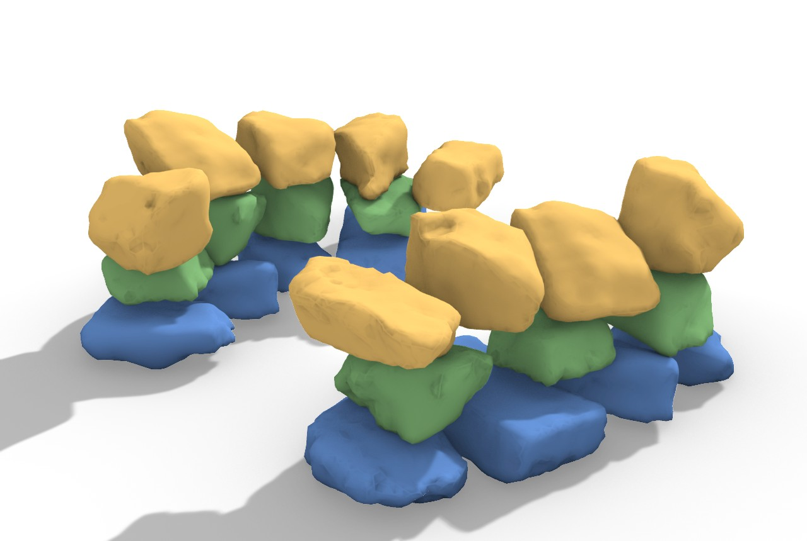

# 43 — NBO Dry-Stone Wall (`Dry-Stone Wall (NBO)`)

Build a coursed dry-stone wall from a stone inventory with the **Next-Best-Object** planner:
the wall fills itself, stone by stone, choosing the best stone and pose at each step.



*Two NBO walls coloured by course: a straight wall (front) and a curved wall that follows a plan-rim
spine (behind). ETH1100 stones. Straight: 10/10 stable, 3 courses. Curved: 9/9 stable, 2 courses.*

## What this shows

The `Dry-Stone Wall (NBO)` component (**Frahan ▸ Masonry**) takes a stone **Inventory** and fills a
wall incrementally. At each placement front it, for every candidate stone:
- orients it by the **hybrid rule** — rest on the hull **stable face** (so it does not topple) and
  **yaw the long axis into the wall** (the dry-stone "length into the wall" bond),
- **drops it to contact** on the as-built (no floating),
- **gates** stability analytically (centre-of-mass over the support patch, depth/height ≥ 0.5, the
  resting face seats flat),
- and commits the **lowest-cost** admissible stone (void-under + height − stability − coverage).

Give it a **Spine** curve and the wall follows it (a curved dry-stone wall); leave it empty for a
straight wall. This is the planning half of the ETH/HEAP autonomous-dry-stone loop (Furrer 2017,
Johns 2020).

## The `nbo_dry_stone_wall.3dm`

Two layers, both coloured by course (red = a gate-rejected stone):
- **`wall (straight, by course)`** — `FillWall`, a straight wall along +X.
- **`wall (curved spine, by course)`** — `FillSpine`, following the black arc **spine** curve.

## Try it live

1. **Shipped component (after deploy).** Deploy the plugin first (`pwsh -File install\deploy.ps1`
   with **Rhino closed** — the NBO components are new), then open
   [`nbo_dry_stone_wall.gh`](https://github.com/libishm1/Frahan/blob/main/examples/43_nbo_dry_stone_wall/nbo_dry_stone_wall.gh). It wires an internalized stone **Inventory** into
   `Dry-Stone Wall (NBO)`. Toggle **Run** to fill. Add a **Custom Preview** on the **Placed** output
   to colour the wall.
2. **No-deploy GhPython demo (works now).** Paste [`nbo_wall_demo.py`](https://github.com/libishm1/Frahan/blob/main/examples/43_nbo_dry_stone_wall/nbo_wall_demo.py) into a
   GhPython / Python Script component. Set `CORE_DIR` to your `Frahan.StonePack.Core` build folder and
   `INVENTORY_DIR` to a folder of stone OBJs. Wire `a` → **Custom Preview** (Geometry) and `b` →
   **Custom Preview** (Material) for the coloured wall. Add an optional `spine` Curve input for the
   curved variant.

## How the component is wired

```
              ┌───────────────────────────┐
 Inventory (meshes) ─► I │                           │─► Pl  Placed meshes
 Wall Length (3.0)  ─► L │                           │─► X   Transforms
 Target Height (1.6)─► H │   Dry-Stone Wall (NBO)    │─► Cr  Course (per stone)
 Course Offset (.25)─► O │   (Frahan ▸ Masonry)      │─► St  Stable (per stone)
 Gap (0.02)         ─► G │                           │─► Co  Cost
 Envelope (Brep,opt)─► E │                           │─► Rp  Report
 Spine  (Curve, opt)─► Sp│                           │
 Confirm (Bullet)   ─► C │                           │
 CRA  (wall-gate)   ─► Cra                           │
 Run (bool)         ─► R └───────────────────────────┘
```

- **Inventory (I)** — the stone meshes to draw from.
- **Spine (Sp)** — optional plan-rim curve the wall follows (a straight wall when empty).
- **Envelope (E)** — optional closed Brep; bounds the wall and rejects out-of-envelope stones.
- **Confirm (C)** — run a Bullet physics settle confirmation of the produced wall.
- **CRA (Cra)** — run the compas-CRA rigid-block-equilibrium wall-gate (the strongest stability tier).
- **Run (R)** — toggle to fill.

Outputs: the **Placed** meshes in placement order, the per-stone **Transforms**, **Course**, **Stable**
verdict, selection **Cost**, and a text **Report** (placed / stable / courses / height, plus the
settle + CRA results when enabled).

## How it works (algorithm)

The hybrid orientation and the analytic gate were derived from a 3-course stacking study on real
ETH1100 stones: resting on the hull **stable face** propagates stability up the wall (12/12 vs 6/12
for a pure long-axis-in placement), and the PCA long axis is the *yaw*, not the resting face. See
`NBO_3D_DESIGN.md`. Implemented in `Frahan.StonePack.Core` (`Frahan.Masonry.Nbo`:
`StoneShapeAnalyzer`, `NboPlanner.FillWall` / `FillSpine`, `NboPlanner.Gate`).

## Notes / limits

- **Deploy needed for the component.** The `Dry-Stone Wall (NBO)` component is new; deploy the plugin
  (Rhino closed) before opening the `.gh`. The GhPython demo needs no deploy (it loads Core directly).
- Drop-to-contact rests each stone at first contact, leaving small interstitial voids (natural rubble;
  a real waller fills them with hearting). The **CRA** wall-gate wants settled geometry — run a Bullet
  settle first for a clean verdict.
- The plan-rim **Spine** is an axis-aligned plan curve; the true 3-D as-built ∩ target rim is a future
  refinement.
