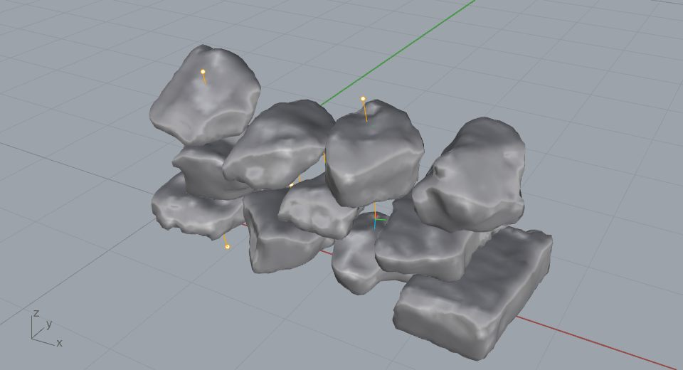

# 44 — NBO → Robot (`Next-Best-Object Pose → Robot Frame`, `Force-Seat (URScript)`)

Turn the NBO dry-stone wall (example 43) into robot **pick / place / approach TCP frames** + **UR
poses** + a **force-seat** program, and simulate the arm's reach in **COMPAS**. This is the
planner → robot handoff. The live robot stays **dormant** — nothing is sent to hardware.



*Each placed stone carries a place TCP frame (red/green axes, blue Z pointing down into the stone) and
an orange approach vector dropping from a pre-place waypoint above. Magenta = the robot base.*

## What this shows

Frahan is the **planner**, not a motion controller: it exposes **planes + execution**, and a robot
backend (or a COMPAS sim) does the kinematics.
- `Next-Best-Object Pose → Robot Frame` (**Frahan ▸ Masonry**) computes, per placed stone, a top-pick
  grasp (gripper over the centre of mass, on the face opposite the resting face, tool pointing down)
  and emits the **Pick / Place / Approach** TCP `Plane`s + the UR pose `p[x,y,z,rx,ry,rz]` in the
  robot base + the grip width/length.
- `Force-Seat (URScript)` emits, per place frame, a `movej → movel → zero_ftsensor → force_mode press →
  retract` URScript program. Force-seating is the irregular-stone enabler — the robotic analog of the
  planner's drop-to-contact + settle (Furrer 2017 ran exactly this on a UR10 + FT150 sensor). **Text
  only**, no hardware send.
- `nbo_to_compas_robots.py` runs an **in-process FK/IK simulation** of a UR10e on the place frames.

## The `nbo_to_robot.3dm`

One layer: the placed wall (grey) + the per-stone place TCP triads (red X / green Y / blue Z-down) +
orange approach vectors + the magenta robot-base marker.

## Try it live

1. **Shipped components (after deploy).** Deploy first (`pwsh -File install\deploy.ps1`, Rhino closed),
   then open [`nbo_to_robot.gh`](nbo_to_robot.gh): an internalized **Inventory** → `Dry-Stone Wall
   (NBO)` → `Next-Best-Object Pose → Robot Frame` (Stones = inventory, Placements = the wall
   Transforms). Toggle the wall's **Run**. Add `Force-Seat (URScript)` on the **Place Frames** to get
   the per-stone seat programs.
2. **No-deploy GhPython demo (works now).** Paste [`nbo_robot_demo.py`](nbo_robot_demo.py) into a
   GhPython component (set `CORE_DIR`, `INVENTORY_DIR`). Outputs `place_planes`, `pick_planes`,
   `approach_planes`, `ur_poses`, `wall`.
3. **COMPAS FK/IK simulation (the test).** Paste [`nbo_to_compas_robots.py`](nbo_to_compas_robots.py)
   into a **Rhino-8 Python-3** component (`#! python3` + `# r: compas_fab==1.1.0`); feed it
   `place_planes` + a UR10e URDF. It converts each Plane → COMPAS Frame, runs **compas_fab** analytic
   UR IK, confirms with **compas_robots** FK, and draws the arm. Outputs `reachable`, `configs`,
   `reached_planes`, `robot_meshes`.

## How the chain is wired (`.gh`)

```
 Inventory (meshes) ─┬─► I  Dry-Stone Wall (NBO) ──► X Transforms ─┐
                     │                                             │
                     └────────────────────────► S  Next-Best-Object ◄── X Placements
                                                   Pose → Robot Frame
                                                   ├─► Pk Pick Frames
                                                   ├─► Pl Place Frames ──► Force-Seat (URScript) ─► U URScript
                                                   ├─► Ap Approach Frames
                                                   ├─► Ps Place Poses (UR p[...] in base)
                                                   └─► Gw/Gl Grip W/L
```

## COMPAS package note (verified)

`compas_robots` = robot **model + URDF + forward kinematics + visualization** (no IK). Analytic UR IK
lives in **`compas_fab`** (`AnalyticalInverseKinematics`, solver key `"ur10e"`, closed-form,
**in-process, no ROS / no Docker**). `compas` (`compas_rhino.conversions`) does Plane ↔ Frame. Metres
+ radians. There is **no Frahan IK component by design** — the COMPAS Python libraries do the
kinematics; Frahan just exposes the planes. See `ROBOT_INTEGRATION_STUDY.md §9`.

## Notes / limits

- **Hardware dormant.** Everything here is planes + code-gen + simulation. Validate URScript in URSim
  and require an explicit hardware-enable before any robot run.
- Real-arm execution routes through URScript (Robots/visose or UnderAutomation .NET) or compas_fab's
  ROS backend for planned, collision-aware motion. The COMPAS sim here is the **reachability test**.
- The grasp is a top-pick over the CoM; a real cell tunes the grasp + tool TCP + base registration.
