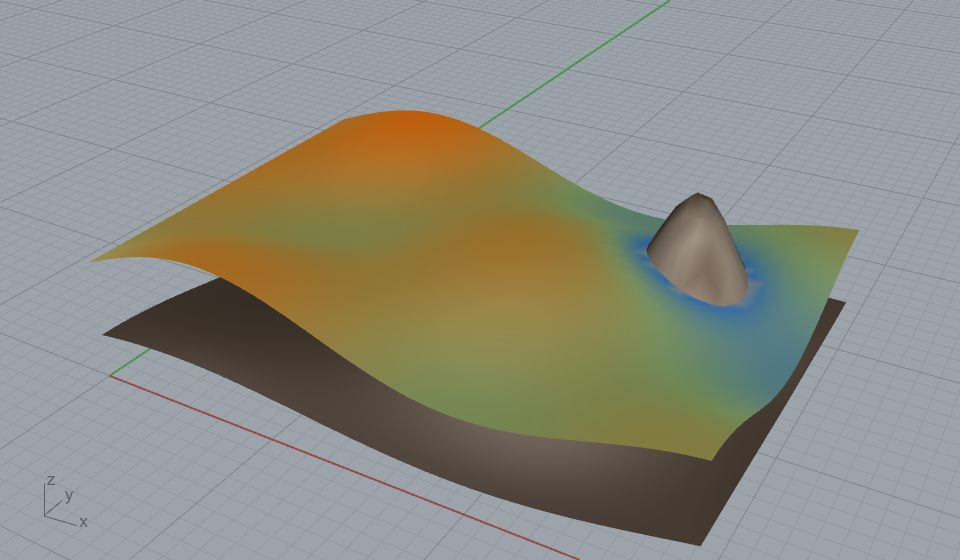

# 45 - Cut-and-Fill / Soil Excavation to the Rock Face (`Overburden To Rock Face`)

Compute the **overburden** to strip to reach a bedrock / rock-face surface - the cut-and-fill
volume between a ground (topo) surface and a bedrock surface, by **exact TIN-prism differencing**.
Cut = soil to excavate; Fill = where bedrock breaks the surface; Loose = swell-adjusted haul volume.



*Ground surface vertex-coloured by overburden DEPTH (orange = deep, blue = thin, grey = fill), draped
over the bedrock (brown). The rock knob on the right breaks the surface - rock already exposed (Fill).
Cut = 2184 m3, Fill = 29 m3, Loose (+25% swell) = 2730 m3 over 568 m2.*

## What this shows

The `Overburden To Rock Face` component (**Frahan > Quarry**) takes a **Ground** surface and a
**Bedrock** surface and returns the volume between them. It integrates a per-facet prism over a
common TIN, `V = A_xy * (d_a + d_b + d_c)/3` with `d = z_ground - z_bedrock`, which is **exact** for
piecewise-linear surfaces. Where `d` changes sign inside a facet the facet is clipped at the `d = 0`
line, so **Cut** (soil above bedrock) and **Fill** (bedrock above ground) are integrated separately
and exactly. This is the quarry "how much overburden do we strip to reach the extractable rock" enquiry,
and the same call does a general grade cut-and-fill (two design surfaces crossing).

## The `cut_and_fill.3dm`

Two layers:
- **`ground (depth-coloured)`** - the topo surface, vertex-coloured by overburden depth.
- **`bedrock (rock face)`** - the bedrock / rock-face surface below it.

## Try it live

1. **Shipped component.** Open [`cut_and_fill.gh`](https://github.com/libishm1/Frahan/blob/main/examples/45_cut_and_fill_excavation/cut_and_fill.gh): an internalized **Ground** and
   **Bedrock** mesh feed `Overburden To Rock Face` (Swell = 0.25). It solves on load. Outputs are the
   cut / loose / fill / net volumes, the plan area, a depth-coloured **Depth Mesh**, and a report.
   Wire the Depth Mesh -> **Custom Preview**.
2. **No-plugin GhPython demo.** Paste [`cut_and_fill_demo.py`](https://github.com/libishm1/Frahan/blob/main/examples/45_cut_and_fill_excavation/cut_and_fill_demo.py) into a GhPython
   component (set `CORE_DIR`). It builds the synthetic site, calls the Core `OverburdenVolume.Compute`,
   and outputs `ground` (depth-coloured), `bedrock`, and the `cut / fill / net / area / loose` numbers.

## How the component is wired

```
 Ground (Mesh)  ─► G │                        │─► V   Overburden / Cut (bank, m3)
 Bedrock (Mesh) ─► R │  Overburden To Rock    │─► L   Loose / haul (V * (1+Swell))
 Swell (0.25)   ─► Sw│  Face  (Frahan>Quarry) │─► F   Fill (bedrock above ground)
                     │                        │─► N   Net (Cut - Fill)
                     │                        │─► A   Plan Area (x,y)
                     │                        │─► D   Depth Mesh (coloured by depth)
                     └────────────────────────┘─► Rpt Report
```

## The real pipeline (upstream)

The two input surfaces come from the quarry-geology front end, which is why this is the "missed"
companion to examples 03 / 08 / 35:
- **Ground** <- `Clean Scan Mesh` / `Scan Reconstruct` on a LiDAR or photogrammetry point cloud.
- **Bedrock** <- `GPR Bedrock Surface` (reconstructed from GPR / ERT / seismic depth picks).
- both -> `Overburden To Rock Face` -> the excavation volume + the depth map.

## Notes / limits

- **2.5D volume** (vertical prisms). For the 3-D exposed face used in block extraction, take the
  bedrock through `Scan Reconstruct`.
- The component bridges two arbitrary triangulations (it samples bedrock z under each ground vertex);
  the Core `OverburdenVolume.Compute` expects both surfaces already on one common TIN.
- Units are model units; report numbers above are metres / m3 on a 30 x 20 m synthetic site.
