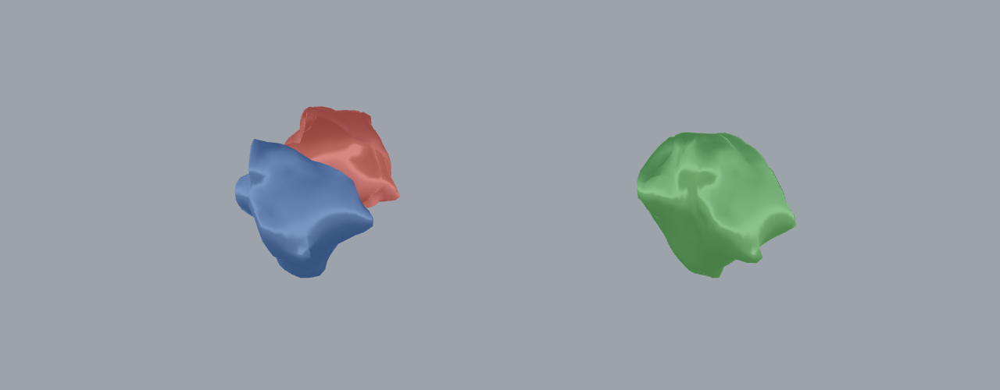

# 48 — 3D Block Matching / Reassembly (`Soft ICP 3D`)

Reassemble a scanned rubble stone that has been broken into pieces and scattered,
by annealing the loose fragment back onto the anchor until their broken faces sit
in contact — the 3D counterpart to example 42 (`Whole-Side Assemble`, which does
the same for 2D contours).

*Left: the two fragments as the solver receives them — blue anchor + red loose
fragment, rotated ≈ 8° and pushed ≈ 0.35 m out of place. Right: the fragment
annealed back by `Soft ICP 3D` (green), 0 penetration, mean vertex position
recovered to ≈ 0.8 mm of ground truth on this ≈ 1 m stone.*

## What this shows

`Soft ICP 3D` (**Frahan ▸ EdgeMatch**, `D5F1000E`) takes a list of mesh
**fragments** and one **anchor index**, and drives every non-anchor fragment onto
the assembly with a soft-assignment Iterative Closest Point: it samples the open
break rims, matches them under an annealing temperature (`Tau0 Factor`,
`Tau Anneal`), down-weights outliers, and iterates until the rims seat without
inter-penetration. It reports the residual **Mean Rim Gap**, the **Max
Penetration**, the contact-sample count, and the per-fragment rigid **Delta**
transforms.

Here one scanned ETH1100 stone (`0000.obj`, ≈ 0.86 × 1.08 × 1.06 m) is cut by a
slightly tilted plane into a 931-face anchor and an 877-face loose fragment. The
loose fragment is rotated and translated away; `Soft ICP 3D` (anchor index 0)
recovers its original pose. The tilted break gives the seam enough 3-D relief to
lock the in-plane sliding a single flat cut would leave ambiguous.

## The `block_matching_3d.3dm`

Three layers:
- **`anchor`** — the fixed fragment (blue).
- **`input (fragment scattered)`** — the loose fragment as received, out of place (red).
- **`reassembled (soft-icp)`** — the solved assembly, offset +2.4 m in X (green).

All meshes are in metres, in world coordinates (the solver is fully 3-D).

## Try it live

Open [`block_matching_3d.gh`](https://github.com/libishm1/Frahan/blob/main/examples/48_block_matching_3d/block_matching_3d.gh). It internalizes the two
fragments, feeds them to `Soft ICP 3D` (anchor index 0, `Tau0 Factor` 3.5,
`Tau Anneal` 0.85, `Max Iterations` 120, `Sample Spacing` 0.03 m), grabs the
solved branch, and previews it beside the input — so it reassembles on load.
Custom Preview colours: blue anchor + red loose input on the left, green
reassembled stone on the right.

## The EdgeMatch 3D family

`Soft ICP 3D` is the refinement stage of a broader 3D block-matching toolset
(**Frahan ▸ EdgeMatch**). The others, for the wider workflow:

- **`Block Pair Match 3D`** (`D5F10008`) — proposes how two rough stones can mate
  face-to-face by planar-facet extraction (plane-to-plane, ≈ mm residual, several
  ranked candidates). Use it as the **coarse pre-alignment** feeding `Soft ICP 3D`.
- **`Adaptive Block Match 3D`** (`D5F1000A`) — trims a candidate stone to fit a
  target slot with a real CGAL boolean, reporting trim volume / ratio against a
  budget (Cyclopean Cannibalism discipline).
- **`Template Block Match 3D`** (`D5F1000B`) — assigns a stone inventory to
  template cells (v1.x: Hungarian on a volume-difference cost).
- **`Mesh Template Match`** (`D5F1000D`) — selects the best stock mesh to carve a
  target from, by yield.

## Data provenance

ETH Zurich dry-stone masonry dataset (ETH1100), bundled subset in
`data/eth1100_subset/` (16 closed stones). Zenodo 10.5281/zenodo.10038881.

## Related

- Example 42, `wholeside_reassembly` — the 2D contour analogue.
- Example 29, `liveedge_floor` — 2D live-edge matching.
