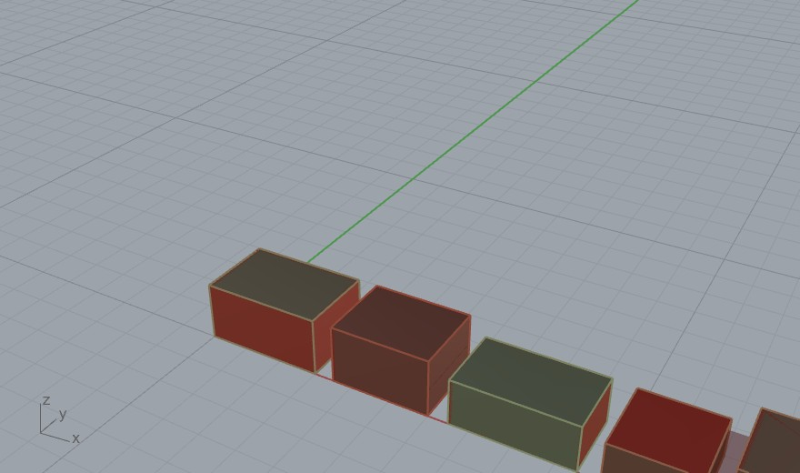

# 49 — Quarry extraction-order plan (Inventory → Yield → Order → Schedule → Report)

Turn a quarry block inventory into a **sequenced extraction plan**: score each candidate
block by recoverable value and risk, rank the cutting order, schedule the cuts across saw
beds, and emit a crew-readable report. This is the decision a quarry engineer actually
makes — *which blocks, in what order* — that no other example reaches: the other quarry
examples stop at yield (32) or kinematic feasibility (46), never at a cut sequence.



## What this shows

The chain (**Frahan ▸ Block / Quarry**):

```text
Quarry Inventory -> Quarry Yield Estimator -> Extraction Order Optimizer
                 -> Saw-Bed Schedule -> Quarry Report
```

`Extraction Order Optimizer` ranks blocks by a value/risk score; `Saw-Bed Schedule` runs a
greedy LPT assignment (Graham 1969) of the accepted blocks onto N saw beds and returns the
makespan; `Quarry Report` writes the mason/BOM markdown.

Live result on the bundled inventory: **8 blocks, 59.49 m³ gross → 6.38 m³ recoverable
(10.7% recovery), ranked extraction order (B3, B8, B1, B7, B5, …), 2-bed schedule,
makespan 3528 min.** Solves in ~0.1 s, 0 errors.

## Files

- `extraction_order_plan.gh` — the self-presenting canvas.
- `extraction_order_plan.3dm` — the baked blocks + extraction-order labels.
- `hero.jpg` — the shaded capture.

## Try it live

Open `extraction_order_plan.gh` with the Frahan `.gha` deployed. It solves on load. Drive
the bed count and the score weights on `Extraction Order Optimizer`; the schedule and
report update.

## Related

- Example 32 (`scan_to_blocks`) — the in-situ block-size input side.
- Example 35 (`gpr_quarry_full_workflow`) — the GPR → fracture-bounded-blocks front end.
- Example 47 (`fabrication_handoff`) — the DXF / COMPAS fabrication tail.
