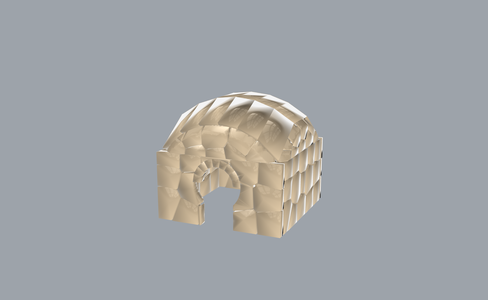

# 50 — Castle keep → masonry stability → IFC / BIM

A small castle keep — polygonal rubble walls, an arched portal, and a pendentive vault —
generated, verified STABLE in compression-only rigid-block equilibrium, and exported to
**IFC** for the BIM handoff. The architect's end-to-end: form → structure → deliverable,
with the stone assembly landing in Revit / ArchiCAD as a real IFC file.



## What this shows

31 components (**Frahan ▸ Masonry / Vault / Voussoir**), solves in ~3.9 s, 0 errors:

```text
Polygonal Wall (Generator) x2   (power-diagram rubble walls)
Arch Voussoirs                  (the portal)
Pendentive Vault Voussoirs      (the roof)
  -> Masonry Stability Check x3 (K=8 inscribed friction pyramid, penalty-RBE QP)
  -> IFC Export (Building)      (the BIM deliverable)
Mesh CSG (CGAL) x4              (boolean detailing)
```

`Masonry Stability Check` certifies each sub-assembly compression-only stable (Kao 2022
RBE, µ_eff = µ·cos(π/8)); `IFC Export (Building)` writes the stone assembly to IFC. This
closes the BIM-handoff gap — the deliverable an architect actually needs from a masonry
tool.

## Files

- `castle_keep.gh` — the self-presenting canvas.
- `castle_keep.3dm` — the baked keep (walls + portal + vault).
- `castle_keep.ifc` — the exported IFC/BIM model (open in Revit / ArchiCAD / an IFC viewer).
- `hero.png` — the rendered capture.

## Try it live

Open `castle_keep.gh` with the Frahan `.gha` deployed. It generates + certifies + writes on
load. Toggle the `IFC Export (Building)` Write input to regenerate the `.ifc`.

## Related

- Example 27 (`polygonal_masonry`) — the polygonal-wall generator on its own.
- Example 17 (`ashlar_masonry`) — ashlar stability.
- `vault_generation/` — the certified compression-only vault pipeline (TNA + whole-shell CRA).
