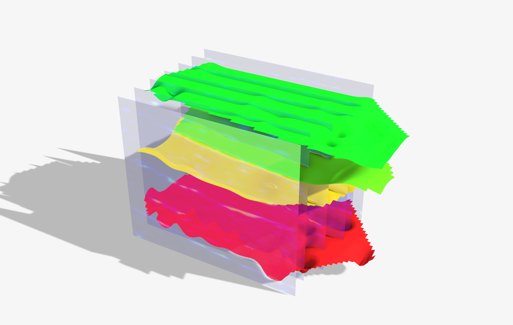

# 51 — Cross-lithology GPR → wire-saw cut plan (marble / travertine / andesite)

The published **cross-lithology** pipeline from the *Automation in Construction* paper: one
GPR ingestion path that reads marble, travertine, and andesite survey records, kriges the
dipping beds, cuts the bench into fracture-bounded slabs, and packs each with the staged
wire-saw guillotine — generalising the single-site marble result to three lithologies.

## What this shows

- `travertine_pipeline.gh` / `andesite_pipeline.gh` — the full pipeline per lithology:
  GPR ingestion → kriged bed surfaces → fracture-bounded benches → wire-saw block pack.
  Derived geometry is internalised; both solve on load (travertine ~3.3 s, 0 errors).
- `travertine_pack.gh` — the packer detail (staged three-stage guillotine on the travertine
  bench).
- `crosslithology.csv` — the 3×3 packer-by-lithology yield matrix (paper Table 3).

The point: the same managed GPR → cut-plan toolchain holds across compact limestone/marble,
porous travertine, and dense andesite — the velocity/frequency preset changes, the pipeline
does not.

## Provenance

Supplement to Murugesan, L. (2026), *An uncertainty-aware digital-fabrication method that
turns ground-penetrating radar surveys into diamond-wire-saw cut plans for dimension stone*,
Automation in Construction. The single-site marble-grid detail is in the predecessor Zenodo
deposit 10.5281/zenodo.20608279; this is the cross-lithology generalisation. GPLv3.

## Try it live

Open either pipeline `.gh` with the Frahan `.gha` deployed; both solve on load. Swap the GPR
preset (`Construct GPR Preset`) for a different stone.

## Related

- Example 08 (`gpr_marble`) / 35 (`gpr_quarry_full_workflow`) — the single-site marble path.
- Example 33/34 (`gpr_marble_guillotine` / `_oblique`) — the earlier marble cut examples.
