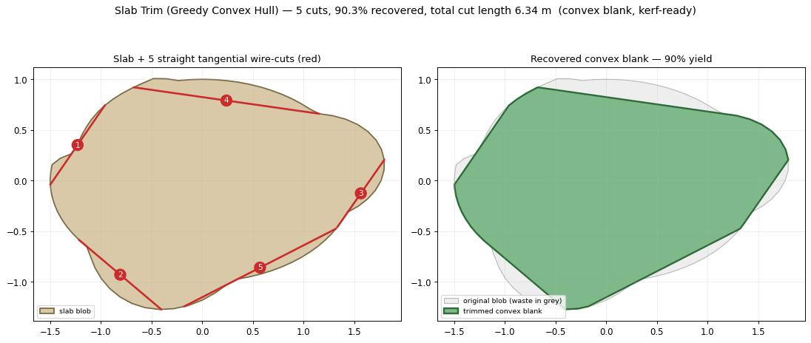

# Slab Trim research dossier — greedy + convex hull, minimum tangential wire-cuts

Research for a future Frahan StonePack **Slab Trim (Greedy Convex Hull)** component. Practical request
from a granite factory in Krishnagiri, Tamil Nadu: trim an irregular/curved scanned slab to a usable
shape with the fewest straight tangential wire-cuts (least time). Anchored on ASME **IDETC2026-193983**,
*"Trimming Stone Using Greedy Algorithm and a Convex Hull of a Discrete Geometry."*

> Note: IDETC2026-193983 itself is **not yet web-indexed** (the conference is Aug 2026), so the method is
> reconstructed from its title + the surrounding, well-developed literature. Findings below are
> adversarially verified (3-vote) from the deep-research run (104 agents, 2026-06-18).

*Headless validation of the Rhino-free core (`tools/Frahan.StonePack.Harness --slabtrim`): an irregular
slab blob trimmed to a convex blank by 5 straight tangential wire-cuts (left), recovering 90.3% of the
area (right). Greedy: clip the deepest reflex vertex with a half-plane cut until convex / cut-budget.*

## 1. Two objectives that do NOT coincide (high confidence)

Yield (recovery ratio, geo-environmental) and value (revenue, economic) are **distinct objectives**: the
slab plan that maximizes recovered area is not the one that maximizes revenue. The component must expose
**recovered-area % (yield)** and a **value/revenue** metric separately (or as a weighting), not one fused
score.
- Elkarmoty, Bonduà & Bruno (2020), *A 3D optimization algorithm for sustainable cutting of slabs from
  ornamental stone blocks*, Resources Policy 65:101533 (SlabCutOpt): 37 slab sizes tested; "a certain slab
  size gave the optimum recovery ratio, whilst another slab size provided the optimum revenue."

## 2. The exact target shape = the potato-peeling / convex-skull problem (high)

"Largest usable convex blank from an irregular slab" is formally **A\*(P) = sup{area(K) : K ⊆ P, K convex}**
— the maximum-area convex polygon **inscribed** in the non-convex simple polygon P (the scanned boundary).
This is the **opposite** of the convex hull, which **circumscribes** (smallest convex polygon *containing*
the boundary). A scanned slab outline IS a simple polygon, so it matches exactly: inscribed convex polygon
= recovered blank; boundary minus blank = waste.
- Goodman (1981, "potato peeling"); Chang & Yap (1986, DCG, "convex skull"); Cabello et al. (arXiv:1406.1368).
- Caveat: potato-peeling maximizes AREA only, with no bound on edge/cut count.

## 3. Exact solvers exist but are impractical; use approximation (high)

- Potato-peeling is **exactly** solvable in **O(n⁷)** (max-area) / O(n⁶) (max-perimeter) — Chang & Yap 1986
  — too slow for a factory tool, and no faster exact algorithm is known.
- A **randomized near-linear (1-ε)-approximation** exists (Cabello et al. 2017): area ≥ (1-ε)·optimal w.p.
  ≥ 2/3 in O(n(log²n + ε⁻³log n + ε⁻⁴)); for constant ε this is **O(n log²n)**. This is the practical route
  to a near-optimal maximal convex blank.

## 4. "Fewest straight cuts within tolerance" = Imai–Iri min-# approximation, solvable EXACTLY (high)

Minimizing the number of straight segments that stay within a tolerance band of the boundary is the
**Imai–Iri min-# polygonal-approximation** problem. It is solvable **optimally** (not just greedily): build
a **shortcut DAG** over the boundary vertices (edge = any within-tolerance chord), then take a **fewest-edges
shortest path**. Complexity O(n³), improvable to O(n²). → gives an **exact optimal baseline** to measure the
greedy cut-selector against.
- Imai & Iri (1988); shortcut/DAG formulations (arXiv:1803.03550).

## 5. Minimum cut-LENGTH (time) = the "cutting out polygons" guillotine model (high)

Cutting a convex target P out of stock Q by straight line-cuts that do not pass through P's interior, each
cut's cost = length of its intersection with the **current** working piece, minimizing total length. A
cutting sequence exists **only if P is convex** (so the trim target should be convex). Trade-off:
**O(1)-factor** approx in O(n³+m); **O(log n)-factor** approx in linear O(n+m).
- Demaine et al., "cutting out polygons," CCCG 2005 (cccg.ca/proceedings/2005/74.pdf).

## 6. It's implementable Rhino-free (high)

- **MIConvexHull** (MIT, netstandard2.0, zero deps, QuickHull, `Create2D`) — consumable from net48 /
  RhinoCommon and from a Rhino-free core.
- Or a **native** monotone-chain / QuickHull (no deps) — the ALharchi *MinimumBoundingBox* GH plugin ships
  its own `ConvexHull2D` for the 2D min-area-rectangle path, proving no third-party dep is needed.
- Convex layers (onion peeling) of n points: **O(n log n)** — cheap outlier-trimming of a noisy scan.

## Recommended algorithm — Slab Trim (Greedy Convex Hull)

**Inputs:** slab boundary Curve or Point list (scanned blob); target mode {convex-hull | min-area rectangle
| given blank polygon}; max cut count K (budget) OR tolerance ε; kerf width w.

**Core** (Rhino-free, e.g. `Frahan.SlabTrim.Core` on Clipper2 + a native QuickHull/monotone-chain hull):
1. Order/clean the boundary points into a simple polygon; optional **convex-layer peel** to drop scan
   outliers (O(n log n)).
2. Compute the **2D convex hull** → each hull edge = one candidate straight tangential wire cut.
3. Choose the **target**: the hull itself, the **min-area rectangle** (rotating calipers), or a supplied
   blank.
4. **Greedy cut loop:** while `cuts < K` and shape not within ε of target — score each candidate half-plane
   cut by **waste-area-removed ÷ cut-length** (yield-per-time), keeping only cuts that **do not enter the
   target interior** (guillotine constraint); apply the best cut, update the current piece (Clipper2
   boolean), recompute candidates from the new boundary.
5. **Terminate:** target reached within ε, budget K exhausted, or no positive-gain cut remains.

**Optional exact baselines:** Imai–Iri shortcut-DAG fewest-edges path (report how close greedy is to the
minimum cut count); Cabello (1-ε) for the best inscribed convex blank.

**Outputs:** ordered cut **Lines** (kerf-offset to the waste side), trimmed polygon, **recovered-area %**,
**total cut length** (time proxy), **cut count**.

**Kerf:** offset each cut line by **w/2 toward the waste side** so the finished part stays on size.

**Fabrication (handheld/wire):** straight tangential passes only; emit cuts **outermost/most-overhanging tab
inward** so the offcut stays stable and the part is never undercut while it still bears load; report **total
cut length** as the time/efficiency metric the Krishnagiri factory optimizes.

## Suggested first version (MVP)

A 2D component on the slab outline with **target = convex hull** (or min-area rectangle), the greedy loop in
3–5 cuts, kerf offset, and the three metrics. Hull + rotating-calipers + Clipper2 booleans only — no exact
solver. Add the Imai–Iri baseline + potato-peel target as v2.

## Honest caveat — convex trim is one of TWO target modes

Trimming to the convex hull is **lossy**: it discards the concave usable material to get a clean convex
blank. That is right only when the next step needs a convex/rectangular blank. For **yield** (what the
factory optimizes) the better targets are:
- **concave kerf-follow** — approximate the actual (concave) boundary with the minimum straight tangent
  kerfs (Imai-Iri min-#, finding 4 above), keeping the irregular shape. A handheld wire CAN cut concave.
- **concave-into-concave nesting** — fit irregular parts into the irregular sheet/offcut, which is the
  hole-aware NFP problem Frahan already solves with `Sheet Nest (Hole-Aware)`.

So the component should expose a **target mode**: `convex blank` (the greedy hull trim above) **or**
`concave kerf-follow` (Imai-Iri). The high-yield nesting path is shown below (raster / pixel heuristic,
which handles arbitrary concavity of both sheet and parts; cf. the "stone -> voxels -> heuristic" row of
ReWeave, MRAC IAAC).

*`research/concave_nest_demo.py` (headless, numpy + matplotlib): 5 of 6 irregular/concave parts nested into
a concave offcut sheet (deep bay + step), 52% area used, with kerf clearance. The honest high-yield
counterpart to convex trim; the canvas version is `Sheet Nest (Hole-Aware)`.*

## References
- Elkarmoty, Bonduà, Bruno (2020) Resources Policy 65:101533 — SlabCutOpt (yield vs value).
- Goodman (1981) Geom. Dedicata 11:99–106 — potato peeling.
- Chang & Yap (1986) Discrete Comput. Geom. 1:155–182 — convex skull O(n⁷).
- Cabello, Cibulka, Kynčl, Saumell, Valtr (2017) SIAM J. Comput. — near-linear (1-ε) potato peeling (arXiv:1406.1368).
- Imai & Iri (1988) — min-# polygonal approximation.
- Demaine, Demaine, Kaplan et al. (2005) CCCG — cutting out polygons.
- MIConvexHull (MIT); ALharchi MinimumBoundingBox (GH).
