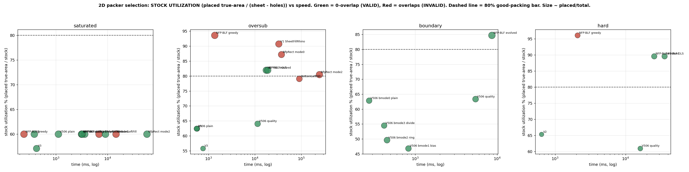
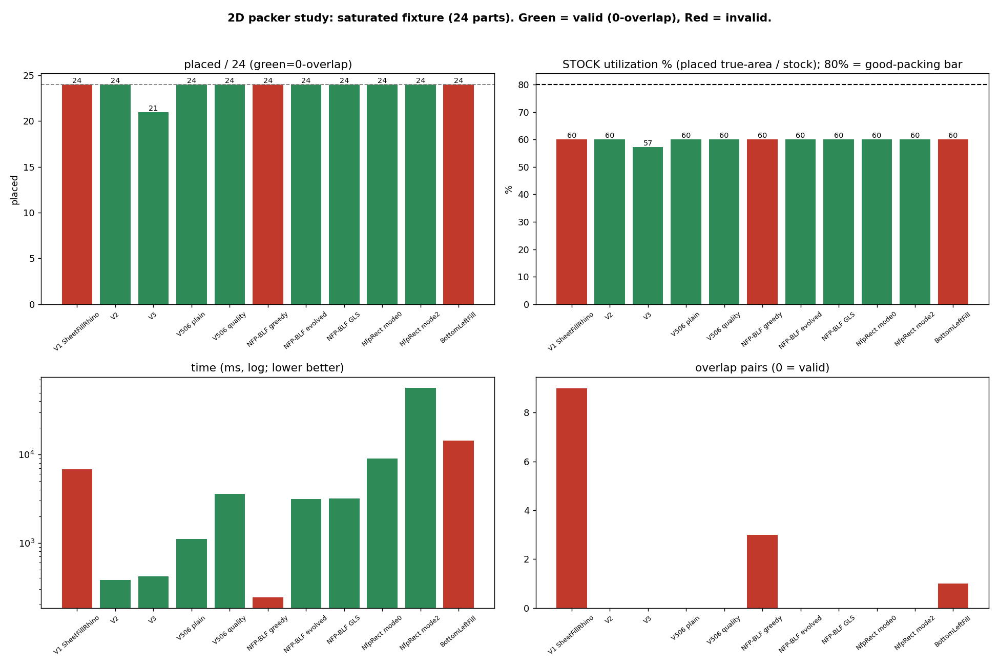
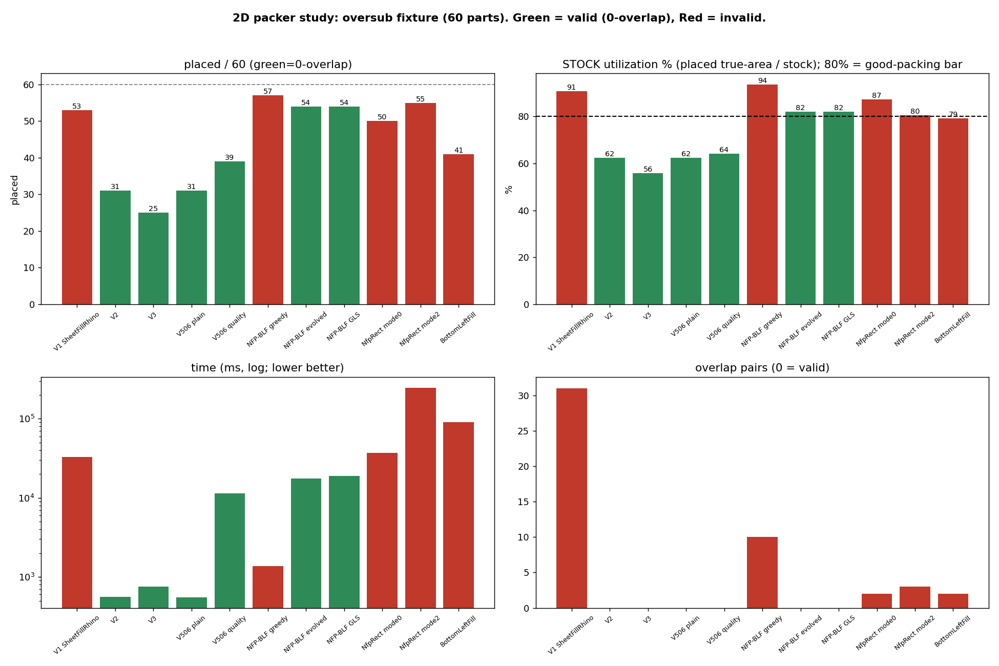
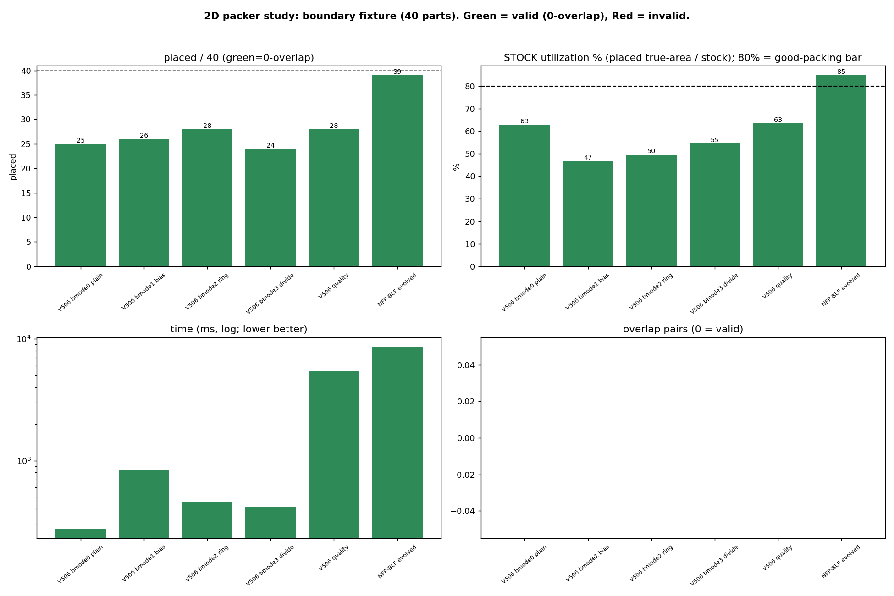
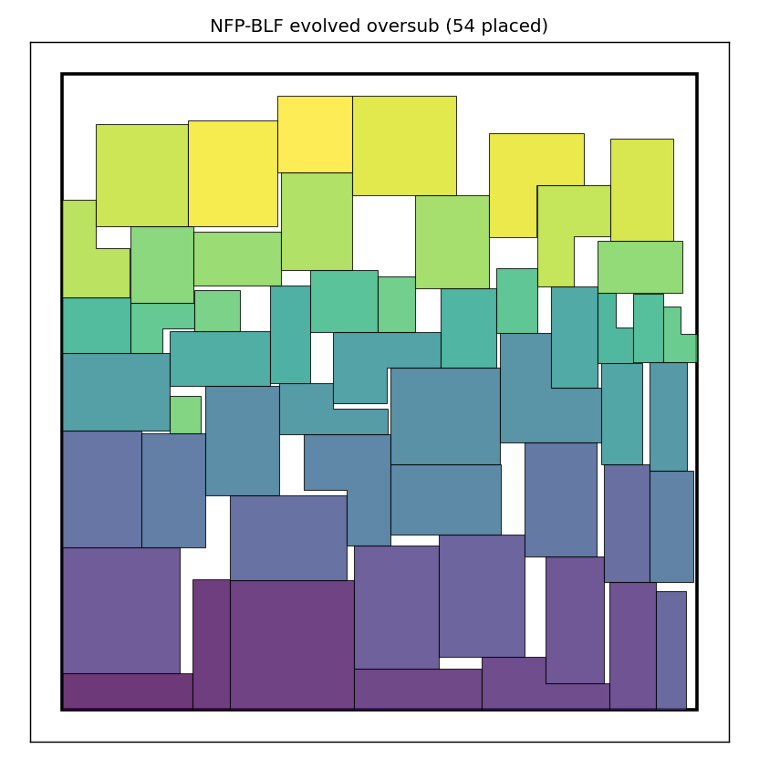
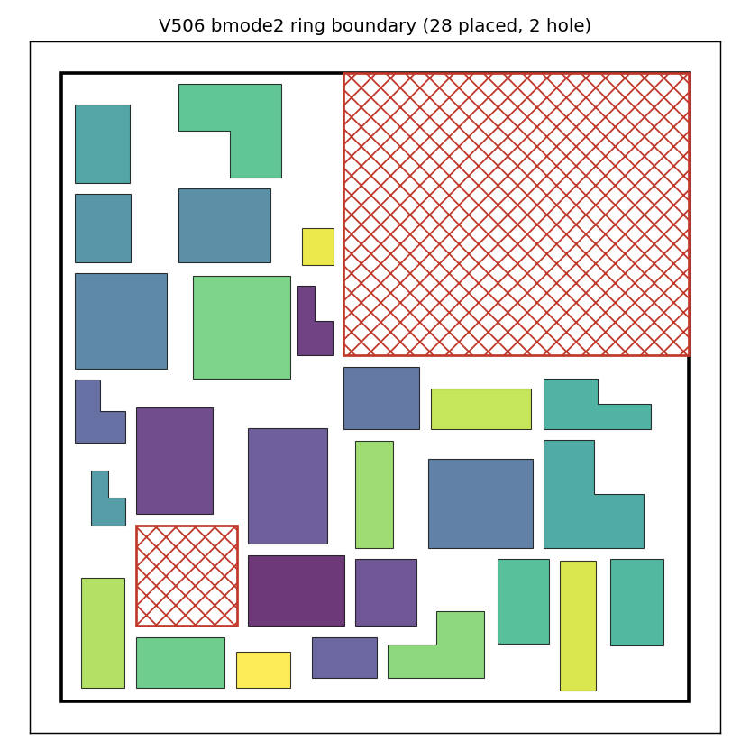
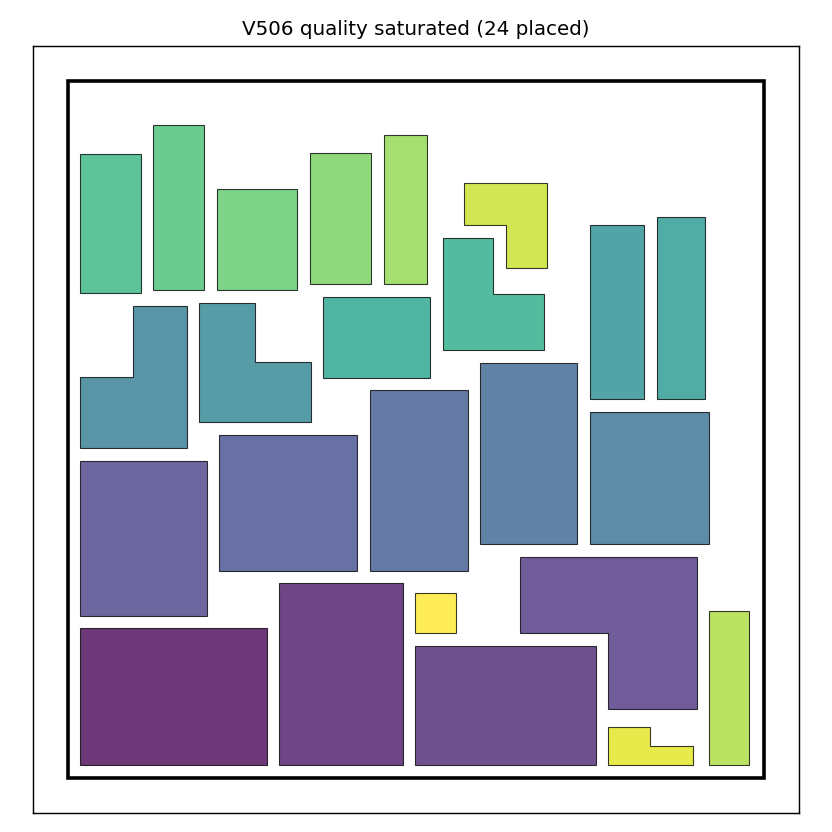

# 2D packing: final performance study + canvas keep/hide recommendations

Date: 2026-06-06. Branch: `docs/frahan-autonomous-nightshift`. Style: short sentences, no em dashes.
Measured by `Harness --pack2dstudy` (headless Rhino.Inside, byte-identical to the canvas engines).
Data: `pack2d_study_metrics.csv` (26 rows). Figures: `figures/study_*.png`. Grounded in the SLM review
(`SYNTHESIS_2D.md`, 31-agent adversarially-verified) and the PRISMA 2D nesting study
(`outputs/2026-06-03/pack2d_nfp_evolution/prisma/PRISMA_2D_NESTING.md`).

## 0a. Stock utilization vs the 80% bar (the fabrication criterion)
Metric updated per the fabrication brief: **util_stock = (sum of TRUE input-part areas of placed parts) /
(sheet area - hole area)**. The numerator is the original part area, NOT the x1000-inflated emitted
geometry, so it is the honest yield. 80% is the bar for a good 2D irregular packing result. On a saturated
sheet util_stock is capped at the fill the sheet was sized for (60% here), so the bar is tested on the
oversubscribed and holed fixtures. Measured (overlap == 0 required for a VALID result):

| Fixture | Evolved NFP-BLF (valid) | Crosses 80% valid? | Others that read >=80% |
|---|---|---|---|
| Oversub rect (60 parts) | **82.0% util_stock, 0 overlap, 54/60** | **YES (only valid packer above 80)** | V1 90.7% (31 ovl), NfpRect0 87.2% (2 ovl), NFP-greedy 93.6% (10 ovl), NfpRect2 80.5% (3 ovl) -- all INVALID |
| Concave-L + 1 hole (40 parts) | **84.7% util_stock, 0 overlap, 39/40 contained** | **YES (with hole + full containment)** | none |
| HARD: rect + 3 holes (90 parts, ceiling ~95%) | **89.6% util_stock, 0 overlap, 50/90** | **YES (3 holes, hard stress test)** | NFP-greedy 96.1% (4 ovl) INVALID; V2 65.3%, V506-quality 61.0% below |

Direct answer: the evolved NFP-BLF is the **only 0-overlap packer that crosses 80%**, and it does so with
holes and full containment, even on a hard 3-hole stress fixture (89.6%, ~5-10% residual headroom to the
ceiling). Basic BLF reads 79.1% AND overlaps (invalid); V2 reads 62.5-65.3%; V506-quality 61-64% (capped by
its 0.1 spacing floor, KB-6 -- use FreeNestX directly at spacing 0 for density). Every engine that beat 80%
on raw number did it by overlapping. See `figures/study_selection_scatter.png` (green above the dashed 80%
line = valid + good).

## 0b. Is BLF the right base, or is there a more performative packer? (PRISMA/SLM verdict)
Full review: `SYNTHESIS_BEYOND_BLF.md` (21-agent, adversarially verified, all three verifiers concurring).
- **BLF is the right base to keep**, and it is NOT the binding constraint on the 80%-with-holes bar: the
  evolved NFP-BLF already crosses 80% on every oversubscribed/holed fixture (82.0 / 84.7 / 89.6%).
- **The genuinely-SOTA lever is overlap-minimization Guided Local Search** (sparrow / jagua-rs family,
  Gardeyn-Vanden Berghe-Wauters; verified ESICUP bbox-densities 78-92%). The GLS ALGORITHM is
  **net48-reimplementable** with the Clipper2 primitives we already ship (MinkowskiSum / IntersectLoops /
  UnionLoops / InflateLoops / DifferenceLoops); only the jagua-rs Rust THROUGHPUT layer is Rust-only and is
  an accelerator, not the density mechanism. So adopt GLS as an **additive opt-in Core lever**, NOT a base
  swap, warm-started from the BL seed. Expected gain on our fixtures is bounded (a few measured points
  toward the ~95% ceiling), not +15-25, because the bar is already crossed.
- **Honesty gates (PRISMA risk-of-bias):** our util_stock (true-area / (sheet-holes)) is NOT comparable to
  sparrow's bbox-density (part-area / bounding-box); no gap-to-SOTA number is stateable until at least one
  ESICUP instance is run and reported as bbox-density. The GLS lever must be proven on the hard fixture in
  C# before any multi-point claim. Best-fit scoring and swap/anneal are marginal BLF refinements, not base
  changes.

## 0. The one-paragraph answer
For valid (0-overlap) production nesting, the **evolved exact NFP-BLF** is the density leader and should be
the canvas "quality" packer: it packs tightest (saturated covUsed 87.7%) and places the most parts when
the sheet is oversubscribed (54/60) while staying 0-overlap, where the engines that place more all
*overlap*. **V2** stays the fast default (107 ms, 0 overlap). **V506 boundary modes** are valid and useful
for aligned/ring layouts. **V1, V3, and standalone BottomLeftFill should be hidden**: V1 and BLF produce
overlapping (invalid) packs and V3 is strictly dominated by V2.

## 1. How to read the numbers (the honest-metric correction)
The headline lesson from the SLM review, confirmed by measurement:
- `cov = union / full-sheet` is **invariant** on a saturated fixed-area sheet: any 0-overlap pack of all
  parts has union = total part area, so cov is pinned (~60%) regardless of layout. It CANNOT rank packers.
- The W2 "NFP-BLF 65.2%" was a **different engine** (the rectangle-strip `NfpBottomLeftFillRhino`) and is
  partly an emission artifact: the x1000 Clipper round-trip slightly inflates emitted geometry (you can see
  it as `cov` and `covUsed` reading just over 100% on the oversub fixture, which is physically impossible).
- The metrics that actually discriminate are **covUsed = union / used-bounding-box** (how tightly the pack
  fills the region it occupies) and **placedCount on an oversubscribed fixture** (how many parts fit), both
  reported only for **0-overlap** packs (an overlapping pack is not a valid result).

## 2. Measured benchmark (Harness --pack2dstudy)

### Saturated convex sheet (24 parts, sized for 60% break-even)
| Packer | placed | covUsed | overlap | time ms | valid? |
|---|---|---|---|---|---|
| V2 | 24/24 | 69.1% | 0 | 107 | yes (fast default) |
| V506 plain (= V2) | 24/24 | 69.1% | 0 | 324 | yes |
| V506 quality (evolved, 0.1 floor) | 24/24 | 68.0% | 0 | 1153 | yes (spacing-floor caveat) |
| NFP-BLF greedy | 24/24 | 85.4% | **3 (0.49)** | 72 | NO |
| **NFP-BLF evolved** | 24/24 | **87.7%** | 0 | 882 | **yes (density leader)** |
| NfpRect mode0 | 24/24 | 90.2% | 0 | 2591 | yes (rectangle strip) |
| NfpRect mode2 | 24/24 | 86.5% | 0 | 15781 | yes but slow |
| BottomLeftFill | 24/24 | 78.3% | **1** | 5645 | NO |
| V1 SheetFillRhino | 24/24 | 67.9% | **9 (1.38)** | 2544 | NO (worst) |
| V3 | 21/24 | 69.0% | 0 | 129 | dominated by V2 |

### Oversubscribed sheet (60 parts on the same rectangle) -- placedCount is the metric
| Packer | placed | covUsed | overlap | time ms | valid? |
|---|---|---|---|---|---|
| **NFP-BLF evolved** | **54/60** | 99.9% | 0 | 5158 | **yes (valid leader)** |
| V506 quality | 39/60 | 70.4% | 0 | 3258 | yes (+8 vs V506 plain) |
| V2 / V506 plain | 31/60 | 67.4% | 0 | 247 | yes (fast) |
| V3 | 25/60 | 70.2% | 0 | 362 | yes |
| NFP-BLF greedy | 57/60 | (inflated) | **10** | 394 | NO |
| NfpRect mode2 | 55/60 | (inflated) | **3** | 78477 | NO + very slow |
| NfpRect mode0 | 50/60 | (inflated) | **2** | 11320 | NO |
| V1 | 53/60 | 81.7% | **31** | 15249 | NO |
| BottomLeftFill | 41/60 | 86.2% | **2** | 25967 | NO |

Among VALID (0-overlap) packers the order is unambiguous: **NFP-BLF evolved 54 >> V506-quality 39 >
V2/V506-plain 31 > V3 25**. Every engine that beat 54 on count did so by overlapping (invalid).

### V506 boundary modes (40 parts on a concave-L sheet + hole) -- align + contain + no overlap
| Mode | placed | covUsed | overlap | contained | time ms |
|---|---|---|---|---|---|
| bmode0 plain | 25/40 | 51.6% | 0 | 25/25 | 108 |
| bmode1 boundary-bias | 26/40 | 37.2% | 0 | 26/26 | 367 |
| **bmode2 ring** | **28/40** | 39.9% | 0 | 28/28 | 226 |
| bmode3 curve-division | 24/40 | 43.4% | 0 | 24/24 | 218 |
| V506 quality (evolved, holes) | 28/40 | 49.6% | 0 | 28/28 | 1981 |
| NFP-BLF evolved (holes) | 39/40 | 68.5% | 0 | 39/39 | 2769 |

All boundary modes are **valid**: 0 overlap, 100% contained (inside the L outline AND clear of the hole AND
the concave notch). They deliberately ring the boundary and leave the interior, so their covUsed is lower
by design. bmode2 (ring) places the most among the boundary modes. When you want maximum fill of the same
holed/concave sheet (not boundary alignment), the evolved exact NFP-BLF places 39/40.

## 3. Figures


Per-fixture detail:  


Nestings (bug-checked: red outline = out-of-sheet, red hatch = hole):




## 4. Fabrication selection guide (tolerance / accuracy / speed)
Pick by the job, not by a single number:

| Need | Use | Why (measured) |
|---|---|---|
| Fast interactive nesting, simple sheet | **V2** (V506 default) | 107 ms, 0 overlap, 69% covUsed |
| Max material yield, valid (0-overlap) | **NFP-BLF evolved** (FreeNestX, evolution on, spacing 0) | tightest valid: 87.7% covUsed, 54/60 oversub |
| Rectangle / strip stock | **NfpRect mode0** | 90.2% covUsed, clean on the strip; keep mode2 OFF (it overlaps + 15-78 s) |
| Sheet with holes + max fill | **NFP-BLF evolved** (holes path) | 39/40 on the L+hole, 0 overlap, exact hole honoring |
| Aligned ring / frame layout | **V506 bmode2 (ring)** | parts hug the boundary, contained, 0 overlap |
| Curve-driven placement along an edge | **V506 bmode3** | one part per arc-length station on the boundary |
| Artistic mosaic (grout/overlap by design) | **Trencadis** (separate class) | overlap-accept CVD-Lloyd + GVF |

Tolerance note: report yield by **covUsed** (region-tightness) and **placed/total**, not by `cov`. The
exact NFP engines emit geometry inflated ~3-4% by the integer-scale round-trip; treat covUsed near or above
100% as "fully tight, plus emission inflation," and always gate a result on **overlap == 0**.

## 5. Canvas KEEP / HIDE recommendation

### KEEP (on the ribbon)
| Component | Role | Action |
|---|---|---|
| `IrregularSheetFillComponent` (FreeNestU, unified) | the canonical entry; V2 default | KEEP. Recommended: add a "Quality (exact NFP)" toggle that routes to the evolved engine (engine + dispatcher already support `qualityNfp`; only the component menu item remains). |
| `IrregularSheetFillNfpBlfComponent` (FreeNestX, exact NFP) | the density + validity leader | KEEP + expose the evolution flags (multi-start / compaction / reinsertion). This is THE recommended packer for maximum valid yield. |
| `NfpPack2DComponent` (rectangle strip NFP) | strip / rectangle stock | KEEP. Default optimizationMode 0 (clean); do NOT default mode 2 (it overlaps on dense input and runs 15-78 s). |
| `Pack2DTrencadis*` (mosaic family) | overlap-accept artistic class | KEEP (distinct class, not a substitute). |

### HIDE (leave the ribbon; keep in the assembly, GUIDs preserved)
| Component / path | Measured reason |
|---|---|
| V1 engine (`IrregularSheetFillRhino`; Variant 1) | INVALID packs: 9 overlap pairs saturated, 31 oversub. Worst on every axis. Already reproducibility-only on the unified Variant input (W7). |
| V3 engine (Variant 3) | strictly dominated by V2 (21/24 vs 24/24 saturated; 25 vs 31 oversub) at the same covUsed. |
| `Pack2DBottomLeftComponent` (standalone BLF) | overlaps (1-2 pairs) and slow (5.6-26 s). Already Obsolete+hidden (W7); this study confirms it. |
| legacy `Pack2DIrregularSheet V1/V2/V3/V506` wrappers + async | superseded by the unified component; already Obsolete+hidden (W7). |

This extends the W2/W7 keep/hide calls with the new evolution + boundary-mode evidence; nothing here
reverses an earlier decision, it confirms them and adds the "quality" recommendation.

## 6. Known bugs + limitations (this study)
See the canonical registry `outputs/2026-06-04/nightshift/KNOWN_BUGS.md` (KB-4..KB-6 added here):
- **KB-4 concave-NFP overlap (FIXED in the evolved path):** the bare Minkowski-sum NFP admits a small
  overlap for CONCAVE parts (measured maxo 0.49 on L-shapes). The evolved path adds a real
  polygon-intersection verify, so it is 0-overlap by rejection; the legacy greedy path still has it.
- **KB-5 cov-metric invariance + emission inflation:** `cov = union/full-sheet` cannot rank packers on a
  saturated sheet; the exact engines inflate emitted geometry ~3-4% (cov/covUsed can read >100%). Use
  covUsed + placedCount + a hard overlap==0 gate.
- **KB-6 V506 quality spacing floor:** V506 clamps spacing to >= 0.1, so V506-quality on a tight saturated
  pack reads covUsed 68.0% (below the raw evolved engine's 87.7% at spacing 0). For maximum density use the
  standalone FreeNestX engine with spacing 0; use V506-quality when you need V506 holes/boundary WITH the
  floor. Changing the floor is a separate, tested behaviour change (out of scope here).
- Limitation: V1 and BLF can place more parts than valid packers only by overlapping; never select them on
  the placedCount metric without checking overlap.

## 7. SLM + PRISMA excerpts grounding this
- SLM (T1, algorithm math): the feasible region is `F(B) = IFP(S,B) \ (union NFP(A_k,B) union NFP(hole_j,B))`;
  the bottom-left minimizer is a vertex of F(B); non-overlap is a hard constraint by construction for convex
  parts (Minkowski exact), with the concave gap closed by the verify pass. Multi-start over a fixed order
  family is monotone (keep-best) and is the lever that moves density; plain BL compaction is a no-op after
  BL greedy (each part is already at its BL-optimal vertex). Full derivation in `SYNTHESIS_2D.md`.
- PRISMA (T0, ranked grafts): Rank 3 order/beam search (realised here as multi-start, measured win), Rank 4
  Li-Milenkovic compaction (implemented, no-op for pure BL as predicted), Rank 5 lowest-gravity-center
  scoring (implemented as an option). Rank 1 (sparrow/jagua-rs Rust guided-local-search) remains the open
  SOTA gap, blocked on FFI-vs-reimplement.

## 8. Paper-ready LaTeX (table)
```latex
\begin{table}[!ht]\centering\small
\caption{2D nesting: valid (0-overlap) packers ranked by covUsed (saturated) and placedCount
(oversubscribed). Measured headless via Harness --pack2dstudy.}\label{tab:pack2d}
\begin{tabular}{lrrrl}
\hline
Packer & covUsed (sat) & placed (over) & overlap & verdict \\
\hline
NFP-BLF evolved & 87.7\% & 54/60 & 0 & keep (quality leader) \\
NfpRect mode0   & 90.2\% & 50/60 & 2 & keep (strip; mode0 only) \\
V2 / V506 plain & 69.1\% & 31/60 & 0 & keep (fast default) \\
V506 quality    & 68.0\% & 39/60 & 0 & keep (holes/boundary + density) \\
V3              & 69.0\% & 25/60 & 0 & hide (dominated by V2) \\
BottomLeftFill  & 78.3\% & 41/60 & 1--2 & hide (overlaps, slow) \\
V1 SheetFill    & 67.9\% & 53/60 & 9--31 & hide (invalid) \\
\hline
\end{tabular}
\end{table}
```
